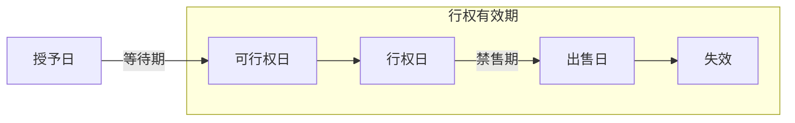
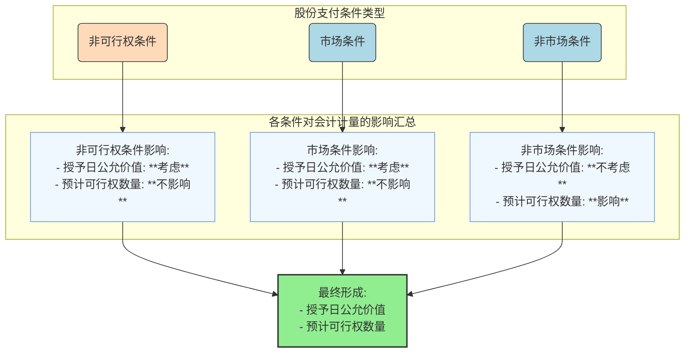
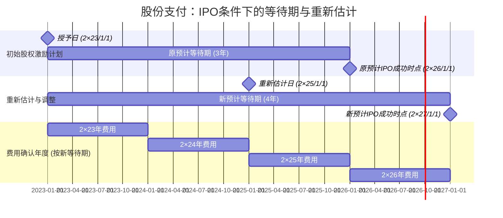

> [!note]
> (1) 股份支付的确认和计量原则;
> (2) 可行权条件的种类、处理和修改；
> (3) 股份支付的一般会计处理;
> (4) 授予限制性股票进行股权激励的会计处理；
> (5) 集团股份支付的会计处理等。
# 1. 股份支付概述
## 1.1  股份支付的概念及特征

- 概念
	- 股份支付，是指企业为获取职工或其他方提供服务而授予权益工具或者承担以权益工具为基础确定的负债的交易。
> 用最通俗的话来说，股份支付就是公司 **“拿股票当钱花”**。即：**公司用“未来的身价（股权/股价）”，购买你“现在的服务”。**
- 特征
	1. 股份支付是企业与职工或其他方之间发生的交易。
	2. 股份支付是以获取职工或其他方服务为目的的交易。
	3. 股份支付交易的对价或其定价与企业自身权益工具未来的价值密切相关。
## 1.2  股份支付的四个主要环节

以薪酬性股票期权为例，典型的股份支付通常涉及四个环节：（1）授予；（2）可行权；（3）行权；（4）出售。

- 授予日，是指股份支付协议获得批准的日期。其中“获得批准”，是指企业与职工或其他方就股份支付的协议条款和条件已达成一致，该协议获得股东会或类似机构的批准。
	- 实务中，常见上市公司**股东会**审议通过股权激励方案，并确定了授予价格，但未确定拟授予股份的激励对象及股份数量，股东会授权**董事会**后续确定具体激励对象及股份数量。在此情况下，授予日为董事会后续确定具体激励对象及股份数量，并将经批准的股权激励方案的具体条款或条件与员工进行沟通并达成一致的日期。
- 可行权日，是指可行权条件得到满足、职工或其他方具有从企业取得权益工具或现金权利的日期。从授予日至可行权日的时段，是可行权条件得到满足的期间，因此称为“等待期”。有的股份支付协议是一次性可行权，有的则是分批可行权。
	- “**一次授予、分期行权**”，即在授予日一次授予员工若干权益工具，之后每年分批达到可行权条件。每个批次是否可行权的结果通常是相对独立的，即每一期是否达到可行权条件并不会直接影响其他几期是否能够达到可行权条件。企业在会计处理时应将其作为**同时授予的几个独立的**股份支付计划。
- 行权日，是指职工和其他方行使权利、获取现金或权益工具的日期。
- 出售日，是指股票的持有人将行使期权所取得的期权股票出售的日期。
## 1.3 股份支付工具的主要类型

| 比较维度     | **以权益结算的股份支付**                  | **以现金结算的股份支付**                        |
| :------- | :------------------------------ | :------------------------------------ |
| **核心定义** | 企业为获取服务，以**股份或其他权益工具**作为对价进行结算。 | 企业为获取服务，承担以股份为基础计算确定的**交付现金或其他资产**义务。 |
| **结算方式** | 给“股票/期权” (给股权)                  | 给“钱/资产” (给现金)                         |
| **典型工具** | 1. **限制性股票**<br>2. **股票期权**     | 1. **模拟股票**<br>2. **现金股票增值权**         |
| **记忆口诀** | 拿股权，做股东                         | 拿现金，不入股                               |

> [!note]
> 模拟股票
> - **通俗解释**：**“虚拟干股”**。
> - **怎么玩**：公司在账本上记一笔：“假设你有1万股”。这1万股并不真实存在，你也没有表决权。但是，如果真股票分红了，公司也给你发等额奖金；如果真股票涨了，公司最后按**全额市值**给你发奖金。
> - **直击本质**：**全额现金奖励**。虽然叫“股票”，其实发的是钱。你的收益 = **股价全值** + 分红。
> 
>  现金股票增值权
> - **通俗解释**：**“虚拟期权”**。
> - **怎么玩**：逻辑和股票期权一模一样，唯一的区别是**不用你掏钱买股票**。公司直接计算：现在的股价减去授予时的股价，中间的**差价**（增值部分），直接发钱给你。
> - **直击本质**：**差额现金奖励**。你不需要出本金，只拿**涨幅**部分的钱。
# 2. 股份支付的确认和计量原则
## 2.1 权益结算的股份支付的确认和计量原则
### 2.1.1 换取职工服务的股份支付的确认和计量原则

- 对于换取职工服务的股份支付，企业应当以股份支付所授予的权益工具的**公允价值**计量。
- 企业应在等待期内的每个资产负债表日，以对可行权权益工具**数量的最佳估计**为基础，按照权益工具在**授予日的公允价值**，将当期取得的服务计入**相关资产成本或当期费用**，同时计入**资本公积**（其他资本公积）。

> [!example] 例题·计算分析题
> **【题干】**
> $A$ 公司为一上市公司。$2 \times 17$ 年 $1$ 月 $1$ 日，$A$ 公司向其 $200$ 名管理人员每人授予 $100$ 份股票期权，这些职员从 $2 \times 17$ 年 $1$ 月 $1$ 日起在 $A$ 公司连续服务**三年**，即可以 $5$ 元/股购买 $100$ 股 $A$ 公司股票，从而获益。$A$ 公司估计该期权在授予日的公允价值为 $18$ 元/份。
> - **第一年**：有 $20$ 名职员离开 $A$ 公司，$A$ 公司估计三年中离开的职员的比例将达到 $20\%$；
> - **第二年**：又有 $10$ 名职员离开公司，$A$ 公司将估计的职员离开比例修正为 $15\%$；
> - **第三年**：又有 $15$ 名职员离开。
> 
> > [!check]- 答案与解析
> > **正确答案：** 见下方深度解析。
> >
> > **深度解析：**
> >
> > **第一步：确定核心要素**
> > 1. **可行权条件**：属于**服务期限条件**，等待期为 $3$ 年（$2 \times 17$ 年至 $2 \times 19$ 年）。
> > 2. **公允价值锁定**：权益结算的股份支付，应按**授予日**的公允价值 $18$ 元/份计量，后续期间不确认公允价值变动。
> > 3. **初始授予总数**：$200 \text{ 人} \times 100 \text{ 份/人} = \mathbf{20,000 \text{ 份}}$。
> >
> > **第二步：逐年计算股份支付费用**
> > 
> > 4. **$2 \times 17$ 年（第一年）：**
> >    - 预计可行权人数：$200 \times (1 - 20\%) = \mathbf{160 \text{ 人}}$
> >    - 累计应确认费用：$160 \times 100 \times 18 \times \frac{1}{3} = \mathbf{96,000 \text{ 元}}$
> >    - 当期费用：$96,000 - 0 = \mathbf{96,000 \text{ 元}}$
> >
> > 2. **$2 \times 18$ 年（第二年）：**
> >    - 修正预计可行权人数：$200 \times (1 - 15\%) = \mathbf{170 \text{ 人}}$
> >    - 累计应确认费用：$170 \times 100 \times 18 \times \frac{2}{3} = \mathbf{204,000 \text{ 元}}$
> >    - 当期费用：$204,000 - 96,000 = \mathbf{108,000 \text{ 元}}$
> >
> > 3. **$2 \times 19$ 年（第三年）：**
> >    - 实际可行权人数：$200 - 20 - 10 - 15 = \mathbf{155 \text{ 人}}$
> >    - 累计应确认费用：$155 \times 100 \times 18 \times \frac{3}{3} = \mathbf{279,000 \text{ 元}}$
> >    - 当期费用：$279,000 - 204,000 = \mathbf{75,000 \text{ 元}}$
> >
> > **第三步：账务处理（会计分录）**
> > 
> > - **$2 \times 17$ 年 $1$ 月 $1$ 日（授予日）：**
> >   除立即可行权的股份支付外，**不作账务处理**。
> >
> > - **等待期内各年年末（$2 \times 17$ 至 $2 \times 19$）：**
> >   借：管理费用等 （金额见上表当期费用）
> >   　　贷：**资本公积——其他资本公积**
> >
> > - **$2 \times 20$ 年行权时：**
> >   - 收到现金：$155 \times 100 \times 5 = \mathbf{77,500 \text{ 元}}$
> >   - 结转其他资本公积：$\mathbf{279,000 \text{ 元}}$
> >   - 增加股本：$155 \times 100 \times 1 = \mathbf{15,500 \text{ 元}}$
> >   
> >   **会计分录：**
> >   借：银行存款 $\mathbf{77,500}$
> >   　　资本公积——其他资本公积 $\mathbf{279,000}$
> >   　　贷：股本 $\mathbf{15,500}$
> >   　　　　**资本公积——股本溢价 $\mathbf{341,000}$**（倒挤额）
> >
> > **💡 易错点提示：**
> > 1. **价值基准**：权益结算股份支付的费用计算始终使用**授予日公允价值**，不受后续股价波动影响。
> > 2. **人数估计**：等待期内每个资产负债表日都要根据最新离职率重新估计，并采用**追溯调整法**的思想计算累计费用。
> > 3. **行权结转**：行权时必须将等待期内累计确认的“资本公积——其他资本公积”**全额转入**“资本公积——股本溢价”。

### 2.1.2 换取其他方服务的股份支付的确认和计量原则

- 对于换取其他方服务的股份支付，企业应当以股份支付所换取**服务的公允价值**计量。企业应当按照其他方服务在取得日的公允价值，将取得的服务计入相关资产成本或费用。
- 如果其他方服务的公允价值不能可靠计量，但权益工具的公允价值能够可靠计量，应当按照权益工具在服务取得日的公允价值，将取得的服务计入相关资产成本或费用。

> [!note]
> - **职工服务**（发福利）：你很难给一个员工的“未来三年的忠诚与努力”单独标价。因为职工服务的价值具有高度的不确定性和不可分割性，所以准则规定“退而求其次”，以**企业给出的代价**（权益工具的公允价值）来倒推服务的价值。
> - **其他方服务**（买东西）：外部供应商提供的服务（如法律咨询、资产评估、技术开发）通常在市场上是有“明码标价”的。

## 2.2 现金结算的股份支付的确认和计量原则

企业应当在等待期内的每个资产负债表日，以对可行权情况的最佳估计为基础，按照企业承担负债的公允价值，将当期取得的服务计入相关资产成本或当期费用，同时计入负债（**应付职工薪酬**），并在结算前的每个资产负债表日和结算日对负债的公允价值重新计量，将其变动计入损益（**公允价值变动损益**）。

> [!note]- 权益结算和现金结算为什么采取不一样的计量原则
> 权益结算（以股换服务）和现金结算（以钱换服务）之所以计量原则迥异，核心在于会计学中对 **“权益”**和**“负债”**这两个会计要素本质属性的界定不同。
> 
> 我们可以从以下三个维度来深度拆解：
> 
> ### 01 核心结论：风险归属决定计量方式
> 
> *   **权益结算**：风险由**员工**承担。授予日后，股价涨跌与企业无关，企业只负责“给股份”，所以价值**锁定在授予日**。
> *   **现金结算**：风险由**企业**承担。股价越高，企业要付的钱越多，这是一种实打实的债务，所以价值必须**随市波动（公允价值变动）**。
> ### 02 深度逻辑论证
> 
> #### 1. 权益的“非重估性” vs. 负债的“现时义务性”
> *   **权益结算（资本公积）**：根据会计基本理论，所有者权益是企业资产扣除负债后的剩余权益。一旦授予日的公允价值确定，它就代表了股东愿意稀释的权利大小。会计准则规定，**企业不确认自身权益工具的公允价值变动损益**（你不能因为自家股票涨了就说自己亏了，或者跌了就说自己赚了）。
> *   **现金结算（应付职工薪酬）**：这是一种负债。负债必须反映企业在资产负债表日预计要流出的经济利益。既然要给的钱是挂钩股价的，那么股价变了，企业的“还钱压力”就变了，必须重新计量。
> #### 2. 计量基准日的逻辑（授予日 vs. 结算日）
> *   **权益结算**：看重的是**“协议达成时”**双方认可的价值。就像你签合同买房，房价定在签约那天，后面房价涨跌，你付给开发商的钱（或股份）是不变的。
> *   **现金结算**：看重的是**“最终支付时”**的价值。这更像是一个对赌协议，不到给钱的那一刻，谁也不知道企业到底要掏多少腰包。
> #### 3. 利润表的影响（管理费用 vs. 公允价值变动损益）
> *   **权益结算**：费用只受“人数估计”影响，单价是不变的。
> *   **现金结算**：费用既受“人数”影响，又受“股价”影响。在可行权日后，权益结算不再调账，而现金结算还要继续确认**公允价值变动损益**，直到钱给出去为止。
> ### 03 总结对比表
> 
> | 维度 | 权益结算（如：股票期权） | 现金结算（如：现金增值权） |
> | :--- | :--- | :--- |
> | **会计科目** | 资本公积——其他资本公积 | 应付职工薪酬 |
> | **计量单价** | **授予日**公允价值（一锁到底） | **等待期内每个资产负债表日**公允价值 |
> | **后续变动** | 不确认公允价值变动 | 确认公允价值变动 |
> | **本质属性** | 股东财富的内部重新分配 | 企业资源的外部流出 |
> 


> [!example] 例题·计算分析题
> **【教材例 10-6】**
> $2 \times 20$ 年初，$A$ 公司为其 $200$ 名中层以上职员每人授予 $100$ 份**现金股票增值权**。
> 1. **行权条件**：职员需自 $2 \times 20$ 年 $1$ 月 $1$ 日起连续服务 $3$ 年。
> 2. **行权期限**：应在 $2 \times 24$ 年 $12$ 月 $31$ 日之前行使。
> 3. **相关数据**：如下表所示（单位：元）：
> 
> | 年份 | 现金股票增值权公允价值 | 支付现金（每份） |
> | :--- | :--- | :--- |
> | $2 \times 20$ | $14$ | - |
> | $2 \times 21$ | $15$ | - |
> | $2 \times 22$ | $18$ | $16$ |
> | $2 \times 23$ | $21$ | $20$ |
> | $2 \times 24$ | - | $25$ |
> 
> 4. **职员变动情况**：
> - **第一年**：$20$ 名职员离开，估计三年中还将有 $15$ 名离开。
> - **第二年**：又有 $10$ 名职员离开，估计还将有 $10$ 名离开。
> - **第三年**：又有 $15$ 名职员离开。年末，$70$ 人行使了增值权。
> - **第四年**：年末，$50$ 人行使了增值权。
> - **第五年**：年末，剩余 $35$ 人全部行使了增值权。
> 
> > [!check]- 答案与解析
> > **正确答案：**
> > 
> > **深度解析：**
> > 本题属于**现金结算的股份支付**，应当在等待期内的每个资产负债表日，以对可行权情况的最佳估计为基础，按照当日**公允价值**计算。
> > 
> > **第一步：$2 \times 20$ 年（等待期第 1 年）**
> > - 预计可行权人数：$200 - 20 - 15 = 165$ 人。
> > - 应付职工薪酬余额：$165 \times 100 \times 14 \times 1/3 = 77,000$ 元。
> > - **账务处理**：
> >   借：管理费用 $77,000$
> >   　　贷：应付职工薪酬——股份支付 $77,000$
> > 
> > **第二步：$2 \times 21$ 年（等待期第 2 年）**
> > - 预计可行权人数：$200 - 20 - 10 - 10 = 160$ 人。
> > - 应付职工薪酬累计余额：$160 \times 100 \times 15 \times 2/3 = 160,000$ 元。
> > - 当期费用：$160,000 - 77,000 = 83,000$ 元。
> > - **账务处理**：
> >   借：管理费用 $83,000$
> >   　　贷：应付职工薪酬——股份支付 $83,000$
> > 
> > **第三步：$2 \times 22$ 年（等待期第 3 年，可行权日）**
> > - 实际可行权人数：$200 - 20 - 10 - 15 = 155$ 人。
> > - **1. 支付现金部分**：$70$ 人行权。
> >   现金支出：$70 \times 100 \times 16 = 112,000$ 元。
> > - **2. 期末留存负债**：剩余 $155 - 70 = 85$ 人未行权。
> >   应付职工薪酬余额：$85 \times 100 \times 18 = 153,000$ 元。
> > - **3. 当期费用挤算**：$153,000（余额） + 112,000（支付） - 160,000（期初） = 105,000$ 元。
> > - **账务处理**：
> >   借：应付职工薪酬——股份支付 $112,000$
> >   　　贷：银行存款 $112,000$
> >   借：管理费用 $105,000$
> >   　　贷：应付职工薪酬——股份支付 $105,000$
> > 
> > **第四步：$2 \times 23$ 年（可行权日后）**
> > - **1. 支付现金部分**：$50$ 人行权。
> >   现金支出：$50 \times 100 \times 20 = 100,000$ 元。
> > - **2. 期末留存负债**：剩余 $85 - 50 = 35$ 人未行权。
> >   应付职工薪酬余额：$35 \times 100 \times 21 = 73,500$ 元。
> > - **3. 公允价值变动**：$73,500 + 100,000 - 153,000 = 20,500$ 元。
> > - **账务处理**：
> >   借：应付职工薪酬——股份支付 $100,000$
> >   　　贷：银行存款 $100,000$
> >   借：**公允价值变动损益** $20,500$
> >   　　贷：应付职工薪酬——股份支付 $20,500$
> > 
> > **第五步：$2 \times 24$ 年（行权期结束）**
> > - **1. 支付现金部分**：剩余 $35$ 人全部行权。
> >   现金支出：$35 \times 100 \times 25 = 87,500$ 元。
> > - **2. 期末留存负债**：$0$ 元。
> > - **3. 公允价值变动**：$0 + 87,500 - 73,500 = 14,000$ 元。
> > - **账务处理**：
> >   借：应付职工薪酬——股份支付 $87,500$
> >   　　贷：银行存款 $87,500$
> >   借：**公允价值变动损益** $14,000$
> >   　　贷：应付职工薪酬——股份支付 $14,000$
> > 
> > **💡 易错点提示：**
> > 1. **科目区分**：等待期内公允价值变动计入**管理费用**；可行权日（等待期满）之后，公允价值变动计入**公允价值变动损益**。
> > 2. **负债计量**：现金结算股份支付在结算前的每个资产负债表日均需按**当日公允价值**重新计量，而非授予日公允价值。
> > 3. **人数计算**：在计算期末负债余额时，一定要扣除**已行权**的人数。

# 3. 可行权条件的种类、处理和修改

## 3.1 可行权条件的含义及种类

可行权条件，是指能够确定企业是否得到职工或其他方提供的服务，且该服务使职工或其他方具有获取股份支付协议规定的权益工具或现金等权利的条件。反之，为非可行权条件，如取得股权后应履行的竞业限制协议和对行权后股权转让的限制等。

可行权条件包括服务期限条件和业绩条件。
- 服务期限条件，是指职工或其他方完成规定服务期限才可行权的条件。
- 业绩条件，是指职工或其他方完成规定服务期限且企业已经达到特定业绩目标才可行权的条件，具体包括市场条件和非市场条件。


## 3.2 市场条件和非市场条件及其处理

### 3.2.1 市场条件

 (1) 市场条件的含义

市场条件，是指行权价格、可行权条件以及行权可能性**与权益工具的市场价格相关**的业绩条件，如股份支付协议中关于股价上升至何种水平职工或其他方可相应取得多少股份的规定。

 (2) 市场条件的处理

①企业在确定权益工具在授予日的公允价值时，应考虑股份支付协议中规定的**非可行权条件**和可行权条件中的**市场条件**的影响，而不考虑非市场条件的影响。
②非可行权条件和可行权条件中的市场条件是否得到满足，不影响企业对预计可行权情况（即授予的权益工具数量）的估计。授予的权益工具数量的估计只考虑**非市场条件**。
### 3.2.2 非市场条件

 (1) 非市场条件的含义

非市场条件，是指除市场条件之外的其他业绩条件，如股份支付协议中关于达到最低盈利目标或销售目标才可行权的规定。

 (2) 非市场条件的处理

企业在确定权益工具在授予日的公允价值时，应考虑股份支付协议中规定的非可行权条件和可行权条件中的市场条件的影响，而不考虑非市场条件的影响。但非市场条件是否得到满足，影响企业对预计可行权情况的估计。

股份支付存在非可行权条件的，只要职工或其他方满足了所有可行权条件中的非市场条件（如服务期限等），企业应当确认已得到服务相对应的成本费用。


> [!note] 如何理解预计可行权人数时不考虑市场条件（如股价上涨到某一价格才能行权）？
> 
> - 授予日通过期权定价模型（已考虑股价不达标的概率），将公允价值定为15元/股（而非30元/股）。
> - 这意味着"股价可能不达标"的风险，已通过**降低单价**体现，无需再通过**减少数量**体现。


> [!example] 例题·计算分析题
> 2×24 年 1 月，为激励高管，A 公司与其管理层成员签署股份支付协议，规定如果管理层成员在其后 3 年中都在公司中任职服务，并且公司股价每年均提高 10% 以上，管理层成员即可以低于市价的价格购买一定数量的本公司股票。
> 
> 同时作为协议的补充，A 公司把全体管理层成员的年薪提高了 50 000 元，但 A 公司将这部分年薪按月存入 A 公司专门建立的内部基金，3 年后，管理层成员可用属于其个人的部分抵减未来行权时支付的购买股票款项。如果管理层成员决定退出这项基金，可随时全额提取。A 公司以期权定价模型估计授予的此项期权在授予日的公允价值为 **600 万元**。
> 
> **已知条件：**
> - 第一年年末，A 公司估计 3 年内管理层离职的比例为 **10%**
> - 第二年年末，A 公司调整其估计离职率为 **5%**
> - 第三年年末，A 公司实际离职率为 **6%**
> - 第一年，A 公司股价提高了 **10.5%**；第二年提高了 **11%**；第三年提高了 **6%**
> - A 公司在第一年年末、第二年年末均预计未来每年均能实现当年股价增长 10% 以上的目标
> 
> **要求：**请说明 A 公司应如何进行会计处理？
>
> > [!check]- 答案与解析
> > 
> > **条件性质分析：**
> > 
> > 如果不同时满足服务 3 年和 A 公司股价年增长 10% 以上的要求，管理层成员就无权行使其股票期权，因此两者都属于**可行权条件**：
> > - **服务满 3 年**：属于**服务期限条件**
> > - **10% 的股价增长要求**：属于**市场业绩条件**
> > - **统一账户条款**：虽然要求管理层成员将部分薪金存入统一账户保管，但不影响其可行权，因此属于**非可行权条件**
> > 
> > ---
> > 
> > **各年度费用确认计算：**
> > 
> > **第一年：**
> > - 应确认的服务费用 $= 600 \times \frac{1}{3} \times 90\% = 180$ （万元）
> > 
> > **第二年：**
> > - 年末累计确认的服务费用 $= 600 \times \frac{2}{3} \times 95\% = 380$ （万元）
> > - 第二年应确认的费用 $= 380 - 180 = 200$ （万元）
> > 
> > **第三年：**
> > - 年末累计确认的服务费用 $= 600 \times 94\% = 564$ （万元）
> > - 第三年应确认的费用 $= 564 - 380 = 184$ （万元）
> > 
> > **核心结论：**
> > 
> > 最后，**94%** 的管理层成员满足了市场条件之外的全部可行权条件。尽管**股价年增长 10% 以上的市场条件未得到满足**，A 公司在 3 年的年末也均确认了收到的管理层提供的服务，并相应确认了费用。
> > 
> > **"股价年增长 10% 以上"的市场条件未得到满足，只是意味着管理层无法获得股份，但 A 公司在等待期必须确认相关的激励费用。**
> > **市场条件失败 = 员工"拿到但用不了"，会计仍确认费用；**  **非市场条件失败 = 员工"根本拿不到"，会计冲回费用。**
> > 
> > **💡 易错点提示：**
> > 1. **市场条件的特殊性**：市场业绩条件（如股价增长率）不影响费用确认，无论是否达成，均需在等待期内确认费用；只有非市场条件（如离职率）才调整费用金额
> > 2. **非可行权条件的识别**：统一账户条款因不影响可行权，属于非可行权条件，不影响费用计算
> > 3. **累计确认原则**：每年需先计算累计金额，再减去以前年度已确认金额，得出当年应确认费用

### 3.3.3 “以首次公开募股成功为可行权条件”的股份支付会计处理原则

- 实务中，部分股权激励计划约定员工须服务至企业成功完成首次公开募股，否则其持有的股份将以原认购价回售给企业或其实际控制人。该约定表明员工须完成规定的服务期限方可从股权激励计划中获益，属于可行权条件中的**服务期限条件**，而企业成功完成首次公开募股属于可行权条件中业绩条件的**非市场条件**。
- 企业应当合理估计未来成功完成首次公开募股的可能性及完成时点，将授予日至该时点的期间作为等待期，并在等待期内每个资产负债表日对预计可行权数量作出估计，确认相应的股权激励费用。
- 等待期内企业估计其成功完成首次公开募股的时点发生变化的，应当根据重新估计时点确定等待期，截至当期累计应确认的股权激励费用扣减前期累计已确认金额，作为当期应确认的股权激励费用。


假定该股权激励费用总额为 6 000 万元。甲公司 2×23 年和 2×24 年累计已确认股权激励费用 4 000 万元（6000×2/3）；
重新估计后，2×25年12月31日应确认的股权激励费用=6 000×3/4-4 000=500（万元）
注：截至当期累计应确认的股权激励费用扣减前期累计已确认金额，作为当期应确认的股权激励费用。
2×26 年应确认的股权激励费用=6 000-4 000-500=1 500（万元）。

## 3.3 股份支付条款和条件的修改

### 3.3.1 有利修改（对职工有利）

<table border=1 style='margin: auto; word-wrap: break-word;'><tr><td style='text-align: center; word-wrap: break-word;'>有利修改</td><td style='text-align: center; word-wrap: break-word;'>会计处理</td></tr><tr><td style='text-align: center; word-wrap: break-word;'>(1) 修改增加了所授予的权益工具的公允价值</td><td style='text-align: center; word-wrap: break-word;'>企业应按照权益工具公允价值的增加相应地确认取得服务的增加。
权益工具公允价值的增加，是指修改前后的权益工具在修改日的公允价值之间的差额。</td></tr><tr><td style='text-align: center; word-wrap: break-word;'>(2) 修改增加了所授予的权益工具的数量</td><td style='text-align: center; word-wrap: break-word;'>企业应将增加的权益工具的公允价值相应地确认为取得服务的增加</td></tr><tr><td style='text-align: center; word-wrap: break-word;'>(3) 企业按照有利于职工的方式修改可行权条件，如缩短等待期、变更或取消业绩条件（而非市场条件）</td><td style='text-align: center; word-wrap: break-word;'>企业在处理可行权条件时，应当考虑修改后的可行权条件</td></tr></table>

股份支付的修改，如果增加了所授予的权益工具的公允价值（包括修改增加了所授予的权益工具的数量导致所授予权益工具的公允价值增加），企业应按照权益工具公允价值的增加（即修改前后的权益工具在修改日的公允价值之间的差额）相应地确认取得服务的增加。
（1）若修改发生在等待期内，在确认修改日至修改后的可行权日之间取得服务的公允价值时，应当既包括在剩余原等待期内以原权益工具授予日公允价值为基础确定的服务金额，也包括权益工具公允价值的增加。
(2) 若修改发生在可行权日之后，企业应当立即确认权益工具公允价值的增加。
### 3.3.2 不利修改（对职工不利）

如果企业以减少股份支付公允价值总额的方式或其他不利于职工的方式修改条款和条件，企业仍应继续对取得的服务进行会计处理，**如同该变更从未发生，除非企业取消了部分或全部已授予的权益工具**。

其中，如果企业采用延长等待期、增加或变更业绩条件（而非市场条件）等不利于职工的方式修改可行权条件，企业在处理可行权条件时，**不应当考虑**修改后的可行权条件。

> [!example] 真题2022·单选题
> 2×20年9月30日，甲公司授予员工股票期权，期权的公允价值为每份10元，员工须在甲公司服务至2×23年9月30日，且甲公司盈利目标达标，方可按规定价格行权。2×21年12月31日，期权的公允价值为每份10.5元；同日，甲公司批准通过了对该股权激励计划的修改方案，降低了行权价格，期权的公允价值变为每份11元。对于甲公司实施的上述股权激励计划，下列各项会计处理的表述中，正确的是（）。
>
> A. 确定该股权激励计划授予的期权的公允价值时，应考虑甲公司盈利目标达标的可能性
> B. 股权激励方案修改日，应根据权益工具公允价值的增加额（即每份 0.5 元），计算增加的股权激励费用
> C. 该股权激励属于权益结算的股份支付，应以等待期内的每个资产负债表日期权的公允价值重新计算股权激励费用
> D. 该股权激励属于权益结算的股份支付，应以授予日期权的公允价值计算股权激励费用，不考虑方案修改产生的公允价值变化
>
> > [!check]- 答案与解析
> > 
> > **正确答案：B**
> >
> > **深度解析：**
> > **第一步：判断股权激励类型及初始公允价值确定。**
> > *   该股权激励属于**权益结算的股份支付**。
> > *   根据《企业会计准则》，在确定权益工具**授予日**的公允价值时，**不考虑非市场条件**（如甲公司盈利目标达标的可能性）的影响。因此，选项 A 错误。
> > *   权益结算的股份支付，应以**授予日**的公允价值计算股权激励费用，后续不再重新计量，而非以等待期内每个资产负债表日的公允价值重新计算。因此，选项 C 错误。
> >
> > **第二步：分析股权激励方案的修改。**
> > *   题目中描述的修改方案（降低行权价格，导致期权公允价值由 $10.5$ 元变为 $11$ 元）属于**对职工有利的修改**。
> > *   对于对职工有利的修改，企业应当考虑修改增加的权益工具公允价值，并确认相应的股权激励费用。因此，选项 D 错误。
> >
> > **第三步：计算修改增加的股权激励费用。**
> > *   修改增加了所授予的权益工具的公允价值，企业应按照权益工具公允价值的增加相应地确认取得服务的增加。
> > *   权益工具公允价值的增加，是指**修改日**修改前后的权益工具公允价值之间的差额。
> > *   修改后公允价值为 $11$ 元/份，修改前公允价值为 $10.5$ 元/份。
> > *   增加的公允价值 = **修改后公允价值 - 修改前公允价值** = $11 - 10.5 = 0.5$ 元/份。
> > *   企业应根据此增加额 $0.5$ 元，计算增加的股权激励费用。因此，选项 B 正确。
> >
> > **💡 易错点提示：**
> > 1.  **授予日公允价值的确定**：**非市场条件**（如盈利目标）不影响授予日公允价值的计量，但会影响最终确认的费用总额（通过对可行权数量的估计调整）。**市场条件**（如股价达到某一水平）则会影响授予日公允价值的计量。
> > 2.  **权益结算股份支付的后续计量**：通常以**授予日**的公允价值为基础确认费用，后续不再重新计量。但如果发生**修改**，且该修改对职工有利，则需确认因修改而增加的公允价值部分。

> [!example] 例题·计算分析题
> 2×21年1月1日，甲公司向其30名高管人员每人授予 10 000 份股票期权，这些管理人员从2×21年1月1日起在该公司连续服务4年，即可以每股10元的价格购买 10 000 股甲公司股票（每股面值为1元）。授予日每份期权的公允价值为 **6元**，甲公司预计该30名高管人员在2×24年12月31日前均不会离职。
> 
> 2×22年1月1日，甲公司将行权价格修改为每股 **9元**，将服务期缩短为 **3年**，即30名高管人员服务至2×23年12月31日即可以每股9元的价格购买 10 000 股甲公司股票。
> 2×22年1月1日修改前每份期权的公允价值为 **5元**，修改后为 **7.5元**。假定修改行权条件后可行权数量的最佳估计在各相关会计期间均未发生变化，不考虑其他因素。
>
> > [!check]- 答案与解析
> > 
> > **正确答案：**
> > 2×21年确认管理费用为 **$450,000$ 元**；
> > 2×22年确认管理费用为 **$1,125,000$ 元**。
> >
> > **深度解析：**
> >
> > **第一步：2×21年（修改前）的会计处理**
> > 按照授予日权益工具的公允价值确认费用，等待期为 **4年**。
> > *   2×21年应确认的费用 = $30 \text{人} \times 10,000 \text{份} \times 6 \text{元} \times 1/4 = 450,000$ 元。
> >
> > **第二步：2×22年（修改后）的会计处理**
> > 本题涉及**有利修改**，包括“降低行权价格”和“缩短等待期”。
> > 1.  **处理等待期缩短：** 剩余等待期由3年缩短为2年（即2×23年底届满），总等待期变为 **3年**。
> >     *   基于原授予日公允价值应累计确认的费用 = $30 \times 10,000 \times 6 \times 2/3 = 1,200,000$ 元。
> > 2.  **处理行权价格下降（增量公允价值）：** 修改日公允价值增加了 $7.5 - 5 = 2.5$ 元。该增量费用应在**剩余等待期**（2×22年至2×23年，共2年）内摊销。
> >     *   2×22年应确认的增量费用 = $30 \times 10,000 \times (7.5 - 5) \times 1/2 = 375,000$ 元。
> >
> > **第三步：计算2×22年合计费用**
> > *   2×22年管理费用 = $(1,200,000 - 450,000) + 375,000 = 1,125,000$ 元。
> >
> > **💡 易错点提示：**
> > 1. **加速行权：** 当等待期缩短时，应按**修改后**的等待期重新计算每期应摊销的金额。
> > 2. **增量公允价值：** 必须是“有利修改”才调整。计算增量时，是用修改日的“新旧”价值差（$7.5-5$），而不是用修改日新价值与授予日价值差（$7.5-6$）。
> > 3. **摊销期限：** 原公允价值按**新等待期**摊销，增量公允价值按**剩余等待期**摊销。

> [!example] 例题·计算分析题
> 2×21年1月1日，甲公司向其**30名**高管人员每人授予 **10,000份**股票期权，这些管理人员从2×21年1月1日起在该公司连续服务**3年**，即可以每股**10元**的价格购买10,000股甲公司股票（每股面值为1元）。授予日每份期权的公允价值为**6元**，甲公司预计该30名高管人员在2×23年12月31日前均不会离职。
> 
> 2×23年7月1日，甲公司将行权价格修改为每股**9元**，将服务期延长至**5年**，即30名高管人员需服务至2×25年12月31日才可以每股9元的价格购买10,000股甲公司股票。
> 
> 2×23年7月1日修改前每份期权的公允价值为**5.5元**，修改后为**8.5元**。假定上述修改行权条件后可行权数量的最佳估计在各相关会计期间均未发生变化，不考虑其他因素。
>
> > [!check]- 答案与解析
> > 
> > **【会计处理分析】**
> > 
> > **第一步：判断修改性质**
> > 本题中，甲公司下调行权价格（10元→9元）属于**有利修改**；虽然延长了服务期限，但根据准则规定，如果修改减少了授予权益工具的公允价值，或以其他方式对职工不利，企业仍应继续对原权益工具进行会计处理。因此，本题应按**有利修改**的原则处理。
> > 
> > **第二步：原授予工具的会计处理**
> > 对于原授予的权益工具（公允价值为 **$6$ 元**），甲公司应继续按照原可行权条件（**3年**服务期）确认费用，而不应受服务期延长的影响。
> > - 2×21年、2×22年已确认费用：$30 \times 10,000 \times 6 \times \frac{1}{3} = 600,000$ 元/年。
> > - 2×23年应确认原费用：$30 \times 10,000 \times 6 \times \frac{1}{3} = 600,000$ 元。
> > 
> > **第三步：增加的公允价值处理**
> > 修改日（2×23年7月1日）增加的公允价值为：
> > $\text{增加的单份公允价值} = 8.5 - 5.5 = 3 \text{ 元}$
> > $\text{总增加的公允价值} = 30 \times 10,000 \times 3 = 900,000 \text{ 元}$
> > 
> > 该增量价值应在**剩余等待期**（2×23年7月1日至2×25年12月31日，共 **2.5年**）内分摊。
> > - 2×23年下半年应确认的增量费用：$900,000 \times \frac{0.5}{2.5} = 180,000$ 元。
> > 
> > **第四步：2×23年合计确认金额**
> > 2×23年应确认的管理费用总额 $= 600,000 (\text{原}) + 180,000 (\text{增量}) = 780,000$ 元。
> > 
> > **💡 易错点提示：**
> > 1. **服务期延长的陷阱**：当修改导致服务期延长时，**原有的**公允价值分摊**不能**按新期限重新计算，必须按原定的3年期限摊完。
> > 2. **增量价值分摊期**：增加的公允价值应从**修改日**开始，在**剩余**的等待期内分摊，而不是从授予日开始。
> > 3. **有利修改原则**：只要修改增加了权益工具的总公允价值，就必须确认该增量影响。
### 3.3.3 取消或结算

如果企业在等待期内取消了所授予的权益工具或结算了所授予的权益工具（因未满足可行权条件而被取消的除外），企业应当： 理解为“作废”

（1）将取消或结算作为**加速可行权**处理，将原本应在剩余等待期内确认的金额立即计入当期损益，同时确认资本公积（其他资本公积）。

<table border=1 style='margin: auto; word-wrap: break-word;'><tr><td style='text-align: center; word-wrap: break-word;'>两种情形</td><td style='text-align: center; word-wrap: break-word;'>(1) 可行权条件满足非市场条件但因股价持续下跌而取消或结算</td><td style='text-align: center; word-wrap: break-word;'>(2) 可行权条件未满足非市场条件而取消（作废）</td></tr><tr><td style='text-align: center; word-wrap: break-word;'>会计处理</td><td style='text-align: center; word-wrap: break-word;'>企业应当确认已取得的服务（将取消作为加速可行权处理，立即确认原本应在剩余等待期内确认的金额）</td><td style='text-align: center; word-wrap: break-word;'>企业不确认已取得的服务（冲回原确认的股份支付费用）</td></tr><tr><td style='text-align: center; word-wrap: break-word;'>原理</td><td style='text-align: center; word-wrap: break-word;'>股份支付费用总额=权益工具授予日的公允价值×授予的权益工具数量</td><td style='text-align: center; word-wrap: break-word;'>股份支付费用总额=0=权益工具授予日的公允价值×授予的权益工具数量0</td></tr></table>

（2）职工或其他方能够选择满足非可行权条件但在等待期内未满足非可行权条件的，例如职工在等待期内认为激励计划约定的行权价较高而自愿退出股权激励计划，企业应当将其作为授予权益工具的取消处理，即应当作为加速行权处理，将剩余等待期内应确认的金额立即计入相关资产成本或当期损益，同时确认资本公积。（2024年教材新增内容）

> [!example] 例题·概念题
> 甲公司对其职工实行股权激励计划，并约定了服务期和业绩条件。在等待期内，某已参加该激励计划的职工认为激励计划约定的行权价较高，向甲公司声明不再继续参与该计划，并与甲公司签订退出协议，收回前期预付的行权资金。在该情形下，原已确认的与该名职工相关的股份支付费用能否冲回？
>
> > [!check]- 答案与解析
> > 
> > **正确答案：不能冲回**
> >
> > **深度解析：**
> > **第一步：理解股份支付准则的相关规定**
> > 股份支付准则对不同情况下的股份支付费用处理有明确规定：
> > ① 股份支付存在**非可行权条件**的，只要职工或其他方满足了所有可行权条件中的非市场条件（如服务期限等），企业应当确认已得到服务相对应的成本费用。
> > ② 职工或其他方能够选择满足**非可行权条件**但在等待期内未满足非可行权条件的，企业应当将其作为授予权益工具的**取消处理**。
> > ③ 在等待期内如果**取消**了授予的权益工具（因未满足可行权条件而被取消的除外），企业应当对该取消作为**加速行权处理**，将剩余等待期内应确认的金额立即计入相关资产成本或当期损益，同时确认资本公积。
> >
> > **第二步：分析本案例情境的性质**
> > 本例中，职工是**自愿退出**股权激励计划。这种自愿退出**不属于**因“未满足可行权条件”而导致激励计划终止的情况，而是属于企业主动或被动**取消**了该项股权激励计划。
> >
> > **第三步：适用准则得出结论**
> > 根据准则第三条规定，由于职工的自愿退出被视为股权激励计划的**取消**（而非未满足可行权条件），甲公司应当对该取消作为**加速行权处理**。这意味着：
> > 1. 甲公司应将**剩余等待期内应确认的金额立即计入相关资产成本或当期损益**。
> > 2. 同时**确认资本公积**。
> > 3. **不应当冲回**以前期间已确认的成本或费用。
> >
> > **💡 易错点提示：**
> > 区分“未满足可行权条件”与“取消”是本题的关键。只有在因**未满足可行权条件**（如未达到业绩目标、未完成服务期）导致激励失效时，企业才需要冲回原已确认的股份支付费用。而本例中，职工自愿退出被视为**取消**，应按**加速行权**处理，**不冲回**已确认费用。

> [!note]
> 除了可行权条件未满足非市场条件外（冲回），其他情况都认为企业已经获取了服务，应该确认相关成本费用。（立即确认）
### 3.3.4 以现金结算修改为以权益结算

企业修改以现金结算的股份支付协议中的条款和条件，使其成为以权益结算的股份支付的，在修改日，企业应当按照所授予权益工具**当日的公允价值**计量以权益结算的股份支付，将已取得的服务计入资本公积（其他资本公积），同时终止确认以现金结算的股份支付在修改日已确认的负债，两者之间的差额计入当期损益。上述规定同样适用于修改发生在等待期结束后的情形。
```
借：管理费用（差额，或贷方）
应付职工薪酬（修改日已确认的负债）
贷：资本公积——其他资本公积（按照所授予的权益工具在修改日的公允价值计量已取得的服务）
```

（1）如果由于修改延长或缩短了等待期，企业应当按照修改后的等待期进行上述会计处理（无须考虑不利修改的有关会计处理规定——因为股份支付类型发生了变更）。
(2) 如果企业取消一项以现金结算的股份支付，授予一项以权益结算的股份支付，并在授予权益工具日认定其是用来替代已取消的以现金结算的股份支付（因未满足可行权条件而被取消的除外）的，比照上述规定处理。

> [!example] 例题·计算分析题
> **教材例 10-8**
> 2×21 年初，A 公司向 **500 名**中层以上职工每人授予 **100 份**现金股票增值权，这些职工从 2×21 年 1 月 1 日起在该公司连续服务 **4 年**即可按照股价的增长幅度获得现金。A 公司估计，该增值权在 2×21 年末和 2×22 年末的公允价值分别为 **10 元**和 **12 元**。
> 
> 2×22 年 12 月 31 日，A 公司将向职工授予 100 份现金股票增值权修改为授予 **100 份股票期权**，这些职工从 2×23 年 1 月 1 日起在该公司连续服务 **3 年**（即总等待期变为 2×21 年至 2×25 年，共 **5 年**），即可以每股 **5 元**购买 100 股 A 公司股票。每份期权在 2×22 年 12 月 31 日的公允价值为 **16 元**。
> 
> 假设 A 公司 500 名职工都在 2×25 年 12 月 31 日行权，股份面值为 **1 元**。假定不考虑其他因素。
>
> > [!check]- 答案与解析
> > 
> > **第一步：2×21 年 12 月 31 日（修改前，按现金结算处理）**
> > 按照承担负债的公允价值和等待期比例计算：
> > 当期费用 = $100 \times 500 \times 10 \times \frac{1}{4} = 125,000$ 元。
> > - 借：管理费用 $125,000$
> > - 贷：应付职工薪酬——股份支付 $125,000$
> > 
> > **第二步：2×22 年 12 月 31 日（修改日，结算模式转换）**
> > 1. **计算权益工具公允价值**：等待期由 4 年延长至 5 年（已过 2 年）。
> >    累计应确认的资本公积 = $100 \times 500 \times 16 \times \frac{2}{5} = 320,000$ 元。
> > 2. **终止确认负债并确认权益**：将已确认的负债 $125,000$ 元冲销，差额 $195,000$ 元计入当期损益。
> > - 借：管理费用 $195,000$
> > - 借：应付职工薪酬——股份支付 $125,000$
> > - 贷：资本公积——其他资本公积 $320,000$
> > 
> > **第三步：2×23 年至 2×25 年（修改后，按权益结算处理）**
> > 每年应确认的服务费用 = $100 \times 500 \times 16 \times \frac{1}{5} = 160,000$ 元。
> > - **2×23 年末：**
> >   - 借：管理费用 $160,000$
> >   - 贷：资本公积——其他资本公积 $160,000$
> > - **2×24 年末：**
> >   - 借：管理费用 $160,000$
> >   - 贷：资本公积——其他资本公积 $160,000$
> > - **2×25 年末：**
> >   - 借：管理费用 $160,000$
> >   - 贷：资本公积——其他资本公积 $160,000$
> > 
> > **第四步：2×25 年 12 月 31 日（行权日）**
> > 1. 收到的款项 = $500 \times 100 \times 5 = 250,000$ 元。
> > 2. 冲减累计的资本公积 = $320,000 + 160,000 \times 3 = 800,000$ 元。
> > 3. 确认股本 = $500 \times 100 \times 1 = 50,000$ 元。
> > - 借：银行存款 $250,000$
> > - 借：资本公积——其他资本公积 $800,000$
> > - 贷：股本 $50,000$
> > - 贷：资本公积——股本溢价 $1,000,000$
> > 
> > **💡 易错点提示：**
> > 1. **修改日的处理**：在修改日，应按权益工具**当日**的公允价值确认已取得的服务，并**立即**终止确认负债，二者差额计入损益。
> > 2. **等待期的判定**：注意本题修改后等待期发生了变化，计算比例时分母应更新为新的总等待期（5年）。
> > 3. **后续计量**：权益结算股份支付在修改日后，不再随公允价值变动调整，而是锁定修改日的公允价值（$16$ 元）进行后续摊销。


# 4. 股份支付的处理

## 4.1 授予日

1. 除立即可行权的股份支付外，无论权益结算的股份支付还是现金结算的股份支付，企业在授予日均不作会计处理。
2. 授予后立即可行权

（1）对于授予后立即可行权的换取职工服务的以权益结算的股份支付，企业应在授予日按照权益工具的公允价值，将取得的服务计入相关成本费用，相应增加资本公积。
```
 借：管理费用等
贷：资本公积——其他资本公积
```
（2）对于授予后立即可行权的以现金结算的股份支付，企业应当在授予日按照企业承担负债的公允价值确认相关成本费用，相应增加应付职工薪酬。
```
借：管理费用等
贷：应付职工薪酬——股份支付
```
## 4.2 等待期内每个资产负债表日

1. 企业应当在等待期内的每个资产负债表日，将取得职工提供的服务计入成本费用，同时确认所有者权益或负债。
2. 对于附有市场条件的股份支付，只要职工满足了其他所有非市场条件，企业就应当确认已取得的服务。
3. 在等待期内，业绩条件为非市场条件的，如果后续信息表明需要调整对可行权情况的估计的，应对前期估计进行修改。
4. 对于完成等待期内的服务或达到规定业绩条件以后才可行权的换取职工服务的以权益结算的股份支付，在等待期内每个资产负债表日，企业应当以对可行权权益工具数量的最佳估计为基础，按照授予日权益工具的公允价值，将当期取得的服务计入相关成本费用和资本公积（其他资本公积），不确认其后续公允价值变动。
5. 对于完成等待期内的服务或达到规定业绩条件以后才可行权的以现金结算的股份支付，企业应当以对可行权情况的最佳估计为基础，按照企业承担负债的公允价值金额确定相关成本费用和应付职工薪酬。
6. 在等待期内每个资产负债表日，企业应当根据最新取得的可行权职工人数变动等后续信息作出最佳估计，修正预计可行权的权益工具数量。在可行权日，最终预计可行权权益工具的数量应当与实际可行权工具的数量一致。
## 4.3 可行权日之后

<table border=1 style='margin: auto; word-wrap: break-word;'><tr><td rowspan="2">1.以权益结算的股份支付</td><td style='text-align: center; word-wrap: break-word;'>对于以权益结算的股份支付，在可行权日之后不再对已确认的成本费用和所有者权益总额进行调整。企业应在行权日根据行权情况，确定股本和股本溢价，同时结转等待期内确认的资本公积（其他资本公积）。</td></tr><tr><td style='text-align: center; word-wrap: break-word;'>（行权日）
借：银行存款    
资本公积—其他资本公积
贷：股本   
资本公积—股本溢价</td></tr><tr><td style='text-align: center; word-wrap: break-word;'>2.以现金结算的股份支付</td><td style='text-align: center; word-wrap: break-word;'>对于以现金结算的股份支付，企业在可行权日之后不再确认成本费用，负债（应付职工薪酬）公允价值的变动应当计入当期损益（公允价值变动损益）</td></tr></table>

> [!example] 例题·多选题
> 下列各项关于附等待期的股份支付会计处理的表述中，正确的有（）。
> 
> A. 以权益结算的股份支付，相关权益性工具的公允价值在授予日后不再调整
> B. 以现金结算的股份支付在授予日不作会计处理，但权益结算的股份支付在授予日应予处理
> C. 附市场条件的股份支付，应在所有市场及非市场条件均满足时确认相关成本费用
> D. 业绩条件为非市场条件的股份支付，等待期内应根据后续信息调整对可行权情况的估计
>
> > [!check]- 答案与解析
> > 
> > **正确答案：AD**
> >
> > **深度解析：**
> > 1. **关于授予日处理（针对选项 B）：**
> >    - 除了**立即可行权**的股份支付外，无论是以**现金结算**还是以**权益结算**的股份支付，在**授予日**均**不作会计处理**。
> > 
> > 2. **关于公允价值确定（针对选项 A）：**
> >    - **权益结算**：公允价值锁定在**授予日**，后续等待期内不随市价波动调整。
> >    - **现金结算**：每个资产负债表日需重新计量公允价值。
> > 
> > 3. **关于可行权条件（针对选项 C、D）：**
> >    - **非市场条件**（如利润增长率、服务期限）：必须满足，且等待期内需根据**后续信息**（如预计离职率）动态调整预计可行权数量。
> >    - **市场条件**（如股价增长）：只要满足了**非市场条件**，无论市场条件是否满足，均应确认相关成本费用。
> >
> > **💡 易错点提示：**
> > 1. 记住“**授予日不账务处理**”的原则（除非立即可行权）。
> > 2. 区分**市场条件**与**非市场条件**对费用确认的影响：市场条件不影响“是否确认”，只影响“公允价值的确定”；而非市场条件直接影响“预计可行权数量”。

## 4.4 回购股份进行职工期权激励（如：员工持股计划）

企业以回购股份形式奖励本企业职工的，属于权益结算的股份支付。具体会计处理如下：


<table border=1 style='margin: auto; word-wrap: break-word;'><tr><td rowspan="2">1. 回购股份</td><td style='text-align: center; word-wrap: break-word;'>企业回购股份时，应按回购股份的全部支出作为库存股处理，同时进行备查登记。按照回购股份的全部支出，借记“库存股”科目，贷记“银行存款”科目。</td></tr><tr><td style='text-align: center; word-wrap: break-word;'>【提示】“库存股”科目核算企业回购、转让或注销的本公司股份金额，属于权益类科目。借方表示增加，贷方表示减少，属于所有者权益备抵项。“库存股”科目的期末借方余额，反映企业持有尚未转让或注销的本公司股份金额。</td></tr><tr><td style='text-align: center; word-wrap: break-word;'>2. 确认成本费用</td><td style='text-align: center; word-wrap: break-word;'>企业应当在等待期内每个资产负债表日按照权益工具在授予日的公允价值，将取得的职工服务计入成本费用，同时增加资本公积（其他资本公积）。</td></tr><tr><td style='text-align: center; word-wrap: break-word;'>3. 职工行权</td><td style='text-align: center; word-wrap: break-word;'>在职工行权购买本企业股份时，企业应转销交付职工的库存股成本和等待期内资本公积（其他资本公积）累计金额，同时，按照其差额调整资本公积（股本溢价）。【板书】借：银行存款    资本公积—其他资本公积    贷：库存股    资本公积—股本溢价</td></tr></table>

## 4.5 授予职工限制性股票激励计划的会计处理

 1. 授予日

（1）上市公司应当根据收到职工缴纳的认股款确认股本和资本公积（股本溢价），按照职工缴纳的认股款，借记“银行存款”等科目，按照股本金额，贷记“股本”科目，按照其差额，贷记“资本公积——股本溢价”科目。

```
借：银行存款
贷：股本
资本公积——股本溢价
```

（2）同时，就回购义务确认负债（作收购库存股处理），按照发行限制性股票的数量以及相应的回购价格计算确定的金额，借记“库存股”科目，贷记“其他应付款——限制性股票回购义务”（包括未满足条件而须立即回购的部分）等科目。

```
借：库存股（发行的限制性股票数量×回购价格）
贷：其他应付款
```

2. 等待期（锁定期）内每个资产负债表日

企业应当在等待期内每个资产负债表日，以对可行权权益工具数量的最佳估计为基础，按照权益工具在授予日的公允价值，将当期取得的服务计入相关资产成本或当期费用，同时计入资本公积（其他资本公积）。

> [!note]
> （1）授予日权益工具即限制性股票的公允价值（单位价值）=授予日上市公司股票的公允价值－授予价格
> (2) 授予日上市公司股票的公允价值（两种类型）：
> ①授予日公司股票收盘价
> ②授予日公司股票收盘价－限制性因素成本
> （3）股份支付成本费用总额=授予日限制性股票的公允价值×限制性股票数量

3. 解除限售日（解锁日）

 (1) 达到限制性股票解锁条件
在解除限售日，如果达到解除限售条件即达到限制性股票解锁条件，可以解除限售，结转解除限售日前每个资产负债表日确认的资本公积（其他资本公积）；

限制性股票达到解锁条件而无须回购的股票,按照解锁股票相对应的负债和库存股的账面价值,借记“其他应付款”等科目,贷记“库存股”科目;同时结转解锁股票在解除限售日前每个资产负债表日确认的资本公积(其他资本公积)。
```
借:其他应付款
    贷:库存股
借:资本公积-其他资本公积
    贷:资本公积-股本溢价
```

 (2) 未达到限制性股票解锁条件
在解除限售日，如果全部或部分股票未被解除限售即未达到限制性股票解锁条件，则由上市公司按照回购价格进行回购并注销，按照会计准则及相关规定处理。
```
借:其他应付款(回购的限制性股票数量×回购价格)
    贷:银行存款
借:资本公积-其他资本公积
    贷:资本公积-股本溢价

借:股本
    资本公积-股本溢价 (差额)
    贷:库存股
    
```

> [!example] 例题·计算分析题
> 2×24 年 1 月 2 日，经股东大会批准，甲公司进行了限制性股票激励计划的授权，一次性授予甲公司 **100 名**高级管理人员共计 **1200 万股**限制性股票。股票来源为甲公司向激励对象定向发行甲公司普通股股票。激励对象可以每股 **6 元**的价格购买甲公司向激励对象增发的本公司限制性股票。甲公司在授予日收到所有激励对象缴纳的新增股款 **7200 万元**，并于当日办理完毕限制性股票登记手续。
> 
> 经测算，授予日限制性股票的**公允价值总额为 4500 万元**（限制性股票公允价值为 **3.75 元/股**）。2×24 年至 2×26 年每年年末，在达到当年行权条件的前提下，分三批解锁：
> - 第一年末解锁 **360 万股**（解锁比例 **30%**）；
> - 第二年末解锁 **360 万股**（解锁比例 **30%**）；
> - 第三年末解锁 **480 万股**（解锁比例 **40%**）。
> 当年未满足条件不能解锁的股票由甲公司按照每股 **6 元**的价格回购。
> 
> **业绩条件：** 每年净资产收益率均不低于 **5.5%**，且每年度实现的净利润不低于 **1.5 亿元**。
> **实际情况：** 2×24 年至 2×26 年，甲公司净资产收益率均达到 **6%**，实现净利润均为 **1.6 亿元**，满足解锁条件。截至 2×26 年 12 月 31 日，激励对象均在职。
> 
> **要求：**
> （1）编制甲公司 2×24 年 1 月 2 日（授予日）的会计分录。
> （2）分别计算 2×24 年至 2×26 年各期应确认的股权激励费用，并编制相关会计分录。
>
> > [!check]- 答案与解析
> > 
> > **逻辑分析：**
> > 本题属于“一次授予、分期行权”的权益结算股份支付。在会计处理上，应将其视作**三个独立的股份支付计划**，各期的等待期分别为 **1 年、2 年和 3 年**。
> > 
> > **第一步：2×24 年 1 月 2 日（授予日）会计分录**
> > 1. 收到股款：
> > 借：银行存款 $1,200 \times 6 = 7,200$
> > 　　贷：股本 **1,200**
> > 　　　　资本公积——股本溢价 **6,000**
> > 2. 就回购义务确认负债：
> > 借：库存股 **7,200**
> > 　　贷：其他应付款——限制性股票回购义务 **7,200**
> > 
> > **第二步：计算各年应确认的激励费用（单位：万元）**
> > 
> > | 计划批次 | 总费用 | 2×24年分摊 | 2×25年分摊 | 2×26年分摊 |
> > | :--- | :--- | :--- | :--- | :--- |
> > | 第一期(30%) | $4,500 \times 30\% = 1,350$ | $1,350 \times \frac{12}{12} = 1,350$ | 0 | 0 |
> > | 第二期(30%) | $4,500 \times 30\% = 1,350$ | $1,350 \times \frac{12}{24} = 675$ | $675$ | 0 |
> > | 第三期(40%) | $4,500 \times 40\% = 1,800$ | $1,800 \times \frac{12}{36} = 600$ | $600$ | $600$ |
> > | **合计** | **4,500** | **2,625** | **1,275** | **600** |
> > 
> > **第三步：各年度会计分录**
> > 
> > **1. 2×24 年度：**
> > ① 确认费用：
> > 借：管理费用 **2,625**
> > 　　贷：资本公积——其他资本公积 **2,625**
> > ② 解锁 360 万股：
> > 借：资本公积——其他资本公积 $4,500 \times 30\% = 1,350$
> > 　　贷：资本公积——股本溢价 **1,350**
> > 借：其他应付款 $360 \times 6 = 2,160$
> > 　　贷：库存股 **2,160**
> > 
> > **2. 2×25 年度：**
> > ① 确认费用：
> > 借：管理费用 **1,275**
> > 　　贷：资本公积——其他资本公积 **1,275**
> > ② 解锁 360 万股：
> > 借：资本公积——其他资本公积 $4,500 \times 30\% = 1,350$
> > 　　贷：资本公积——股本溢价 **1,350**
> > 借：其他应付款 $360 \times 6 = 2,160$
> > 　　贷：库存股 **2,160**
> > 
> > **3. 2×26 年度：**
> > ① 确认费用：
> > 借：管理费用 **600**
> > 　　贷：资本公积——其他资本公积 **600**
> > ② 解锁 480 万股：
> > 借：资本公积——其他资本公积 $4,500 \times 40\% = 1,800$
> > 　　贷：资本公积——股本溢价 **1,800**
> > 借：其他应付款 $480 \times 6 = 2,880$
> > 　　贷：库存股 **2,880**
> > 
> > **💡 易错点提示：**
> > 1. **等待期的确定**：分期行权的股份支付，每一期的等待期不同（分别为1年、2年、3年），不能简单地将总费用按3年平均摊销。
> > 2. **双重分录**：授予日除了确认股本，必须同时确认“库存股”和“其他应付款”，反映回购义务。
> > 3. **解锁时的处理**：解锁时要同时结转“资本公积——其他资本公积”至“股本溢价”，并冲减对应的“库存股”与“其他应付款”。

## 4.6 限制性股票在等待期内发放现金股利的会计处理

上市公司在授予的限制性股票等待期内发放现金股利，应视其发放的现金股利**是否可撤销**采取不同的方法进行会计处理：

### 4.6.1 现金股利可撤销

现金股利可撤销，即一旦未达到解锁条件，被回购限制性股票的持有者将无法获得（或需要退回）其在等待期内应收（或已收）的现金股利。

①对于预计未来可解锁限制性股票持有者的会计处理
(即预计未来能够达到可行权条件)

A. 宣告分派现金股利时
a. 宣告分派现金股利时，分配给该部分限制性股票持有者的现金股利应当作为利润分配进行会计处理，借记“利润分配——应付现金股利或利润”科目，贷记“应付股利”科目。（预计未来可解锁，意味着限制性股票持有者将成为股东，宣告分派现金股利应当作为利润分配进行会计处理。）
b. 同时，按分配的现金股利金额，借记“其他应付款——限制性股票回购义务”等科目，贷记“库存股”科目。（由于上市公司规定发放的现金股利可撤销，所以今天支付了现金股利 1 元/股，意味着企业未来减少了回购义务 1 元/股。）

B. 实际支付现金股利时
实际支付现金股利时，借记“应付股利——限制性股票股利”科目，贷记“银行存款”等科目。

②对于预计未来不可解锁限制性股票持有者的会计处理
(即预计未来不能达到可行权条件)
A. 宣告分派现金股利时
a. 宣告分派现金股利时，分配给该部分限制性股票持有者的现金股利应当冲减相关的负债，借记“其他应付款——限制性股票回购义务”等科目，贷记“应付股利——限制性股票股利”科目。
由于预计未来不可解锁，上市公司将来需要回购股票，即限制性股票持有者将无法获得股票，不是真正意义上的股东，所以不能通过“利润分配”科目核算，而应直接冲减“其他应付款——限制性股票回购义务”科目，上市公司将来回购该股票时，少支付该部分现金。
B. 实际支付现金股利时


| 会计处理步骤                           | 对于预计未来可解锁的限制性股票持有者的会计处理                                                         | 对于预计未来不可解锁的限制性股票持有者的会计处理                                                            |
| :------------------------------- | :------------------------------------------------------------------------------ | :---------------------------------------------------------------------------------- |
| **① 授予限制性股票时** (假定授予价格 8 元/股)    | 借：银行存款 8<br>　贷：股本 1<br>　　　资本公积——股本溢价 7<br>借：库存股 8<br>　贷：其他应付款 8                 | 借：银行存款 8<br>　贷：股本 1<br>　　　资本公积——股本溢价 7<br>借：库存股 8<br>　贷：其他应付款 8                     |
| **② 等待期确认成本费用时** (假定公允价值 12 元/股) | 借：管理费用/研发支出等 12<br>　贷：资本公积——其他资本公积 12                                           | —                                                                                   |
| **③ 宣告分派现金股利 1 元/股时**            | 借：利润分配 1<br>　贷：应付股利 1<br>借：其他应付款 1<br>　贷：库存股 1                                  | 借：其他应付款 1<br>　贷：应付股利 1                                                              |
| **实际支付现金股利 1 元/股时**              | 借：应付股利 1<br>　贷：银行存款 1                                                           | 借：应付股利 1<br>　贷：银行存款 1                                                               |
| **④ 限制性股票解锁时 / 回购并注销时**          | **限制性股票解锁时：**<br>借：其他应付款 7<br>　贷：库存股 7<br>借：资本公积——其他资本公积 12<br>　贷：资本公积——股本溢价 12 | **限制性股票回购并注销时：**<br>借：其他应付款 7<br>　贷：银行存款 7<br>借：股本 1<br>　贷：资本公积——股本溢价 7<br>　　　库存股 8 |

### 4.6.2 上市公司规定发放的现金股利不可撤销

现金股利不可撤销，即不论是否达到解锁条件，限制性股票持有者仍有权获得（或不得被要求退回）其在等待期内应收（或已收）的现金股利。

①对于预计未来可解锁限制性股票持有者的会计处理
(即预计未来能够达到可行权条件)

A. 宣告分派现金股利时
宣告分派现金股利时，分配给限制性股票持有者的现金股利应当作为利润分配进行会计处理，借记“利润分配——应付现金股利或利润”科目，贷记“应付股利——限制性股票股利”科目。
(预计未来可解锁，限制性股票持有者为股东)
借：利润分配——应付现金股利或利润
贷：应付股利

B. 实际支付现金股利时
实际支付现金股利时，借记“应付股利——限制性股票股利”科目，贷记“银行存款”等科目。

借：应付股利
贷：银行存款
②对于预计未来不可解锁限制性股票持有者的会计处理
(即预计未来不能达到可行权条件)

A. 宣告分派现金股利时
宣告分派现金股利时，分配给限制性股票持有者的现金股利应当计入当期成本费用，借记“管理费用”等科目，贷记“应付股利——限制性股票股利”科目；
(预计未来不可解锁，限制性股票持有者不是股东)

借：管理费用/研发支出等
贷：应付股利

B. 实际支付现金股利时
实际支付现金股利时，借记“应付股利——限制性股票股利”科目，贷记“银行存款”等科目。

借：应付股利
贷：银行存款

| 会计处理步骤                                    | 对于预计未来可解锁的<br>限制性股票持有者的会计处理                                                     | 对于预计未来不可解锁的<br>限制性股票持有者的会计处理                                                        |
| :---------------------------------------- | :------------------------------------------------------------------------------ | :---------------------------------------------------------------------------------- |
| **① 授予限制性股票时**<br>(假定限制性股票的授予价格 8 元/股)    | 借：银行存款 8<br>　贷：股本 1<br>　　　资本公积——股本溢价 7<br>借：库存股 8<br>　贷：其他应付款 8                 | 借：银行存款 8<br>　贷：股本 1<br>　　　资本公积——股本溢价 7<br>借：库存股 8<br>　贷：其他应付款 8                     |
| **② 等待期确认成本费用时**<br>(假定限制性股票的公允价值 12 元/股) | 借：管理费用/研发支出等 12<br>　贷：资本公积——其他资本公积 12                                           | —                                                                                   |
| **③ 宣告分派现金股利 1 元/股时**                     | 借：利润分配 1<br>　贷：应付股利 1                                                           | 借：管理费用 1<br>　贷：应付股利 1                                                               |
| **实际支付现金股利 1 元/股时**                       | 借：应付股利 1<br>　贷：银行存款 1                                                           | 借：应付股利 1<br>　贷：银行存款 1                                                               |
| **④ 限制性股票解锁时 / 回购并注销时**                   | **限制性股票解锁时：**<br>借：其他应付款 8<br>　贷：库存股 8<br>借：资本公积——其他资本公积 12<br>　贷：资本公积——股本溢价 12 | **限制性股票回购并注销时：**<br>借：其他应付款 8<br>　贷：银行存款 8<br>借：股本 1<br>　贷：资本公积——股本溢价 7<br>　　　库存股 8 |

> [!example] 例题·综合题（2019）
> **甲公司是一家上市公司，为建立长效激励机制，吸引和留住优秀人才，制定和实施了限制性股票激励计划。甲公司发生的与该计划相关的交易或事项如下：**
>
> **（1）** 2×22 年 1 月 1 日，甲公司实施经批准的限制性股票激励计划，通过定向发行股票的方式向 20 名管理人员每人授予 50 万股限制性股票，每股面值 1 元，发行所得款项 8 000 万元已存入银行，限制性股票的登记手续已办理完成。甲公司以限制性股票授予日公司股票的市价减去授予价格后的金额确定限制性股票在授予日的公允价值为 12 元/股。
>
> 上述限制性股票激励计划于 2×22 年 1 月 1 日经甲公司股东大会批准。根据该计划，限制性股票的授予价格为 8 元/股。限制性股票的限售期为授予的限制性股票登记完成之日起 36 个月，激励对象获授的限制性股票在解除限售前不得转让、用于担保或偿还债务。限制性股票的解锁期为 12 个月，自授予的限制性股票登记完成之日起 36 个月后的首个交易日起，至授予的限制性股票登记完成之日起 48 个月内的最后一个交易日当日止。
>
> 解锁期内，同时满足下列条件的，激励对象获授的限制性股票方可解除限售：①激励对象自授予的限制性股票登记完成之日起工作满 3 年；②以上年度营业收入为基数，甲公司 2×22 年度、2×23 年度及 2×24 年度 3 年营业收入增长率的算术平均值不低于 30%。
>
> 限售期满后，甲公司为满足解除限售条件的激励对象办理解除限售事宜，未满足解除限售条件的激励对象持有的限制性股票由甲公司按照授予价格回购并注销。
>
> **（2）** 2×22 年度，甲公司实际有 1 名管理人员离开，营业收入增长率为 35%。甲公司预计，2×23 年度及 2×24 年度还有 2 名管理人员离开，每年营业收入增长率均能够达到 30%。
>
> **（3）** 2×23 年 5 月 3 日，甲公司股东大会批准董事会制定的利润分配方案，即以 2×22 年 12 月 31 日包括上述限制性股票在内的股份 45 000 万股为基数，每股分配现金股利 1 元，共计分配现金股利 45 000 万元。根据限制性股票激励计划，甲公司支付给限制性股票持有者的现金股利**可撤销**，即一旦未达到解锁条件，被回购限制性股票的持有者将无法获得（或需要退回）其在等待期内应收（或已收）的现金股利。
> 2×23 年 5 月 25 日，甲公司以银行存款支付股利 45 000 万元。
>
> **（4）** 2×23 年度，甲公司实际有 1 名管理人员离开，营业收入增长率为 33%。甲公司预计，2×24 年度还有 1 名管理人员离开，营业收入增长率能够达到 30%。
>
> **（5）** 2×24 年度，甲公司没有管理人员离开，营业收入增长率为 31%。
>
> **（6）** 2×25 年 1 月 10 日，甲公司对符合解锁条件的 900 万股限制性股票解除限售，并办理完成相关手续。
> 2×25 年 1 月 20 日，甲公司对不符合解锁条件的 100 万股限制性股票按照授予价格予以回购，并办理完成相关注销手续。在扣除已支付给相关管理人员股利 100 万元后，回购限制性股票的款项 700 万元已以银行存款支付给相关管理人员。
>
> **其他有关资料：**
> 第一，甲公司 2×21 年 12 月 31 日发行在外的普通股为（此处原文缺失，根据上下文推断不影响核心计算）。
> 第二，甲公司 2×22 年度、2×23 年度及 2×24 年度实现的净利润分别为 88 000 万元、97 650 万元、101 250 万元。
> 第三，本题不考虑相关税费及其他因素。
>
> **要求：**
> （1）根据资料（1），编制甲公司与定向发行限制性股票相关的会计分录。
> （2）根据上述资料，计算甲公司 2×22 年度、2×23 年度及 2×24 年度因限制性股票激励计划分别应予确认的损益，并编制甲公司 2×22 年度相关的会计分录。
> （3）根据上述资料，编制甲公司 2×23 年度及 2×24 年度与利润分配相关的会计分录。
> （4）根据资料（6），编制甲公司解除限售和回购并注销限制性股票的会计分录。
>
> > [!check]- 答案与解析
> >
> > **(1) 2×22 年 1 月 1 日授予日会计分录**
> >
> > **逻辑分析：** 收到认股款确认股本和溢价，同时因存在回购义务，需全额确认负债（其他应付款）和库存股。
> >
> > 借：银行存款 $8\,000$ $(20 \times 50 \times 8)$
> > 　　贷：股本 $1\,000$ $(20 \times 50 \times 1)$
> > 　　　　资本公积——股本溢价 $7\,000$
> >
> > 借：库存股 $8\,000$ $(20 \times 50 \times 8)$
> > 　　贷：其他应付款——限制性股票回购义务 $8\,000$
> >
> > ---
> >
> > **(2) 等待期内成本费用的计算与分录**
> >
> > **计算公式：** 当期费用 = (预计总人数 $\times$ 每人股数 $\times$ 授予日公允价值 $\times$ 累计时间进度) - 以前年度累计已确认费用
> >
> > **① 2×22 年度：**
> > *   预计归属人数：$20 - 1(\text{实际}) - 2(\text{预计}) = 17$（人）
> > *   应确认损益：$(20 - 1 - 2) \times 50 \times 12 \times \frac{1}{3} = \mathbf{3\,400}$（万元）
> >
> > **会计分录：**
> > 借：管理费用 $3\,400$
> > 　　贷：资本公积——其他资本公积 $3\,400$
> >
> > **② 2×23 年度：**
> > *   预计归属人数：$20 - 1 - 1(\text{实际}) - 1(\text{预计}) = 17$（人）
> > *   应确认损益：$(20 - 1 - 1 - 1) \times 50 \times 12 \times \frac{2}{3} - 3\,400 = \mathbf{3\,400}$（万元）
> >
> > **③ 2×24 年度：**
> > *   实际归属人数：$20 - 1 - 1 - 0(\text{实际}) = 18$（人）
> > *   应确认损益：$(20 - 1 - 1) \times 50 \times 12 - 3\,400 - 3\,400 = \mathbf{4\,000}$（万元）
> >
> > ---
> >
> > **(3) 现金股利相关的会计分录（可撤销）**
> >
> > **① 2×23 年度（宣告与发放）：**
> >
> > **2×23 年 5 月 3 日（宣告）：**
> > *   **预计未来可解锁部分（17人）：** 视为利润分配，同时冲减回购义务。
> >     *   金额：$17 \times 50 \times 1 = 850$（万元）
> >     *   借：利润分配——应付现金股利或利润 $850$
> >     *   　　贷：应付股利 $850$
> >     *   借：其他应付款 $850$
> >     *   　　贷：库存股 $850$
> >
> > *   **预计未来不可解锁部分（3人）：** 视为直接冲减回购义务（因为未来回购价格会扣除这部分股利，相当于提前归还了部分回购款）。
> >     *   金额：$3 \times 50 \times 1 = 150$（万元）
> >     *   借：其他应付款 $150$
> >     *   　　贷：应付股利 $150$
> >
> > *   **非限制性股票持有者：**
> >     *   金额：$45\,000 - 1\,000 = 44\,000$（万元）
> >     *   借：利润分配——应付现金股利或利润 $44\,000$
> >     *   　　贷：应付股利 $44\,000$
> >
> > **2×23 年 5 月 25 日（支付）：**
> > 借：应付股利 $45\,000$
> > 　　贷：银行存款 $45\,000$
> >
> > **2×23 年 12 月 31 日（调整）：**
> > 后续信息表明不可解锁人数为 3 人（1+1+1），与 5 月份估计的 3 人（1+2）一致，无需调整。
> >
> > **② 2×24 年度（会计估计变更调整）：**
> >
> > **逻辑分析：** 2×24 年实际情况表明，不可解锁人数变为 2 人（1+1），比之前预计的 3 人少 1 人。这意味着有 1 人（50万股）从“预计不可解锁”变成了“预计可解锁”。
> > *   调整金额：$1 \times 50 \times 1 = 50$（万元）
> > *   调整方向：将原计入“其他应付款”冲减的部分，追溯调整为“利润分配”冲减库存股。
> >
> > **会计分录：**
> > 借：利润分配——应付现金股利或利润 $50$
> > 　　贷：库存股 $50$
> >
> > *推导过程（理解用）：*
> > | 项目 | 调整前 (预计不可解锁) | 调整分录 | 调整后 (预计可解锁) |
> > | :--- | :--- | :--- | :--- |
> > | **分录** | 借: 其他应付款 50<br>贷: 应付股利 50 | 借: 利润分配 50<br>贷: 库存股 50<br>借: 其他应付款 50 (此步省略)<br>贷: 其他应付款 50 (此步省略) | 借: 利润分配 50<br>贷: 应付股利 50<br>借: 其他应付款 50<br>贷: 库存股 50 |
> > *(注：由于应付股利已支付，实际调整的是利润分配和库存股/其他应付款之间的关系)*
> >
> > ---
> >
> > **(4) 2×25 年解锁与回购注销**
> >
> > **① 2×25 年 1 月 10 日，解锁 900 万股（18人）：**
> >
> > **逻辑分析：** 冲减剩余的负债和库存股，将等待期确认的资本公积转入股本溢价。
> > *   剩余其他应付款余额：$18 \times 50 \times (8 - 1) = 6\,300$（万元）
> >     *(注：原价8元，已通过现金股利分录冲减了1元)*
> > *   剩余库存股余额：$18 \times 50 \times (8 - 1) = 6\,300$（万元）
> >     *(注：同上，已通过现金股利分录冲减)*
> >
> > **会计分录：**
> > 借：其他应付款 $6\,300$
> > 　　贷：库存股 $6\,300$
> >
> > 借：资本公积——其他资本公积 $10\,800$ $(3\,400+3\,400+4\,000)$
> > 　　贷：资本公积——股本溢价 $10\,800$
> >
> > **② 2×25 年 1 月 20 日，回购注销 100 万股（2人）：**
> >
> > **逻辑分析：** 回购价格为授予价，但需扣除已支付的股利（可撤销股利）。
> > *   应支付金额：$2 \times 50 \times (8 - 1) = 700$（万元）
> > *   冲减负债：$2 \times 50 \times (8 - 1) = 700$（万元）
> >     *(注：原负债 800，分配股利时已冲减 100)*
> >
> > **会计分录：**
> > 借：其他应付款 $700$
> > 　　贷：银行存款 $700$
> >
> > 借：股本 $100$ $(2 \times 50 \times 1)$
> > 　　资本公积——股本溢价 $700$ $(800 - 100)$
> > 　　贷：库存股 $800$ $(2 \times 50 \times 8)$
> > *(注：此处库存股余额为原始金额，因为不可解锁部分的股利分录是借其他应付款，贷应付股利，未冲减库存股)*
> >
> > **💡 易错点提示：**
> > 1.  **现金股利的处理（可撤销 vs 不可撤销）：** 本题为**可撤销**。对于预计**可解锁**部分，股利冲减利润分配和库存股（同时冲减其他应付款）；对于预计**不可解锁**部分，股利直接冲减其他应付款（不涉及利润分配）。
> > 2.  **会计估计变更：** 2×24 年预计人数变化导致股利性质改变（从不可解锁变为可解锁），需要补做“借：利润分配，贷：库存股”的调整分录。
> > 3.  **回购注销时的库存股余额：** 注意区分可解锁部分（库存股已随股利分配冲减过）和不可解锁部分（库存股未冲减过，仍为原价）的区别。
# 5. 集团股份支付的处理

## 5.1 结算企业个别财务报表的会计处理

1. 结算企业股份支付的判断

结算企业以其本身权益工具结算的，应当将该股份支付交易作为权益结算的股份支付处理；除此之外，应当作为现金结算的股份支付处理。

2. 结算企业个别财务报表的会计处理

结算企业是接受服务企业的投资者的，应当按照授予日权益工具的公允价值或应承担负债的公允价值确认为对接受服务企业的长期股权投资，同时确认资本公积（其他资本公积）或负债。

```
借：长期股权投资
贷：资本公积——其他资本公积（权益结算的股份支付）
应付职工薪酬（现金结算的股份支付）
```
## 5.2 接受服务企业个别财务报表的会计处理

1. 接受服务企业股份支付的判断

（1）接受服务企业**没有结算义务或授予本企业职工的是其本身权益工具的**，应当将该股份支付交易作为权益结算的股份支付处理。
（2）接受服务企业**具有结算义务且授予本企业职工的是企业集团内其他企业权益工具**的，应当将该股份支付交易作为现金结算的股份支付处理。
> 反过来理解，如果有结算义务且是拿集团内其他企业权益工具结算的，属于现金结算的股份支付，否则为权益计算。
 
 2. 接受服务企业个别财务报表的会计处理

```
借：管理费用等
贷：资本公积——其他资本公积（权益结算的股份支付）
应付职工薪酬（现金结算的股份支付）
```


> [!example] 例题·2019年单选题
> 甲公司是一家上市公司，经股东大会批准，向其子公司（乙公司）的高级管理人员授予其自身的股票期权。对于上述股份支付，在甲公司和乙公司的个别财务报表中，正确的会计处理方法是（）。
>
> A. 均作为以权益结算的股份支付处理
> B. 均作为以现金结算的股份支付处理
> C. 甲公司作为以权益结算的股份支付处理，乙公司作为以现金结算的股份支付处理
> D. 甲公司作为以现金结算的股份支付处理，乙公司作为以权益结算的股份支付处理
>
> > [!check]- 答案与解析
> > 
> > **正确答案：A**
> >
> > **深度解析：**
> > **1. 甲公司（结算企业）的处理：**
> > 甲公司作为结算企业，向其子公司（乙公司）的高级管理人员授予**其自身的股票期权**。由于是以**自身权益工具**进行结算，因此应当将该股份支付交易作为**以权益结算**的股份支付处理。
> >
> > **2. 乙公司（接受服务企业）的处理：**
> > 乙公司作为接受服务企业，接受母公司的股权激励，且**不具有结算义务**。此类情况视同母公司对子公司的资本投入，因此乙公司应当将该股份支付交易作为**以权益结算**的股份支付处理。
> >
> > **💡 易错点提示：**
> > 在集团股份支付中，**接受服务企业**（子公司）如果没有结算义务，或者授予的是其本身权益工具，通常都按**权益结算**处理。只有当企业需要以现金或其他资产结算时，才涉及现金结算股份支付。

> [!example] 例题·多选题
> 2×23年7月1日，经股东会决议，甲公司决定以其自身的股票期权授予乙公司的专业技术人员。2×23年7月1日和2×23年12月31日，期权的公允价值分别为 $12$ 元/份和 $14$ 元/份。乙公司为甲公司的子公司。不考虑其他因素，下列各项关于股份支付在甲公司、乙公司个别财务报表会计处理的表述中，**不正确的有**（）。
>
> A. 甲公司应以期权公允价值 $14$ 元/份计量所取得服务的成本
> B. 甲公司应将上述交易作为以权益结算的股份支付进行会计处理
> C. 乙公司应在每个资产负债表日对期权的公允价值进行重新计量，差额计入当期损益
> D. 乙公司应将上述交易作为以现金结算的股份支付进行会计处理
>
> > [!check]- 答案与解析
> > 
> > **正确答案：A、C、D**
> >
> > **深度解析：**
> > **1. 交易性质判断（集团股份支付）：**
> > *   **甲公司（结算企业）：** 以**自身权益工具**（股票期权）授予子公司员工 $\rightarrow$ 在个别报表中应作为**以权益结算**的股份支付处理。（选项 B 表述正确）
> > *   **乙公司（接受服务企业）：** 本身没有结算义务 $\rightarrow$ 在个别报表中应作为**以权益结算**的股份支付处理。（选项 D 表述错误）
> >
> > **2. 计量规则分析：**
> > *   **计量基础：** 对于以权益结算的股份支付，应当按照**授予日**权益工具的公允价值计量。
> > *   **后续计量：** 授予后**不确认**其后续公允价值变动。
> > *   **数据代入：** 应使用授予日（2×23年7月1日）的公允价值 **$12$ 元/份** 进行计量，而非资产负债表日（2×23年12月31日）的 $14$ 元/份。（选项 A 表述错误，选项 C 表述错误）
> >
> > **💡 易错点提示：**
> > 1.  **审题陷阱**：题目要求选择“**不正确**”的选项，做题时需标记出错误表述。
> > 2.  **核心原则**：集团股份支付中，接受服务企业（乙公司）若无结算义务，视同“接受母公司投入”，一律按**权益结算**处理，切勿误以为是现金结算。

## 5.3 合并财务报表的会计处理

对于企业集团内发生的股份支付交易，母公司在编制合并财务报表时，应当将整个企业集团视为一个会计主体，站在企业集团的角度来判断股份支付交易是属于权益结算的股份支付还是现金结算的股份支付，从而抵销企业集团内部交易的影响。

> [!example] 例题·计算分析题 (教材例 10-7)
> **题目背景：**
> 2×22 年 1 月 20 日，甲公司股东会批准了一项股权激励方案，向集团内的 60 名管理人员每人授予 10 万份股票期权，这些人员 2×22 年 1 月 1 日起为集团连续服务 3 年，每人即可以每股 2 元的价格购买甲公司普通股 10 万股。甲公司估计该期权在授予日的公允价值为每份 6 元。
>
> **人员变动情况：**
> 2×22 年，授予期权的 60 名员工中：
> - 有 40 名在甲公司（母公司）任职；
> - 有 20 名在甲公司的子公司乙公司任职。
> - 假定 3 年内授予期权的员工没有离职。
>
> > [!check]- 答案与解析
> > 
> > **核心定性：**
> > 该股份支付为甲公司以**自身权益工具**结算的集团内股份支付：
> > 1.  **甲公司（结算企业）：** 授予自身权益工具，个别报表作为**权益结算**的股份支付处理。
> > 2.  **乙公司（接受服务企业）：** 没有结算义务，个别报表也应当作为**权益结算**的股份支付处理。
> >
> > ---
> >
> > **第一步：甲公司（母公司）2×22 年度个别财务报表处理**
> > 甲公司作为结算企业，需区分“为自己获取服务”和“为子公司获取服务”：
> >
> > 1. **授予本公司 40 名员工（确认费用）：**
> >    计算金额：$40 \times 10 \times 6 \times \frac{1}{3} = 800$（万元）
> >    借：管理费用 800
> >    &emsp;&emsp;贷：资本公积——其他资本公积 800
> >
> > 2. **授予乙公司 20 名员工（确认长期股权投资）：**
> >    计算金额：$20 \times 10 \times 6 \times \frac{1}{3} = 400$（万元）
> >    借：**长期股权投资** 400
> >    &emsp;&emsp;贷：资本公积——其他资本公积 400
> >
> > ---
> >
> > **第二步：乙公司（子公司）2×22 年度个别财务报表处理**
> > 乙公司作为接受服务企业，视同母公司对其的资本投入：
> >
> > 计算金额：$20 \times 10 \times 6 \times \frac{1}{3} = 400$（万元）
> > 借：管理费用 400
> > &emsp;&emsp;贷：**资本公积——其他资本公积** 400
> >
> > ---
> >
> > **第三步：甲公司 2×22 年度合并财务报表处理**
> > 从合并报表角度，整体视为以集团自身权益工具换取服务（权益结算）。需抵销母公司对子公司的长投和子公司的资本公积。
> >
> > **抵销分录：**
> > 借：资本公积——其他资本公积 400
> > &emsp;&emsp;贷：长期股权投资 400
> >
> > ---
> >
> > **总结与对比分析表：**
> >
> > | 视角 | 借方科目 | 贷方科目 | 金额(万元) |
> > | :--- | :--- | :--- | :---: |
> > | **甲个别报表** (针对乙员工) | 长期股权投资 | 资本公积 | 400 |
> > | **乙个别报表** (针对乙员工) | 管理费用 | 资本公积 | 400 |
> > | **合并抵销** | 资本公积 | 长期股权投资 | 400 |
> > | **合并结果** (针对乙员工) | 管理费用 | 资本公积 | 400 |
> >
> > **💡 易错点提示：**
> > 1. **结算方式判断**：只要是“结算企业”以“自身权益工具”进行结算，无论是给谁（自己员工还是子公司员工），在结算企业账面上都是**权益结算**（贷记资本公积）。
> > 2. **科目使用**：母公司授予子公司员工股权激励，母公司个别报表借记“**长期股权投资**”，而非“管理费用”。
> > 3. **合并抵销**：合并报表中，母公司的“长期股权投资”与子公司的“资本公积”需相互抵销，还原为“借：管理费用，贷：资本公积”的集团整体全貌。

> [!example] 例题·多选题
> 甲公司为上市公司，乙公司为其全资子公司。$2\times24$ 年 4 月 20 日，经股东大会批准，甲公司向其管理人员授予乙公司的股票期权，甲公司管理人员将来在满足股权激励的行权条件时可按要求购买甲公司持有的乙公司 $2\%$ 的股份。不考虑其他因素，甲公司在其 $2\times24$ 年度个别财务报表及合并财务报表中对该项股份支付交易的会计处理中，正确的有（ ）。
>
> A. 在个别财务报表中作为以权益结算的股份支付处理
> B. 在个别财务报表中作为以现金结算的股份支付处理
> C. 在合并财务报表中作为以权益结算的股份支付处理
> D. 在合并财务报表中作为以现金结算的股份支付处理
>
> > [!check]- 答案与解析
> > 
> > **正确答案：B、C**
> >
> > **深度解析：**
> > **第一步：界定交易类型**
> > 本题属于集团内股份支付。结算企业为甲公司（母公司），接受服务对象为甲公司的高管，但结算工具是**乙公司（子公司）**的股票。
> >
> > **第二步：个别财务报表分析（甲公司视角）**
> > 甲公司作为接受服务企业，具有结算义务。但其授予本企业职工的是**企业集团内其他企业（乙公司）**的权益工具，而非甲公司自身的权益工具。
> > $\therefore$ 甲公司应将其作为**以现金结算**的股份支付进行会计处理。（选项 A 错误，**选项 B 正确**）
> >
> > **第三步：合并财务报表分析（集团视角）**
> > 在合并财务报表层面，子公司的权益工具应视为**企业集团自身的权益工具**。
> > $\therefore$ 在甲公司企业集团层面上，该交易视为以其本身权益工具结算，应将其作为**以权益结算**的股份支付进行会计处理。（**选项 C 正确**，选项 D 错误）
> >
> > **💡 易错点提示：**
> > **核心概念辨析：** 股份支付准则中的“权益工具”在不同报表层面定义不同。
> > 1.  **个别报表：** 必须是企业**本身**的权益工具才算权益结算；拿子公司的股票结算，相当于拿“资产”去结算，故为现金结算（确认负债）。
> > 2.  **合并报表：** 母公司或同集团其他主体的权益工具均视为“自身权益工具”，故为权益结算（确认资本公积）。
## 5.4 受激励高管在集团内调动的会计处理

如果受到激励的高管在集团内调动导致接受服务的企业变更，但高管人员应取得的股权激励并未发生实质性变化，则应根据受益情况，在等待期内按照合理的标准（例如按服务时间）在原接受服务的企业与新接受服务的企业间分摊该高管的股权激励费用。即谁受益、谁确认费用。

> [!example] 例题·多选题
> 甲公司为一家上市公司，乙公司是甲公司的子公司。2×23年1月1日，甲公司向10名乙公司员工授予其自身股票期权，3年后未离职的每名员工可以购买1万股甲公司股票。授予日，甲公司股票期权的公允价值为每份6元。2×23年7月1日起，2名员工转至甲公司任职。甲公司预计3年内没有员工离职。不考虑其他因素，下列有关甲公司和乙公司股份支付会计处理的表述中，正确的有（）。
>
> A. 甲公司个别财务报表作为权益结算的股份支付处理
> B. 乙公司个别财务报表作为现金结算的股份支付处理
> C. 2×23 年度，甲公司个别财务报表确认与股份支付相关的费用为 0
> D. 2×23 年度，乙公司个别财务报表确认与股份支付相关的费用为 18 万元
>
> > [!check]- 答案与解析
> > 
> > **正确答案：AD**
> >
> > **深度解析：**
> >
> > **1. 判定股份支付类型（辨析选项 A、B）：**
> > *   **甲公司（结算企业）：** 向子公司员工授予**其本身**权益工具进行结算，应作为**权益结算**的股份支付处理。（选项 A 正确）
> > *   **乙公司（接受服务企业）：** 没有结算义务，应作为**权益结算**的股份支付处理（视同甲公司对乙公司的资本性投入）。（选项 B 错误，并非现金结算）
> >
> > **2. 计算确认费用金额（辨析选项 C、D）：**
> > 由于 2 名员工于 2×23 年 7 月 1 日（半年后）转至甲公司，需分段计算：
> > *   **甲公司确认费用：** 仅承担这 2 名员工下半年的费用。
> >     $$ \text{甲公司费用} = 2 \text{人} \times 1 \text{万股} \times 6 \text{元/股} \times \frac{1}{3} \text{年} \times \frac{6}{12} \text{年} = 2 \text{（万元）} $$
> >     （选项 C 错误，应为 2 万元）
> >
> > *   **乙公司确认费用：** 承担 8 名全职员工全年费用 + 2 名离职员工上半年的费用。
> >     $$ \text{乙公司费用} = \underbrace{8 \times 1 \times 6 \times \frac{1}{3}}_{\text{8人全年}} + \underbrace{2 \times 1 \times 6 \times \frac{1}{3} \times \frac{6}{12}}_{\text{2人半年}} = 16 + 2 = 18 \text{（万元）} $$
> >     （选项 D 正确）
> >
> > **💡 易错点提示：**
> > 集团内股份支付涉及人员调动时，**“谁受益，谁确认”**。员工在哪个公司提供服务，对应的期间费用就由哪个公司确认，切勿将调动员工的全年费用全部归属于期末所在的单位。


