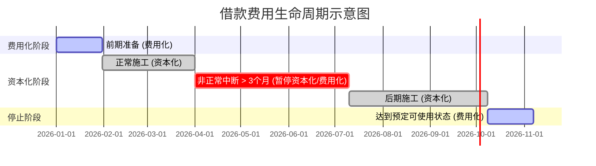
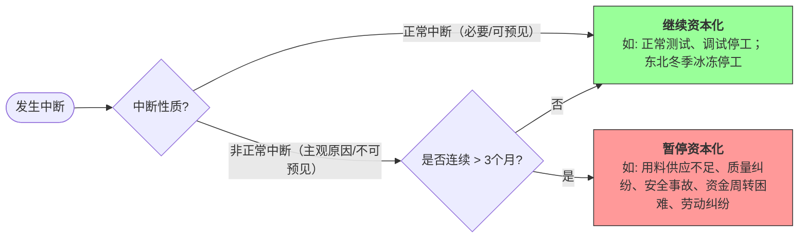

# 1. 借款费用概述

## 1.1 适用范围

- 借入资金所付出的代价，它包括**借款利息费用**；以及因外币借款而发生的**汇兑差额**等。
- 承租人根据**租赁**会计准则确认的**融资费用**属于借款费用。
- 借款费用的借款范围既包括专门借款，也包括一般借款。

> [!example] 例题·单选题
> 下列各项中，不属于借款费用的是（ ）。
> A. 外币借款发生的汇兑收益
> B. 承租人租赁资产发生的融资费用
> C. 以咨询费的名义向银行支付的借款利息
> D. 发行股票支付的承销商佣金及手续费
>
> > [!check]- 答案与解析
> > 
> > **正确答案：D**
> > *   A. **外币借款发生的汇兑收益**：汇兑差额（包括收益和损失）属于借款费用的一部分。
> > *   B. **承租人租赁资产发生的融资费用**：融资租赁产生的利息费用，属于借款费用。
> > *   C. **以咨询费的名义向银行支付的借款利息**：无论名义如何，只要实质是为借款支付的利息，都属于借款费用。
> > *   D. **发行股票支付的承销商佣金及手续费**：股票属于**权益性融资工具**，发行股票产生的佣金和手续费是**权益性融资费用**，不属于借款费用，通常冲减发行收入。
## 1.2 符合资本化条件的资产

- 指需要经过相当长时间（**1年或一年以上**）的购建或者生产活动才能达到预定可使用或者可销售状态的资产。  
  *符合资本化条件的资产、考虑时间长度，不考虑具体资产。*
- 在实务中，如果由于人为或者故意等非正常因素导致资产的购建或生产时间相当长的，该资产不属于符合资本化条件的资产。

> [!note] 与土地使用权相关的资本化支出规定
> 
> | **情形**                | **具体规定**                                                                                                                                                                                                 |
> |-------------------------|--------------------------------------------------------------------------------------------------------------------------------------------------------------------------------------------------------------|
> | 自行开发建造厂房等建筑物 | （1）土地使用权在取得时通常已达到预定使用状态，不满足借款费用准则规定的“符合资本化条件的资产”定义<br>（2）企业应当以建造支出（包括土地使用权在房屋建造期间计入在建工程的摊销金额）为基础，确定应予资本化的借款费用金额 |
> | 建造对外出售的房屋建筑物 | 房地产开发企业取得的土地使用权用于建造对外出售的房屋建筑物，相关土地使用权应计入房屋建筑物成本，以包括土地使用权支出的建造成本为基础确定资本化金额                                                                                                                               |
> 
> 
> 

> [!example] 例题·多选题
> 下列各项中，属于符合借款费用资本化条件的资产的有（　）。
> 
> A. 需要经过相当长时间的购建才能达到预定可使用状态的固定资产
> B. 需要经过相当长时间的购建才能达到预定可使用状态的投资性房地产
> C. 需要经过相当长时间的生产活动才能达到预定可销售状态的存货
> D. 需要经过半年的购建才能达到预定可销售状态的投资性房地产
>
> > [!check]- 答案与解析
> > 
> > **正确答案：ABC**
> >
> > **深度解析：**
> > 1. **核心定义**：符合借款费用资本化条件的资产，是指需要经过**相当长时间**（通常指 **1 年以上**，含 1 年）的购建或者生产活动才能达到预定可使用或者可销售状态的资产。
> > 2. **资产类别**：此类资产主要包括**固定资产**、**投资性房地产**和**存货**等。
> > 3. **选项拆解**：
> >    - **选项 A、B、C**：均明确描述为“需要经过相当长时间”，符合资本化资产的定义。
> >    - **选项 D**：明确指出时间为“半年”，未达到“相当长时间”（**$\ge 1$ 年**）的标准，故不属于符合资本化条件的资产。
> >
> > **💡 易错点提示：**
> > 1. 必须同时满足“**资产类别**”和“**时间标准**”两个条件。
> > 2. 存货（如房地产开发企业的商品房、大型船舶制造）只要生产周期超过 **1 年**，其借款费用亦可资本化，不要误认为只有固定资产可以资本化。
# 2. 借款费用的确认

- **资本化原则**：借款费用直接归属于符合资本化条件的资产的购建或者生产的，予以资本化计入资产成本；其他借款费用在发生时根据其发生额确认财务费用，计入当期损益。

## 2.1 开始资本化

- **开始资本化**：需同时满足三个条件：  钱出去了/债背上了/活干上了

| **条件**        | **说明**                                  |
| ------------- | --------------------------------------- |
| 资产支出已经发生      | 包括支付现金、转移非现金资产和承担带息负债形式的支出，赊购（不带息负债）不计入 |
| 借款费用已经发生      | 专门借款费用已发生或占用一般借款                        |
| 必要的购建或生产活动已开始 | 实体建造或生产工作已启动                            |
 
> [!example] 真题2024·单选题
> 甲公司 2×24 年 3 月 25 日动工建造办公楼，4 月 30 日支付一般借款利息，8 月 15 日支付第一笔工程进度款，9 月 10 日借入专门借款。借款费用开始资本化的日期是（ ）。
> 
> A. 2×24年9月10日
> B. 2×24年4月30日
> C. 2×24年8月15日
> D. 2×24年3月25日
>
> > [!check]- 答案与解析
> > **正确答案：C**
> >
> > **深度解析：**
> > 借款费用**开始资本化**必须同时满足三个条件（遵循**孰晚原则**）：
> >
> > **💡 易错点提示：**
> > 4. **专门借款并非前提**：资本化并不要求必须有“专门借款”，只要有借款（一般借款亦可）且产生了利息支出即可满足“借款费用发生”的条件。
> > 5. **区分动工与支出**：动工（3月25日）只是条件之一，如果没有真金白银的“资产支出”（8月15日），依然不能开始资本化。

> [!example] 例题·单选题
> 下列各项中，不属于借款费用准则中所说的“资产支出”的是（　）。
> 
> A. 工程领用企业自产产品
> B. 计提建设工人的职工福利费
> C. 用银行存款购买工程物资并领用
> D. 开出带息商业承兑汇票用于购买工程物资
>
> > [!check]- 答案与解析
> > 
> > **正确答案：B**
> >
> > **深度解析：**
> > 根据借款费用准则，**资产支出**是指企业购置或建造符合资本化条件的资产而发生的支出，主要包括以下三种形式：
> > 
> > 1. **支付现金**：指用货币资金支付符合资本化条件的资产的购建支出（如选项 C）。
> > 2. **转移非现金资产**：指企业将自己的非现金资产用于符合资本化条件的资产的购建（如选项 A，领用自产产品）。
> > 3. **承担带息债务**：指企业为了购建符合资本化条件的资产而承担的**带息债务**（如选项 D，开出带息商业汇票）。
> > 
> > **逻辑辨析：**
> > *   **选项 B**：计提建设工人的职工福利费，属于“计提”行为，虽然增加了负债（应付职工薪酬），但既没有支付现金，也没有转移非现金资产，且该负债通常为**不带息债务**。因此，不属于准则定义的“资产支出”。
> > 
> > **💡 易错点提示：**
> > 区分“资产支出”的关键在于是否有**实际资源的流出**或**带息债务的形成**。单纯的“计提”费用（如计提折旧、计提工资/福利费）或承担“不带息债务”（如赊购工程物资产生的应付账款）均不属于资产支出。
## 2.2 暂停资本化

- **暂停资本化**：发生非正常中断，且中断时间连续超过3个月。  




> [!example] 例题·单选题
> 甲公司 $2 \times 24$ 年 4 月 1 日开始资本化，5 月 1 日 - 5 月 31 日因质量纠纷停工（非正常中断，$< 3$ 个月），11 月 1 日 - $2 \times 25$ 年 2 月 28 日因冰冻停工（正常中断）。$2 \times 24$ 年资本化期间为（ ）。  
> A. 4 个月  
> B. 8 个月  
> C. 9 个月  
> D. 11 个月  
>
> > [!check]- 答案与解析
> > 
> > **正确答案：C**
> >
> > **深度解析：**
> > 1. **非正常中断的处理**：5 月 1 日 - 5 月 31 日因质量纠纷停工属于“非正常中断”，但由于连续中断时间**未超过 3 个月**，根据准则规定，**不应暂停**借款费用资本化。
> > 2. **正常中断的处理**：11 月 1 日 - $2 \times 25$ 年 2 月 28 日因冰冻停工属于“正常中断”（如北方冬季冰冻期），无论时间长短，均**不需要暂停**资本化。
> > 3. **资本化期间计算**：题目要求计算 **$2 \times 24$ 年** 的资本化期间。该期间自 $2 \times 24$ 年 4 月 1 日开始，至 $2 \times 24$ 年 12 月 31 日止，共计 **9 个月**（$12 - 4 + 1 = 9$）。

## 2.3停止资本化

- 资产达到**预定可使用或可销售状态**时停止资本化。  
- **特殊情形**：  
  1. 分别建造、分别完工且可独立使用/销售的，完工部分停止资本化；  
  2. 需整体完工后使用/销售的，整体完工时停止资本化。

> [!example] 真题2023·多选题
> 甲公司于 $2\times22$ 年 3 月 10 日借入一笔借款，专项用于新厂区的建造，甲公司在银行将该笔款项用于购买七天通知存款，后续根据工程付款进度安排支取。$2\times22$ 年 4 月 20 日，甲公司向供应商预付了采购该工程所需设备的部分款项。$2\times22$ 年 5 月 15 日，新厂区实体开始建造。$2\times22$ 年 11 月至 12 月期间，由于冰雪覆盖暂停施工。$2\times23$ 年 10 月 20 日，新厂区的实体建造已基本完成且与设计和生产要求基本相符，但个别车间的屋顶有漏水现象需要修补，预计发生的支出很小，整体工程于 $2\times23$ 年 11 月 15 日完工并办理了竣工决算手续。下列各项关于甲公司借款费用会计处理的表述中，正确的有（ ）。（2023年）
> 
> A. $2\times22$ 年 11 月至 12 月期间发生的借款费用应当继续资本化
> B. 借款费用停止资本化的时点为 $2\times23$ 年 11 月 15 日
> C. 借款费用资本化时点开始之前取得的利息收入不影响借款费用资本化金额的计算
> D. 借款费用开始资本化的时点为 $2\times22$ 年 5 月 15 日
>
> > [!check]- 答案与解析
> > 
> > **正确答案：ACD**
> >
> > **深度解析：**
> > 
> > **1. 开始资本化时点的判定：**
> > 借款费用开始资本化必须**同时满足**以下三个条件：
> > - **资产支出已经发生**：$2\times22$ 年 4 月 20 日（预付设备款）；
> > - **借款费用已经发生**：$2\times22$ 年 3 月 10 日（借入专项借款）；
> > - **购建活动已经开始**：$2\times22$ 年 5 月 15 日（实体开始建造）。
> > 综上，三者孰晚，开始资本化时点为 **$2\times22$ 年 5 月 15 日**（选项 D 正确）。
> >
> > **2. 借款费用暂停资本化的判定：**
> > $2\times22$ 年 11 月至 12 月期间，由于冰雪覆盖导致暂停施工，这属于**可预见的不可抗力**导致的**正常中断**。根据准则，正常中断期间的借款费用应当**继续资本化**（选项 A 正确）。
> >
> > **3. 停止资本化时点的判定：**
> > 购建的固定资产达到**预定可使用状态**时应停止资本化。$2\times23$ 年 10 月 20 日，实体建造已基本完成且与设计要求相符，虽有极小修补但不影响使用，应于 **$2\times23$ 年 10 月 20 日**停止资本化，而非竣工决算日（选项 B 错误）。
> >
> > **4. 闲置资金利息收入的处理：**
> > - **资本化期间内**：闲置资金利息收入**冲减资本化金额**。
> > - **资本化开始前/停止后**：闲置资金利息收入**冲减财务费用**（即费用化金额）。
> > 因此，开始资本化之前的利息收入不影响资本化金额（选项 C 正确）。

# 3. 借款费用的计量
## 3.1 借款利息资本化金额的确定
### 3.1.1 专门借款

- **公式**：资本化金额 = 专门借款当期**实际利息费用** - 尚未动用借款的利息收入/投资收益  
- **特点**：与资产支出不挂钩，以实际利息扣除闲置收益后的净额资本化。
```
借：在建工程（资本化利息）  
    银行存款（闲置收益）  
  贷：长期借款—应计利息（实际利息）  
```

> [!example] 例题·单选题
> 甲公司 2×24 年 1 月 1 日发行面值 **10000** 万元债券（专门用于厂房建造），票面利率 **6%**，实际利率 **5%**，发行价 **10272.32** 万元。2×24 年累计工程支出 **4800** 万元，闲置资金投资国债收益 **300** 万元。2×24 年末在建工程账面余额为（ ）万元。
> 
> A. 4800  
> B. 5013.62  
> C. 5313.62  
> D. 5000
>
> > [!check]- 答案与解析
> > 
> > **正确答案：B**
> >
> > **深度解析：**
> > **第一步：计算专门借款利息资本化金额。**
> > 根据会计准则，专门借款在资本化期间内的利息资本化金额 = 实际利息费用 - 闲置资金收益。
> > 实际利息费用 = 期初摊余成本 $\times$ 实际利率 = $10272.32 \times 5\% = 513.62$ 万元。
> > 资本化利息金额 = $513.62 - 300 = 213.62$ 万元。
> >
> > **第二步：计算在建工程账面余额。**
> > 在建工程账面余额 = 累计工程支出 + 资本化利息。
> > 在建工程余额 = $4800 + 213.62 = 5013.62$ 万元。
> >
> > **💡 易错点提示：**
> > 1. **利率陷阱**：计算利息费用时必须使用**实际利率**（$5\%$）和**期初摊余成本**（发行价），而非票面利率和面值。
> > 2. **专门借款规则**：专门借款利息资本化金额的计算**不与实际资产支出挂钩**，只需扣除闲置资金收益；这与一般借款（需计算支出加权平均数）有本质区别。

> [!example] 真题·单选题
> $2 \times 19$ 年 7 月 1 日，甲公司向银行借入 $3\,000$ 万元。借款期限 2 年，年利率 $4\%$（类似贷款的市场年利率为 $5\%$），该贷款专门用于甲公司办公楼的建造。$2 \times 19$ 年 10 月 1 日，办公楼开始实体建造。甲公司支付工程款 $600$ 万元。$2 \times 20$ 年 1 月 1 日、$2 \times 20$ 年 7 月 1 日又分别支付工程款 $1\,500$ 万元、$800$ 万元。$2 \times 20$ 年 10 月 31 日，经甲公司验收，办公楼达到预定可使用状态。$2 \times 20$ 年 12 月 31 日，甲公司开始使用该办公楼。不考虑其他因素，下列各项关于甲公司建造办公楼会计处理的表述中，正确的是（ ）（2021年）
> 
> A. 按借款本金 $3\,000$ 万元、年利率 $4\%$ 计算的利息金额作为应付银行的利息金额
> B. 借款费用开始资本化的时间为 $2 \times 19$ 年 7 月 1 日
> C. 按借款本金 $3\,000$ 万元、年利率 $4\%$ 计算的利息金额在资本化期间内计入建造办公楼的成本
> D. 借款费用应予资本化的期间为 $2 \times 19$ 年 7 月 1 日至 $2 \times 20$ 年 12 月 31 日止
>
> > [!check]- 答案与解析
> > 
> > **正确答案：A**
> >
> > **深度解析：**
> > 
> > **第一步：确定借款费用开始资本化的时点**
> > 借款费用开始资本化必须同时满足三个条件：
> > 1. 资产支出已经发生（$2 \times 19$ 年 10 月 1 日支付首笔工程款）；
> > 2. 借款费用已经发生（$2 \times 19$ 年 7 月 1 日借入款项即开始计息）；
> > 3. 为使资产达到预定可使用状态所必要的购建活动已经开始（$2 \times 19$ 年 10 月 1 日开始实体建造）。
> > 综上，开始资本化时点为 **$2 \times 19$ 年 10 月 1 日**。故选项 B 错误。
> >
> > **第二步：确定借款费用停止资本化的时点**
> > 购建或者生产符合资本化条件的资产达到**预定可使用状态**时，借款费用应当停止资本化。本题中办公楼于 **$2 \times 20$ 年 10 月 31 日** 达到预定可使用状态，之后发生的利息应计入财务费用。故选项 D 错误。
> >
> > **第三步：分析利息金额的会计处理**
> > - **应付利息**：根据合同约定的名义利率计算，即 $3\,000 \times 4\%$，这是甲公司法律意义上需要支付给银行的金额。故选项 A 正确。
> > - **资本化金额**：由于市场利率（$5\%$）与合同利率（$4\%$）不一致，在会计处理上应按**实际利率法**（即 $5\%$）确认利息费用。资本化期间内计入成本的金额应为“实际利息费用”扣除“闲置资金收益”。故选项 C 错误。
> >
> > **💡 易错点提示：**
> > 1. **资本化终点**：是“达到预定可使用状态”而非“实际投入使用”或“办理竣工决算”。
> > 2. **利率选择**：计算“应付利息”用票面利率，计算“利息费用”用实际利率。
> > 3. **专门借款资本化金额**：不需要考虑资产支出的加权平均数，而是直接用资本化期间内的总利息扣除闲置资金收益。

> [!example] 例题·单选题
> 甲公司于2×21年1月1日发行面值总额为**20 000万元**的债券，取得的款项专门用于建造厂房。该债券系分期付息、到期一次还本的债券，期限为5年，票面年利率为**10%**，每年12月31日支付当年利息。该债券实际年利率为**8%**，债券发行价格总额为**21 584万元**，款项已存入银行。厂房于**2×21年3月1日**开工建造，预计工期2年，开工时一次性支付工程价款**9 600万元**。当年，甲公司该项债券的闲置资金的月收益率为**0.6%**，相关款项已收到。2×21年12月31日工程尚未完工。不考虑其他因素，当期末资产负债表中该在建工程的列报金额为（　）。
> 
> A. 10 319.89万元
> B. 10 976万元
> C. 10 414.93万元
> D. 9 600万元
>
> > [!check]- 答案与解析
> > 
> > **正确答案：A**
> >
> > **深度解析：**
> > **第一步：确定资本化期间**
> > 专门借款资本化开始时点需同时满足：资产支出发生（3月1日）、借款费用发生（1月1日）、建造活动开始（3月1日）。
> > 因此，2×21年的资本化期间为 **2×21年3月1日至12月31日**，共 **10个月**。
> >
> > **第二步：计算资本化期间的利息支出总额**
> > 专门借款利息资本化金额 = 资本化期间实际发生的利息费用 - 资本化期间闲置资金的存款收益。
> > 资本化期间实际利息费用 = $21\ 584 \times 8\% \times \frac{10}{12} = 1\ 438.93$（万元）。
> >
> > **第三步：计算资本化期间的闲置资金收益**
> > 闲置资金 = 发行价格 - 已支付工程款 = $21\ 584 - 9\ 600 = 11\ 984$（万元）。
> > 资本化期间（10个月）的收益 = $11\ 984 \times 0.6\% \times 10 = 719.04$（万元）。
> >
> > **第四步：计算利息资本化净额**
> > 资本化利息净额 = $1\ 438.93 - 719.04 = 719.89$（万元）。
> >
> > **第五步：计算在建工程列报金额**
> > 在建工程金额 = 支付的工程价款 + 资本化利息净额
> > 列报金额 = $9\ 600 + 719.89 = 10\ 319.89$（万元）。
> >
> > **💡 易错点提示：**
> > 1. **时间陷阱**：债券是1月1日发行的，但工程3月1日才开工，1-2月的利息及闲置收益应计入**财务费用**（费用化），不能计入在建工程成本。
> > 2. **基数选择**：计算实际利息时应使用**期初摊余成本**（发行价格 $21\ 584$），而非面值（$20\ 000$）。
> > 3. **闲置收益**：计算闲置收益时，只需考虑资本化期间内的金额，且基数是扣除已投入工程款后的余额。

### 3.1.2 一般借款

- **公式**：  
  资本化金额 = 累计资产支出超过专门借款部分的**加权平均数** × 一般借款**加权平均利率**  

理解：
我们要计算一般借款在一段期间的资本化利息，一般来说就是计算某一年；
计算逻辑就是占用的一般借款乘以一般借款的资本化率；
首先计算一般借款的资本化率（即一般借款加权平均利率），公式如下：
- **一般借款加权平均利率 = （一般借款当期利息之和）÷（一般借款本金加权平均）**  ，
一般借款当期利息很好理解了，就是今年产生的利息，2月末借的就算10个月利息；同时要把本金加权，2月末借的计算本金时乘10/12；
同样的原理来计算加权的、超过专门借款部分的一般借款

费用化利息=所有利息-资本化利息
```
借：在建工程（资本化金额）  
    财务费用（费用化金额）  
  贷：长期借款—应计利息  
      应付债券—应计利息  
```

> [!example] 例题·单选题
> 2×24年1月1日，甲公司为购建生产线借入3年期专门借款3 000万元，年利率为6%。当年度发生与购建生产线相关的支出包括：1月1日支付材料款1 800万元；3月1日支付工程进度款1 600万元；9月1日支付工程进度款2 000万元。甲公司将暂时未使用的专门借款用于货币市场投资，月利率为0.5%，除专门借款外，甲公司尚有两笔流动资金借款：一笔为2×23年10月借入的2年期借款2 000万元，年利率为5.5%；另一笔为2×24年1月1日借入的1年期借款3 000万元，年利率为4.5%。假定上述借款的实际利率与名义利率相同。
>
> 不考虑其他因素，甲公司2×24年度应予资本化的一般借款利息金额是（ ）万元。
> A. 55
> B. 60
> C. 49
> D. 45
>
> > [!check]- 答案与解析
> > 
> > **正确答案：C**
> >
> > **深度解析：**
> > **第一步：计算一般借款资本化率**
> > 由于存在两笔一般借款，需计算加权平均利率：
> > $$ \text{一般借款资本化率} = \frac{2000 \times 5.5\% + 3000 \times 4.5\%}{2000 + 3000} \times 100\% = 4.9\% $$
> >
> > **第二步：确定占用一般借款的资产支出及时间权重**
> > 只有在**专门借款被用完后**，才开始占用一般借款（专门借款总额为 **3 000** 万元）。
> > 1. **1月1日**：支出 1 800，未超过专门借款。
> > 2. **3月1日**：支出 1 600。累计支出 $1800+1600=3400$。此时超过专门借款 $3400 - 3000 = \mathbf{400}$ 万元。该部分当年占用时长为 **10个月**（3月至12月）。
> > 3. **9月1日**：支出 2 000。全部占用一般借款。该部分当年占用时长为 **4个月**（9月至12月）。
> >
> > **第三步：计算一般借款利息资本化金额**
> > $$ \text{资本化金额} = \text{累计资产支出超过专门借款部分的资产支出加权平均数} \times \text{资本化率} $$
> > $$ \text{资本化金额} = \left[ (1800 + 1600 - 3000) \times \frac{10}{12} + 2000 \times \frac{4}{12} \right] \times 4.9\% = 49 \text{（万元）} $$
> >
> > **💡 易错点提示：**
> > 4. **干扰信息**：题目中提到的“专门借款闲置资金投资收益（月利率0.5%）”是计算**专门借款**利息资本化金额时扣除的项目，与**一般借款**的计算无关，切勿混淆。
> > 5. **时间起算点**：一般借款的资本化利息计算，必须严格按照**资金被占用的时间**加权。3月1日发生的超额支出，分母应为12，分子应为10（而非全年）。


> [!example] 例题·单选题
> 甲公司于2×24年7月1日正式动工兴建一栋办公楼，工期预计为2年，工程采用出包方式，甲公司分别于2×24年7月1日和10月1日支付工程进度款1000万元和2000万元。甲公司为建造办公楼占用了两笔一般借款：
> （1）2×23年8月1日向某商业银行借入长期借款1000万元，期限为3年，年利率为6%，按年支付利息，到期还本；
> （2）2×23年1月1日按面值发行公司债券10000万元，期限为3年，票面年利率为8%，每年年末支付利息，到期还本。
>
> 不考虑其他因素，甲公司上述一般借款2×24年计入财务费用的金额是（ ）万元。
>
> A. 1000
> B. 78.2
> C. 781.8
> D. 860
>
> > [!check]- 答案与解析
> > 
> > **正确答案：C**
> >
> > **深度解析：**
> > **第一步：计算一般借款资本化率**
> > 由于占用了两笔一般借款，需要计算加权平均年利率：
> > $$ \text{资本化率} = \frac{1000 \times 6\% + 10000 \times 8\%}{1000 + 10000} = \frac{60 + 800}{11000} = \frac{860}{11000} $$
> >
> > **第二步：计算累计资产支出加权平均数**
> > 资本化开始时点为 **2×24年7月1日**（同时满足资产支出发生、借款费用发生、购建活动开始），因此2×24年的资本化期间为 **7月-12月**。
> > $$ \text{资产支出加权平均数} = 1000 \times \frac{6}{12} + 2000 \times \frac{3}{12} = 500 + 500 = 1000 \text{（万元）} $$
> >
> > **第三步：计算一般借款利息资本化金额**
> > $$ \text{资本化金额} = \text{资产支出加权平均数} \times \text{资本化率} = 1000 \times \frac{860}{11000} \approx 78.18 \text{（万元）} $$
> >
> > **第四步：计算计入财务费用的金额（费用化金额）**
> > 2×24年全年实际发生的总利息费用为：
> > $$ \text{总利息} = 1000 \times 6\% + 10000 \times 8\% = 860 \text{（万元）} $$
> > 计入财务费用的金额 = 总利息 - 资本化金额：
> > $$ 860 - 78.18 = 781.82 \approx 781.8 \text{（万元）} $$
> >
> > **💡 易错点提示：**
> > 1. **审题陷阱**：题目问的是**“计入财务费用”**（即费用化部分）的金额，而非资本化金额。如果选 B (78.2) 则误答了资本化金额。
> > 2. **时间权重**：注意资本化期间是从 **7月1日** 开始，第一笔支出1000万元占用时间为6个月（$6/12$），第二笔支出2000万元占用时间为3个月（$3/12$）。


## 3.2 外币专门借款汇兑差额资本化金额的确定

- **资本化期间内**：
	- 外币**专门借款**本金及利息的汇兑差额 **予以资本化**。  
	- **外币一般借款**：汇兑差额 **计入当期损益**，不予资本化。

> [!example] 例题·计算分析题 (教材例 11-5)
> **【题目描述】**
> 甲公司于 2×24 年 1 月 1 日，为建造某工程项目专门以面值发行美元公司债券 **1 000 万元**，年利率为 **8%**，期限为 3 年，假定不考虑与发行债券有关的辅助费用、未支出专门借款的利息收入或投资收益。合同约定，每年 1 月 1 日支付上年利息，到期还本。
>
> 工程于 2×24 年 1 月 1 日开始实体建造，2×25 年 6 月 30 日完工，达到预定可使用状态。
>
> **【资产支出情况】**
> - 2×24 年 1 月 1 日，支出 200 万美元；
> - 2×24 年 7 月 1 日，支出 500 万美元；
> - 2×25 年 1 月 1 日，支出 300 万美元。
>
> **【汇率信息】**
> 公司的记账本位币为人民币，外币业务采用外币业务发生时当日的市场汇率折算。
> - 2×24 年 1 月 1 日：$1 \text{ USD} = 7.70 \text{ CNY}$
> - 2×24 年 12 月 31 日：$1 \text{ USD} = 7.75 \text{ CNY}$
> - 2×25 年 1 月 1 日：$1 \text{ USD} = 7.77 \text{ CNY}$
> - 2×25 年 6 月 30 日：$1 \text{ USD} = 7.80 \text{ CNY}$
>
> **【要求】**
> 计算外币借款汇兑差额资本化金额并编制相关会计分录。
>
> > [!check]- 答案与解析
> >
> > **第一步：2×24 年汇兑差额资本化金额计算与处理**
> > 1. **计算债券应付利息（期末汇率折算）：**
> >    $$ \text{应付利息} = 1,000 \times 8\% \times 7.75 = 80 \times 7.75 = \mathbf{620} \text{（万元）} $$
> >    **会计分录：**
> >    借：在建工程 6,200,000
> >    &emsp;&emsp;贷：应付债券—应计利息 6,200,000
> >
> > 2. **计算本金及利息的汇兑差额：**
> >    - 本金汇兑差额：$1,000 \times (7.75 - 7.70) = 50$（万元）
> >    - 利息汇兑差额：$80 \times (7.75 - 7.75) = 0$（注：因按期末汇率计提，当期无差额）
> >    - **合计资本化金额：** $\mathbf{50}$ **（万元）**
> >    **会计分录：**
> >    借：在建工程 500,000
> >    &emsp;&emsp;贷：应付债券 500,000
> >
> > **第二步：2×25 年 1 月 1 日实际支付利息处理**
> > 1. **计算支付时的汇兑差额：**
> >    - 实际支付金额（当日汇率）：$80 \times 7.77 = 621.60$（万元）
> >    - 原账面金额（上年末汇率）：$620$（万元）
> >    - **差额：** $621.60 - 620 = \mathbf{1.60}$ **（万元）**
> >    *注：因处于资本化期间，该差额继续资本化。*
> >
> > 2. **会计分录：**
> >    借：应付债券—应计利息 6,200,000
> >    &emsp;&emsp;**在建工程 16,000**
> >    &emsp;&emsp;贷：银行存款 6,216,000
> >
> > **第三步：2×25 年 6 月 30 日（完工时）汇兑差额资本化金额计算**
> > 3. **计算当期利息（半年）：**
> >    $$ \text{应付利息} = 1,000 \times 8\% \times \frac{1}{2} \times 7.80 = 40 \times 7.80 = \mathbf{312} \text{（万元）} $$
> >    **会计分录：**
> >    借：在建工程 3,120,000
> >    &emsp;&emsp;贷：应付债券—应计利息 3,120,000
> >
> > 4. **计算本金及利息的汇兑差额：**
> >    - 本金汇兑差额：$1,000 \times (7.80 - 7.75) = 50$（万元）
> >    - 利息汇兑差额（当期计提部分）：$40 \times (7.80 - 7.80) = 0$
> >    - **合计资本化金额：** $\mathbf{50}$ **（万元）**
> >    **会计分录：**
> >    借：在建工程 500,000
> >    &emsp;&emsp;贷：应付债券 500,000
> >
> > **💡 易错点提示：**
> > 1. **外币专门借款的特殊性**：在资本化期间内，外币**专门借款**本金及利息的汇兑差额，应当**予以资本化**，计入符合资本化条件的资产成本。**不需要**像一般借款那样计算资产支出加权平均数。
> > 2. **支付日的汇兑差额**：注意第二步中，支付利息日（1月1日）汇率与上年末（12月31日）汇率不同产生的差额，如果仍在资本化期间，应计入“在建工程”，而非“财务费用”。


> [!example] 例题·单选题
> 甲公司 2×21 年 1 月 1 日开始建造一条生产线并于当日发生建造支出，预计工期为 2 年，同时于当日向银行借入 **500 万美元**专门用于该生产线的建造，年利率为 **10%**，每季度末计提利息，年末支付利息。甲公司对外币业务采用交易发生日即期汇率进行计算，按季度计算汇兑差额。2×21 年的相关汇率如下：
> - 1 月 1 日的市场汇率为 $1 \text{ 美元} = 7.5 \text{ 元人民币}$
> - 3 月 31 日的市场汇率为 $1 \text{ 美元} = 7.4 \text{ 元人民币}$
> - 6 月 30 日的市场汇率为 $1 \text{ 美元} = 7.2 \text{ 元人民币}$
> - 9 月 30 日的市场汇率为 $1 \text{ 美元} = 7.1 \text{ 元人民币}$
> - 12 月 31 日的市场汇率为 $1 \text{ 美元} = 7.0 \text{ 元人民币}$
> 
> 2×21 年 12 月 31 日甲公司因外币借款汇兑差额应予资本化的金额为（ ）。
> 
> A. 68 万元人民币
> B. －68 万元人民币
> C. －53.75 万元人民币
> D. －55 万元人民币
>
> > [!check]- 答案与解析
> > 
> > **正确答案：C**
> >
> > **深度解析：**
> > 在资本化期间内，**外币专门借款**本金及利息的汇兑差额应全额**资本化**。本题要求计算 2×21 年 12 月 31 日（即第四季度末）应予资本化的汇兑差额。
> >
> > **第一步：计算每季度的利息金额**
> > 每季度末计提的外币利息为：
> > $500 \times 10\% \times \frac{3}{12} = 12.5 \text{（万美元）}$
> >
> > **第二步：计算第四季度本金的汇兑差额**
> > 本金汇兑差额 $= \text{外币本金} \times (\text{期末汇率} - \text{期初汇率})$
> > $500 \times (7.0 - 7.1) = -50 \text{（万元人民币）}$
> >
> > **第三步：计算第四季度利息的汇兑差额**
> > 截止至第四季度末，前三季度已计提但未支付的利息累计为 $12.5 \times 3 = 37.5 \text{ 万美元}$，这些利息在 9 月 30 日的账面汇率为 7.1。
> > 利息汇兑差额 $= 37.5 \times (7.0 - 7.1) = -3.75 \text{（万元人民币）}$
> > *注：第四季度当季计提的利息 12.5 万美元，按 12 月 31 日汇率 7.0 入账，不产生汇兑差额。*
> >
> > **第四步：计算合计资本化金额**
> > 2×21 年 12 月 31 日应予资本化的汇兑差额 $= -50 + (-3.75) = -53.75 \text{（万元人民币）}$
> >
> > **💡 易错点提示：**
> > 1. **范围识别**：只有**专门借款**的汇兑差额在资本化期间内才全部资本化；若是**一般借款**，其汇兑差额应计入“财务费用”（费用化）。
> > 2. **时间点理解**：题目问的是“12月31日”的金额，通常指该时点（即第四季度）需要调整的汇兑损益，而非全年累计数。
> > 3. **利息处理**：不要漏掉**已计提未支付**利息的汇兑差额计算，且当季新计提的利息因采用期末即期汇率入账，不产生当期汇兑差额。