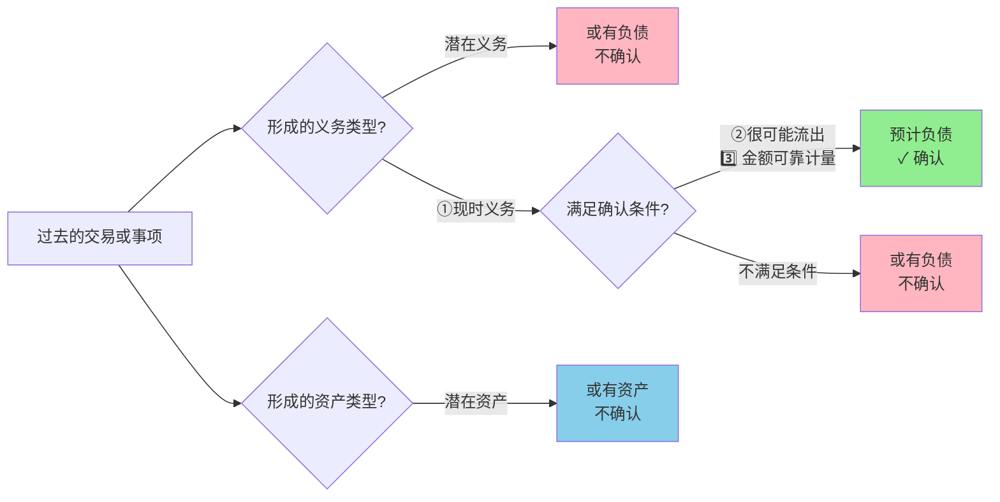
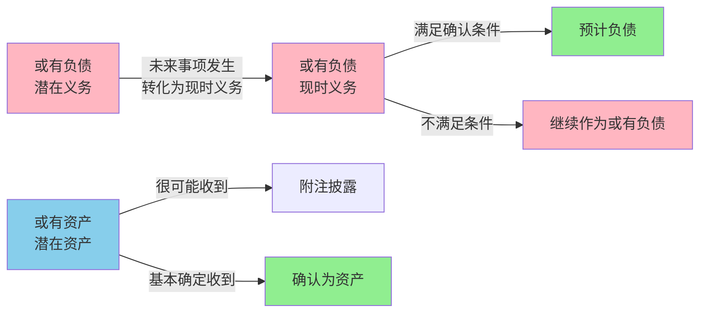
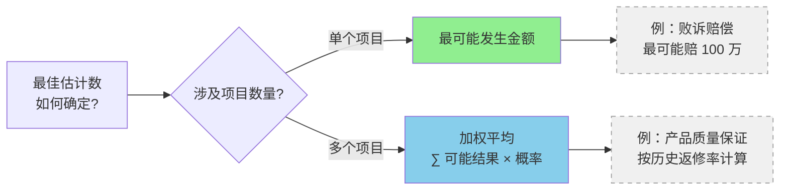

# 1. 或有事项概述

## 1.1 概念及其特征

- 或有事项，是指**过去的**交易或者事项形成的，其结果须由某些**未来事项的**发生或不发生才能决定的**不确定事项**。
- 常见的或有事项主要包括：未决诉讼或未决仲裁、保证类质量保证（含产品安全保证）、亏损合同、重组义务、弃置义务、环境污染整治、承诺等。
- 或有事项的特征
	1.或有事项是因过去的交易或者事项形成的。
		未来可能发生的自然灾害、交通事故、**经营亏损**等事项，都不属于或有事项。
	2.或有事项的结果具有不确定性。
		（1）或有事项的结果**是否发生**具有不确定性。
		（2）或有事项的结果预计将会发生，但**发生的具体时间或金额**具有不确定性。
	3.或有事项的结果须由未来事项决定。
## 1.2 适用准则
- **不适用或有事项准则**
	（1）由职工薪酬、租赁、收入以及企业合并等准则规范的或有事项。例如：
		①辞退福利（自愿接受裁减）；
		②承租人因拆卸、移除或复原租赁资产预计发生成本而承担的预计支付的义务；
		③对于附有销售退回条款的销售，预期因销售退回将退还的金额；
		④对于附有质量保证条款的销售，企业向客户提供的符合既定标准之外的、构成单项履约义务的质量保证（服务类质量保证）；
		⑤应付客户对价包含可变金额；
		⑥非同一控制下企业合并形成的长期股权投资的或有对价等
	（2）待执行合同、财务担保合同。
	【提示】财务担保合同适用金融工具确认和计量准则。
- **适用或有事项准则**
	（3）待执行合同变成亏损合同。例如：
		①存货减值中涉及亏损合同的会计处理；
		②合同履约成本计量中涉及亏损合同的会计处理等
	（4）对于附有质量保证条款的销售，企业向客户提供的符合既定标准之内的、不构成单项履约义务的质量保证（**保证类质量保证**）
	（5）**同一控制下**企业合并形成的长期股权投资的或有对价
	（6）PPP项目合同中，为使PPP项目资产保持一定的服务能力或在移交给政府方之前保持一定的使用状态，社会资本方提供不构成单项履约义务的服务而承担的预计支付的义务

> [!example] 例题·多选题
> 下列各项企业发生的交易或事项中，不应按照或有事项准则进行初始计量的有（　　）。
> A. 向客户提供额外服务的质量保证
> B. 同一控制下的企业合并中承担的或有对价
> C. 对外提供财务担保
> D. 向客户提供返利
>
> > [!check]- 答案与解析
> > 
> > **正确答案：ACD**
> >
> > **深度解析：**
> > **选项A：** 向客户提供额外服务的质量保证，属于**服务类质量保证**，应当按照**收入准则**进行会计处理，而非或有事项准则。
> > **选项C：** 对外提供财务担保，应当按照**金融工具确认和计量准则**进行处理，基于**预期信用损失**对金融工具作减值核算。
> > **选项D：** 向客户提供返利，属于**可变对价**，应当按照**收入准则**（可变对价相关规定）进行会计处理。
> > **选项B（排除项）：** 同一控制下的企业合并中承担的或有对价，**应当按照或有事项准则进行初始计量**，因此不符合题目"不应按或有事项准则"的要求。
> >
> > **💡 易错点提示：**
> > 注意区分**服务类质量保证**（按收入准则）与**保证类质量保证**（按或有事项准则）；财务担保虽具有"或有"性质，但属于金融工具准则规范范围，易误选为或有事项。

# 2. 或有负债、或有资产与预计负债
## 2.1 分类与确认

- 或有负债是指过去的交易或者事项形成的**潜在义务**,其存在须通过未来不确定事项的发生或不发生予以证实;或过去的交易或者事项形成的**现时义务**,履行该义务不是很可能导致经济利益流出企业或该义务的金额不能可靠计量。
	- 或有负债无论作为潜在义务还是现时义务，均不符合负债的确认条件，因而**不予确认**。但是，**除非**或有负债**极小可能**导致经济利益流出企业，否则企业应当在附注中披露有关信息。

- 与或有事项相关的义务同时满足以下条件的,应当确认为预计负债  
	1. 该义务是企业承担的现时义务  
	2. 履行该义务很可能导致经济利益流出企业  
	3. 该义务的金额能够可靠地计量。  

- 或有资产是指过去的交易或者事项形成的**潜在资产**，其存在须通过未来不确定事项的发生或不发生予以证实。
	- 或有资产作为一种潜在资产，不符合资产确认的条件，因而**不予确认**。企业**通常不应当披露或有资产**，但或有资产**很可能**会给企业带来经济利益的，应当披露其形成的原因、预计产生的财务影响等。
	- 或有事项形成的或有资产只有在企业**基本确定**能够收到的情况下，才转化为真正的资产，从而予以确认。


 🔄 动态转化关系图



 > [!note] 概率判断标准
> 
> | 术语 | 概率范围 | 会计处理 |
> |------|----------|----------|
> | 基本确定 | > 95% | 确认资产 |
> | 很可能 | 50% ~ 95% | 确认负债/披露资产 |
> | 可能 | 5% ~ 50% | 披露负债 |
> | 极小可能 | < 5% | 无需披露 |
## 2.2 预计负债的计量

### 2.2.1 最佳估计数的确定
预计负债应当按照履行相关现时义务所需支出的**最佳估计数**进行初始计量。最佳估计数的确定应当分别两种情况处理：


> [!example] 例题·单选题
> 2×24 年 12 月 10 日，甲公司因合同违约而涉及一桩诉讼案件。根据甲公司的法律顾问判断，最终的判决很可能对甲公司不利。2×24 年 12 月 31 日，甲公司尚未接到法院的判决，因诉讼须承担的赔偿的金额也无法准确地确定。不过，据专业人士估计，赔偿金额可能在 190 万元至 200 万元之间（含甲公司将承担的诉讼费 2 万元），且该范围内支付各种赔偿金额的可能性相同。根据《企业会计准则第 13 号——或有事项》准则的规定，甲公司应在 2×24 年利润表中确认的营业外支出金额为（  ）万元。
> 
> A. 190  
> B. 193  
> C. 195  
> D. 188
>
> > [!check]- 答案与解析
> > 
> > **正确答案：B**
> >
> > **深度解析：**
> > 
> > **第一步：确认预计负债总额**
> > 当赔偿金额在某个连续范围内，且该范围内各种结果发生的可能性相同时，应按照**该范围的中间值**确认预计负债。
> > 
> > 预计负债金额 = $\dfrac{190 + 200}{2} = 195$（万元）
> > 
> > **第二步：区分费用科目**
> > - **诉讼费 2 万元**：应计入**管理费用**
> > - **赔偿款 193 万元**：应计入**营业外支出**
> > 
> > **第三步：计算营业外支出**
> > 营业外支出金额 = $195 - 2 = 193$（万元）
> > 
> > **会计分录：**
> > ```
> > 借：营业外支出           193
> >     管理费用              2
> >   贷：预计负债           195
> > ```
> >
> > **💡 易错点提示：**
> > ① 注意**诉讼费不计入营业外支出**，而应计入管理费用；
> > ② 预计负债总额为 195 万元，但营业外支出仅为 193 万元，不要混淆；
> > ③ 当赔偿范围内可能性相同时，使用**算术平均数**（中间值）确认预计负债。

> [!example] 例题·多选题
> 甲公司于2×24年11月3日收到法院通知，被告知工商银行已提起诉讼，要求甲公司清偿到期借款本息5000万元，另支付逾期借款罚息200万元。至2×24年12月31日，法院尚未作出判决。对此项诉讼，甲公司预计除需偿还到期借款本息外，有60%可能性还需支付逾期借款罚息190万元，并支付诉讼费用5万元。甲公司下列会计处理中正确的有（    ）。
> 
> A. 确认预计负债195万元  
> B. 确认预计负债5195万元  
> C. 确认营业外支出5190万元  
> D. 确认管理费用5万元
>
> > [!check]- 答案与解析
> > 
> > **正确答案：AD**
> >
> > **深度解析：**
> > 
> > **第一步：识别预计负债的确认条件**
> > - **到期借款本息5000万元**：属于**现时义务**，应确认为**应付账款或短期借款**，不属于预计负债范畴
> > - **逾期罚息190万元**：有60%可能性支付，符合"很可能"标准（通常>50%），应确认**预计负债**
> > - **诉讼费用5万元**：预计必然发生，应确认**预计负债**
> >
> > **第二步：计算预计负债金额**
> > 预计负债 = $190 + 5 = 195$（万元）
> > - **选项A正确**，选项B错误（不应包含5000万元到期本息）
> >
> > **第三步：确定费用归属科目**
> > - **逾期罚息190万元**：属于融资相关的非正常支出，计入**营业外支出**
> > - **诉讼费用5万元**：属于企业日常管理活动产生的费用，计入**管理费用**
> > - **选项D正确**，选项C错误（营业外支出仅为190万元，非5190万元）
> >
> > **会计分录：**
> > ```
> > 借：营业外支出           190
> >     管理费用               5
> >   贷：预计负债           195
> > ```
> >
> > **💡 易错点提示：**
> > 1. **到期借款本息不属于或有事项**：5000万元是确定的债务，应通过"应付账款"等科目核算，不计入预计负债
> > 2. **注意费用科目的区分**：逾期罚息（非正常损失）→营业外支出；诉讼费（管理活动）→管理费用
> > 3. **"很可能"的判断标准**：60%的可能性满足预计负债确认条件（通常>50%即可）

> [!example] 例题·计算分析题
> **教材例 12-1**  
> 2×24 年 10 月 2 日，乙股份有限公司涉及一起诉讼案。2×24 年 12 月 31 日，乙股份有限公司尚未接到法院的判决。在咨询了公司的法律顾问后，公司认为：胜诉的可能性为 40%，败诉的可能性为 60%。如果败诉，需要赔偿 2 000 000 元。
> 
> **问题：**乙股份有限公司在资产负债表中确认的负债金额应为多少？
>
> > [!check]- 答案与解析
> > 
> > **正确答案：2 000 000 元**
> >
> > **深度解析：**
> > 
> > **第一步：判断预计负债确认条件**
> > - 败诉可能性为 **60%**（>50%），属于"**很可能**"导致经济利益流出企业
> > - 义务金额能够可靠计量（赔偿金额为 **2 000 000 元**）
> > - 符合预计负债确认条件
> >
> > **第二步：确定预计负债金额**
> > - 当只有一个金额时，预计负债 = **最可能发生的金额**
> > - 应确认预计负债：$\text{预计负债} = 2\,000\,000 \text{元}$
> >
> > **会计处理：**
> > ```
> > 借：营业外支出              2 000 000
> >     贷：预计负债——未决诉讼    2 000 000
> > ```
> >
> > **💡 易错点提示：**
> > 1. **不要混淆概率判断**：胜诉可能性 40% 不代表只确认 $2\,000\,000 \times 60\% = 1\,200\,000$ 元，而应确认**全额**赔偿金额
> > 2. **诉讼费用的特殊处理**：如聘请律师辩护，预计负债金额 = **预期赔偿金额（辩护后降低的金额）+ 预计律师费用**
> > 3. **时点要求**：资产负债表日（12月31日）尚未判决时，需根据**当时的最佳估计**确认预计负债
### 2.2.2 对预期可获得补偿的处理
补偿金额只有在**基本确定能够收到**时才能**作为资产单独确认**,确认的补偿金额**不应超过**预计负债的账面价值。  
(1)或有事项确认为资产的前提条件是或有事项已经确认为负债;  
(2)或有事项确认为资产通过“其他应收款”科目核算,**不能冲减**预计负债的账面价值。  
（3）对于基本确定可以从第三方得到的补偿**冲减“营业外支出**”科目；选项

```
预计负债 100 万 + 补偿 60 万（80%可能性）
  ↓
借：营业外支出 100
    贷：预计负债 100  ← 全额确认
    
补偿 60 万：
  ├─ 80% ≠ 基本确定 → 仅附注披露
  └─ 95% = 基本确定 → 借：其他应收款 60
                      贷：营业外支出 60
```

```
公司为下属子公司提供担保 5000 万
  ↓
场景1：子公司经营正常（违约可能性10%）
  → 或有负债（附注披露）
  
场景2：子公司资金链紧张（代偿可能性70%）
  → 预计负债
  借：营业外支出 3500（5000×70%？）
      贷：预计负债 3500
  ❌ 错误！应按最可能发生金额 5000 万确认
  
场景3：已代偿，子公司承诺还款（收回可能性85%）
  → 或有资产（附注披露）
  若收回可能性达98% → 确认其他应收款
```

> [!example] 例题·单选题
> 甲公司因其出售的设备存在质量问题于 2×20 年 11 月 30 日被乙公司起诉，要求甲公司赔偿损失 300 万元。甲公司律师认为，设备质量问题客观存在，甲公司很可能败诉，其赔偿金额很可能介于 100 万元至 150 万元之间，该区间内各种结果发生的可能性相同。此外，甲公司认为该设备的质量问题源于其向供应商丙公司采购的主要部件存在质量缺陷，甲公司已向法院提起诉讼，要求丙公司赔偿 100 万元的损失，甲公司律师认为该追偿有 80% 的可能性得到支持。2×20 年度甲公司财务报告经批准报出时，上述诉讼尚未经法院判决。不考虑其他因素，甲公司在 2×20 年度财务报表中的会计处理正确的是（  ）。（2022 年）
> 
> A. 确认预计负债 25 万元  
> B. 因法院尚未判决，故无需进行会计处理  
> C. 确认预计负债 150 万元，同时确认其他应收款 100 万元  
> D. 确认预计负债 125 万元，并在财务报表附注中披露可能取得的补偿
>
> > [!check]- 答案与解析
> > 
> > **正确答案：D**
> >
> > **深度解析：**
> > 
> > **第一步：判断是否应确认预计负债**
> > - 甲公司律师认为**很可能败诉**，满足"很可能"（概率 > 50%）的确认条件
> > - 设备质量问题**客观存在**，现时义务成立
> > - 因此**应当确认预计负债**
> > 
> > **第二步：计算预计负债金额**
> > - 赔偿金额很可能介于 **100 万元至 150 万元之间**
> > - 该区间内**各种结果发生的可能性相同**（均匀分布）
> > - 按照最佳估计数原则，取区间**中间值**：$\frac{100 + 150}{2} = 125$ （万元）
> > 
> > **第三步：判断补偿的会计处理**
> > - 虽然向丙公司追偿有 **80% 的可能性**得到支持
> > - 但根据会计准则：**补偿金额只有在基本确定能收到时，才能作为资产单独确认**
> > - 80% 属于"很可能"而非"基本确定"（通常要求 > 95%）
> > - 因此**不能确认其他应收款**，只能在**财务报表附注中披露**可能取得的补偿
> > 
> > **会计分录：**
> > ```
> > 借：营业外支出  125
> >     贷：预计负债  125
> > ```
> >
> > **💡 易错点提示：**
> > - **陷阱 C**：不能将"很可能"（80%）的补偿确认为资产，只有"基本确定"才能确认
> > - **陷阱 A**：25 万元是错误计算（可能误认为 125-100），预计负债应按最佳估计数 125 万元确认，不能扣除可能的补偿
> > - **关键区别**：预计负债的确认标准是"很可能"，但补偿的确认标准是"基本确定"
### 2.2.3 预计负债的计量需要考虑的其他因素
- 企业在确定最佳估计数时,应当综合考虑与或有事项有关的风险和不确定性、货币时间价值和未来事项等因素。  
- 将未来现金流出折算为现值时,需要注意以下三点:
	(1)用来计算现值的折现率,应当是反映货币时间价值的当前市场估计和相关负债特有风险的税前利率;
	(2)风险和不确定性既可以在计量未来现金流出时作为调整因素,也可以在确定折现率时予以考虑,但不能重复反映;
	(3)随着时间的推移,即使在未来现金流出和折现率均不改变的情况下,预计负债的现值将逐渐增长。企业应当在资产负债表日,对预计负债的现值进行重新计量
### 2.2.4 对预计负债账面价值的复核
企业应当在资产负债表日对预计负债的账面价值进行复核,有确凿证据表明该账面价值不能真实反映当前最佳估计数的,应当按照当前最佳估计数对该账面价值进行调整。

> [!example] 例题·单选题
> 下列各项关于或有事项会计处理的表述中，正确的是（  ）。（2020 年）
> 
> A. 基于谨慎性原则将具有不确定性的潜在义务确认为负债  
> B. 或有资产在预期可能给企业带来经济利益时确认为资产  
> C. 在确定最佳估计数计量预计负债时考虑与或有事项有关的风险、不确定性、货币时间价值和未来事项  
> D. 因或有事项预期可获得补偿在很可能收到时确认为资产
>
> > [!check]- 答案与解析
> > 
> > **正确答案：C**
> >
> > **深度解析：**
> > 
> > **选项A分析：**
> > 负债是指企业**过去的交易或者事项**形成的、预期会导致经济利益流出企业的**现时义务**。具有**不确定性的潜在义务**不符合负债确认条件，**不能确认为负债**。谨慎性原则不能改变负债的确认标准。
> > 
> > **选项B分析：**
> > 或有资产的确认条件是**基本确定能收到**时才能作为资产单独确认，而非"预期可能"这一较低的可能性标准。
> > 
> > **选项C分析：**✓
> > 在确定预计负债的最佳估计数时，应当综合考虑以下因素：
> > - **风险**：或有事项相关的不确定因素
> > - **不确定性**：结果的多种可能性
> > - **货币时间价值**：折现因素（当影响重大时）
> > - **未来事项**：如技术进步、法律变化等
> > 
> > **选项D分析：**
> > 因或有事项预期可获得的补偿，只有在**基本确定能收到**时才能确认为资产，"很可能收到"的可能性程度**不足以确认资产**。
> >
> > **💡 易错点提示：**
> > 注意区分或有资产的确认标准：**基本确定**才能确认，"很可能"或"可能"均不能确认。这是比一般资产确认更为严格的标准，体现了谨慎性原则。

> [!example] 例题·单选题
> 下列各项关于或有事项会计处理的表述中，正确的是（  ）（2021 年）
> A. 企业无须对资产负债表日存在并已确认负债的或有事项的账面价值进行复核  
> B. 因或有事项符合确认条件而确认的资产和负债应在资产负债表中按净额列报  
> C. 或有事项涉及的潜在义务应按最可能发生的金额确认相关负债  
> D. 或有事项符合负债确认条件时，应按最佳估计数进行初始计量
>
> > [!check]- 答案与解析
> > 
> > **正确答案：D**
> >
> > **深度解析：**
> > 
> > **选项 A 分析：**
> > 企业**必须**在资产负债表日对**预计负债的账面价值进行复核**，以确保其账面价值能够真实反映当前最佳估计数。选项 A 表述错误。
> > 
> > **选项 B 分析：**
> > 因或有事项符合确认条件而确认的资产和负债，应在资产负债表中**分别单独列报**，**不能以净额列报**。这是为了保证财务信息的完整性和透明度。选项 B 表述错误。
> > 
> > **选项 C 分析：**
> > 或有事项涉及的**潜在义务**，因其不符合负债的确认条件（不满足"很可能导致经济利益流出企业"的条件），**不能确认为负债**，更不存在按金额确认的问题。选项 C 表述错误。
> > 
> > **选项 D 分析：**
> > 当或有事项符合负债确认条件时（即满足：①该义务是企业承担的现时义务；②履行该义务很可能导致经济利益流出企业；③该义务的金额能够可靠地计量），应确认为**预计负债**，并按照**最佳估计数**进行初始计量。选项 D 表述正确。
> >
> > **💡 易错点提示：**
> > - 注意区分**潜在义务**与**现时义务**：潜在义务不确认负债，只在附注中披露；现时义务符合条件时才确认预计负债
> > - **预计负债**需要在资产负债表日持续复核，不是"一次确认终身不变"
> > - 或有资产和或有负债不能相互抵销，必须分别列报

# 3.或有事项会计处理的具体应用

## 3.1 未决诉讼或未决仲裁

- 诉讼尚未裁决之前，对于被告来说，可能形成一项或有负债或者预计负债；对于原告来说，则可能形成一项或有资产。
- 作为当事人一方，仲裁的结果在仲裁决定公布以前是不确定的，会构成一项潜在义务或现时义务，或者潜在资产。
- 企业在估计诉讼相关的预计负债时，如判断原告起诉的赔偿金额将通过企业聘请律师为其辩护后有所下降，则预计负债不仅要考虑律师辩护后预期赔偿给原告的较低金额，还需考虑预计支付给律师的费用。
```
（假定被告形成一项预计负债）
借：营业外支出（赔偿支出）
　　管理费用（诉讼费）　　
　贷：预计负债
```

- 对于未决诉讼，企业当期实际发生的诉讼损失金额与已计提的相关预计负债之间的差额，应分别情况处理：

| 情形                                 | 与当期实际发生的诉讼损失金额之间差额的处理              |
| ---------------------------------- | ---------------------------------- |
| 前期已合理计提                            | 直接计入或冲减当期营业外支出                     |
| 前期未合理计提                            | 按照重大差错更正的方法进行会计处理（以前年度损益调整——营业外支出） |
| 前期无法合理预计,未计提                       | 在该损失实际发生的当期,直接计入营业外支出              |
| 资产负债表日后至财务报告批准报出日之间发生的需要调整或说明的未决诉讼 | 按照资产负债表日后事项的有关规定进行会计处理             |
- 参考[[25-资产负债表日后事项]]
## 3.2 保证类质量保证

- 保证类质量保证，通常指销售商或制造商在销售产品或提供劳务后，对客户提供商品或服务的质量符合既定标准的一种承诺。
- 在约定期内（或终身保修），若产品或劳务在正常使用过程中出现质量或与之相关的其他属于正常范围的问题，企业负有更换产品、免费或只收成本价进行修理等责任（**不构成单项履约义务**）。为此，企业应当在符合确认条件的情况下，于销售成立时确认预计负债。

```
1.计提保修费  
借:主营业务成本  
贷:预计负债  

2.实际发生时  
借:预计负债  
贷:银行存款等  
```

在对产品质量保证确认预计负债时，需注意的是：  
（1）如果发现保证费用的实际发生额与预计数相差较大，应及时对预计比例进行调整；  
（2） 如果企业针对特定批次产品确认预计负债， 则在保修期结束时， 应将“预计负债——产品质量保证”余额冲销，不留余额；  
（3） 已对其确认预计负债的产品， 若企业不再生产了， 那么应在相应的产品质量保证期满后， 将“预计负债——产品质量保证”余额冲销，不留余额。  
冲销预计负债的会计分录为：  
借：预计负债  
贷：主营业务成本  
【点拨】冲销预计负债时，不能冲减期初留存收益。

 
> [!example] 例题·单选题
> 甲公司对其销售的设备提供三包服务，在设备销售18个月内或产品安装完工12个月内，如果出现因设计、材料、加工缺陷导致的质量问题，并向公司提出申请的，甲公司将对该设备免费维修、更换或全额退款。2×22年，甲公司销售该设备50台，取得价款800万元，成本总额为600万元。预计将来很可能发生维修支出50万元，根据以往经验，预计退货率为5%。假定不考虑其他因素，上述交易应确认的预计负债金额为（　）。
> 
> A. 50万元  
> B. 40万元  
> C. 90万元  
> D. 0
>
> > [!check]- 答案与解析
> > 
> > **正确答案：C**
> >
> > **深度解析：**
> > 本题同时涉及**产品质量保证**与**附有销售退回条款的销售**，需分别确认两项预计负债后加总。
> >
> > **第一步：确认产品质量保证预计负债**
> > 对于"三包"服务中因设计、材料缺陷导致的维修义务，属于法定质量保证，应在销售时按最佳估计数确认预计负债：
> > $$\text{预计负债}_{\text{维修}} = 50\text{万元}$$
> >
> > **第二步：确认销售退回预计负债**
> > 根据收入准则，对于预计退货部分，应按预期退还金额（售价×退货率）确认预计负债，而非成本：
> > $$\text{预计负债}_{\text{退货}} = 800 \times 5\% = 40\text{万元}$$
> >
> > **第三步：计算预计负债总额**
> > $$\text{预计负债总额} = 50 + 40 = \mathbf{90\text{万元}}$$
> >
> > **💡 易错点提示：**
> > 容易仅确认维修支出（50万元，选项A）而漏记销售退回的预计负债，或误将退货预计负债按成本计算（$600 \times 5\% = 30$万元）。注意销售退回的预计负债应按**售价**计算，且与维修义务需分别确认后加总。

## 3.3 亏损合同

1. 待执行合同是指合同各方未履行任何合同义务,或部分履行了同等义务的合同。  
2. 亏损合同是指履行合同义务不可避免发生的成本超过预期经济利益的合同。  
	- “履行合同义务不可避免会发生的成本”应当反映退出该合同的最低净成本,即履行该合同的成本与未能履行该合同而发生的补偿或处罚两者之中的**较低者**。
3. 确认
	- 如果与亏损合同相关的义务不需支付任何补偿即可撤销,。企业通常就不存在现时义务,不应确认预计负债:如果与亏损合同相关的义务不可撤销,满足或有事项确认负债的条件时(现时义务、很可能导致经济利益流出企业、金额能够可靠计量),应当确认预计负债。
	- 待执行合同变为亏损合同+义务满足预计负债确认条件=预计负债
4. 计量
	- 预计负债的计量应当反映退出该合同的最低净成本,即履行该合同的成本与未能履行该合同而发生的补偿或处罚两者之中的较低者。
5. 会计处理
	- 亏损合同不存在标的资产的，确认日常经营活动相关的亏损合同涉及的预计负债，在确认并记入“预计负债”科目贷方的同时，确认并记入“主营业务成本”科目的借方。
	- 亏损合同存在标的资产的,应当对标的资产进行减值测试并按规定确认减值损失, 如果预计亏损超过该减值损失,应将超过部分确认为预计负债

> [!example] 例题·会计处理题
> 甲公司与乙公司于 2×24 年 11 月签订不可撤销合同，甲公司向乙公司销售 A 设备 50 台，合同价格每台 1 000 000 元（不含税）。该批设备在 2×25 年 1 月 25 日交货。至 2×24 年末甲公司已生产 40 台 A 设备，由于原材料价格上涨，单位成本达到 1 020 000 元，每销售一台 A 设备亏损 20 000 元，因此这项合同已成为亏损合同。预计其余未生产的 10 台 A 设备的单位成本与已生产的 A 设备的单位成本相同。
> 
> **要求：**说明甲公司应如何进行会计处理（不考虑相关税费）。
>
> > [!check]- 答案与解析
> > 
> > **处理原则：**
> > 甲公司应对**有标的的 40 台** A 设备计提存货跌价准备，对**没有标的的 10 台** A 设备确认预计负债。
> >
> > **深度解析：**
> > 
> > **第一步：判断合同性质**
> > - 合同价格：$1\,000\,000$ 元/台
> > - 单位成本：$1\,020\,000$ 元/台
> > - 单位亏损：$1\,020\,000 - 1\,000\,000 = 20\,000$ 元/台
> > - 结论：该合同属于**亏损合同**
> >
> > **第二步：区分有标的与无标的部分**
> > - **有标的部分（已生产 40 台）**：存货已存在，按存货准则处理
> > - **无标的部分（未生产 10 台）**：存货尚未生产，按或有事项准则处理
> >
> > **第三步：会计处理**
> > **（1）有标的部分——计提存货跌价准备**
> > 应计提跌价准备金额 = $40 \times 20\,000 = 800\,000$ 元
> > 
> > ```
> > 借：资产减值损失                800 000
> >     贷：存货跌价准备              800 000
> > ```
> >
> > **（2）无标的部分——确认预计负债**
> > 应确认预计负债金额 = $10 \times 20\,000 = 200\,000$ 元
> > 
> > ```
> > 借：主营业务成本                200 000
> >     贷：预计负债                  200 000
> > ```
> >
> > **（3）后续产品生产完成后——冲减预计负债**
> > 当 10 台设备生产完成时，将预计负债转入库存商品成本：
> > 
> > ```
> > 借：预计负债                    200 000
> >     贷：库存商品                  200 000
> > ```
> >
> > **💡 易错点提示：**
> > - 注意区分**有标的**（已生产存货）和**无标的**（未生产存货）的处理方式
> > - 有标的部分通过"资产减值损失"科目核算，影响当期损益
> > - 无标的部分通过"主营业务成本"科目核算，同样影响当期损益
> > - 预计负债在产品实际生产后需要转入库存商品，**冲减成本而非确认收益**

> [!example] 例题·单选题
> （2012年）20×2年12月1日，甲公司与乙公司签订一项不可撤销的产品销售合同，合同规定：甲公司于3个月后提交乙公司一批产品，合同价格（不含增值税额）为**500万元**，如甲公司违约，将支付违约金**100万元**。至20×2年年末，甲公司为生产该产品已发生成本**20万元**，因原材料价格上涨，甲公司预计生产该产品的总成本为**580万元**。不考虑其他因素，20×2年12月31日，甲公司因该合同确认的预计负债为（　）。
>
> A. 20万元  
> B. 60万元  
> C. 80万元  
> D. 100万元
>
> > [!check]- 答案与解析
> > 
> > **正确答案：B**
> >
> > **深度解析：**
> > **第一步：判断合同类型与决策**
> > 该合同属于**亏损合同**（预计总成本 > 合同价格）。
> > - 执行合同损失 = 预计总成本 $-$ 合同价格 $= 580 - 500 = \textbf{80}$（万元）
> > - 不执行合同损失 = 违约金 = **100万元**
> > 
> > 因 $80 < 100$，甲公司应选择**继续执行合同**，确认损失80万元。
> >
> > **第二步：区分会计科目**
> > 根据会计准则，对于亏损合同：
> > - 若存在**标的资产**（本题中已发生成本20万元属于在产品/存货），应先对标的资产计提**减值准备**；
> > - 预计亏损超过减值损失的部分，才确认为**预计负债**。
> >
> > **第三步：计算确认金额**
> > - 已发生成本20万元全额计提存货跌价准备：$\textbf{20万元}$
> > - 剩余损失确认为预计负债：$80 - 20 = \textbf{60}$（万元）
> >
> > 会计分录思路：
> > - 借：资产减值损失 $\quad 20$  
> >   $\quad$贷：存货跌价准备 $\quad 20$
> > - 借：营业外支出 $\quad 60$  
> >   $\quad$贷：预计负债 $\quad 60$
> >
> > **💡 易错点提示：**
> > 切勿将已发生的20万元成本重复计入预计负债（会错选C选项80万元），也不能直接按违约金100万元确认（会错选D）。关键在于**标的资产存在时，先提减值，超额部分才确认预计负债**。
## 3.4 重组义务

1. 概念
	重组,是指企业制定和控制的,将显著改变企业组织形式、经营范围或经营方式的计划实施行为。  
	属于重组的事项主要包括:  
	(1)出售或终止企业的部分业务;  
	(2)对企业的组织结构进行较大调整;  
	(3)关闭企业的部分营业场所,或将营业活动由一个国家或地区迁移到其他国家或地区。  
2. 确认
	- 企业因重组而承担了重组义务。并且同时满足预计负债的三项确认条件（现实义务，流出，计量）时,才能确认预计负债。
	- 同时存在下列情况的、表明企业承担了重组义务:  
		- 有详细、正式的重组计划,包括重组涉及的业务、主要地点、需要补偿的职工人数、预计重组支出、计划实施时间等  
		- 该重组计划已对外公告
3.  重组义务的计量
	- 企业应当按照与重组有关的直接支出确定预计负债金额  
	- 与重组有关的直接支出包括：（1）自愿遣散费；（2）强制遣散费；（3）不再使用的厂房的租赁撒销费。  
	- 辞退福利属于职工薪酬、因辞退福利确认的预计负债通过“**应付职工薪酬**”科目核算。  
		~~（1）确认预计负债的金额=支付员工补偿款+租赁撤销费~~；  
		（2）记入“预计负债”科目的金额=租赁撤销费；  
		（3）影响利润总额的金额=支付员工补偿款+租赁撤销费+固定资产减值损失。  
		
- 企业在计量预计负债时不应当考虑预期处置相关资产的利得或损失。  处置重组涉及资产的利得或损失应当在企业丧失相关资产的控制权时单独确认。  
- 例如，企业转让某球场（包括球场土地使用权和球场上相关设施），转让价格5亿元，球场处置前账面价值1亿元，由于关闭该球场，企业预计支付给球会会员的赔偿金约2亿元。本例中，企业应当在相关赔偿金满足预计负债确认条件时确认预计负债2亿元，在球场控制权转移时确认4亿元的资产处置损益

> [!example] 例题·单选题
> 2×24 年 12 月，经董事会批准，甲公司自 2×25 年 1 月 1 日起撤销某营销网点，该业务重组计划已对外公告。为实施该业务重组计划，甲公司预计发生以下支出或损失：因辞退职工将支付补偿款 800 万元，因撤销门店租赁合同将支付违约金 80 万元，因处置门店内设备将发生减值损失 20 万元。该重组计划影响甲公司 2×24 年 12 月 31 日"预计负债"科目金额是（  ）万元。
> 
> A. 880  
> B. 100  
> C. 80  
> D. 900
>
> > [!check]- 答案与解析
> > 
> > **正确答案：C**
> >
> > **深度解析：**
> > 
> > **第一步：识别各项支出的会计科目归属**
> > 
> > 业务重组涉及的三项支出需要分别判断其会计处理：
> > 
> > 1. **辞退职工补偿款 800 万元** → 通过 **"应付职工薪酬"** 科目核算
> >    - 辞退福利属于职工薪酬范畴，不计入预计负债
> > 
> > 2. **撤销租赁合同违约金 80 万元** → 通过 **"预计负债"** 科目核算
> >    - 因重组产生的合同违约金，符合预计负债确认条件
> > 
> > 3. **处置设备减值损失 20 万元** → 通过 **"固定资产减值准备"** 科目核算
> >    - 资产减值单独确认，不属于预计负债
> >
> > **第二步：计算预计负债金额**
> > 
> > 预计负债金额 = $80$ 万元
> >
> > **💡 易错点提示：**
> > - 容易将辞退补偿款误认为预计负债（实际应计入应付职工薪酬）
> > - 容易将资产减值损失误认为预计负债（实际应计入资产减值准备）
> > - 只有因重组直接产生的 **合同义务性支出**（如违约金）才计入预计负债

> [!example] 例题·单选题
> （2012年）20×2年12月，经董事会批准，甲公司自20×3年1月1日起撤销某营销网点，该业务重组计划已对外公告。为实施该业务重组计划，甲公司预计发生以下支出或损失：因辞退职工将支付补偿款100万元，因撤销门店租赁合同将支付违约金20万元，因处置门店内设备将发生损失65万元，因将门店内库存存货运回公司本部将发生运输费5万元。该业务重组计划对甲公司20×2年度利润总额的影响金额为（　）。
> 
> A. －120万元  
> B. －165万元  
> C. －185万元  
> D. －190万元
>
> > [!check]- 答案与解析
> > 
> > **正确答案：C**
> >
> > **深度解析：**
> > 根据《企业会计准则第13号——或有事项》，企业承担的重组义务满足预计负债确认条件的，应当按照与重组有关的**直接支出**确认预计负债，并计入当期损益。
> >
> > **第一步：识别重组直接支出**
> > - **辞退职工补偿款100万元**：属于与重组直接相关的支出，计入**管理费用**，减少利润总额。
> > - **撤销门店违约金20万元**：属于与重组直接相关的支出，计入**营业外支出**，减少利润总额。
> > - **处置门店内设备损失65万元**：属于资产减值损失，计入**资产减值损失**，减少利润总额。
> > - **库存存货运回运输费5万元**：属于**存货的后续支出**，不属于与重组相关的直接支出，应在实际发生时计入当期损益，**不影响20×2年度利润总额**。
> >
> > **第二步：计算影响金额**
> > 对20×2年度利润总额的影响金额为：
> > $$-100 - 20 - 65 = -185 \text{（万元）}$$
> >
> > **💡 易错点提示：**
> > **运输费5万元**不属于重组直接支出！只有企业因重组而承担的**直接支出**（如自愿遣散费、强制遣散费、租赁合同撤销费）才确认预计负债。将存货运回公司本部的运输费属于存货的搬移成本，与重组义务无关，不应在20×2年确认损益影响。
> > 运输费确实影响利润，但**影响的是20×3年（实际发生年度）的利润，而非20×2年的利润**。这是"预计负债确认时点"与"实际费用发生时点"的本质区别。

> [!example] 例题·多选题
> （2016年）2×21年10月，法院批准了甲公司的重整计划。截至2×22年4月10日，甲公司已经清偿了所有应以现金清偿的债务；应清偿给债权人的**3 500万股**股票已经过户到相应的债权人名下，预留给尚未登记债权人的股票也过户到管理人指定的账户。甲公司认为，有关重整事项已经基本执行完毕，很可能得到法院对重整协议履行完毕的裁决，预计重整收益**1 500万元**。甲公司于2×22年4月20日经董事会批准对外报出2×21年财务报告。不考虑其他因素，下列有关甲公司重整的会计处理中，正确的有（　）。
>
> A. 按持续经营假设编制重整期间的财务报表  
> B. 在2×21年财务报表附注中披露与重整事项有关的情况  
> C. 在2×21年财务报表中确认1 500万元重整收益  
> D. 在重整协议相关重大不确定性消除时确认1 500万元的重整收益
>
> > [!check]- 答案与解析
> > 
> > **正确答案：A、B、D**
> >
> > **深度解析：**
> >
> > **第一步：判断财务报表编制基础**  
> > 在重整期间，甲公司仍处于持续经营状态，并未进入破产清算程序，因此**应按持续经营假设编制**重整期间的财务报表。选项A正确。
> >
> > **第二步：分析披露义务**  
> > 法院于2×21年10月批准重整计划，且截至2×22年4月10日已基本执行完毕。该事项属于**资产负债表日后期间**（2×21年12月31日至财务报告批准报出日2×22年4月20日）发生的重大非调整事项，对2×21年财务状况具有重大影响，因此应在**2×21年财务报表附注中充分披露**与重整事项有关的情况。选项B正确。
> >
> > **第三步：确定重整收益的确认时点**  
> > 虽然在2×22年4月20日报出财务报告时，甲公司预计很可能获得法院裁决，但此时**法院尚未作出最终裁定**，重整协议履行完毕的相关重大不确定性**尚未消除**。根据《企业会计准则》的谨慎性原则，**不得提前确认**重整收益。因此，不能在2×21年财务报表中确认该1 500万元收益，而应待法院正式裁定重整计划执行完毕、重大不确定性消除时确认。选项C错误，选项D正确。
> >
> > **💡 易错点提示：**  
> > **重整收益≠重组收益**，其确认时点不是"预计很可能得到裁决"时，而必须是**法院正式裁定重整计划执行完毕**、相关重大不确定性完全消除时。这是债务重组中"谨慎性原则"与"确定性原则"的核心考点，极易与或有事项中"很可能"确认预计负债的规则混淆。
# 4.或有事项的列报

## 4.1 预计负债的列报

1. **短期（≤1年）** → 列入"**其他流动负债**"
2. **长期（>1年）** → 列入"**预计负债**"（非流动负债项目）
3. **即将到期的长期** → 重分类至"**一年内到期的非流动负债**"
## 4.2 或有负债的披露

- 或有负债（潜在义务和现时义务）不符合负债的确认条件，不确认负债。企业应当在附注中披露有关信息（不包括极小可能导致经济利益流出企业的或有负债）。  
- 在涉及未决诉讼、未决仲裁的情况下，按相关规定披露全部或部分信息预期对企业造成重大不利影响的，企业无须披露这些信息，但应当披露该未决诉讼、未决仲裁的性质，以及没有披露这些信息的事实和原因
## 4.3 或有资产的披露
- 企业通常不应当披露或有资产，但或有资产很可能会给企业带来经济利益的，应当披露其形成的原因预计产生的财务影响等。