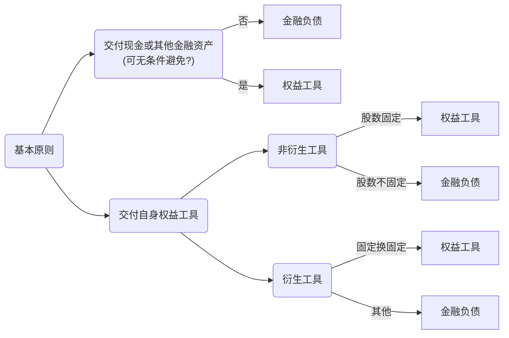
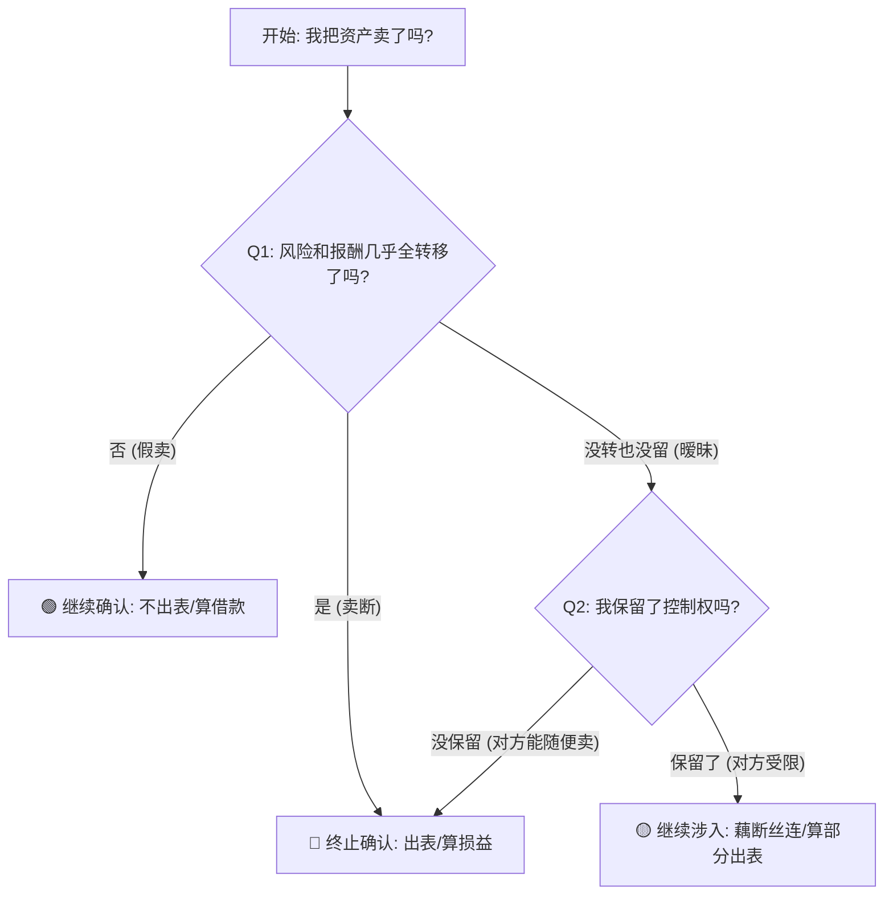

---
{"publish":true,"created":"2025-12-07T15:19:13.000+08:00","modified":"2026-01-11T20:27:46.805+08:00","tags":["note","CPA/会计"],"cssclasses":""}
---


> [!note] 本章重点
> - 考点一：金融资产的分类
> - 考点二：负债与权益的区分&复杂金融工具分析
> - 考点三：金融工具计量（初始确认，后续计量，减值，重分类，转移）
> - 考点四：套期会计

# 1. 金融工具定义

金融工具，是指形成一方的金融资产并形成其他方的金融负债或权益工具的合同

| 项目   | 定义与范围                                                                                                                                                                                                                                                                                             |
| ---- | ------------------------------------------------------------------------------------------------------------------------------------------------------------------------------------------------------------------------------------------------------------------------------------------------- |
| 金融资产 | 金融资产，是指企业持有的现金、其他方的权益工具及符合下列条件之一的资产：<br>（1）从其他方**收取现金或其他金融资产**的合同权利。_预付账款不是金融资产，未来得到的是商品或服务_<br>（2）在**潜在有利**条件下，与其他方交换金融资产或金融负债的合同权利。_期权_<br>（3）将来须用或可用企业自身权益工具进行结算的 **非衍生工具合同** ，且企业根据该合同将收到**可变数量**的自身权益工具。<br>（4）将来须用或可用企业自身权益工具进行结算的**衍生工具合同**，但以**固定**数量的自身权益工具交换**固定**金额的现金或其他金融资产的衍生工具合同除外 |
| 金融负债 | （1）交付现金或其他金融资产；<br>（2）在潜在不利条件下，与其他方交换金融资产或金融负债的合同义务<br>（3）以自身权益工具结算的非衍生工具合同，股数不固定；<br>（4）以自身权益工具结算的衍生工具合同，股数或交换的现金（或其他金融资产）金额不固定                                                                                                                                                                  |
| 权益工具 | （1）不包括交付现金或其他金融资产；<br>（2）以自身权益工具结算的非衍生工具合同，**股数固定**；<br>（3）以自身权益工具结算的衍生工具合同，股数和交换的现金（或其他金融资产）金额**均固定**。                                                                                                                                                                                           |
> [!faq] 如何理解金融资产/负债的不固定和权益工具的固定？
> - 可变数量的权益工具实际上对应着固定的金额，也就是说不承担股价变动的风险➡️负债/资产
> - 固定数量的权益工具对应着可变的金额，承担股价变动的风险和收益➡️权益工具
# 2.金融资产的分类
企业应当根据其**管理金融资产的业务模式**和金融资产的**合同现金流量特征**，将金融资产划分为三类。
## 2.1 业务模式
- 收取合同现金流量
- 收取合同现金流量+出售金融资产
- 其他
**注意:****（实质重于形式，主要还是看企业的“管理”模式，即初心）
- 如果金融资产实际现金流量的实现方式不同于评估业务模式时的预期（如企业出售的金融资产数量超出或少于在对资产作出分类时的预期），只要企业在评估业务模式时已经考虑了当时所有可获得的相关信息，这一差异不构成企业财务报表的前期差错，也不改变企业在该业务模式下持有的剩余金融资产的分类。但是，企业在评估新的金融资产的业务模式时，应当考虑这些信息。
- 以下情形金融资产的业务模式仍然可能是以收取合同现金流量为目标：
	- （1）金融资产的信用风险增加时为减少信用损失而将其出售；
	- （2）出售只是偶然发生（即使价值重大），或者单独及汇总出售的价值非常小（即使频繁发生）；
	- （3）临近到期出售且出售所得接近待收取的剩余合同现金流量。

## 2.2合同现金流量特征

相关金融资产在特定日期产生的合同现金流量仅为对本金和以未偿付本金金额为基础的利息的支付（**本金加利息的合同现金流量的特征**）。

**注意：**
- 将“贷款基准利率”调整为“贷款市场报价利率”本身不会导致相关金融资产不符合本金加利息的合同现金流量特征。
- 利率为“贷款市场报价利率+100基点”的贷款符合本金加利息的合同现金流量特征；
- 利率为“贷款市场报价利率向上浮动10%”的贷款不符合本金加利息的合同现金流量特征。
## 2.3金融资产分类决策树


- 企业一般应当设置“银行存款”、“贷款”、“应收账款”、“债权投资”等科目核算分类为以摊余成本计量的金融资产。
- 企业应当设置“其他债权投资”科目核算分类为以公允价值计量且其变动计入其他综合收益的债权投资。
- 企业应当设置“交易性金融资产”科目核算以公允价值计量且其变动计入当期损益的金融资产。企业持有的直接指定为以公允价值计量且其变动计入当期损益的金融资产，也在本科目核算。

> [!faq] “应收票据”和“应收账款”如何在资产负债表中列示？
> -	“应收票据”项目，反映资产负债表日以摊余成本计量的、企业因销售商品、提供服务等收到的商业汇票，包括银行承兑汇票和商业承兑汇票
> -	“应收账款”项目，反映资产负债表日以摊余成本计量的、企业因销售商品、提供服务等经营活动应收取的款项
> -	“应收款项融资”项目，反映资产负债表日以公允价值计量且其变动计入其他综合收益的应收票据和应收账款等
> -	“交易性金融资产”项目，反映资产负债表日以公允价值计量且其变动计入当期损益的应收票据和应收账款等
>  1. 应收票据 / 应收账款
> - **场景**：老实本分的持有。企业收到一张商业承兑汇票（商票），或者有一笔应收账款，企业资金充裕，打算一直等到到期日找付款人要钱。
> - **CPA考点**：这是最传统的情况，计提减值准备（信用减值损失）。
>  2.  应收款项融资（重点！🌟）
> - **场景**：灵活的资金管理。企业收到一张**信用等级很高的银行承兑汇票（银票）**。
> - 企业通常把这类高等级银票看作“准现金”。
> - **平时**：放在抽屉里等着到期。
> - **缺钱时**：随时拿去银行贴现，或者背书转让给供应商抵债。
> - 这种**“既收取合同现金流量，又出售”**的模式，就必须列示为**“应收款项融资”**。
> - **信托实务**：我们在看城投或上市公司报表时，如果看到“应收款项融资”有余额，通常代表这部分资产质量较好（多为高信用等级银票），流动性强。
>  3. 交易性金融资产
> - **场景**：激进交易或不合格资产。
> - **情况1（意图）**：企业专门从事票据买卖赚差价（虽然合规性有争议，但会计上属此类）。
> - **情况2（SPPI测试失败）**：这是CPA难点。如果一张票据的条款很奇葩（比如挂钩了黄金价格、或者有特殊的转换权），导致它无法通过“本金+利息”测试（SPPI测试），那不管你想不想卖，都**强制**分类为FVTPL，列示为“交易性金融资产”。
 
> [!example] 真题2020·单选题
> 2×16年12月30日，甲公司以发行新股作为对价，购买乙公司所持丙公司60%股份。乙公司在股权转让协议中承诺，在本次交易完成后的3年内（2×17年至2×19年）丙公司每年净利润不低于5000万元，若丙公司实际利润低于承诺利润，乙公司将按照两者之间的差额及甲公司作为对价发行时的股票价格计算应返还给甲公司的股份数量，并在承诺期满后一次性予以返还。2×17年，丙公司实际利润低于承诺利润，经双方确认，乙公司应返还甲公司相应的股份数量。不考虑其他因素，下列各项关于甲公司应收取乙公司返还的股份在2×17年12月31日合并资产负债表中列示的项目名称是（ ）。
> A. 其他债权投资
> B. 交易性金融资产
> C. 其他权益工具投资
> D. 债权投资
>
> > [!check]- 答案与解析
> > 
> > **正确答案：B**
> >
> > **深度解析：**
> > **第一步：业务定性。** 甲公司因业绩承诺未达标而应收取的股份，属于企业合并中形成的**或有对价**。
> >
> > **第二步：金融资产分类。** 该权利的收益取决于标的公司（丙公司）的净利润，不满足“本金加利息”的合同现金流量特征（**SPPI测试失败**）。根据金融工具准则，此类资产必须强制分类为**以公允价值计量且其变动计入当期损益的金融资产**。
> >
> > **第三步：报表列示。** 在资产负债表中，此类资产应列示为**“交易性金融资产”**。
> >
> > **💡 易错点提示：**
> > 虽然涉及股份返还，但这本质是甲公司的一项**金融资产权利**（具有看跌期权性质），而非甲公司主动持有的“权益工具投资”。因此，不能分类为“其他权益工具投资”。

> [!example] 例题·多选题
> 下列各种投资产品中，企业可能划分为以公允价值计量且其变动计入当期损益的金融资产的有（　）。
> 
> A. 从二级市场购入的股票
> B. 从二级市场购入的基金
> C. 可转换公司债券
> D. 被指定为有效套期工具的衍生工具
>
> > [!check]- 答案与解析
> > 
> > **正确答案：ABC**
> >
> > **深度解析：**
> > **1. 权益工具与基金（选项A、B）：**
> > 企业从二级市场购入的**股票**、**基金**，通常以赚取差价为目的，且不符合“仅为偿付本金和利息”的特征（即未通过 **SPPI 测试**），因此应分类为**以公允价值计量且其变动计入当期损益的金融资产**（交易性金融资产）。
> >
> > **2. 混合工具（选项C）：**
> > **可转换公司债券**由于包含了转股权，其合同现金流量特征不符合 **SPPI 测试**（并非单纯的本金加利息），因此不能分类为以摊余成本计量或以公允价值计量且其变动计入其他综合收益的金融资产，必须整体划分为**以公允价值计量且其变动计入当期损益的金融资产**。
> >
> > **3. 衍生工具的特殊性（选项D）：**
> > 虽然衍生工具通常以公允价值计量，但如果被指定为**有效套期工具**，其公允价值变动的会计处理应遵循《企业会计准则第 $24$ 号——套期会计》，其变动不一定直接计入当期损益（如现金流量套期中有效部分计入 **OCI**），因此不属于本题界定的范畴。
> >
> > **💡 易错点提示：**
> > 注意区分“衍生工具”的一般状态与“套期状态”。**一般衍生工具**（如远期、期权）默认划分为 FVTPL，但一旦被指定为**有效套期工具**，则适用套期会计准则，不再属于常规的金融资产分类框架。

# 3.金融负债与权益工具的区分
## 3.1 一般原则


## 3.2	特殊情况
### 3.2.1 以外币计价的配股权、期权或认股权证
- 通常情况下不符合“固定换固定”原则（折算的记账本位币金额不固定），应分类为金融负债
- 但是，准则对以外币计价的配股权、期权或认股权证提供了一个例外情况：企业对全部现有同类别非衍生自身权益工具的持有方同比例发行配股权、期权或认股权证，使之有权**按比例**以固定金额的任何货币交换固定数量的该企业自身权益工具的，该类配股权、期权或认股权证应当分类为权益工具。这是一个范围很窄的例外情况，不能以类推方式适用于其他工具（如以外币计价的可转换债券和并非按比例发行的配股权、期权或认股权证）。
### 3.2.2 或有结算条款
- 对附有或有结算条款的金融工具，发行方不能无条件地避免交付现金、其他金融资产或以其他导致该工具成为金融负债的方式进行结算的，应当分类为金融负债。
- 满足下列条件之一的，发行方应当将其分类为权益工具：
	- （1）进行结算的或有条款几乎不可能发生；
	- （2）如只有在发行方清算时，才需以现金、其他金融资产或以其他导致该工具成为金融负债的方式进行结算；
	- （3）特殊金融工具中分类为权益工具的可回售工具。
### 3.2.3 结算选择权
- 对于存在结算选择权的衍生工具（例如，合同规定发行方或持有方能选择以现金净额或以发行股份交换现金等方式进行结算的衍生工具），发行方应当将其确认为金融负债或金融资产，如果可供选择的结算方式均表明该衍生工具应当确认为权益工具，则应当确认为权益工具。
> [!note] 理解
> - 简单说就是，你有多种方式结算的情况下，除非都是结算方式都是固定/固定换固定进行结算（判定为权益工具），否则都按金融负债/金融资产计量。
> - 这样规定意在避免企业通过设计复杂的结算选择权来将负债伪装成权益
### 3.2.4 合并财务报表中金融负债和权益工具的区分
- 在合并财务报表中对金融工具（或其组成部分）进行分类时，企业应考虑集团成员和金融工具的持有方之间达成的所有条款和条件，以确定集团作为一个整体是否由于该工具而承担了交付现金或其他金融资产的义务，或者承担了以其他导致该工具分类为金融负债的方式进行结算的义务。

> [!example] 例题·案例分析题
> 甲公司为乙公司的母公司，其向乙公司的少数股东签出一份在未来 $6$ 个月后以乙公司普通股为基础的看跌期权。
> 
> **已知条件：**
> 如果 $6$ 个月后乙公司股票价格下跌，乙公司少数股东有权要求甲公司无条件的以固定价格购入乙公司少数股东所持有的乙公司股份。
> 
> **问题：**
> 请分别说明该看跌期权在**甲公司个别报表**、**乙公司个别报表**以及**集团合并报表**中的会计处理原则。
>
> > [!check]- 答案与解析
> > 
> > **正确结论：**
> > 1. 甲公司个别报表：确认为**衍生金融负债**。
> > 2. 乙公司个别报表：确认为**权益工具**（少数股东权益）。
> > 3. 集团合并报表：确认为**金融负债**（金额为回购现值）。
> >
> > **深度解析：**
> > **第一步：个别报表层面（甲公司）**
> > 该看跌期权的价值随乙公司股票价格变动而变动，且在未来约定日期结算，符合衍生工具定义。甲公司应将其确认为一项**衍生金融负债**，按公允价值计量。
> > 
> > **第二步：个别报表层面（乙公司）**
> > 对于乙公司而言，少数股东持有的股份属于其自身的**权益工具**，不因母公司签出的期权而改变其权益性质。
> > 
> > **第三步：合并报表层面（集团整体）**
> > 根据“实质重于形式”原则，该看跌期权导致集团整体承担了**不能无条件避免**支付现金的合同义务。
> > - **处理逻辑：** 少数股东权益不再符合权益定义。
> > - **计量金额：** 应确认一项金融负债，其金额等于回购所需支付金额的**现值**（$PV$）。
> >
> > **💡 易错点提示：**
> > 1. **区分工具性质：** 在合并层面，该义务将“权益”属性转化为“负债”属性，这是合并报表抵销分录中的难点。
> > 2. **计量基础：** 注意合并报表确认的是**回购义务的现值**，而非期权本身的公允价值。

# 4. 常见复杂金融工具分析
## 4.1	嵌入式衍生工具

1.	**概念**
- 衍生工具通常是独立存在的，但也可能嵌入到非衍生金融工具或其他合同（主合同）中，这种衍生工具称为嵌入衍生工具。嵌入衍生工具与主合同构成混合合同（如企业持有的可转换公司债券）。
	- 主合同通常包括租赁合同、保险合同、服务合同、特许权合同、债务工具合同、合营合同等。
	- 在混合合同中，嵌入衍生工具通常以具体合同条款体现。例如，甲公司签订了按一般物价指数调整租金的3年期租赁合同。
	- 衍生工具如果附属于一项金融工具但根据合同规定可以独立于该金融工具进行转让，或者具有与该金融工具不同的交易对手方，则该衍生工具不是嵌入衍生工具，应当作为一项单独存在的衍生工具处理。

2. **嵌入衍生工具与主合同的关系**
 - 混合合同包含的主合同属于金融工具准则规范的**资产**的
	- 应当将该混合合同作为一个整体适用关于金融资产分类的相关规定，不分拆
- 混合合同包含的主合同并非金融工具准则范围的资产（**其他非金融资产或者金融负债、权益**）
	- 经济特征和风险与主合同的经济特征和风险紧密相关，不分拆
	- 经济特征和风险与主合同的经济特征和风险不紧密相关，结合其他条件决定是否分拆
> [!note] 重点：嵌入衍生工具是否分拆的判断
> 处理混合合同时，**第一步永远是判断“主合同”对会计主体而言是什么**。这决定了后续完全不同的处理路径。
> 
> **1. 当主合同是“金融资产”时**
> - **场景**：您的会计主体是**持有人、投资者**。例如，信托公司持有一份“附带看涨期权的应收账款”投资。
> - **规则**：应当将该混合合同作为一个整体适用关于金融资产分类的相关规定，不分拆。
> - **逻辑**：因为您是资产持有方，您关心的是从这项资产中获取的**整体合同现金流量**。会计准则要求您根据“业务模式”和“合同现金流特征（SPPI测试）”来对这个**整体现金流**进行分类（是摊余成本、FVOCI还是FVTPL）。拆开分析没有意义。
> 
> **2. 当主合同是“金融负债”或“权益工具”时**
> - **场景**：您的会计主体是**发行人、融资方**。例如，甲公司发行可转换债券或可回售优先股。
> - **规则**：需要评估嵌入衍生工具。如果同时满足：
>     - (1) 嵌入衍生工具的经济特征和风险与主合同**不紧密相关**；
>     - (2) 混合工具**未被整体指定**为以公允价值计量且其变动计入当期损益（FVTPL）。
>     - 则 **“应当将该嵌入衍生工具分拆”**。
> - **逻辑**：因为您是负债/权益的发行方，需要分别清晰地确认和计量您的**还本付息义务（主合同）** 和附加的**风险敞口（嵌入衍生工具）**，以公允反映您的财务状况。权益价格风险（来自转股权）与债务的信用/利率风险本质不同，因此通常需要分拆。

3. **会计处理**
- 嵌入衍生工具从混合合同中分拆的，企业应当按照适用的会计准则规定，对混合合同的主合同进行会计处理。对于单独存在的衍生工具，通常应采用公允价值进行初始计量和后续计量。
-  一项混合合同中的多项嵌入衍生工具通常应视同为一项工具处理。但是，归类为权益的嵌入衍生工具应与归类为资产或负债的嵌入衍生工具分开核算。此外，如果某混合合同嵌入了多项衍生工具而这些衍生工具又与不同的风险敞口相关，且这些嵌入衍生工具易于分离并相互独立，则这些嵌入衍生工具应分别进行核算。
 
> [!example] 真题（2024回忆）·单选题
> 下列各项关于企业持有金融资产会计处理的表述中，正确的是（　　）。
> A. 分拆持有的可转换债券中的转股权并对其按公允价值进行后续计量
> B. 持有的浮动收益货币基金按摊余成本计量
> C. 持有的每年将利率重设为 $1.3$ 倍贷款市场报价利率的长期债券按公允价值计量
> D. 持有的可回售开放式基金份额分类为其他权益工具投资
>
> > [!check]- 答案与解析
> > 
> > **正确答案：C**
> >
> > **深度解析：**
> > 1. **选项 A 错误（混合合同分拆原则）：** 购入的可转换债券属于**混合合同**。当主合同属于金融资产时，企业**不应**从中分拆嵌入衍生工具（如转股权），而应当将该混合合同作为一个**整体**进行金融资产分类。
> > 2. **选项 B 错误（SPPI 测试）：** 浮动收益货币基金的现金流量不仅包括本金和利息，还包括处置基础资产的收益，**不符合**“本金加利息”的合同现金流量特征（SPPI 测试），因此不能分类为以摊余成本计量的金融资产。
> > 3. **选项 C 正确（杠杆因素影响）：** 利率重设为 $1.3$ 倍贷款市场报价利率（LPR），由于存在**杠杆因素**，使得合同现金流量不再仅为对本金和未偿付本金金额为基础的利息的支付，未通过 SPPI 测试，应分类为**以公允价值计量且其变动计入当期损益的金融资产（FVTPL）**。
> > 4. **选项 D 错误（权益工具指定前提）：** 可回售工具（如开放式基金份额）在发行方账务处理中通常不符合权益工具定义。对于投资方而言，只有**非交易性权益工具投资**才能指定为以公允价值计量且其变动计入其他综合收益的金融资产（FVOCI），可回售基金份额不在此列。（另一个角度：很容易判断发行方肯定是把它分类为金融负债，那么持有方就分类为金融资产（非权益工具投资）
> >

> [!example] 例题·单选题
> 甲公司发行了一项可回售可转换优先股。该优先股条款约定，若甲公司 $5$ 年内未能成功上市，则投资者有权在第 $5$ 年末将该优先股按照约定的收益率回售给甲公司。此外，投资者可以随时将该优先股转换成甲公司的普通股，初始转股价格固定，但当甲公司后续发行新股的价格低于初始转股价格时，投资者有权要求将初始转股价格下调，且下调后不再转回。如果混合合同整体没有指定为以公允价值计量且其变动计入当期损益的金融负债。下列表述中错误的是（ ）。
> 
> A. 应将该股份转换权分拆为单独的衍生工具核算
> B. 股份转换权属于嵌入衍生工具
> C. 不能将股份转换权与主合同进行分拆
> D. 股份转换权与主债务合同不紧密相关
>
> > [!check]- 答案与解析
> > 
> > **正确答案：C**
> >
> > **深度解析：**
> > **第一步：识别合同构成**
> > 该金融工具属于混合合同。**主合同**是一项可回售的优先股（本质上是**金融负债**）；**嵌入衍生工具**是附带的股份转换权（转股权）。
> >
> > **第二步：判断嵌入衍生工具是否需要分拆**
> > 根据会计准则，嵌入衍生工具同时满足以下条件时，应从混合合同中分拆：
> > 1. **经济特征和风险不紧密相关**：主合同为债务性质，而股份转换权具有权益或衍生工具属性，两者的经济特征和风险**不紧密相关**（对应选项 D 正确）。
> > 2. **不属于 FVTPL**：题目明确“混合合同整体没有指定为以公允价值计量且其变动计入当期损益的金融负债”。
> > 3. **符合衍生工具定义**：由于存在**转股价下调条款**（Down-round），该转换权不符合“固定换固定”原则，不能确认为权益工具，而应作为**衍生工具**核算（对应选项 A、B 正确）。
> >
> > 
> > **💡 易错点提示：**
> > 关键在于判断“**固定换固定**”原则。如果转股价格会根据未来发售价下调，则该转股权不属于权益工具，必须作为**嵌入衍生工具**进行分拆处理。

## 4.2	可转换债券

企业应当在初始确认时将负债和权益成分进行分拆，分别进行处理。在进行分拆时，应当先确定负债成分的公允价值并以此作为其初始确认金额，再按照该金融工具整体的发行价格扣除负债成分初始确认金额后的金额确定权益成分的初始确认金额。

1. **发行可转换公司债券：**
借：银行存款
　　应付债券—利息调整（或贷方）
　贷：应付债券—面值
　　　**其他权益工具**（权益成分的公允价值）
2. **转换股份前：**
可转换公司债券的负债成分，在转换为股份前，其会计处理与一般公司债券相同，即按照实际利率和摊余成本确认利息费用，按面值和票面利率确认应付利息，差额作为利息调整进行摊销。
3. **转换股份时：**
借：应付债券—（面值、利息调整、应计利息）（账面余额）
　　其他权益工具（转换部分权益成分的公允价值）
　贷：股本（股票面值×转换的股数）
　　　资本公积—股本溢价（差额）
> [!example] 例题·单选题
> 甲公司于 $2 \times 22$ 年 $1$ 月 $1$ 日发行 $1000$ 万份可转换公司债券，每份面值为 $100$ 元，发行价格为每份 $100.5$ 元。该可转换公司债券在发行 $2$ 年后，每份可转换为 $4$ 股甲公司普通股（每股面值 $1$ 元）。
> 
> 甲公司在发行该可转换公司债券时确认的**负债成分**初始计量金额为 $100150$ 万元。截至 $2 \times 23$ 年 $12$ 月 $31$ 日，与该可转换公司债券相关的**负债账面价值**为 $100050$ 万元。
> 
> $2 \times 24$ 年 $1$ 月 $2$ 日，该可转换公司债券全部转换为甲公司股份。不考虑其他因素，甲公司因可转换公司债券的转换应确认的**资本公积（股本溢价）**为（ ）万元。
> 
> > [!check]- 答案与解析
> > 
> > **正确答案：96400**
> > 
> > **深度解析：**
> > 
> > **第一步：计算发行时权益成分（其他权益工具）的金额**
> > 可转换公司债券发行总收款 = $1000 \times 100.5 = 100500$（万元）
> > 权益成分初始入账价值 = 发行总收款 - 负债成分初始确认金额
> > 即：$100500 - 100150 = 350$（万元）
> > 
> > **第二步：计算转换时增加的“股本”金额**
> > 股本 = 转换的债券份数 $\times$ 转换比例 $\times$ 股票面值
> > 即：$1000 \times 4 \times 1 = 4000$（万元）
> > 
> > **第三步：计算结转的“资本公积——股本溢价”**
> > 转换时，应将**负债成分的账面价值**与**权益成分的账面价值**全部结转，差额计入股本溢价。
> > 计算公式：$100050（负债账面） + 350（权益成分） - 4000（股本） = 96400$（万元）
> > 
> > **💡 易错点提示：**
> > 1. **双重结转**：转股时不仅要结转“应付债券（负债成分）”，还必须结转初始确认的“其他权益工具（权益成分）”。
> > 2. **价值选择**：计算股本溢价时，负债成分应采用**转换当日的账面价值**（$100050$），而非初始计量金额（$100150$）。

## 4.3	永续债
1.	**发行方会计分类**
（1）到期日：
- 永续债合同明确规定无固定到期日且持有方在任何情况下均无权要求发行方赎回该永续债或清算的，通常表明发行方没有交付现金或其他金融资产的合同义务---权益工具
- 永续债合同未规定固定到期日且同时规定了未来赎回时间（即“初始期限”）
	- 当该初始期限仅约定为发行方清算日时，通常表明发行方没有交付现金或其他金融资产的合同义务。但清算确定将会发生且不受发行方控制，或者清算发生与否取决于该永续债持有方的，发行方仍具有交付现金或其他金融资产的合同义务---金融负债
	- 当该初始期限不是发行方清算日且发行方能自主决定是否赎回永续债时，发行方应当谨慎分析自身是否能无条件地自主决定不行使赎回权。如不能，通常表明发行方有交付现金或其他金融资产的合同义务---金融负债

（2）清偿顺序
- 合同规定发行方清算时永续债劣后于发行方发行的普通债券和其他债务，通常表明发行方无交付现金或其他金融资产的合同义务---权益工具
- 合同规定发行方清算时永续债与发行方发行的普通债券和其他债务处于相同清偿顺序的，应当审慎考虑此清偿顺序是否会导致持有方对发行方承担交付现金或其他金融资产合同义务的预期，并据此确定其会计分类---金融负债或权益工具

（3）利率跳升和间接义务
- 如果跳升次数有限、有最高票息限制（即“封顶”）且封顶利率未超过同期同行业同类型工具平均的利率水平；跳升总幅度较小且封顶利率未超过同期同行业同类型工具平均的利率水平---可能不构成间接义务
- 如果永续债合同条款虽然规定了票息封顶，但该封顶票息水平超过同期同行业同类型工具平均的利率水平---通常构成间接义务

> [!example] 真题-2024年回忆版·多选题
> $2 \times 24$ 年 $4$ 月 $1$ 日，甲公司按面值发行永续债募集资金 $50,000$ 万元，票面年利率为 $3.8\%$，支付发行费用 $1,000$ 万元。该永续债符合权益工具的定义。$2 \times 25$ 年 $3$ 月 $31$ 日，甲公司根据上年实现的净利润拟进行股利分配，并用上年实现的净利润向永续债持有人先行支付了利息。根据企业所得税法规定，该永续债的利息可以在当期税前扣除。不考虑除企业所得税以外的相关税费及其他因素，下列各项关于甲公司永续债会计处理的表述中，正确的有（　　）。
> 
> A. 将发行的永续债确认为其他权益工具
> B. 将支付永续债利息的所得税影响计入当期损益
> C. 将支付的发行费用冲减所有者权益
> D. 将分派的永续债利息按利润分配处理
>
> > [!check]- 答案与解析
> > 
> > **正确答案：ABCD**
> >
> > **深度解析：**
> > 1. **初始分类**：由于该永续债符合权益工具定义，甲公司应将其确认为**其他权益工具**。其初始入账金额为发行收入扣除相关交易费用，即：
> >    $50,000 - 1,000 = 49,000$ **万元**。故选项 **A** 正确。
> > 2. **发行费用处理**：与发行权益工具直接相关的交易费用（如发行费用 $1,000$ 万元）应当**冲减所有者权益**（通常先冲减资本公积——资本溢价/股本溢价，不足冲减的再冲减留存收益）。故选项 **C** 正确。
> > 3. **利息分配性质**：对于分类为权益工具的金融工具，其分派的股利（或利息）应作为**利润分配**处理，借记“利润分配”等科目。故选项 **D** 正确。
> > 4. **所得税影响的归属（核心考点）**：
> >    - 根据准则规定，企业分配金融工具的利息/股利，其所得税影响应与**过去产生可供分配利润的交易或事项**的确认方式保持一致。
> >    - 本题中，永续债利息可**税前扣除**，且分配是基于“上年实现的净利润”（即来源于损益交易），因此其所得税影响（即抵税收益）应计入**当期损益**（所得税费用）。故选项 **B** 正确。
> >
> > **💡 易错点提示：**
> > 永续债利息所得税影响的会计处理遵循“**溯源原则**”。
> > - 如果分配的利润来源于**损益**（如留存收益），则抵税效应计入**当期损益**；
> > - 如果分配来源于**权益交易**（如其他综合收益），则抵税效应计入**权益**。
> > 在 CPA 考试中，若无特殊说明，永续债利息的抵税影响通常均计入“**所得税费用**”。

## 4.4	可回售工具

可回售工具，是指根据合同约定，持有方有权将该工具回售给发行方以获取现金或其他金融资产的权利，或者在未来某一不确定事项发生或者持有方死亡或退休时，自动回售给发行方的金融工具。

符合金融负债定义，但同时具有下列特征的可回售工具，应当分类为权益工具：
（1）赋予持有方在企业清算时按比例份额获得该企业净资产的权利
（2）该工具所属的类别次于其他所有工具类别，即该工具在归属于该类别前无须转换为另一种工具，且在清算时对企业资产没有优先于其他工具的要求权
（3）该类别的所有工具具有相同的特征（例如它们必须都具有可回售特征，并且用于计算回购或赎回价格的公式或其他方法都相同）
（4）除了发行方应当以现金或其他金融资产回购或赎回该工具的合同义务外，该工具不满足金融负债定义中的任何其他特征；
（5）该工具在存续期内的预计现金流量总额，应当实质上基于该工具存续期内企业的损益、已确认净资产的变动、已确认和未确认净资产的公允价值变动（不包括该工具的任何影响）

> [!example] 例题·案例分析
> 甲公司设立时发行了 $100$ 单位 A 类股份，而后发行了 $10,000$ 单位 B 类股份给其他投资人，B 类股份为**可回售股份**。假定甲公司只发行了 A、B 两种金融工具，A 类股份为甲公司**最次级**权益工具。
> 
> **思考：**
> 1. 在甲公司个别报表中，B 类股份应分类为权益还是负债？
> 2. 在母公司合并财务报表中，该工具对应的少数股东权益应如何列报？
>
> > [!check]- 答案与解析
> > **正确处理：**
> > 1. 个别报表：分类为**金融负债**。
> > 2. 合并报表：分类为**金融负债**。
> >
> > **深度解析：**
> > **第一步：判断个别报表中的分类（最次级原则）**
> > 虽然 B 类股份（$10,000$ 单位）在金额上远大于 A 类股份（$100$ 单位），但根据金融工具列报准则，可回售工具划分为权益工具的前提之一是：该工具必须是发行方**最次级**的工具。
> > 本例中，**A 类股份**才是最次级工具，因此 B 类股份不符合“例外情形”，应当分类为**金融负债**。
> >
> > **第二步：判断合并报表中的分类（例外不扩大原则）**
> > 准则规定，将某些可回售工具（或仅在清算时才有义务交付净资产的工具）列报为权益工具，是基于特定条件的**会计处理例外**。
> > **核心逻辑：** 该“例外”**不允许扩大**应用。即：即使子公司在个别报表中因符合条件将其列为权益，在母公司合并报表中，对应的少数股东权益部分也必须回归其工具本质，分类为**金融负债**。
> >
> > **💡 易错点提示：**
> > 1. **规模误导：** 不要被股份数量或金额大小（$10,000$ vs $100$）误导，判断权益属性的核心是**清算时的受偿顺序**（是否最次级）。
> > 2. **合并抵消陷阱：** 记住“例外不扩大”原则。子公司个别报表的“权益”身份在合并报表层面往往会“打回原形”变为“负债”。

> [!note] 监管规则适用指引—会计类第1号：附回售条款的股权投资
> 
> **核心逻辑**：回售条款导致被投资方存在无法避免向投资方交付现金的合同义务。
> 
>  1. 总体会计处理对照表
> 
> | 视角 | 情形 1：无重大影响（如持股 3%） | 情形 2：有重大影响（如持股 30%） |
> | :--- | :--- | :--- |
> | **被投资方** | **金融负债** | **金融负债** |
> | **投资方** | **金融资产 (FVTPL)** | **实质重于形式判断**：<br>1. 风险报酬异于普通股 $\rightarrow$ **FVTPL**<br>2. 风险报酬同于普通股 $\rightarrow$ **长投 + 嵌入衍生工具** |
> 
> ---
> 
>  2. 详细分类路径
> 
>  **情形 1：无重大影响**
> - **被投资方**：分类为**金融负债**。
> - **投资方**：适用金融工具准则。因不满足权益工具定义且 SPPI 测试未通过，分类为：**以公允价值计量且其变动计入当期损益的金融资产 (FVTPL)**。
> 
>**情形 2：有重大影响**
> - **被投资方**：分类为**金融负债**。
> - **投资方**（基于风险报酬特征判断）：
>     - **若风险报酬明显不同于普通股**：整体作为金融工具核算，分类为 **FVTPL**。
>     - **若风险报酬与普通股实质相同**：
>         - 主体部分分类为**长期股权投资**（权益法核算）。
>         - 回售权视为**嵌入衍生工具**，进行分拆并单独以公允价值计量。
> 
> **注**：持有期间获得的股利，按上述分类（FVTPL 或长投）对应的准则处理。

# 5.金融工具的计量
## 5.1	初始计量
| 分类                          | 初始成本                   |
| --------------------------- | ---------------------- |
| 以公允价值计量且其变动计入当期损益的金融资产和金融负债 | 公允价值，交易费用计入当期损益        |
| 其他类别的金融资产或金融负债              | 公允价值+交易费用（资产）-交易费用（负债） |
相关链接：[[A2-会计归纳/各类交易费用与中介费用]]
> [!example] 例题·多选题
> 下列各项中，不应计入相关金融资产或金融负债初始入账价值的有（　）。
> 
> - A. 发行一般公司债券发生的交易费用
> - B. 取得以公允价值计量且其变动计入当期损益的金融资产发生的交易费用
> - C. 发行指定为以公允价值计量且其变动计入当期损益的金融负债的短期融资券发生的交易费用
> - D. 取得长期借款发生的交易费用
>
> > [!check]- 答案与解析
> > 
> > **正确答案：B、C**
> >
> > **深度解析：**
> > **1. 核心逻辑：**
> > 金融工具初始计量中，交易费用的处理取决于该金融工具的**分类**。
> >
> > **2. 选项详细拆解：**
> > - **选项 B、C（不计入）：**
> >   这两项分别属于以**公允价值计量且其变动计入当期损益**的金融资产（类比交易性金融资产）和金融负债（类比交易性金融负债）。
> >   - **会计处理：** 发生的交易费用直接计入**当期损益**（借记“投资收益”）。
> >   - **结论：** 不计入初始入账价值。
> >
> > - **选项 A、D（计入）：**
> >   这两项属于以**摊余成本计量**的金融负债。
> >   - **会计处理：** 发生的交易费用应当**计入**初始入账价值（即冲减负债的初始确认金额）。
> >   - **分录体现：** 借记“应付债券——利息调整”或“长期借款——利息调整”。
> >   - **结论：** 计入初始入账价值。

## 5.2	金融资产的后续计量
### 5.2.1 以摊余成本计量的金融资产

**摊余成本：**
金融资产或金融负债的摊余成本，应当以该金融资产或金融负债的初始确认金额经下列调整确定：
- 扣除已偿还的本金。
- 加上或减去采用实际利率法将该初始确认金额与到期日金额之间的差额进行摊销形成的累计摊销额。
- 扣除计提的累计信用减值准备（仅适用于金融资产）

> [!note]
>  - **摊余成本变动逻辑**：期末摊余成本 $=$ 期初摊余成本 $+$ 投资收益（期初摊余成本 $\times$ 实际利率）$-$ 现金利息（面值 $\times$ 票面利率）。
>  - 解题关键在于利息支付时间，有现金利息支付才减去。

（1）债权投资的初始计量	
```
借：债权投资—成本（面值）
　　　　—利息调整（差额，或贷方）
　　  应收利息（已到付息期但尚未领取的利息）
　贷：银行存款等
```

（2）债权投资的后续计量	
```
借：债权投资—应计利息（债券按票面利率计算的利息）
　贷：投资收益（债权投资期初账面余额或期初摊余成本乘以实际利率或经信用调整的实际利率计算确定的利息收入）
　债权投资—利息调整（差额，利息调整摊销额，或借方）
```

（3）出售债权投资	
```
借：银行存款等
  债权投资减值准备
  贷：债权投资—成本/利息调整/应计利息
　  投资收益（差额，或借方）
```

> [!example] 例题·单选题
> 2×24年1月1日，甲公司支付 **1,947** 万元购入乙公司当日发行的期限为3年、**每年年末付息**、到期偿还面值的公司债券。该债券的面值为 **2,000** 万元，票面年利率为 **5%**，实际年利率为 **6%**。甲公司将该债券分类为**以摊余成本计量的金融资产**。
> 
> 不考虑其他因素，2×24年12月31日，该债券投资的账面价值是（ ）万元。
>
> > [!check]- 答案与解析
> > **正确答案：1,963.82**
> >
> > **深度解析：**
> > **第一步：理解会计处理逻辑**
> > 以摊余成本计量的金融资产（债权投资），其期末账面价值（摊余成本）的计算逻辑为：
> > `期末摊余成本 = 期初摊余成本 + 投资收益（期初摊余成本 × 实际利率）- 现金流入（面值 × 票面利率）`
> >
> > **第二步：计算 2×24 年 12 月 31 日的账面价值**
> > - **期初摊余成本**：$1,947$ 万元
> > - **2×24 年投资收益**：$1,947 \times 6\% = 116.82$ 万元
> > - **2×24 年应收利息**：$2,000 \times 5\% = 100$ 万元
> > - **期末账面价值**：$1,947 + 116.82 - 100 = 1,963.82$ 万元
> >
> > **第三步：计算 2×25 年的投资收益**
> > 2×25 年的投资收益应以 2×24 年末的摊余成本为基数计算：
> > $1,963.82 \times 6\% = 117.83$ 万元
> >
> > **💡 易错点提示：**
> > 1. **折价摊销方向**：本题为折价购入（$1,947 < 2,000$），每期的投资收益会大于应收利息，导致账面价值逐期递增，向面值靠拢。
> > 2. **利率区分**：计算“投资收益”务必使用**实际利率**，计算“应收利息”务必使用**票面利率**。

> [!example] 例题·单选题
> A公司于 $20\times8$ 年 $1$ 月 $1$ 日购入某公司于当日发行的 $5$ 年期、面值总额为 $3\,000$ 万元、一次还本分期付息的公司债券，每年末支付当年利息，票面年利率为 $5\%$，实际支付价款为 $3\,130$ 万元；另支付交易费用 $2.27$ 万元，实际利率为 $4\%$。A公司根据该项投资的合同现金流量特征及管理该债券的业务模式，将其分类为**以摊余成本计量的金融资产**。不考虑其他因素，A公司在 $20\times9$ 年 $12$ 月 $31$ 日应确认的投资收益为（　）。
> 
> A. $124.2$ 万元
> B. $125.29$ 万元
> C. $124.30$ 万元
> D. $150$ 万元
>
> > [!check]- 答案与解析
> > 
> > **正确答案：C**
> >
> > **深度解析：**
> > **第一步：计算初始入账价值**
> > 以摊余成本计量的金融资产，初始入账价值为公允价值与相关交易费用之和。
> > $20\times8$ 年 $1$ 月 $1$ 日初始入账金额 $= 3\,130 + 2.27 = 3\,132.27$（万元）。
> >
> > **第二步：计算 $20\times8$ 年末的摊余成本**
> > 1. $20\times8$ 年应确认的**投资收益** $= 3\,132.27 \times 4\% = 125.29$（万元）。
> > 2. $20\times8$ 年应收取的**现金利息** $= 3\,000 \times 5\% = 150$（万元）。
> > 3. $20\times8$ 年 $12$ 月 $31$ 日的**摊余成本** $= 3\,132.27 + 125.29 - 150 = 3\,107.56$（万元）。
> >
> > **第三步：计算 $20\times9$ 年应确认的投资收益**
> > $20\times9$ 年应确认的**投资收益** $= 20\times8$ 年末摊余成本 $\times$ 实际利率
> > 即：$3\,107.56 \times 4\% = 124.3024 \approx 124.30$（万元）。
> >

### 5.2.2 以公允价值计量且其变动计入当期损益的金融资产
  

（1）企业取得交易性金融资产	
```
借：交易性金融资产—成本（公允价值）
　　投资收益 （发生的交易费用）
　　应收股利（已宣告但尚未发放的现金股利）
　　应收利息（已到付息期但尚未领取的利息）
　贷：银行存款等
```
　
（2）持有期间的股利或利息	
```
借：应收股利（被投资单位宣告发放的现金股利×投资持股比例）
　　交易性金融资产—应计利息（资产负债表日计算的应收利息）
　贷：投资收益
```
　企业在持有期间取得的利息，可以单独确认为投资收益，也可以汇总反映在该金融资产的公允价值变动中
　
（3）资产负债表日公允价值变动	
```
借：交易性金融资产—公允价值变动
　贷：公允价值变动损益
```

　（4）出售交易性金融资产	
```
借：银行存款（出售净价，即价款扣除手续费）
　贷：交易性金融资产—成本
　　　　　　　　　　—公允价值变动（或借方）
　　　投资收益（差额，或借方）
```
目前，按教材做法，出售交易性金融资产时，不将交易性金融资产持有期间形的公允价值变动损益转入投资收益.

> [!example] 例题 
> 2×24年1月10日，甲公司以银行存款5 110万元（含交易费用10万元）购入乙公司股票，将其作为交易性金融资产核算。2×24年4月28日，甲公司收到乙公司2×24年4月24日宣告分派的现金股利80万元。2×24年12月31日，甲公司持有的该股票公允价值为5 600万元，不考虑其他因素，该项投资使甲公司2×24年营业利润增加的金额是（　　）万元。
> > 【解析】取得交易性金融资产发生的初始直接费用计入投资收益的借方，不影响交易性金融资产的初始确认金额。该项投资使甲公司2×24年营业利润增加的金额=期末公允价值5 600-初始确认金额（5 110-10）-交易费用10+宣告分派现金股利80=570（万元）。 

> [!example] 例题·单选题
> 20×8年1月1日，甲公司自上海证券交易所购入乙公司发行的5年期分期付息、一次还本的债券 $100$ 万份，支付价款为 $510$ 万元，其中包含交易费用 $10$ 万元、包含已过付息期但尚未收到的债券利息 $50$ 万元。债券面值为 $500$ 万元，债券票面年利率为 $10\%$，每半年计提一次利息，乙公司在每年年末支付当年全年利息，1月10日甲公司收到上述利息。甲公司根据其管理乙公司债券的业务模式和合同现金流量特征，将乙公司的债券分类为**以公允价值计量且其变动计入当期损益的金融资产**。20×8年6月30日该项债券的公允价值为 $600$ 万元（不含利息）。甲公司于20×8年8月30日出售该项债券，收取价款 $800$ 万元。甲公司对该项金融资产进行核算时，没有选择将持有期间的相关利息汇总反映在该金融资产的公允价值变动中，不考虑其他因素。甲公司20×8年因持有该项债券而应确认的投资收益金额为（　）。
> 
> A. $175$ 万元
> B. $325$ 万元
> C. $190$ 万元
> D. $215$ 万元
>
> > [!check]- 答案与解析
> > 
> > **正确答案：D**
> >
> > **深度解析：**
> > 该债券分类为**交易性金融资产**，其持有期间影响“投资收益”的因素包括：购入时的交易费用、持有期间确认的利息收入、处置时的价差收益。
> >
> > **第一步：购入时的交易费用**
> > 取得交易性金融资产发生的交易费用计入“投资收益”借方。
> > 投资收益 $= -10$ 万元。
> >
> > **第二步：持有期间的利息收益**
> > 20×8年上半年（1月1日至6月30日）计提的利息收入：
> > 投资收益 $= 500 \times 10\% \times \frac{6}{12} = 25$ 万元。
> > *注：7月至8月30日出售前的利息，题目背景下通常包含在处置价差中或不单独计提，根据题意及选项匹配，此处计提至6月30日。*
> >
> > **第三步：处置时的投资收益**
> > 处置时确认的投资收益 $=$ 处置价款 $-$ 处置时的账面价值。
> > 投资收益 $= 800 - 600 = 200$ 万元。
> >
> > **第四步：计算20×8年合计投资收益**
> > 合计投资收益 $= -10 (\text{交易费用}) + 25 (\text{利息收入}) + 200 (\text{处置收益}) = 215$ 万元。
> >
> > **💡 易错点提示：**
> > 1. **初始计量陷阱**：购入价款中包含的已宣告但尚未发放的利息（$50$ 万元）应计入“应收利息”，不计入初始入账成本，也不影响投资收益。
> > 2. **交易费用**：只有“交易性金融资产”的交易费用是直接计入**投资收益**的，其他三类金融资产通常计入初始成本。
> > 3. **口径对齐**：注意题目要求的是“投资收益”金额，而非“营业利润”或“公允价值变动损益”。若问公允价值变动损益，则需考虑 $600 - (510 - 50 - 10) = 150$ 万元。
### 5.2.3 以公允价值计量且其变动计入其他综合收益的金融资产（债务工具）的会计处理

（1）企业取得金融资产	
```
借：其他债权投资—成本（面值）
　　　　　　　　—利息调整（差额，或贷方）
　　应收利息（已到付息期但尚未领取的利息）
　贷：银行存款等
```
　
（2）资产负债表日计算利息	
```
借：其他债权投资—应计利息（债券按票面利率计算的利息）
　贷：投资收益（其他债权投资的期初账面余额（不含公允价值变动）或摊余成本乘以实际利率或经信用调整的实际利率计算确定的利息收入）
　　　其他债权投资—利息调整（差额，或借方）
```
　　　
（3）资产负债表日公允价值变动和摊余成本相比较	
```
借：其他债权投资—公允价值变动
　贷：其他综合收益—其他债权投资公允价值变动
```
　
（4）出售其他债权投资	
```
借：银行存款等
　贷：其他债权投资（账面价值）
　　　投资收益（差额，或借方）
同时：
借：其他综合收益
　贷：投资收益
或相反分录
```

> [!example] 例题 
> 2×24年1月1日，甲公司以银行存款1 100万元购入乙公司当日发行的5年期债券，该债券的面值为1 000万元，票面年利率为10%，每年年末支付当年利息，到期偿还债券面值。甲公司将该债券投资分类为以公允价值计量且其变动计入其他综合收益的金融资产，该债券投资的实际年利率为7.53%。2×24年12月31日，该债券的公允价值为1 096万元，预期信用损失为20万元。不考虑其他因素，2×24年12月31日甲公司该债券投资的账面价值是（　　）万元。
> > 【解析】划分为以公允价值计量且其变动计入其他综合收益的金融资产后续以公允价值计量，故账面价值为1 096万元。 

### 5.2.4 指定为以公允价值计量且其变动计入其他综合收益的金融资产（权益工具）的会计处理

（1）企业取得金融资产	
```
借：其他权益工具投资—成本（公允价值与交易费用之和）
　　应收股利（已宣告但尚未发放的现金股利）
　贷：银行存款等
```
　
（2）资产负债表日公允价值变动	
```
借：其他权益工具投资—公允价值变动
　贷：其他综合收益—其他权益工具投资公允价值变动
```
　
（3）持有期间被投资单位宣告发放现金股利	
```
借：应收股利
　贷：投资收益
```
　
（4）出售其他权益工具投资	
```
借：银行存款等
　贷：其他权益工具投资（账面价值）
　　　盈余公积（差额，或借方）
　　　利润分配—未分配利润（差额，或借方）
同时：
借：其他综合收益
　贷：盈余公积
　　　利润分配—未分配利润
或相反分录。
```
- 相关链接：[[A2-会计归纳/其他综合收益详解]]
- **注意1：**
	（1）“其他债权投资”持有期间形成的“其他综合收益”终止确认时转入投资收益；
	（2）“其他权益工具投资”持有期间形成的“其他综合收益”终止确认时转入留存收益。
> [!faq]- 如何理解？
> 1.  **“其他债权投资”** 是**债权工具**，其价值变动主要源于**信用风险和市场利率**，与企业的日常经营活动（投资活动）相关，因此其收益最终计入**利润表**（投资收益）。
> 2.  **“其他权益工具投资”** 是**权益工具**，其指定为以公允价值计量且其变动计入其他综合收益（FVOCI）是一种**会计政策选择**，目的是**避免其公允价值波动影响当期利润**。因此，其持有收益被视为一种“未实现”的、与日常经营无关的利得或损失，最终直接计入所有者权益（留存收益），**永不进入利润表**。
> 
> | 对比维度 | 其他债权投资 | 其他权益工具投资 |
> | :--- | :--- | :--- |
> | **金融资产类型** | **债务工具**（如债券、应收账款） | **权益工具**（如非交易性股票、股权） |
> | **业务模式** | 既以收取合同现金流量为目标，又以出售为目标 | 非交易性权益投资，且企业**指定**为FVOCI |
> | **会计目标** | 反映债权投资的综合回报（利息+价差） | **将权益工具的公允价值变动与利润表隔离** |
> | **持有期间利得/损失** | 计入“其他综合收益”（OCI） | 计入“其他综合收益”（OCI） |
> | **终止确认时（出售）** | OCI结转至 **“投资收益”** | OCI结转至 **“留存收益”（盈余公积、未分配利润）** |
> | **对利润表的影响** | **间接影响**：出售时通过“投资收益”影响净利润 | **无影响**：全过程（持有和出售）均不影响净利润 |
> | **准则逻辑** | 实现“会计匹配”，将持有期间的公允价值累积变动在实现时确认为当期损益。 | 贯彻“指定”的初衷，防止非交易性权益投资的波动扭曲经营业绩。 |
> *   **深层意义**：这体现了会计准则对不同性质金融工具持有意图的尊重和反映。对于债权投资，会计上更关注其**全周期的现金回报**；对于指定的非交易性权益投资，会计上更强调**避免其市场波动对核心经营利润的干扰**，为报表使用者提供更相关、更可比的业绩信息。

- **注意2:**
	只有权益法核算的长期股权投资的股利冲减投资账面价值（“长期股权投资—损益调整”科目），其他股权投资（成本法核算的长期股权投资、交易性金融资产和其他权益工具投资）均确认投资收益。
> [!example] 例题·多选题
> 对于以公允价值计量且其变动计入其他综合收益的权益工具投资（非交易性权益工具投资），以下表述中正确的是（ ）。
> A. 符合条件的股利收入应计入当期损益
> B. 当该金融资产终止确认时，之前计入其他综合收益的累计利得或损失应当从其他综合收益中转出，计入投资收益
> C. 当该金融资产终止确认时，之前计入其他综合收益的累计利得或损失应当从其他综合收益中转出，计入留存收益
> D. 当信用风险显著增加时，应确认预期信用损失
>
> > [!check]- 答案与解析
> > 
> > **正确答案：AC**
> >
> > **深度解析：**
> > 1. **股利收入的处理**：指定为以公允价值计量且其变动计入其他综合收益的非交易性权益工具投资，其持有期间被投资单位宣告发放的现金股利，符合确认条件的，应当计入**投资收益**（当期损益）。（选项 $A$ 正确）
> > 2. **终止确认的处理**：该类金融资产终止确认时，之前计入其他综合收益的累计利得或损失应当从其他综合收益中转出，计入**留存收益**（盈余公积和未分配利润），**不得**结转至损益。（选项 $C$ 正确，$B$ 错误）
> > 3. **减值的处理**：此类金融资产**不计提减值准备**，其公允价值的下降直接反映在其他综合收益中，不确认信用减值损失。（选项 $D$ 错误）

> [!example] 例题·多选题
> 下列各项以公允价值计量且其变动计入其他综合收益的非交易性权益工具投资的处理，不会影响当期损益的有（　）。  
> 
> A. 确认购买价款中包含的现金股利  
> B. 确认期末公允价值变动  
> C. 外币非交易性权益工具投资在资产负债表日的汇兑差额  
> D. 持有期间被投资单位宣告分配现金股利
> 
> > [!check]- 答案与解析
> > 
> > **正确答案：A、B、C**
> > 
> > **深度解析：**
> > 本题考查**指定为以公允价值计量且其变动计入其他综合收益的非交易性权益工具投资（FVOCI-权益）** 的核算特点。
> > 
> > **逻辑判断链：**
> > 1.  **选项 A（不影响）：** 取得投资时，支付价款中包含的已宣告但尚未发放的现金股利，应单独确认为 **“应收股利”**（资产类科目），不计入投资成本，也不计入损益。
> > 2.  **选项 B（不影响）：** 该类资产的公允价值变动应计入 **“其他综合收益”**。会计分录逻辑为：借/贷：其他权益工具投资，贷/借：其他综合收益。
> > 3.  **选项 C（不影响）：** 对于**外币非交易性权益工具**，其汇兑差额不单独区分，而是作为公允价值变动的一部分，一并计入 **“其他综合收益”**。
> > 4.  **选项 D（影响）：** 持有期间被投资单位宣告发放现金股利，投资方应确认为 **“投资收益”**，会计分录为：$借：应收股利，贷：投资收益$。这是此类资产**唯一**影响当期损益的情形。
> > 
> > **💡 易错点提示：**
> > **“双重区分”原则：**
> > 1.  **汇兑差额：** **FVOCI-债务工具**的汇兑差额计入“财务费用”（损益），而**FVOCI-权益工具**的汇兑差额计入“其他综合收益”。
> > 2.  **处置结转：** 此类权益工具终止确认时，之前计入其他综合收益的累计利得或损失，**不得**重分类进损益，而是转入 **“留存收益”**。
## 5.3	金融负债的后续计量

- 对于以公允价值进行后续计量的金融负债，其公允价值变动形成利得或损失，除与套期会计有关外，应当计入当期损益。
- 以摊余成本计量且不属于任何套期关系的一部分的金融负债所产生的利得或损失，应当在终止确认时计入当期损益或在按照实际利率法摊销时计入相关期间损益。企业与交易对手方修改或重新议定合同，未导致金融负债终止确认，但导致合同现金流量发生变化的，应当重新计算该金融负债的账面价值，并将相关利得或损失计入当期损益。重新计算的该金融负债的账面价值，应当根据将重新议定或修改的合同现金流量按金融负债的原实际利率或按套期会计相关规定重新计算的实际利率（如适用）折现的现值确定。对于修改或重新议定合同所产生的所有成本或费用，企业应当调整修改后的金融负债账面价值，并在修改后金融负债的剩余期限内进行摊销。
- 根据准则规定将金融负债指定为以公允价值计量且其变动计入当期损益的金融负债的，该金融负债所产生的利得或损失应当按照下列规定进行处理：（1）由企业自身信用风险变动引起的该金融负债公允价值的变动金额，应当计入其他综合收益；（2）该金融负债的其他公允价值变动计入当期损益。**该金融负债终止确认时，之前计入其他综合收益的累计利得或损失应当从其他综合收益中转出，计入留存收益。
> [!note] 为什么“指定为以公允价值计量且其变动计入当期损益的金融负债因企业自身信用风险变动引起的公允价值变动”计入“其他综合收益”且以后会计期间不能重分类进损益？
答：发行债券公司的信用越好，债券的公允价值越高。如果发行债券公司将其计入损益，借记“公允价值变动损益”，贷记“交易性金融负债”，会出现信用好但利润表出现损失的不合理现象，所以将其计入“其他综合收益”。若以后会计期间将“其他综合收益”重分类进损益也会出现上述不合理现象，因此“指定为以公允价值计量且其变动计入当期损益的金融负债因企业自身信用风险变动引起的公允价值变动”计入“其他综合收益”且以后会计期间不能重分类进损益。
 
> [!example] 例题·多选题
> 下列关于以公允价值计量且其变动计入当期损益的金融负债会计处理的说法中，正确的有（　）。
> 
> - A. 非同一控制下企业合并中购买方确认的或有对价，若不属于调整商誉的情况且为负债性质的，应通过交易性金融负债核算
> - B. 取得该类金融负债时发生的交易费用应计入当期损益
> - C. 该类金融负债应以公允价值进行后续计量
> - D. 该类金融负债公允价值增加额，应记入“公允价值变动损益”科目的贷方
> 
> > [!check]- 答案与解析
> > 
> > **正确答案：A、B、C**
> > 
> > **深度解析：**
> > - **选项 A 正确**：非同一控制下企业合并中，购买方确认的或有对价（负债性质），若不属于计量期内的调整，应作为**以公允价值计量且其变动计入当期损益的金融负债**核算。
> > - **选项 B 正确**：对于此类金融负债，相关交易费用在发生时直接计入**当期损益**（借记“投资收益”科目）。
> > - **选项 C 正确**：此类金融负债期末应按照**公允价值**进行后续计量，资产负债表日公允价值的变动计入当期损益。
> > - **选项 D 错误**：资产负债表日，该类金融负债的公允价值**增加**（即负债金额变大），表明企业承担的债务增加，属于损失。会计分录为：
> >   - 借：公允价值变动损益
> >   - 贷：交易性金融负债——公允价值变动
> >   即应记入“公允价值变动损益”科目的**借方**，而非贷方。
> > 
> > **💡 易错点提示：**
> > 务必区分**资产**与**负债**公允价值变动对损益方向的影响：
> > 1. **资产**公允价值上升 $\rightarrow$ 赚了 $\rightarrow$ 贷记“公允价值变动损益”；
> > 2. **负债**公允价值上升 $\rightarrow$ 亏了（欠得更多） $\rightarrow$ **借记**“公允价值变动损益”。
## 5.4 金融工具的减值
### 5.4.1 方法概述
1. **预期信用损失法**
	- 该方法与过去规定的、根据实际已发生减值损失确认损失准备的方法有着根本性不同（**资产减值损失vs信用减值损失**）。在预期信用损失法下，减值准备的计提不以减值的实际发生为前提，而是**以未来可能的违约事件造成的损失的期望值来计量当前（资产负债表日）应当确认的减值准备**。
	- 企业应当以**预期信用损失**为基础，对下列项目进行减值会计处理并确认**损失准备**：（1）分类为以摊余成本计量的金融资产和以公允价值计量且其变动计入其他综合收益的金融资产。（2）租赁应收款。（3）合同资产。合同资产是指第十七章定义的合同资产。（4）部分贷款承诺和财务担保合同。
2. **几个概念辨析**
	- **损失准备**，是指针对按照以摊余成本计量的金融资产、租赁应收款和合同资产的预期信用损失计提的准备，按照以公允价值计量且其变动计入其他综合收益的金融资产的累计减值金额以及针对贷款承诺和财务担保合同的预期信用损失计提的准备。 
	- **信用损失**，是指企业按照原实际利率折现的、根据合同应收的所有合同现金流量与预期收取的所有现金流量之间的差额，即全部现金短缺的现值。其中，对于企业购买或源生的已发生信用减值的金融资产，应按照该金融资产经信用调整的实际利率折现。由于预期信用损失考虑付款的金额和时间分布，因此即使企业预计可以全额收款但收款时间晚于合同规定的到期期限，也会产生信用损失。
	- **预期信用损失**，是指以发生违约的风险为权重的金融工具信用损失的加权平均值。
	- 企业基于对未来的“预期信用损失”（一种估计方法或模型 ）进行估计，为金融资产计提“损失准备”（一个资产负债表科目，备抵科目），这个准备金额在会计上就体现为“信用损失”（一个具体的金额）。

> [!example] 例题·单选题 (2020年真题)
> 按照企业会计准则的规定，确定企业金融资产预期信用损失的方法是（    ）。
> 
> A. 金融资产的预计未来现金流量与其账面价值之间的差额
> B. 应收取金融资产的合同现金流量与预期收取的现金流量之间差额的现值
> C. 金融资产的公允价值减去处置费用后的净额与其账面价值之间的差额的现值
> D. 金融资产的公允价值与其账面价值之间的差额
>
> > [!check]- 答案与解析
> > 
> > **正确答案：B**
> >
> > **深度解析：**
> > **1. 核心定义：**
> > 信用损失是指企业按照**原实际利率**折现的、根据合同应收的所有**合同现金流量**与预期收取的**所有现金流量**之间的差额，即**全部现金短缺的现值**。
> > 
> > **2. 逻辑拆解：**
> > *   **计算基础：** 必须是“现值”概念，而非简单的名义金额差额。
> > *   **折现率：** 采用的是该金融资产的**原实际利率**。
> > *   **对比维度：** 
> >     *   分子 1：合同应收现金流量
> >     *   分子 2：预期收取现金流量
> >     *   公式表达：$预期信用损失 = \sum (合同现金流量 - 预期现金流量) \times 折现因子$
> >
> > **💡 易错点提示：**
> > *   **混淆准则：** 选项 C 描述的是《企业会计准则第 8 号——资产减值》中关于可收回金额的确定方法，而金融资产的信用损失遵循的是《企业会计准则第 22 号——金融工具确认和计量》。
> > *   **忽视折现：** 信用损失强调的是“现值”，如果选项中没有“现值”或“折现”字眼，通常为干扰项。

> [!example] 例题·多选题
> 企业计量金融工具预期信用损失的方法应当反映的要素包括（　）。
> 
> - A. 通过评价一系列可能的结果而确定的无偏概率加权平均金额
> - B. 公允价值
> - C. 货币时间价值
> - D. 在资产负债表日无须付出不必要的额外成本或努力即可获得的有关过去事项、当前状况以及未来经济状况预测的合理且有依据的信息
>
> > [!check]- 答案与解析
> > 
> > **正确答案：A、C、D**
> >
> > **深度解析：**
> > 根据《企业会计准则第22号——金融工具确认和计量》规定，企业计量金融工具预期信用损失的方法应当反映下列三项要素：
> > 1. **概率加权金额**：通过评价一系列可能的结果而确定的**无偏概率加权平均金额**（对应选项 A）；
> > 2. **货币时间价值**：预期信用损失的计量应反映货币时间价值（对应选项 C）；
> > 3. **合理信息**：在资产负债表日无须付出不必要的额外成本或努力即可获得的有关过去事项、当前状况以及未来经济状况预测的**合理且有依据的信息**（对应选项 D）。
> >
> > **💡 易错点提示：**
> > 选项 B **公允价值**虽然是金融工具的重要计量属性，但它不是预期信用损失（ECL）计量方法中明确规定的“三要素”之一。请务必背诵记忆这三个特定要素。

### 5.4.2 金融工具减值的三阶段

1. 对于购买或源生时未发生信用减值的金融工具，企业可以将其发生信用减值的过程分为三个阶段，对于不同阶段的金融工具的减值有不同的会计处理方法：

	**（1）第一阶段：信用风险自初始确认后未显著增加**
	- 对于处于该阶段的金融工具，企业应当按照<u>未来12个月的预期信用损失</u>计量损失准备，并按其<u>账面余额（即未扣除减值准备）</u>和实际利率计算利息收入。
	- 12个月内预期信用损失，是指因资产负债表日后12个月内(若金融工具的预计存续期少于12个月则为更短的存续期间)可能发生的违约事件而导致的金融工具在整个存续期内现金流缺口的加权平均现值，而非发生在12个月内的现金流缺口的加权平均现值。
	
	**（2）第二阶段：信用风险自初始确认后已显著增加但尚未发生信用减值**
	- 对于处于该阶段的金融工具，企业应当按照该工具<u>整个存续期</u>的预期信用损失计量损失准备，并按其账面余额和实际利率计算利息收入。
	
	**（3）第三阶段：初始确认后发生信用减值**
	- 对于处于该阶段的金融工具，企业应当按照该工具<u>整个存续期</u>的预期信用损失计量损失准备，但对利息收入的计算不同于处于前两阶段的金融资产。对于已发生信用减值的金融资产，企业应当<u>按其摊余成本（账面余额减已计提减值准备）</u>和实际利率计算利息收入。

2. 上述三阶段的划分，适用于购买或源生时未发生信用减值的金融工具。对于购买或源生时已发生信用减值的金融资产，企业应当仅将初始确认后整个存续期内预期信用损失的变动确认为损失准备，并按其摊余成本和经信用调整的实际利率计算利息收入。

3. **简化会计处理**【简化处理体现在无须判断属于哪个阶段。】
	在以下两类情形下，企业无须就金融工具初始确认时的信用风险与资产负债表日的信用风险进行比较分析。
	
	**（1）较低信用风险的金融工具**
	- 如果企业确定金融工具的违约风险较低，借款人在短期内履行其支付合同现金流量义务的能力很强，并且即使较长时期内经济形势和经营环境存在不利变化，也不一定会降低借款人履行其支付合同现金流量义务的能力，那么该金融工具可被视为具有较低的信用风险。
	- 对于在资产负债表日具有较低信用风险的金融工具，企业可以不用与其初始确认时的信用风险进行比较，而直接作出该工具的信用风险自初始确认后未显著增加的假定（企业对这种简化处理有选择权）。
	**（2）应收款项、租赁应收款和合同资产**
	企业对于本书第十七章收入所规定的、不含重大融资成分（包括根据该章不考虑不超过一年的合同中融资成分的情况）的应收款项和合同资产，应当始终按照整个存续期内预期信用损失的金额计量其损失准备（企业对这种简化处理没有选择权）。
> [!note]
> 金融工具减值简化的底层逻辑是 **“成本效益原则”** 与 **“重要性原则”** 的权衡。
> 
> - **较低信用风险简化**：是为了**“减负”**，对优质资产网开一面，避免无谓的合规成本。
> - **应收款项简化**：是为了**“强制审慎”**，对经营性资产省去“分阶段”的复杂判断，直接一步到位计提。避免了企业通过操纵“阶段划分”来少提准备金

> [!example] 例题·多选题
> 不考虑其他因素，下列各项关于金融资产减值会计处理的表述中，正确的有（    ）。
> A. 按照收入准则确认的包含重大融资成分的合同资产可以选择始终按照整个存续期内的预期信用损失的金额计量其损失准备
> B. 企业支付的保证金形成的其他应收款可以选择始终按照整个存续期内的预期信用损失的金额计量其损失准备
> C. 租赁准则规范的租赁应收款可以选择始终按照整个存续期内的预期信用损失的金额计量其损失准备
> D. 按照收入准则确认的不含重大融资成分的应收票据应当始终按照整个存续期内的预期信用损失的金额计量其损失准备
>
> > [!check]- 答案与解析
> > 
> > **正确答案：ACD**
> >
> > **深度解析：**
> > 本题核心考点在于**预期信用损失（ECL）**计量方法的适用范围，即“简化处理方法”与“一般方法（三阶段模型）”的区别。
> >
> > **1. 简化处理方法（始终按整个存续期 ECL 计量）：**
> > - **应当采用：** 不含重大融资成分的**应收款项**（如应收票据、应收账款）及**合同资产**（对应选项 D）。
> > - **可以选择采用：** 包含重大融资成分的**应收款项**、**合同资产**以及**租赁应收款**（对应选项 A、C）。
> >
> > **2. 一般方法（三阶段通用模型）：**
> > - 对于**其他应收款**（如保证金、押金、员工借款、备用金等），其信用风险驱动因素差异极大，不适用简化假设。
> > - **会计处理：** 必须将其发生信用减值的过程分为**三个阶段**，对不同阶段采用相应的处理方法，**不得采用简化处理方法**（对应选项 B 错误）。
> >
> > **逻辑总结：**
> > - **“两收一合”**（应收款项、租赁应收款、合同资产）才有资格进入“简化模型”的讨论范围。
> > - **其他应收款**必须老老实实按“三阶段”走。
> >
> > **💡 易错点提示：**
> > 考试中常以“其他应收款”作为陷阱，诱导考生混淆其与“应收账款”的减值政策。请务必记住：**其他应收款不适用简化矩阵**。

### 5.4.3 金融工具减值的账务处理

1. 减值准备的计提和转回
```
借：信用减值损失
　贷：贷款损失准备
　　　债权投资减值准备
　　　坏账准备
　　　租赁应收款减值准备
　　　其他综合收益—信用减值准备
　　　预计负债（用于贷款承诺及财务担保合同）
```

> [!faq] 其他债权投资计提减值准备时，为什么贷记“其他综合收益”科目？
>  在预期信用损失模型下，对“其他债权投资”要确认预期信用损失，借记“信用减值损失”科目，**“其他债权投资”期末按公允价值计量，计提减值时不能影响“其他债权投资”的账面价值，** 因“其他债权投资”公允价值变动记入“其他综合收益”科目，所以计提减值时应贷记“其他综合收益”科目，即借记“信用减值损失”科目，贷记“其他综合收益—信用减值准备”科目。

　- 合同资产除信用风险之外，还可能承担其他风险，如履约风险等，计提减值时计入“资产减值损失”，核销差额也通过“资产减值损失”核算。
 `借：资产减值损失`
　`贷：合同资产减值准备`

> [!example] 例题·单选题
> 甲公司于 $2\times24$ 年 $12$ 月 $15$ 日购入当日发行的一项公允价值为 $1000$ 万元的债券，该债券期限 $10$ 年，票面年利率为 $5\%$（与购入时的市场年利率一致），分类为**以公允价值计量且其变动计入其他综合收益的金融资产**（其他债权投资）。该债券初始确认时，甲公司确定其不属于购入或源生的已发生信用减值的金融资产。$2\times24$ 年 $12$ 月 $31$ 日，该债券的公允价值跌至 $960$ 万元。甲公司认为该债券的信用风险自初始确认后并未显著增加，由此确认的预期信用损失准备为 $55$ 万元。假设不考虑利息和其他因素，甲公司上述业务对**其他综合收益（OCI）**的影响金额是（  ）万元。
> 
> A. $40$
> B. $15$
> C. $55$
> D. $-40$
>
> > [!check]- 答案与解析
> > 
> > **正确答案：B**
> >
> > **深度解析：**
> > **第一步：分析公允价值变动的影响**
> > 债券公允价值从 $1000$ 万元下跌至 $960$ 万元，产生公允价值变动损失：
> > $960 - 1000 = -40$ 万元。
> > - **会计分录：**
> >   借：其他综合收益——其他债权投资公允价值变动 $40$
> >   贷：其他债权投资——公允价值变动 $40$
> > - **对 OCI 的影响：** **减少 $40$ 万元**。
> >
> > **第二步：分析信用减值损失的影响**
> > 题目明确确认预期信用损失准备为 $55$ 万元。
> > - **会计分录：**
> >   借：信用减值损失 $55$
> >   贷：**其他综合收益——信用减值准备** $55$
> > - **对 OCI 的影响：** **增加 $55$ 万元**。
> >
> > **第三步：计算对 OCI 的综合影响**
> > 综合影响金额 $= -40（减少） + 55（增加） = 15$ 万元。
> >
> > **💡 易错点提示：**
> > 1. **科目特殊性**：对于“其他债权投资”，计提减值时**不减少**资产的账面价值（因为资产已按公允价值列报），而是通过借记“信用减值损失”，贷记“其他综合收益—信用减值准备”来处理。
> > 2. **方向判断**：公允价值下跌导致 OCI 减少（借方），而计提减值准备反而导致 OCI 增加（贷方），两者方向相反，需注意抵销计算。**

2. 已发生信用损失金融资产的核销和收回
	- 企业实际发生信用损失，认定相关金融资产无法收回，经批准予以核销的，应当根据批准的核销金额，借记“贷款损失准备”“坏账准备”等科目，贷记相应的资产科目，如“贷款”“应收账款”等。若核销金额大于已计提的损失准备，还应按其差额借记“信用减值损失”科目。
	- 企业已核销的金融资产以后又收回的，在实务中也采用简化处理，即借记相应的资产科目，贷记“信用减值损失”科目。
## 5.5	金融工具的重分类

- 企业**改变其管理金融资产的业务模式时**，应当按照规定对所有受影响的相关金融资产进行重分类。
- 企业对所有金融负债均不得进行重分类。
- 金融负债和权益工具之间的重分类，不属于金融负债的重分类
### 5.5.1金融资产重分类原则
- 企业对金融资产进行重分类，应当自重分类日起采用**未来适用法**进行相关会计处理，不得对以前已经确认的利得、损失（包括减值损失或利得）或利息进行追溯调整。
- 重分类日，是指导致企业对金融资产进行重分类的业务模式发生变更后的**首个报告期间的第一天**。例如，甲上市公司决定于2×23年3月20日改变某金融资产的业务模式，则重分类日为2×23年4月1日（即下一个季度会计期间的期初）；乙上市公司决定于2×23年10月10日改变某金融资产的业务模式，则重分类日为2×24年1月1日。
- 只有当企业开始或终止某项对其经营影响重大的活动时（例如当企业**收购、处置或终止**某一业务线时），其管理金融资产的业务模式才会发生变更。以下情形不属于业务模式变更：
	（1）企业持有特定金融资产的意图改变。企业即使在市场状况发生重大变化的情况下改变对特定资产的持有意图，也不属于业务模式变更。
	（2）金融资产特定市场暂时性消失从而暂时影响金融资产出售。
	（3）金融资产在企业具有不同业务模式的各部门之间转移。
- 需要注意的是，企业业务模式的变更必须在重分类日之前生效。例如，银行决定于2×22年10月15日终止其零售抵押贷款业务，并在2×23年1月1日对所有受影响的金融资产进行重分类。在2×22年10月15日之后，其不应开展新的零售抵押贷款业务，或从事与之前零售抵押贷款业务模式相同的活动。
### 5.5.2 金融资产重分类的计量

- 只有通过合同现金流量测试的金融资产才能进行重分类
	- 虽然重分类的**触发条件**是“业务模式发生改变”，但重分类的**可能性**取决于该资产是否具备进入“摊余成本（AC）”或“以公允价值计量且其变动计入其他综合收益（FVOCI）”这两个“俱乐部”的资格。而这两个俱乐部的门槛就是必须通过 SPPI 测试。如果一个金融资产（比如股票、含复杂衍生条款的债权）连 SPPI 测试都过不去，它在准则眼里就只能是 FVTPL。

**1.以摊余成本计量的金融资产的重分类**
（1）重分类为以公允价值计量且其变动计入当期损益的金融资产
- 应当按照该资产在重分类日的公允价值进行计量。原账面价值与公允价值之间的差额计入**当期损益**。
（2）重分类为以公允价值计量且其变动计入其他综合收益的金融资产
- 应当按照该金融资产在重分类日的公允价值进行计量，原账面价值与公允价值之间的差额计入**其他综合收益**。该金融资产重分类不影响其实际利率和预期信用损失的计量。

**2.以公允价值计量且其变动计入其他综合收益的金融资产的重分类**
（1）重分类为以摊余成本计量的金融资产
应当将之前计入其他综合收益的累计利得或损失转出，调整该金融资产在重分类日的公允价值，并以调整后的金额作为新的账面价值，即**视同该金融资产一直以摊余成本计量**。该金融资产重分类不影响其实际利率和预期信用损失的计量。
（2）重分类为以公允价值计量且其变动计入当期损益的金融资产
应当继续以公允价值计量该金融资产。同时，企业应当将之前计入其他综合收益的累计利得或损失从其他综合收益转入当期损益。

**3.以公允价值计量且其变动计入当期损益的金融资产的重分类**
（1）重分类为以摊余成本计量的金融资产
应当以其在重分类日的公允价值作为新的账面余额。
（2）重分类为以公允价值计量且其变动计入其他综合收益的金融资产
应当继续以公允价值计量该金融资产。

> [!note] 归纳总结
>  金融资产重分类逻辑矩阵
> 
> | 重分类（从 \ 到） | **1. 摊余成本 (AC)** | **2. 综合收益 (FVOCI - 债权)** | **3. 当期损益 (FVTPL)** |
> | :--- | :--- | :--- | :--- |
> | **1. 摊余成本 (AC)** | - | **【进OCI】**<br>按公允价值计量，差额计入 **OCI**。不影响实际利率。 | **【进损益】**<br>按公允价值计量，差额计入 **当期损益**。 |
> | **2. 综合收益 (FVOCI)** | **【时光倒流】**<br>将累计OCI转出，**视同一直以AC计量**。抹平公允价值变动。 | - | **【清算OCI】**<br>继续公允价值计量，但将累计OCI转入 **当期损益**。 |
> | **3. 当期损益 (FVTPL)** | **【就地合法】**<br>以重分类日公允价值作为**新的账面余额**。 | **【继续公允】**<br>继续以公允价值计量。 | - |
> 可以把这六种情况简化为三个“记忆点”：
> 
> 1. 只要“终点”是 FVTPL（损益类）
> *   **逻辑**：既然以后都要追求公允价值变动进损益，那么重分类这一天，就把过去的“旧账”一次性结清。
> *   **会计处理**：无论是从 AC 还是 FVOCI 转过来，差额或之前的 OCI 全部进**当期损益**。
> 
>  2. 只要“终点”是 FVOCI（综合收益类）
> *   **逻辑**：给资产套上一个“公允价值”的外壳，但变动先放在 OCI 缓冲。
> *   **会计处理**：从 AC 转过来，差额进 **OCI**；从 FVTPL 转过来，继续公允价值计量即可。
> 
>  3. 只要“终点”是 AC（摊余成本类）—— **这是考试最难点**
> *   **逻辑**：AC 追求的是“稳定”和“原始”。
> *   **会计处理**：
>     *   从 FVTPL 转 AC：**“就地合法”**。把今天的公允价值直接当成以后的成本。
>     *   从 FVOCI 转 AC：**“时光倒流”**。必须把之前计入 OCI 的变动全部抹掉，让资产回归到“如果我从来没按公允价值计量过，我现在该是多少钱”的状态。

### 5.5.3 金融负债和权益工具之间的重分类

由于发行的金融工具原合同条款约定的条件或事项随着时间的推移或经济环境的改变而发生变化，可能会导致已发行金融工具（含特殊金融工具）的重分类。

**1.权益工具重分类为金融负债**
金融负债按公允价值计量，权益工具账面价值与金融负债公允价值的差额确认为**权益**。
**2.金融负债重分类为权益工具**
权益工具按重分类日金融负债的账面价值计量，无差额。
## 5.6	金融资产转移

> [!note] 个人总结
> 最终结果：
> （1）终止确认。东西卖彻底了，账上全划掉（比如无追索权的保理）。
> （2）继续确认。东西没卖掉，账上不动，收到的钱算借款（比如附追索权的贴现）。
> （3）继续涉入。东西卖了一半，你还“勾搭”着一部分风险或权利（比如你卖了一个债权，但承诺承担其中 10% 的违约损失）。
> 具体情形：
> （1）收取现金的合同权利终止---终止确认；
> （2）转移所有风险和报酬---终止确认；
> （3）转移但是保留了所有风险和报酬---继续确认（金融资产科目不变继续确认相关收益，新确认一个负债科目）；
> （4）既未全部转移又未全部保留收益和风险，并保留控制（常见情形为转移资产如贷款/应收帐款，并提供担保，且转入方无法出售）---继续涉入（终止确认金融资产，重新确认继续涉入资产和继续涉入负债）。




### 5.6.1 终止确认的一般原则

- 金融资产终止确认，是指企业将之前确认的金融资产从其资产负债表中予以转出。
- 金融资产满足下列条件之一的，应当终止确认：
	（1）收取该金融资产现金流量的合同权利终止。
	（2）该金融资产已转移，且该转移满足本节关于终止确认的规定。
	- *在第一个条件下，企业收取金融资产现金流量的合同权利终止，如因合同到期而使合同权利终止，金融资产不能再为企业带来经济利益，应当终止确认该金融资产。在第二个条件下，企业收取一项金融资产现金流量的合同权利并未终止，但若企业转移了该项金融资产，同时该转移满足本节关于终止确认的规定，在这种安排下，企业也应当终止确认被转移的金融资产。*
- 下列情形也会导致金融资产的终止确认：
	（1）合同的实质性修改。企业与交易对手方修改或者重新议定合同并且构成实质性修改的，将导致企业终止确认原金融资产，同时按照修改后的条款确认一项新金融资产。
	（2）核销金融资产。当企业合理预期不再能够全部或部分收回金融资产合同现金流量时，应当直接减记该金融资产的账面余额。这种减记构成相关金融资产的终止确认。
### 5.6.2 终止确认的判断流程

**1.确定适用金融资产终止确认规定的报告主体层面**
企业（转出方）对金融资产转入方具有控制权的，除在该企业个别财务报表基础上应用本节规定外，在编制合并财务报表时，还应当按照第二十七章合并财务报表的规定合并所有纳入合并范围的子公司（含结构化主体），并在合并财务报表层面应用本节规定。

**2.确定金融资产是部分还是整体适用终止确认原则**
本节中的金融资产既可能指一项金融资产或其部分，也可能指一组类似金融资产或其部分。一组类似金融资产通常指金融资产的合同现金流量在金额和时间分布上相似并且具有相似的风险特征，如合同条款类似、到期期限接近的一组住房抵押贷款等。

当且仅当金融资产（或一组金融资产，下同）的一部分满足下列三个条件之一时，终止确认的相关规定适用于该金融资产部分，否则，适用于该金融资产整体：
（1）该金融资产部分仅包括金融资产所产生的特定可辨认现金流量。
（2）该金融资产部分仅包括与该金融资产所产生的全部现金流量完全成比例的现金流量部分。
（3）该金融资产部分仅包括与该金融资产所产生的特定可辨认现金流量完全成比例的现金流量部分。

**3.确定收取金融资产现金流量的合同权利是否终止**
收取金融资产现金流量的合同权利已经终止的，企业应当终止确认该金融资产。若收取金融资产的现金流量的合同权利没有终止，企业应当判断是否转移了金融资产，并根据以下有关金融资产转移的相关判断标准确定是否应当终止确认被转移金融资产。

**4.判断企业是否已转移金融资产**
企业在判断是否已转移金融资产时，应分以下两种情形作进一步的判断：
（1）企业将收取金融资产现金流量的合同权利转移给其他方。如实务中常见的票据背书转让、商业票据贴现等。
（2）企业保留了收取金融资产现金流量的合同权利，但承担了将收取的该现金流量支付给一个或多个最终收款方的合同义务。

当且仅当同时符合以下三个条件时，转出方才能按照金融资产转移的情形进行后续分析及处理，否则，被转移金融资产应予以继续确认：（**不垫付、不挪用和不延误**）
在有的资产证券化等业务中，如发生由于被转移金融资产的实际收款日期与向最终收款方付款的日期不同而导致款项缺口的情况，转出方需要提供短期垫付款项。在这种情况下，当且仅当转出方有权全额收回该短期垫付款并按照市场利率就该垫款计收利息，方能视同满足这一条件。
如果企业在收款日和最终收款方要求的划转日之间的短暂结算期内将代为收取的现金流量进行现金或现金等价物投资，并且按照合同约定将此类投资的收益支付给最终收款方，则视同满足本条件。

**5.分析所转移金融资产的风险和报酬转移情况**
企业转移收取现金流量的合同权利或者通过符合条件的过手安排方式转移金融资产的，应根据规定进一步对被转移金融资产进行风险和报酬转移分析，以判断是否应终止确认被转移金融资产。
（1）企业转移了金融资产所有权上几乎所有风险和报酬的，应当终止确认该金融资产，并将转移中产生或保留的权利和义务单独确认为资产或负债。以下情形表明企业已将金融资产所有权上几乎所有的风险和报酬转移给了转入方：
	1）企业无条件出售金融资产
	2）企业出售金融资产，同时约定按回购日该金融资产的公允价值回购。
	3）企业出售金融资产，同时与转入方签订看跌或看涨期权合约，且该看跌或看涨期权为深度价外期权（即到期日之前不大可能变为价内期权），此时可以认定企业已经转移了该项金融资产所有权上几乎所有的风险和报酬，应当终止确认该金融资产。
（2）企业保留了金融资产所有权上几乎所有风险和报酬的，应当继续确认该金融资产。以下情形通常表明企业保留了金融资产所有权上几乎所有的风险和报酬：
	1）企业出售金融资产并与转入方签订回购协议，协议规定企业将按照固定价格或是按照原售价加上合理的资金成本向转入方回购原被转移金融资产，或者与售出的金融资产相同或实质上相同的金融资产。
	2）企业融出证券或进行证券出借。
	3）企业出售金融资产并附有将市场风险敞口转回给企业的总回报互换。
	4）企业出售短期应收款项或信贷资产，并且全额补偿转入方可能因被转移金融资产发生的信用损失。
	5）企业出售金融资产，同时向转入方签订看跌或看涨期权合约，且该看跌期权或看涨期权为一项价内期权。
	6）采用附追索权方式出售金融资产。
（3）企业既没有转移也没有保留金融资产所有权上几乎所有的风险和报酬的，应当判断其是否保留了对金融资产的控制，根据是否保留了控制分别进行处理。

**6.分析企业是否保留了控制**
- 若企业既没有转移也没有保留金融资产所有权上几乎所有的风险和报酬，企业应当判断企业是否保留了对该金融资产的控制。如果没有保留对该金融资产的控制的，应当终止确认该金融资产。
- 企业在判断是否保留了对被转移金融资产的控制时，应当重点关注转入方出售被转移金融资产的实际能力。如果转入方有实际能力单方面决定将转入的金融资产整体出售给与其不相关的第三方，且没有额外条件对此项出售加以限制，则表明企业作为转出方未保留对被转移金融资产的控制；在除此之外的其他情况下，则应视为企业保留了对金融资产的控制。
- 企业既没有转移也没有保留金融资产所有权上几乎所有的风险和报酬，且未放弃对该金融资产控制的，应当按照其继续涉入被转移金融资产的程度确认有关金融资产，并相应确认有关负债。
### 5.6.3 金融资产整体转移的会计处理

金融资产整体转移满足终止确认条件的，应当将下列两项金额的差额计入当期损益：
（1）被转移金融资产在终止确认日的账面价值。
（2）因转移金融资产而收到的对价，与原直接计入其他综合收益的公允价值变动累计额（涉及转移的金融资产为分类为以公允价值计量且其变动计入其他综合收益的金融资产的情形）之和。
- *简单理解：收到对价与账面价值的差额+其他综合收益中的公允价值变动累计额转出（如有）*
> [!example] 例题·计算分析题
> $2\times22$ 年 $1$ 月 $1$ 日，甲公司将持有的乙公司发行的 $10$ 年期公司债券出售给丙公司，经协商出售价格为 $311$ 万元人民币，$2\times21$ 年 $12$ 月 $31$ 日该债券公允价值为 $310$ 万元人民币。该债券于 $2\times21$ 年 $1$ 月 $1$ 日发行，甲公司持有该债券时将其分类为**以公允价值计量且其变动计入其他综合收益的金融资产**（其他债权投资），面值（取得成本）为 $300$ 万元人民币。
> 
> 假设甲公司和丙公司在出售协议中约定，出售后该公司债券发生的所有损失均由丙公司自行承担，甲公司已将债券所有权上的几乎所有风险和报酬转移给丙公司。
> 
> > [!check]- 答案与解析
> > 
> > **正确答案：** 应当终止确认该金融资产，确认投资收益 $11$ 万元。
> > 
> > **深度解析：**
> > **第一步：终止确认判断**
> > 由于甲公司已将债券所有权上的几乎所有风险和报酬转移给丙公司，符合**终止确认**条件。
> > 
> > **第二步：确定账面价值与 OCI 累计额**
> > 1. **账面价值**：由于该债券为“其他债权投资”，按公允价值计量。出售日账面价值等于 $2\times21$ 年 $12$ 月 $31$ 日的公允价值，即 **$310$ 万元**。
> > 2. **其他综合收益（OCI）**：该债券初始成本为 $300$ 万元，公允价值变动形成的累计利得为 $310 - 300 = 10$ 万元。
> > 
> > **第三步：计算处置损益**
> > 处置损益 $=$ (售价 $-$ 账面价值) $+$ 结转的其他综合收益
> > 计算公式：$(311 - 310) + 10 = 11$ **万元**。
> > 
> > **第四步：账务处理（单位：元）**
> > 1. **出售债券时：**
> > 借：银行存款 $3,110,000$
> > 　贷：其他债权投资 $3,100,000$
> > 　　　投资收益 $10,000$
> > 
> > 2. **结转原计入 OCI 的公允价值变动：**
> > 借：其他综合收益——公允价值变动 $100,000$
> > 　贷：投资收益 $100,000$
> > 
> > **💡 易错点提示：**
> > 1. **重分类进损益**：对于“其他债权投资”，处置时原计入 OCI 的金额必须**转入投资收益**；若本题是“其他权益工具投资”，则 OCI 必须转入**留存收益**。
> > 2. **金额对应**：注意分录中“投资收益”的两个组成部分：一个是售价与账面价值的差额（$1$ 万），一个是 OCI 转出的金额（$10$ 万），合计 $11$ 万。

### 5.6.4 金融资产部分转移的会计处理

企业转移了金融资产的一部分，且该被转移部分满足终止确认条件的，应当将转移前金融资产整体的账面价值，在终止确认部分和继续确认部分（在此种情形下，所保留的服务资产应当视同继续确认金融资产的一部分）之间，按照转移日各自的相对**公允价值**进行分摊，并将下列两项金额的差额计入当期损益：
（1）终止确认部分在终止确认日的账面价值。
（2）终止确认部分收到的对价（包括获得的所有新资产减去承担的所有新负债），与原计入其他综合收益的公允价值变动累计额中对应终止确认部分的金额之和。
 
> [!example] 例题·多选题
> 下列关于金融资产部分转移且被转移部分满足终止确认条件时的会计处理的表述中，正确的有（　）。
> 
> - A. 终止确认部分按终止确认当日的公允价值结转
> - B. 应当将转移前金融资产整体的账面价值，在终止确认部分和继续确认部分之间，按照转移日各自的相对公允价值进行分摊
> - C. 继续确认部分存在其他市场交易的，近期实际交易价格可作为其公允价值的最佳估计
> - D. 继续确认部分没有报价或近期没有市场交易的，其公允价值的最佳估计为上一资产负债表日的公允价值
>
> > [!check]- 答案与解析
> > 
> > **正确答案：BC**
> >
> > **深度解析：**
> > **1. 账面价值分摊原则（针对选项 B）：**
> > 金融资产部分转移满足终止确认条件的，应当将转移前金融资产整体的**账面价值**，在“终止确认部分”和“继续确认部分”之间，按照转移日各自的**相对公允价值**进行分摊。
> > 
> > **2. 终止确认损益计算（针对选项 A）：**
> > 终止确认部分的账面价值与收到的对价之间的差额，应当计入当期损益。选项 A 错误，因为结转的是**分摊后的账面价值**，而非公允价值。
> > 
> > **3. 继续确认部分的公允价值确定（针对选项 C、D）：**
> > - **有市场参考：** 若继续确认部分存在活跃市场报价或近期有实际交易，应以该价格作为公允价值的最佳估计（选项 **C** 正确）。
> > - **无市场参考：** 若没有报价或近期交易，其公允价值的最佳估计为**整体公允价值**扣除**终止确认部分对价**后的差额。选项 D 提到使用“上一资产负债表日”的价格，不符合公允价值的时效性要求，故错误。

### 5.6.5 继续确认被转移金融资产的会计处理

- 企业保留了被转移金融资产所有权上几乎所有的风险和报酬的，表明企业所转移的金融资产不满足终止确认的条件，不应当将其从企业的资产负债表中转出。
- 此时，企业应当继续确认所转移的金融资产整体，因资产转移而收到的对价，应当在收到时确认为一项金融负债。
- 该金融负债与被转移金融资产应当分别确认和计量，不得相互抵销。
- 在后续会计期间，企业应当继续确认该金融资产产生的收入或利得以及该金融负债产生的费用或损失。

> [!example] 例题·计算分析题
> $2\times23$年$4$月$1$日，甲公司将其持有的一笔国债出售给丙公司，售价为 $20$ 万元人民币。同时，甲公司与丙公司签订了一项回购协议，$3$个月后由甲公司将该笔国债购回，回购价为 $20.175$ 万元。$2\times23$年$7$月$1$日，甲公司将该笔国债购回。不考虑其他因素，请给出甲公司的相关账务处理。
> 
> > [!check]- 答案与解析
> > 
> > **1. 终止确认判断**
> > 由于此项出售属于**附回购协议**的金融资产出售，且到期后甲公司须按**固定价格**将该笔国债购回。这表明甲公司保留了该国债**几乎所有的风险和报酬**，因此**不应终止确认**该金融资产。该国债应按转移前的计量方法继续进行后续计量，收到的款项应确认为一项**金融负债**。
> > 
> > **2. 账务处理步骤**
> > 
> > **（1）$2\times23$年$4$月$1$日，出售国债（确认为负债）：**
> > 借：银行存款　　　　　　　　 $200,000$
> > 　贷：卖出回购金融资产款　　　　$200,000$
> > 
> > **（2）$2\times23$年$6$月$30$日，计提利息费用：**
> > 首先计算实际利率为 $3.5\%$，本期应确认的利息费用：
> > $$\text{利息费用} = 200,000 \times 3.5\% \times 3/12 = 1,750 \text{（元）}$$
> > 借：利息支出　　　　　　　　　 **$1,750$**
> > 　贷：卖出回购金融资产款　　　　 **$1,750$**
> > 
> > **（3）$2\times23$年$7$月$1$日，回购国债：**
> > 借：卖出回购金融资产款　　　 $201,750$
> > 　贷：银行存款　　　　　　　　　$201,750$
> > 
> > **3. 列报原则**
> > - **资产负债表**：该笔国债与对应的“卖出回购金融资产款”负债**不应抵销**。
> > - **利润表**：该国债确认的收益与该负债产生的利息支出**不应抵销**。
> > 
> > **💡 易错点提示：**
> > 1. **实质重于形式**：看到“售后回购”且是“固定价格”时，应立即反应为“融资行为”而非“销售行为”，不可结转掉原金融资产。
> > 2. **科目运用**：此类业务通过“**卖出回购金融资产款**”核算，而非“短期借款”。
> > 3. **禁止抵销**：转移不符合终止确认条件的，转出方不得抵销相关资产与负债。

### 5.6.6继续涉入被转移金融资产的会计处理

- 企业既没有转移也没有保留金融资产所有权上几乎所有风险和报酬，且保留了对该金融资产控制的（主要就是附担保的资产转让，比如附担保或追索权的应收账款转移），应当按照其继续涉入被转移金融资产的程度继续确认该被转移金融资产，并相应确认相关负债。企业所确认的被转移的金融资产和相关负债，应当反映企业所保留的权利和承担的义务。
- 企业应当对因继续涉入被转移金融资产形成的有关资产确认相关收益，对继续涉入形成的有关负债确认相关费用。按继续涉入程度继续确认的被转移金融资产应根据所转移金融资产的原性质及其分类，继续列报于资产负债表中的贷款、应收款项等。
- 企业通过对被转移金融资产提供担保方式继续涉入的，应当在转移日按照金融资产的账面价值和担保金额两者之中的**较低者**，按继续涉入的程度继续确认被转移资产，同时按照**担保金额和担保合同的公允价值之和**确认相关负债。

> [!faq] 为什么是“两者之中的较低者”？
> - 这是会计**谨慎性原则**的体现。企业不能因为提供了担保，就确认比原资产账面价值更多的资产。继续确认的资产，应以企业**实际仍未转移的风险（担保金额）**和**该资产本身的账面价值**为上限。
>     - **举例**：转移资产账面价值100万，担保金额40万。企业继续涉入的程度是40万，因此继续确认40万资产。如果担保金额是120万，企业继续涉入的程度也不会超过资产本身的价值（100万），因此只能确认100万资产。这防止了虚增资产。

> [!faq] 为什么按照担保金额和担保合同的公允价值之和确认相关负债？
> - **担保合同公允价值**：这通常指你收到的**担保费**。在会计眼中，你收了钱就要干活，这部分属于“尚未履行的义务”，所以也要计入负债。
> - **“担保合同的公允价值（保费）是负债的减项，但它不能直接冲减负债，而是要与担保义务一起先打包成一项‘总负债’，再在后续期间内通过摊销逐步释放为利润。”**
> - 所以，它没有“直接进利润”，而是进入了负债，成为了一个“利润蓄水池”，在未来慢慢释放。这样处理，确保了风险与报酬在时间上的匹配。

> [!example] 例题·计算分析题
> 甲银行与乙银行签订一笔贷款转让协议，由甲银行将其本金为 $1,000$ 万元、年利率为 $10\%$、贷款期限为 $9$ 年的组合贷款出售给乙银行，售价为 $990$ 万元。双方约定，由甲银行为该笔贷款提供担保，担保金额为 $300$ 万元，实际贷款损失超过担保金额的部分由乙银行承担。转移日，该笔贷款（包括担保）的公允价值为 $1,000$ 万元，其中，担保的公允价值为 $100$ 万元。甲银行没有保留对该笔贷款的管理服务权。假定该贷款没有市场，乙银行不具备出售该笔贷款的实际能力。
>
> > [!check]- 答案与解析
> > **【正确答案】**
> > 甲银行应按继续涉入程度确认相关资产和负债。转移日应确认**继续涉入资产** $300$ 万元，**继续涉入负债** $400$ 万元。
> >
> > **【深度解析】**
> > **第一步：判断转移性质**
> > 由于甲银行既没有转移也没有保留该笔组合贷款所有权上几乎所有的风险和报酬（通过提供有限担保），且由于该贷款没有市场，乙银行不具备出售该笔贷款的实际能力，导致甲银行**保留了对该笔贷款的控制**。因此，应当按照**继续涉入程度**确认该金融资产。
> >
> > **第二步：计算继续涉入资产**
> > 在提供财务担保方式下，继续涉入资产 = $\min(\text{金融资产账面价值}, \text{财务担保金额})$。
> > 本题中：$\min(1,000, 300) = 300$ 万元。
> >
> > **第三步：计算继续涉入负债**
> > 继续涉入负债 = $\text{财务担保金额} + \text{担保合同的公允价值}$。
> > 本题中：$300 + 100 = 400$ 万元。
> >
> > **第四步：账务处理（单位：元）**
> > 借：存放中央银行款项　　　 $9,900,000$ （实际售价）
> > 　　继续涉入资产　　　　　 $3,000,000$
> > 　　投资收益　　　　　　　 $1,100,000$ （倒挤差额）
> > 　贷：贷款　　　　　　　　　 $10,000,000$ （原账面价值）
> > 　　　继续涉入负债　　　　　 $4,000,000$
> >
> > **💡 易错点提示：**
> > 1. **资产计量原则**：继续涉入资产是按“账面价值”与“担保金额”**孰低**计量，不要误用公允价值。
> > 2. **负债构成**：继续涉入负债必须包含**担保公允价值**，这部分本质上是尚未摊销的担保费收入。
> > 3. **损益影响**：转让损益（投资收益）是根据分录借贷平衡倒挤出来的，包含了资产处置损益和担保公允价值的影响。

> [!example] 例题·多选题
> $2 \times 24$年$1$月$1$日，甲公司和乙银行签订保理协议，将一项以摊余成本计量的应收账款 $1,000$ 万元转让给乙银行，转让价格为 $920$ 万元，同时承诺对不超过该应收账款余额 $30\%$ 的信用损失提供担保。出售之后，甲公司已将该应收账款的利率风险等转移给了乙银行，不再保留对该应收账款的管理服务权。假定为该应收账款提供担保的公允价值为 $20$ 万元。截至 $2 \times 24$年$1$月$1$日，甲公司对该应收账款已计提坏账准备 $40$ 万元。假定该项应收账款没有活跃市场，且乙银行没有出售被转移资产的实际能力，甲公司保留了对该应收账款的控制。不考虑其他因素，甲公司 $2 \times 24$年$1$月$1$日转让该应收账款的会计处理中正确的有（    ）。
> 
> A. 甲公司应当按照继续涉入该应收账款的程度确认有关资产和负债
> B. 甲公司应当按照 $1,000$ 万元确认继续涉入形成的资产
> C. 甲公司确认继续涉入形成的负债金额为 $320$ 万元
> D. 转移日甲公司应冲减“应收账款”科目金额 $1,000$ 万元
>
> > [!check]- 答案与解析
> > 
> > **正确答案：ACD**
> >
> > **深度解析：**
> > **第一步：判断金融资产转移的程度**
> > 由于甲公司提供了部分违约担保（$30\%$），属于**既没有转移也没有保留**所有权上几乎所有的风险和报酬。同时，因应收账款无活跃市场且受让方不具出售能力，甲公司**未放弃控制**。因此，应当按照**继续涉入程度**确认相关资产和负债（选项 A 正确）。
> >
> > **第二步：计量“继续涉入资产”**
> > 在提供财务担保方式下，继续涉入资产应按**资产账面价值**与**财务担保金额**两者中的**较低者**计量：
> > - 资产账面价值 = $1,000 - 40 = 960$（万元）
> > - 财务担保金额 = $1,000 \times 30\% = 300$（万元）
> > - 故继续涉入资产 = $\min(960, 300) = 300$（万元）（选项 B 错误）。
> >
> > **第三步：计量“继续涉入负债”**
> > 继续涉入负债 = **财务担保金额** + **担保合同公允价值**：
> > - 继续涉入负债 = $300 + 20 = 320$（万元）（选项 C 正确）。
> >
> > **第四步：会计分录处理**
> > 转移日应全额转销原应收账款面值 $1,000$ 万元（选项 D 正确）。
> > 借：银行存款  $920$
> > 　　坏账准备  $40$
> > 　　继续涉入资产  $300$
> > 　　投资收益（差额）  $60$
> > 　贷：应收账款  $1,000$
> > 　　　继续涉入负债  $320$
> >

> [!example] 例题·单选题
> 关于继续涉入被转移金融资产，如果被转移的金融资产是以**摊余成本**计量的，下列相关会计处理的表述，正确的是（　）。
> 
> A. 被转移资产和相关负债的账面价值等于企业保留的权利和义务的摊余成本  
> B. 被转移资产和相关负债的账面价值等于企业保留的权利和义务按独立基础计量的公允价值  
> C. 确认的相关负债应指定为以公允价值计量且其变动计入当期损益的金融负债  
> D. 被转移资产和相关负债应以抵销后的净额计量
>
> > [!check]- 答案与解析
> > 
> > **正确答案：A**
> >
> > **深度解析：**
> > **1. 核心会计准则：**
> > 当被转移金融资产以**摊余成本**计量时，企业因继续涉入而确认的相关负债，其账面价值应确保：
> > $\text{相关负债账面价值} = \text{被转移资产账面价值} - \text{企业保留权利和义务的摊余成本}$
> > 
> > **2. 逻辑推导：**
> > 将上述公式变形可得：
> > $\text{被转移资产账面价值} - \text{相关负债账面价值} = \text{企业保留权利和义务的摊余成本}$
> > 这意味着，被转移资产和相关负债的**净账面价值**（即差额）应当等于企业保留部分的**摊余成本**。
> >
> > **3. 选项辨析：**
> > - **选项 A 正确**：符合上述准则逻辑。
> > - **选项 B 错误**：该表述适用于以**公允价值**计量的金融资产继续涉入的情形。
> > - **选项 C 错误**：相关负债的计量是为了使净额反映摊余成本，而非简单指定为 **FVTPL**。
> > - **选项 D 错误**：在资产负债表中，继续涉入形成的资产和负债应当**分别列示**，不得相互抵销。
> >
> > **💡 易错点提示：**
> > 1. **计量属性对应**：题目前提是“摊余成本计量”，则后续计量必须围绕“摊余成本”展开，看到“公允价值”字样（选项 B、C）应高度警惕。
> > 2. **禁止抵销**：金融资产转移中的继续涉入，资产和负债虽然逻辑上相关，但在报表列报时**严禁抵销**。
# 6.套期会计
## 6.1 概述
### 6.1.1 套期的概念与分类

套期，指企业为管理外汇风险、利率风险、价格风险、信用风险等特定风险引起的风险敞口，指定金融工具为套期工具，以使套期工具的公允价值或现金流量变动，预期抵销被套期项目全部或部分公允价值或现金流量变动的风险管理活动。在套期会计中,套期分为公允价值套期、现金流量套期和境外经营净投资套期。

（1）**公允价值套期**，是指对已确认资产或负债、尚未确认的确定承诺，或上述项目组成部分的公允价值变动风险敞口进行的套期。如：固定换浮动利率互换合约；6个月后以固定价格购买原油的合同；（**未来收支的现金是一定的**，但是公允价值变动会带来损益）。
（2）**现金流量套期**，是指对现金流量变动风险敞口进行的套期。该现金流量变动源于与已确认资产或负债、极可能发生的预期交易，或与上述项目组成部分有关的特定风险，且将影响企业的损益。尚未确认的确定承诺中，只有外汇风险可作为现金流量套期。浮动利率换固定利率；（**未来收支的现金流量是不一定的**）。
（3）**境外经营净投资套期**，是指对境外经营净投资外汇风险敞口进行的套期。境外经营净投资套期中的被套期风险是指境外经营的记账本位币与母公司的记账本位币之间的折算差额。此外，企业对确定承诺的外汇风险进行套期的，可以将其作为现金流量套期或公允价值套期处理。例如，某航空公司签订一项3个月后以固定外币金额购买飞机的合同（尚未确认的确定承诺），为规避外汇风险，签订一项外汇远期合同，对该确定承诺的外汇风险引起的公允价值变动或者现金流量变动风险敞口进行套期。

**套期会计方法**，对于满足一定条件的套期,企业可运用套期会计方法进行处理。套期会计方法是指企业将套期工具和被套期项目产生的利得或损失在相同会计期间计入当期损益（或其他综合收益）以反映风险管理活动影响的方法。
### 6.1.2 套期工具
套期工具，是指企业为进行套期而指定的、其公允价值或现金流量变动预期可抵销被套期项目的公允价值或现金流量变动的金融工具。企业可以作为套期工具的金融工具包括：
1. 以公允价值计量且其变动计入当期损益的衍生工具，但**签出期权除外**。
	- 签出期权的潜在损失可能远超过被套期项目的潜在利得，从而不能有效地对冲被套期项目的风险。
	- 企业只有在对购入期权（包括嵌入在混合合同中的购入期权）进行套期时，签出期权才可以作为套期工具。嵌入在混合合同中但未分拆的衍生工具不能作为单独的套期工具。
2. 以公允价值计量且其变动计入当期损益的非衍生金融资产或非衍生金融负债，但指定为以公允价值计量且其变动计入当期损益、且其自身信用风险变动引起的公允价值变动计入其他综合收益的金融负债除外。（由于没有将整体公允价值变动计入损益，不能被指定为套期工具。）
3. 对于外汇风险套期，企业可以将非衍生金融资产（选择以公允价值计量且其变动计入其他综合收益的非交易性权益工具投资除外）或非衍生金融负债的<u>外汇风险成分</u>指定为套期工具。
### 6.1.3 套期项目

**1.符合条件的套期项目**
被套期项目，是指使企业面临公允价值或现金流量变动风险，且被指定为被套期对象的、能够可靠计量的项目。企业可以将下列单个项目、项目组合或其组成部分指定为被套期项目：
（1）已确认资产或负债。
（2）尚未确认的确定承诺。其中，确定承诺，是指在未来某特定日期或期间，以约定价格交换特定数量资源、具有法律约束力的协议；尚未确认，是指尚未在资产负债表中确认。
（3）极可能发生的预期交易。是指尚未承诺但预期会发生的交易
（4）境外经营净投资。是指企业在境外经营净资产中的权益份额。企业既无计划也无可能在可预见的未来会计期间结算的长期外币货币性应收项目（含贷款），应当视同实质构成境外经营净投资的组成部分。因销售商品或提供劳务等形成的期限较短的应收账款不构成境外经营净投资。境外经营可以是企业在境外的子公司、合营安排、联营企业或分支机构。在境内的子公司、合营安排、联营企业或分支机构，采用不同于企业记账本位币的，也视同境外经营。

**2.项目组成部分作为被套期项目的规定和要求**
> [!example] 例题·案例分析
> 甲公司与乙公司订立了一项以合同指定公式进行定价的长期天然气供应合同，该公式主要参考商品价格（例如柴油）和其他因素（例如运输费）对长期天然气进行定价。为了管理长期天然气供应合同涉及的长期天然气价格风险，甲公司利用柴油远期合同对该供应合同定价中的柴油价格风险进行套期。
> 
> **思考：** 该供应合同定价中的“柴油价格风险”引起的公允价值变动部分，是否可以被指定为被套期项目？
>
> > [!check]- 答案与解析
> > 
> > **正确结论：** 可以作为符合条件的风险成分，被指定为被套期项目。
> >
> > **深度解析：**
> > **第一步：识别合同明确的风险成分**
> > 由于该供应合同的条款和条件对**柴油组成部分**作出了明确规定，因而柴油价格风险引起的公允价值变动部分属于**合同明确的风险成分**。
> > 
> > **第二步：判断是否满足指定条件**
> > 1. **可单独识别：** 根据长期天然气供应合同定价公式，该风险成分能够**单独识别**；
> > 2. **可可靠计量：** 市场上存在可交易的柴油远期合同，该风险成分能够**可靠计量**。
> > 
> > **结论：**
> > 综上所述，该风险成分符合《套期会计》准则中关于“被套期项目”的指定要求。
> >
> > **💡 易错点提示：**
> > 在 CPA 考试中，指定“风险成分”为被套期项目时，必须同时满足**“可单独识别”**和**“可可靠计量”**两个核心条件。如果合同定价公式含糊或市场上缺乏对应衍生工具参考，则可能无法单独指定。

**3.汇总风险敞口作为被套期项目的规定和要求**
- 企业可以将符合被套期项目条件的风险敞口与衍生工具组合形成的汇总风险敞口指定为被套期项目。
- 在指定此类被套期项目时，企业应当评估该汇总风险敞口是否是由风险敞口与衍生工具相结合，从而**产生了不同于该风险敞口的另一个风险敞口**，并将其作为针对某项（或几项）特定风险的一个风险敞口进行管理。在这种情况下，企业可基于该汇总风险敞口指定被套期项目。
- 例如，甲企业的记账本位币为人民币，利用合同期限为15个月的咖啡期货合同对在未来15个月后极可能发生的确定数量的咖啡采购进行套期，以管理其价格风险（基于美元的）。该极可能发生的咖啡采购和咖啡期货合同的组合可被视为一项15个月后固定金额的美元外汇风险敞口（汇总风险敞口）。

**4.被套期项目的组合**
当企业出于风险管理目的对一组项目进行组合管理、且组合中的每一个项目（包括其组成部分）单独都属于符合条件的被套期项目时，可以将该项目组合指定为被套期项目。
## 6.2 套期关系评估

**1.运用套期会计的条件**
- 公允价值套期、现金流量套期或境外经营净投资套期同时满足下列条件的，才能运用套期会计方法进行处理：
	- （1）套期关系仅由符合条件的套期工具和被套期项目组成
	- （2）在套期开始时，企业正式指定了套期工具和被套期项目，并准备了关于套期关系和企业从事套期的风险管理策略和风险管理目标的书面文件
	- （3）套期关系符合套期有效性要求
	- **套期有效性**，是指套期工具的公允价值或现金流量变动能够抵销被套期风险引起的被套期项目公允价值或现金流量变动的程度。套期工具的公允价值或现金流量变动大于或小于被套期项目的公允价值或现金流量变动的部分为套期无效部分。

**2.套期关系再平衡**
- 套期关系由于套期比率的原因而不再符合套期有效性要求，但指定该套期关系的风险管理目标没有改变的，企业应当进行套期关系再平衡。
- 套期关系再平衡，是指对已经存在的套期关系中被套期项目或套期工具的数量进行调整，以使套期比率重新符合套期有效性要求。基于其他目的对被套期项目或套期工具所指定的数量进行变动，不构成套期关系再平衡。

**3.套期关系的终止**
- 企业不得撤销指定并终止一项继续满足套期风险管理目标并在再平衡之后继续符合套期会计条件的套期关系。
- 但是，如果套期关系不再满足套期风险管理目标或在再平衡之后不符合套期会计条件等情形的，则企业必须终止套期关系。当只有部分套期关系不再满足运用套期会计的标准时，套期关系将部分终止，其余部分将继续适用套期会计。
## 6.3 会计处理
### 6.3.1 公允价值套期

公允价值套期两条腿走路，同时确认套期工具和被套期项目公允价值变动。

1. **套期工具**
	- 产生的利得或损失应当计入当期损益（套期损益）。
	- 如果套期工具是对选择以公允价值计量且其变动计入其他综合收益的非交易性权益工具投资（或其组成部分）进行套期的，套期工具产生的利得或损失应当计入其他综合收益。
2. **被套期项目**
	（1）已确认资产或负债
	- 因被套期风险敞口形成的利得或损失应当计入当期损益（套期损益），同时调整未以公允价值计量的已确认被套期项目的账面价值。
	- 被套期项目为分类为以公允价值计量且其变动计入其他综合收益的金融资产（或其组成部分）的，其因被套期风险敞口形成的利得或损失应当计入**当期损益**，其账面价值已经按公允价值计量，不需要调整；
	- 被套期项目为企业选择以公允价值计量且其变动计入其他综合收益的非交易性权益工具投资（或其组成部分）的，其因被套期风险敞口形成的利得或损失应当计入**其他综合收益**，其账面价值已经按公允价值计量，不需要调整。
	（2）尚未确认的确定承诺
	- 被套期项目为尚未确认的确定承诺（或其组成部分）的，其在套期关系指定后因被套期风险引起的公允价值累计变动额应当确认为一项资产或负债，相关的利得或损失应当计入各相关期间损益。当履行确定承诺而取得资产或承担负债时，应当调整该资产或负债的初始确认金额，包括已确认的被套期项目的公允价值累计变动额。

> [!example] 例题·计算分析题
> **【背景资料】**
> $2 \times 22$ 年 $1$ 月 $1$ 日，甲公司为规避所持有铜存货公允价值变动风险，与某金融机构签订了一项铜期货合同，并将其指定为对 $2 \times 22$ 年前两个月铜存货的商品价格变化引起的公允价值变动风险的套期工具。铜期货合同的标的资产与被套期项目铜存货在数量、质次、产地方面相同。假设不考虑期货市场中每日无负债结算制度的影响。
> 
> $2 \times 22$ 年 $1$ 月 $1$ 日，铜期货合同的公允价值为 **$0$**，被套期项目（铜存货）的账面价值和成本均为 **$1,000,000$** 元，公允价值为 **$1,100,000$** 元。
> 
> $2 \times 22$ 年 $1$ 月 $31$ 日，铜期货合同公允价值上涨了 **$25,000$** 元，铜存货的公允价值下降了 **$25,000$** 元（公允价值为 **$1,075,000$** 元）。
> 
> $2 \times 22$ 年 $2$ 月 $28$ 日，铜期货合同公允价值下降了 **$15,000$** 元，铜存货的公允价值上升了 **$15,000$** 元（公允价值为 **$1,090,000$** 元）。当日，甲公司将铜存货以 **$1,090,000$** 元的价格出售，并将取得的价款存入银行，将铜期货合同结算。
> 
> 甲公司通过分析发现，该套期符合**套期有效性**要求。假定不考虑增值税及其他因素。
>
> > [!check]- 答案与解析
> > **【账务处理详解】**
> > 
> > **第一步：$2 \times 22$ 年 $1$ 月 $1$ 日，指定套期关系**
> > 1. 将铜存货转入“被套期项目”：
> >    借：被套期项目——库存商品（铜） $1,000,000$
> >    　贷：库存商品——铜 $1,000,000$
> > 2. 衍生工具（期货合同）公允价值为 $0$，无需作账务处理。
> > 
> > **第二步：$2 \times 22$ 年 $1$ 月 $31$ 日，确认公允价值变动**
> > 1. 确认套期工具（期货）的利得：
> >    借：套期工具——铜期货合同 $25,000$
> >    　贷：套期损益 $25,000$
> > 2. 确认被套期项目（存货）的损失：
> >    借：套期损益 $25,000$
> >    　贷：被套期项目——库存商品（铜） $25,000$
> > 
> > **第三步：$2 \times 22$ 年 $2$ 月 $28$ 日，确认公允价值变动及结算**
> > 1. 确认套期工具（期货）的损失：
> >    借：套期损益 $15,000$
> >    　贷：套期工具——铜期货合同 $15,000$
> > 2. 确认被套期项目（存货）的利得：
> >    借：被套期项目——库存商品（铜） $15,000$
> >    　贷：套期损益 $15,000$
> > 3. 确认销售收入：
> >    借：银行存款 $1,090,000$
> >    　贷：主营业务收入 $1,090,000$
> > 4. 结转销售成本：
> >    计算公式：销售成本 = 初始成本 $1,000,000 - 25,000 + 15,000 = 990,000$ 元。
> >    借：主营业务成本 $990,000$
> >    　贷：被套期项目——库存商品（铜） $990,000$
> > 5. 结算铜期货合同：
> >    结算金额 = $25,000 - 15,000 = 10,000$ 元。
> >    借：银行存款 $10,000$
> >    　贷：套期工具——铜期货合同 $10,000$
> > 
> > **【逻辑总结】**
> > 本案例属于**公允价值套期**。通过套期工具与被套期项目公允价值变动的**对冲**，甲公司锁定了存货的价值。最终毛利为：
> > $1,090,000（收入） - 990,000（成本） + 10,000（期货净收益） = 110,000$ 元。
> > 这与初始预期的毛利（$1,100,000 - 1,000,000 = 100,000$）加上套期期间的价值变动逻辑一致。
> > 
> > **💡 易错点提示：**
> > 6. **科目运用**：在公允价值套期中，被套期项目的公允价值变动计入“**套期损益**”，同时调整被套期项目的**账面价值**。
> > 7. **成本结转**：结转成本时，必须使用调整后的“被套期项目”账面余额，而非原始的“库存商品”成本。
> > 8. **损益影响**：公允价值套期下，套期工具和被套期项目的损益在同一期间对冲，从而平滑了利润表波动。

### 6.3.2 现金流量套期
现金流量套期单条腿走路，只确认套期工具公允价值变动。

1. 现金流量套期满足运用套期会计方法条件的，应当按照下列规定处理：
	（1）套期工具产生的利得或损失中属于套期**有效的部分**，作为现金流量套期储备，应当计入**其他综合收益**。现金流量套期储备的金额，应当按照下列两项的绝对额中**较低者**确定：
		①套期工具自套期开始的累计利得或损失；
		②被套期项目自套期开始的预计未来现金流量现值的累计变动额。
		每期计入其他综合收益的现金流量套期储备的金额应当为当期现金流量套期储备的变动额。
	（2）套期工具产生的利得或损失中属于套期**无效的部分**（即扣除计入其他综合收益后的其他利得或损失），应当计入**当期损益**。

2. 现金流量套期储备的金额，应当按照下列规定处理：
	（1）被套期项目为预期交易，且该预期交易使企业随后确认一项非金融资产或非金融负债的，或者非金融资产或非金融负债的预期交易形成一项适用于公允价值套期会计的确定承诺时，企业应当将原在其他综合收益中确认的现金流量套期储备金额转出，**计入该资产或负债的初始确认金额**。
	（2）其他现金流量套期，企业应当在被套期的预期现金流量影响损益的相同期间，将原在其他综合收益中确认的现金流量套期储备金额转出，计入当期损益。
	（3）如果在其他综合收益中确认的现金流量套期储备金额是一项损失，且该损失全部或部分预计在未来会计期间不能弥补的，企业应当在预计不能弥补时，将预计不能弥补的部分从其他综合收益中转出，计入当期损益。
	
3. 当企业对现金流量套期终止运用套期会计时，在其他综合收益中确认的累计现金流量套期储备金额，应当按照下列规定进行处理：
	（1）被套期的预期未来现金流量预期仍然会发生的，累计现金流量套期储备的金额应当予以保留，并按照前述现金流量套期储备的后续处理规定进行会计处理。
	（2）被套期的未来现金流量预期不再发生的，累计现金流量套期储备的金额应当从其他综合收益中转出，计入当期损益。被套期的未来现金流量预期不再极可能发生但可能预期仍然会发生，在预期仍然会发生的情况下，累计现金流量套期储备的金额应当予以保留，并按照前述现金流量套期储备的后续处理规定进行会计处理。

> [!example] 例题·计算分析题
> $2 \times 22$年$1$月$1$日，甲公司预期在$2 \times 22$年$2$月$28$日销售一批商品，数量为 $100$ 吨，预期售价为 $1,100,000$ 元。为规避该预期销售中与商品价格有关的现金流量变动风险，甲公司于$2 \times 22$年$1$月$1$日与某金融机构签订了一项商品期货合同且将其指定为对该预期商品销售的套期工具。
> 
> 商品期货合同的标的资产与被套期预期销售商品在数量、质次、价格变动和产地等方面相同，并且商品期货合同的结算日和预期商品销售日均为$2 \times 22$年$2$月$28$日。
> 
> **相关数据如下：**
> 1. $2 \times 22$年$1$月$1$日：商品期货合同公允价值为 $0$。
> 2. $2 \times 22$年$1$月$31$日：期货合同公允价值**上涨** $25,000$ 元，预期销售价格**下降** $25,000$ 元。
> 3. $2 \times 22$年$2$月$28$日：期货合同公允价值**上涨** $10,000$ 元，商品销售价格**下降** $10,000$ 元。
> 
> 当日，甲公司将商品出售，取得价款存入银行，并结算期货合同。甲公司认为该套期符合套期有效性条件。假定不考虑增值税及期货每日无负债结算制度。
>
> > [!check]- 答案与解析
> > **正确账务处理：**
> > 
> > **1. 初始指定（$2 \times 22$年$1$月$1$日）**
> > 甲公司不作账务处理，但需编制正式的**套期指定文档**。
> > 
> > **2. 确认套期工具公允价值变动（$2 \times 22$年$1$月$31$日）**
> > 此时套期工具利得为 $25,000$ 元，计入**其他综合收益**：
> > 借：套期工具——商品期货合同　 $25,000$
> > 　贷：其他综合收益——套期储备　 $25,000$
> > 
> > **3. 确认套期工具公允价值变动（$2 \times 22$年$2$月$28$日）**
> > 此时套期工具利得进一步增加 $10,000$ 元：
> > 借：套期工具——商品期货合同　 $10,000$
> > 　贷：其他综合收益——套期储备　 $10,000$
> > 
> > **4. 销售商品与结算套期工具（$2 \times 22$年$2$月$28$日）**
> > **第一步：确认实际销售收入**
> > 实际售价 = $1,100,000 - 25,000 - 10,000 = 1,065,000$ 元
> > 借：银行存款　　　　　　　　$1,065,000$
> > 　贷：主营业务收入　　　　 　 $1,065,000$
> > 
> > **第二步：结算期货合同**
> > 累计利得 = $25,000 + 10,000 = 35,000$ 元
> > 借：银行存款　　　　　　　　 　$35,000$
> > 　贷：套期工具——商品期货合同　 $35,000$
> > 
> > **第三步：重分类调整（核心步骤）**
> > 将原计入“其他综合收益”的套期储备转出，调整**主营业务收入**：
> > 借：其他综合收益——套期储备　 $35,000$
> > 　贷：主营业务收入　　　　　　 　$35,000$
> > 
> > **💡 易错点提示：**
> > 1. **套期类型判断**：本题属于对“预期交易”的套期，应作为**现金流量套期**核算。
> > 2. **列报位置**：现金流量套期储备在转出时，必须影响**被套期项目影响损益的相同期间和相同行项目**。本题被套期项目是销售收入，故套期储备应冲减/增加“主营业务收入”，而非“投资收益”。
> > 3. **有效性测试**：本题假设套期完全有效，若存在无效部分，则无效部分的公允价值变动应计入**套期损益**（当期损益）。

### 6.3.3 境外经营净投资的套期

对境外经营净投资的套期，包括对作为净投资的一部分进行会计处理的货币性项目的套期，应当按照类似于现金流量套期会计的规定处理：
（1）套期工具形成的利得或损失中属于有效套期的部分，应当计入其他综合收益。
全部或部分处置境外经营时，上述计入其他综合收益的套期工具利得或损失应当相应转出，计入当期损益。
（2）套期工具形成的利得或损失中属于无效套期的部分，应当计入当期损益。
## 6.4 金融工具的披露

> [!example] 例题·多选题
> 为使财务报表使用者了解金融工具**信用风险**对未来现金流量的影响，企业应当披露的信息有（　　）。（$2023$年）
> A. 金融资产所面临的信用风险的集中度
> B. 金融负债的到期期限分析
> C. 金融资产预期信用损失金额的变动及其原因
> D. 外币金融资产的汇率变化影响
> 
> > [!check]- 答案与解析
> > 
> > **正确答案：AC**
> > 
> > **深度解析：**
> > **1. 信用风险披露的核心：** 企业应当披露与信用风险有关的信息，包括：
> > - 信用风险管理实务；
> > - 预期信用损失的计量方法；
> > - **信用风险敞口**（如选项 **A**：信用风险集中度）；
> > - **预期信用损失金额的变动**（如选项 **C**）。
> > 
> > **2. 干扰项辨析：**
> > - **选项 B**：属于**流动性风险**（Liquidity Risk）应当披露的信息，侧重于偿债能力的期限匹配。
> > - **选项 D**：属于**市场风险**（Market Risk）中的汇率风险应当披露的信息。
> > 
> > **💡 易错点提示：**
> > 必须精准区分金融工具“三大风险”的披露边界：
> > - **信用风险**：关注“违约”及“损失准备”。
> > - **流动性风险**：关注“到期期限”及“资金缺口”。
> > - **市场风险**：关注“利率”、“汇率”及“价格波动”。

> [!example] 例题·多选题
> 企业将一项金融负债指定为以公允价值计量且其变动计入当期损益的金融负债，且企业自身信用风险变动引起的该金融负债公允价值的变动金额计入其他综合收益的，企业应当披露的信息有（　）。
> 
> A. 该金融负债因自身信用风险变动引起的公允价值本期变动额和累计变动额
> B. 该金融负债的累计利得或损失本期从其他综合收益转入留存收益的金额
> C. 该金融负债的累计利得或损失本期从其他综合收益转入留存收益的原因
> D. 该金融负债的账面价值与按合同约定到期应支付债权人金额之间的差额
>
> > [!check]- 答案与解析
> > 
> > **正确答案：A, B, C, D**
> >
> > **深度解析：**
> > 根据金融工具披露准则，对于指定为以公允价值计量且其变动计入当期损益的金融负债，若其**自身信用风险**引起的公允价值变动计入**其他综合收益**，企业应披露以下逻辑链条中的关键信息：
> > 
> > **1. 变动额披露：** 披露该金融负债因自身信用风险变动引起的公允价值**本期变动额**和**累计变动额**（对应选项 $A$）。
> > **2. 终止确认时的处理：** 由于该部分变动额后续不得转入损益，只能转入留存收益，因此需披露本期从其他综合收益转入**留存收益**的**金额**及**原因**（对应选项 $B$、$C$）。
> > **3. 偿付压力披露：** 披露该金融负债的**账面价值**与按合同约定到期应支付债权人金额之间的**差额**，以反映潜在的偿付风险（对应选项 $D$）。
> >
> > **💡 易错点提示：**
> > 考生需注意，此类指定负债的信用风险变动在会计处理上具有特殊性：其变动计入“其他综合收益”且**后续不得结转损益**（只能转留存收益）。因此，选项 $B$、$C$ 中提到的“转入留存收益”是符合准则要求的，若选项表述为“转入当期损益”则为错误干扰项。