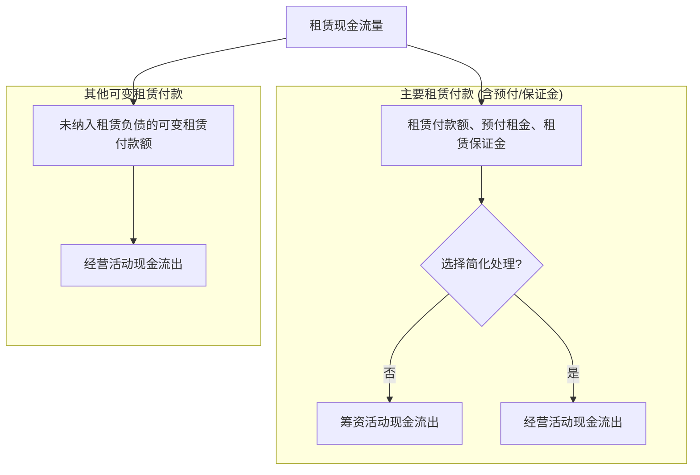

# 1. 租赁概述
## 1.1 租赁的识别

- 租赁，是指在一定期间内，出租人将资产的使用权让与承租人以获取对价的合同。
- 如果合同一方让渡了在一定期间内控制一项或多项已识别资产使用的权利以换取对价，则该合同为租赁或者包含租赁。
- 企业应当在合同开始日评估合同是否为租赁或者包含租赁。**除非合同条款或条件发生变化**，否则，企业**无需在合同开始日后重新评估**合同是否为租赁或者是否包含租赁。

- 一项租赁，应当包含下列三项要素：
	1. 存在一定期间。
	2. 存在已识别资产。
	3. 资产供应方向客户**转移**对已识别资产**使用权的控制**。
> [!example] 例题·多选题
> 下列交易事项中，不适用租赁准则的有（　）。
> 
> A. 出租人授予的知识产权许可
> B. 出租人对不可再生资源出让使用权
> C. 通过出让方式取得的土地使用权
> D. 承租人承租生物资产
>
> > [!check]- 答案与解析
> > 
> > **正确答案：A、B、C、D**
> >
> > **深度解析：**
> > 根据《企业会计准则第 21 号——租赁》的规定，租赁准则的适用范围存在明确的排除项：
> >
> > 1. **选项 A 适用收入准则**：出租人授予的知识产权许可，适用《企业会计准则第 14 号——**收入**》。
> > 2. **选项 B 适用其他专项规定**：勘探或利用矿产、石油、天然气及类似**不可再生资源**的租赁，不适用租赁准则。
> > 3. **选项 C 适用无形资产准则**：通过出让方式取得的土地使用权，属于**无形资产**范畴，适用《企业会计准则第 6 号——无形资产》。
> > 4. **选项 D 适用生物资产准则**：承租人承租**生物资产**（如消耗性、生产性、公益性生物资产），适用《企业会计准则第 5 号——生物资产》。
> >
> > **💡 易错点提示：**
> > 考生需注意“租赁准则”与“无形资产”的边界。虽然租赁准则通常适用于**有形资产**，但对于承租人通过租赁取得的**无形资产**（除上述排除项外），企业可以自行选择是否适用租赁准则。但**出租人**授予的知识产权许可（选项 A）是**强制排除**在租赁准则之外的。

> [!TIP] 黎小明的“非租即彼”判断法
> 租赁准则主要管的是**“有形、非生物、非消耗”**的资产（如房子、机器、车、飞机）。
> 
> 遇到以下情况直接踢出：
> 1.  **看不见的（无形）**：
>     *   **出租人**视角的IP许可 $\rightarrow$ 收入准则。
>     *   **承租人**视角的其他无形资产（如软件授权） $\rightarrow$ **可选**租赁准则，但通常按无形资产处理。
> 2.  **地里挖不回来的**：石油、天然气 $\rightarrow$ 资源类规定。
> 3.  **地里会长大的**：牛、羊、树 $\rightarrow$ 生物资产。
> 4.  **国家批给你的地**：土地使用权（出让） $\rightarrow$ 无形资产（这是中国特色，也是CPA最爱考的坑）。
## 1.2 租赁的分拆

1. 合同中**同时包含多项单独租赁**（A租赁+B租赁）
	- 合同中同时包含多项**单独租赁**的，承租人和出租人应当将合同予以分拆，并分别各项单独租赁进行会计处理。
	- **同时符合**下列条件的，使用已识别资产的权利构成合同中的一项单独租赁：
		（1）承租人可从**单独使用该资产**或将其与易于获得的其他资源一起使用中**获利**；
		（2）该资产与合同中的其他资产**不存在高度依赖或高度关联关系**。

2. 合同中**同时包含租赁和非租赁部分**（租赁+非租赁）
	- 合同中同时包含租赁和非租赁部分的，承租人和出租人应当将租赁和非租赁部分进行分拆，除非企业适用租赁准则的**简化处理**。分拆后，各租赁部分应当分别按照租赁准则进行会计处理，非租赁部分应当按照其他适用的企业会计准则进行会计处理。
	- 为简化处理，承租人可以按照租赁资产的类别**选择是否分拆**合同包含的租赁和非租赁部分。承租人选择不分拆的，应当将各租赁部分及与其相关的非租赁部分分别合并为租赁，按照**租赁准则**进行会计处理。
	- 在分拆合同包含的租赁部分和非租赁部分时，出租人应当根据收入准则关于交易价格分摊的规定分摊合同对价。

> [!note]- 为什么承租人可以简化，出租人不可以？
> **承租人是在“记成本”，允许为了省事儿稍微混淆一下；出租人是在“认收入”，必须泾渭分明，绝对不能混。**
> 
> (1) 承租人（花钱的）：成本效益原则 > 精确性
> *   **逻辑**：对于承租人来说，无论是付租金还是付服务费，最终都是**现金流出**。
> *   **允许简化的原因**：
>     *   **省成本**：要把合同里的“租金”和“物业费/服务费”拆开，需要去市场上找各自的公允价值，计算复杂。准则为了减轻企业负担，允许“偷懒”。
>     *   **符合谨慎性**：如果承租人选择不分拆，把服务费也当成租金，结果是**做大了“租赁负债”**。会计准则通常不介意企业多记负债（这很谨慎），只介意企业少记负债。
> 
(2) 出租人（赚钱的）：收入确认原则（红线）
> *   **逻辑**：出租人的核心任务是**如实反映收入的来源和性质**。
> *   **禁止简化的原因**：
>     *   **适用准则不同**：
>         *   租金收入 $\rightarrow$ **CAS 21 租赁准则**（通常按直线法确认，不仅涉及钱，还涉及资产的去留）。
>         *   服务收入 $\rightarrow$ **CAS 14 收入准则**（履约义务，干多少活拿多少钱）。
>     *   **风险特征不同**：租金是“资产产生的被动收益”，服务费是“劳动产生的经营收益”。如果混在一起，报表使用者（比如银行、投资者）就看不清这家公司到底是靠 **“有资产”** 赚钱，还是靠 **“干苦力”** 赚钱。这会严重误导估值。
> ---
> 我们来看一个**写字楼运营**的例子，您就能明白为什么出租人绝对不能混淆了。
> 
> **场景**：您的客户（一家城投置业公司）拥有一栋写字楼，租给一家科技公司。
> *   **合同**：年租金 1000万，物业管理费 200万。
> 
> 视角 A：科技公司（承租人）—— 怎么方便怎么来
> *   **处理**：它可以把 1200万 全当成租金，确认一个巨大的“使用权资产”和“租赁负债”。
> *   **影响**：虽然资产负债率难看点，但省去了每个月拆分发票和做账的麻烦。对它来说，反正都是“房租成本”。
> 
>  视角 B：城投置业（出租人）—— 必须分拆！
> 如果城投置业把 1200万 全当成“租赁收入”入账，会有什么严重后果？
> 1.  **估值虚高（REITs 发行大忌）**
>     *   在做商业地产估值（如发行公募REITs或CMBS）时，我们通常用 **NOI（营运净收入） / Cap Rate（资本化率）** 来估值。
>     *   资本市场给“租金收入”的估值倍数很高（因为稳定），但给“物业服务收入”的估值倍数很低（因为是辛苦钱，毛利低）。
>     *   如果把物业费混入租金，会导致**虚增物业的资本化价值**，这是尽调中的重大合规漏洞。
> 2.  **税务风险**
>     *   **房产税**：通常是从租计征（租金的12%）。如果把物业费（服务业）混入租金，会导致**多交房产税**。
>     *   **增值税**：不动产租赁（9%）和现代服务业（6%）税率不同。混在一起可能导致税务合规问题。
> > [!TIP] 黎小明的一句话总结
> > **承租人**是“肉烂在锅里”，混在一起顶多是负债难看点，所以**可以懒**；
> > **出租人**是“亲兄弟明算账”，租金是资产回报，服务是劳动回报，性质不同税不同，所以**必须勤**。
> 

> [!example] 例题·多选题
> 甲公司从乙公司租入一辆汽车，租赁期2年，租赁费用共计24万元。同时乙公司还向甲公司派出一名司机，该名司机在租赁期内按照甲公司的安排驾驶该租赁汽车。不考虑折现及其他因素，下列各项关于上述租赁交易会计处理的表述中，错误的有（　　）。
> A. 乙公司按租赁准则每月确认租赁收入1万元
> B. 甲公司按接受服务进行会计处理
> C. 乙公司分拆租赁部分和非租赁部分，分别按租赁准则和收入准则进行会计处理
> D. 乙公司按收入准则每月确认服务收入1万元
>
> > [!check]- 答案与解析
> > 
> > **正确答案：A, B, D**
> >
> > **深度解析：**
> > **第一步：识别合同构成。** 该合同同时包含**租赁**（汽车）和**非租赁**（司机服务）部分。
> >
> > **第二步：分析出租人（乙公司）的会计处理。**
> > - 根据准则，出租人**应当**将租赁部分和非租赁部分进行分拆。
> > - 租赁部分按**租赁准则**处理，非租赁部分（司机服务）按**收入准则**处理。
> > - 因此，选项C（分拆处理）表述**正确**。
> > - 选项A（仅确认租赁收入）和选项D（仅确认服务收入）均因**未进行分拆**而表述**错误**。
> >
> > **第三步：分析承租人（甲公司）的会计处理。**
> > - 承租人为简化处理，**可以**选择是否分拆。
> > - 若选择不分拆，应将租赁及相关非租赁部分合并为一项租赁，按**租赁准则**处理。
> > - 因此，甲公司不能直接按接受服务（即收入准则）处理，选项B表述**错误**。
> >
> > **💡 易错点提示：**
> > 注意区分**出租人**与**承租人**在混合合同处理上的**强制性差异**：出租人**必须**分拆，而承租人**有权选择**是否分拆。
## 1.3 租赁的合并

企业与同一交易方或其关联方在同一时间或相近时间订立的两份或多份包含租赁的合同，在**满足下列条件之一时**，应当合并为一份合同进行会计处理：
1. 该两份或多份合同**基于总体商业目的而订立并构成一揽子交易**，若不作为整体考虑则无法理解其总体商业目的。
2. 该两份或多份合同中的某份合同的对价金额**取决于其他合同的定价或履行情况**。
3. 该两份或多份合同让渡的资产使用权**合起来构成一项单独租赁**。（如存在高度依赖或高度关联关系）
> [!example] 例题·单选题
> 甲汽贸公司与王某签订一项合同协议，协议约定甲汽贸公司将一辆客车交付王某进行租用，租赁期为2年，甲汽贸公司负责整个租赁期内的客车维护。合同对价中包含了客车的维护费用。客车的维护服务存在可观察的单独价格，且市场上多家公司可提供该维护服务。下列有关该合同协议的说法中，不正确的是（　）。
> 
> A. 甲汽贸公司应将该合同按照租赁部分与非租赁部分进行分拆进行会计处理
> B. 合同中租车约定适用租赁准则进行会计处理
> C. 合同中的维护服务在实际发生时适用收入准则进行会计处理
> D. 合同中租车与维护服务具有高度关联，应作为一揽子合同进行处理
>
> > [!check]- 答案与解析
> > 
> > **正确答案：D**
> >
> > **深度解析：**
> > **1. 核心原则：** 根据租赁准则规定，合同中同时包含租赁部分和非租赁部分的，出租人和承租人通常应当将租赁部分和非租赁部分进行**分拆**。
> > 
> > **2. 分拆条件判定：**
> > - **租赁部分：** 客车租赁属于租赁部分，适用**《企业会计准则第 21 号——租赁》**。
> > - **非租赁部分：** 维护服务属于非租赁部分，适用**《企业会计准则第 14 号——收入》**。
> > - **逻辑链：** 由于维护服务存在**可观察的单独价格**，且市场上多家公司可提供该服务，说明该维护服务与客车租赁**不具有高度关联性**，能够单独区分。
> > 
> > **3. 选项分析：**
> > - 选项 A、B、C 均符合准则关于“分拆处理”的规定，表述正确。
> > - 选项 D 认为应作为“一揽子合同”（即不分拆）处理，违反了准则关于合同分拆的判定逻辑，故表述错误。
> >
> > **💡 易错点提示：**
> > 1. **承租人的简化处理：** 承租人可以选择不分拆，将各租赁部分及与之相关的非租赁部分合并为租赁部分进行会计处理；但**出租人必须进行分拆**。
> > 2. **高度关联的判定：** 如果某项服务是使资产能够运行所不可或缺的，且没有其他供应商能提供，才可能考虑不分拆。本题明确了“多家公司可提供”，是典型的**可分拆**信号。
## 1.4 租赁期

1. 租赁期
租赁期，是指承租人有权使用租赁资产**且不可撤销**的期间
-  续租选择权：如果承租人续租选择权，且**合理确定将行使**该选择权的，租赁期还应当包含**续租选择权涵盖的期间。**
-  终止租赁选择权：如果承租人有终止租赁选择权，但**合理确定将不会行使**该选择权的，租赁期应当包含**终止租赁选择权涵盖的期间**。

2. 租赁期开始日
- 租赁期自租赁期开始日起计算。
- 租赁期开始日，是指出租人提供租赁资产使其可供承租人使用的起始日期。如果承租人在租赁协议约定的起租日或租金起付日之前，已获得对租赁资产使用权的控制，则表明租赁期已经开始。 #实质重于形式

3. 不可撤销期间
- 在确定一项租赁的租赁期和评估其不可撤销期间时，企业应根据租赁条款的约定确定可强制执行合同的期间。
- 当承租人和出租人双方均有权在未经另一方许可的情况下终止租赁，且所受惩罚不重大时，该租赁不再可强制执行。
- 如果只有承租人有权终止租赁，则在确定租赁期时，企业应将该项权利视为承租人可行使的终止租赁选择权**予以考虑（取决于承租人是否合理确定将不会行使）**
- 如果只有出租人有权终止租赁，则该租赁的不可撤销期间**包括**终止租赁选择权所涵盖的期间
> 从**谨慎性原则**（不低估负债）出发，会计准则假设出租人**不会**行使终止权，因此这段时间被视为“不可撤销”，必须计入租赁期，确认负债。

> [!TIP] 黎小明的“命运掌握论”
> 针对“谁有终止权”对租赁期的影响，核心逻辑是**控制权**：
> *   **权利在我（承租人）** $\rightarrow$ 我看**心情和利益**（评估合理确定性）。
> *   **权利在他（出租人）** $\rightarrow$ 我只能**认命**（视为不可撤销，全额计入租赁期）。
> 
> **一句话总结**：只要承租人自己锁不住门（没权终止），这扇门对承租人来说就是**关死**的（必须确认为租赁期）。

4. 续租选择权、终止租赁选择权和购买选择权
- 在租赁期开始日，企业应当**评估承租人**是否合理确定将行使**续租**或**购买**租赁资产的选择权，或者将不行使**终止**租赁选择权。
- 在租赁期开始日，企业应当基于既有相关事实和情况判断可强制执行合同的期间以及是否存在实质续租、终止等选择权以合理确定租赁期，**其他相关会计估计应与此一致**。例如，**与该租赁相关的租赁资产改良支出、初始直接费用等的摊销期限应当与租赁期保持一致**。

5. 对租赁期和购买选择权的重新评估——修改租赁期
- 发生承租人**可控范围内的**重大事件或变化，**且影响**承租人是否合理确定将行使相应选择权的，承租人应当对其是否合理确定将行使续租选择权、购买选择权或不行使终止租赁选择权进行重新评估，**并根据重新评估结果修改租赁期**。
- **如果不可撤销的租赁期间发生变化**，企业应当修改租赁期。
# 2. 承租人会计处理

> [!note]- 为什么出租人分为融资租赁和经营租赁处理？承租人不分？
> 承租人看的是"**我有没有控制权**"（有就认资产），出租人看的是"**谁承担风险**"（转移了就是融资，没转移就是经营）。
> ## 一、核心结论：**风险报酬转移的"不对称性"**
> 
> ### 承租人视角（2018年后统一确认使用权资产）
> - **无论何种租赁，承租人都实际获得了"资产使用权"这一经济资源**  
>   → 根据**资产定义**（"预期会给企业带来经济利益的资源"），必须在资产负债表中确认  
> - 旧准则下经营租赁的"表外融资"漏洞导致：
>   - **航空公司**租飞机、**零售企业**租门店等重资产全部隐藏在表外  
>   - 投资者无法准确评估企业的**真实负债水平**和**资本结构**  
>   → 2018年修订后，承租人**统一确认使用权资产和租赁负债**（除短期和低价值资产）
> ### 出租人视角（仍需区分融资/经营租赁）
> 出租人的会计处理取决于 **"谁承担租赁资产的主要风险和报酬"**：
> 
> | **租赁类型** | **风险报酬归属** | **出租人的经济实质** | **会计处理** |
> |---|---|---|---|
> | **融资租赁** | 几乎全部转移给承租人 | 出租人相当于**提供融资服务**（类似贷款） | 终止确认租赁资产，确认**应收融资租赁款**（金融资产） |
> | **经营租赁** | 仍保留在出租人 | 出租人相当于**提供资产使用服务** | 继续确认租赁资产，按直线法确认**租赁收入** |
> 
> ## 二、为什么承租人不分？——**实质重于形式**原则的体现
> 
> ### 旧准则的"表外融资"漏洞（2018年前）
> 以某航空公司为例：
> - 租赁100架飞机（租期20年，飞机寿命25年）  
> - 旧准则判定为"经营租赁"（未满足75%租期标准）  
>   → **资产负债表上没有任何飞机和负债记录**  
>   → 但实际上企业已实质性控制这些飞机的使用权
> 
> **问题**：  
> - 投资者看不到企业的真实资产规模和债务风险  
> - 不同企业通过"租赁"vs"购买"的选择，导致财务报表不可比
> ### 新准则的解决方案（2018年后）
> **核心逻辑**：  
> > 只要承租人获得了"在租赁期内控制租赁资产使用"的权利，就应确认**使用权资产**和**租赁负债**
> 
> **为什么不再区分？**  
> 1. **从承租人角度看，租赁本质都是"获取资产使用权"**  
>    - 无论融资租赁还是经营租赁，承租人都需要：  
>      ① 排他性使用资产  
>      ② 承担使用期间的成本（租金）  
>      ③ 获取经济利益（收入）  
>    → **经济实质相同**，会计处理应一致
> 
> 2. **旧准则的"分类标准"人为可操控**  
>    - 企业可以刻意设计合同条款（如租期74.9%）来规避资产负债表确认  
>    → 新准则直接**消除分类**，堵住漏洞
> ## 三、为什么出租人还要分？——**经济实质确实不同**
> 
> ### 融资租赁：出租人是"金融中介"
> **典型案例**：城投公司融资租赁设备
> - 城投向租赁公司购买挖掘机，租期10年（设备寿命12年）  
> - 租赁公司的角色：  
>   ① **不承担设备贬值风险**（租期结束后设备残值归城投）  
>   ② **不承担使用风险**（设备维修、保险由城投负责）  
>   ③ **实质是提供融资**（相当于借钱给城投买设备，分期收本息）  
> 
> **会计处理**：  
> - 出租人应终止确认设备（因为风险报酬已转移）  
> - 确认**应收融资租赁款**（类似贷款本金+利息）
> ### 经营租赁：出租人是"资产运营商"
> **典型案例**：房地产公司出租写字楼
> - 地产公司将自有写字楼出租给企业（租期3年）  
> - 地产公司的角色：  
>   ① **承担房产贬值风险**（租期结束后房产仍归地产公司）  
>   ② **承担维护责任**（物业、大修由地产公司负责）  
>   ③ **实质是提供服务**（类似酒店提供住宿服务）  
> 
> **会计处理**：  
> - 出租人继续确认房产为**投资性房地产**  
> - 按直线法确认**租赁收入**
> 
> ## 五、准则修订的"不对称"背后的监管逻辑
> 
> ### 为什么只改承租人，不改出租人？
> 1. **承租人端的"表外融资"问题更严重**  
>    - 全球上市公司隐藏的经营租赁负债超过**3万亿美元**  
>    - 出租人端较少出现"隐藏资产"的动机
> 
> 2. **出租人的经济实质确实存在本质差异**  
>    - 融资租赁公司（如金融租赁公司）vs 资产运营公司（如地产公司）  
>    - 强行统一会导致**会计信息失真**
> 
> 3. **成本效益考量**  
>    - 改革承租人端已大幅提升报表透明度  
>    - 出租人端再改革的边际收益较小
> 
> 这个问题本质上是**会计准则国际趋同**的产物：
> - **IFRS 16（国际）** 和 **ASC 842（美国）** 都采用了"承租人统一确认、出租人继续区分"的模式  
> - 我国2018年修订的CAS 21就是对标这两个准则
## 2.1 初始计量
![[A1-会计笔记/附件/14-租赁-1769578191817.webp|526x263]]
### 2.1.1 租赁负债的初始计量

- 租赁负债应当按照**租赁期开始日尚未支付的租赁付款额**的**现值**进行初始计量。
> 租赁付款额=租赁期**开始日或之前支付的**租赁付款额+租赁期开始日**尚未支付的**租赁付款额
> 承租人向出租人支付的款项中包含**增值税**的，该增值税不属于租赁付款额的范畴，不应纳入租赁负债和使用权资产的计量。
> 出租人为确保承租人履行合同相关义务收取**租赁保证金**的，该租赁保证金不属于承租人的租赁付款额，承租人应将其作为单独的资产进行会计处理。

1. 租赁付款额，是指承租人向出租人支付的与在租赁期内使用租赁资产的权利相关的款项。租赁付款额包括以下五项内容：
	（1）固定付款额及实质固定付款额，**存在租赁激励的，扣除租赁激励相关金额**。
	（2）**==取决于指数或比率的==** 可变租赁付款额。
		- 可变租赁付款额，是指承租人为取得在租赁期内使用租赁资产的权利，而向出租人支付的因租赁期开始**日后**的事实或情况发生变化（而非时间推移）而变动的款项。
		- 可变租赁付款额可能与下列各项指标或情况挂钩：
			①**市场比率或指数**。例如，随**基准利率**或**消费者价格指数**变动调整租赁付款额。
			②承租人源自**租赁资产的绩效**。例如，零售业不动产租赁可能会要求基于使用该不动产取得的**销售收入**的一定比例确定租赁付款额；某设备租赁可能基于该设备**运营收入**的一定比例确定租赁付款额。
			③租赁资产的**使用**。例如，车辆租赁可能要求承租人在超过特定里程数时支付额外的租赁付款额
	（3）购买选择权的行权价格，前提是承租人**合理确定**将行使该选择权。
	（4）行使终止租赁选择权需支付的款项，前提是租赁期反映出承租人将行使终止租赁选择权。
	（5）根据承租人提供的担保余值**预计应支付的款项**。(注意：不是承租人担保余值下的最大敞口)
	担保余值，是指与出租人无关的一方向出租人提供担保，保证在租赁结束时租赁资产的价值**至少为某指定的金额**。

> [!example]
> 2×25年1月1日，承租人甲公司与出租人乙公司签订了一份汽车租赁合同，租赁期为5年。合同中就担保余值的规定为：如果标的汽车在租赁期结束时的公允价值低于50000元，则甲公司需向乙公司支付50 000元与汽车公允价值之间的差额，因此，甲公司在该担保余值下的最大敞口为50 000元。**租赁开始日**，甲公司**预计**标的汽车在租赁期结束时的公允价值为10 000元。不考虑其他因素。
> 
> 在租赁期开始日，甲公司预计标的汽车在租赁期结束时的公允价值为10 000元，即，甲公司预计在担保余值下将支付的金额为40 000元。因此，甲公司在计算租赁付款额时，与担保余值相关的付款额为40000元（50 000-10 000）。

2. 折现率
在计算租赁付款额的现值时，承租人应当采用**租赁内含利率**作为折现率；无法确定租赁内含利率的，应当采用**承租人增量借款利率**作为折现率。

（1）租赁内含利率 **（内含报酬率）**
租赁内含利率，是指使出租人的**租赁收款额的现值**与**未担保余值的现值**之和等于**租赁资产公允价值**与**出租人的初始直接费用**之和的利率。（就是使得未来能收到的价值折现到今天刚好等于今天资产的价值）
> 初始直接费用，是指为达成租赁所发生的增量成本。增量成本是指若企业不取得该租赁，则不会发生的成本，如佣金、印花税等。无论是否实际取得租赁都会发生的支出，不属于初始直接费用，如为评估是否签订租赁合同而发生的差旅费、法律费用等，此类费用应当在发生时计入**当期损益**。

（2）承租人增量借款利率
指承租人在类似经济环境下为获得与使用权资产价值接近的资产，在类似期间以类似抵押条件借入资金须支付的利率。

> [!example] 例题·多选题
> 下列各项中，属于承租人初始直接费用的有（　）。
> 
> A. 租赁合同的印花税
> B. 租赁谈判人员的差旅费
> C. 租赁谈判人员的佣金费
> D. 评估是否签订租赁合同发生的法律费用
>
> > [!check]- 答案与解析
> > 
> > **正确答案：AC**
> >
> > **深度解析：**
> > 1. **核心概念**：**初始直接费用**是指为达成租赁所发生的**增量成本**。所谓“增量成本”，是指如果不取得该租赁，则不会发生的成本。
> > 2. **选项分析**：
> >    - **选项A、C**：印花税和佣金是只有在租赁合同**最终达成**时才会发生的支出，符合增量成本定义，应计入**使用权资产**的初始计量金额。
> >    - **选项B、D**：差旅费、法律费用、评估费用等，无论租赁合同最终是否签订，通常都会发生，属于**租赁准则明确排除**的费用，应在发生时计入当期损益（通常为管理费用）。
> > 3. **会计处理公式**：
> >    $使用权资产初始成本 = 租赁负债的初始计量金额 + 在租赁期开始日或之前支付的租赁付款额（扣除租赁激励） + 承租人发生的初始直接费用 + 预计将发生的拆卸复原成本$
> >
> > **💡 易错点提示：**
> > 必须严格区分“**增量成本**”与“**过程成本**”。差旅费、法律费、评估费属于无论合同是否签成都会发生的支出，不属于初始直接费用。
### 2.1.2 使用权资产的初始计量

使用权资产，是指承租人可在租赁期内使用租赁资产的权利。在租赁期开始日，承租人应当按照**成本**对使用权资产进行初始计量。该成本包括以下四项：

1. 租赁负债的初始计量金额（**租赁负债**）
2. 在**租赁期开始日或之前**支付的租赁付款额；存在租赁激励的，应扣除已享受的租赁激励相关金额。（**银行存款或预付账款**）
3. 承租人发生的初始直接费用（**银行存款**）
4. 承租人为拆卸及移除租赁资产、复原租赁资产所在场地或将租赁资产恢复至租赁条款约定状态**预计将发生的成本**。
	（1）承租人应在其有义务承担上述成本时，将这些成本确认为使用权资产成本的一部分。但是，如果承租人由于在特定期间内将使用权资产**用于生产存货**而发生的上述成本，应按**存货准则**的相关规定进行会计处理。
	（2)承租人应当按照或有事项准则对上述成本的支付义务进行确认和计量（即按**支付义务的现值**确认，计入**预计负债**）

【提示1】 承租人如发生与租赁资产建造或设计相关的成本，应适用**固定资产**等准则进行会计处理。某些情况下，承租人可能在租赁期开始前就发生了与租赁资产相关的经济业务或事项。例如，租赁合同双方经协商约定，租赁资产需经建造或重新设计后方可供承租人使用；根据合同条款与条件，承租人需支付与资产建造或设计相关的成本。
【提示2】承租人发生的租赁资产改良支出不属于使用权资产，应当记入“**长期待摊费用**”科目。

> [!example] 例题·计算分析题
> 承租人甲公司就某写字楼的某一层楼与出租人乙公司签订了为期10年的租赁协议，并拥有5年的续租选择权。有关资料如下：
> 
> （1）初始租赁期内的不含税租金为每年50 000元，续租期间为每年55 000元，所有款项应于每年**年初**支付；
> （2）为获得该项租赁，甲公司发生的可归属于该租赁项目的初始直接费用为20 000元；
> （3）在租赁期开始日，甲公司评估后认为，不能合理确定将行使续租选择权，因此，将租赁期确定为10年；
> （4）甲公司无法确定租赁内含利率，其增量借款利率为每年5%，该利率反映的是甲公司以类似抵押条件借入期限为10年、与使用权资产等值的相同币种的借款而必须支付的利率；
> （5）已知：$(P/A, 5\%, 9) = 7.1078$
> 
> 假设不考虑相关税费影响。
> 要求：计算租赁负债和使用权资产的初始入账金额，并编制相关会计分录。
>
> > [!check]- 答案与解析
> > 
> > **承租人甲公司的会计处理如下：**
> >
> > **第一步：计算租赁期开始日租赁付款额的现值，并确认租赁负债和使用权资产**
> >
> > **（1）租赁负债的计算**
> >
> > ① **租赁付款额总额** = $50\,000 \times 10 = 500\,000$ （元）
> >
> > ② **租赁期开始日尚未支付的租赁付款额** = $50\,000 \times 9 = 450\,000$ （元）
> >   - 说明：因租金于**每年年初**支付，首期50 000元在租赁期开始日已支付，剩余9期未付
> >
> > ③ **租赁负债（现值）** = $50\,000 \times (P/A, 5\%, 9) = 50\,000 \times 7.1078 = 355\,390$ （元）
> >
> > ④ **未确认融资费用** = ② - ③ = $450\,000 - 355\,390 = 94\,610$ （元）
> >
> > **（2）使用权资产初始成本的计算**
> >
> > **使用权资产的初始成本** = 租赁负债 + 已付款项 + 初始直接费用
> > $= 355\,390 + 50\,000 + 20\,000 = 425\,390$ （元）
> >
> > **第二步：租赁期开始日的账务处理**
> >
> > ```
> > 借：使用权资产                     425 390
> >     租赁负债——未确认融资费用          94 610
> >   贷：租赁负债——租赁付款额           450 000
> >       银行存款                        70 000
> > ```
> >
 
## 2.2 后续计量
### 2.2.1 租赁负债的后续计量

1. **计量基础**
在租赁期开始日后，承租人应当按以下原则对租赁负债进行后续计量：
（1）确认租赁负债的利息费用
```
借：财务费用/在建工程等（**期初租赁负债余额×折现率**）
　贷：租赁负债——未确认融资费用
```
（2）支付租赁付款额
```
借：租赁负债——租赁付款额
　贷：银行存款
```
（3）未纳入租赁负债计量的可变租赁付款额
**未纳入租赁负债计量的**可变租赁付款额（即**并非取决于指数或比率的**可变租赁付款额），应当在**实际发生时**计入**当期损益**（如营业成本或销售费用等），但按照存货等准则规定应当计入相关资产成本的 （如制造费用等），从其规定。
> 支付的未纳入租赁负债的可变租赁付款额，在现金流量表中，应计入**经营活动**现金流出。

2. **租赁付款额发生变动（需要重新计量租赁负债）**

在租赁期开始日后，当发生下列四种情形时，承租人应当按照**变动后的租赁付款额的现值**重新计量租赁负债，并**相应调整使用权资产的账面价值**。使用权资产的账面价值已调减至零，但租赁负债仍需进一步调减的，承租人应当将剩余金额计入**当期损益**。

（1）实质固定付款额发生变动
如果租赁付款额**最初是可变的**，但在租赁期开始日后的某一时点转为固定，那么，在潜在可变性消除时，该付款额成为实质固定付款额，应纳入租赁负债的计量中。承租人应当按照变动后租赁付款额的现值重新计量租赁负债。在该情形下，承租人采用的**折现率不变**，即，采用租赁期开始日确定的折现率。

（2）担保余值预计应付的金额发生变动
在租赁期开始日后，承租人应对其在担保余值下预计支付的金额进行估计。该金额发生变动的，承租人应当按照**变动后租赁付款额的现值**重新计量租赁负债。在该情形下，承租人采用的**折现率不变**。

（3）用于确定租赁付款额的指数或比率发生变动

| **变动类型**                                                | **租赁负债的计算**                                                                                                                                           | **折现率**                                                       |
| ----------------------------------------------------------- | ------------------------------------------------------------------------------------------------------------------------------------------------------------ | ---------------------------------------------------------------- |
| ①用于确定租赁付款额的**浮动利率发生变动**                   | 在租赁期开始日后，因浮动利率的变动而导致未来租赁付款额发生变动的，承租人应当按照变动后租赁付款额的现值重新计量租赁负债                                       | 在该情形下，承租人应采用反映利率变动的**修订后的折现率**进行折现 |
| ②用于确定租赁付款额的**指数或比率（浮动利率除外）发生变动** | 在租赁期开始日后，因用于确定租赁付款额的指数或比率（浮动利率除外）的变动而导致未来租赁付款额发生变动的，承租人应当按照变动后租赁付款额的现值重新计量租赁负债 | 在该情形下，承租人采用的**折现率不变**                           |
（4）购买选择权、续租选择权或终止租赁选择权的评估结果或实际行使情况发生变化。
- 承租人应采用**修订后的折现率**对变动后的租赁付款额进行折现，以重新计量租赁负债;
- 承租人在计算变动后租赁付款额的现值时，应当采用**剩余租赁期间**的租赁内含利率作为折现率；无法确定剩余租赁期间的租赁内含利率的，应当采用**重估日的**承租人增量借款利率作为折现率。

> [!note]- 折现率只在"市场利率环境变化"或"租赁期间/合同结构变化"时调整，单纯的金额/估计变动不触发调整
> ## 一、核心判断标准：**"风险变了吗？"**
> 
> 折现率的本质是**反映货币时间价值和风险的贴现因子**。决定是否调整折现率的核心逻辑是：
> 
> > **这次变动，是因为"市场利率环境/融资成本"变了（风险变了），还是仅仅"付款金额/时点"变了（风险没变）？**
> 
> - **风险变了** → 调整折现率
> - **风险没变，只是金额/时点变了** → 折现率不变
> 
> ---
> 
> ## 二、逐项拆解
> 
> ### 情形（1）：实质固定付款额变动 → **折现率不变**
> 
> **逻辑**：  
> - "实质固定付款额"通常是合同条款调整（如业绩考核未达标，减免部分租金），**但市场利率环境没变**。
> - 只是"付多少钱"变了，但"借钱成本/风险"没变。
> **实务例子**：  
> 公司租赁办公楼，原合同约定年租金100万元，后因政府财政紧张协商减免20%。此时：
> - 租赁付款额从100万→80万（金额变了）
> - 但融资成本（如增量借款利率5%）没变 → **折现率不变**
> 
> ---
> 
> ### 情形（2）：浮动利率发生变动 → **修订折现率**
> 
> **逻辑**：  
> - 浮动利率（如LPR）变动，**直接反映市场利率环境变化**，风险和货币时间价值都变了。
> - 必须用新利率重新折现，否则账面价值失真。
> 
> **实务例子**：  
> 地产公司租赁仓库,租金挂钩LPR+50BP。2023年LPR从3.7%→3.45%:
> - 租赁付款额减少（因为利率降了）
> - **市场融资成本也降了** → 必须用新的LPR+50BP重新折现
> 
> **为什么要调？**  
> 因为"LPR变了"本身就意味着"钱的时间价值变了"，折现率必须同步更新。
> 
> ---
> 
> ### 情形（3）：指数/比率变动（浮动利率除外）→ **折现率不变**
> 
> **逻辑**：  
> - 指数/比率变动（如CPI上涨）只影响"付多少钱"，但**不反映融资成本变化**。
> - 承租人的增量借款利率没变，折现率自然不变。
> 
> **实务例子**：  
> 租赁产业园厂房，租金每年按CPI调整。2024年CPI涨3%，租金从100万→103万：
> - 租赁付款额增加（因为通胀）
> - 但融资成本（如银行贷款利率5%）没变 → **折现率不变**
> 
> **为什么不调？**  
> CPI涨只能说明"物价贵了"，但不代表"借钱更贵了"。折现率反映的是**承租人融资成本**，跟CPI无关。
> 
> ---
> 
> ### 情形（4）：选择权重新评估 → **修订折现率**
> 
> **逻辑**：  
> - 行使续租/终止/购买选择权，意味着**租赁期间/合同结构变了**，相当于"重新签合同"。
> - 需要用**剩余租赁期间的最新利率**重新折现（因为时间维度变了，风险也变了）。
> 
> **实务例子**：  
> 地产公司租设备，原租期3年。第2年末决定续租2年：
> - 剩余租赁期从1年→3年（时间维度变了）
> - 此时市场利率可能已变化，需要用**重估日的增量借款利率**重新折现
> 
> **为什么要调？**  
> 续租相当于"延长了债务期限"，风险暴露时间变长，必须用最新利率重估。
> 
> ---
> 
> ### 情形（5）：担保余值预计应付金额变动 → **折现率不变**
> 
> **逻辑**：  
> - 担保余值是"租赁期末预计要赔的钱"（如设备残值不足），只是**金额估计变了**。
> - 市场利率环境没变，折现率不变。
> 
> **实务例子**：  
> 租赁挖掘机，担保余值100万。2年后评估发现设备磨损严重，预计余值只剩60万（要多赔40万）：
> - 预计应付金额增加40万（金额变了）
> - 但融资成本没变 → **折现率不变**
> 
> ---
> 
> ## 三、记忆口诀
> 
> | 情形               | 调不调折现率？ | 判断关键词              |
> | ---------------- | ------- | ------------------ |
> | **实质固定付款额变动**  | ❌不调     | 只是"金额"变了          |
> | **浮动利率变动**     | ✅调      | "利率"本身就是折现率的一部分   |
> | **指数/比率变动**    | ❌不调     | 只影响金额，不影响融资成本      |
> | **选择权重新评估**    | ✅调      | "时间维度"变了，相当于重签合同  |
> | **担保余值预计应付变动** | ❌不调     | 只是"估计"变了，不影响市场利率环境 |
### 2.2.2 使用权资产的后续计量

1. **计量基础**
- 在租赁期开始日后，承租人应当采用**成本模式**对使用权资产进行后续计量，即，以成本减累计折旧及累计减值准备计量使用权资产。
- 承租人按照租赁准则有关规定重新计量租赁负债的，应当相应调整使用权资产的账面价值。

2. **使用权资产的折旧**
（1）计提折旧的起始日期
- 承租人应当参照固定资产准则有关折旧规定，自**租赁期开始日**起对使用权资产计提折旧。
- 使用权资产**通常**应**自租赁期开始的当月**计提折旧。计提的折旧金额应根据使用权资产的用途，计入**相关资产的成本或者当期损益**。
（2）折旧方法
- 承租人在确定使用权资产的折旧方法时，应当根据与使用权资产有关的经济利益的预期**消耗**方式作出决定。通常，承租人按**直线法**对使用权资产计提折旧，如果其他折旧方法更能反映使用权资产有关经济利益预期消耗方式的，应采用其他折旧方法。
（3）折旧年限
- 承租人在确定使用权资产的折旧年限时，应遵循下列原则：
	①承租人**能够合理确定**租赁期届满时取得租赁资产所有权的，应当**在租赁资产剩余使用寿命内**计提折旧；
	②承租人**无法合理确定**租赁期届满时能够取得租赁资产所有权的，应当在租赁期与租赁资产剩余使用寿命两者**孰短**的期间内计提折旧。

3. **使用权资产的减值**
- 在租赁期开始日后，承租人应当按照资产减值准则的规定，确定使用权资产是否发生减值，并对已识别的减值损失进行会计处理。
- 使用权资产发生减值的，按应减记的金额，借记“资产减值损失”科目，贷记“使用权资产减值准备”科目。**使用权资产减值准备一旦计提，不得转回**。
- 承租人应当按照扣除减值损失之后的使用权资产的账面价值，计提后续折旧。

> [!note]- 归纳：使用权资产的会计处理
> （1）初始确认
> ```
> 借：使用权资产
> 　　租赁负债——未确认融资费用
> 　贷：租赁负债——租赁付款额
> 　　　  预付账款
> 　　　  银行存款
> 　　  　预计负债
> ```
> 
> （2）租赁负债重新计量，使用权资产增加
> ```
> 借：使用权资产（增加额）　　　　　　　　　
> 　　租赁负债——未确认融资费用（差额）　　　　　
> 　贷：租赁负债——租赁付款额（增加的租赁付款额）
> ```
> 
> （3）重新计量的租赁负债减少时（除下述（4）情形外）
> ```
> 借：租赁负债——租赁付款额（减少的租赁付款额）　　
> 　贷：使用权资产（减少额）
> 　　　租赁负债——未确认融资费用（差额）
> ```
> 
> （4）租赁变更导致**租赁范围缩小**或**租赁期缩短**的，承租人应当按缩小或缩短的相应比例
> ```
> （视同部分使用权资产终止确认）
> 借：租赁负债——租赁付款额
> 　　使用权资产累计折旧
> 　　使用权资产减值准备　　　　
> 　贷：租赁负债——未确认融资费用
> 　　　使用权资产　　　　　　　　　　　
> 　　　**资产处置损益**（差额，或借方）
> ```
> 
> （5）企业**转租**使用权资产形成**融资租赁**，应：
> ```
> 借：应收融资租赁款
> 	 使用权资产累计折旧
> 	 使用权资产减值准备
> 贷：使用权资产
> 	资产处置损益（差额）
> ```
> 
> （6）计提折旧
> ①承租人通常应当**自租赁期开始日起按月计提**使用权资产的折旧，借记“主营业务成本”“制造费用”“销售费用”“管理费用”“研发支出”等科目，贷记“使用权资产累计折旧”科目。当月计提确有困难的，也可从下月起计提折旧，并在附注中予以披露。②因**租赁范围缩小、租赁期缩短**或**转租**等原因减记或终止确认使用权资产时，承租人应同时结转相应的使用权资产累计折旧。
> ```
> 借：主营业务成本等
> 　贷：使用权资产累计折旧
> ```
> 
> （7）减值
> ```
> 借：资产减值损失
> 	贷：使用权资产减值准备
> ```
> 

> [!example] 例题·单选题
> 甲公司从乙公司租入一栋办公楼，租赁期自 2×19 年 1 月 1 日至 2×21 年 12 月 31 日，每年租金为 **60 万元**，于每年年末支付，租赁内含利率为 **10%**，除租金外，合同还约定，如果租赁期内甲公司某年销售额达到 **3 000 万元**或以上，乙公司当年将获得额外 **30 万元**经营分享收入，2×19 年度甲公司实现的销售额为 **1 000 万元**，假定不考虑其他因素，甲公司 2×19 年因该租赁业务影响当期损益的金额为（ ）。$[ (P/A, 10\%, 3) = 2.4869; (P/F, 10\%, 3) = 0.7513 ]$
> 
> A. 0  
> B. 64.66 万元  
> C. 49.74 万元  
> D. 60 万元
>
> > [!check]- 答案与解析
> > 
> > **正确答案：B**
> >
> > **深度解析：**
> > 影响当期损益的金额由**财务费用（利息支出）**和**使用权资产折旧**两部分组成：
> >
> > **第一步：计算租赁负债的初始入账价值**
> > 租赁负债初始确认金额 = 每年租金 $\times$ 年金现值系数
> > 即：$60 \times 2.4869 = 149.214$（万元）
> >
> > **第二步：计算 2×19 年应确认的利息费用（财务费用）**
> > 财务费用 = 租赁负债期初账面价值 $\times$ 折现率
> > 即：$149.214 \times 10\% = 14.9214$（万元）
> >
> > **第三步：计算 2×19 年应计提的使用权资产折旧**
> > 使用权资产入账价值等于租赁负债初始金额 $149.214$ 万元。
> > 折旧费用 = $149.214 / 3 = 49.738$（万元）
> >
> > **第四步：计算对当期损益的总影响**
> > 2×19 年影响损益金额 = 财务费用 + 折旧费用
> > 即：$14.9214 + 49.738 = 64.6594 \approx 64.66$（万元）
> >
> > **💡 易错点提示：**
> > 1. **或有租金的处理**：本题中“销售额达 3 000 万额外支付 30 万”属于**可变租赁付款额**，且取决于未来的销售表现（非指数或比率），应在实际发生时计入当期损益。因 2×19 年销售额仅为 1 000 万，未达标，故不产生影响。
> > 2. **损益构成**：承租人会计处理中，对损益的影响通常是“利息+折旧”的组合，而非支付的现金租金 60 万元。
### 2.2.3 租赁变更的会计处理
租赁变更，是指原合同条款之外的租赁范围、租赁对价、租赁期限的变更，包括增加或终止一项或多项租赁资产的使用权，延长或缩短合同规定的租赁期等。
> [!note] 租赁变更和租赁付款额发生变动有什么区别
> 
> | 特征       | 租赁变更           | 租赁付款额变动            |
> | -------- | -------------- | ------------------ |
> | **合同条款** | 改变租赁范围、期限或对价   | 合同条款不变,按约定触发       |
> | **适用范围** | 仅租赁负债初始计量包含的项目 | 可变租赁付款额(或有租金)      |
> | **会计时点** | 变更生效日重新计量      | 实际发生时确认            |
> | **确认科目** | 调整使用权资产和租赁负债   | 直接计入损益(销售费用/财务费用等) |
> 

1. 租赁变更作为一项单独租赁处理
租赁发生变更且**同时符合下列条件**的，承租人应当将该租赁变更作为一项单独租赁进行会计处理：
（1）该租赁变更通过增加一项或多项租赁资产的使用权而**扩大了租赁范围**；
（2）**增加的对价**与**租赁范围扩大部分的单独价格**按该合同情况**调整后的金额相当**。
> 加量加价，量价匹配。
- 原租赁的会计处理不会因为该租赁变更而进行任何调整，即**不必重新计量原租赁的租赁负债**，也**不必调整原使用权资产的账面价值**。
- 租赁变更如果是**延长了租赁期限**，即使增加的对价与租赁期限延长部分的单独价格按该合同情况调整后的金额相当，也不能作为一项单独租赁处理。

2. 租赁变更**未作为一项单独租赁**处理
（1）重新计量租赁负债	
租赁变更未作为一项单独租赁进行会计处理的，承租人在租赁变更生效日：P=∑[NCF/〖（1+R）〗^n]
①现金流量NCF调整——按照租赁分拆的规定对变更后合同的对价进行分摊；（变更后涉及到合同对价的重新分配）
②时间n调整——按照租赁期的规定确定变更后的租赁期；
③利率R调整——采用变更后的折现率对变更后的租赁付款额进行折现，以重新计量租赁负债。
> 在计算变更后租赁付款额的现值时，承租人应当采用剩余租赁期间的租赁内含利率作为折现率；无法确定剩余租赁期间的租赁内含利率的，应当采用租赁变更生效日的承租人增量借款利率作为折现率。

（2）调整使用权资产账面价值	
①租赁变更导致租赁范围缩小或租赁期缩短——确认损益
租赁变更导致租赁范围缩小或租赁期缩短的，承租人应当调减使用权资产的账面价值，以反映租赁的部分终止或完全终止。承租人应将部分终止或完全终止租赁的相关利得或损失计入当期损益（资产处置损益）。
```
（缩减部分的简要会计分录）
借：租赁负债（缩减部分的账面金额）
　贷：使用权资产（缩减部分的账面价值）
	资产处置损益（差额，或借方）
```

②其他租赁变更——不确认损益
其他租赁变更，承租人应当相应调整使用权资产的账面价值。（例如：减免租金、延长租赁期限等）
```
（简要会计分录）
借：租赁负债（调整金额）
　贷：使用权资产（调整金额）
```

> **什么时候确认损益，本质上取决于"是否有资产处置"**

> [!example] 例题·计算分析题
> 2×21年1月1日，承租人甲公司与出租人乙公司就5000平方米的办公场所签订了10年期的租赁合同。租赁期开始日为2×21年1月1日，年租赁付款额为1000万元，于每年年末支付。甲公司无法确定租赁内含利率，在租赁期开始日，甲公司的增量借款利率为6%。
>
> 2×25年1月1日，甲公司和乙公司同意对原租赁合同进行如下变更：（1）自2×25年1月1日起，将原租赁场所缩减至3000平方米；（2）自2×25年至2×30年，每年的租赁付款额调整为720万元。
>
> 甲公司在租赁变更生效日即2×25年1月1日的增量借款利率为5%。甲公司按直线法自租赁期开始的当月对使用权资产计提折旧。已知：
>
> （P/A,6%,10）=7.36；（P/A,5%,10）=7.7217；
> （P/A,6%,5）=4.2124；（P/A,5%,5）=4.3295。
> （P/A,6%,6）=4.9173；（P/A,5%,6）=5.0757。
>
> 不考虑相关税费及其他因素。
>
> > [!check]- 答案与解析
> >
> > **（1）2×21年1月1日（租赁期开始日）的会计处理**
> >
> > **第一步：计算租赁负债初始计量金额**
> > - 租赁负债 = $1000 \times (P/A, 6\%, 10) = 1000 \times 7.36 = 7360$（万元）
> >
> > **第二步：确定使用权资产初始计量金额**
> > - 使用权资产的初始确认金额 = **7360万元**（等于租赁负债）
> >
> > **第三步：租赁期开始日会计分录**
> > ```
> > 借：使用权资产                           7360
> >     租赁负债——未确认融资费用             2640
> >   贷：租赁负债——租赁付款额 (1000×10)   10000
> > ```
> >
> > **（2）2×25年1月1日租赁变更的会计处理（未作为一项单独租赁）**
> >
> > **【第一步：缩减部分（40%）的终止确认处理】**
> >
> > **步骤1：计算租赁范围缩减比例**
> > - 缩减比例 = $(5000 - 3000) \div 5000 = 40\%$
> >
> > **步骤2：计算缩减部分使用权资产的账面价值**
> > - 原使用权资产累计折旧 = $7360 \div 10 \times 4 = 2944$（万元）
> > - 原使用权资产账面价值 = $7360 - 2944 = 4416$（万元）
> > - **缩减部分使用权资产账面价值** = $4416 \times 40\% = 1766.4$（万元）
> >
> > **步骤3：计算缩减部分租赁负债的账面价值**
> > - 原租赁负债账面价值 = $1000 \times (P/A, 6\%, 6) = 1000 \times 4.9173 = 4917.3$（万元）
> > - **缩减部分租赁负债账面价值** = $4917.3 \times 40\% = 1966.92$（万元）
> >
> > **步骤4：确认终止确认部分的损益**
> > - 终止确认损益（利得）= $1966.92 - 1766.4 = 200.52$（万元）
> > - 将租赁负债减少额与使用权资产减少额之间的差额**200.52万元**计入当期损益
> >
> > **【第二步：剩余部分（60%）的重新计量处理】**
> >
> > **步骤1：使用变更后折现率重新计量租赁负债**
> > - 租赁变更后重新计量的租赁负债 = $720 \times (P/A, 5\%, 6) = 720 \times 5.0757 = 3654.5$（万元）
> >
> > **步骤2：计算剩余部分原租赁负债**
> > - 剩余部分租赁负债 = $4917.3 \times 60\% = 2950.38$（万元）
> >
> > **步骤3：计算租赁负债调整数**
> > - 租赁负债调整数 = $3654.5 - 2950.38 = 704.12$（万元）
> > - 相应调整使用权资产的账面价值
> >
> > **步骤4：分解调整数的构成**
> > - 租赁付款额增加额 = $720 \times 6 - 1000 \times 6 \times 60\% = 4320 - 3600 = 720$（万元）
> > - 未确认融资费用增加额 = $720 - 704.12 = 15.88$（万元）
> >
> > **步骤5：调整使用权资产及租赁负债的会计分录**
> > ```
> > 借：使用权资产 (3654.5-2950.38)               704.12
> >     租赁负债——未确认融资费用 (720-704.12)      15.88
> >   贷：租赁负债——租赁付款额 (720×6-1000×6×60%) 720
> > ```
> >
> > ---
> >
> > **💡 易错点提示：**
> > 1. **折现率选择**：租赁期开始日使用**6%**，租赁变更日重新计量使用**5%**（变更后折现率）
> > 2. **缩减比例计算**：基于**面积比例**（40%），而非金额比例
> > 3. **剩余期间计算**：2×25年至2×30年为**6年**，不是5年
> > 4. **会计处理分两步**：先处理终止确认部分（40%），再处理剩余部分（60%）的重新计量
> > 5. **损益确认时点**：仅在终止确认缩减部分时确认利得200.52万元，剩余部分调整不涉及损益
## 2.3 短期租赁和低价值资产租赁

- 对于短期租赁和低价值资产租赁，承租人可以**选择**不确认使用权资产和租赁负债。
- 作出该选择的，承租人应当将短期租赁和低价值资产租赁的租赁付款额，在租赁期内各个期间按照**直线法**计入**相关资产成本或当期损益**；**其他系统合理的方法**能够更好地反映承租人的受益模式的，承租人应该采用该方法。
```
（1）确认各期租金费用时，
借：管理费用等　　　　　
　贷：其他应付款
（2）支付租金时，
借：其他应付款
　贷：银行存款
```

1. 短期租赁
	是指在租赁期开始日，租赁期不超过12个月的租赁。
	**【提示1】** 包含购买选择权的租赁，**即使租赁期不超过12个月，也不属于**短期租赁。
	**【提示2】** 对于短期租赁，承租人可以**按照租赁资产的类别**作出采用**简化会计处理的选择**。如果承租人对某类租赁资产作出了简化会计处理的选择，则该类资产下所有的短期租赁都应采用简化会计处理。
	**【提示3】**
	①按照简化会计处理的短期租赁发生**租赁变更**或者其他原因导致**租赁期发生变化**的，承租人应当将其视为一项新租赁，重新判断该项新租赁**是否可以选择**简化会计处理。（原先选择简化处理，发生租赁变更后须重新选择）
	②租赁变更导致**租赁期缩短至1年以内**的，承租人应当调减使用权资产的账面价值，部分终止租赁的相关利得或损失记入“资产处置损益”科目。企业**不得改按短期租赁进行简化处理**或追溯调整。（租赁期缩短至1年以内，视同部分终止租赁，不得改按短期租赁进行简化处理）

2. 低价值资产租赁
	是指单项租赁资产为**全新资产时**价值较低的租赁。
	（1）低价值资产租赁的判断
	承租人在判断是否是低价值资产租赁时：
		①应基于租赁资产**全新状态下的绝对价值**进行评估：
		②**不受**承租人规模、性质等**影响**；
		③**不应考虑**资产已被使用的年限；
		**④不应考虑**该资产对于承租人或相关租赁交易的重要性。
	（2）低价值资产租赁应同时满足的条件
		①承租人能够从**单独使用**该低价值资产或将其与承租人易于获得的其他资源一起使用中**获利**；
		②该项资产与合同中的其他租赁资产**不存在高度依赖或高度关联关系**。
	（3）低价值资产租赁的会计处理
		①对于低价值资产租赁，承租人可根据**每项租赁**的具体情况作出**简化会计处理选择**。
		②如果承租人已经或者预期要把相关资产进行**转租赁**，则不能将原租赁按照低价值资产租赁进行简化会计处理，即**承租人转租或预期转租租赁资产的，原租赁不属于低价值资产租赁**

3. **短期租赁和低价值资产租赁有关现金流量表的列示**


# 3.出租人会计处理
## 3.1 出租人的租赁分类

- 出租人应当在**租赁开始日**将租赁分为融资租赁和经营租赁。如果**一项租赁实质上转移了与租赁资产所有权有关的几乎全部风险和报酬**，出租人应当将该项租赁分类为融资租赁。出租人应当将除融资租赁以外的其他租赁分类为经营租赁。
- **除非发生租赁变更**，否则，出租人无需在租赁开始日后对租赁的分类进行重新评估。
- 租赁开始日后，租赁资产预计使用寿命、预计余值等**会计估计变更**或发生承租人违约、承租人按照原合同条款行使续租选择权或终止租赁选择权导致**租赁期变化**等情况的，不属于租赁变更，出租人无需对相关租赁的分类进行重新评估。
 #实质重于形式  #资产确认

 
 融资租赁的分类标准（5种**通常**情形+3种**可能**迹象），满足任一即构成融资租赁：
1. 所有权转移；
2. 优惠购买选择权；
3. 租期占寿命大部分（≥75%）；
4. 现值几乎等于公允价值（≥90%）；
5. 资产专用性

可能分类为融资租赁的迹象
- 若承租人撤销租赁，撤销租赁对出租人造成的损失由承租人承担。
- 租赁资产余值的公允价值波动所产生的利得或损失归属于承租人。
- 承租人有能力以远低于市场水平的租金继续租赁至下一期间。

出租人判断租赁类型时，上述情形和迹象并非总是决定性的，相关量化标准只是指导性标准，企业在具体运用时，应综合考虑经济激励的有利方面和不利方面，以**与租赁资产所有权相关的风险和报酬的转移程度**为依据进行综合判断。
## 3.2 出租人对融资租赁的会计处理
### 3.2.1 初始计量
- 在租赁期开始日，出租人应当对融资租赁确认**应收融资租赁款**，并终止确认融资租赁资产。
- 出租人对应收融资租赁款进行初始计量时，应当以**租赁投资净额**作为应收融资租赁款的入账价值。
![[A1-会计笔记/附件/14-租赁-1769834934203.webp]]

1. 租赁投资净额（应收融资租赁款）
（1）租赁投资净额（以租赁内含利为折现率）
租赁投资净额=**尚未收到的租赁收款额**的现值+**未担保余值**的现值
（2）租赁内含利率
租赁内含利率，是指使出租人的租赁收款额的现值与未担保余值的现值之和等于租赁开始日租赁资产的公允价值与出租人的初始直接费用之和的利率。
租赁资产公允价值+出租人的初始直接费用=租赁收款额的现值+未担保余值的现值

2. 租赁收款额（已收到+尚未收到）
租赁收款额，是指出租人因让渡在租赁期内使用租赁资产的权利而应向承租人等收取的款项。租赁收款额包括下列五项内容：
	①承租人需支付的固定付款额及实质固定付款额（扣除租赁激励）
	②取决于指数或比率的可变租赁付款额（该款项在初始计量时根据租赁期开始日的指数或比率确定）
	③购买选择权的行权价格（合理确定承租人将行使该选择权）
	④承租人行使终止租赁选择权需支付的款项（合理确定承租人将行使终止租赁选择权）
	⑤由承租人、与承租人有关的一方以及有经济能力履行担保义务的独立第三方向出租人提供的担保余值

> [!example] 例题·单选题
2012年）20×2年1月2日，甲公司采用融资租赁方式出租一条生产线。租赁合同规定：（1）租赁期为10年，每年收取固定租金20万元；（2）除固定租金外，甲公司每年按该生产线所生产的产品销售额的1％提成，据测算平均每年提成约为2万元；（3）承租人提供的租赁资产担保余值为10万元；（4）与承租人和甲公司均无关联关系的第三方提供的租赁资产担保余值为5万元。甲公司租赁期开始日应确认的租赁收款额为（　）。
A. 200万元
B. 206万元
C. 215万元
D. 236万元
> > [!check]- 答案与解析
> > 
> > **正确答案：C**
> >
> > **深度解析：**
> > **第一步：理解融资租赁收款额的构成**
> > 融资租赁收款额（即出租人的租赁投资净额）是指租赁期开始日，出租人应确认的租赁投资净额。它由以下两部分构成：
> > 1. **最低租赁收款额**：包括固定付款额、取决于指数或比率的可变租赁付款额、承租人担保余值、购买选择权行权价格（如果合理确定行权）以及与承租人或出租人均无关联关系的**第三方提供的担保余值**。
> > 2. **未担保余值**。
> >
> > **第二步：识别并计算各项构成要素**
> > 根据题目信息，逐项分析：
> > 1. **固定租赁付款额**：每年**20万元**，租赁期**10年**。
> >    总固定租赁付款额 = $20 \text{万元/年} \times 10 \text{年} = 200 \text{万元}$
> > 2. **可变租赁付款额（销售额提成）**：每年约**2万元**。这种基于销售额的提成属于不取决于指数或比率的可变租赁付款额，**不计入最低租赁收款额**，而是在实际发生时计入当期损益。
> > 3. **承租人提供的担保余值**：**10万元**。这属于最低租赁收款额。
> > 4. **与承租人和甲公司均无关联关系的第三方提供的担保余值**：**5万元**。这属于最低租赁收款额。
> > 5. **未担保余值**：题目中未提及，通常在计算租赁投资净额时需要考虑，但本题中，所有余值均有担保，故此处未担保余值为**0**。
> >
> > **第三步：计算租赁期开始日应确认的租赁收款额**
> > 租赁收款额 = 固定租赁付款额总额 + 承租人担保余值 + 无关联第三方担保余值
> > 租赁收款额 = $200 \text{万元} + 10 \text{万元} + 5 \text{万元} = 215 \text{万元}$
> >
> > **💡 易错点提示：**
> > 6. **区分可变租赁付款额的类型**：只有取决于指数或比率的可变租赁付款额才计入最低租赁付款额。基于销售额或使用量的可变租赁付款额不计入。
> > 7. **区分担保余值的类型**：与承租人或出租人均无关联关系的第三方提供的担保余值，对于出租人而言，是计入最低租赁收款额的。

3. 租赁投资总额
租赁投资总额=租赁收款额+未担保余值

4. 未实现融资收益
=（租赁收款额+未担保余值）即未来现金流量之和
-（租赁收款额现值+未担保余值现值） 即未来现金流量的现值之和
=（租赁收款额+未担保余值）
-（租赁资产公允价值+初始直接费用）

5. 租赁保证金的会计处理
> ①出租人向承租人收取的款项中包含增值税的，该增值税不属于租赁收款额的范畴，不应纳入应收融资租赁款的计量。
> ②出租人为确保承租人履行合同相关义务收取租赁保证金的，该租赁保证金不属于出租人的租赁收款额，出租人应当将其作为单独的负债进行会计处理，不应冲减应收融资租赁款。

①对于以收到租赁保证金为生效条件的融资租赁合同，出租人在收到承租人交来的租赁保证金时：
```
借：银行存款
　贷：其他应付款——租赁保证金
```
②承租人到期不交租金，以保证金抵作租金时：
```
借：其他应付款——租赁保证金
　贷：应收融资租赁款
```
③因承租人违约，出租人按租赁合同约定没收保证金时，借记“其他应付款——租赁保证金”科目，贷记“营业外收入”等科目。承租人未发生违约，出租人到期归还保证金时，借记“其他应付款——租赁保证金”科目，贷记“银行存款”等科目。 
```
借：其他应付款——租赁保证金
　贷：营业外收入（承租人违约）
      银行存款（承租人未发生违约）
```
### 3.2.2 后续计量

1. 期间确认利息收入，收到租赁收款额

```
（利息收入=租赁投资净额期初余额×适用的折现率）
借：应收融资租赁款——未实现融资收益
　贷：租赁收入——利息收入（租赁企业）
      其他业务收入（一般企业）
      利息收入（金融企业）
      
 借：银行存款
　贷：应收融资租赁款——租赁收款额
      
```

> [!note]
> “应收融资租赁款”科目余额在资产负债表“长期应收款”项目中填列（减去相应的“未实现融资收益”和“应收融资租赁款减值准备”科目所属相关明细科目余额），其中，自资产负债表日起一年内（含一年）到期的，在“一年内到期的非流动资产”中填列。

2. 未纳入租赁投资净额计量的可变租赁付款额
出租人取得的未纳入租赁投资净额计量的可变租赁付款额，如与资产的未来绩效或使用情况挂钩的可变租赁付款额，应当在实际发生时计入当期损益（租赁收入或其他业务收入）。
```
借：银行存款
　贷：租赁收入/其他业务收入
```

3. 应收融资租赁款减值准备
应收融资租赁款的预期信用损失，按应减记的金额，借记“信用减值损失”科目，贷记“应收融资租赁款减值准备”科目。转回已计提的减值准备时，做相反的会计分录。
```
借：信用减值损失
　贷：应收融资租赁款减值准备
```

4. 未担保余值的复核
出租人应定期复核计算租赁投资总额时所使用的未担保余值。若预计未担保余值降低，出租人应修改租赁期内的收益分配，并立即确认预计的减少额。
### 3.2.3 融资租赁变更的会计处理
1. 融资租赁的变更作为一项单独租赁进行会计处理
融资租赁发生变更且同时符合下列条件的，出租人应当将该变更作为一项单独租赁进行会计处理：
（1）该变更通过增加一项或多项租赁资产的使用权而扩大了租赁范围；
（2）增加的对价与租赁范围扩大部分的单独价格按该合同情况调整后的金额相当。

2. 融资租赁的变更未作为一项单独租赁进行会计处理
（1）变更分类为经营租赁
如果融资租赁的变更未作为一项单独租赁进行会计处理，且满足“**假如变更在租赁开始日生效，该租赁会被分类为经营租赁**”条件的，则出租人应当自租赁变更生效日开始将其作为一项新租赁进行会计处理，并以租赁变更生效日前的租赁投资净额作为租赁资产的账面价值。

> [!example] 例题·计算分析题
> 承租人就某套机器设备与出租人签订了一项为期 **5年** 的租赁，构成**融资租赁**。
> 1. **初始条款**：每年末支付租金 $10,000$ 元。租赁期开始日，出租资产公允价值为 $37,908$ 元，账面价值为 $30,000$ 元。
> 2. **利率与额度**：按照公式 $10,000 \times (P/A, r, 5) = 37,908$，计算得出租赁内含利率为 $10\%$。租赁收款额为 $50,000$ 元，未实现融资收益为 $12,092$ 元。
> 3. **租赁变更**：第 **2年年初**，双方同意缩短租赁期至第 **3年末**（即剩余租期变为2年）。租金总额从 $50,000$ 元变更为 $33,000$ 元（已付 $10,000$ 元，剩余 $23,000$ 元分两年支付）。
> 4. **变更性质**：该变更不作为单独租赁处理。出租人判断，若该变更在开始日生效，该租赁应分类为**经营租赁**。
> 
> **要求：** 编制出租人相关会计分录。
>
> > [!check]- 答案与解析
> > 
> > **深度解析：**
> > 
> > **第一步：租赁期开始日的会计处理（2×21年1月1日）**
> > 出租人对应收融资租赁款进行初始确认，并终止确认融资租赁资产。
> > - 租赁收款额 = $50,000$
> > - 资产处置损益 = $37,908 - 30,000 = 7,908$
> > 
> > 借：应收融资租赁款——租赁收款额 $50,000$
> > 　贷：融资租赁资产 $30,000$
> > 　　　资产处置损益 $7,908$
> > 　　　应收融资租赁款——未实现融资收益 $12,092$
> > 
> > **第二步：第1年年末（2×21年12月31日）确认租金与利息**
> > - 确认利息收入：$37,908 \times 10\% = 3,790.8$
> > - 租赁投资净额余额 = $37,908 + 3,790.8 - 10,000 = 31,698.8$
> > 
> > 借：银行存款 $10,000$
> > 　贷：应收融资租赁款——租赁收款额 $10,000$
> > 
> > 借：应收融资租赁款——未实现融资收益 $3,790.8$
> > 　贷：租赁收入 $3,790.8$
> > 
> > **第三步：第2年年初（2×22年1月1日）租赁变更的处理**
> > 由于变更后分类为**经营租赁**，出租人应将**租赁投资净额**转为**固定资产**入账。
> > - 剩余租赁收款额 = $50,000 - 10,000 = 40,000$
> > - 剩余未实现融资收益 = $12,092 - 3,790.8 = 8,301.2$
> > 
> > 借：固定资产 $31,698.8$
> > 　　应收融资租赁款——未实现融资收益 $8,301.2$
> > 　贷：应收融资租赁款——租赁收款额 $40,000$
> > 
> > **第四步：变更后的经营租赁会计处理（2×22年12月31日）**
> > 变更后剩余租金总额为 $33,000 - 10,000 = 23,000$ 元，分2年平均收取。
> > - 每年租金收入 = $\frac{23,000}{2} = 11,500$
> > 
> > 借：银行存款 $11,500$
> > 　贷：租赁收入——经营租赁收入 $11,500$
> > 
> > **💡 易错点提示：**
> > 1. **分类判断**：融资租赁变更如果不作为单独租赁，需判断变更后在开始日所属的类型。若变为经营租赁，应以变更生效日的**租赁投资净额**作为资产入账价值。
> > 2. **金额衔接**：转回固定资产时，必须冲销掉原“应收融资租赁款”的所有明细科目余额，确保账面平齐。

（2）变更分类为融资租赁
如果融资租赁的变更未作为一项单独租赁进行会计处理，且满足“假如变更在租赁开始日生效，该租赁会被分类为融资租赁”条件的，出租人应当按照金融工具确认和计量准则中关于修改或重新议定合同的规定进行会计处理。即：
- 企业与交易对手方修改或重新议定合同，未导致应收融资租赁款终止确认，但导致合同现金流量发生变化的，应当重新计算该应收融资租赁款的账面余额，并将相关利得或损失计入当期损益（租赁收入等）。
- 重新计算应收融资租赁款的账面余额时，应当根据将重新议定或修改的合同现金流量按应收融资租赁款的原折现率折现的现值确定。


（2025年教材新增内容）融资租赁期间，如果承租人欠付租金，但租赁合同未发生变更的，出租人应继续按照原租赁合同进行相关会计处理，并按照金融工具确认和计量准则有关减值的规定对应收融资租赁款计提减值准备。

![[A1-会计笔记/附件/14-租赁-1769836665434.webp]]
## 3.3 出租人对经营租赁的会计处理

### 3.3.1 租金的处理
在租赁期内各个期间，出租人应采用直线法将经营租赁的租赁收款额确认为租金收入，计入租赁收入或其他业务收入等。如果其他系统合理的方法能够更好地反映因使用租赁资产所产生经济利益的消耗模式的，则出租人应采用该方法。
```
借：银行存款等
　贷：租赁收入/其他业务收入
```

### 3.3.2 出租人对经营租赁提供激励措施

1. 出租人提供**免租期**的，出租人应将**租金总额**在**不扣除免租期**的整个租赁期内，按直线法或其他合理的方法进行分配，免租期内应当确认租金收入。
2. 出租人承担了承租人某些费用的，出租人应将该费用自租金收入总额中扣除，按扣除后的租金收入余额在租赁期内进行分配。
> [!example] 例题·单选题
> （2013年）甲公司将一闲置机器设备以经营租赁方式租给乙公司使用。租赁合同约定，租赁期开始日为20×3年7月1日，租赁期4年，年租金为120万元，租金每年7月1日支付。租赁期开始日起前3个月免租金。20×3年7月1日，甲公司收到乙公司支付的扣除免租期后的租金90万元。不考虑其他因素，甲公司20×3年应确认的租金收入是（　）。
> A. 56.25万元
> B. 60.00万元
> C. 90.00万元
> D. 120.00万元
> > [!check]- 答案与解析
> > 
> > **正确答案：A**
> >
> > **深度解析：**
> > **第一步：理解经营租赁收入确认原则。**
> > 经营租赁中，出租人应当在租赁期内各个期间按照直线法将租金确认为租赁收入。对于**免租期**，应将免租期内的租金总额（即减少的租金）从租赁期内的租金总额中扣除，将扣除后的租金总额在整个租赁期内（包含免租期）进行分摊。
> >
> > **第二步：计算租赁期总时长。**
> > 租赁期为4年，总月数 = $4 \text{年} \times 12 \text{个月/年} = **48 \text{个月}**$。
> >
> > **第三步：计算租赁期内的租金总额（扣除免租金额）。**
> > 年租金为120万元，前3个月免租。
> > 免租金额 = $\frac{120 \text{万元}}{12 \text{个月}} \times 3 \text{个月} = 30 \text{万元}$。
> > 租赁期租金总额 = $120 \text{万元/年} \times 4 \text{年} - 30 \text{万元} = **450 \text{万元}**$。
> >
> > **第四步：计算平均每月应确认的租金收入。**
> > 平均每月租金收入 = $\frac{\text{租赁期租金总额}}{\text{租赁期总月数}} = \frac{450 \text{万元}}{48 \text{个月}} = **9.375 \text{万元/月}**$。
> >
> > **第五步：计算20×3年应确认的租金收入。**
> > 20×3年实际租赁期为7月1日至12月31日，共计**6个月**。
> > 20×3年应确认收入 = $9.375 \text{万元/月} \times 6 \text{个月} = **56.25 \text{万元}**$。
> >
> > **💡 易错点提示：**
> > 1. **免租期的处理误区**：容易错误地认为免租期不确认收入，或者错误地忽略免租金额对总租金的影响（如误算为总租金480万元）。正确的做法是“总额扣减，全期分摊”。
> > 2. **收付实现制 vs 权责发生制**：题目中收到的“90万元”是现金流，而会计确认收入应基于权责发生制（直线法分摊），两者金额通常不相等，做题时需排除现金流干扰。
### 3.3.3 初始直接费用
- 出租人发生的与经营租赁有关的初始直接费用应当资本化至租赁资产的成本，在租赁期内按照与租金收入相同的确认基础分期计入当期损益。
- 出租人将发生的与经营租赁有关的初始直接费用根据租赁资产不同，分别计入“固定资产”“投资性房地产”等会计科目，租赁期内按照与租赁收入相同的确认基础分期计入相应成本费用等损益科目。

> [!note] 归纳：初始直接费用的处理
> ![[A1-会计笔记/附件/14-租赁-1769837776035.webp|979x202]]

### 3.3.4 折旧和减值
对于经营租赁资产中的固定资产，出租人应当采用类似资产的折旧政策计提折旧，折旧费计入其他业务成本等；对于其他经营租赁资产（如投资性房地产等），出租人应当根据该资产适用的企业会计准则，采用系统合理的方法进行摊销。
出租人应当按照资产减值准则的规定，确定经营租赁资产是否发生减值，并对已识别的减值损失进行会计处理。
### 3.3.5 可变租赁付款额
出租人取得的与经营租赁有关的可变租赁付款额，如果是与指数或比率挂钩的，应在租赁期开始日计入租赁收款额；除此之外的其他可变租赁付款额，应当在实际发生时计入当期损益。
### 3.3.6 经营租赁的变更
经营租赁发生变更的，出租人应自变更生效日开始，将其作为一项新的租赁进行会计处理，与变更前租赁有关的预收或应收租赁收款额视为新租赁的收款额。

# 4. 特殊租赁业务的会计处理
## 4.1 转租赁
转租出租人对原租赁合同和转租赁合同分别根据承租人和出租人会计处理要求，进行会计处理。

> [!note] 转租赁的分类基础
> - 在对转租赁进行分类时，转租出租人应当基于原租赁产生的使用权资产，而不是原租赁的标的资产，对转租赁进行分类。
> - 原租赁资产不归转租出租人所有，原租赁资产也未计入其资产负债表。因此，转租出租人应基于其控制的资产（即使用权资产）进行会计处理。
### 4.1.1 转租赁分类为融资租赁的会计处理
企业基于原租赁形成的使用权资产将转租赁分类为融资租赁时，应进行如下会计处理：
（1）终止确认与原租赁相关且转给转租承租人的使用权资产，并确认转租赁投资净额；
（2）将使用权资产账面价值与使用权资产的公允价值之间的差额确认为损益（资产处置损益）；
（3）在资产负债表中保留原租赁的租赁负债，该负债代表应付原租赁出租人的租赁付款额的现值。在转租期间，转租出租人既要确认转租赁的融资收益，也要确认原租赁的利息费用。
> [!example] 例题·案例分析
> **题目内容：**
> 甲企业（原租赁承租人）与乙企业（原租赁出租人）就 8,000 平方米办公场所签订了一项为期 5 年的租赁（原租赁）。
>
> 在第 3 年年初，甲企业将该 8,000 平方米办公场所转租给丙企业（转租赁），期限为原租赁的剩余 3 年时间。转租赁的期限覆盖了原租赁的所有剩余期限，综合考虑其他因素，甲企业判断其实质上转移了与该项使用权资产有关的几乎全部风险和报酬，甲企业将该项转租赁分类为**融资租赁**。
>
> 假设不考虑初始直接费用等其他因素，请分析甲企业的会计处理。
>
> > [!check]- 答案与解析
> > 
> > **深度解析：**
> >
> > **(1) 甲企业原租赁期间的会计处理**
> > **① 租赁期开始日（初始计量）：**
> > 确认使用权资产和租赁负债。
> > - 借：**使用权资产**
> > - 借：租赁负债——未确认融资费用
> > - 　贷：**租赁负债——租赁付款额**
> >
> > **② 使用权资产的后续计量（前2年）：**
> > 计提折旧。
> > - 借：管理费用等
> > - 　贷：**使用权资产累计折旧**
> >
> > **③ 租赁负债的后续计量：**
> > 支付租金并确认利息费用。
> > - 借：租赁负债——租赁付款额
> > - 　贷：银行存款
> > - 借：财务费用
> > - 　贷：租赁负债——未确认融资费用
> >
> > ---
> >
> > **(2) 甲企业转租赁期间的会计处理（关键点）**
> > **① 转租赁开始日（第3年年初）：**
> > 由于分类为**融资租赁**，甲企业需**终止确认**原租赁的使用权资产，并确认转租赁投资净额。
> > - 借：**应收融资租赁款——租赁收款额**
> > - 借：**应收融资租赁款——未实现融资收益**
> > - 借：使用权资产累计折旧
> > - 　贷：**使用权资产**（原账面余额）
> > - 　贷：**资产处置损益**（差额，可能在借方）
> >
> > **② 转租赁期间（后3年）：**
> > 确认转租赁的融资收益（作为“二房东”收钱）。
> > - 借：应收融资租赁款——未实现融资收益
> > - 　贷：**租赁收入 / 其他业务收入**
> > - 借：银行存款
> > - 　贷：应收融资租赁款——租赁收款额
> >
> > **③ 转租赁期间，原租赁负债的后续计量：**
> > **注意：** 原租赁负债**不终止确认**，甲企业仍需向乙企业支付租金。
> > - 借：租赁负债——租赁付款额
> > - 　贷：银行存款
> > - 借：财务费用
> > - 　贷：租赁负债——未确认融资费用
> >
> > **💡 易错点提示：**
> > 1. **资产终止确认**：转租赁分类为融资租赁时，必须**终止确认**“使用权资产”，转为“应收融资租赁款”；如果是经营租赁，则保留使用权资产继续计提折旧。
> > 2. **负债保留**：无论转租赁如何分类，原租赁的**租赁负债**通常保留在账上（除非原租赁合同解除），甲企业仍承担向原出租人付款的义务。
> > 3. **损益科目**：转租融资租赁形成的差额计入“**资产处置损益**”，而非“营业外收支”。

### 4.1.2 转租赁分类为经营租赁的会计处理（补充内容）
企业基于原租赁形成的使用权资产将转租赁分类为经营租赁时，转租出租人在其资产负债表中继续保留与原租赁相关的租赁负债和使用权资产。在转租赁期间：
（1）确认使用权资产的折旧费用和租赁负债的利息；
（2）确认转租赁的租赁收入。

（1）转租出租人原租赁期间的会计处理
```
①租赁期开始日
借：使用权资产
　　租赁负债——未确认融资费用
　贷：租赁负债——租赁付款额
②使用权资产的后续计量
借：管理费用
　贷：使用权资产累计折旧
③租赁负债的后续计量
借：租赁负债——租赁付款额
　贷：银行存款
借：财务费用
　贷：租赁负债——未确认融资费用
```

（2）转租出租人转租赁期间的会计处理
```
①转租赁开始日
无需进行会计处理。
②使用权资产的后续计量
借：管理费用等
　贷：使用权资产累计折旧
③租赁负债的后续计量
借：租赁负债——租赁付款额
　贷：银行存款
借：财务费用
　贷：租赁负债——未确认融资费用
④期末确认转租赁的租赁收入
借：银行存款
　贷：租赁收入/其他业务收入
```
### 4.1.3 短期租赁和低价值资产租赁的转租赁
1. 短期租赁
	原租赁为短期租赁，且转租出租人作为承租人已采用简化会计处理的，应将转租赁分类为经营租赁。
2. 低价值资产租赁
	如果承租人已经或者预期要转租其租赁资产，则不能将原租赁按照低价值资产租赁进行简化会计处理。
## 4.2 生产商或经销商出租人的融资租赁会计处理
如果生产商或经销商出租其产品或商品构成融资租赁，则该交易产生的损益应相当于按照考虑适用的交易量或商业折扣后的正常售价直接销售租赁资产所产生的损益。
### 4.2.1 生产商或经销商出租其产品或商品构成融资租赁的会计处理
生产商或经销商向客户出租其产品或商品构成融资租赁的，在租赁期开始日，生产商或经销商出租人应当按照租赁资产公允价值与租赁收款额按市场利率折现的现值两者**孰低**确认收入，并按照租赁资产账面价值扣除未担保余值的现值后的余额结转销售成本，收入和销售成本的差额作为**销售损益**。
> （1）销售收入=“租赁资产的公允价值”与“租赁收款额按市场利率折现的现值”孰低的金额
> （2）销售成本=租赁资产账面价值-未担保余值的现值
```
借：应收融资租赁款——租赁收款额
　贷：主营业务收入　　　　　　 （孰低的金额）
　　　应收融资租赁款——未实现融资收益（差额）
（“租赁资产的公允价值”与“租赁收款额按市场利率折现的现值”孰低）

借：主营业务成本 （租赁资产账面价值 - 未担保余值的现值）
    应收融资租赁款——未担保余值
    贷：库存商品
        应收融资租赁款——未实现融资收益
```
> “未担保余值的现值”类似于收入准则中企业销售商品的“应收退货成本”。
### 4.2.2 取得融资租赁所发生成本的会计处理
由于取得融资租赁所发生的成本主要与生产商或经销商赚取的销售利得相关，生产商或经销商出租人应当在租赁期开始日将其计入损益（销售费用等）。即，与其他融资租赁出租人不同，生产商或经销商出租人取得融资租赁所发生的成本不属于初始直接费用，不计入租赁投资净额。
```
借：销售费用
　贷：银行存款（取得融资租赁所发生的成本）
```

> [!note] 生产商或经销商出租其产品或商品构成融资租赁的会计处理要点
> ①收入确认的时点:租赁期开始日
> ②收入确认的金额:租赁资产公允价值与租赁收款额按市场利率折现的现值两者孰低
> ③结转的营业成本:租赁资产账面价值-未担保余值的现值
> ④取得融资租赁所发生的成本:销售费用

> [!example] 例题·计算分析题
> 甲公司是一家设备生产商，与乙公司（生产型企业）签订了一份租赁合同，向乙公司出租所生产的设备，合同主要条款如下：
> 1. **租赁资产**：设备A；
> 2. **租赁期**：2×21年1月1日至2×23年12月31日，共3年；
> 3. **租金支付**：自2×21年起每年年末支付年租金 **1,000,000元**；
> 4. **租赁合同规定的利率**：5%（年利率），与市场利率相同；
> 5. **资产价值**：该设备于2×21年1月1日的公允价值为 **2,700,000元**，账面价值为 **2,000,000元**；
> 6. **初始直接费用**：甲公司取得该租赁发生的相关成本为 **5,000元**；
> 7. **购买选择权**：该设备于2×21年1月1日交付乙公司，预计使用寿命为8年，无残值；租赁期届满时，乙公司可以 **100元** 购买该设备，预计租赁到期日该设备的公允价值不低于1,500,000元；租赁期内该设备的保险、维修等费用均由乙公司自行承担。
>
> **要求：** 编制甲公司（出租人）的相关会计分录。
>
> > [!check]- 答案与解析
> >
> > **第一步：判断租赁类型**
> > 由于租赁期满乙公司可以 **100元** 购买资产（远低于预计公允价值1,500,000元），甲公司可以合理确定乙公司将行使购买选择权。这表明与资产所有权有关的风险和报酬已实质转移，因此甲公司（生产商）应将其分类为 **融资租赁**。
> >
> > **第二步：确定销售收入与销售成本（租赁期开始日）**
> > 1. **计算租赁收款额**：
> >    $$租赁收款额 = 1,000,000 \times 3 + 100 = 3,000,100 \text{（元）}$$
> > 2. **计算租赁收款额按市场利率折现的现值**：
> >    $$现值 = 1,000,000 \times (P/A, 5\%, 3) + 100 \times (P/F, 5\%, 3) = 2,723,286 \text{（元）}$$
> > 3. **确定销售收入**：
> >    根据规定，生产商或经销商出租人的销售收入应按 **租赁资产公允价值** 与 **租赁收款额按市场利率折现的现值** 两者 **孰低** 确定。
> >    $$销售收入 = \min(2,700,000, 2,723,286) = 2,700,000 \text{（元）}$$
> > 4. **确定销售成本**：
> >    $$销售成本 = \text{账面价值} - \text{未担保余值的现值} = 2,000,000 - 0 = 2,000,000 \text{（元）}$$
> >
> > **第三步：编制租赁期开始日（2×21年1月1日）分录**
> > *注：生产商出租人取得融资租赁发生的初始直接费用（5,000元）应计入当期损益（销售费用），不计入租赁投资净额。*
> >
> > ```text
> > 借：应收融资租赁款——租赁收款额        3,000,100
> >     贷：主营业务收入                        2,700,000
> >         应收融资租赁款——未实现融资收益        300,100
> >
> > 借：主营业务成本                        2,000,000
> >     贷：库存商品                            2,000,000
> >
> > 借：销售费用                                5,000
> >     贷：银行存款                                5,000
> > ```
> >
> > **第四步：重新计算租赁内含利率**
> > 由于确认的销售收入（即租赁投资净额 $2,700,000$）低于按市场利率5%计算的现值（$2,723,286$），需要重新计算使租赁收款额现值等于 $2,700,000$ 的折现率 $r$。
> > $$1,000,000 \times (P/A, r, 3) + 100 \times (P/F, r, 3) = 2,700,000$$
> > 计算得出：**$r \approx 5.4606\%$**
> >
> > **第五步：后续计量（2×21年12月31日）**
> > 确认融资收入（利息收入）：
> > $$\text{利息收入} = \text{期初租赁投资净额} \times \text{实际利率} = 2,700,000 \times 5.4606\% = 147,436 \text{（元）}$$
> >
> > ```text
> > 借：应收融资租赁款——未实现融资收益          147,436
> >     贷：财务费用——利息收入                      147,436
> >
> > 借：银行存款                              1,000,000
> >     贷：应收融资租赁款——租赁收款额            1,000,000
> > ```
> >
> > **💡 易错点提示：**
> > 1. **初始直接费用处理**：生产商或经销商出租人的初始直接费用计入 **“销售费用”**，而普通融资租赁出租人则是计入租赁投资净额（资本化）。
> > 2. **收入确认原则**：必须比较“公允价值”与“按市场利率折现的现值”，取 **孰低**。本题中若直接用5%计算利息收入是错误的，因为初始计量金额被公允价值“封顶”了，导致实际内含利率变高。

> [!note]
> ①若租赁资产公允价值＜租赁收款额按市场利率折现的现值，营业收入（即租赁投资净额）应按“公允价值”确认，并计算租赁内含利率；
> ②若租赁资产公允价值＞租赁收款额按市场利率折现的现值，营业收入（即租赁投资净额）应按“租赁收款额按市场利率折现的现值”确认，且无需计算租赁内含利率（市场利率即为租赁内含利率）。
> 在生产商或经销商出租其产品或商品构成融资租赁时，未担保余值的现值应冲减产品或商品的销售成本，不包括在营业收入（租赁投资净额）中，所以在计算租赁内含利率时，直接以租赁收款额的现值确定租赁投资净额，而不考虑未担保余值的现值。
> 
> 
> 
## 4.3 售后租回交易的会计处理

企业应当按照收入准则的规定，评估确定售后租回交易中的资产转让是否属于销售，并进行相应会计处理。
### 4.3.1 售后租回交易中的资产转让不属于销售（抵押借款）

- 卖方兼承租人的会计处理	
	- 卖方兼承租人应当继续确认被转让资产，同时确认一项与转让收入等额的金融负债，并按照金融工具确认和计量准则对该金融负债（如**长期应付款**）进行会计处理	
- 买方兼出租人的会计处理
	- 买方兼出租人不确认被转让资产，但应当确认一项与转让收入等额的金融资产，并按照金融工具确认和计量准则对该金融资产（如**长期应收款**）进行会计处理

> [!example] 例题·计算分析题
> **题目背景：**
> 2×21年1月1日，甲公司（卖方兼承租人，非金融企业）以银行存款 $2,400$ 万元向乙公司（买方兼出租人，非金融企业）出售其某栋办公楼。
> *   **资产情况**：交易前，该办公楼的账面原值为 $2,400$ 万元，累计折旧为 $400$ 万元。销售当日的公允价值为 $3,600$ 万元。
> *   **租赁条款**：甲公司与乙公司签订租赁合同，取得该办公楼 $18$ 年的使用权（剩余使用年限为 $40$ 年），作为其总部管理人员的办公场所。年租金为 $200$ 万元，于每年年末支付。
> *   **回购条款**：租赁期满时，甲公司将以 $100$ 元购买该办公楼。
> *   **其他假设**：假定根据交易的条款和条件，甲公司转让该办公楼**不满足**收入准则中关于销售成立的条件。甲公司与乙公司的实际利率均为 $4.5\%$。不考虑初始直接费用等其他因素。
>
> **要求：**
> 分析该交易的性质，并编制甲公司和乙公司在2×21年1月1日及2×21年12月31日的相关会计分录。
>
> > [!check]- 答案与解析
> > 
> > **一、 交易性质分析**
> > 本例中，甲公司与乙公司约定在租赁期届满时以 $100$ 元（远低于该办公楼当日公允价值）回购该办公楼。这表明乙公司在转让时点**并未取得**该办公楼的控制权，因而不符合收入准则中关于销售成立的条件。
> > *   **实质**：该交易实质上是甲公司以办公楼作为抵押向乙公司进行的**融资行为**。
> > *   **甲公司（卖方兼承租人）**：不应终止确认所转让的办公楼，收到的转让价款应作为**长期应付款**处理。
> > *   **乙公司（买方兼出租人）**：不确认被转让的办公楼，支付的转让价款应作为**长期应收款**处理。
> >
> > **二、 账务处理（单位：万元）**
> >
> > **(1) 租赁期开始日（2×21年1月1日）**
> > **① 甲公司（融资方）：**
> > 借：银行存款 $2,400$
> > 　　贷：**长期应付款** $2,400$
> >
> > **② 乙公司（出资方）：**
> > 借：**长期应收款** $2,400$
> > 　　贷：银行存款 $2,400$
> >
> > **(2) 2×21年12月31日（支付/收到款项）**
> > *计算逻辑：*
> > *   利息金额 = 本金 $\times$ 利率 = $2,400 \times 4.5\% = 108$
> > *   本金偿还 = 支付总额 - 利息 = $200 - 108 = 92$
> >
> > **① 甲公司（支付租金即还本付息）：**
> > 借：**长期应付款** $92$ （本金）
> > 　　财务费用——利息费用 $108$
> > 　　贷：银行存款 $200$
> >
> > **② 乙公司（收到租金即收本收息）：**
> > 借：银行存款 $200$
> > 　　贷：**长期应收款** $92$ （本金）
> > 　　　　财务费用——利息收入 $108$
> >
> > **💡 易错点提示：**
> > 1.  **判断关键**：售后租回交易是否属于销售，关键看**控制权**是否转移。本题因存在低价回购权，控制权未转移，故不能确认收入，也不能终止确认资产（即**不转销固定资产账面价值**）。
> > 2.  **科目使用**：在不构成销售的售后租回中，收到的款项确认为“长期应付款”或“长期借款”，**而非**“租赁负债”；对应的资产仍保留在原账面，继续计提折旧。
### 4.3.2 售后租回交易中的资产转让属于销售（租赁交易） 
#### （1）卖方兼承租人

> [!quote] 准则规定
> - 初始计量	
> 	- 售后租回交易中的资产转让属于销售的，卖方兼承租人在对售后租回所形成的使用权资产和租赁负债进行初始计量时，应当按原资产账面价值中**与租回获得的使用权有关的部分**，计量售后租回所形成的使用权资产，并**仅**就**转让至出租人的权利**确认相关利得或损失，进而确定**租赁负债的初始计量金额**。
> - 后续计量
> 	- 售后租回交易中的资产转让属于销售的，在租赁期开始日后，承租人应当按照租赁准则的规定对售后租回所形成的使用权资产和租赁负债进行后续计量。
> 	- 卖方兼承租人在对售后租回所形成的租赁负债进行后续计量时，确定租赁付款额或变更后租赁付款额的方式**不得导致其确认与售后租回所获得的使用权有关的利得或损失**，即使租赁付款额或变更后租赁付款额包含不取决于指数或比率的可变租赁付款额。
> > 承租人在初始计量和后续计量中均不得确认与售后租回所获得的使用权有关的利得或损失。
> - 租赁变更导致租赁范围缩小或租赁期缩短的，承租人仍应按照租赁准则的规定将部分终止或完全终止租赁的相关利得或损失计入当期损益，不受前述额外规定的限制

> [!note] 理解
> 会计准则认为：**你并没有把东西完全卖掉，你又租回来了一部分。既然只卖掉了一部分，那就只能确认“那一部分”的利润。**
> 核心结论：这是“半卖半借”
> 当资产转让属于销售（满足收入准则）时：
> *   **本质**：你把资产的所有权卖了，但通过租赁又把“使用权”拿回来了。
> *   **处理原则**：**只确认“真正卖掉”那部分权利的利得/损失**。
>     *   保留下来的权利（租回来的部分）：不算卖，按旧账面价值的比例“续命”。
>     *   转让出去的权利（租期结束后的部分）：算真卖，确认利润。

1. 初始计量（交易发生时）
**核心动作有3个：**
- 终止确认原资产（视资产类型按对应准则）
- 确认：使用权资产+ 租赁负债
- 确认：处置损益（但只能确认“卖出去的权利”那部分）

A. 使用权资产怎么定？
> **按原资产账面价值中“与租回使用权有关的部分”计量。**
把原资产的账面价值拆成两块：
- **租回继续用的那部分权利**（对应使用权资产）→ 不产生处置收益
- **真正转让给买方/出租人的那部分权利** → 才能确认处置损益
直觉理解：你把资产“卖了又租回来”，经济上你并没有把全部权益都卖掉——你保留了“未来租期内使用的权利”，所以这部分不能当作卖掉了去确认收益。


 B. 处置损益怎么定？
> **仅就“转让至出租人的权利”确认利得或损失。**

通俗版公式：
- 总体“售价 vs 账面价值”会有个总差额，但**不能全记损益**
- 要按“卖出去的比例”只确认一部分

 C. 租赁负债初始金额怎么定？
> 用租赁准则的套路：**租赁付款额的现值**（折现），初始确认租赁负债。  
同时，它会反过来影响你初始确认使用权资产时的“对价分摊/调整”，但你只要记住：**负债=租赁付款额现值**这个骨架不变。

| 步骤         | 动作      | 核心公式/逻辑                                                                             |
| :--------- | :------ | :---------------------------------------------------------------------------------- |
| **Step 1** | **算比例** | 算出“租回部分”占“整个资产”的比例。<br>通常用：**租赁付款额现值 ÷ 资产公允价值**                                     |
| **Step 2** | **定资产** | **使用权资产**不能按公允价值入账，要按“旧账面”打折。<br>$$使用权资产 = 原账面价值 \times \frac{租赁付款额现值}{资产公允价值}$$    |
| **Step 3** | **认利润** | **利得/损失**要打折，只认“卖掉比例”。<br>$$确认的利得 = (公允 - 账面) \times (1 - \frac{租赁付款额现值}{资产公允价值})$$ |

2. 后续计量（租期内）
- **使用权资产**：照租赁准则计提折旧/减值
- **租赁负债**：照租赁准则计提利息、支付租金冲减负债
> 卖方兼承租人后续确定租赁付款额（或变更后租赁付款额）的方式，**不得导致确认与“租回使用权”有关的利得或损失**（哪怕里面含不基于指数/比率的可变租金）。

把它翻译成人话：
- 你**已经在初始时把“能确认的处置损益”封顶了**
- 后面租金怎么变、怎么调整折现、怎么重估负债，都**不允许你把“租回这部分”又搞出一笔收益/损失**（避免二次确认处置损益）
例外：
- 如果后来发生**租赁变更导致范围缩小或租期缩短**，这属于“部分/完全终止租赁”的会计处理  
→ 这时该确认的终止损益 **照租赁准则进当期损益**，不受“不得确认售后租回使用权相关损益”这条限制。

---

#### （3）买方兼出租人
一句话：**分两条线**
- “买资产”按其他准则（固定资产/投资性房地产/存货等）处理
- “出租”按租赁准则当出租人处理（经营租赁/融资租赁分类等）

> [!note]
> 
> 售后租回交易中的资产转让属于销售的，卖方兼承租人在对售后租回所形成的使用权资产和租赁负债进行初始计量时，如果销售对价的公允价值与资产的公允价值不同，或者出租人未按市场价格收取租金，企业应当：
> （1）若销售对价（3 000）低于资产的市场价格（3 600），则卖方兼承租人应将差额部分（600）作为预付租金进行会计处理。
> （在这种情况下，承租人未来支付的租金将低于市场价格）
> （2）若销售对价（4 000）高于资产的市场价格（3 600），则差额部分（400）作为出租人向卖方兼承租人提供的额外融资进行会计处理。
> （在这种情况下，承租人未来支付的租金将高于市场价格）
> 同时，承租人按照公允价值调整相关销售利得或损失；出租人按市场价格调整租金收入。


> [!example] 例题·计算分析题
> 2×21年1月1日，甲公司（卖方兼承租人，非金融企业）以银行存款 $4,000$ 万元向乙公司（买方兼出租人，非金融企业）出售其某栋办公楼。交易前，该办公楼的账面原值为 $2,400$ 万元，累计折旧为 $400$ 万元。
> 
> 同时，甲公司与乙公司签订租赁合同，取得该办公楼 $18$ 年的使用权（剩余使用年限为 $40$ 年）作为其总部管理人员的办公场所，年租金为 $240$ 万元，于每年年末支付。
> 
> 该办公楼在销售当日的公允价值为 $3,600$ 万元。假定根据交易的条款和条件，甲公司转让该办公楼符合收入准则中关于销售成立的条件。
> 
> 甲公司采用直线法自租赁期开始的当月对使用权资产计提折旧。乙公司综合考虑租赁期占该办公楼剩余使用年限的比例等因素，将该办公楼的租赁分类为经营租赁。乙公司的租赁内含年利率为 $4.5\%$。
> 
> **已知：** $(P/A, 4.5\%, 18) = 12.16$。不考虑初始直接费用等其他因素。（答案金额单位以万元表示，计算过程中小数点保留两位）。写出出租人和承租人全流程会计分录。
>

> [!check]- 答案与解析
> #### 第一步：剥离“假销售”（找回真实的交易对价）
> *   **名义售价**：4,000万
> *   **公允价值**：3,600万
> *   **额外融资**：$4,000 - 3,600 = 400$ 万
>     *   *理解*：这400万是甲向乙借的钱，以后要通过“高租金”还回去的。所以计算租赁和卖楼损益时，要把这400万剔除。
> #### 第二步：计算“真租回”（算算租回了多少权利）
> *   **未来要付的钱（现值）**：$240 \times 12.16 = 2,918.4$ 万
> *   **属于“还债”的现值**：400万（上面算出来的额外融资）
> *   **属于“真租房”的现值**：$2,918.4 - 400 = 2,518.4$ 万
> *   **租回比例**：$\frac{\text{真租房现值}}{\text{公允价值}} = \frac{2,518.4}{3,600} \approx 69.96\%$
>     *   *理解*：这栋楼70%的权利（价值）你又租回来了，所以这部分不能确认卖楼收益。
> #### 第三步：计算“真卖出”（只确认卖给别人的那部分赚的钱）
> *   **总潜在赚头**：公允价值 $3,600$ - 账面价值 $2,000$ = $1,600$ 万
> *   **真正卖掉的比例**：$1 - 69.96\% \approx 30.04\%$
> *   **能确认的损益**：$1,600 \times 30.04\% = 480.71$ 万
> #### (1) 关键数据计算
> 1.  **资产账面价值**：$2,400 - 400 = 2,000$
> 2.  **租赁付款额总现值**：$240 \times 12.16 = 2,918.4$
> 3.  **使用权资产**（按比例保留账面）：
>     $$
>     \text{使用权资产} = \text{原账面价值} \times \frac{\text{租赁付款额现值} - \text{额外融资}}{\text{公允价值}}
>     $$
>     $$
>     = 2,000 \times \frac{2,918.4 - 400}{3,600} = 2,000 \times \frac{2,518.4}{3,600} = 1,399.11
>     $$
> 4.  **资产处置损益**（只确认转让部分）：
>     $$
>     \text{利得} = (\text{公允价值} - \text{原账面}) \times \left(1 - \frac{2,518.4}{3,600}\right)
>     $$
>     $$
>     = (3,600 - 2,000) \times \frac{1,081.6}{3,600} = 480.71
>     $$
> 
> #### (2) 会计分录
> **A. 结转固定资产清理**
> ```text
> 借：固定资产清理      2,000
>     累计折旧          400
>     贷：固定资产          2,400
> ```
> 
> **B. 确认销售与租回**
> *注：为了考试平衡，通常将额外融资合并在租赁负债科目中，或单独列示长期应付款。以下为合并写法（最常见），重点是金额平衡。*
> 
> ```text
> 借：银行存款                        4,000.00  <-- 实际收到的钱
>     使用权资产                      1,399.11  <-- 算出来的
>     租赁负债——未确认融资费用        1,401.60  <-- 倒挤 (4320 - 2918.4)
>     贷：租赁负债——租赁付款额            4,320.00  <-- 240 × 18年
>         固定资产清理                    2,000.00  <-- 账面价值
>         资产处置损益                      480.71  <-- 算出来的
> ```
> *(借方合计 6800.71 = 贷方合计 6800.71，平了)*


