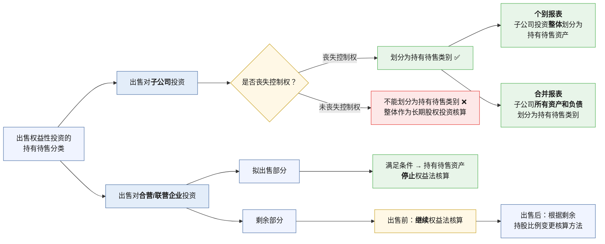

> [!note] 本章重点
> - 持有待售的分类条件（关注长投的处理）
> - 持有待售的会计处理（划分为持有待售时/后续的减值测试（资产组）/处置持有待售）
> - 持有待售的列报
> - 终止经营

## 1. 持有待售类别的分类
### 1.1 基本原则
- 企业主要通过出售而非持续使用一项非流动资产或处置组收回其账面价值的,  应当将其划分为持有待售类别。
- 企业不应当因持有待售的非流动资产或处置组仍在产生零星收入而不将其划分为持有待售类别。
- "出售" 包括具有商业实质的非货币性资产交换。如果企业以非货币性资产交换形式换出非流动资产或处置组, 且该交易具有商业实质,  那么企业应当考虑相关非流动资产或处置组是否符合划分为持有待售类别的条件。同样地,  如果企业以非流动资产或处置组作为换出资产进行债务重组,  也可能符合划分为持有待售类别的条件。
> [!faq]- 为什么要设计这个科目？
> 
>  1. **信息质量要求：相关性**
> 传统会计假设资产是“长期持有”的，用历史成本+折旧摊销来计量。但一旦决定出售，资产的**经济实质变了**：
> - 它不再是“生产工具”，而是“待售商品”
> - 用户（投资者）更关心“能卖多少钱”，而不是“账面剩多少”
> 
>  2. **避免利润操纵**
> 如果不单独列示，企业可能通过“突击出售资产”来美化报表。单独列报后：
> - 持有待售资产**不计提折旧/摊销**
> - 账面价值调整为“公允价值-出售费用”
> - 损益计入“资产处置损益”（而非营业外收支）
> 
> 3. **区分“持续经营”与“终止经营”**
> 这是财务分析的关键：
> - **持续经营**：企业还会继续干的业务
> - **终止经营**：企业要“砍掉”的业务
> 单独列报能让投资者看清“主业赚的钱”和“卖资产赚的钱”。
### 1.2 分类条件

非流动资产或处置组划分为持有待售类别,  应当同时满足以下两个条件:
(1)  **可立即出售**
- 根据类似交易中出售此类资产或处置组的惯例,  在当前状况下可立即出售。
(2)  **出售极可能发生**
- 出售极可能发生, 即企业已经就一项出售计划作出决议且获得确定的**购买承诺**, 预计出售将在**一年内完成**。有关规定要求企业相关权力机构或者监管部门批准后方可出售的,  应当已经**获得批准**。

> [!note] 例外条款  (延长一年期限)
> 如果涉及的出售**不是关联方交易**, 且有充分证据表明企业**仍然承诺出售**非流动资产或处置组, 允许放松一年期限条件,  企业可以继续将非流动资产或处置组划分为持有待售类别。
> 如果涉及的出售是关联方交易,  则不允许放松一年期限条件。
> 
> 企业无法控制的原因包括:
> 
> **(1)  意外设定条件**
> - 企业在初始对非流动资产或处置组进行分类时,  能够满足划分为持有待售类别的所有条件,  但此后买方或其他方意外设定导致出售延期的条件,  企业针对这些条件已经采取措施,  且预计能够自设定导致出售延期的条件起一年内顺利化解延期因素并完成出售, 那么即使出售无法在最初一年内完成, 企业仍然可以维持原持有待售类别的分类
>
> **(2)  发生罕见情况**
> - 非流动资产或处置组在初始分类时满足了持有待售类别的所有条件,  但在最初一年内,  因发生罕见情况 (如因不可抗力引发的情况、宏观经济形势发生急剧变化等不可控情况), 导致持有待售的非流动资产或处置组未能在一年内完成出售。
> - 如果企业在最初一年内已经针对这些新情况采取了必要措施,而且该非流动资产或处置组重新满足了持有待售类别的划分条件, 那么即使原定的出售计划无法在最初一年内完成, 企业仍然可以维持原持有待售类别的分类。
### 1.3 特定持有待售类别分类的具体应用

#### 1.3.1 专为转售而取得的非流动资产或处置组

- 对于企业专为转售而新取得的非流动资产或处置组,  如果在取得日满足预计出售将在一年内完成的规定条件,  且短期  (通常为 3个月)  内很可能满足划分为持有待售类别的其他条件,  企业应当在**取得日将其划分为持有待售类别**。
#### 1.3.2 持有待售的长期股权投资
1. 出售对子公司的投资
	- 丧失控制权
		- 在**母公司个别财务报表**中将对**子公司投资整体**划分为持有待售类别（持有待售资产），而不是仅将拟处置的投资划分为持有待售类别
		- 在**合并财务报表**中将**子公司所有资产和负债**划分为持有待售类别，而不是仅将拟处置的投资对应的资产和负债划分为持有待售类别（持有待售资产和持有待售负债）
	- 未丧失控制权
		- 在拟出售阶段对此类投资仍应将其整体作为长期股权投资核算，拟出售的部分**不能划分为持有待售类别**。
2. 出售对合营企业/联营企业投资
	- 对于拟出售部分的权益性投资，满足持有待售类别划分条件、分类为持有待售资产的，应当停止权益法核算
	- 对于未划分为持有待售资产的剩余权益性投资，应当在划分为持有待售的那部分权益性投资出售前继续采用权益法进行会计处理，出售后再变化

> [!note] 理解记忆
> - 对于子公司，就是从整体看，失去控制就全部列为持有待售，否则就保持不动。
> - 对于合营企业联营企业，就是分开看，拟出售的列为持有待售，剩下的继续权益法（等确实卖了再看剩下的是继续权益法还是转为金融工具）

> [!example] 例题·单选题
> 甲公司集团拥有A公司、B公司、C公司和D公司 $100\%$ 的股份，甲公司集团拟出售其持有的部分长期股权投资，假设拟出售的股权符合持有待售类别的划分条件。下列有关持有待售非流动资产会计处理表述不正确的是（　）。
> 
> - A. 甲公司拟出售A公司全部股权，甲公司在个别财务报表中将拥有的A公司全部股权划分为持有待售类别，在合并财务报表中将A公司所有资产和负债划分为持有待售类别
> - B. 甲公司拟出售B公司 $70\%$ 的股权，出售后将丧失对B公司的控制权，但对其具有重大影响。甲公司应当在个别财务报表中将拥有的B公司全部股权划分为持有待售类别，在合并财务报表中将B公司所有资产和负债划分为持有待售类别
> - C. 甲公司拟出售C公司 $10\%$ 的股权，仍然拥有对C公司的控制权，甲公司应当在个别财务报表中将拥有的C公司全部股权划分为持有待售类别，在合并财务报表中将C公司所有资产和负债划分为持有待售类别
> - D. 甲公司拟出售D公司 $5\%$ 的股权，仍然拥有对D公司的控制权，不应当将拟处置的部分股权划分为持有待售类别
>
> > [!check]- 答案与解析
> > **正确答案：C**
> >
> > **深度解析：**
> > **1. 核心判定逻辑：**
> > 企业出售对子公司投资导致**丧失控制权**的，无论出售后是否保留相关权益性投资，应当在拟出售的投资符合持有待售类别划分条件时：
> > - 在**个别财务报表**中，将对子公司投资**整体**划分为持有待售类别。
> > - 在**合并财务报表**中，将子公司**所有资产和负债**划分为持有待售类别。
> >
> > **2. 选项逐一拆解：**
> > - **选项 A（正确）：** 出售 $100\%$ 股权，显然**丧失控制权**，符合划分条件。
> > - **选项 B（正确）：** 出售 $70\%$ 股权后剩余 $30\%$，虽然仍有重大影响，但已**丧失控制权**，应将股权整体（$100\%$）在个别报表中划分为持有待售。
> > - **选项 C（错误）：** 出售 $10\%$ 股权后仍持有 $90\%$ 股权，**未丧失控制权**。在这种情况下，不符合持有待售类别的划分条件，不能将子公司资产和负债划分为持有待售。
> > - **选项 D（正确）：** 出售 $5\%$ 股权且**未丧失控制权**，表述“不应当划分”符合会计准则规定。
> >
> > **💡 易错点提示：**
> > 划分持有待售类别的“分水岭”是**控制权是否丧失**。只要不丧失控制权，该交易属于权益性交易，不能在合并报表中将子公司资产负债列入持有待售；只有在**丧失控制权**的前提下，才是“全进全出”（即个别报表股权全划入，合并报表资产负债全划入）。
#### 1.3.3 拟结束使用而非出售的非流动资产或处置组

- 拟结束使用而非出售的非流动资产或处置组,  其账面价值并非主要通过出售收回,  无论在停止使用之前或之后, 企业均**不应当将其划分为持有待售类别**。例如,  因已经使用至经济寿命期结束而将某机器设备报废,  因技术进步而将某子公司关停或转产。
- 对于暂时停止使用的非流动资产,  不应当认为其拟结束使用,  也不应当将其划分为持有待售类别。
## 2. 持有待售类别的计量
### 2.1 持有待售类别在计量时适用的会计准则

| 持有待售的非流动资产 (包括处置组中的非流动资产)    | 适用的企业会计准则                         |
| :--------------------------- | :-------------------------------- |
| (1) 采用公允价值模式进行后续计量的投资性房地产    | 《企业会计准则第3号————投资性房地产》             |
| (2) 采用公允价值减去出售费用后的净额计量的生物资产  | 《企业会计准则第5号——生物资产》                 |
| (3) 职工薪酬形成的资产                | 《企业会计准则第9号——职工薪酬》                 |
| (4) 递延所得税资产                  | 《企业会计准则第18号——所得税》                 |
| (5) 由金融工具相关会计准则规范的金融资产       | 金融工具相关会计准则                        |
| (6) 由保险合同相关会计准则规范的保险合同所产生的权利 | 保险合同相关会计准则                        |
| (7) 除上述各项外的其他持有待售的非流动资产      | 《企业会计准则第42号——持有待售的非流动资产、处置组和终止经营》 |
| ①成本模式计量的投资性房地产               |                                   |
| ②固定资产、在建工程                   |                                   |
| ③无形资产、开发支出                   |                                   |
| ④长期股权投资                      |                                   |
| ⑤商誉等                         |                                   |
- 持有待售的处置组中包含的上述第（7）项所述的非流动资产（以下简称“适用持有待售准则计量规定的非流动资产”），适用《企业会计准则第42号——持有待售的非流动资产、处置组和终止经营》。
- 处置组中的流动资产、上述第（1）至（6）项所述的非流动资产（以下简称“适用其他准则计量规定的非流动资产”）和所有负债的计量，适用相关会计准则。
### 2.2 划分为持有待售类别时的计量

- 企业初始计量持有待售的非流动资产或处置组时，如果持有待售的非流动资产或处置组整体**账面价值高于公允价值减去出售费用后的净额**，应将账面价值减记至公允价值减去出售费用后的净额，减记的金额确认为**资产减值损失，计入当期损益**，同时计提持有待售资产减值准备，但不应当重复确认不适用持有待售准则计量规定的资产和负债按照相关准则规定已经确认的损失。
- 对于持有待售的**处置组**确认的资产减值损失金额，如果该处置组包含商誉，应当先抵减处置组中商誉的账面价值，再根据处置组中适用持有待售准则计量规定的各项非流动资产**账面价值所占比重**，按比例抵减其账面价值。
- 确认的资产减值损失金额应以处置组中包含的适用持有待售准则计量规定的各项非流动资产的账面价值为限，不应分摊至处置组中包含的流动资产或适用其他准则计量规定的非流动资产。 
```
借：资产减值损失
　贷：持有待售资产减值准备——商誉
　　　　　　　　　　　　　——固定资产
　　　　　　　　　　　　　——无形资产
```

> [!note]- 理解
> ### 第一层：减值的触发条件（总原则）
> 
> > 账面价值 > 公允价值 - 出售费用 → 减记差额
> 
> **核心公式：**
> 
> $$减值金额 = 账面价值 - (公允价值 - 出售费用)$$
> 
> - 减记的金额 → 借：**资产减值损失**，贷：**持有待售资产减值准备**
> - ⚠️ 但有一个防重复条款：如果处置组里某些资产/负债**不适用**持有待售准则的计量规定（比如存货、金融资产），它们按各自准则已经确认过的减值，**不能再算一遍**。
> > 💡 **一句话记忆**：先比大小，大了就砍，但别砍两刀。
> ### 第二层：处置组的减值分摊顺序
> 
> 处置组 = 一堆资产打包卖，里面可能有商誉、固定资产、无形资产等。
> 
> **减值分摊顺序：**
> 
> | 顺序 | 操作 | 逻辑 |
> | :--- | :--- | :--- |
> | ① | **先抵减商誉** | 商誉最"虚"，优先干掉 |
> | ② | **再按账面价值比例分摊**给其他适用持有待售计量的非流动资产 | 公平分摊，谁块头大谁多扛 |
> 
> > 💡 这个顺序和**资产组减值**（CAS 8）的逻辑完全一致——先砍商誉，再按比例分摊。考试常考的套路。
> 
> **举个例子：**
> 
> 处置组包含：商誉 100、固定资产 300、无形资产 200，减值总额 250
> 
> - 第一步：先抵商誉 100 → 商誉归零，剩余减值 150
> - 第二步：固定资产占比 300/(300+200) = 60%，分摊 150×60% = 90
> - 第二步：无形资产占比 200/(300+200) = 40%，分摊 150×40% = 60
> ### 第三层：减值分摊的"天花板"
> 
> 两个**不能分摊**的边界：
> 
> - ❌ **不分摊给流动资产**（如存货、应收账款）—— 它们有自己的减值规则
> - ❌ **不分摊给不适用持有待售计量的非流动资产**（如递延所得税资产、金融资产）—— 它们也各管各的
> 
> > 💡 **一句话记忆**：减值只在"持有待售准则管得着的非流动资产"这个圈子里分，圈外的一分钱不给。

- 对于取得日划分为持有待售类别的非流动资产或处置组（专为转售），企业应当在初始计量时比较假定其**不划分为持有待售类别情况下的初始计量金额**和公允价值减去出售费用后的净额，以两者**孰低**计量。
- 对于取得日划分为持有待售类别的非流动资产或处置组，除企业合并中取得的，非流动资产或处置组以公允价值减去出售费用后的净额作为初始计量金额而产生的差额，应当计入当期损益（资产减值损失）。

> [!example] 例题·单选题
> 下列关于持有待售类别的说法中，正确的是（　）。
> 
> A. 对于拟出售的非流动资产或处置组，企业应当在划分为持有待售类别前考虑进行减值测试
> B. 持有待售的非流动资产不计提折旧、摊销和减值
> C. 与持有待售类别相关的出售费用包括中介费用、财务费用、消费税、印花税、所得税等
> D. 不再继续划分为持有待售类别的，应当按照假定不划分为持有待售类别情况下进行调整后的金额与可收回金额孰高确定账面价值
>
> > [!check]- 答案与解析
> > **正确答案：A**
> >
> > **深度解析：**
> > 1. **选项 A 正确**：企业在将非流动资产或处置组首次划分为持有待售类别前，应当按照相关会计准则规定计量其账面价值。如果存在减值迹象，应当**先进行减值测试**并确认减值损失。
> > 2. **选项 B 错误**：持有待售的非流动资产**不计提折旧或摊销**，但应当进行**减值测试**。若账面价值高于“公允价值减去出售费用后的净额”，需确认资产减值损失。
> > 3. **选项 C 错误**：出售费用是指企业出售资产或处置组发生的增量费用。包括特定的中介费、印花税等，但**不包括财务费用和所得税费用**。
> > 4. **选项 D 错误**：不再继续划分为持有待售类别的，应当按照以下两者中的**孰低者**（而非孰高）计量：
> >    - 假定不划分为持有待售类别情况下进行调整后的金额（即原账面价值扣除折旧、摊销或减值后的金额）；
> >    - 可收回金额。
> >    - 逻辑表达式：$账面价值 = \min(调整后金额, 可收回金额)$
> >
> > **💡 易错点提示：**
> > 1. **费用排除**：牢记出售费用**不含**财务费用和所得税。
> > 2. **计量原则**：终止划分为持有待售时的后续计量遵循“**孰低原则**”，这体现了会计的谨慎性，防止虚增资产。
### 2.3 划分为持有待售类别**后**的计量

- 持有待售的**非流动资产**
	- 企业在资产负债表日重新计量持有待售的非流动资产时，如果其账面价值高于公允价值减去出售费用后的净额，应当将账面价值减记至公允价值减去出售费用后的净额，减记的金额确认为资产减值损失，计入当期损益，同时计提持有待售资产减值准备。
	- 如果后续资产负债表日持有待售的非流动资产公允价值减去出售费用后的净额增加，以前减记的金额应当予以恢复，并在划分为持有待售类别后非流动资产确认的资产减值损失**金额内转回**，转回金额计入当期损益。划分为持有待售类别**前**确认的资产减值损失不得转回。
	- 持有待售的非流动资产**不应计提折旧或摊销**。
```
借：持有待售资产减值准备——××资产
　贷：资产减值损失
```

- 持有待售的**处置组**
	- **先局部**
		- 企业在资产负债表日重新计量持有待售的处置组时，应当**首先**按照相关会计准则规定计量处置组中的**流动资产**、**适用其他准则计量规定的非流动资产**和**负债**的账面价值。（如：处置组中的金融工具）
		- 持有待售处置组中的**负债**和**不适用**持有待售准则计量规定的**金融资产**、以公允价值计量的**投资性房地产**等的利息或租金收入、支出及其他费用应当**继续予以确认**。
	- **后整体**
		- **在进行上述计量后**，企业应当比较持有待售的**处置组整体**账面价值与公允价值减去出售费用后的净额，如果账面价值高于其公允价值减去出售费用后的净额，应当将账面价值减记至公允价值减去出售费用后的净额，减记的金额确认为**资产减值损失**，同时计提持有待售资产减值准备，**但不应当重复确认不适用持有待售准则计量规定的资产**和负债按照相关准则规定已经确认的损失。
		- 对于持有待售的处置组确认的资产减值损失金额，如果该处置组包含**商誉**，应当先抵减处置组中商誉的账面价值，再根据处置组中**适用持有待售准则计量规定的各项非流动资产**账面价值所占比重，按比例抵减其账面价值。确认的资产减值损失金额应当以处置组中包含的**适用持有待售准则计量规定的各项非流动资产**的账面价值为限，不应分摊至处置组中包含的流动资产或适用其他准则计量规定的非流动资产。
		- 如果后续资产负债表日持有待售的处置组公允价值减去出售费用后的净额增加，以前减记的金额应当予以**恢复**，并在划分为持有待售类别后**适用持有待售准则计量规定的非流动资产**确认的资产减值损失金额内转回，转回金额计入当期损益。已抵减的**商誉**账面价值，以及适用持有待售准则计量规定的非流动资产在划分为持有待售类别**前**确认的资产减值损失不得转回。
		- 对于持有待售的处置组确认的资产减值损失后续**转回金额**，应当根据处置组中**除商誉外**适用持有待售准则计量规定的各项非流动资产账面价值所占比重，按比例**增加其账面价值**。
		- 持有待售的处置组中的非流动资产**不应计提折旧或摊销**。

> [!note]- 理解
> #### (1) 单项非流动资产：逻辑简单
> - **减值**：如果市场价跌了（净额 < 账面），立刻计提减值。
> - **转回**：如果市场价又涨了，可以转回，但不能把“划分前”的老账转回来。
> - **分录**：
>     
>     ```text
>     借：资产减值损失
>       贷：持有待售资产减值准备
>     ```
> #### (2) 处置组（资产全家桶）：逻辑复杂（重点！）
> 
> 处置组就像一个“大礼包”，里面有固定资产、商誉、应收账款、负债等。它的减值遵循**“先局部、后整体、再分摊”**的逻辑：
> 
> 1. **先局部**：先给礼包里的“特权阶层”（流动资产、金融资产、负债）按各自的准则调一遍账（比如应收账款提坏账）。
> 2. **后整体**：看整个礼包的账面价值是否高于（公允-费用）。
> 3. **再分摊（减值顺序）**：
>     - **第一顺位**：先扣**商誉**（商誉最虚，先拿它开刀）。
>     - **第二顺位**：剩下的减值，按比例分给**适用本准则的非流动资产**（如固定资产、无形资产）。
>     - **禁区**：绝对不能分给流动资产、金融资产和负债。


> [!example] 例题·单选题
> 甲公司 2×18 年 1 月 1 日与乙公司签订一项转让协议，将其一家销售门店转让给乙公司，初定价格为 500 万元，甲公司预计处置费用为 5 万元。假定甲公司该门店满足划分为持有待售类别的条件，但不符合终止经营的定义。
>
> 甲公司将其划分为持有待售的资产组（假定全部为资产，不存在负债）。当日，该处置组原账面价值为 600 万元，其中包括一项交易性金融资产账面价值 100 万元，非流动资产的可收回金额等于账面价值。协议约定，该项金融资产转让价格以转让当日市场价格为准。
>
> 2×18 年 5 月 1 日，甲公司办理完毕资产组的转移手续，实际收取乙公司支付的价款 510 万元，实际发生处置费用 5 万元。当日该交易性金融资产公允价值为 110 万元。
>
> 不考虑其他因素，下列关于甲公司会计处理正确的是（　）。
>
> A. 2×18 年 1 月 1 日应确认资产减值损失 100 万元
> B. 2×18 年 1 月 1 日应确认“持有待售资产”科目 500 万元
> C. 2×18 年 5 月 1 日应确认公允价值变动损益 10 万元
> D. 2×18 年 5 月 1 日，因处置资产确认损益 10 万元
>
> > [!check]- 答案与解析
> > **正确答案：C**
> >
> > **深度解析：**
> >
> > **第一步：划分为持有待售时的计量（2×18 年 1 月 1 日）**
> > *   **计算减值金额：**
> >     持有待售资产组的初始计量原则是：账面价值与公允价值减去出售费用后的净额（FVLCS）孰低。
> >     *   资产组原账面价值 = $600$ 万元。
> >     *   公允价值减去出售费用后的净额 = $500 - 5 = 495$ 万元。
> >     *   应计提减值准备 = $600 - 495 = 105$ 万元。
> >     *   **结论：** 选项 A 错误（应为 105 万元，而非 100 万元）。
> > *   **确认账面价值：**
> >     计提减值后，该资产组在“持有待售资产”科目的账面价值应调整为 $495$ 万元。
> >     *   **结论：** 选项 B 错误（应为 495 万元，而非 500 万元）。
> >
> > **第二步：持有期间的后续计量（2×18 年 1 月 1 日至 5 月 1 日）**
> > *   根据《企业会计准则第 42 号》，持有待售资产组中的**交易性金融资产**等适用其他准则的资产，仍应按照相关准则（CAS 22）进行计量。
> > *   交易性金融资产公允价值由 $100$ 万元上升至 $110$ 万元，变动金额 = $110 - 100 = 10$ 万元。
> > *   **结论：** 选项 C 正确，应确认“公允价值变动损益” $10$ 万元。
> >
> > **第三步：处置时的计量（2×18 年 5 月 1 日）**
> > *   **计算处置损益：**
> >     *   处置价款净额 = $510 - 5 = 505$ 万元。
> >     *   处置时资产组账面价值 = 初始确认金额 $495$ + 金融资产公允价值变动 $10$ = $505$ 万元。
> >     *   处置损益 = 处置价款净额 $505$ - 处置时账面价值 $505$ = $0$。
> >     *   **结论：** 选项 D 错误（处置损益为 0，而非 10 万元）。
> >
> > **💡 易错点提示：**
> > 1.  **减值计算范围**：计算持有待售资产组减值时，是拿**整个资产组**的账面价值与 FVLCS 比较，而不是剔除金融资产后再比较。
> > 2.  **适用准则优先**：虽然划分为持有待售，但组内的金融资产、投资性房地产（公允模式）等，**后续计量仍遵循其原有准则**（如确认公允价值变动损益），不停止后续计量，也不计提折旧/摊销。
### 2.4 不再继续划分为持有待售类别的计量

非流动资产或处置组因不再满足持有待售类别划分条件而不再继续划分为持有待售类别或非流动资产从持有待售的处置组中移除时，应当按照以下两者孰低计量：
- 划分为持有待售类别前的账面价值，按照假定不划分为持有待售类别情况下本应确认的折旧、摊销或减值等进行**调整后的金额**；
- **可收回金额**。
*这样处理的结果是，原来划分为持有待售的非流动资产或处置组在重新分类后的账面价值，与其从未划分为持有待售类別情况下的账面价值相一致。由此产生的差额计入当期损益，可以通过“资产减值损失”科目进行会计处理。*
### 2.5 终止确认

持有待售的非流动资产或处置组在终止确认时，企业应当将**尚未确认的**利得或损失计入当期损益。

 - 持有待售的非流动资产为金融工具、长期股权投资和投资性房地产，差额计入**投资收益**
 - 固定资产等差额计入[[A1-会计笔记/资产处置损益]]
- 根据持有待售准则的规定，持有待售的非流动资产或处置组在终止确认时，企业应当将尚未确认的利得或损失计入当期损益。持有待售的处置组中包含有指定为以公允价值计量且其变动计入其他综合收益的金融资产（其他权益工具投资）的，在持有待售的处置组终止确认时，相关利得或损失一并计入当期损益（资产处置损益），而非计入留存收益；之前计入其他综合收益的累计利得或损失应当从其他综合收益中转出，**也计入当期损益（资产处置损益）**。 
- 链接：[[A1-会计笔记/其他权益工具投资的会计处理]]

> [!example]- 例题
> 2×24年3月1日，甲公司购入非关联方丙公司全部股权，支付价款1 600万元。购入该股权之前，甲公司的管理层已经做出决议，一旦购入丙公司，将在一年内将其出售给乙公司，丙公司当前状况下即可立即出售。甲公司尚未与乙公司议定转让价格，购买日股权公允价值（**1 600万元**）与支付价款一致。预计甲公司还将为出售该子公司支付12万元的出售费用。甲公司与乙公司计划于2×24年3月31日签署股权转让合同。
> 
> 2×24年3月31日，甲公司与乙公司签订合同，转让所持有丙公司的全部股权，转让价格为1 607万元，甲公司预计还将支付8万元的出售费用。
> 
> 2×24年6月25日，甲公司为转让丙公司的股权支付律师费5万元。2×24年6月29日，甲公司完成对丙公司的股权转让，收到价款1 607万元。
> 
>  **分析**
> （1）2×24年3月1日
> 丙公司是专为转售而取得的子公司，其不划分为持有待售类别情况下的初始计量金额为1 600万元，当日公允价值减去出售费用后的净额为1 588万元（1 600-12），按照两者孰低计量。
> 借：持有待售资产——长期股权投资　　　　　　 1 588
> 　　资产减值损失　　　　　　　　　12
> 　贷：银行存款　　　　　　　　　 1 600
> （2）2×24年3月31日
> 甲公司持有的丙公司的股权公允价值减去出售费用后的净额为1 599万元（1 607-8），账面价值为1 588万元，以两者孰低计量，甲公司不需要进行账务处理。
> （3）2×24年6月25日（支付出售费用）
> 借：**投资收益**　　　　　　　　　　　 5
> 　贷：银行存款　　　　　　　　　　　 5
> （4）2×24年6月29日
> 借：银行存款　　　　　　　　　 1 607
> 　贷：持有待售资产——长期股权投资　　 1 588
> 　　　**投资收益**　　　　　　　　　　　19

## 3. 持有待售类别的列报
### 3.1 资产负债表列示
- 持有待售资产和负债**不应当相互抵销**。“持有待售资产”项目和“持有待售负债”项目应当分别作为**流动资产**和**流动负债**列示。
- 非流动资产或处置组在资产负债表日至财务报告批准报出日**之间**满足持有待售类别划分条件的，应当作为资产负债表日后**非调整事项**进行会计处理，并在附注中披露相关信息。
### 3.2 利润表列示

- 企业应当在利润表中分别列示**持续经营损益**和**终止经营损益**。在利润表“净利润”项下增设“持续经营净利润”和“终止经营净利润”项目，以税后净额分别反映持续经营相关损益和终止经营相关损益。
- **不符合终止经营定义的**持有待售的非流动资产或处置组所产生的下列相关损益，应当在利润表中作为**持续经营损益**列报：
	1. 企业**初始计量**或在**资产负债表日重新计量**持有待售的非流动资产或处置组时，因账面价值高于其公允价值减去出售费用后的净额而**确认的资产减值损失**。
	2. 后续资产负债表日持有待售的非流动资产或处置组公允价值减去出售费用后的净额增加，因恢复以前减记的金额而**转回的资产减值损失**。
	3. 持有待售的非流动资产或处置组的**处置损益**。

## 4. 终止经营
### 4.1 终止经营的定义

必须同时满足 **"能够单独区分"** + **"满足下述述任一条件"**+**该组成部分已经处置或划分为持有待售类别**

| 条件      | 具体含义                                          |
| ------- | --------------------------------------------- |
| **条件1** | 该组成部分代表一项独立的主要业务或一个单独的主要经营地区                  |
| **条件2** | 该组成部分是拟对一项独立的主要业务或一个单独的主要经营地区进行处置的一项相关联计划的一部分 |
| **条件3** | 该组成部分是专为转售而取得的子公司                             |
- **不是所有划分为持有待售类别的处置组都属于终止经营**。因为有些处置组可能不是“能够单独区分的组成部分”或不符合终止经营定义中的规模条件。即，**并非所有处置组都符合终止经营的定义**，企业需要运用职业判断确定终止经营。
- 不是所有的终止经营都划分为持有待售类别，因为有些终止经营在资产负债表日前已经处置，包括已经出售、结束使用（如关停或报废等）。
![[A1-会计笔记/附件/15-持有待售的非流动资产、处置组和终止经营-1767850887029.webp]]

| 场景            | 是否终止经营 | 理由            |
| ------------- | ------ | ------------- |
| 处置一条生产线       | ❌ 否    | 通常不是"独立的主要业务" |
| 处置一个子公司       | ⚠️ 看情况 | 如果代表独立主要业务，则是 |
| 处置一个事业部       | ✅ 是    | 代表独立的主要业务     |
| 处置一个地区的全部业务   | ✅ 是    | 代表单独的主要经营地区   |
| 处置专为转售而取得的子公司 | ✅ 是    | 满足条件3         |
### 4.2 终止经营的列报

**（一）资产负债表列示**
1. 终止经营**划分为持有待售类别**
	- 如果终止经营划分为持有待售类别，应当按照持有待售类别的列报要求处理。（持有待售资产、持有待售负债）
2. 终止经营**已经处置**
	- 如果终止经营没有划分为持有待售类别，而是**被处置**，无论**当期**或是**可比会计期间**的资产负债表中**都不应当列报**与之相关的持有待售资产或负债。
**（二）利润表列示**
终止经营的相关损益应当作为终止经营损益列报，列报的终止经营损益应当包含**整个报告期间**，而不仅包含认定为终止经营后的报告期间。

> [!note] 终止经营的相关损益具体包括（5+1）
>
> 1. 终止经营的**经营活动损益**，如销售商品、提供服务的收入、相关成本和费用等。
> 2. 企业初始计量或在资产负债表日重新计量**符合终止经营定义的持有待售处置组**时，因账面价值高于其公允价值减去出售费用后的净额而**确认的资产减值损失**。
> 3. 后续资产负债表日**符合终止经营定义的持有待售处置组**的公允价值减去出售费用后的净额增加，因恢复以前减记的金额而**转回的资产减值损失**。
> 4. 终止经营的**处置损益**。
> 5. 终止经营处置损益的**调整金额**。可能引起调整的情形包括：
> 	（1）最终确定处置条款，如与买方商定交易价格**调整额**和**补偿金**；
> 	（2）清除与处置相关的不确定因素，如确定卖方保留的**环保义务或产品质量保证义务**；
> 	（3）履行与处置相关的**职工薪酬支付义务**等。
> - 企业在处置终止经营的过程中可能附带产生一些**增量费用**，**企业应当将这些增量费用作为终止经营损益列报。**


**（三）终止经营列报的其他要求**
1. **拟结束使用而非出售的处置组**满足终止经营定义中有关组成部分的条件的，应当**自停止使用日起作为终止经营列报**。
> [!note] 拟结束使用而非出售的非流动资产或处置组（**2025年教材新增内容**）
> （1）对于拟结束使用而非出售的**非流动资产**，无论在停止使用**之前或之后**，均**不应当**划分为持有待售类别，**也不应当作为终止经营列报**。
> 
> 注：对于拟结束使用而非出售的固定资产，其账面价值仍然主要通过持续使用收回，其不属于持有待售类别，因此**应继续计提折旧**。
> 
> （2）对于拟结束使用而非出售的**处置组**，**在停止使用前**，不应当划分为持有待售类别，也不应当作为终止经营列报；**在停止使用后**，不应当划分为持有待售类别，如果该处置组满足终止经营中有关单独区分的组成部分的条件，**应当作为终止经营列报**。

2. 企业因出售对子公司的投资等原因导致企业丧失对子公司的控制权，且**该子公司符合终止经营定义**的，应当**在合并利润表中列报相关终止经营损益**。
3. 从财务报表可比性出发，对于当期列报的终止经营，企业应当在当期财务报表中，将原来作为持续经营损益列报的信息重新作为可比会计期间的终止经营损益列报。
	- 对于**当期首次满足**持有待售类别划分条件的非流动资产或处置组中的资产和负债，**不应当调整可比会计期间资产负债表**，即**不对**其符合持有待售类别划分条件**前**各个会计期间的资产负债表进行项目的分类**调整或重新列报**。因此，在可比会计期间资产负债表中列报的持有待售资产和持有待售负债**都是在可比会计期末即符合**持有待售类别划分条件的非流动资产或处置组。

> [!example] 2024真题-多选
> 甲公司主要从事焦煤和天然气两类业务，天然气业务由其全资子公司乙公司单独经营。2×24年12月31日，经董事会批准，甲公司与第三方签订股权转让协议约定，甲公司以13 500万元的价格向该第三方转让其持有的全部乙公司股权，预计2×25年3月末前完成过户登记手续。乙公司2×24年12月31日的资产总额为26 000万元、负债总额为12 000万元，2×23年12月31日的资产总额为35 000万元、负债总额为18 000万元；乙公司2×24年度和2×23年度分别实现净利润800万元和1 000万元。
> 
> 不考虑相关税费及其他因素，在甲公司编制2×24年度合并财务报表时，下列各项会计处理的表述中，正确的有（　　）。
> 
> A.在合并利润表中列报2×23年度终止经营损益1 000万元
> B.在合并资产负债表中2×23年12月31日无须列报持有待售资产
> C.在合并利润表中列报2×24年度终止经营损益300万元
> D.在合并资产负债表中列报2×24年12月31日持有待售资产14 000万元
> 
> > [!check]- 答案解析
> > 
> > 【答案】ABC
> >  【解析】对于当期列报的终止经营，企业应当在当期财务报表中，将原来作为持续经营损益列报的信息重新作为可比会计期间的终止经营损益列报，即在合并利润表中列报2×23年度终止经营损益1 000万元选项A正确；对于当期首次满足持有待售类别划分条件的非流动资产或处置组，不应当调整可比会计期间资产负债表，即在合并资产负债表中2×23年12月31日无须列报持有待售资产，选项B正确。
> > 
> > 合并利润表中列报的2×24年度终止经营损益=终止经营的经营活动损益（即乙公司2×24年度实现的净利润）800-终止经营的处置损失500[13 500-（26 000-12 000）]=300（万元），选项C正确；
> > 
> > 在合并资产负债表中列报2×24年12月31日持有待售资产26 000万元，选项D错误。
> 

### 4.3 特殊事项的列报

**（一）企业专为转售而取得的持有待售子公司的列报**
如果企业专为转售而取得的子公司符合持有待售类别的划分条件，应当按照持有待售的处置组和终止经营的有关规定进行列报。
1. 在**合并资产负债表**中，企业专为转售而取得的持有待售子公司的**全部**资产和负债应当分别作为持有待售资产和持有待售负债项目列示。
2. 在**合并利润表**中，**符合终止经营定义的**专为转售而取得的**持有待售子公司的净利润**与其他终止经营净利润应当合并列示在“终止经营净利润”项目中。

**（二）不再继续划分为持有待售类别的列报**
1. 持有待售的非流动资产或处置组
	- 对于非流动资产或处置组，如果其不再继续划分为持有待售类别或非流动资产从持有待售的处置组中移除，在资产负债表中，企业应当将原来分类为持有待售类别的非流动资产或处置组重新作为固定资产、无形资产等列报，并调整其账面价值。在当期利润表中，企业应当将**账面价值调整金额**作为**持续经营损益**列报。

2. 持有待售的的子公司、共同经营、合营企业、联营企业
	- 持有待售的**对联营企业或合营企业的权益性投资**不再符合持有待售类别划分条件的，应当**自划分为持有待售类别日起采用权益法进行追溯调整**。
	- 持有待售的**对子公司、共同经营的权益性投资**不再符合持有待售类别划分条件的，同样应当**自划分为持有待售类别日起追溯调整**。
上述情况下，划分为持有待售类别期间的**财务报表应当作相应调整**。

3. 终止经营
	- 终止经营不再满足持有待售类别划分条件的，企业应当在当期财务报表中，将原来作为**终止经营损益**列报的信息重新作为可比会计期间的**持续经营损益**列报，并在附注中说明这一事实。