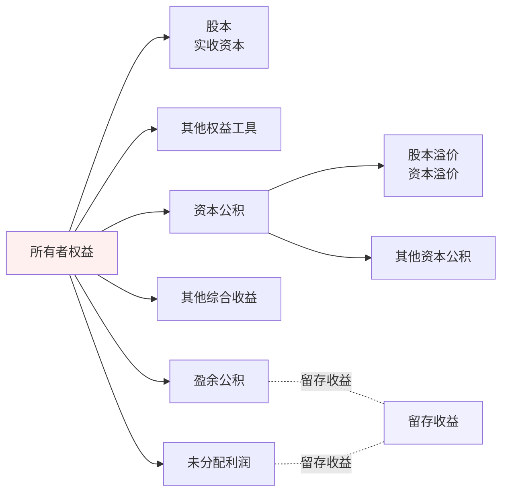

# 本章导读

- （1）实收资本（或股本）增减变动的会计处理
- （2）其他权益工具的会计处理
- （3）资本公积的会计处理
- （4）其他综合收益的会计处理
- （5）留存收益的会计处理等

> 本章近三年考题题型均为客观题，分值在 2 分左右。



---

# 1. 实收资本
## 1.1 实收资本概述

实收资本是指企业按照章程规定或合同、协议约定，接受投资者投入企业的注册资本。
企业应当设置“**实收资本**”科目，核算企业接受投资者投入的实收资本，股份有限公司应将该科目改为“**股本**”。

- （1）有限责任公司的注册资本为在公司登记机关登记的全体股东认缴的出资额。有限责任公司的全体股东认缴的出资额由股东按照公司章程的规定自公司成立之日起**五年内**缴足。
- （2）股份有限公司的注册资本为在公司登记机关登记的已发行股份的股本总额。股份有限公司的发起人应当在公司成立前按照其认购的股份全额缴纳股款。
## 1.2实收资本增加的会计处理

1. 资本公积转为股本或实收资本（**资本公积转增股本**）
```
借：资本公积——股本溢价（资本溢价）
　贷：股本（实收资本）
```

2. 盈余公积转为股本或实收资本（**盈余公积转增股本**）
```
借：盈余公积
　贷：股本（实收资本）
```

3. 所有者（包括原企业所有者和新投资者）投入
```
借：银行存款
　　固定资产
　　无形资产
　　长期股权投资等
　贷：股本（实收资本）
　　　资本公积——股本溢价（资本溢价）
```

4. 股份有限公司发放股票股利
```
借：利润分配——转作股本的股利
　贷：股本
```

5. 可转换公司债券持有人行使转换权利
```
借：应付债券——可转换公司债券（面值、应计利息）
　　　　　　——可转换公司债券（利息调整）（或贷方）
　　其他权益工具
　贷：股本
　　　资本公积——股本溢价
```

6. 企业将重组债务转为资本（以股抵债）
债务重组采用将债务转为权益工具方式进行的，债务人初始确认权益工具时，应当按照**权益工具的公允价值**计量。所清偿债务账面价值与权益工具确认金额之间的差额，记入“投资收益”科目。

> [!example]
> 假设：甲公司对乙公司应付账款账面价值为$1{,}000{,}000$元。经债务重组，甲公司向乙公司发行普通股进行清偿；发行股份的公允价值为$900{,}000$元（以权益工具公允价值计量）。
> 
> - 差额：$1{,}000{,}000-900{,}000=100{,}000$元，计入“投资收益”（债务人确认收益）
> 
> 会计分录（债务人甲公司）：
> - 借：应付账款 $1{,}000{,}000$
> - 贷：股本 $X$  
> - 贷：资本公积——股本溢价 $900{,}000-X$
> - 贷：投资收益 $100{,}000$
> 
> 其中$X$为按面值计算的“股本”（=发行股数×每股面值），剩余计入“资本公积——股本溢价”。

7. 以权益结算的股份支付的行权（以股份有限公司为例）

以权益结算的股份支付换取职工或其他方提供服务的，应在行权日，按根据实际行权情况确定的金额，借记“资本公积——其他资本公积”科目，按应计入股本的金额，贷记“股本”科目，按其差额，贷记“资本公积——股本溢价”科目。
```
借：银行存款
　　资本公积——其他资本公积
　贷：股本
　　　资本公积——股本溢价
```
## 1.3 实收资本减少的会计处理

1. 股份有限公司回购股票
- 股份有限公司因减少注册资本而回购本公司股份的，应按实际支付的金额，借记“库存股”科目，贷记“银行存款”等科目。
（回购股票时，**所有者权益总额减少**）
```
借：库存股
　贷：银行存款
```
> “库存股”科目核算企业收购、转让或注销的本公司股份金额，属于**权益类**科目。借方表示增加，贷方表示减少，属于所有者权益**备抵项**。“库存股”科目的期末借方余额，反映企业持有尚未转让或注销的本公司股份金额。

- 注销库存股时，应按股票面值和注销股数计算的股票面值总额，借记“股本”科目，按注销库存股的账面余额，贷记“库存股”科目。按其差额，冲减股票发行时原计入资本公积的溢价部分，借记“资本公积——股本溢价”科目。
（注销库存股时，**所有者权益总额不变**）
```
借：股本
　　资本公积——股本溢价
　贷：库存股
```

|                                         |                                                                                                                                                                                                          |
| --------------------------------------- | -------------------------------------------------------------------------------------------------------------------------------------------------------------------------------------------------------- |
| **①如果回购价格超过上述冲减“股本”及“资本公积——股本溢价”科目的部分** | 注销库存股时，如果回购价格**超过**上述冲减“股本”及“资本公积——股本溢价”科目的部分，应**依次**借记“盈余公积”“利润分配——未分配利润”等科目。<br><br>　借：股本<br>　　　资本公积——股本溢价<br>　　　盈余公积<br>　　　利润分配——未分配利润<br>　　贷：库存股                                                     |
| **②如果回购价格低于回购股份所对应的股本**                 | 注销库存股时，如果回购价格**低于**回购股份所对应的股本，所注销库存股的账面余额与所冲减股本的差额作为增加股本溢价处理，按回购股份所对应的股本面值，借记“股本”科目，按注销库存股的账面余额，贷记“库存股”科目，按其差额，贷记“资本公积——股本溢价”科目。<br><br>　借：股本（回购股份所对应的股本面值）<br>　　贷：库存股（注销库存股的账面余额）<br>　　　　资本公积——股本溢价（差额） |

2. 缩股减资
缩股，是指将部分股东或全体股东持有的股份多股缩为一股。缩股减资后，公司总股本将减少，缩股减少的股本计入资本公积（股本溢价）。
```
借：股本
　贷：资本公积——股本溢价
```
# 2. 其他权益工具
## 2.1 其他权益工具会计处理的基本原则

1. 对于归类为**权益工具**的金融工具，无论其名称中是否包含“债”，其利息支出或股利分配都应当作为发行企业的利润分配，其回购、注销等作为**权益**的变动处理；
2. 对于归类为**金融负债**的金融工具，无论其名称中是否包含“股”，其利息支出或股利分配原则上按照借款费用进行处理，其回购或赎回产生的利得或损失等计入**当期损益**
3. 企业（发行方）发行金融工具，其发生的手续费、佣金等交易费用：
	（1）如分类为债务工具且以摊余成本计量的，应当计入所发行工具的初始计量金额；
	（2）如分类为权益工具的，应当从权益中扣除。
## 2.2 发行方的账务处理
### 2.2.1 归类为**债务工具并以摊余成本计量**的账务处理

（1）发行方发行的金融工具归类为债务工具并以摊余成本计量的，应按实际收到的金额，借记“银行存款”等科目，按债务工具的面值，贷记“应付债券——优先股、永续债等（面值）”科目，按其差额，贷记或借记“应付债券——优先股、永续债等（利息调整）”科目。
```
借：银行存款
　贷：应付债券——优先股、永续债等（面值）
　　　　　　　——优先股、永续债等（利息调整）（或借方）
```

（2）在该工具存续期间，计提利息并对账面的利息调整进行调整等的会计处理，按照金融工具确认和计量准则中有关金融负债按摊余成本后续计量的规定进行会计处理。
```
借：财务费用等（应付债券期初摊余成本×实际利率）
　　应付债券——优先股、永续债等（利息调整）（或贷方）
　贷：应付债券——应计利息（债券面值×票面利率）
```
### 2.2.2 归类为**权益工具**的账务处理

（1）发行方发行的金融工具归类为权益工具的，应按实际发行价格，借记“银行存款”等科目，贷记“其他权益工具——**优先股、永续债等**”科目。
```
借：银行存款
　贷：其他权益工具——优先股、永续债等
```

（2）发行其他权益工具发生的承销费、发行登记费等交易费用，应借记“资本公积——**股本溢价/资本溢价**”科目，贷记“银行存款”等科目。
```
借：资本公积——股本溢价/资本溢价
　贷：银行存款
```

（3）分类为权益工具的金融工具，在存续期间分派股利（含分类为权益工具的金融工具所产生的利息，下同）的，作为**利润分配**处理。发行方应根据经批准的股利分配方案，按应分配给金融工具持有者的股利金额，借记“利润分配——应付优先股股利、应付永续债利息等”科目，贷记“应付股利——优先股股利、永续债利息等”科目。
```
借：利润分配——应付优先股股利、应付永续债利息等
　贷：应付股利——优先股股利、永续债利息等
```
### 2.2.3 发行复合金融工具的账务处理

- 发行方发行的金融工具为复合金融工具的，应按实际收到的金额，借记“银行存款”等科目，按金融工具的面值，贷记“应付债券——优先股、永续债（面值）等”科目，按负债成分的公允价值与金融工具面值之间的差额，借记或贷记“应付债券——优先股、永续债等（利息调整）”科目，按实际收到的金额扣除负债成分的公允价值后的金额，贷记“其他权益工具——优先股、永续债等”科目。
- 发行复合金融工具发生的交易费用，应当在负债成分和权益成分之间按照各自占总发行价款的比例进行分摊。
```
借：银行存款
　贷：应付债券——优先股、永续债等（面值）
　　　　　　　——优先股、永续债等（利息调整）（或借方）
　　　其他权益工具——优先股、永续债等
```

### 2.2.4 发行方发行的金融工具重分类的账务处理

1. 原归类为权益工具的金融工具重分类为金融负债

发行方以**重分类日计算的实际利率**作为应付债券后续计量利息调整等的基础。
重分类日的会计处理如下：
```
借：其他权益工具——优先股、永续债等         【账面价值】
  贷：应付债券——优先股、永续债等（面值）       【面值】
      应付债券——优先股、永续债等（利息调整）   【差额①（贷差时）】    →公允价值
      资本公积——资本溢价（或股本溢价）         【差额②（贷差时）】

①“应付债券——优先股、永续债等（利息调整）”科目的金额为该金融工具的公允价值与面值之间的差额；
②“资本公积——股本溢价”科目的金额为该金融工具的公允价值与账面价值之间的差额。如资本公积（股本溢价）不够冲减的，依次冲减盈余公积和未分配利润。
```

2. 原归类为金融负债的金融工具重分类为权益工具
```
借：应付债券——优先股、永续债等（面值）           【面值】
    应付债券——优先股、永续债等（利息调整）       【借方余额或贷方红字】
  贷：其他权益工具——优先股、永续债等             【重分类日金融负债的账面价值】
```

| **重分类**       | **入账价值**                 | **会计处理**                        |
| ------------- | ------------------------ | ------------------------------- |
| 权益工具**→**金融负债 | 金融负债以重分类日权益工具的**公允价值**计量 | 权益工具账面价值和金融负债公允价值之间的差额确认为**权益** |
| 金融负债**→**权益工具 | 权益工具以重分类日金融负债的**账面价值**计量 | 无差额                             |

## 2.3 投资方的账务处理

- 金融工具投资方（持有人）考虑持有的金融工具或其组成部分是权益工具还是债务工具投资时，应当遵循金融工具确认和计量准则的相关要求，通常应当与发行方对金融工具的权益或负债属性的分类保持一致。例如，对于发行方归类为权益工具的非衍生金融工具，投资方**通常**应当将其归类为权益工具投资。
- 如果投资方因持有发行方发行的金融工具而对发行方拥有控制、共同控制或重大影响的，按照长期股权投资准则和企业合并准则进行确认和计量；投资方需编制合并财务报表的，按照合并财务报表准则的规定编制合并财务报表。
# 3. 资本公积和其他综合收益

## 3.1资本公积的确认和计量
```
资本公积
├── 资本溢价或股本溢价
└── 其他资本公积
    ├── 以权益结算的股份支付
    └── 权益法核算的长期股权投资
```
### 3.1.1 资本溢价或股本溢价的会计处理

- 资本溢价
```
借：银行存款
　贷：实收资本
　　　资本公积——资本溢价
```
- 股本溢价
```
借：银行存款
　贷：股本　　　
　　　资本公积——股本溢价
　　　
委托证券商代理发行股票而支付的手续费、佣金等，应从溢价发行收入中扣除
借：资本公积——股本溢价
  贷：银行存款
```
### 3.1.2 其他资本公积的会计处理（**专款专用原则**）

1. 以权益结算的股份支付	
（1）以权益结算的股份支付换取职工或其他方提供服务的，应按照确定的金额，记入“管理费用”等科目，同时增加资本公积（其他资本公积）。
```
借：管理费用等
　贷：资本公积——其他资本公积
```

（2）在行权日，应按实际行权的权益工具数量计算确定收到的金额，借记“银行存款”等科目，根据等待期累计确定的成本费用，借记“资本公积——其他资本公积”科目，按计入实收资本或股本的金额，贷记“实收资本”或“股本”科目，并将其差额记入“资本公积——资本溢价或股本溢价”科目。
```
（以股份有限公司为例）
借：银行存款
　　资本公积——其他资本公积
　贷：股本
　　　资本公积——股本溢价
```

2. 采用权益法核算的长期股权投资	
（1）长期股权投资采用权益法核算的，被投资单位除净损益、其他综合收益和利润分配以外的所有者权益的其他变动，投资企业按持股比例计算应享有的份额，应当增加或减少长期股权投资的账面价值，同时增加或减少资本公积（其他资本公积）。
```
借：长期股权投资——其他权益变动
　贷：资本公积——其他资本公积
（或相反会计分录）
```

（2）当处置采用权益法核算的长期股权投资时，因被投资单位除净损益、其他综合收益和利润分配以外的其他所有者权益变动而确认的所有者权益，应当在终止采用权益法核算时全部转入当期损益。
```
借：资本公积——其他资本公积
　贷：投资收益
（或相反会计分录）
```
## 3.2 其他综合收益的确认与计量及会计处理

- 参考：[[A2-会计归纳/其他综合收益详解]]

| 会计期间处理                       | 具体项目                                                        |
| ---------------------------- | ----------------------------------------------------------- |
| **(一) 以后会计期间不能重分类进损益**       | ① 重新计量设定受益计划变动额                                             |
|                              | ② 权益法下不能转损益的其他综合收益                                          |
|                              | ③ 其他权益工具投资公允价值变动                                            |
|                              | ④ 企业自身信用风险公允价值变动                                            |
| **(二) 以后会计期间满足规定条件时将重分类进损益** | ① 权益法下可转损益的其他综合收益                                           |
|                              | ② 其他债权投资公允价值变动                                              |
|                              | ③ 金融资产重分类计入其他综合收益的金额                                        |
|                              | ④ 其他债权投资信用减值准备                                              |
|                              | ⑤ 现金流量套期储备                                                  |
|                              | ⑥ 外币财务报表折算差额                                                |
|                              | ⑦ 其他（如：非投资性房地产转换为采用公允价值模式进行后续计量的投资性房地产，转换日的公允价值大于原账面价值的差额等） |
# 4. 留存收益

## 4.1 盈余公积

### 4.1.1 盈余公积的形成机制(净利润分配顺序)
企业实现净利润后,按《公司法》规定依次处理:
```
净利润确认
├── ① 弥补以前年度亏损(若存在)
│   └── 法定盈余公积不足以弥补时,优先用当年利润弥补
├── ② 提取法定盈余公积
│   ├── 强制提取:净利润×10%
│   └── 提取上限:累计≥注册资本×50%
├── ③ 提取任意盈余公积(可选)
│   └── 股东会决议,无强制比例
└── ④ 向股东分配股利
    └── 剩余部分按出资比例/股份比例分配
```

**会计处理**(留存收益内部转换,总额不变):
```
借:利润分配——提取法定盈余公积
            ——提取任意盈余公积
  贷:盈余公积——法定盈余公积
              ——任意盈余公积
```

**法律风险提示**:
- 违规分配利润的,股东需退还+赔偿损失
- 公司持有的本公司股份不得分配利润
### 4.1.2 盈余公积的使用规则(三大用途对比)

| 用途 | 触发条件 | 法定限制 | 会计处理 | 对所有者权益影响 |
|------|----------|----------|----------|------------------|
| **① 弥补亏损** | 税前/税后利润不足时 | 2024新规:任意→法定→资本公积 | 借:盈余公积<br>贷:利润分配—盈余公积补亏 | 留存收益内部调整,总额不变 |
| **② 转增资本** | 股东会决议 | 转增后保留≥25%注册资本[^1] | 借:盈余公积<br>贷:股本(实收资本) | 留存收益→实收资本,总额不变 |
| **③ 扩大经营** | 投资/购置资产 | 无明确限制 | 无专门分录 | 资金用途调整 |

**【重点】弥补亏损的完整决策树**(按成本最低→法律强制顺序):

```
亏损发生
├── 5年内? ──→ YES → 税前利润弥补(可抵税,无需账务处理)
│               └── 借方余额自动抵消
├── 5年后? ──→ YES → 税后利润弥补(不可抵税,无需账务处理)
│               └── 借方余额自动抵消
└── 仍不足? ──→ 公积金弥补(2024新规顺序)
                ├── ① 任意盈余公积
                ├── ② 法定盈余公积
                └── ③ 资本公积(需满足3个条件)
                    ├── 股东投入形成
                    ├── 全体股东共享
                    └── 未限定用途
                    (特殊用途需权属方同意)
```

**会计处理**(公积金弥补):
```
借:盈余公积——任意盈余公积
            ——法定盈余公积
  贷:利润分配——盈余公积补亏
【提示】留存收益总额不变,所有者权益总额不变
```

**2024版《公司法》重大变化**:
- ✅ 取消"资本公积不得弥补亏损"的限制
- ✅ 新增公积金弥补顺序规则(任意→法定→资本)

### 4.1.3 转增资本的特殊规定

**操作要点**:
- 转增后法定盈余公积余额≥注册资本×25%
- 一次性转增后无需继续提取至50%

**会计处理**:
```
借:盈余公积——法定盈余公积
            ——任意盈余公积
  贷:股本(实收资本)
```
## 4.2 未分配利润

### 4.2.1 未分配利润的构成

**定义**:
未分配利润=累计净利润-提取盈余公积-弥补亏损-分配股利

**来源**:
- 本年净利润
- 以前年度未分配利润
- 本年提取盈余公积调整
### 4.2.2 利润分配的完整流程(决策树)

```
期末净利润确认
├── ① 提取法定盈余公积(10%,累计≤50%注册资本)
│   └── 借:利润分配—提取法定盈余公积
│       贷:盈余公积—法定盈余公积
├── ② 提取任意盈余公积(章程规定)
│   └── 借:利润分配—提取任意盈余公积
│       贷:盈余公积—任意盈余公积
├── ③ 弥补以前年度亏损(若存在)
│   └── 自动抵消,无需专门分录
└── ④ 向股东分配股利(股东会决议)
    ├── 现金股利
    │   ├── 决议时:借:利润分配—应付现金股利
    │   │          贷:应付股利
    │   └── 发放时:借:应付股利
    │              贷:银行存款
    └── 股票股利
        └── 办理增资后:借:利润分配—转作股本的股利
                      贷:股本
```
### 4.2.3 期末结转的三步流程

**步骤① 损益类科目→本年利润**(月末):
```
(假定下列科目结转前均为贷方余额)
借:主营业务收入
   其他业务收入
   其他收益
   投资收益
   公允价值变动损益
   资产处置损益
   营业外收入
  贷:本年利润

借:本年利润
  贷:主营业务成本
     其他业务成本
     税金及附加
     销售费用
     管理费用
     财务费用
     资产减值损失
     信用减值损失
     营业外支出
     所得税费用
```

**步骤② 本年利润→利润分配—未分配利润**(年末):
- 将当年经营成果纳入留存收益
- 清零"本年利润"科目，为下年度准备
```
净利润时:
借:本年利润
  贷:利润分配—未分配利润

净亏损时:
借:利润分配—未分配利润
  贷:本年利润
```

**步骤③ 利润分配明细科目→未分配利润**(清零其他明细):
- 将本年度的分配行为（提取公积、分配股利）从未分配利润中扣除
- 确保"利润分配"科目只留"未分配利润"一个明细科目有余额
```
借:利润分配—未分配利润
  贷:利润分配—提取法定盈余公积
              —提取任意盈余公积
              —应付现金股利或利润
              —转作股本的股利
```

**结转后状态检查**:
- ✅ "利润分配"科目所属其他明细科目余额=0
- ✅ "未分配利润"明细科目:
  - 贷方余额=可供分配利润
  - 借方余额=未弥补亏损

> [!example] 例题·会计分录综合题
> A股份有限公司的股本为10 000万元，每股面值1元。2×24年初未分配利润为贷方8 000万元，2×24年实现净利润5 000万元。
> 
> **业务背景：**
> - 按照2×24年实现净利润的**10%提取法定盈余公积**，**5%提取任意盈余公积**
> - 向股东按**每股0.2元派发现金股利**
> - 按**每10股送3股**的比例派发股票股利
> - 2×25年3月15日，以银行存款支付全部现金股利，新增股本已办理完股权登记和相关增资手续
> 
> **要求：** 编制A公司的完整账务处理。
>
> > [!check]- 答案与解析
> >
> > **第一步：结转本年实现的净利润（2×24年末）**
> > ```
> > 借：本年利润                      5 000
> >     贷：利润分配——未分配利润          5 000
> > ```
> > 💡 将本年实现的净利润转入利润分配科目，为后续分配做准备。
> >
> > ---
> >
> > **第二步：提取法定盈余公积和任意盈余公积**
> > - 法定盈余公积 = $5\,000 \times 10\% = 500$（万元）
> > - 任意盈余公积 = $5\,000 \times 5\% = 250$（万元）
> > 
> > ```
> > 借：利润分配——提取法定盈余公积    500
> >     利润分配——提取任意盈余公积    250
> >     贷：盈余公积——法定盈余公积        500
> >         盈余公积——任意盈余公积        250
> > ```
> >
> > ---
> >
> > **第三步：结转盈余公积提取的明细科目**
> > ```
> > 借：利润分配——未分配利润          750
> >     贷：利润分配——提取法定盈余公积    500
> >         利润分配——提取任意盈余公积    250
> > ```
> > 
> > **此时未分配利润余额** = $8\,000 + 5\,000 - 750 = 12\,250$（万元）
> >
> > ---
> >
> > **第四步：批准发放现金股利**
> > 现金股利金额 = $10\,000 \times 0.2 = 2\,000$（万元）
> > 
> > ```
> > 借：利润分配——应付现金股利或利润  2 000
> >     贷：应付股利                      2 000
> > ```
> >
> > **2×25年3月15日实际支付时：**
> > ```
> > 借：应付股利                      2 000
> >     贷：银行存款                      2 000
> > ```
> >
> > ---
> >
> > **第五步：发放股票股利（增资手续办理后）**
> > 股票股利金额 = $10\,000 \times 1 \times 30\% = 3\,000$（万元）
> > 
> > ```
> > 借：利润分配——转作股本的股利      3 000
> >     贷：股本                          3 000
> > ```
> >
> > ---
> >
> > **第六步：结转利润分配的明细科目**
> > ```
> > 借：利润分配——未分配利润          2 000
> >     贷：利润分配——应付现金股利或利润  2 000
> > 
> > 借：利润分配——未分配利润          3 000
> >     贷：利润分配——转作股本的股利      3 000
> > ```
> >
> > **最终未分配利润余额** = $12\,250 - 2\,000 - 3\,000 = 7\,250$（万元）
> >
> > ---
> >
> > **💡 易错点提示：**
> > 1. **现金股利的时间差异**：批准时确认负债（应付股利），实际支付时才减少银行存款，两者会计期间可能不同
> > 2. **股票股利不影响所有者权益总额**：仅在所有者权益内部进行"未分配利润→股本"的结构调整
> > 3. **盈余公积计提基数**：法定盈余公积和任意盈余公积均以**当年实现的净利润**为基数计算，而非未分配利润余额
> > 4. **送股比例计算**：每10股送3股 = 送股比例30%，需用**原股本总额×送股比例**计算新增股本