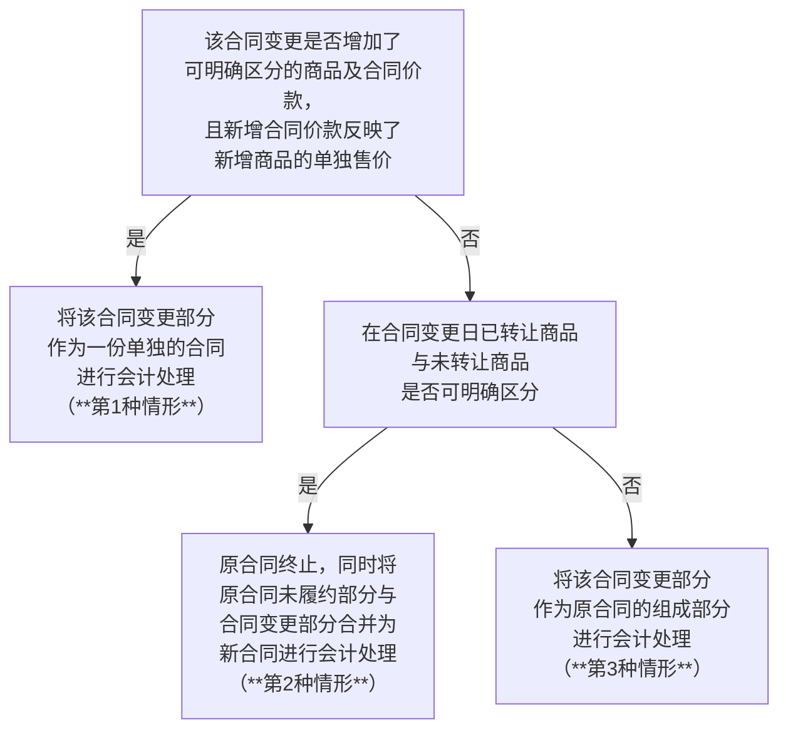
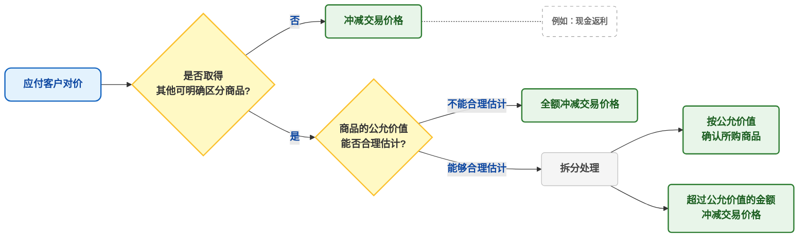
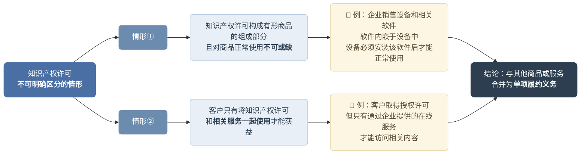
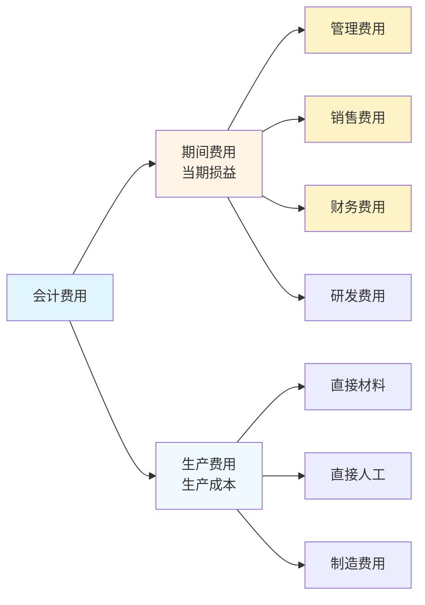

![[A1-会计笔记/附件/17-收入-1771306999536.webp]]
# 一、收入的确认和计量

企业应当在履行了合同中的履约义务，即在客户取得相关商品控制权时确认收入。
> **核心逻辑**：企业在**客户取得商品控制权**时确认收入，五步法就是把"何时确认、确认多少"这件事拆成五个环环相扣的步骤。

**识别合同 → 识别履约义务 → 确定交易价格 → 分摊交易价格 → 确认收入**
## Step 1｜识别合同
| 要点        | 说明                                           |
| :-------- | :------------------------------------------- |
| 合同成立的5个条件 | ①双方批准并承诺履行；②能识别各方权利；③能识别付款条款；④有商业实质；⑤对价很可能收回 |
| 合同合并      | 同一客户（关联方）同时/相近签订的合同，满足条件时合并为一个合同处理           |
| 合同变更      | 视情况作为单独合同、终止旧合同+新合同、或累积追赶调整                  |
### 1. 合同成立的5个条件

①双方批准并承诺履行；
②该合同明确了合同各方与所转让的商品相关的权利和义务。（合同应具有法律约束力）；
- 合同各方**均有权单方面终止完全未执行的**合同，**且无须**对合同其他方**作出补偿**的，该合同应当被视为不存在。
- 企业与客户之间签订的框架协议、战略合作协议等一般没有法律的约束力。
③能识别付款条款；
④有商业实质，即履行该合同将改变企业未来现金流量的风险、时间分布或金额。；
⑤对价很可能收回

对于不能同时满足上述收入确认的五项条件的合同，企业只有在**不再负有向客户转让商品的剩余义务**（例如，合同已完成或取消），**且已向客户收取的对价无须退回**时，才能将**已收取的对价**确认为收入；否则，应当将已收取的对价作为**负债**进行会计处理。
### 2. 合同的持续评估与存续期间

- 对于在合同开始日即**满足收入确认**条件的合同，企业在后续期间**无须对其进行重新评估**，除非有迹象表明相关事实和情况发生重大变化。
- 对于**不满足收入确认条件**的合同，企业应当在后续期间对其进行持续评估，以判断其能否满足这些条件。
- 企业如果在合同满足相关条件之前**已经向客户转移了部分商品**，当该合同在后续期间满足相关条件时，企业应当将在此之前已经转移的商品所分摊的交易价格确认为收入。
- **合同存续期间**是合同各方拥有现时可执行的具有法律约束力的权利和义务的期间。实务中，有些合同可能有固定的期间，有些合同则可能没有（如无固定期间且合同各方可随时要求终止或变更的合同、定期自动续约的合同等）。企业应当确定合同存续期间，并在该期间内按照收入准则的规定对合同进行会计处理。
- 在确定合同存续期间时，企业应考虑合同终止条款的有关约定：

| **合同终止条款的有关约定**                                   | **合同存续期间的确定**                                                          |
| ------------------------------------------------- | ---------------------------------------------------------------------- |
| ①当合同约定任何一方均可以随时无代价地终止合同时                          | 合同双方并不具有有法律约束力的权利和义务，无论该合同是否有明确约定的合同期间，该合同的存续期间都**不会超过已经提供的商品所涵盖的期间**  |
| ②当合同约定任何一方在**某一特定期间**之后才可以随时无代价地终止合同时             | 该合同的存续期间**不会超过该特定期间**                                                  |
| ③当合同约定任何一方均可以提前终止合同，但要求终止合同的一方需要向另一方支付**重大的违约金**时 | 合同存续期间**很可能与合同约定的期间一致**，这是因为该重大的违约金实质上使得合同双方在合同约定的整个期间内均具有有法律约束力的权利和义务 |
| ④当只有客户拥有无条件终止合同的权利时                               | 客户的该项权利视为客户拥有的一项**续约选择权**，重大的续约选择权应当作为单项履约义务进行会计处理。                    |

> [!example] 例题·案例分析题
> 甲公司与客户签订合同，每月为客户提供一次保洁服务，合同期限为3年。
>
> **情形一：** 3年内，**合同各方均有权**在每月末无理由要求终止合同，只需提前5个工作日通知对方，无需向对方支付任何违约金。
>
> **情形二：** 3年内，**合同各方均有权**在每月末要求提前终止合同，但如果一方在合同开始日之后的**12个月内**要求提前终止合同，必须向另一方支付**重大金额的违约金**。
>
> **情形三：** 3年内，**合同各方均有权**在每月末要求提前终止合同，但如果一方要求提前终止合同，必须向另一方支付**重大金额的违约金**。
>
> **情形四：** 3年内，**客户有权**在每月末要求提前终止合同，且无需向甲公司支付任何违约金。
>
> **问题：** 请分别判断四种情形下合同的存续期间，并说明理由。
>
> > [!check]- 答案与解析
> > 
> > **深度解析：**
> >
> > 本题的核心判断逻辑：**合同存续期间 = 合同双方存在具有法律约束力的权利和义务的期间**。关键在于终止合同是否需要支付重大违约金，以及该违约金覆盖的时间范围。
> >
> > ---
> >
> > **情形一：合同存续期间 → 逐月订立的合同**
> > - 合同双方均可在每月末**无理由、无违约金**地终止合同；
> > - 在已提供服务的期间之外，该合同对双方均**未产生**具有法律约束力的权利和义务；
> > - 因此，尽管合同约定服务期为3年，实质上应视为**逐月订立的合同**。
> >
> > ---
> >
> > **情形二：合同存续期间 → 12个月**
> > - 合同开始日之后的**12个月内**提前终止，须支付**重大违约金**；
> > - 该重大违约金使得合同在前12个月内对双方均产生具有法律约束力的权利和义务；
> > - 12个月之后，双方可无重大代价地终止合同；
> > - 因此，合同的**存续期间为12个月**。
> >
> > ---
> >
> > **情形三：合同存续期间 → 3年**
> > - 合同开始日之后**任何时点**提前终止，均须支付**重大违约金**；
> > - 该重大违约金实质上使得合同双方在**整个3年期间**内均具有法律约束力的权利和义务；
> > - 因此，合同的**存续期间为3年**。
> >
> > ---
> >
> > **情形四：合同存续期间 → 逐月订立的合同 + 判断续约选择权**
> > - 仅**客户单方**有权在每月末无违约金地终止合同；
> > - 虽然甲公司无权终止，但客户可随时无代价退出，合同对客户不具有约束力；
> > - 因此，应视为**逐月订立的合同**；
> > - 同时，客户拥有**续约选择权**，甲公司应判断该续约选择权是否构成**重大权利**，若构成则应作为**单项履约义务**进行会计处理。
> >
> > ---
> >
> > **💡 易错点提示：**
> > ① 判断合同存续期间的关键不是看合同约定的名义期限（如3年），而是看**法律约束力实际覆盖的期间**——即提前终止是否需要付出重大代价。
> > ② 情形四容易遗漏"**续约选择权是否构成重大权利**"的判断。注意：当仅客户单方享有终止权时，客户实质上持有续约选择权，需额外评估是否为单项履约义务。
> > ③ 情形二与情形三的区别在于违约金的**覆盖时间范围**不同：情形二仅覆盖前12个月，情形三覆盖整个合同期。

### 3. 合同的合并

企业与同一客户同时订立或在相近时间内先后订立的两份或多份合同，在满足下列**条件之一**时，应当合并为一份合同进行会计处理：
（1）该两份或多份合同**基于同一商业目的而订立并构成一揽子交易。**
（2）该两份或多份合同中的一份合同的对价金额取决于其他合同的定价或履行情况。
（3）该两份或多份合同中所**承诺的商品**（或每份合同中所承诺的部分商品）构成收入准则规定的**单项履约义务**。
> - 甲公司为房地产开发企业。2×22年5月10日，甲公司对外宣传其开发并销售的某商品房为精装修房，甲公司（甲方）按规定预销售该商品房，购房者（乙方）必须同时签订两份合同，一份合同是商品房预销售合同，另一份是商品房精装修合同
> - 合同约定甲公司须交付验收合格的精装修商品房，说明甲公司需要提供重大整合服务，将毛坯房和精装修服务整合成一个合同约定的**组合产出**，即**验收合格的精装修商品房**，销售毛坯房以及提供精装修服务两项承诺在合同层面不可明确区分，**构成单项履约义务**。
> - （商品房销售A+精装修服务B）承诺转让的是合同中**每一单项商品（A+B）** or承诺转让的还是由这些商品组成的**组合产出（AB组合）**
### 4.合同变更

合同变更，是指经合同各方同意对原合同范围或价格（或两者）作出的变更。企业应当区分下列**三种**情形对合同变更分别进行会计处理：

**（1）合同变更部分作为单独合同**
合同变更增加了可明确区分的商品及合同价款，且新增合同价款反映了新增商品单独售价的，应当将该合同变更作为一份单独的合同进行会计处理。此类合同变更不影响原合同的会计处理。
> 判断新增合同价款是否反映了新增商品的单独售价时，应当考虑为反映该特定合同的具体情况而**对新增商品价格所做的适当调整**。例如，在合同变更时，企业由于无须发生为发展新客户等所须发生的相关销售费用，**可能会向客户提供一定的折扣**，从而适当调整新增商品的单独售价，该调整**不影响**新增商品单独售价的判断。

**（2）合同变更作为原合同终止及新合同订立**
合同变更**不属于上述第（1）种情形**，且在合同变更日**已转让商品与未转让商品之间可明确区分**的，应当视为原合同终止，同时，将**原合同未履约部分**与**合同变更部分**合并为新合同进行会计处理。
> 加量加价，但量价不匹配
> 只加量，但未加价
> 未加量，但是调整价格

**（3）合同变更部分作为原合同的组成部分**
合同变更**不属于上述第（1）种情形**，且在合同变更日**已转让商品与未转让商品之间不可明确区分**的，应当**将该合同变更部分作为原合同的组成部分**，在合同变更日重新计算履约进度，并调整当期收入和相应成本等。


## Step 2｜识别履约义务

企业应当将下列向客户转让商品的承诺作为单项履约义务：（即单项履约义务的两种类型）
### 1. 企业向客户转让可明确区分商品的承诺（单一商品承诺）

**（1）可明确区分的条件**

企业向客户承诺的商品同时满足下列两项条件的，应当作为可明确区分的商品：
  - ①客户能够从该商品或服务本身受益，或与其他易于获得的资源一起受益（= 能单独受益）
  - ②企业向客户转让该商品或服务的承诺可与合同中其他承诺区分开来（= 在合同中可单独识别）

**（2）转让商品的承诺不可明确区分的情形**

下列情形通常表明企业向客户转让该商品的承诺与合同中的其他承诺不可明确区分：（反证）

①提供重大服务进行整合（例如：建筑公司建造办公楼）
企业需提供重大的服务以将该商品与合同中承诺的其他商品进行整合，形成合同约定的某个或某些组合产出转让给客户
> 甲公司是一家拥有相关资质的建筑工程公司。2×25年5月10日，甲公司和客户乙公司签订了一项总金额为3 000万元的固定造价合同，在乙公司自有土地上建造一幢写字楼。该合同中，甲公司向乙公司提供的单项商品包括砖头、水泥和人工等。
> 
> 砖块+水泥+人工→办公楼（组合产出）
> ①该商品本身能够明确区分（ 砖块+水泥+人工）
> ②转让该商品的承诺不可明确区分（三项承诺不可明确区分，合同承诺转让办公楼）
> 甲公司为客户建造办公楼的合同，构成单项履约义务。

②作出重大修改或定制（例如：设备销售并提供定制化安装服务）
如果某项商品将对合同中的其他商品作出重大修改或定制，实质上每一项商品将被整合在一起（即作为投入）以生产合同约定的组合产出。

③具有高度关联性
该商品与合同中承诺的其他商品具有高度关联性，是指合同中承诺的每一单项商品均受到合同中其他商品的重大影响。
合同中包含多项商品时，如果企业无法通过单独交付其中的某一单项商品而履行其合同承诺，可能表明合同中的这些商品会受到彼此的重大影响。

**（3）企业销售商品时提供的运输服务是否构成单项履约义务（销售商品+运输服务）**
①通常情况下，商品控制权转移给客户之前发生的运输活动不构成单项履约义务，只是企业为了履行合同而从事的活动；（包邮）
②商品控制权转移给客户之后发生的运输活动可能表明企业向客户提供了一项运输服务，企业应当考虑该项服务是否构成单项履约义务。（不包邮）

### 2.企业向客户转让一系列实质相同且转让模式相同的、可明确区分商品的承诺（系列商品承诺）

企业向客户转让一系列实质相同且转让模式相同的、可明确区分商品的承诺，应当作为单项履约义务。
其中，转让模式相同，是指每一项可明确区分的商品均满足收入准则规定的在某一时段内履行履约义务的条件，且采用相同方法确定其履约进度。
> （周而复始，循环往复）
> （1）代理记账公司提供代理记账服务。
> （2）保洁公司提供保洁服务。
## Step 3｜确定交易价格

- 交易价格 = 企业因转让商品而预期有权收取的对价金额（**不含代第三方收取的款项**，如增值税）
- 需要考虑的四个因素：

| 因素 | 核心思路 |
| :-- | :-- |
| **可变对价** | 期望值法 or 最可能金额法，受"限制"约束（极可能不会重大转回） |
| **重大融资成分** | 合同期限 > 1年时考虑货币时间价值；≤ 1年可免 |
| **非现金对价** | 按公允价值计量 |
| **应付客户对价** | 冲减交易价格（除非取得了可明确区分的商品/服务） |
### 1. 可变对价

**（1）可变对价最佳估计数的确定**
- 在对可变对价进行估计时，企业应当按照**期望值**或**最可能发生金额**确定可变对价的最佳估计数。 

**（2）计入交易价格的可变对价金额的限制**
- 企业按照期望值或最可能发生金额确定可变对价金额之后，计入交易价格的可变对价金额还应满足限制条件，即：包含可变对价的交易价格，应当不超过在相关不确定性消除时，累计已确认的收入极可能不会发生重大转回的金额。企业应当将满足上述限制条件的可变对价的金额，计入交易价格。
- 在相关不确定性消除时，累计已确认的收入极可能不会发生重大转回。（谨慎性要求，前期不能多计收入）
> - **可变对价=先用期望值/最可能发生金额估一把；再用‘很可能不重大转回’把能确认的部分卡住。**
> - **预计负债=只要现时义务+很可能流出+能可靠计量，就按最佳估计数确认。**

**（3）可变对价计入交易价格的限制条件不适用范围**
- 将可变对价计入交易价格的限制条件不适用于“企业向客户授予知识产权许可并约定按客户实际销售或使用情况收取特许权使用费”的情况。
 
> [!example] 例题·单选题
> 下列关于收入的确认表述中，不正确的是（　）。
> A. 对于在合同开始日即满足收入确认条件的合同，企业在后续期间无需对其进行重新评估，除非有迹象表明相关事实和情况发生重大变化
> B. 对于在合同开始日不满足收入确认条件的合同，企业应当在后续期间对其进行持续评估，以判断其能否满足收入确认条件
> C. 企业在评估其因向客户转让商品而有权取得的对价是否很可能收回时，不仅仅需要考虑客户到期时支付的能力和意图，还需要考虑市场风险
> D. 企业应当在履行了合同中的履约义务，即在客户取得相关商品控制权时确认收入
>
> > [!check]- 答案与解析
> > 
> > **正确答案：C**
> >
> > **深度解析：**
> >
> > **选项A（正确）：** 对于在合同开始日即满足收入确认**五项条件**的合同，企业在后续期间无需对其进行重新评估，除非有迹象表明相关事实和情况发生**重大变化**。这是准则的明确规定。
> >
> > **选项B（正确）：** 对于在合同开始日**不满足**收入确认条件的合同，企业应当对其进行**持续评估**，在后续满足条件时再确认收入。
> >
> > **选项C（不正确）：** 企业在评估对价是否**很可能收回**时，仅需考虑客户到期时支付对价的**能力**和**意图**，而**不需要**考虑市场风险。选项C错误地将"市场风险"纳入了评估范围。对价很可能收回的判断关注的是**客户的信用风险**，而非市场风险。
> >
> > **选项D（正确）：** 企业应当在履行了合同中的履约义务，即在客户**取得相关商品控制权**时确认收入，这是收入确认的核心原则。
> >
> > **💡 易错点提示：**
> > 注意区分"对价很可能收回"的评估范围——仅考虑客户到期时支付对价的**能力**和**意图**（即客户信用风险），**不包括**市场风险、价格风险等其他风险因素。题目通过在正确表述中"掺入"市场风险来设置陷阱。

### 2.合同中存在重大融资成分

**（1）合同中存在重大融资成分的两种情形**
当企业将商品的控制权转移给客户的时间与客户实际付款的时间不一致时，如企业以**赊销**的方式销售商品，或者要求客户支付**预付**款等，如果各方以在合同中明确约定的付款时间为客户或为企业就转让商品的交易提供了重大融资利益，则合同中包含了重大融资成分。

合同开始日，企业预计客户取得商品控制权与客户支付价款间隔不超过一年的，可以不考虑合同中存在的重大融资成分。

**（2）合同中存在重大融资成分的会计处理**
①交易价格的确定
合同中存在重大融资成分的，企业应当按照假定客户在取得商品控制权时即以现金支付的应付金额（**现销价格**）确定交易价格。
②折现率的确定
合同中存在重大融资成分的，企业在确定该重大融资成分的金额时，应使用**将合同对价的名义金额折现为商品现销价格的折现率**。
企业确定的交易价格与合同承诺的对价金额之间的差额，应当在合同期间内采用实际利率法摊销。
③会计处理

企业为客户提供重大融资利益（赊销）
```
借：长期应收款（合同对价）
　贷：主营业务收入（现销价格P）
　　　未实现融资收益（差额）
```

客户为企业提供重大融资利益（预收）
```
借：银行存款
　　未确认融资费用（差额）
　贷：合同负债（现销价格F）
```

> [!example] 例题·计算分析题
> 2×24年1月1日，甲公司与乙公司签订合同，向其销售一批产品。合同约定，该批产品将于2年之后交货。合同中包含两种可供选择的付款方式，即乙公司可以在2年后交付产品时支付 **2 247.2万元**，或者在合同签订时支付 **2 000万元**。乙公司选择在合同签订时支付货款。该批产品的控制权在交货时转移。甲公司于2×24年1月1日收到乙公司支付的货款。
> 
> 考虑到乙公司付款时间和产品交付时间之间的间隔以及现行市场利率水平，甲公司认为该合同包含**重大融资成分**，按照上述两种付款方式计算的内含利率为 **6%**。假定该融资费用不符合借款费用资本化的要求。不考虑增值税等其他因素。
>
> > [!check]- 答案与解析
> > 
> > **正确答案：**
> > 
> > **第一步：2×24年1月1日 收到货款**
> > 企业收到预付款时，应按现值确认**合同负债**，差额计入**未确认融资费用**。
> > - 借：银行存款 **2 000**
> > - 借：未确认融资费用 **247.2**（$2 247.2 - 2 000$）
> > - 贷：合同负债 **2 247.2**
> > 
> > **第二步：2×24年12月31日 确认融资成分影响**
> > 按照摊余成本和实际利率计算利息费用。
> > - 摊余成本 = $2 247.2 - 247.2 = 2 000$
> > - 利息费用 = $2 000 \times 6\% = 120$
> > - 借：财务费用 **120**
> > - 贷：未确认融资费用 **120**
> > 
> > **第三步：2×25年12月31日 交付产品并确认收入**
> > 1. 确认最后一期的利息费用：
> > - 摊余成本 = $2 000 + 120 = 2 120$
> > - 利息费用 = $2 120 \times 6\% = 127.2$
> > - 借：财务费用 **127.2**
> > - 贷：未确认融资费用 **127.2**
> > 
> > 2. 确认主营业务收入：
> > - 借：合同负债 **2 247.2**
> > - 贷：主营业务收入 **2 247.2**
> > 
> > **💡 易错点提示：**
> > 1. **方向判断**：本题属于“**先钱后货**”（预收账款性质），对企业而言相当于向客户借款，因此确认的是**财务费用**，最终确认的收入金额（$2 247.2$）会**大于**收到的现金（$2 000$）。
> > 2. **利率应用**：计算利息时，应使用合同负债的**摊余成本**（即合同负债余额减去未确认融资费用余额）。

- 相关链接：[[04-note/合同负债与预收账款的比较]]
### 3. 非现金对价

**（1）非现金对价如何确定交易价格**
企业通常应当按照非现金对价在合同开始日的**公允价值**确定交易价格。
```
（假定企业因转让商品向客户收取的对价为固定资产）
借：固定资产
　贷：主营业务收入（该固定资产在合同开始日的公允价值）
```

**（2）非现金对价公允价值变动的会计处理**
- 非现金对价的公允价值可能会因对价的形式而发生变动（例如，企业有权向客户收取的对价是股票，股票本身的价格会发生变动），该变动金额不应计入交易价格（计入**公允价值变动损益等科目**）
- 也可能会因为对价形式以外的原因而发生变动（例如，企业有权收取非现金对价的公允价值因企业的履约情况而发生变动），这种变动应当作为可变对价（确认收入），按照与计入交易价格的可变对价金额的限制条件相关的规定进行处理。
> [!example] 例题·计算分析题
> 2×24年4月1日，甲公司与乙公司签订合同，为乙公司生产一台机械设备，合同价格为**400万元**。双方同时约定，如果甲公司能够在30天内交货，则可以额外获得**1万股**乙公司股票作为奖励。
>
> 合同开始日，该股票的公允价值为**10元/股**；由于缺乏执行类似合同的经验，甲公司预计该1万股股票的公允价值计入交易价格将**不满足**累计已确认的收入极可能不会发生重大转回的限制条件。
>
> 2×24年4月28日，甲公司将该设备交付给乙公司，并收到乙公司支付的货款400万元及1万股乙公司股票。当日，乙公司股票的公允价值为**12元/股**。
>
> 甲公司将该股票分类为以公允价值计量且其变动计入当期损益的金融资产。假定甲公司该设备的控制权在交货时转移给乙公司。不考虑增值税等其他因素。
>
> > [!check]- 答案与解析
> > 
> > **会计处理与分录：**
> >
> > 借：银行存款 400
> > 　　交易性金融资产 12 $(12 \times 1)$
> > 　贷：主营业务收入 410 $(400 + 10 \times 1)$
> > 　　　公允价值变动损益 2 $[(12 - 10) \times 1]$
> >
> > **深度解析：**
> >
> > **第一步：合同开始日（4月1日）的判断**
> > 股票价格为 $10$ 元/股。由于存在“限制条件”（缺乏经验，极可能回转），甲公司**不应**将该1万股股票的公允价值 $10$ 万元（$10 \times 1$）计入交易价格。
> >
> > **第二步：交货日（4月28日）的确认**
> > 甲公司实际获得1万股股票，限制条件解除。此时股票公允价值为 $12$ 元/股。根据非现金对价的会计处理原则，需要将变动金额进行拆分：
> > 1.  **确认收入**：将股票（非现金对价）的公允价值因**对价形式以外的原因**（即达成业绩指标）而发生的变动，确认为主营业务收入。金额按合同开始日（或限制解除时确认的基础价格）计算：$10 \times 1 = 10$ 万元。
> > 2.  **确认损益**：将股票（非现金对价）的公允价值因**对价形式**（即股价波动）而发生的变动，计入公允价值变动损益。金额为：$(12 - 10) \times 1 = 2$ 万元。
> >
> > **💡 易错点提示：**
> > **非现金对价的公允价值变动界定**：注意区分是“赚来的”（业绩达成，计入收入）还是“涨出来的”（市场波动，计入公允价值变动损益）。本题中，虽然收到股票时市价是12元，但计入收入的金额应基于**合同开始日**（或限制解除前）的公允价值标准（10元），超出的部分（2元）属于金融资产持有期间的投资收益性质。
### 4.应付客户对价
**（1）应付客户对价的一般会计处理（未取得其他可明确区分商品）**
企业在向客户转让商品的同时，需要向客户或第三方支付对价的，且未取得其他可明确区分商品，应当将该应付客户对价冲减交易价格。（例如：现金返利）

**（2）应付客户对价取得其他可明确区分商品**
①可明确区分商品的公允价值能够合理估计
- 企业应付客户对价是为了自客户取得其他可明确区分商品的，并且能够从主导相关商品的使用中获益的，应当采用与企业其他采购相一致的方式，按照取得其他可明确区分商品的公允价值确认所购买的商品；
- 如果企业应付客户对价超过自客户取得的可明确区分商品公允价值的，**超过金额应当作为应付客户对价冲减交易价格**。
②可明确区分商品的公允价值不能合理估计
自客户取得的可明确区分商品公允价值不能合理估计的，企业应当将应付客户对价**全额冲减交易价格**。


**（3）应付客户对价冲减交易价格的时点**
在对应付客户对价冲减交易价格进行会计处理时，企业应当在确认相关收入与支付（或承诺支付）客户对价二者**孰晚**的时点冲减当期收入。(实际上就是在确认收入之后再冲减收入)

> [!example] 例题·案例分析题
> 甲公司是一家生产家用电器的上市公司。2×24年6月30日，甲公司基于自身宣传的需要，在向客户乙超市销售家用电器的同时，支付给乙超市 **200万元** 与销售家用电器相关的推广支出。
>
> 有明确证据表明甲公司向乙超市支付的上述推广支出是为了取得明确可区分的推广服务，并且能够主导推广服务的使用（如主导商品上架区域、堆放位置，以及展示时间、频率、方式等）。甲公司取得的上述推广服务的公允价值为 **180万元**。假定上述推广服务的相关产品已确认收入。
>
> **要求：** 判断甲公司对上述推广支出的会计处理，并编制相关会计分录。
>
> > [!check]- 答案与解析
> >
> > **深度解析：**
> > **第一步：判断交易性质（应付客户对价）。**
> > 企业向客户支付对价，如果是为了取得从客户那里购买的 **明确可区分商品或服务**，且公允价值能够可靠计量，应作为购买业务处理。
> >
> > **第二步：金额拆分与计量。**
> > 1.  **确认费用**：支付对价中与推广服务公允价值相当的部分，即 **180万元**，确认为销售费用。
> > 2.  **冲减收入**：支付对价超过推广服务公允价值的部分，即 $200 - 180 = 20$ 万元，应冲减销售收入（主营业务收入）。
> >
> > **第三步：编制会计分录。**
> > 借：销售费用 180
> > 　　主营业务收入 $(200 - 180)$ 20
> > 　贷：银行存款 200

> [!example] 例题·多选题
> 2×24年1月1日，甲公司与客户乙公司签订合同，向乙公司销售A产品。合同约定，如果乙公司当年的采购金额达到1 000万元，则甲公司向乙公司提供采购金额5%的现金返利，返利于次年年初以现金方式返还给乙公司。
> 
> 2×24年1月1日，基于乙公司近几年的采购规模及乙公司经营情况等因素，甲公司预计乙公司在2×24年度的采购额极可能达到1 000万元。2×24年第一季度末、第二季度末、第三季度末和第四季度末，乙公司当年累计实际采购额分别为400万元、600万元、900万元和1 100万元。
> 
> 2×25年1月5日，甲公司向乙公司支付银行存款55万元现金返利。不考虑相关税费及其他因素，下列关于甲公司及乙公司会计处理的表述中，正确的有（　　）。
> 
> A. 甲公司2×24年度应确认营业收入1 045万元
> B. 甲公司2×24年第二季度应确认营业收入190万元
> C. 甲公司2×25年度应冲减营业收入55万元
> D. 乙公司2×25年度应确认营业收入55万元
>
> > [!check]- 答案与解析
> > 
> > **正确答案：AB**
> >
> > **深度解析：**
> > **第一步：识别交易性质（可变对价）**
> > 本题涉及**现金返利**，属于可变对价。由于甲公司预计乙公司采购额“极可能”达到达标金额，且不涉及重大转回，因此在确认收入时应将预计返还的 5% 扣除，确认为**预计负债**（或合同负债），仅将剩余 95% 确认为收入。
> >
> > **第二步：分析选项A（甲公司全年收入）**
> > 2×24年全年累计实际采购额为 1 100 万元，超过了 1 000 万元的门槛。
> > 甲公司2×24年度应确认的营业收入 = $1\,100 \times (1 - 5\%) = 1\,045$（万元）。
> > 故 **选项A正确**。
> >
> > **第三步：分析选项B（甲公司Q2收入）**
> > 收入应按累计数倒挤或按当期发生额计算（因估计未发生变化）：
> > *   **方法一（累计倒挤法）：**
> >     *   Q1累计收入 = $400 \times (1 - 5\%) = 380$（万元）
> >     *   Q2累计收入 = $600 \times (1 - 5\%) = 570$（万元）
> >     *   Q2当季收入 = $570 - 380 = 190$（万元）
> > *   **方法二（直接计算法）：**
> >     *   Q2当季采购额 = $600 - 400 = 200$（万元）
> >     *   Q2当季收入 = $200 \times (1 - 5\%) = 190$（万元）
> >     借：应收账款                     200
> >       贷：主营业务收入               190  （200 × 95%）
> > * 预计负债——应付返利          10  （200 × 5%）
> > 故 **选项B正确**。
> >
> > **第四步：分析选项C（甲公司2×25年处理）**
> > 甲公司在2×24年确认收入时，已将 5% 的返利确认为“预计负债”（或合同负债）。2×25年实际支付55万元时，应借记“预计负债”，贷记“银行存款”，**不影响2×25年的损益（营业收入）**。
> > 故 **选项C错误**。
> >
> > **第五步：分析选项D（乙公司处理）**
> > 对于采购方乙公司，收到的现金返利应当**冲减当期销售成本**（若存货已售出）或**冲减存货成本**（若存货未售出），而不是确认营业收入。
> > 故 **选项D错误**。
> >
> > **💡 易错点提示：**
> > 1. **销售方（甲）**：实际支付返利时，是偿还之前计提的负债，千万不要重复冲减收入。
> > 2. **采购方（乙）**：收到返利是“成本的节约”，应冲减成本（主营业务成本/存货），严禁确认为收入。

> [!note]
> 如果此题条件修改为“无论乙公司采购额为多少，甲公司均向乙公司提供采购金额5%的现金返利，返利于次年初以现金方式返还乙公司”，则应付客户对价中并不包含可变金额，甲公司第一季度、第二季度、第三季度和第四季度应按400万元、200万元、300万元和200万元分别确认各季度的营业收入，并于次年初返利时冲减2×25年度营业收入55万元，即甲公司2×24年度应确认营业收入1 100万元，2×25年1月5日向乙公司支付现金返利时冲减2×25年度营业收入55万元。
## Step 4｜将交易价格分摊至各单项履约义务

1. **分摊交易价格的一般原则**
	- 按各项履约义务的**单独售价的相对比例**分摊
	- 单独售价不可直接观察时：市场调整法、成本加成法、余值法
	- 折扣/可变对价的分摊：有证据表明仅与特定义务相关时，可定向分摊
2. **交易价格的后续变动**
	（1）**合同变更**导致的交易价格后续变动
	- 对于合同变更导致的交易价格后续变动，应当按照收入准则中有关合同变更的规定进行会计处理。
	（2）**可变对价**导致的交易价格后续变动
	- 对于可变对价的后续变动额，企业应当按照收入准则的规定，将其分摊至与之相关的一项或多项履约义务，或者分摊至构成单项履约义务的一系列可明确区分商品中的一项或多项商品。
	- 对于已履行的履约义务，其分摊的可变对价后续变动额应当调整变动**当期**的收入。
	（3）**合同变更之后**发生的可变对价后续变动
	- 对于合同变更之后发生可变对价后续变动的，企业应当区分下列三种情形分别进行会计处理：
		情形1：企业应当判断可变对价后续变动与哪一项合同相关，并按照分摊可变对价的相关规定进行会计处理。
		情形2:首先将该可变对价后续变动额以原合同开始日确定的单独售价为基础进行分摊；然后再将分摊至合同变更日尚未履行履约义务的该可变对价后续变动额以新合同开始日确定的基础进行二次分摊。
		情形3:企业应当将该可变对价后续变动额分摊至合同变更日尚未履行（或部分未履行）的履约义务。

## Step 5｜履行履约义务时确认收入

| 类型         | 判断标准                                           | 确认方式                 | 备注                                                                                                     |
| :--------- | :--------------------------------------------- | :------------------- | ------------------------------------------------------------------------------------------------------ |
| **在某一时段内** | 满足三个条件之一（客户同时取得并消耗利益 / 客户能控制在建商品 / 无替代用途+有权收款） | 按**履约进度**确认（投入法/产出法） | 每一资产负债表日，企业应当对履约进度进行重新估计。（会计估计变更）<br>当履约进度不能合理确定时，企业已经发生的成本预计能够得到补偿的，应当按照已经发生的成本金额确认收入，直到履约进度能够合理确定为止。 |
| **在某一时点**  | 不满足时段条件                                        | 控制权转移时**一次性**确认      | 在判断客户是否已取得商品控制权时，企业应当考虑五个迹象(见后)                                                                        |

| 维度 | **投入法** | **产出法** |
| :-- | :-- | :-- |
| **履约进度** | 已投入 ÷ 预计总投入 | 已产出 ÷ 预计总产出 |
| **收入** | 合同总价 × 履约进度 | 合同总价 × 履约进度 |
| **成本** | 预计总成本 × 履约进度 | **实际发生成本**（全额转损益）⚠️ |
| **合同履约成本余额** | 可能有余额（实际成本 ≠ 按进度结转的成本） | 通常为零（实际成本全部结转） |

> [!example] 例题·计算分析题
> 2×25年4月10日，甲公司与乙公司签订合同，针对乙公司的实际情况和面临的具体问题，为改善其业务流程，甲公司为乙公司提供咨询服务并出具专业的咨询意见。双方约定：
> （1）在合同执行的过程中，如果因甲公司无法履约而需要由其他公司来继续提供后续咨询服务并出具咨询意见时，其他公司需要重新执行甲公司已经完成的工作。
> （2）甲公司仅需要向乙公司提交最终的咨询意见，而无须提交任何其在工作过程中编制的工作底稿和其他相关资料；
> （3）该咨询服务是专门针对乙公司的具体情况而提供的，甲公司无法将最终的咨询意见用作其他用途。
> 在整个合同期间内，如果乙公司单方面终止合同，乙公司需要向甲公司支付违约金，违约金的金额等于甲公司已发生的成本加上**30%**的成本加成率，该成本加成率与甲公司在类似合同中的成本加成率大致相同。
>
> **要求：** 判断甲公司向乙公司提供的咨询服务属于何种履约义务，并说明理由。
>
> > [!check]- 答案与解析
> > **正确答案：** 甲公司向乙公司提供的咨询服务属于**在某一时段内履行的履约义务**。
> >
> > **深度解析：**
> >
> > 判断是否属于"某一时段内履行的履约义务"，需逐一检验三个条件（满足**任一**即可），但本题的第三个条件需要与"有权收取款项"联合判断：
> >
> > **第一步：检验条件一——客户在企业履约的同时即取得并消耗经济利益？**
> > ❌ **不满足。** 如果甲公司无法履约，其他公司需要**重新执行**甲公司已完成的工作，说明乙公司并未在甲公司履约的同时即取得并消耗经济利益。
> >
> > **第二步：检验条件二——客户能够控制企业履约过程中在建的商品？**
> > ❌ **不满足。** 甲公司仅提交最终咨询意见，**无须提交工作底稿和其他相关资料**，说明乙公司无法控制甲公司履约过程中在建的商品。
> >
> > **第三步：检验条件三——商品具有不可替代用途 + 有权就已完成履约部分收取款项？**（两个子条件需**同时满足**）
> > ✅ **满足。**
> > - **不可替代用途：** 该咨询服务专门针对乙公司的具体情况，甲公司无法将最终的咨询意见用作其他用途；
> > - **有权收取款项：** 乙公司单方面终止合同时，需支付违约金 $= \text{已发生成本} \times (1 + 30\%)$，即已发生成本加上合理利润，表明甲公司在整个合同期间内有权就累计至今已完成的履约部分收取款项。
> >
> > **结论：** 条件三满足，因此该咨询服务属于**在某一时段内履行的履约义务**，甲公司应当在其提供服务的期间内按照适当的**履约进度**确认收入。
> >
> > **💡 易错点提示：**
> > 条件三包含**两个子条件**（不可替代用途 + 有权收取款项），必须**同时满足**才能判定为时段履约义务。仅满足"不可替代用途"而无法就已完成部分收取款项的，仍不能认定为时段履约义务。注意与条件一、条件二的关系是"**三选一**"，而条件三内部是"**缺一不可**"。

**在判断客户是否已取得商品控制权时，企业应当考虑下列五个迹象：**
（1）企业就该商品享有现时收款权利，即客户就该商品负有现时付款义务。

（2）企业已将该商品的法定所有权转移给客户，即客户已拥有该商品的法定所有权。
如果企业仅仅是为了确保到期收回货款而保留商品的法定所有权，那么企业所保留的这项权利通常不会对客户取得对该商品的控制权构成障碍。

（3）企业已将该商品实物转移给客户，即客户已实物占有该商品。
客户如果已经实物占有商品，则可能表明其有能力主导该商品的使用并从中获得其几乎全部的经济利益，或者使其他企业无法获得这些利益。
需要说明的是，客户占有了某项商品的实物并不意味着其就一定取得了该商品的控制权，反之亦然。

①**委托代销安排**（ 客户占有实物，但未取得商品控制权）
企业（委托方）应当评估受托方在企业向其转让商品时是否已获得对该商品的控制权，如果没有，企业不应在此时确认收入，通常应当在受托方售出商品时确认销售商品收入；受托方应当在商品销售后，按合同或协议约定的方法计算确定的手续费确认收入。 
> - 受托方获得对该商品控制权：企业应当按销售商品进行会计处理，这种安排不属于委托代销安排
> - 受托方没有获得对该商品控制权：企业通常应当在受托方售出商品时确认销售商品收入；受托方应当在商品销售后，按合同或协议约定的方法计算确定的手续费确认收入

②**售后代管商品安排**（客户取得商品控制权，但未占有实物）
在这种情况下，当客户已经取得了对该商品的控制权时，即使客户决定暂不行使实物占有的权利，其依然有能力主导该商品的使用并从中获得几乎全部的经济利益。因此，企业不再控制该商品，而只是向客户提供了代管服务。
在售后代管商品安排下，企业除了考虑客户是否取得商品控制权的迹象之外，还应当同时满足下列四项条件，才表明客户取得了该商品的控制权：
	一是，该安排必须具有商业实质，例如，该安排是应客户的要求而订立的；
	二是，属于客户的商品必须能够单独识别，例如，将属于客户的商品单独存放在指定地点；
	三是，该商品可以随时交付给客户；
	四是，企业不能自行使用该商品或将该商品提供给其他客户。
在同时满足上述条件的情况下，企业应对尚未发货的商品确认收入。同时，企业还应当考虑是否承担了其他的履约义务，如向客户提供保管服务等。若承担了其他的履约义务，则应当将部分交易价格分摊至该履约义务。

（4）企业已将该商品所有权上的主要风险和报酬转移给客户，即客户已取得该商品所有权上的主要风险和报酬。

（5）客户已接受该商品。
如果客户已经接受了企业提供的商品，例如，企业销售给客户的商品通过了客户的验收，可能表明客户已经取得了该商品的控制权。
①如果企业能够客观地确定其已经按照合同约定的标准和条件将商品的控制权转移给客户时，客户验收只是一项例行程序，则并不影响企业判断客户取得该商品控制权的时点。（标准化产品）
②如果企业无法客观地确定其向客户转让的商品是否符合合同规定的条件时，在客户验收之前，企业不能认为已经将该商品的控制权转移给了客户。（定制化产品）
③如果企业将商品发送给客户供其试用或者测评，且客户并未承诺在试用期结束前支付任何对价，则在客户接受该商品或者在试用期结束之前，该商品的控制权并未转移给客户。

---
# 二、合同成本
## （一）合同履约成本

> [!note] 合同履约成本
> “合同履约成本”科目，核算企业为履行当前或预期取得的合同所发生的、不属于存货、固定资产等会计准则规范范围且按照收入准则应当确认为一项资产的成本。
> 企业发生上述合同履约成本时，借记“合同履约成本”科目，贷记“银行存款”“应付职工薪酬”“原材料”等科目；对合同履约成本进行摊销时，借记“主营业务成本”“其他业务成本”等科目，贷记“合同履约成本”科目。
> 满足资产确认条件的合同履约成本，初始确认时摊销期限不超过一年或一个正常营业周期的，在资产负债表中列示为存货；初始确认时摊销期限在一年或一个正常营业周期以上的，在资产负债表中列示为其他非流动资产。
### 1.履行合同发生的成本——资本化

（1）企业为履行合同发生的成本，如果属于存货、固定资产、无形资产等会计准则规范范围的，应当按照相关会计准则进行会计处理；
（2）如果不属于上述会计准则规范范围且同时满足下列条件的，应当作为合同履约成本确认为一项**资产**：
	①该成本与一份当前或预期取得的合同直接相关。
	②该成本增加了企业未来用于履行（包括持续履行）履约义务的资源。
	③该成本预期能够收回。
与合同直接相关的成本，包括直接人工、直接材料、制造费用（或类似费用）、明确由客户承担的成本以及仅因该合同而发生的其他成本。
> [!example] 例题·案例分析题
> 2×24年5月10日，甲公司与乙公司签订合同，向乙公司信息中心提供管理服务，合同期限为**5年**。在向乙公司提供服务之前，甲公司设计并搭建了一个信息技术平台供其内部使用，该信息技术平台由相关的硬件和软件组成。甲公司需要提供设计方案，将该信息技术平台与乙公司现有的信息系统对接，并进行相关测试。该信息技术平台并不会转让给乙公司，但是将用于向乙公司提供服务。甲公司为该平台的设计、购买硬件和软件以及信息中心的测试发生了成本。甲公司预期上述成本均可通过未来提供服务收取的对价收回。
>
> **问题：** 甲公司为履行合同发生的上述各项成本应如何进行会计处理？
>
> > [!check]- 答案与解析
> >
> > **第一步：识别成本类型并判断是否属于其他准则规范范围**
> > 甲公司发生的成本包括三类：①购买硬件成本；②购买软件成本；③设计服务成本和信息中心测试成本。首先应判断各项成本是否属于其他会计准则（如固定资产、无形资产等）的规范范围。
> >
> > **第二步：对属于其他准则范围的成本按相应准则处理**
> > - **购买硬件的成本** → 符合固定资产的定义和确认条件，应按照 **《企业会计准则第4号——固定资产》** 进行会计处理；
> > - **购买软件的成本** → 符合无形资产的定义和确认条件，应按照 **《企业会计准则第6号——无形资产》** 进行会计处理。
> >
> > **第三步：对不属于其他准则范围的成本，判断是否确认为合同履约成本**
> > **设计服务成本**和**信息中心的测试成本**不属于其他会计准则的规范范围，需按照收入准则中"合同履约成本"的**三个确认条件**逐一判断：
> > 1. ✅ **与合同直接相关**——该成本直接为履行与乙公司的管理服务合同而发生；
> > 2. ✅ **增加了企业未来用于履行履约义务的资源**——搭建的平台将持续用于向乙公司提供管理服务；
> > 3. ✅ **预期能够收回**——甲公司预期上述成本可通过未来提供服务收取的对价收回。
> >
> > 三个条件同时满足，因此甲公司应将设计服务成本和信息中心的测试成本确认为一项资产，即 **"合同履约成本"**。
> >
> > **💡 易错点提示：**
> > ①注意区分**合同履约成本**与**合同取得成本**：合同履约成本是为"履行"合同而发生的成本，合同取得成本是为"取得"合同而发生的增量成本（如销售佣金）。本题属于前者。
> > ②信息技术平台**未转让**给乙公司，不构成单独的履约义务，但平台相关的硬件和软件仍需优先按各自对应的会计准则（固定资产/无形资产）处理，**只有不属于其他准则规范范围的成本**才考虑确认为合同履约成本。

### 2.履行合同发生的成本——费用化
企业应当在下列支出发生时，将其计入当期损益：
①管理费用，除非这些费用明确由客户承担。
②非正常消耗的直接材料、直接人工和制造费用（或类似费用），这些支出为履行合同发生，但未反映在合同价格中。
③与履约义务中已履行部分相关的支出，即该支出与企业过去的履约活动相关。
	例如，对于企业在某一时段内履行的履约义务，在采用产出法计量履约进度时，如果企业为履行该履约义务实际发生的成本超过了按照产出法确定的成本，这些成本是与过去已履行的履约情况相关的支出，因此，不会增加企业未来用于履行（包括持续履行）履约义务的资源，不应当作为资产确认。（2025年教材新增内容）
④无法在尚未履行的与已履行（或已部分履行）的履约义务之间区分的相关支出
> [!example] 例题·多选题
> 2×24年1月1日，甲公司与客户乙公司签订合同，为其建造一栋办公楼，建造期为1.5年，合同总价款为**5000万元**，预计总成本为**4500万元**。假定该合同仅包含一项履约义务，并属于在某一时段内履行的履约义务。甲公司采用**产出法**确定履约进度。2×24年12月31日，甲公司已经完成地基建设，通过合理方法确定采用产出法下的履约进度为**32%**，实际发生的成本为**1500万元**，且仅与已完成的地基建设相关。不考虑相关税费及其他因素，下列各项关于甲公司2×24年度建造办公楼会计处理的表述中，正确的有（    ）。
> A. 按照履约进度确认营业收入1600万元
> B. 按照履约进度确认营业成本1440万元
> C. 实际发生的成本1500万元全部计入2×24年度当期损益
> D. "合同履约成本"科目余额60万元在2×24年12月31日资产负债表中应列报为"存货"项目
>
> > [!check]- 答案与解析
> > 
> > **正确答案：AC**
> >
> > **深度解析：**
> >
> > **第一步：确认营业收入（选项A ✅）**
> > 采用产出法，履约进度为 **32%**，因此：
> > $$收入 = 5000 \times 32\% = 1600 \text{（万元）}$$
> > 选项A正确。
> >
> > **第二步：确认营业成本（选项B ❌、选项C ✅）**
> > 关键点：甲公司采用的是**产出法**而非投入法。在产出法下，履约进度与实际发生的成本之间可能不匹配。按照准则规定，当已发生的成本**仅与已完成的履约活动相关**（即不存在未安装材料等特殊情况）时，应将**实际发生的成本全部确认为当期营业成本**。
> > $$营业成本 = 实际发生成本 = 1500 \text{（万元）}$$
> > 而非 $4500 \times 32\% = 1440$（万元）。因此选项B错误，选项C正确。
> >
> > **第三步：合同履约成本科目余额（选项D ❌）**
> > 由于实际发生的成本 **1500万元** 已**全部**结转为当期营业成本，因此：
> > $$合同履约成本科目余额 = 1500 - 1500 = 0 \text{（万元）}$$
> > 不存在60万元的余额，选项D错误。
> >
> > **💡 易错点提示：**
> > ① **产出法 vs 投入法的成本确认差异**：投入法下，营业成本 = 预计总成本 × 履约进度（即 $4500 \times 32\% = 1440$ 万元），多出的 $1500 - 1440 = 60$ 万元留在"合同履约成本"科目中。但**产出法**下，已发生的成本仅与已完成的履约活动相关时，应将实际发生成本**全额**确认为当期损益，不存在科目余额。
> > ② 本题最大陷阱在于：很多考生习惯性地用"预计总成本 × 履约进度"计算营业成本，忽略了**产出法下成本确认的特殊规则**。

### 3.运输费用的确认

（1）对于与履行客户合同无关的运输费用，若运输费用属于使存货达到目前场所和状态的必要支出，形成了预期会给企业带来经济利益的资源时，运输费用应当计入存货成本，否则应计入期间费用（如企业将生产的产品从产成品仓库运送至本企业各销售网点）。

（2）对于为履行客户合同而发生的运输费用，属于收入准则规范的合同履约成本。
①若运输活动发生在商品的控制权转移之前，其通常不构成单项履约义务，企业应将相关支出作为与商品销售相关的成本计入**合同履约成本**，最终在商品的控制权转移时计入**营业成本**。
②若运输活动发生在商品控制权转移之后，其通常构成单项履约义务，企业应将相关支出作为与运输活动相关的成本计入**合同履约成本**，在确认运输服务收入（如其他业务收入）的同时，将相关支出计入运输服务成本（如**其他业务成本**）。

> [!note] 合同结算/合同资产与合同负债
> 对于同一合同下属于在某一时段内履行的履约义务涉及与客户结算对价的，通常情况下：
> （1）企业对其已向客户转让商品而有权收取的对价金额应当确认为**合同资产**或应收账款；
> （2）对于其已收或应收客户对价而应向客户转让商品的义务，应当按照已收或应收的金额确认**合同负债**。
> 	但是，由于同一合同下的合同资产和合同负债在资产负债表中应当以净额列示，企业也可以设置“**合同结算**”科目，以核算同一合同下属于在某一时段内履行履约义务涉及与客户结算对价的合同资产或合同负债，并在此科目下设置“合同结算——价款结算”科目（相当于“合同负债”科目）反映定期与客户进行价款结算的金额；设置“合同结算——收入结转”科目（相当于“合同资产”科目）反映按履约进度结转的收入金额。
> 	
> 借：合同结算——收入结转
>   贷：主营业务收入
> 借：银行存款
>   贷：合同结算——价款结算
>   
> 资产负债表日，“合同结算”科目的期末余额在借方的，根据其流动性，在资产负债表中分别列示为“合同资产”或“其他非流动资产”项目；期末余额在贷方的，根据其流动性，在资产负债表中分别列示为“合同负债”或“其他非流动负债”项目。

> [!example]
> 甲建筑公司与其客户签订一项总金额为**580万元**的固定造价合同，该合同不可撤销。甲公司负责工程的施工及全面管理，客户按照第三方工程监理公司确认的工程完工量，每年与甲公司结算一次；该工程已于2×18年2月开工，预计2×21年6月完工；预计可能发生的工程总成本为550万元。到2×19年底，由于材料价格上涨等因素，甲公司将预计工程总成本调整为600万元。2×20年末根据工程最新情况将预计工程总成本调整为610万元。
> 假定该建造工程整体构成单项履约义务，并属于在某一时段内履行的履约义务，甲公司采用成本法确定履约进度，不考虑其他相关因素。甲公司各年已与客户结算但尚未履行的该部分履约义务预计在下一会计年度内完成。甲公司单独设置“合同结算”科目对工程项目进行核算，不设置“合同资产”和“合同负债”科目。
> 该合同的其他有关资料如下所示。
> 
> | 项目 | 2×18年 | 2×19年 | 2×20年 | 2×21年 | 2×22年 |
> | --- | --- | --- | --- | --- | --- |
> | 年末累计实际发生成本 | 154 | 300 | 488 | 610 | - |
> | 年末预计完成合同尚需发生成本 | 396 | 300 | 122 | - | - |
> | 本期结算合同价款 | 174 | 196 | 180 | 30* | - |
> | 本期实际收到价款 | 170 | 190 | 190 | - | 30 |
> 注：*工程质保金30万元。按照合同约定，工程质保金30万元需等到客户于2×22年底质保期结束且未发生重大质量问题方能收款。上述价款均为不含税价款，不考虑相关税费的影响。
> 
> > [!check]- 解析
> > 甲公司的账务处理如下（金额单位以万元表示）：
> > （1）2×18年
> > ①实际发生合同成本。
> > ```
> > 借：合同履约成本　　　　　　　　　154
> > 　贷：原材料、应付职工薪酬等　　　  154
> > ```
> > ②确认计量当年的收入并结转成本。
> > 履约进度=154÷（154+396）×100%=28%
> > 合同收入=580×28%=162.4（万元）
> > ```
> > 借：合同结算——收入结转　　　　162.4
> > 　贷：主营业务收入　　　　　　　　162.4
> > 借：主营业务成本　　　　　　　　　154
> > 　贷：合同履约成本　　　　　　　　　154
> > ```
> > ③结算合同价款（定期与客户进行价款结算的金额）。
> > ```
> > 借：应收账款　　　　　　　　　　　174
> > 　贷：合同结算——价款结算　　　　  174
> > ```
> > ④实际收到合同价款。
> > ```
> > 借：银行存款　　　　　　　　　　　170
> > 　贷：应收账款　　　　　　　    　　170
> > ```
> > 2×18年12月31日，“合同结算”科目的余额为贷方11.6万元（174-162.4），表明甲公司已经与客户结算但尚未履行履约义务的金额为11.6万元，由于甲公司预计该部分履约义务将在2×19年内完成，因此，应在资产负债表中作为合同负债列示。
> > 
> > （2）2×19年的账务处理：
> > ①实际发生合同成本。
> > ```
> > 借：合同履约成本　　　　　　　　  146
> > 　贷：原材料、应付职工薪酬等　　　　146
> > ```
> > ②确认计量当年的收入并结转成本，同时，确认合同预计损失。
> > 履约进度=300÷600×100%=50%
> > 合同收入=580×50%-162.4=127.6（万元）
> > **合同预计损失=（600-580）×（1-50%）=10（万元）**
> > ```
> > 借：合同结算——收入结转　　　　127.6
> > 　贷：主营业务收入　　　　　　　  127.6
> > 借：主营业务成本　　　　　　　　  146
> > 　贷：合同履约成本　　　　　　　　　146
> > 借：主营业务成本　　　　　　　　   10
> > 　贷：预计负债　　　　　　　　　　   10
> > ```
> > 在2×19年底，由于该合同预计总成本（600万元）大于合同总收入（580万元），预计发生损失总额为20万元，由于**其中10万元（20×50%）已经反映在损益中**，因此应将**剩余的、未完成工程将发生的预计损失10万元确认为当期损失**。
> > 根据或有事项准则的相关规定，待执行合同变成亏损合同的，该亏损合同产生的义务满足相关条件的，应当对亏损合同确认预计负债。因此，未完成工程将发生的预计损失10万元应当确认为预计负债。除已经通过收入、成本确认的部分外，剩余的、未完成工程将发生的预计损失确认为主营业务成本，同时贷记“预计负债”科目；转回预计损失作相反的会计分录。
> > ③结算合同价款。
> > ```
> > 借：应收账款　　　　　　　　　　　196
> > 　贷：合同结算——价款结算　　　    196
> > ```
> > ④实际收到合同价款。
> > ```
> > 借：银行存款　　　　　　　　　　　190
> > 　贷：应收账款　　　　　　　　　　  190
> > ```
> > 2×19年12月31日，“合同结算”科目的余额为贷方80万元（11.6+196-127.6）。表明甲公司已经与客户结算但尚未履行履约义务的金额为80万元，由于甲公司预计该部分履约义务将在2×20年内完成，因此，应在资产负债表中作为合同负债列示。
> > （3）2×20年的账务处理：
> > ①实际发生的合同成本。
> > ```
> > 借：合同履约成本　　　　　　　　　188
> > 　贷：原材料、应付职工薪酬等　　　　188
> > ```
> > ②确认计量当年的合同收入并结转成本，同时调整合同预计损失。
> > 履约进度=488÷（488+122）×100%=80%
> > 合同收入=580×80%-162.4-127.6=174（万元）
> > 合同预计损失=（488+122-580）×（1-80%）-10=-4（万元）
> > ```
> > 借：合同结算——收入结转　　　　　174
> > 　贷：主营业务收入　　　　　　　    174
> > 借：主营业务成本　　　　　　　　　188
> > 　贷：合同履约成本　　　　　　　　  188
> > 借：预计负债　　　　　　　　　　　　4
> > 　贷：主营业务成本　　　　　　　　　  4
> > ```
> > 在2×20年底，由于该合同预计总成本（610万元）大于合同总收入（580万元），预计发生损失总额为30万元，由于其中24万元（30×80%）已经反映在损益中，因此预计负债的余额为6万元（30-24），反映剩余的、未完成工程将发生的预计损失，因此，本期应转回合同预计损失4万元。
> > ③结算合同价款。
> > ```
> > 借：应收账款　　　　　　　　　　　 180
> > 　贷：合同结算——价款结算　　　　　  180
> > ```
> > ④实际收到合同价款。
> > ```
> > 借：银行存款　　　　　　　　　　　 190
> > 　贷：应收账款　　　　　　　　　　　  190
> > ```
> > 2×20年12月31日，“合同结算”科目的余额为贷方86万元（80+180-174），表明甲公司已经与客户结算但尚未履行履约义务的金额为86万元，由于该部分履约义务将在2×21年6月底前完成，因此，应在资产负债表中作为合同负债列示。
> > 
> > （4）2×21年1-6月的账务处理：
> > ①实际发生合同成本。
> > ```
> > 借：合同履约成本　　　　　　　　　122
> > 　贷：原材料、应付职工薪酬等　　　　122
> > ```
> > ②确认计量当期的合同收入并结转成本及已计提的合同损失。
> > 2×21年1-6月确认的合同收入=合同总金额-截至目前累计已确认的收入=580-162.4-127.6-174=116（万元）
> > ```
> > 借：合同结算——收入结转　　　　  116
> > 　贷：主营业务收入　　　　　　　　　116
> > 借：主营业务成本　　　　　　　　　122
> > 　贷：合同履约成本　　　　　　　  　122
> > 借：预计负债　　　　　　　　　　　  6
> > 　贷：主营业务成本　　　　　　　    　6
> > ```
> > 2×21年6月30日，“合同结算”科目的余额为借方30万元（86-116），是工程质保金，需等到客户于2×22年底质保期结束且未发生重大质量问题后方能收款，应在资产负债表中作为其他非流动资产列示。
> > 
> > （5）2×22年的账务处理：
> > ①质保期结束且未发生重大质量问题。
> > ```
> > 借：应收账款　　　　　　　　　　　 30
> > 　贷：合同结算　　　　　　　　　 　　30
> > ```
> > ②实际收到合同价款。
> > ```
> > 借：银行存款　　　　　　　　　　　 30
> > 　贷：应收账款　　　　　　　　   　　30
> > ```
> > 
> > 
> 

## （二）合同取得成本
### 1.取得合同发生的成本——资本化

- 企业为取得合同发生的**增量成本**预期能够收回的，应当作为合同取得成本确认为一项资产。
	- 增量成本，是指企业不取得合同就不会发生的成本，例如销售佣金等。
	- 增量成本+预期能够收回→确认为一项资产（合同取得成本）
- 为简化实务操作，该资产摊销期限不超过一年的，可以在发生时计入**当期损益**。
- 企业因现有合同续约或发生合同变更需要支付的额外佣金，也属于为取得合同发生的增量成本。
### 2.取得合同发生的成本——费用化

企业为取得合同发生的、除预期能够收回的增量成本之外的其他支出，例如，无论是否取得合同均会发生的差旅费、投标费、为准备投标资料发生的相关费用等，应当在发生时计入**当期损益**，除非这些支出明确由客户承担。
> [!example] 例题·多选题
> 甲公司为了拓展业务，取得客户订单发生的下列支出中，**不属于**为取得合同而发生的增量成本的有（    ）。
> 
> A. 根据订立合同金额的5%向代理商支付的代理费
> 
> B. 为参与客户招标而准备招标资料发生的支出
> 
> C. 投标过程中聘请外部律师发生的支出
> 
> D. 根据年度订单数量及个人综合表现考评确定的销售人员年度奖金
>
> > [!check]- 答案与解析
> > 
> > **正确答案：BCD**
> >
> > **深度解析：**
> > 
> > **核心概念：** 增量成本是指企业**不取得合同就不会发生**的成本。判断标准是"**如果不签合同，这笔钱会不会花？**"
> > 
> > **逐项分析：**
> > 
> > **选项A（属于增量成本）：** 代理费按**合同金额的5%**支付，具有明确的对应关系。如果合同不成立，就无需支付该笔费用，符合增量成本定义。
> > 
> > **选项B（不属于）：** 准备招标资料的支出发生在**合同取得之前**，无论最终是否中标都会发生，属于**沉没成本**而非增量成本。
> > 
> > **选项C（不属于）：** 聘请律师费用同样发生在**投标阶段**，不以最终是否取得合同为前提，属于竞标过程中的**必要支出**，不符合增量成本特征。
> > 
> > **选项D（不属于）：** 销售人员年度奖金基于**年度订单数量及综合表现**，与单个具体合同不存在直接因果关系，属于**期间费用**性质的人工成本。
> > 
> > **判断公式：**
> > $$\text{增量成本} = \text{取得合同后发生的成本} - \text{不取得合同时发生的成本} > 0$$
> >
> > **💡 易错点提示：**
> > 容易误将**所有与合同相关的支出**都认定为增量成本。关键要区分：
> > - ✅ **事后支付、直接挂钩**：如按合同金额比例的佣金
> > - ❌ **事前发生、不确定性**：如投标费用、准备资料费用
> > - ❌ **综合性奖励**：如基于整体业绩的年度奖金

## （三）合同成本的后续计量（摊销和减值）

 1. 摊销
- 对于确认为资产的合同履约成本和合同取得成本，企业应当采用与该资产相关的商品收入确认相同的基础（即，在履约义务履行的时点或按照履约义务的履约进度）进行摊销，计入当期损益。（**合同履约成本摊销计入营业成本；合同取得成本摊销计入销售费用等**）
- 企业应当根据预期向客户转让与上述资产相关的商品的时间，对资产的摊销情况进行复核并更新，以反映该预期时间的重大变化。此类变化应当作为**会计估计变更**进行会计处理。

 2. 减值
	（1）资产减值准备的计提
	合同履约成本和合同取得成本的账面价值高于下列第①项减去第②项的差额（可变现净值）的，超出部分应当计提减值准备，并确认为资产减值损失：
	①企业因转让与该资产相关的商品预期能够取得的剩余对价；
	②为转让该相关商品估计将要发生的成本。
	计提减值准备的金额=合同成本的账面价值-（预期能够取得的剩余对价-估计将要发生的成本）

```
借：资产减值损失
　贷：合同履约成本减值准备
　　　合同取得成本减值准备
```
　　　
（2）资产减值准备的转回
以前期间减值的因素之后发生变化，使得上述①减②的差额高于该资产账面价值的，应当转回原已计提的资产减值准备，并计入当期损益，但转回后的资产账面价值不应超过假定不计提减值准备情况下该资产在转回日的账面价值。

```
借：合同履约成本减值准备
　　合同取得成本减值准备
　贷：资产减值损失
```
# 三、特定交易的会计处理
## （一）附有销售退回条款的销售

附有销售退回条款的销售，是指客户依照有关合同有权退货的销售方式。
客户在取得商品控制权之前退回该商品不属于销售退回。
### 1.一般业务的会计处理

**（1）确认收入**
对于附有销售退回条款的销售，企业应当在客户取得相关商品控制权时，按照因向客户转让商品而预期有权收取的对价金额（即，不包含预期因销售退回将退还的金额）确认收入，按照预期因销售退回将退还的金额确认负债（预计负债——应付退货款）。

```
借：银行存款/应收账款
　贷：主营业务收入（预期有权收取的对价金额）
　　　预计负债——应付退货款（预期因销售退回将退还的金额）
　　　应交税费——应交增值税（销项税额）
```

企业应当遵循可变对价的处理原则来确定其预期有权收取的对价金额，即交易价格不应包含预期将会被退回的商品的对价金额。

**（2）结转成本**
按照预期将退回商品转让时的账面价值，扣除收回该商品预计发生的成本（包括退回商品的价值减损）后的余额，确认一项资产（应收退货成本），按照所转让商品在转让时的账面价值，扣除上述资产成本的净额结转成本。

```
借：应收退货成本（预期将退回商品转让时的账面价值-收回该商品预计发生的成本）
　　主营业务成本（差额）
　贷：库存商品（已转让商品转让时的账面价值）
```

应收退货成本=预期将退回商品转让时的账面价值-收回该商品预计发生的成本（包括退回商品的价值减损）

**（3）资产负债表日重新估计未来销售退回情况**
每一资产负债表日，企业应当重新估计未来销售退回情况，并对上述资产（应收退货成本）和负债（预计负债）进行重新计量。如有变化，应当作为**会计估计变更**进行会计处理。
客户以一项商品换取类型、质量、状况及价格均相同的另一项商品，不应被视为退货。此外，如果合同约定客户可以将质量有瑕疵的商品退回以换取正常的商品，企业应当按照附有质量保证条款的销售进行会计处理。

> [!example] 例题·会计分录题
> 甲公司是一家健身器材销售公司。2×24年11月1日，甲公司向乙公司销售5 000件健身器材，单位销售价格为500元，单位成本为400元，开出的增值税专用发票上注明的销售价格为250万元，增值税为32.5万元。健身器材已经发出，但款项尚未收到。根据协议约定，乙公司应于2×24年12月31日之前支付货款。在2×25年3月31日之前有权退还健身器材。甲公司根据过去的经验，估计该批健身器材的退货率约为20%。2×24年12月31日，甲公司对退货率进行了重新评估，认为只有10%的健身器材会被退回。
> 
> 甲公司为增值税一般纳税人，健身器材发出时纳税义务已经发生，实际发生退回时取得税务机关开具的红字增值税专用发票。假定健身器材发出时控制权转移给乙公司。
> 
> **要求：编制甲公司相关业务的账务处理。**
>
> > [!check]- 答案与解析
> > 
> > **（1）2×24年11月1日发出健身器材时：**
> > 
> > **业务分析：**
> > - 总销售数量：**5 000件**
> > - 预计退货率：**20%**
> > - 预计退货数量：$5\,000 \times 20\% = 1\,000$件
> > - 预计实际销售数量：$5\,000 - 1\,000 = 4\,000$件
> > 
> > **会计处理：**
> > ```
> > 借：应收账款　　　　　　　　　　　　　　2 825 000
> > 　贷：主营业务收入 (4 000件×500)　　　　2 000 000
> > 　　　预计负债——应付退货款 (1 000件×500) 500 000
> > 　　　应交税费——应交增值税（销项税额）　 325 000
> > 
> > 借：主营业务成本 (4 000件×400)　　　　1 600 000
> > 　　应收退货成本 (1 000件×400)　　　　　 400 000
> > 　贷：库存商品　　　　　　　　　　　　　2 000 000
> > ```
> > 
> > 
> > **（2）2×24年12月31日前收到货款时：**
> > 
> > ```
> > 借：银行存款　　　　　　　　2 825 000
> > 　贷：应收账款　　　　　　　　2 825 000
> > ```
> > 
> > ---
> > 
> > **（3）2×24年12月31日，重新评估退货率：**
> > 
> > **业务分析：**
> > - 原预计退货率：**20%**（1 000件）
> > - 新预计退货率：**10%**（500件）
> > - 退货率下降，需转回**500件**对应的预计负债
> > 
> > **会计处理：**
> > ```
> > 借：预计负债——应付退货款 (500件×500)　　250 000
> > 　贷：主营业务收入　　　　　　　　　　　　　250 000
> > 
> > 借：主营业务成本　　　　　　　　　　　　　200 000
> > 　贷：应收退货成本 (500件×400)　　　　　　200 000
> > ```
> > 
> > **逻辑说明：**预计退货减少 → 实际销售增加 → 确认更多收入和成本
> > 
> > ---
> > 
> > **（4）2×25年3月31日发生实际退货（400件）：**
> > 
> > **业务分析：**
> > - 当前预计负债余额：$500\,000 - 250\,000 = 250\,000$元（对应**500件**）
> > - 实际退货：**400件**
> > - 差额：$500 - 400 = 100$件（需转为正式销售）
> > 
> > **① 处理实际退回的400件：**
> > ```
> > 借：预计负债——应付退货款 (400件×500)　　　　200 000
> > 　　应交税费——应交增值税（销项税额）　　　　 26 000
> > 　贷：银行存款　　　　　　　　　　　　　　　　　226 000
> > 
> > 借：库存商品 (400件×400)　　　　　　　　　　160 000
> > 　贷：应收退货成本　　　　　　　　　　　　　　160 000
> > ```
> > 
> > **关键计算：**
> > - 退款金额 = $400 \times 500 = 200\,000$元
> > - 红字增值税 = $400 \times 500 \times 13\% = 26\,000$元
> > - 退回商品成本 = $400 \times 400 = 160\,000$元
> > 
> > **② 处理未退回的100件（转为正式销售）：**
> > ```
> > 借：预计负债——应付退货款 (100件×500)　　50 000
> > 　贷：主营业务收入　　　　　　　　　　　　　50 000
> > 
> > 借：主营业务成本 (100件×400)　　　　　　40 000
> > 　贷：应收退货成本　　　　　　　　　　　　40 000
> > ```
> > 
> > ---
> > 
> > **💡 易错点提示：**
> > 1. **预计负债的动态调整**：退货率变化时需及时调整预计负债，不能等到实际退货时才处理
> > 2. **增值税处理时点**：发出商品时全额确认销项税额（因纳税义务已发生），实际退货时冲减销项税额
> > 3. **应收退货成本科目**：这是一个**资产类科目**，用于核算预计退货商品的成本，最终需全部结转（转回库存商品或转入主营业务成本）
> > 4. **收入确认金额**：初始确认收入 = 总销售额 × (1 - 预计退货率)，而非全部销售额

### 2.涉及企业向客户收取退货费的会计处理

附有销售退回条款的销售，在客户要求退货时，如果企业有权向客户收取一定金额的退货费，则企业在估计预期有权收取的对价金额时，应当将该退货费包括在内。

```
借：银行存款/应收账款 
　贷：主营业务收入[预期有权收取的对价金额（含收取的退货费）]
　　　预计负债——应付退货款（预期因销售退回将退还的金额-收取的退货费）
　　　应交税费——应交增值税（销项税额）
借：应收退货成本（预期将退回商品在转让时的账面价值-收回该商品预计发生的成本）
　　主营业务成本（差额）
　贷：库存商品（已转让商品在转让时的账面价值）
```

①企业有权向客户收取的退货费，计入主营业务收入；
②退回商品预计发生的成本（包括退回商品的价值减损），计入主营业务成本。

## （二）附有质量保证条款的销售

| 维度             | **保证类质量保证**                 | **服务类质量保证**                     |
| :------------- | :-------------------------- | :------------------------------ |
| **本质**         | 产品本身"合格"的承诺                 | 在合格之外额外提供的一项**服务**              |
| **是否构成单项履约义务** | ❌ 不构成                       | ✅ 构成                            |
| **会计处理**       | 按**或有事项准则**计提预计负债（产品质量保证费用） | 将交易价格**分摊**一部分至该履约义务，在服务期间内确认收入 |
| **常见形态**       | 法定"三包"、行业惯例保修               | 可单独购买的延保服务、额外保修计划               |

### 1.如何区分？——三步判断法

Step 1：是否法定或行业惯例要求？
如果质量保证是**法律法规要求**或**行业惯例**（如家电"三包"），通常属于**保证类**——它只是向客户保证"商品符合既定规格"，不是额外服务。

Step 2：客户能否单独购买？
- 客户**可以选择单独购买**该质量保证（如额外付费延保） → **服务类**
- 客户**无法单独购买**，质量保证捆绑在商品中 → 倾向**保证类**

 Step 3：质量保证是否提供了"合格之上"的额外服务？

| 判断要素 | 保证类 | 服务类 |
| :-- | :-- | :-- |
| 覆盖范围 | 仅保证产品在交付时**符合约定规格** | 在符合规格之外提供**额外保障** |
| 保修期长度 | 与法定/行业标准一致或相近 | 明显**超出**法定/行业标准期限 |
| 保修内容 | 修复产品缺陷 | 包含定期维护、上门检测等**增值服务** |

> 💡 **口诀**：法定的、行业惯例的、只保"合格"的 → 保证类；可单独买的、超期的、有增值内容的 → 服务类。

企业提供的质量保证同时包含构成单项履约义务的质量保证和不构成单项履约义务的质量保证的，应当分别对其进行会计处理；无法合理区分的，应当将这两类质量保证一起作为单项履约义务按照收入准则进行会计处理。
### 2.保证类质量保证（不单独确认收入）

```
# 销售时——全额确认收入，同时计提预计负债

借：银行存款/应收账款
　贷：主营业务收入（全额）
　　　应交税费——应交增值税（销项税额）

借：主营业务成本
　贷：预计负债——产品质量保证
```

> 后续实际发生维修支出时，冲减预计负债。
### 3.服务类质量保证（单独确认收入）

```
# 销售时——将交易价格在商品和延保服务之间分摊
借：银行存款/应收账款
　贷：主营业务收入（分摊至商品的部分）
　　　合同负债（分摊至延保服务的部分）
　　　应交税费——应交增值税（销项税额）

# 延保服务期间内——按履约进度逐步确认收入
借：合同负债
　贷：主营业务收入/其他业务收入
```

## （三）主要责任人和代理人

当企业向客户销售商品涉及其他方参与其中时，企业应当确定其自身在该交易中的身份是主要责任人还是代理人。
- 主要责任人：应当按照已收或应收对价总额确认收入（总额法）
- 代理人：应当按照预期有权收取的佣金或手续费的金额确认收入（净额法）
### 1.企业作为主要责任人的情形

当存在第三方参与企业向客户提供商品时，企业在将特定商品转让给客户之前**控制**该商品的，应当作为主要责任人。

企业作为主要责任人的情形包括：
（1）企业自该第三方取得商品或其他资产控制权后，再转让给客户。
> 2×24年1月，甲旅行社从A航空公司购买了一定数量的折扣机票，并对外销售。甲旅行社向旅客销售机票时，可自行决定机票的价格等，未售出的机票不能退还给A航空公司。

（2）企业能够**主导第三方**代表本企业向客户提供服务。
当企业承诺向客户提供服务，并委托第三方（例如分包商、其他服务提供商等）代表企业向客户提供服务时，如果企业能够主导该第三方代表本企业向客户提供服务，则表明企业在相关服务提供给客户之前能够控制该相关服务。

（3）企业自第三方取得商品控制权后，通过提供重大的服务将该商品与其他商品整合成合同约定的某组合产出转让给客户。

> [!example] 例题·多选题
> 下列各项交易或事项中，甲公司的身份是主要责任人的有（　　）。
> A. 甲公司在其经营的购物网站上销售由丙公司生产、定价、发货及提供售后服务的商品
> B. 甲公司从航空公司购买机票并自行定价向旅客出售，未售出的机票不能退还
> C. 甲公司委托乙公司按其约定的价格销售商品，乙公司未售出商品将退还给甲公司
> D. 为履行与戊公司签署的安保服务协议，甲公司委托丁公司代表其向戊公司提供安保服务且提供的服务内容均需甲公司同意
>
> > [!check]- 答案与解析
> > 
> > **正确答案：BCD**
> >
> > **深度解析：**
> > 判断主要责任人 vs 代理人的核心标准：企业在将商品或服务转让给客户**之前**，是否能够**控制**该商品或服务。
> >
> > **选项A（代理人 ❌）：** 丙公司负责商品的**生产、定价、发货及售后服务**，甲公司在将特定商品转让给客户之前**不能控制**该商品，所以甲公司为**代理人**。
> >
> > **选项B（主要责任人 ✅）：** 甲公司从航空公司**买断**机票并**自行定价**向旅客出售，未售出的机票**不能退还**，说明甲公司在转让前已取得机票的**控制权**，承担了**存货风险**和**定价权**，为主要责任人。
> >
> > **选项C（主要责任人 ✅）：** 甲公司委托乙公司按其**约定的价格**销售商品，未售出商品**退还给甲公司**，说明甲公司拥有商品的**控制权**（定价权 + 存货风险），乙公司仅为代理人，甲公司为主要责任人。
> >
> > **选项D（主要责任人 ✅）：** 甲公司与戊公司签署安保服务协议，虽委托丁公司代为提供服务，但服务内容均需**甲公司同意**，说明甲公司在丁公司提供服务之前能够**控制**该服务，甲公司为主要责任人。
> >
> > **💡 易错点提示：**
> > 注意区分**"控制"的三个迹象**：①企业承担向客户转让商品的**主要责任**；②企业在转让前后承担**存货风险**；③企业有权自主决定**定价**。选项A中甲公司虽然提供了交易平台，但不具备上述任何控制迹象，仅起到撮合交易的作用，属于典型的**平台型代理人**。
### 2.收入的确认
企业无论是主要责任人还是代理人，均应当在履约义务履行时确认收入。

**主要责任人（总额法）**	
应按照其自行向客户提供商品而有权收取的对价总额确认收入	

**代理人（净额法）**
应按照其因安排他人向客户提供特定商品而有权收取的佣金或手续费的金额确认收入。
①按照既定的佣金金额或比例确定；
②按照已收或应收对价总额扣除应支付给提供该特定商品的其他方的价款后的净额确定

## （四）附有客户额外购买选择权的销售

客户额外购买选择权，是指企业在销售商品的同时，向客户授予可免费或以折扣价格购买额外商品的选择权。
企业向客户授予的额外购买选择权的形式包括销售激励、客户奖励积分、未来购买商品的折扣券以及合同续约选择权等。

对于附有客户额外购买选择权的销售，企业应当评估该选择权是否向客户提供了一项**重大权利**。

（1）额外购买选择权向客户提供了重大权利
如果客户只有在订立了一项合同的**前提**下才取得了额外购买选择权，并且客户行使该选择权购买额外商品时，能够享受到**超过**该地区或该市场中其他同类客户所能够享有的折扣，则通常认为该选择权向客户提供了一项重大权利。
> 订立了合同+享受额外折扣→提供了重大权利

该选择权向客户提供了重大权利的，应当作为**单项履约义务**。在这种情况下，客户在该合同下支付的价款实际上购买了两项单独的商品：
①客户在该合同下原本购买的商品；
②客户可以免费或者以折扣价格购买额外商品的权利。
企业应当将交易价格在这两项商品之间进行**分摊**，其中，分摊至后者的交易价格与未来的商品相关。因此，企业应当在客户未来行使该选择权取得相关商品的控制权时，或者在该选择权失效时确认为收入。

（2）额外购买选择权未向客户提供重大权利
当企业向客户提供了额外购买选择权，但客户在行使该选择权购买商品时的价格**反映了该商品的单独售价**时，即使客户只能通过与企业订立特定合同才能获得该选择权，该选择权也不应被视为企业向该客户提供了一项重大权利。

> [!example] 例题·计算分析题
> 甲公司为一家中式餐饮企业，开展如下销售激励活动：如果客户本次餐饮消费金额达到2 000元以上（含2 000元，下同），甲公司向该客户赠券500元。该客户在本次消费后的一个月内再次餐饮消费，金额达到2 000元以上时，上述赠券可抵扣500元。假定某客户本次餐饮消费金额为2 000元。不考虑其他因素。
>
> **要求：** 写出交易时的会计分录以及未来使用/放弃使用优惠券的会计分录。
>
> > [!check]- 答案与解析
> >
> > **第一步：判断业务实质**
> > 赠券500元属于客户在本次交易中获得的一项**重大权利**（额外购买选择权），因为该优惠券只有在本次消费达到2 000元以上才能获得，且需在一个月内再次消费达2 000元以上方可使用。该赠券构成一项**单独的履约义务**，需要将交易价格在"本次餐饮服务"和"赠券（重大权利）"之间进行**分摊**。
> >
> > **第二步：分摊交易价格**
> > - 本次餐饮服务的**单独售价** = **2 000元**
> > - 赠券的**单独售价** = **500元**
> > - 交易价格合计 = **2 000元**
> >
> > 按单独售价的相对比例分摊：
> > - 分摊至本次餐饮服务：$2\ 000 \times \dfrac{2\ 000}{2\ 000 + 500} = 2\ 000 \times \dfrac{2\ 000}{2\ 500} = 1\ 600\text{（元）}$
> > - 分摊至赠券（合同负债）：$2\ 000 \times \dfrac{500}{2\ 000 + 500} = 2\ 000 \times \dfrac{500}{2\ 500} = 400\text{（元）}$
> >
> > **第三步：本次消费时的会计分录**
> > ```
> > 借：银行存款/应收账款        2 000
> >   贷：主营业务收入            1 600
> >       合同负债                  400
> > ```
> >
> > **第四步：未来客户使用赠券时的会计分录**
> > 客户在一个月内再次消费2 000元以上，使用赠券抵扣500元，实际支付 $2\ 000 - 500 = 1\ 500\text{（元）}$：
> > ```
> > 借：银行存款/应收账款        1 500
> >     合同负债                  400
> >   贷：主营业务收入            1 900
> > ```
> >
> > **第五步：未来客户放弃使用赠券时的会计分录**
> > 赠券过期（超过一个月未使用），将合同负债转入收入：
> > ```
> > 借：合同负债                  400
> >   贷：主营业务收入              400
> > ```
> >
> > **💡 易错点提示：**
> > 1. 赠券分摊金额是 **400元** 而非面值500元。分摊依据是**单独售价的相对比例**，不能直接按赠券面值确认合同负债。
> > 2. 客户使用赠券时，确认的收入 = 实际收款 **1 500** + 合同负债转入 **400** = **1 900元**，而非按消费金额2 000元确认收入。
> > 3. 注意区分"附有额外购买选择权（重大权利）"与"现金折扣""商业折扣"的处理方式，三者会计处理完全不同。

> [!example] 例题·计算分析题
> 2×24年1月1日，甲公司开始推行一项奖励积分计划。根据该计划，客户在甲公司每消费10元可获得1个积分，每个积分从次月开始在购物时可以抵减1元。截至2×24年1月31日，客户共消费 **100 000元**，可获得 **10 000个积分**，根据历史经验，甲公司估计该积分的兑换率为 **95%**。假定上述金额均不包含增值税等的影响。不考虑其他因素。
>
> > [!check]- 答案与解析
> >
> > **第一步：识别合同中的履约义务**
> > 客户消费 **100 000元** 同时获得 **10 000个积分**，该交易包含 **两项履约义务**：
> > - ① 当前商品销售（已履行）
> > - ② 奖励积分（未来抵减，尚未履行）
> >
> > **第二步：确定积分的单独售价**
> > 每个积分可抵减 **1元**，预计兑换率为 **95%**，因此积分的单独售价为：
> > $$10\ 000 \times 1 \times 95\% = 9\ 500 \text{（元）}$$
> >
> > **第三步：按单独售价的相对比例分摊交易价格**
> > - 商品的单独售价：**100 000元**
> > - 积分的单独售价：**9 500元**
> > - 合计：$100\ 000 + 9\ 500 = 109\ 500$（元）
> >
> > **分摊至商品的交易价格：**
> > $$100\ 000 \times \frac{100\ 000}{109\ 500} \approx 91\ 324.20 \text{（元）}$$
> >
> > **分摊至积分的交易价格：**
> > $$100\ 000 \times \frac{9\ 500}{109\ 500} \approx 8\ 675.80 \text{（元）}$$
> >
> > **第四步：会计处理（2×24年1月31日）**
> > - **确认商品销售收入** ≈ **91 324.20元**
> > - **积分部分计入合同负债** ≈ **8 675.80元**（待积分兑换时再确认收入）
> >
> > 分录如下：
> > - 借：银行存款／应收账款 **100 000**
> > - 贷：主营业务收入 **91 324.20**
> > - 贷：合同负债 **8 675.80**
> >
> > **💡 易错点提示：**
> > ① 积分的单独售价应考虑 **预计兑换率（95%）**，而非直接按 10 000元计算，未兑换的部分不构成履约义务。
> > ② 分摊交易价格的基数是 **客户实际支付的 100 000元**，而非 $100\ 000 + 9\ 500$；$109\ 500$ 是分母（各履约义务单独售价之和），用于计算分摊比例。
> > ③ 后续积分兑换时，应按 **实际兑换积分占预计总兑换积分的比例** 将合同负债转入收入（输入法/累积追赶法）。


> [!note] 企业向客户提供续约选择权（额外购买选择权的一种简化处理）
> 当客户享有的额外购买选择权是一项重大权利时，如果客户行使该权利购买的额外商品与原合同下购买的商品类似，且企业将按照原合同条款提供该额外商品的，则企业可以无须估计该选择权的单独售价，而是直接把其预计将提供的额外商品的数量以及预计将收取的相应对价金额纳入原合同，并进行相应的会计处理。这是一种便于实务操作的简化处理方式，常见于企业向客户提供续约选择权的情况。

> [!example]
> 2×25年1月1日，甲公司与客户丁公司签订为期一年的销售合同，以每件1 000元的价格向丁公司销售A产品，数量不限，丁公司可以选择在合同到期时以与原合同相同的条款续约一年。甲公司这款产品通常每年提价20%，2×26年预期该款产品的价格将提高至1 200元/件，但行使续约选择权的客户可以按原合同价格1 000元/件（低于当年的市场价格1200元/件）购买A产品。不考虑其他因素。
> > [!check]
> > 甲公司与丁公司签订的合同中包含了额外购买选择权，首先应当评估该选择权是否向丁公司提供了一项重大权利。由于只有签订了该合同的客户才有权选择续约，且行使该选择权所能享受的合同价格1 000元/件低于市场价格1 200元/件，可以认为甲公司提供的该项续约选择权向客户提供了重大权利。同时，客户丁公司行使该权利购买的额外商品与原合同下购买的商品类似，且甲公司将按照原合同条款提供该额外商品，符合续约选择权简化会计处理的条件。
> > 因此，甲公司无须将原合同的交易价格分摊至该续约选择权，而应直接按照每件1 000元的价格确认原合同和续约后的合同下销售A产品的收入。
> 
> 

## （五）授予知识产权许可

授予知识产权许可，是指企业授予客户对企业拥有的知识产权享有相应权利。常见的知识产权包括软件和技术、影视和音乐等的版权、特许经营权以及专利权、商标权和其他版权等。

企业向客户授予知识产权许可时，可能也会同时销售商品。在这种情况下，企业应当评估授予客户的知识产权许可是否可与所售商品明确区分，即该知识产权许可是否构成单项履约义务，并进行相应的会计处理。

1. 授予客户的知识产权许可不构成单项履约义务

授予客户的知识产权许可不构成单项履约义务的，企业应当将该知识产权许可和所售商品一起作为单项履约义务进行会计处理。知识产权许可与所售商品不可明确区分的情形包括：


2. 授予客户的知识产权许可构成单项履约义务

（1）授予知识产权许可属于在**某一时段内**履行的履约义务
企业向客户授予的知识产权许可，同时满足下列三项条件的，应当作为在某一时段内履行的履约义务确认相关收入；否则，应当作为在某一时点履行的履约义务确认相关收入。
①合同要求或客户能够合理预期企业将从事对该项知识产权有重大影响的活动。
②该活动对客户将产生有利或不利影响。
③该活动不会导致向客户转让某项商品。

**企业卖给你的不是一个‘静态成品’，而是一个需要它持续‘营业’来维持生命力和价值的‘活招牌’。**

> [!example] 例题
> 
> 甲公司是一家设计制作连环漫画的公司。甲公司授权乙公司可在4年内使用其3部连环漫画中的角色形象和名称。甲公司的每部连环漫画都有相应的主要角色。但是，甲公司会定期创造新的角色，且角色的形象也会随时演变。乙公司是一家大型游乐场的运营商，乙公司可以不同的方式（例如，展览或演出）使用这些漫画中的角色。合同要求乙公司必须使用最新的角色形象。在授权期内，甲公司每年向乙公司收取1 200万元。
> 
> > [!success]- 分析与答案
> > 第一步，评估授予客户的知识产权许可是否构成单项履约义务。
> > 本例中，甲公司除了授予知识产权许可外不存在其他履约义务，构成单项履约义务。也就是说，与知识产权许可相关的额外活动并未向客户提供其他商品或服务，因为这些活动是企业授予知识产权许可承诺的一部分，且实际上改变了客户享有知识产权许可的内容。
> > 第二步，评估授予客户的知识产权许可属于在某一时段内履行的履约义务还是在某一时点履行的履约义务。
> > 甲公司授予客户的知识产权许可，属于在某一时段内履行的履约义务。理由：
> > ①乙公司合理预期（根据甲公司以往的习惯做法），甲公司将实施对该知识产权许可产生重大影响的活动，包括创作角色及出版包含这些角色的连环漫画等；
> > ②这些活动直接对乙公司产生了有利或不利影响，这是因为合同要求乙公司必须使用甲公司创作的最新角色，这些角色塑造得成功与否，会直接对乙公司产生影响；
> > ③尽管乙公司可以通过该知识产权许可从这些活动中获益，但在这些活动发生时并没有导致向乙公司转让任何商品或服务。
> > 【考题参考答案】
> > 甲公司授予客户的知识产权许可，属于在某一时段内履行的履约义务。理由：
> > 甲公司向客户授予的知识产权许可，同时满足下列三项条件：
> > ①合同要求或客户能够合理预期企业将从事对该项知识产权有重大影响的活动。 
> > ②该活动对客户将产生有利或不利影响。
> > ③该活动不会导致向客户转让某项商品。
> 
> 

（2）授予知识产权许可属于在**某一时点**履行的履约义务
授予知识产权许可不属于在某一时段内履行的履约义务的，应当作为在某一时点履行的履约义务，在履行该履约义务时确认收入。在客户能够使用某项知识产权许可并开始从中获益之前，企业不能对此类知识产权许可确认收入。
> [!example] 例题
> 甲音乐唱片公司（简称“甲公司”）将其拥有的一首经典民歌的版权授予乙公司，并约定乙公司在两年内有权在国内所有商业渠道（包括电视、广播和网络广告等）使用该经典民歌。因提供该版权许可，甲公司每月收取10 000元的固定对价。除该版权之外，甲公司无须提供任何其他的商品。该合同不可撤销。
> > [!check]- 分析与答案
> > 本例中，甲公司除了授予该版权许可外，并无任何义务从事改变该版权的后续活动，该版权也具有重大的独立功能（即民歌的录音可直接用于播放），乙公司主要通过该重大独立功能获利。合同未要求甲公司从事对该版权许可有重大影响的活动，乙公司对此也没有形成合理预期，不满足作为在某一时段内履行的履约义务确认相关收入的条件。
> > 不满足“①合同要求或客户能够合理预期企业将从事对该项知识产权有重大影响的活动“条件
> > 因此，甲公司应在乙公司能够主导该版权的使用并从中获得几乎全部经济利益时，全额确认收入。
> > 此外，由于甲公司履约的时间与客户付款（两年内每月支付）之间间隔的时间较长，甲公司需要判断该项合同中是否存在重大的融资成分，并进行相应的会计处理。
> > 【考题参考答案】
> > 甲公司授予乙公司音乐版权许可，属于在某一时点履行的履约义务。
> > 理由：
> > 合同并未要求且客户不能合理预期甲公司将从事对该项知识产权有重大影响的活动，不满足作为在某一时段内履行的履约义务确认相关收入的条件。
> 
> 

（3）基于销售或使用情况的特许权使用费（授予知识产权许可确认相关收入的特殊情况）
①收入的确认时点
- 企业向客户授予知识产权许可，并约定按客户实际销售或使用情况收取特许权使用费的，属于**可变对价**。该可变对价即使属于某一时段内履行的履约义务，也应在客户后续销售或使用行为实际发生与企业履行相关履约义务二者**孰晚**的时点确认收入（估计可变对价的例外规定）。
- 这是估计可变对价的例外规定，对于不适用该例外规定的特许权使用费，应当按照估计可变对价的一般原则进行处理（即，其他可变对价一般是在履行履约义务时确认收入）。
②例外规定仅适用基于销售或使用情况的特许权使用费
- 如果与授予知识产权许可相关的对价同时包含固定金额和按客户实际销售或使用情况收取的变动金额两部分，则只有后者能采用该例外规定，而前者应当在相关履约义务履行的时点或期间内确认收入。
> [!example] 计算分析题
> 甲公司是一家生产通信设备的上市公司。2×24年1月1日，甲公司与乙公司签订专利许可合同，许可乙公司在5年内使用甲公司的专利技术生产A产品。根据合同的约定，甲公司每年应向乙公司收取由两部分金额组成的专利技术许可费：（1）固定金额200万元，于每年末收取；（2）按照乙公司A产品销售额的2%计算的提成，于第二年初收取。根据以往年度的经验和做法，甲公司可合理预期不会实施对该专利技术产生重大影响的活动。
> 2×24年12月31日，甲公司收到乙公司支付的固定金额专利技术许可费200万元。2×24年度，乙公司销售A产品80 000万元。
> 上述合同符合企业会计准则关于合同的定义，均经合同各方管理层批准。甲公司估计，因向客户转让商品或提供服务而有权取得的对价很可能收回。
> 不考虑货币时间价值及其他因素。
> 要求：
> （1）根据上述资料，判断甲公司授予的知识产权许可属于在某一时段内履行的履约义务还是属于某一时点履行的履约义务，并说明理由。
> （2）根据上述资料，说明甲公司应收取乙公司固定金额的专利技术许可费以及按照乙公司A产品销售额的2%收取的提成应分别于何时确认收入，并说明理由。
> （3）根据上述资料，编制甲公司2×24年度与收入确认相关的会计分录。
> > [!check]- 解析与答案
> > 【答案】
> > （1）甲公司授予的知识产权许可属于在某一时点履行的履约义务。
> > 理由：授予知识产权许可同时满足下列条件时，应当作为在某一时段内履行的履约义务确认相关收入；否则，应当作为在某一时点履行的履约义务确认相关收入：
> > ①合同要求或客户能够合理预期企业将从事对该项知识产权有重大影响的活动；
> > ②该活动对客户将产生有利或不利影响；
> > ③该活动不会导致向客户转让商品。
> > 本题中，由于甲公司合理预期不会实施对许可乙公司使用的专利技术产生重大影响的活动，不满足授予客户知识产权许可作为在某一时段内履行的履约义务确认相关收入的条件，所以不属于在某一时段内履行的履约义务，而属于在某一时点履行的履约义务。
> > （2）
> > ①甲公司应收取乙公司固定金额的专利技术许可费1 000万元（200×5），应于2×24年1月1日确认收入。
> > 理由：甲公司授予乙公司知识产权许可属于在某一时点履行的履约义务，甲公司应当在乙公司取得相关商品控制权的时点即2×24年1月1日就固定金额的专利技术许可费1 000万元确认收入。
> > ②甲公司按照乙公司A产品销售额的2%收取的提成应于每年年末确认收入。
> > 理由：企业向客户授予知识产权许可，并约定按客户实际销售或使用情况收取特许权使用费的，应在下列两项孰晚的时点确认收入：一是客户后续销售或使用行为实际发生；二是企业履行相关履约义务（2×24年1月1日）。
> > （3）
> > 2×24年1月1日
> > 借：应收账款　　　　　　　　　　1 000
> > 　贷：其他业务收入　　　　　　　　1 000
> > 2×24年12月31日
> > 借：银行存款　　　　　　　　　　　200
> > 　贷：应收账款　　　　　　　　　　　200
> > 借：应收账款　　　（80 000×2%）1 600
> > 　贷：其他业务收入　　　　　　　　1 600
> 
> 

## （六）售后回购

售后回购，是指企业销售商品的同时承诺或有权选择日后再将该商品购回的销售方式。售后回购通常有三种形式：
（1）企业和客户约定企业有义务回购该商品，即存在远期安排；
（2）企业有权利回购该商品，即企业拥有回购选择权；
（3）当客户要求时，企业有义务回购该商品，即客户拥有回售选择权。

对于不同形式的售后回购交易，企业应当区分下列两种情形分别进行会计处理：

**情形一：企业负有回购义务或企业享有回购选择权（客户未取得控制权）**
企业因存在与客户的远期安排而负有回购义务或企业享有回购选择权的，尽管客户可能已经持有了该商品的实物，但是，由于企业承诺回购或者有权回购该商品，导致**客户主导**该商品的使用并从中获取几乎全部经济利益的能力**受到限制**，因此，在销售时点，客户并没有取得该商品的控制权。
在这种情况下，企业应根据下列情况分别进行相应的会计处理：
（1）若回购价格＜原售价，应当视为**租赁交易**，按照租赁准则的相关规定进行会计处理。
（2）若回购价格≥原售价，应当视为**融资交易**，在收到客户款项时确认金融负债，而不是终止确认该资产，并将该款项和回购价格的差额在回购期间内确认为利息费用等。

**情形二：企业应客户要求回购商品（客户拥有回售选择权）**
企业负有应客户要求回购商品义务的，应当在合同开始日评估客户是否具有行使该要求权的重大经济动因。
当回购价格明显高于该资产回购时的市场价值时，通常表明客户有行权的重大经济动因（重大经济利益的驱动）。
（1）客户具有行使该要求权的重大经济动因的，企业应当将回购价格与原售价进行比较，并按照上述情形一的原则将该售后回购作为**租赁交易或融资交易**进行相应的会计处理。
（2）客户不具有行使该要求权的重大经济动因的（回购价格低于或未明显高于该资产回购时的市场价值），企业应将该售后回购作为**附有销售退回条款**的销售交易进行相应的会计处理。
## （七）客户未行使的权利

1.企业因销售商品向客户收取的预收款，赋予了客户一项在未来从企业取得该商品的权利，并使企业承担了向客户转让该商品的义务，因此，企业应当将预收的款项确认为**合同负债**，待未来履行了相关履约义务，即向客户转让相关商品时，再将该负债转为收入。
2.某些情况下，企业收取的预收款无须退回，且客户可能会放弃其全部或部分合同权利，例如，放弃储值卡的使用等。企业预期将有权获得与客户所放弃的合同权利相关的金额的，应当按照客户行使合同权利的模式按比例将上述金额确认为收入；否则，企业只有在客户要求其履行剩余履约义务的可能性极低时，才能将相关负债余额转为收入。
> [!example] 例题·计算分析题
> 甲公司是一家经营商业零售连锁的大型企业，以主要责任人的身份销售商品给客户，系增值税一般纳税人。
> 2×25年4月1日，甲公司向客户销售了113万张不可退的储值卡，每张卡的面值为200元（含增值税额），总额为22 600万元，其中增值税额2 600万元。客户可在甲公司经营的任何一家门店使用该储值卡进行消费。根据历史经验，甲公司预期客户购买的储值卡中将有大约相当于储值卡面值金额5%的部分不会被消费，且无须转交给其他方，甲公司预期将有权获得与客户未行使的合同权利相关的金额。
> 截至2×25年4月30日，客户使用该储值卡消费的金额为8588万元，其中增值税额988万元。
> 甲公司通过储值卡销售的商品，其适用的增值税税率均为13%，在客户使用该类储值卡消费时发生增值税纳税义务。
> 本题不考虑除增值税以外的税费及其他因素。
> 
> **要求：**
> （1）根据上述资料，计算甲公司2×25年4月份通过储值卡销售的商品应确认的收入金额；
> （2）根据上述资料，编制甲公司2×25年4月份有关储值卡业务的会计分录。
>
> > [!check]- 答案与解析
> > 
> > **（1）计算2×25年4月份应确认的收入金额：**
> > 
> > **第一步：计算不含税的合同负债总额**
> > 储值卡总额为 $22,600$ 万元，含增值税 $2,600$ 万元。
> > 不含税金额（合同负债）$= 22,600 - 2,600 = 20,000$ 万元。
> > 
> > **第二步：确定预期客户不会行使的权利（失效金额）**
> > 预期失效比例为 $5\%$，则预期失效金额 $= 20,000 \times 5\% = 1,000$ 万元。
> > 客户预期将会行使的权利金额 $= 20,000 \times (1 - 5\%) = 19,000$ 万元。
> > 
> > **第三步：按比例确认收入（含失效金额的摊销）**
> > 4月份客户实际消费的不含税金额 $= 8,588 - 988 = 7,600$ 万元。
> > 4月份应确认的收入金额 $= 7,600 \div (1 - 5\%) = 8,000$ 万元。
> > *（解析：企业应当按照客户行使权利的模式，按比例将预期失效金额确认为收入。）*
> > 
> > **（2）编制2×25年4月份的会计分录：**
> > 
> > **① 4月1日销售储值卡时：**
> > 借：银行存款  $22,600$
> > 　贷：**合同负债**  $20,000$
> > 　　　应交税费——待转销项税额  $2,600$
> > 
> > **② 4月30日确认收入时：**
> > 借：**合同负债**  $8,000$
> > 　贷：主营业务收入  $8,000$
> > 
> > **③ 结转增值税销项税额时：**
> > 借：应交税费——待转销项税额  $988$
> > 　贷：应交税费——应交增值税（销项税额）  $988$
> > 
> > **💡 易错点提示：**
> > 1. **失效金额的处理**：对于客户未行使的权利（Breakage），不能等到最后失效时才一次性转收入，而应在客户行使权利时，按**比例**分摊确认收入。
> > 2. **增值税处理**：销售储值卡时并未发生纳税义务，应计入“**待转销项税额**”，待实际消费（发生纳税义务）时再转入“销项税额”。注意计算收入时要使用**不含税**金额。

## （八）无须退回的初始费

企业在合同开始日（或邻近合同开始日）向客户收取的无须退回的初始费通常包括入会费、接驳费、初装费等。

1.“无须退回的初始费”如何确认收入

| 判断点                                      | 处理结论                              |
| ---------------------------------------- | --------------------------------- |
| 初始费**与已承诺商品/服务相关**，且该商品/服务**构成单项履约义务**   | 转让该商品/服务时，按分摊到它的交易价格确认收入          |
| 初始费**与已承诺商品/服务相关**，但该商品/服务**不单独构成履约义务**  | 在“包含它的那项履约义务”履行时确认收入（通常随主服务期分摊确认） |
| 初始费**与已承诺商品/服务不相关**（本质更像“入场资格费/未来服务预收款”） | **先作为预收款/合同负债**，等未来商品/服务转让时再确认收入  |

初始活动 ≠ 履约进度
1) **初始活动收了初始费，但初始活动本身没向客户转让承诺的商品/服务**  
- 结论：这笔初始费通常视为与“未来将提供的服务/商品”相关  
- 所以：**不能因做了初始活动就确认收入**，应在未来转让服务/商品时确认

2) **初始活动发生的支出怎么处理**  
- 结论：按“合同履约成本”规则——**满足资本化条件就确认为资产**，不满足就费用化。  
- 关键：**这些成本不应纳入履约进度的衡量**（因为它不代表向客户转让商品/服务的进度）。
# 四、社会资本方对政府和社会资本合作（PPP）项目合同的会计处理
## （一）PPP项目合同的定义、特征及条件

**社会资本方替政府“建/改/运营”公共基础设施或公共服务，在约定运营期内按合同提供服务并获得政府或使用者付费等补偿；到期后资产的控制权/重大剩余权益通常回到政府一侧**。

1.PPP（Public–Private–Partnership）项目合同的含义
PPP项目合同，是指社会资本方与政府方依法依规就PPP项目合作所订立的合同。

2.PPP项目合同应当符合的特征（双特征）
PPP项目合同应当同时符合下列特征：
①社会资本方在合同约定的运营期间内代表政府方使用PPP项目资产提供公共产品和服务；——付出
②社会资本方在合同约定的期间内就其提供的公共产品和服务获得补偿。——回报

3.PPP项目合同应当符合的条件（双控制）
PPP项目合同应当同时符合下列条件：
①政府方控制或管制社会资本方使用PPP项目资产必须提供的公共产品和服务的类型、对象和价格；
②PPP项目合同终止时，政府方通过所有权、收益权或其他形式控制PPP项目资产的重大剩余权益。
## （二）PPP项目合同的会计处理

1.主要责任人还是代理人
社会资本方提供建造服务或发包给其他方等，应当按照收入准则确定其身份是主要责任人还是代理人，并进行会计处理，确认合同资产。

2.多项服务
如果社会资本方根据PPP项目合同约定，提供多项服务（如既提供PPP项目资产建造服务又提供建成后的运营服务、维护服务）的，应当按照收入准则的规定，识别合同中的单项履约义务，将交易价格按照各项履约义务的单独售价的相对比例分摊至各项履约义务。

3.借款费用
在PPP项目资产的建造过程中发生的借款费用，社会资本方应当按照借款费用准则的规定进行会计处理。
（1）对于确认为无形资产的部分，社会资本方在相关借款费用满足资本化条件时，应将其予以资本化，计入“PPP借款支出”科目，并在PPP项目资产达到预定可使用状态时，结转至无形资产。
（2）除上述情形以外的其他借款费用，社会资本方均应予以费用化，计入财务费用。
期末，“PPP借款支出”科目的借方余额应在资产负债表“无形资产”项目中列报。

4.收费金额不确定——**无形资产模式（特许经营模式）**
社会资本方根据PPP项目合同约定，在项目运营期间，有权向获取公共产品和服务的对象收取费用，但收费金额不确定的，该权利不构成一项无条件收取现金的权利，应当在PPP项目资产达到预定可使用状态时，将相关PPP项目资产的对价金额或确认的建造收入金额确认为**无形资产**，并按照无形资产准则的规定进行会计处理（“无形资产模式”）。

5.有权收取可确定金额
（1）**金融资产模式**
社会资本方根据PPP项目合同约定，在项目运营期间，满足有权收取可确定金额的现金（或其他金融资产）条件的，应当在社会资本方拥有收取该对价的权利（该权利仅取决于时间流逝的因素）时确认为应收款项，并按照金融工具确认和计量准则的规定进行会计处理（“金融资产模式”）。
（2）**混合模式**
社会资本方应当在PPP项目资产达到预定可使用状态时，将相关PPP项目资产的对价金额或确认的建造收入金额，超过有权收取可确定金额的现金（或其他金融资产）的差额，确认为无形资产（“混合模式”）。

6.不得确认固定资产
社会资本方不得将上述PPP项目资产确认为其固定资产。
PPP项目资产实质上由政府方控制，而非社会资本方，社会资本方仅是在合同运营期间使用PPP项目资产提供公共产品和服务，不像一般企业通过使用自己控制的资产生产销售产品或提供服务。

7.其他资产
社会资本方根据PPP项目合同，自政府方取得其他资产，该资产构成政府方应付合同对价的一部分的，社会资本方应当按照**收入准则**的规定进行会计处理，不作为政府补助。

8.与运营服务相关的收入
PPP项目资产达到预定可使用状态后，社会资本方应当按照收入准则确认与运营服务相关的收入。

9.或有事项
为使PPP项目资产保持一定的服务能力或在移交给政府方之前保持一定的使用状态，社会资本方根据PPP项目合同而提供的服务不构成单项履约义务的，应当将预计发生的支出，按照或有事项准则的规定进行会计处理。
借：主营业务成本
　贷：预计负债

> [!example] 例题·多选题
> 甲公司与当地政府签订PPP项目合同，甲公司作为社会资本方负责污水处理的建设、运营和维护。PPP项目合同期为**30年**，包括**2年的建设期**和**28年的运营期**。政府规定了每年处理污水的单价，政府不对甲公司未来能够收取的污水处理费提供保证。项目建设期自2×20年1月1日开工建造，至2×21年12月31日完工达到预定可使用状态。该项目由甲公司自行建造，为此，甲公司2×20年1月15日向银行借款**2亿元**用于该项目建造。下列关于甲公司PPP项目会计处理的表述中，正确的有（    ）。
> A. 建设期内借款费用计入当期损益  
> B. PPP项目资产达到预定可使用状态时，按照已发生成本和合理的成本加成率确认无形资产  
> C. 建设期内按照已发生成本和合理的成本加成率确认建造服务收入  
> D. 建设期内按照已发生成本和合理的成本加成率确认合同资产  
>
> > [!check]- 答案与解析
> > 
> > **正确答案：CD**
> >
> > **深度解析：**
> > **第一步：判断借款费用处理（对应A）：**  
> > PPP项目资产建造过程中发生的借款费用，在满足资本化条件时应予以**资本化**，不应直接计入当期损益，因此**A错误**。
> >
> > **第二步：判断建设期收入与资产确认（对应C、D）：**  
> > 建设期提供建造服务，应当按已发生成本并考虑合理成本加成确认建造服务相关的：  
> > - **建造服务收入**（对应**C正确**）；  
> > - **合同资产**（对应**D正确**）。
> >
> > **第三步：判断完工时无形资产确认基础（对应B）：**  
> > PPP项目资产达到预定可使用状态时，应当按照：  
> > - **合同资产**（即“已发生成本 + 合理成本加成”形成的金额），以及  
> > - **PPP借款支出**（本题存在银行借款）  
> > 共同确认为无形资产，因此“仅按已发生成本和合理成本加成率确认无形资产”的表述不完整，**B错误**。
> >
> > **💡 易错点提示：**  
> > 易把“借款费用资本化”误判为费用化；以及误把“无形资产入账金额”简单等同于“已发生成本 + 成本加成”，忽略了与PPP相关的借款支出影响。

> [!note]
> 建设期：成本发生 → 按成本+加成确认建造收入 → 形成合同资产（+借款费用资本化）
> 完工：合同资产 + 资本化借款费用 → 转入无形资产（收费权）
> 运营期：提供处理服务确认收入 + 无形资产摊销
# 五、费用

费用是指企业在日常活动中发生的、会导致所有者权益减少的、与向所有者分配利润无关的经济利益的总流出。




**关键区别**：
- 期间费用 → **直接计入当期损益**（利润表）
- 生产成本 → **先计入存货**（资产负债表），**销售时结转成本**（利润表）
# 六、利润

> [!note] 本年利润的会计处理
> 企业应设置“本年利润”科目，核算企业当期实现的净利润（或发生的净亏损）。
> （1）企业期（月）末结转利润时，应将各损益类科目的金额转入“本年利润”科目，结平各损益类科目。结转后“本年利润”科目的贷方余额为当期实现的净利润；借方余额为当期发生的净亏损。
> （2）年度终了，应将本年收入、利得和费用、损失相抵后结出的本年实现的净利润转入“利润分配”科目，借记“本年利润”科目，贷记“利润分配——未分配利润”科目；如为净亏损作相反的会计分录。结转后“本年利润”科目应无余额。
> ```
> 借：本年利润
>   贷：利润分配——未分配利润
> （如为净亏损，作相反会计分录）
> ```
> 

