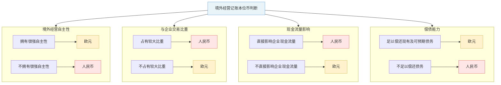

> [!info] 考情分析
> 本章属于比较重要的章节，主要考点包括：
>
> （1）不同的外币交易在初始确认时的会计处理；
> （2）货币性项目和非货币性项目期末调整或结算的处理；
> （3）境外经营财务报表折算汇率的选择；
> （4）包含境外经营的合并财务报表编制的特殊处理；
> （5）境外经营的处置等。
>
> 本章近三年考题题型主要为客观题，分值在2分左右。
>
> **2025年本章教材内容主要变化如下：**
>
> （1）补充"债权投资、其他债权投资为货币性项目"相关表述；
> （2）修改"境外经营的处置"相关表述。

## 第一节　记账本位币的确定

### 一、记账本位币的确定

**记账本位币**，是指企业经营所处的主要经济环境中的货币。企业记账本位币的选定，应当考虑下列因素：

 （一）从日常活动收入的角度看
所选择的货币能够对企业商品和劳务销售价格起主要作用，通常以该货币进行商品和劳务销售价格的计价和结算。
 
 （二）从日常活动支出的角度看
所选择的货币能够对商品和劳务所需人工、材料和其他费用产生主要影响，通常以该货币进行这些费用的计价和结算。

 （三）融资活动获得的资金以及保存从经营活动中收取款项时所使用的货币
在有些情况下，企业根据收支情况难以确定记账本位币，需要在收支基础上结合融资活动获得的资金或保存从经营活动中收取款项时所使用的货币进行综合分析后做出判断。

### 二、境外经营记账本位币的确定

1. 境外经营的含义
**境外经营**，通常是指企业在境外的子公司、合营企业、联营企业、分支机构；当企业在境内的子公司、联营企业、合营企业或者分支机构选定的记账本位币不同于企业的记账本位币时，也应当视同境外经营。

2. 境外经营记账本位币的确定
境外经营在确定其记账本位币时，除应当考虑企业选择确定记账本位币需要考虑的上述因素外，还应考虑下列因素：（假定企业所处的主要经济环境为人民币；境外经营所处的主要经济环境为欧元）


 
> [!example] 例题·多选题
> 下列关于境外经营的记账本位币的表述中，正确的有（　）。
>
> - A. 如果境外经营产生的现金流量可以直接影响企业的现金流量，并且汇回不受限制，则应根据其所处的主要经济环境确定记账本位币
> - B. 如果境外经营所从事的活动是视同企业经营活动的延伸，则其应该选择与企业相同的货币作为记账本位币
> - C. 如果境外经营与企业的交易在境外经营活动中所占的比例较高，则其应该选择与企业相同的货币作为记账本位币
> - D. 如果境外经营活动产生的现金流量在企业不提供资金的情况下，可以偿还其现有债务和正常情况下可预期的债务，则其应该选择与企业相同的货币作为记账本位币
> > [!check]- 答案与解析
> >
> > **正确答案：B、C**
> >
> > **深度解析：**
> > **第一步：** 理解**境外经营记账本位币（功能货币）**的确定原则（《企业会计准则第19号——外币折算》）。优先考虑**三个指标**：
> > - 产生并消耗现金流量的货币；
> > - 销售商品/服务的主要货币；
> > - 融资活动的货币。
> > **第二步：** 如果上述指标指向**企业本位币**，则选择企业相同货币（一体性经营）；否则考虑**独立性**和**主要经济环境**。
> > **第三步：** 逐项分析：
> > - **A错误**：如果现金流量**直接影响企业**且**汇回无限制**，表明**一体性强**，应优先选择**企业本位币**，而非主要经济环境。
> > - **B正确**：**视同企业经营延伸**（一体性经营），直接选择**企业相同货币**。
> > - **C正确**：**与企业交易比例较高**属于**销售/采购货币指标**指向企业本位币，故选择相同。
> > - **D错误**：能**自行偿还债务**表明**独立性强**，应选择**当地货币**，而非企业相同。
> >
> > **💡 易错点提示：**
> > D选项陷阱：**独立性指标**（自偿债务）指向**当地货币**，易误为企业货币；A忽略**一体性优先于经济环境**。

### 三、记账本位币变更的会计处理

- **记账本位币一经确定，不得随意变更**，除非与确定记账本位币相关的企业经营所处的主要经济环境发生重大变化。
- 企业因经营所处的主要经济环境发生重大变化，确需变更记账本位币的，应当采用变更当日的即期汇率将所有项目折算为变更后的记账本位币，折算后的金额作为新的记账本位币的历史成本。由于采用同一即期汇率进行折算，**不会产生汇兑差额**。
- 企业需要提供确凿的证据证明企业经营所处的主要经济环境确实发生了重大变化，并应当在附注中披露变更的理由。
## 第二节　外币交易的会计处理

### 一、汇率

1. 即期汇率
- **即期汇率**，通常是指当日中国人民银行公布的人民币汇率的中间价。但企业发生的外币兑换业务或涉及外币兑换的交易事项，应当按照交易实际采用的汇率（即银行买入价或卖出价）折算。

2. 即期汇率的近似汇率
- 当汇率变动不大时，为简化核算，企业在外币交易日或对外币报表的某些项目进行折算时，也可以选择即期汇率的近似汇率折算。
- **即期汇率的近似汇率**，是指按照系统合理的方法确定的、与交易发生日即期汇率近似的汇率，通常是指当期平均汇率或加权平均汇率等。
- 确定即期汇率的近似汇率的方法应在前后各期保持一致。如果汇率波动使得采用即期汇率的近似汇率折算不适当时，应当采用交易发生日的即期汇率折算。
### 二、外币交易的会计处理

#### （一）外币交易的初始确认

企业发生外币交易的，应当在初始确认时采用交易日的即期汇率或即期汇率的近似汇率将外币金额折算为记账本位币金额。

 1. 买入或者卖出以外币计价的商品或者劳务
> [!example] 教材例22-2
> 甲公司记账本位币为人民币。2×15年8月20日，甲公司下属的境外经营乙公司从美国A公司进口一台管理用设备，该设备购买价格为250 000美元，以银行存款支付进口关税和进口环节海关代征的增值税共计211 250元人民币。2×15年8月20日的即期汇率为1美元=6.5元人民币。
>
> > [!check]- 分析
> > 
> > 乙公司相关账务处理如下：
> >
> > ```
> > 借：固定资产（250 000×6.5）1 625 000
> >     应交税费——应交增值税（进项税额）
> > 　　                          211 250
> > 　贷：应付账款——美元　　    1 625 000
> > 　　　银行存款——人民币
> > 　　          （1 625 000×13%）211 250
> > ```

2. 接受外币资本投资

企业收到投资者以外币投入的资本，无论是否有合同约定汇率，均**不得采用合同约定**汇率和即期汇率的近似汇率折算，而是采用交易日即期汇率折算，这样，外币投入资本与相应的货币性项目的记账本位币金额相等，**不产生**外币资本折算差额。

> [!example] 教材例22-3
> 甲公司为外商投资企业，记账本位币为人民币，注册资本为5 000万元人民币。2×15年5月，甲公司以增资扩股方式吸收境外乙投资者，增加注册资本200万美元，乙投资者分两次将认缴的出资额汇入甲公司。
>
> 2×15年9月10日，乙公司收到甲公司汇来的第一期出资款100万美元，当日的即期汇率为1美元=6.35元人民币。
>
> 2×16年5月25日，乙公司收到甲公司汇来的第二期出资款100万美元，当日的即期汇率为1美元=6.40元人民币。
>
> 甲公司上述出资款假定均为乙公司的实收资本，不考虑其他因素。
>
> > [!check]- 分析
> > 
> > 乙公司相关账务处理如下（金额单位以万元人民币表示）：
> >
> > ①2×15年9月10日
> >
> > ```
> > 借：银行存款——美元 （100×6.35）635
> > 　贷：实收资本　　　　　　　　    　635
> > ```
> >
> > ②2×16年5月25日
> >
> > ```
> > 借：银行存款——美元（1 00×6.40）640
> > 　贷：实收资本　　　　　　　   　   640
> > ```

3. 借入或者借出外币资金

> [!example] 例题
> 甲公司记账本位币为人民币，2×15年11月1日，下属境外经营乙公司以10欧元/1元人民币的汇率从银行借入短期借款1 200万欧元。
>
> > [!check]- 分析
> > 乙公司相关账务处理如下：
> >
> > ```
> > 借：银行存款——欧元
> > 　　    　　      （1 200×10）12 000
> > 　贷：短期借款——欧元
> > 　　                （1 200×10）12 000
> > ```

 4. 外币兑换

 银行存款的外币户始终按**中间价**记账，人民币户按**实际收付**（银行买入/卖出价）记账，两边的差额就是**汇兑损益**。
>  中间价 = （银行买入价 + 银行卖出价）÷ 2
> 外币账户（如"银行存款——美元"）需要一个**统一的入账汇率**，不能一会儿用买入价、一会儿用卖出价，否则同一个美元户余额会乱。中间价就充当这个**标准尺子**，保证外币户的记账口径一致。

| 外币兑换     | 会计处理 （假定以记账本位币人民币与外币美元兑换）                                        |
| -------- | ---------------------------------------------------------------- |
| **买入外币** | 借：银行存款——美元（外币金额×中间价）<br>　　财务费用——汇兑差额<br>　贷：银行存款——人民币（外币金额×银行卖出价） |
| **卖出外币** | 借：银行存款——人民币（外币金额×银行买入价）<br>　　财务费用——汇兑差额<br>　贷：银行存款——美元（外币金额×中间价） |

| 场景       | 你在做什么    | 人民币户用什么价            | 差额本质         |
| -------- | -------- | ------------------- | ------------ |
| **买入外币** | 拿人民币→换美元 | 银行**卖出价**（银行卖给你，价高） | 你多付的钱 = 汇兑损失 |
| **卖出外币** | 拿美元→换人民币 | 银行**买入价**（银行买你的，价低） | 你少收的钱 = 汇兑损失 |
> 💡 正常情况下，**财务费用（汇兑差额）几乎都在借方**，体现的就是银行吃的那个买卖价差（bid-ask spread）。本质上和你去机场换外币一样——换进换出都亏一点，亏的那部分就是"财务费用——汇兑差额"。

> [!example] 例题
> 甲公司为境内上市公司，记账本位币为人民币。2×15年7月1日，甲公司以人民币从银行买入100 000美元，银行当日的美元卖出价为1美元=6.88元人民币，买入价为1美元=6.86元人民币，中间价为1美元=6.87元人民币。
>
> > [!check]- 分析
> > 甲公司相关账务处理如下：
> >
> > ```
> > 借：银行存款——美元
> > 　　　　　　 （100 000×6.87）687 000
> > 　　财务费用　　　　　　　　　  1 000
> > 　贷：银行存款——人民币
> > 　　　　　　　 （100 000×6.88）688 000
> > ```
#### （二）期末调整或结算

##### 1. 外币货币性项目

| 定义 | 说明 |
|-----|------|
| **货币性项目** | 是企业持有的货币和将以固定或可确定金额的货币收取的资产或者偿付的负债 |
| **货币性资产** | 货币性资产包括库存现金、银行存款、应收账款、其他应收款、长期应收款、债权投资、其他债权投资等 |
| **货币性负债** | 货币性负债包括短期借款、应付账款、其他应付款、长期借款、应付债券和长期应付款等 |

（1）期末或结算货币性项目时，应以当日**即期汇率**折算外币货币性项目，该项目因当日即期汇率不同于该项目初始入账时或前一期末即期汇率而产生的汇兑差额计入**当期损益**。

> [!example] 例题·计算分析题
> 甲公司为境内上市公司，记账本位币为人民币。2×25年3月2日，甲公司进口一批原材料，货款总额为**3 000美元**，进口关税为**2 130元人民币**，取得的增值税专用发票上注明的增值税税额为**3 045.9元人民币**，货款尚未支付，进口关税和增值税税额已经用人民币支付。3月31日，即期汇率为**1美元=7.00元人民币**。4月20日，甲公司将该应付账款结清，当日的即期汇率为**1美元=7.08元人民币**。假定甲公司在3月2日的即期汇率为**1美元=7.10元人民币**，不考虑其他因素。
>
> > [!check]- 答案与解析
> > 
> > **深度解析：**
> >
> > **第一步：3月2日，确认原材料入账价值及应付账款**
> > - 原材料入账价值 = 货款折算人民币 + 进口关税 = $3\,000 \times 7.10 + 2\,130 = 21\,300 + 2\,130 = 23\,430$（元）
> > - 应交税费——应交增值税（进项税额）= **3 045.9元**
> > - 应付账款（美元户）= $3\,000 \times 7.10 = 21\,300$（元）
> >
> > 借：原材料 **23 430**
> > 　　应交税费——应交增值税（进项税额） **3 045.9**
> > 　贷：应付账款——美元户（$3\,000 \times 7.10$） **21 300**
> > 　　　银行存款 **5 175.9**
> >
> > **第二步：3月31日，期末汇兑调整**
> > - 应付账款期末余额（按期末汇率）= $3\,000 \times 7.00 = 21\,000$（元）
> > - 应付账款账面余额 = **21 300元**
> > - 汇兑差额 = $21\,300 - 21\,000 = 300$（元），应付账款减少，产生**汇兑收益**
> >
> > 借：应付账款——美元户 **300**
> > 　贷：财务费用——汇兑差额 **300**
> >
> > **第三步：4月20日，结清应付账款**
> > - 应付账款账面余额 = **21 000元**（调整后）
> > - 实际支付金额 = $3\,000 \times 7.08 = 21\,240$（元）
> > - 汇兑差额 = $21\,240 - 21\,000 = 240$（元），多付产生**汇兑损失**
> >
> > 借：应付账款——美元户 **21 000**
> > 　　财务费用——汇兑差额 **240**
> > 　贷：银行存款——美元户（$3\,000 \times 7.08$） **21 240**
> >
> > **💡 易错点提示：**
> > ① 原材料入账价值包含**进口关税**，但**不含增值税**和货款本身的汇兑损益；
> > ② 期末调汇和结算日汇兑差额的方向容易混淆：应付账款为负债，汇率下降→负债减少→**汇兑收益**（贷记财务费用），汇率上升→负债增加→**汇兑损失**（借记财务费用）；
> > ③ 银行存款（美元户）如有余额，期末同样需要进行汇兑调整，本题未涉及。

（2）企业为购建或生产符合资本化条件的资产而借入的专门借款为外币借款时，在借款费用资本化期间内，由于外币借款在取得日、使用日及结算日的汇率不同而产生的汇兑差额，应当予以资本化，计入相关资产成本。

- 相关链接：[[A1-会计笔记/11-借款费用]]
##### 2. 外币非货币性项目

**非货币性项目**，是指货币性项目以外的项目，包括存货、长期股权投资、以公允价值计量且变动计入当期损益的金融资产（股票、基金等）、固定资产、无形资产、预付款项、预收款项、合同负债等。

> [!info] 提示
> - 外币预付款项、预收款项、合同负债均不满足货币性项目的定义，属于以历史成本计量的外币非货币性项目，企业在资产负债表日应当采用交易发生日的即期汇率折算，不产生汇兑损益。
>  - 预付款项一般为购买存货、固定资产等资产而提前支付的款项，未来以收取金额不固定或不确定的存货、固定资产等资产的形式实现，为非货币性资产项目。
>- 同理，预收款项和合同负债一般为转让存货、固定资产等资产而提前收到的款项，未来以金额不固定或不确定的存货、固定资产等资产偿付义务，为非货币性负债项目。

（1）对于以历史成本计量的外币非货币性项目，已在交易发生日按当日即期汇率折算，资产负债表日**不应改变**其原记账本位币金额，**不产生汇兑差额**。
> 因为这些项目在取得时已按取得当日即期汇率折算，从而构成这些项目的历史成本，如果再按资产负债表日的即期汇率折算，就会导致这些项目价值不断变动，从而使这些项目的折旧、摊销和减值不断地随之变动，导致与这些项目的实际情况不符。

（2）对于以成本与可变现净值孰低计量的存货，如果其可变现净值以外币确定，则在确定存货的期末价值时，应先将可变现净值折算为记账本位币，再与以记账本位币反映的存货成本进行比较。
[[A1-会计笔记/2-存货]]

（3）对于以公允价值计量的股票、基金等非货币性项目，期末公允价值以外币反映，应当先将该外币金额按照公允价值确定当日的即期汇率折算为记账本位币金额，再与原记账本位币金额进行比较。

①对于以公允价值计量且其变动计入当期损益的金融资产（股票、基金等非货币性项目）折算后的记账本位币金额与原记账本位币金额之间的差额计入**当期损益**。

> [!example] 教材例22-7
> 2×15年12月10日，甲公司以美元从上海证券交易所购入乙公司在境内发行的以美元标明面值并以美元交易结算的B股股票10 000股，每股市价1.5美元，当日即期汇率为1美元=6.3元人民币，甲公司将其确认为以公允价值计量且其变动计入当期损益的金融资产。
>
> 2×15年12月31日，由于市价变动，购入的乙公司B股的市价变为每股1美元,当日即期汇率为1美元=6.2元人民币。2×16年1月10日，甲公司将所购乙公司B股股票按当日市价每股1.2美元全部出售，所得价款为12 000美元，当日即期汇率为1美元=6.25元人民币。不考虑相关税费的影响。
>
> > [!check]- 分析
> > 甲公司账务处理如下（金额单位以万元人民币表示）：
> >
> > ①2×15年12月10日
> >
> > ```
> > 借：交易性金融资产——成本
> > 　　　　　　　　　（1.5×1×6.3）9.45
> > 　贷：银行存款——美元　　　　　　　9.45
> > ```
> >
> > ②2×15年12月31日
> >
> > ```
> > 借：公允价值变动损益
> > 　　　　　　　（ 9.45-1×1×6.2）3.25
> > 　贷：交易性金融资产——公允价值变动
> > 　　　　　　　　　　　　　　　　　　3.25
> > ```
> >
> > > [!info] 提示
> > > 3.25万元人民币既包含乙公司B股股票公允价值变动的影响，又包含人民币与美元之间汇率变动的影响。
> >
> > ③2×16年1月10日
> >
> > ```
> > 借：银行存款——美元
> > 　　　　　　　　　（1.2×1×6.25）7.5
> > 　　交易性金融资产——公允价值变动 3.25
> > 　贷：交易性金融资产——成本　　 9.45
> > 　　　投资收益　　　　　　　　　　　1.3
> > ```
> >
> > > [!info] 提示
> > > 对于汇率的变动和股票市价的变动不进行区分，均作为投资收益进行处理。

②对于指定为以公允价值计量且其变动计入其他综合收益的非交易性权益工具投资，其折算后的记账本位币金额与原记账本位币金额之间的差额应计入**其他综合收益（处置时直接转入留存收益）**。

> [!tip] 归纳
> | 外币金融资产 | 公允价值变动 | 金融资产汇兑差额 | 应收利息或股利 | 应收利息或股利汇兑差额 |
> |-------------|-------------|----------------|---------------|---------------------|
> | **外币货币性金融资产** | 其他综合收益 | 当期损益（财务费用） | 当期损益（投资收益） | 当期损益（财务费用） |
> | **外币非货币性金融资产** | 其他综合收益 | 其他综合收益 | 当期损益（投资收益） | 当期损益（财务费用） |

## 第三节　外币财务报表折算

### 一、境外经营财务报表的折算

#### （一）境外经营财务报表的折算方法

在对企业境外经营财务报表进行折算前，应当调整境外经营的会计期间和会计政策，使之与企业会计期间和会计政策相一致，根据调整后会计政策及会计期间编制相应货币（记账本位币以外的货币）的财务报表，再按照以下方法对境外经营财务报表进行折算：

 1. 资产负债表中的资产和负债项目，采用资产负债表日的**即期汇率**折算，所有者权益项目除"未分配利润"项目外，其他项目采用发生时的即期汇率折算

| 项目 | 折算的汇率 |
|------|-----------|
| **资产** | 资产负债表日的即期汇率 |
| **负债** | 资产负债表日的即期汇率 |
| **所有者权益（"未分配利润"项目除外）** | 发生时的即期汇率 |

 2. 利润表中的收入和费用项目，采用交易**发生日**的**即期汇率**折算；也可以采用按照系统合理的方法确定的、与交易发生日即期汇率近似的汇率折算
 3. 产生的外币财务报表折算差额，在资产负债表中"所有者权益"项目下的"**其他综合收益**"项目列示

> [!example]-
> 
> > 假设年初未分配利润为0，本年无利润分配，净利润全部留存。
>  
>  **第一步：资产和负债 → 资产负债表日即期汇率（7.30）**
> 
> | 项目 | 美元（万） | 汇率 | 人民币（万） |
> | --- | --- | --- | --- |
> | 资产合计 | 1,000 | **7.30** | **7,300** |
> | 负债合计 | 400 | **7.30** | **2,920** |
> 
>  **第二步：所有者权益（除未分配利润）→ 历史汇率**
> 
> | 项目 | 美元（万） | 汇率 | 人民币（万） |
> | --- | --- | --- | --- |
> | 实收资本 | 300 | **6.80**（投入时） | **2,040** |
> | 盈余公积 | 100 | **7.00**（计提时） | **700** |
> 
>  **第三步：利润表 → 交易发生日汇率（或近似的平均汇率7.20）**
> 
> | 项目 | 美元（万） | 汇率 | 人民币（万） |
> | --- | --- | --- | --- |
> | 营业收入 | 500 | **7.20** | **3,600** |
> | 营业成本 | (300) | **7.20** | **(2,160)** |
> | 净利润 | 200 | — | **1,440** |
> 
>  **第四步：倒挤"未分配利润"（人民币）**
> $$
> \text{未分配利润} = \text{年初未分配利润} + \text{本年净利润} - \text{利润分配} = 0 + 1{,}440 - 0 = 1{,}440 \text{（万元）}
> $$
> > ⚠️ **关键点**：未分配利润不是直接用某个汇率折算的，而是通过利润表折算结果**间接推算**出来的！
> 
>  **第五步：倒挤"外币报表折算差额"**
> 
> | 项目           | 人民币（万）                    |
> | ------------ | ------------------------- |
> | 资产合计         | 7,300                     |
> | 负债合计         | 2,920                     |
> | **所有者权益应等于** | **7,300 - 2,920 = 4,380** |
> 
> 已知所有者权益各项：
> 
> | 项目               | 人民币（万）                  |
> | ---------------- | ----------------------- |
> | 实收资本             | 2,040                   |
> | 盈余公积             | 700                     |
> | 未分配利润            | 1,440                   |
> | 小计               | **4,180**               |
> | **差额（外币报表折算差额）** | **4,380 - 4,180 = 200** |
> 
> $$
> \boxed{\text{外币报表折算差额} = 200 \text{万元（计入其他综合收益）}}
> $$
> 
>  **🧠 折算差额的本质——为什么会产生？**
> 
> 用一句话概括：
> > **资产负债用"现在的汇率"，权益用"过去的汇率"，收入费用用"中间的汇率"——三种汇率不一致，报表左右两边就对不上了，差额就是折算差额。**
> 
> 具体来说，这200万的差额来源于：
> - 资产和负债按**7.30**折算（最新汇率）
> - 实收资本按**6.80**折算（历史汇率）
> - 净利润按**7.20**折算（平均汇率）
> 
> 人民币在贬值（6.80→7.30），意味着美元资产"升值"了，但权益端用的是历史低汇率，没有反映这个升值，所以产生了**正的折算差额**。

> [!example] 例题·多选题
> （2015年）下列各项中，在对境外经营财务报表进行折算时选用的有关汇率，符合会计准则规定的有（　）。
> A. 股本采用股东出资日的即期汇率折算
> B. 其他权益工具投资采用资产负债表日即期汇率折算
> C. 未分配利润项目采用报告期平均汇率折算
> D. 当期提取的盈余公积采用当期平均汇率折算
>
> > [!check]- 答案与解析
> > 
> > **正确答案：ABD**
> >
> > **深度解析：**
> >
> > 境外经营财务报表折算的核心规则如下：
> >
> > **第一步：区分资产负债类与所有者权益类项目**
> > - **资产和负债项目**：采用**资产负债表日的即期汇率**折算。因此，选项B"其他权益工具投资"属于**资产项目**，采用资产负债表日即期汇率折算，**正确** ✅
> >
> > **第二步：区分所有者权益中的不同项目**
> > - **股本（实收资本）**：采用**发生日（股东出资日）的即期汇率**折算。选项A **正确** ✅
> > - **盈余公积**：属于利润分配产生的项目，需追溯至其**产生当期的平均汇率**折算（因为盈余公积来源于净利润，而收入和费用采用**交易发生日或当期平均汇率**折算）。选项D"当期提取的盈余公积采用当期平均汇率折算"，**正确** ✅
> > - **未分配利润**：是**倒挤**出来的，即根据折算后的收入、费用、已分配利润等项目**逐笔计算得出**，而非直接用某一汇率折算。选项C说"采用报告期平均汇率折算"，**错误** ❌
> >
> > **第三步：收入和费用类项目**
> > - 采用**交易发生日的即期汇率**折算，也可采用**当期平均汇率**作为近似替代。
> >
> > **💡 易错点提示：**
> > ① **未分配利润是"倒挤"项目**，不能直接用任何单一汇率折算，这是本题最大陷阱。
> > ② 注意区分"其他权益工具投资"虽然名称中含"权益"二字，但它是**资产项目**，应按资产负债表日即期汇率折算，而非按所有者权益项目的规则处理。
#### （二）包含境外经营的合并财务报表编制的特殊处理

1. 少数股东应分担的外币报表折算差额

	在企业境外经营为其子公司的情况下，企业在编制合并财务报表时，对于境外经营财务报表折算差额，需要在母公司与子公司少数股东之间按照各自在境外经营所有者权益中所享有的份额进行分摊，其中：
	（1）属于母公司应分担的部分，在合并资产负债表和合并所有者权益变动表中所有者权益项目下"**其他综合收益**"项目列示；
	（2）属于子公司少数股东应分担的部分，应并入"**少数股东权益**"项目列示。

 2. 实质上构成对境外经营净投资的外币货币性项目产生的汇兑差额在编制合并财务报表时的处理

	母公司含有实质上构成对子公司（境外经营）净投资的外币货币性项目的情况下，在编制合并财务报表时，应分别以下两种情况编制抵销分录：

	（1）实质上构成对子公司净投资的**外币货币性项目**以母公司或子公司的记账本位币反映，则应在抵销长期应收应付项目的同时，将其产生的汇兑差额转入"其他综合收益"项目。**即，借记或贷记"财务费用——汇兑差额"项目，贷记或借记"其他综合收益"项目。

| 报表（母公司和境外经营记账本位币分别为人民币和欧元） | 会计处理                                                                                            |
| -------------------------- | ----------------------------------------------------------------------------------------------- |
| **母公司个别报表**                | ①母公司对子公司净投资时<br>借：长期应收款——子公司<br>　贷：银行存款<br>②资产负债表日汇兑差额<br>借：财务费用<br>　贷：长期应收款——子公司<br>（或作相反会计分录） |
| **境外经营子公司个别报表**            | ①子公司接受母公司净投资时<br>借：银行存款<br>　贷：长期应付款——母公司<br>②资产负债表日汇兑差额<br>（境外经营子公司无须调整）                        |
| **资产负债表日合并财务报表**           | 借：长期应付款——母公司<br>　贷：长期应收款——子公司<br>借：其他综合收益<br>　贷：财务费用<br>（或作相反会计分录）                              |

（2）实质上构成对子公司净投资的外币货币性项目以母、子公司的记账本位币**以外**的货币反映，应将母、子公司此项外币货币性项目产生的汇兑差额**相互抵销**，差额转入其他综合收益。
### 二、境外经营的处置

 按照外币折算准则的规定，企业在处置持有待售的境外经营时，应当将与该境外经营相关的外币财务报表折算差额，**自其他综合收益转入处置当期损益**，部分处置境外经营的，应当按处置的比例计算处置部分的外币财务报表折算差额，转入处置当期损益。

> [!example]-
> 境外经营存续期间，折算差额一直"挂"在**其他综合收益（OCI）** 里。一旦处置（卖掉）境外经营，这笔OCI就要 **"兑现"**——转入当期损益（投资收益）。
> 
> 接上个例子：A公司持有美国子公司B公司 **100%股权**，截至2025年末，与B公司相关的累计外币报表折算差额为 **200万元**（贷方，即OCI正数）。
> 
> **情形一：2026年A公司将B公司100%股权全部出售**
> 
> **处理：** 200万元折算差额全部从OCI转入当期损益。
> $$
> \text{转出金额} = 200 \times 100\% = 200 \text{（万元）}
> $$
> **分录：**
> ```
> 借：其他综合收益    200万
>   贷：投资收益        200万
> ```
> 
>  **情形二：2026年A公司出售B公司60%股权（丧失控制权）**
> **处理：** 丧失控制权 = 视同全部处置，200万元**全部**转出。
> $$
> \text{转出金额} = 200 \text{（万元，全部转出）}
> $$
> > ⚠️ **易错点**：丧失控制权时，即使只卖了60%，折算差额也是**全部转出**，不是按60%比例！因为从合并报表角度，这家子公司已经"出表"了。
> 
> **情形三：2026年A公司出售B公司20%股权（不丧失控制权，仍持有80%）**
> **处理：** 不丧失控制权 = 部分处置，按比例转出。
> $$
> \text{转出金额} = 200 \times 20\% = 40 \text{（万元）}
> $$
> 
> **分录：**
> ```
> 借：其他综合收益    40万
>   贷：投资收益        40万
> ```
> 
> > 剩余160万继续留在OCI中。
> 
> | 处置类型 | 是否丧失控制权 | 折算差额转出方式 | 转出金额（本例） |
> | --- | --- | --- | --- |
> | 全部出售100% | ✅ 丧失 | **全部转出** | 200万 |
> | 出售60%（丧失控制权） | ✅ 丧失 | **全部转出** | 200万 |
> | 出售20%（不丧失控制权） | ❌ 未丧失 | **按比例转出** | 200×20%=40万 |
> 
> 

## 本章小结
1. **记账本位币的确定**：企业根据经营所处的主要经济环境确定记账本位币，境外经营需要考虑额外因素。
2. **外币交易的会计处理**：包括外币交易的初始确认、期末调整或结算，重点掌握货币性项目和非货币性项目的不同处理方法。
3. **外币财务报表折算**：境外经营财务报表的折算方法、合并财务报表的特殊处理以及境外经营处置时外币报表折算差额的处理。
