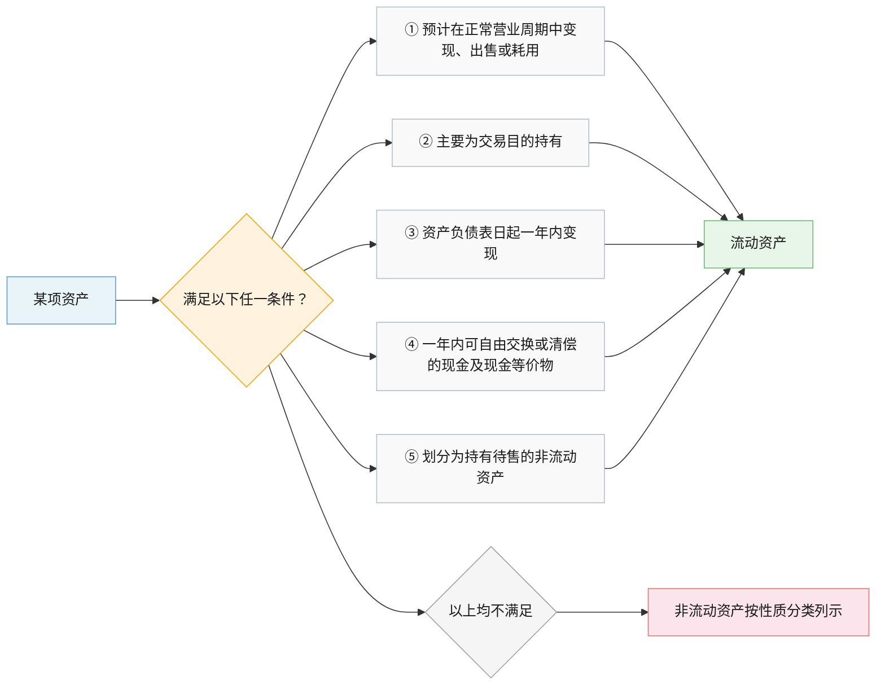
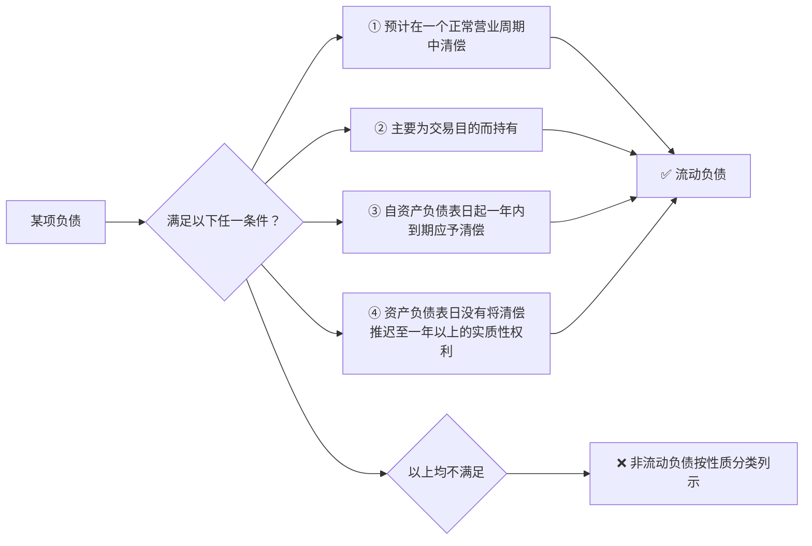
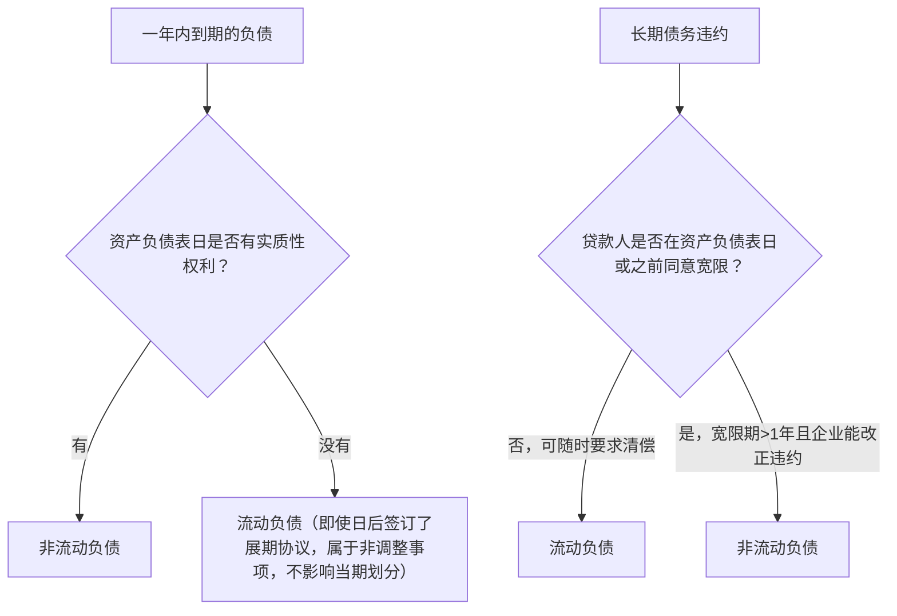
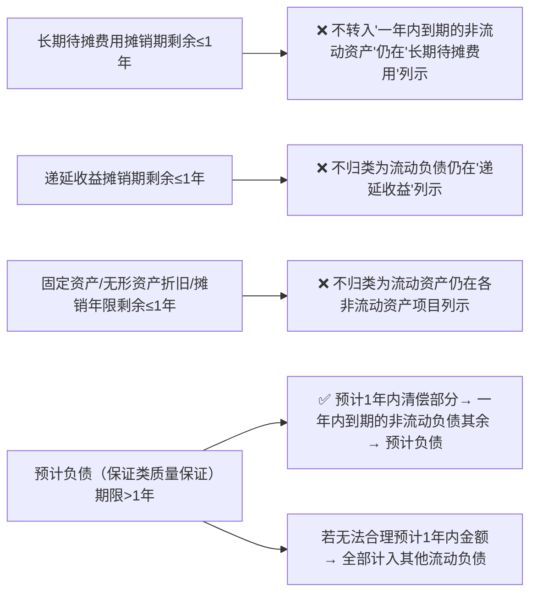

---
type:
  - note
kind: Ref - 资源 / 摘录 / 工具
area: "[[学习]]"
project: "[[CPA会计]]"
tags:
  - 会计章节
created: 2026-02-27
---

# 一、财务报表列报的基本要求

## （一）依据各项会计准则确认和计量的结果编制财务报表

**核心禁令：** 企业不应以在附注中披露代替对交易和事项的确认和计量，不恰当的确认和计量也不能通过充分披露相关会计政策而纠正。
*错了就是错了，别指望写个说明就能蒙混过关。*

## （二）列报基础：持续经营

持续经营是会计的基本前提，也是会计确认、计量及编制财务报表的基础。 

### 1. 持续经营能力的评价

- **评价时点：** 自资产负债表日起 **至少12个月**。
- **考虑因素：** 宏观政策风险、市场经营风险、企业目前或长期的盈利能力、偿债能力、财务弹性以及企业管理层改变经营政策的意向等。
- **判断逻辑：**
  - **正常情况：** 过去每年都有可观净利润，易于获取财务资源，直接判定持续经营。
  - **异常情况：** 过去多年亏损，需考虑获利能力、债务清偿计划、替代融资来源等。

### 2. 非持续经营状态

- **判定标准：**
  1. 企业已在当期进行清算或停止营业。
  2. 企业已经正式决定在下一个会计期间进行清算或停止营业。
  3. 企业已确定在当期或下一个会计期间没有其他可供选择的方案而将被迫进行清算或停止营业。
- **会计处理：** 应当采用 **清算价值** 等其他基础编制。
  - 破产清算期间资产：按 **破产资产清算净值** 计量。
  - 破产清算期间负债：按 **破产债务清偿价值** 计量。
- **披露要求：** 必须在附注中声明未以持续经营为基础、原因以及编制基础。

## （三）权责发生制

**原则：** 除 **现金流量表** 按照收付实现制编制外，企业应当按照权责发生制编制其他财务报表。

## （四）列报的一致性与比较信息

财务报表项目的列报应当在各个会计期间保持一致，不得随意变更。

企业在列报当期财务报表时，至少应当提供所有列报项目上一个可比会计期间的比较数据，以及与理解当期财务报表相关的说明。

## （五）依据重要性原则单独或汇总列报项目

**核心逻辑：** 抓大放小，性质决定待遇。

1. **性质或功能不同：** 一般应当在财务报表中单独列报，但是不具有重要性的项目可以汇总列报。
2. **性质或功能类似：** 一般可以汇总列报，但是对其具有重要性的类别应该单独列报。
3. **穿透原则：** 项目单独列报的原则不仅适用于报表，还适用于附注。某些项目的重要性程度不足以在资产负债表、利润表、现金流量表或所有者权益变动表中单独列报，但是可能对附注而言却具有重要性，在这种情况下应当在附注中单独披露。
4. **强制性：** 无论是财务报表列报准则规定单独列报的项目，还是其他具体会计准则规定单独列报的项目，企业都应当予以单独列报。

## （六）财务报表项目金额间的相互抵销

**基本原则：** **总额列报**。资产和负债、收入和费用、直接计入当期利润的利得和损失项目的金额不能相互抵销，即不得以净额列报，但企业会计准则另有规定的除外。

> [!danger] 特例：以下三种情况不属于抵销，可以净额列示
> 1. **一组类似交易形成的利得和损失：** 应当以净额列示的，不属于抵销。比如，汇兑损益应当以净额列报；为交易目的而持有的金融工具形成的利得和损失应当以净额列报等。但是，如果相关利得和损失具有重要性， 则应当单独列报。
> 2. **资产或负债项目按扣除备抵项目后的净额列示：** 不属于抵销。比如，对资产计提减值准备，表明资产的价值确实已经发生减损，按扣除减值准备后的净额列示，才反映了资产当时的真实价值。
> 3. **非日常活动产生的利得和损失：** 以同一交易形成的收益扣减相关费用后的净额列示更能反映交易实质的，不属于抵销。比如，非流动资产处置形成的利得或损失，应当按处置收入扣除该资产的账面金额和相关销售费用后的净额列报。

# 二、资产负债表

## （一）资产的列报



> 特别注意： 并非所有交易性金融资产均为流动资产。自资产负债表日起超过12个月到期，且预期持有超过12个月的衍生工具 → 归为非流动资产/非流动负债。

## （二）负债的列报

### 1. 流动负债 vs 非流动负债 基本判断



### 2. 实质性权利的核心判断表

| 资产负债表日的状态      | 实质性权利    | 划分结果  |
| -------------- | -------- | ----- |
| 资产负债表日存在推迟清偿权利 | 拥有（一年以上） | 非流动负债 |
| 资产负债表日存在推迟清偿权利 | 不拥有      | 流动负债  |

> ⚠️ 关键原则： 企业是否有主观意愿行使实质性权利，不影响流动性划分。即便企业打算提前还款，只要条件符合，仍列为非流动负债。

---

### 3. 资产负债表日后事项的影响



> [!example] 例题·单选题
> 甲公司于2×12年7月1日向A银行举借**五年期**的长期借款（即到期日为**2×17年6月30日**），当存在以下情况时，有关资产负债表列示的表述中，**不正确**的是（　）。
>
> A. 假定甲公司在2×16年12月1日与A银行完成长期再融资或展期，展期至2×19年6月30日，则该借款在2×16年12月31日的资产负债表上应当划分为**非流动负债**
>
> B. 假定甲公司不能自主地将清偿义务展期，但甲公司在2×17年2月1日（财务报告批准报出日为2×17年3月31日）与A银行约定将该借款展期两年，则该借款在2×16年12月31日的资产负债表上应当划分为**流动负债**
>
> C. 假定甲公司与A银行的贷款协议上规定，甲公司在长期借款到期前可以**自行决定**是否展期以及展期的期限，无须征得债权人同意，2×16年12月1日甲公司打算展期两年，则该借款在2×16年12月31日的资产负债表上应当划分为**非流动负债**
>
> D. 假定甲公司不能自主地将清偿义务展期，但甲公司在2×17年3月1日（财务报告批准报出日为2×17年3月31日）与A银行约定将该借款展期两年，则该借款在2×16年12月31日的资产负债表上应当划分为**非流动负债**
>
> > [!check]- 答案与解析
> >
> > **正确答案：D**
> >
> > ---
> >
> > **📌 核心判断框架：**
> > 长期借款在资产负债表日后是否划分为**流动负债**，需依据以下规则：
> > - 若**资产负债表日**（本题为2×16年12月31日）之前已完成再融资/展期 → 列为**非流动负债** ✅
> > - 若企业**自主**拥有展期权（无需债权人同意）→ 列为**非流动负债** ✅
> > - 若企业**不能自主**展期，但在**资产负债表日后、财务报告批准报出日前**完成展期 → 仍列为**流动负债** ✅（属于资产负债表日后事项，不调整报表）
> >
> > ---
> >
> > **逐项分析：**
> >
> > **选项A（正确表述）：**
> > 甲公司于**2×16年12月1日**（早于资产负债表日2×16年12月31日）已与银行完成展期，属于**资产负债表日之前**的再融资，新到期日为2×19年6月30日，超过一年。
> > → 划分为**非流动负债** ✅ 表述正确。
> >
> > **选项B（正确表述）：**
> > 甲公司**不能自主**展期，展期协议签订于**2×17年2月1日**（资产负债表日**之后**，批准报出日**之前**）。
> > 资产负债表日时尚未完成展期，该借款在资产负债表日已满足"一年内到期"的条件。
> > → 划分为**流动负债** ✅ 表述正确。
> >
> > **选项C（正确表述）：**
> > 贷款协议赋予甲公司**自主展期权**，无需债权人同意，企业可自主决定将清偿义务延期至一年以上。
> > → 划分为**非流动负债** ✅ 表述正确。
> >
> > **选项D（错误表述）⭐：**
> > 甲公司**不能自主**展期，展期协议签订于**2×17年3月1日**（资产负债表日**之后**，批准报出日**2×17年3月31日之前**）。
> > 与选项B情形相同，资产负债表日时展期尚未完成，该借款应列为**流动负债**。
> > 题目却表述为"划分为**非流动负债**"→ **表述错误** ❌
> >
> > ---
> >
> > **💡 易错点提示：**
> > 选项B与选项D的情形**高度相似**，极易混淆——两者均为"不能自主展期"且"在批准报出日前完成展期"，**区别仅在于签约日期**，但二者的正确结论**完全相同**（均应列为流动负债）。D项将结论改为"非流动负债"即构成错误，考生需警惕"批准报出日前完成展期"≠"可调整为非流动负债"这一陷阱。
---

### 4. 契约条件与流动性划分

|契约条件遵循的时点|对流动性划分的影响|
|---|---|
|资产负债表日或之前应遵循的契约条件|影响该权利是否存在的判断 → 进而影响流动性划分|
|资产负债表日之后应遵循的契约条件|不影响该权利是否存在的判断 → 与流动性划分无关|

---

### 5. 可转换工具负债成分的分类

> 如果债券持有人有权选择转股，且该选择权已按金融工具准则分类为权益工具单独确认，则转股的可能性不影响负债成分的流动性划分。

例： 甲公司2×24年12月1日发行5年期可转债，持有人可随时转股。该选择权已作为权益组成部分单独确认。
→ 判断时不考虑转股清偿情况，该可转债负债成分在2×24年12月31日应列为非流动负债。

---

### 6. 持有待售非流动负债

- 被划分为持有待售的非流动负债 → 归类为流动负债
- 处置组中与转让资产相关的负债 → 在流动负债部分单独列报

---

### 7. 金融企业的特殊处理

银行、证券、保险等金融企业，资产/负债难以严格区分流动/非流动的，可按流动性顺序列示，往往能提供更相关的信息。


## (三）资产负债表的填列方法

### 1. 期末余额的六种填列方式总览

| 填列方式        | 典型科目/项目                                            |
| ----------- | -------------------------------------------------- |
| 直接按总账余额填列   | 短期借款、实收资本、资本公积、库存股、盈余公积、递延所得税资产/负债等                |
| 几个总账科目合计填列  | 货币资金（库存现金+银行存款+其他货币资金+数字货币）、其他应付款（其他应付款+应付利息+应付股利） |
| 明细账分析计算填列   | 交易性金融资产、应收款项融资、合同资产/负债、应付账款、预收款项等                  |
| 总账+明细账分析计算  | 长期借款、其他非流动资产、租赁负债、其他非流动负债                          |
| 科目余额减备抵科目净额 | 长期股权投资、债权投资、固定资产、使用权资产、无形资产、长期应收款等                 |
| 综合运用上述方法    | 应收票据、应收账款、存货、固定资产、在建工程、开发支出等                       |
> [!example] 例题·单选题
> 下列有关金融资产在资产负债表列示表述**不正确**的是（　）。
>
> A. 自资产负债表日起超过一年到期且预期持有超过一年的以公允价值计量且其变动计入当期损益的非流动金融资产的期末账面价值，在"其他非流动金融资产"项目反映
>
> B. 自资产负债表日起一年内到期的长期债权投资的期末账面价值，在"一年内到期的非流动资产"项目反映
>
> C. 企业购入的以公允价值计量且其变动计入其他综合收益的一年内到期的债券投资的期末账面价值，在"其他流动资产"项目反映
>
> D. "其他权益工具投资"项目，应根据"其他权益工具投资"科目，减去"其他权益工具投资减值准备"科目中相关减值准备的期末余额后的金额分析填列
>
> > [!check]- 答案与解析
> > 
> > **正确答案：D**
> >
> > **深度解析：**
> >
> > **逐项分析：**
> >
> > **选项A（正确）：** 以公允价值计量且其变动计入当期损益（**FVTPL**）的金融资产，若自资产负债表日起**超过一年**到期且预期持有超过一年，属于非流动资产，在**"其他非流动金融资产"**项目列示。✅
> >
> > **选项B（正确）：** 长期债权投资若自资产负债表日起**一年内到期**，应从非流动资产重分类，在**"一年内到期的非流动资产"**项目列示。✅
> >
> > **选项C（正确）：** 以公允价值计量且其变动计入其他综合收益（**FVOCI**）的**债券投资**，若为**一年内到期**，属于流动资产，但由于"债权投资"和"其他债权投资"科目均不在流动资产的专设项目中，故在**"其他流动资产"**项目列示。✅
> >
> > **选项D（错误）：** **"其他权益工具投资"**（即FVOCI权益工具）按准则规定**不计提减值准备**，因此不存在"其他权益工具投资减值准备"科目，无需减去任何减值准备，直接以**"其他权益工具投资"科目期末余额**填列即可。❌
> >
> > **💡 易错点提示：**
> > 权益工具投资（指定为FVOCI）与债权工具投资（FVOCI）的减值处理截然不同——**债权工具需计提减值准备**（计入损益），而**权益工具不计提减值准备**，这是本题的核心陷阱，切勿混淆。
### 2. 重点填列项目速查

#### 合并/拆分类

|报表项目|填列口径|
|---|---|
|货币资金|库存现金 + 银行存款 + 其他货币资金 + 数字货币（人民币）|
|其他应付款|其他应付款 + 应付利息 + 应付股利|
|其他应收款|其他应收款 + 应收利息 + 应收股利 - 坏账准备|
|应付账款|应付账款（贷方）+ 预付账款（贷方明细）|
|预付款项|预付账款（借方）+ 应付账款（借方明细）- 坏账准备|
|预收款项|预收账款（贷方）+ 应收账款（贷方明细）|
|长期应付款|（长期应付款 - 未确认融资费用）+ 专项应付款|

#### 净额类（需扣减备抵）

|报表项目|填列公式|
|---|---|
|固定资产|固定资产 - 累计折旧 - 固定资产减值准备 + 固定资产清理|
|在建工程|（在建工程 - 在建工程减值准备）+（工程物资 - 工程物资减值准备）|
|长期应收款|（长期应收款 - 未实现融资收益 - 坏账准备）+（应收融资租赁款 - 减值准备）- 一年内到期部分|
|开发支出|研发支出（资本化支出明细）- 减值准备|

### 3. 增值税相关科目的列报

|明细科目|期末方向|列报位置|
|---|---|---|
|应交增值税、未交增值税、待抵扣进项税额、待认证进项税额、增值税留抵税额|借方|其他流动资产 / 其他非流动资产|
|待转销项税额|贷方|其他流动负债 / 其他非流动负债|
|未交增值税、简易计税、转让金融商品应交增值税、代扣代交增值税|贷方|应交税费|

> 特别提示：未交增值税明细科目期末若为借方余额 → 其他流动资产；若为贷方余额 → 应交税费。

---

### 4. 几个容易混淆的特殊规定



# 三、利润表

## （一）利润表的内容及结构

### 1. 利润表的内容

利润表是反映企业在一定会计期间经营成果的财务报表。

### 2. 利润表的结构

- （1）营业收入、营业成本
  - 营业收入 = 主营业务收入 + 其他业务收入
  - 营业成本 = 主营业务成本 + 其他业务成本
- （2）营业利润
  - 营业利润 = 营业收入 - 营业成本 - 税金及附加
    - 销售费用 - 管理费用 - 研发费用 - 财务费用
    + 其他收益
    + 投资收益（- 投资损失）
    + 净敞口套期收益（- 净敞口套期损失）
    + 公允价值变动收益（- 公允价值变动损失）
    - 信用减值损失
    - 资产减值损失
    + 资产处置收益（- 资产处置损失）
- （3）利润总额
  - 利润总额 = 营业利润 + 营业外收入 - 营业外支出
- （4）净利润
  - 利润总额减去所得税费用，即为净利润，按照经营可持续性具体分为持续经营净利润和终止经营净利润两项。
  - 净利润 = 利润总额 - 所得税费用
- （5）其他综合收益的税后净额
  - 其他综合收益，具体分为不能重分类进损益的其他综合收益和将重分类进损益的其他综合收益两类，并以扣除相关所得税影响后的净额列报。
- （6）综合收益总额
  - 综合收益总额，净利润加上其他综合收益的税后净额，即为综合收益总额。
  - 综合收益总额 = 净利润 + 其他综合收益的税后净额
- （7）每股收益
  - 每股收益，包括基本每股收益和稀释每股收益两项指标。

### 3. 其他综合收益及其他综合收益的税后净额

其他综合收益，是指企业根据相关会计准则的规定未在当期损益中确认的各项利得和损失。其他综合收益的税后净额为其他综合收益扣除所得税影响后的净额。

## （二）利润表的填列方法

### 1. 利润表本期金额栏的填列方法

（1）研发费用项目

研发费用项目，反映企业进行研究与开发过程中发生的费用化支出，以及计入管理费用的自行开发无形资产的摊销。该项目应根据管理费用科目下的研发费用明细科目的发生额，以及管理费用科目下的无形资产摊销明细科目的发生额分析填列。

（2）财务费用项目下其中：利息费用和利息收入项目

财务费用项目下其中：利息费用和利息收入项目，应根据财务费用科目所属的相关明细科目的发生额分析填列，且这两个项目作为财务费用项目的其中项以正数填列。

（3）其他收益项目

其他收益项目，反映计入其他收益的政府补助，以及其他与日常活动相关且计入其他收益的项目。该项目应根据其他收益科目的发生额分析填列。

企业作为个人所得税的扣缴义务人，根据中华人民共和国个人所得税法收到的扣缴税款手续费，应作为其他与日常活动相关的收益在该项目中填列。

（4）投资收益项目下其中：对联营企业和合营企业的投资收益和以摊余成本计量的金融资产终止确认收益项目

投资收益项目下其中：对联营企业和合营企业的投资收益和以摊余成本计量的金融资产终止确认收益项目，应根据投资收益科目所属的相关明细科目的发生额分析填列。

对联营企业和合营企业的投资收益和以摊余成本计量的金融资产终止确认收益项目，需要在利润表中单独列示。

（5）营业外支出项目

企业在不同交易中形成的非流动资产毁损报废利得和损失不得相互抵销，应分别在营业外收入项目和营业外支出项目进行填列。

### 2. 利润表上期金额栏的填列方法

利润表中的上期金额栏应根据上年同期利润表本期金额栏内所列数字填列。

# 四、现金流量表

## （一）现金流量表的内容及结构

### 1. 现金流量表的内容

现金流量表，是指反映企业在一定会计期间现金和现金等价物流入和流出的报表。

现金流量表以现金及现金等价物为基础编制，划分为经营活动、投资活动和筹资活动，按照收付实现制原则编制，将权责发生制下的盈利信息调整为收付实现制下的现金流量信息。

**现金及现金等价物包括：**

**（1）现金**

现金，是指企业库存现金以及可以随时用于支付的存款。不能随时用于支付的存款不属于现金。现金主要包括：①库存现金；②银行存款；③其他货币资金。

> [!tip] 提示
> 银行存款，是指企业存入金融机构、可以随时用于支取的存款，与"银行存款"科目核算内容基本一致，但不包括不能随时用于支付的存款。例如，不能随时支取的定期存款等不应作为现金；提前通知金融机构便可支取的定期存款则应包括在现金范围内。

**（2）现金等价物**

现金等价物，是指企业持有的期限短、流动性强、易于转换为已知金额现金、价值变动风险很小的投资。其中，"期限短"一般是指从购买日起 **3个月内** 到期。现金等价物通常包括3个月内到期的短期债券投资等。例如，企业用现金购买3个月内到期的国债。

权益性投资变现的金额通常不确定，因而**不属于**现金等价物。

> [!tip] 提示
> 不同企业现金及现金等价物的范围可能不同。企业应当根据经营特点等具体情况，确定现金及现金等价物的范围，**一经确定不得随意变更**。如果发生变更，应当按照会计政策变更处理。

### 2. 现金流量表的结构

在现金流量表中，现金及现金等价物被视为一个整体，企业现金形式的转换不会产生现金的流入和流出，不构成现金流量。同样，现金与现金等价物之间的转换也不属于现金流量。

> [!example] 例题·单选题
> 甲公司下列业务中影响企业现金流量的是（　）。
>
> A. 用银行存款购入三个月到期的国库券
> B. 为发放职工薪酬到银行提取现金
> C. 以银行存款购入乙公司25%的股份，准备长期持有
> D. 以应付票据方式购入存货
>
> > [!check]- 答案与解析
> > 
> > **正确答案：C**
> >
> > **深度解析：**
> >
> > **逐项分析：**
> >
> > - **选项A（错误）：** 用银行存款购入**三个月内到期**的国库券，该国库券属于**现金等价物**，此操作属于现金与现金等价物之间的内部转换，**不影响**现金流量总额。
> >
> > - **选项B（错误）：** 从银行**提取现金**，是"银行存款"转为"库存现金"，同属现金范畴，为现金内部形态转换，**不影响**现金流量总额。
> >
> > - **选项C（正确）：** 以银行存款购入乙公司 **25%** 的股份并准备**长期持有**，该股权投资不属于现金等价物，此操作导致现金**实际流出**，属于**投资活动现金流出**，影响现金流量。
> >
> > - **选项D（错误）：** 以**应付票据**方式购入存货，全程未涉及货币资金的收付，属于非现金交易，**不影响**现金流量。
> >
> > **💡 易错点提示：**
> > 注意区分**现金等价物**的认定标准——**三个月内到期**的短期、高流动性投资才构成现金等价物；同时，现金与现金等价物之间的相互转换**不计入**现金流量，切勿与真实的现金流入/流出混淆。
## （二）现金流量表的编制方法

编制现金流量表时，列报经营活动现金流量的方法有两种：

- **直接法：** 以利润表中的营业收入为起算点，调节与经营活动有关的项目的增减变动，计算出经营活动产生的现金流量。
- **间接法：** 将净利润调节为经营活动现金流量，即将按权责发生制原则确定的净利润调整为现金净流入，并剔除投资活动和筹资活动对现金流量的影响。

> [!important] 准则规定
> 我国企业会计准则规定企业应当采用**直接法**编报现金流量表，同时要求在附注中提供以净利润为基础调节到经营活动现金流量的信息（即间接法补充资料）。

## （三）现金流量表的编制

### 1. 经营活动产生的现金流量（3流入 + 4流出）

**流入项目：**

**（1）销售商品、提供劳务收到的现金**

反映企业本期销售商品、提供劳务收到的现金，以及前期销售商品、提供劳务本期收到的现金（包括销售收入和应向购买者收取的增值税销项税额）和本期预收的款项，减去本期销售本期退回商品和前期销售本期退回商品支付的现金。

**（2）收到的税费返还**

反映企业收到返还的各种税费，如收到的增值税、所得税、消费税、关税和教育费附加返还款等。

**（3）收到其他与经营活动有关的现金**

反映企业除上述各项目外，收到的其他与经营活动有关的现金，如出租人经营租赁固定资产收到的现金、投资性房地产收到的租金收入、流动资产损失中收到由个人赔偿的现金收入、接受捐赠收到的现金、罚款收入、收到除税费返还以外的政府补助等。

> [!note] 特别注意
> 企业收到除税费返还以外的政府补助，无论是与资产相关还是与收益相关，均在本项目填列。

---

**流出项目：**

**（4）购买商品、接受劳务支付的现金**

反映企业购买材料、商品、接受劳务实际支付的现金，包括支付的货款以及与货款一并支付的增值税进项税额，具体包括：本期购买商品、接受劳务支付的现金，以及本期支付前期购买商品、接受劳务的未付款项和本期预付款项，减去本期发生的购货退回收到的现金。

> 为购置存货而发生的借款利息资本化部分，应在"分配股利、利润或偿付利息支付的现金"项目中反映。

**（5）支付给职工以及为职工支付的现金**

反映企业实际支付给职工的现金以及为职工支付的现金，包括企业为获得职工提供的服务，本期实际给予各种形式的报酬以及其他相关支出，如支付给职工的工资、奖金、各种津贴和补贴，以及为职工支付的其他费用（包括代扣代缴的职工薪酬个人所得税）等，但不包括支付给在建工程等人员的职工薪酬及相关费用。

- 企业支付的**在建工程人员**的职工薪酬及相关费用 → 在"购建固定资产、无形资产和其他长期资产支付的现金"项目中反映。
- 企业为职工支付的医疗、养老、失业、工伤、生育等社会保险基金、补充养老保险、住房公积金、工会经费，企业为职工交纳的商业保险金，因解除与职工劳动关系给予的补偿，现金结算的股份支付，以及企业支付给职工或为职工支付的其他福利费用等，应根据职工的**工作性质和服务对象**，分别在本项目和"购建固定资产、无形资产和其他长期资产所支付的现金"中反映。
- 企业支付给**离退休人员**的各项费用 → 在"支付的其他与经营活动有关的现金"项目中反映。

**（6）支付的各项税费**

反映企业按规定支付的各项税费，包括本期发生并支付的税费，以及本期支付以前各期发生的税费和预交的税金，如支付的增值税、消费税、所得税、教育费附加、印花税、房产税、土地增值税、车船税等。**不包括**本期退回的增值税、所得税等（退回部分在"收到的税费返还"项目反映）。

> [!note] 留抵退税款项
> 企业收到或缴回留抵退税款项产生的现金流量，属于经营活动产生的现金流量：
> - 收到的留抵退税款项 → 在"**收到的税费返还**"项目列示
> - 缴回并继续按规定抵扣进项税额的留抵退税款项 → 在"**支付的各项税费**"项目列示

**（7）支付其他与经营活动有关的现金**

反映企业除上述各项目外，支付的其他与经营活动有关的现金，如支付的差旅费、业务招待费、保险费、现金捐赠支出、罚款支出、按租赁准则规定简化处理的短期租赁和低价值资产租赁的租赁付款额及相关的预付租金和租赁保证金，未纳入租赁负债计量的可变租赁付款额等。

### 2. 投资活动产生的现金流量（5流入 + 4流出）

**流入项目：**

**（1）收回投资收到的现金**

反映企业出售、转让或到期收回除现金等价物以外的交易性金融资产、债权投资、其他债权投资、其他权益工具投资、长期股权投资而收到的现金。

- 投资活动不包括在现金等价物范围内的投资。
- 本项目不包括债权性投资收回的**利息**（在"取得投资收益收到的现金"项目反映）、收回的非现金资产，以及处置子公司及其他营业单位收到的现金净额（单设项目反映）。

**（2）取得投资收益收到的现金**

反映企业因股权性投资而分得的现金股利，因债权性投资而取得的现金利息收入。股票股利由于不产生现金流量，不在本项目中反映。包括在现金等价物范围内的债权性投资，其利息收入在本项目中反映。

> 企业收到购买股票和债券时支付的已宣告但尚未发放的现金股利或已到付息期但尚未领取的债券利息，在投资活动的"收到其他与投资活动有关的现金"项目反映。

**（3）处置固定资产、无形资产和其他长期资产收回的现金净额**

反映企业出售固定资产、无形资产和其他长期资产（如投资性房地产）所取得的现金，减去为处置这些资产而支付的有关费用后的净额。由于自然灾害等原因所造成的固定资产等长期资产报废、毁损而收到的保险赔偿收入，在本项目中反映。

- 如处置所收回的现金净额为**负数** → 在"支付其他与投资活动有关的现金"项目中反映。
- 自然灾害损失和保险赔款：属于**流动资产**损失 → 经营活动；属于**固定资产**损失 → 投资活动。

**（4）处置子公司及其他营业单位收到的现金净额**

反映企业处置子公司及其他营业单位所取得的现金减去子公司或其他营业单位持有的现金和现金等价物以及相关处置费用后的净额。如为负数，应将该金额填列至"支付其他与投资活动有关的现金"项目中。

**（5）收到其他与投资活动有关的现金**

反映企业除上述项目外，收到的其他与投资活动有关的现金。如果金额较大的，应当单列项目反映。

---

**流出项目：**

**（6）购建固定资产、无形资产和其他长期资产支付的现金**

反映企业购买、建造固定资产，取得无形资产和其他长期资产（如投资性房地产）支付的现金，包括购买机器设备所支付的现金、建造工程支付的现金、支付在建工程人员的工资等现金支出，**不包括**为购建固定资产、无形资产和其他长期资产而发生的借款利息资本化部分（在"分配股利、利润或偿付利息支付的现金"项目中反映）。

> 企业支付的研究开发费用中予以**资本化**的部分，应在本项目中反映；**费用化**部分应作为经营活动产生的现金流量，在"支付其他与经营活动有关的现金"项目中反映。

**（7）投资支付的现金**

反映企业进行权益性投资和债权性投资所支付的现金，包括企业取得的除现金等价物以外的交易性金融资产、债权投资、其他债权投资、其他权益工具投资和长期股权投资而支付的现金，以及支付的佣金、手续费等交易费用。

> 企业进行权益性投资和债权性投资时，实际支付的价款中包含的已宣告但尚未发放的现金股利或已到付息期但尚未领取的债券利息，应当在投资活动的"支付其他与投资活动有关的现金"项目反映。

**（8）取得子公司及其他营业单位支付的现金净额**

反映企业为取得子公司及其他营业单位而支付的对价中以现金支付的部分，减去子公司或其他营业单位持有的现金和现金等价物后的净额。如为负数，应在"收到其他与投资活动有关的现金"项目中反映。

**（9）支付其他与投资活动有关的现金**

反映企业除上述项目外，支付的其他与投资活动有关的现金。如果金额较大的，应当单独项目反映。

---

### 3. 筹资活动产生的现金流量（3流入 + 3流出）

**流入项目：**

**（1）吸收投资收到的现金**

反映企业以发行股票等方式筹集资金实际收到的款项，减去直接支付给金融企业的佣金、手续费、宣传费、咨询费、印刷费等发行费用后的净额。

> 以发行股票等方式筹集资金而由企业直接支付的审计、咨询等费用，在"支付其他与筹资活动有关的现金"项目中反映。

**（2）取得借款收到的现金**

反映企业举借各种短期、长期借款而收到的现金，以及发行债券实际收到的款项净额（发行收入减去直接支付的佣金等发行费用后的净额）。

**（3）收到其他与筹资活动有关的现金**

反映企业除上述各项目外，收到的其他与筹资活动有关的现金。如果金额较大的，应当单列项目反映。

---

**流出项目：**

**（4）偿还债务支付的现金**

反映企业以现金偿还债务的**本金**，包括：归还金融企业的借款本金、偿付企业到期的债券本金等。企业偿还的借款利息、债券利息，在"分配股利、利润或偿付利息支付的现金"项目中反映。

**（5）分配股利、利润或偿付利息支付的现金**

反映企业实际支付的现金股利、支付给其他投资单位的利润或用现金支付的借款利息、债券利息。不同用途的借款，其利息的开支渠道不一样，如在建工程、财务费用等，均在本项目中反映。

**（6）支付其他与筹资活动有关的现金**

反映企业除上述各项目外，支付的其他与筹资活动有关的现金，如以发行股票、债券等方式筹集资金而由企业直接支付的审计、咨询等费用支付的现金、偿还租赁负债本金和利息所支付的现金，支付的预付租金和租赁保证金，以及以分期付款方式购建固定资产、无形资产等各期支付的现金。

> 企业减资、回购股份等支付的现金，属于筹资活动，列入本项目。

---

### 4. 特殊业务的现金流量分类

**（1）银行承兑汇票贴现**

| 情形 | 是否符合终止确认条件 | 现金流量分类 |
| --- | --- | --- |
| 贴现取得现金 | 不符合 → 确认为借款 | **筹资活动**流入 |
| 贴现取得现金 | 符合 | **经营活动**流入 |

> [!note] 不符合终止确认条件时的分录
>
> **a. 贴现时（假定不考虑货币时间价值）**
> ```
> 借：银行存款——筹资活动现金流量
>     财务费用
>   贷：短期借款
> ```
>
> **b. 票据到期偿付时（不产生现金流量）**
> ```
> 借：短期借款
>   贷：应收票据
> ```
>
> **c. 银行承兑汇票背书购买原材料（不产生现金流量）**
> ```
> 借：原材料
>     应交税费——应交增值税（进项税额）
>   贷：应收票据
> ```

**（2）商业承兑汇票贴现**

企业商业承兑汇票贴现，一般不符合金融资产终止确认条件，贴现而取得的现金在现金流量表中分类为**筹资活动**现金流量。

**（3）非金融企业定期存单的质押与解除质押**

首先判断定期存单是否属于现金及现金等价物：

- 若**不属于**现金及现金等价物（如不能随时支取的定期存款）：质押或解押业务本身均不会产生现金流量；但质押和解押的**结果**（即借款/还款）会影响现金流量，属于筹资活动。
- 若**属于**现金及现金等价物（如可以随时支取的定期存款）：质押/解押的**环节**本身均会产生现金流量（筹资活动）；质押和解押的**结果**也会影响现金流量（筹资活动）。

| 操作 | 定期存单不属于现金等价物 | 定期存单属于现金等价物 |
| --- | --- | --- |
| **存入定期** | 影响现金流量（**投资活动**） | 现金内部增减，**不影响**现金流量 |
| **质押环节** | **不影响**现金流量 | 影响现金流量（**筹资活动**） |
| **质押借款** | 影响现金流量（**筹资活动**） | 影响现金流量（**筹资活动**） |
| **解押环节** | **不影响**现金流量 | 影响现金流量（**筹资活动**） |
| **解押还款** | 影响现金流量（**筹资活动**） | 影响现金流量（**筹资活动**） |

**（4）承租人租赁业务产生的现金流量**

| 现金流量的内容 | 是否选择简化处理 | 现金流量表的列示 |
| --- | --- | --- |
| ①租赁付款额；②预付租金；③租赁保证金 | 未选择简化处理（常规租赁） | **筹资活动**现金流出 |
| ①租赁付款额；②预付租金；③租赁保证金 | 选择简化处理（短期/低价值资产租赁） | **经营活动**现金流出 |
| ④未纳入租赁负债的可变租赁付款额 | 无论是否选择简化处理 | **经营活动**现金流出 |


## （四）汇率变动对现金的影响

编制现金流量表时，应当将企业外币现金流量以及境外子公司的现金流量折算成记账本位币。

- **外币现金流量折算汇率：** 现金流量发生日的即期汇率（或近似汇率）
- **"现金及现金等价物净增加额"中外币部分：** 按资产负债表日的即期汇率折算

两者的差额即为**汇率变动对现金的影响**，应作为调节项目在现金流量表中单独列报。

---

## （五）现金流量表补充资料

### 1. 将净利润调节为经营活动现金流量（间接法）

采用间接法时，需要对以下四大类项目进行调整：

- （1）实际没有支付现金的费用（非付现费用）
- （2）实际没有收到现金的收益
- （3）不属于经营活动的损益
- （4）经营性应收应付项目的增减变动

**调节公式：**

$$
\text{经营活动现金流量} = \text{净利润} + \text{非付现费用} + \text{非经营活动损失（收益取负）} + \text{经营性资产减少（增加取负）} + \text{经营性负债增加（减少取负）}
$$

**各调整项目明细：**

| 调整类别 | 具体项目 | 调整方向 |
| --- | --- | --- |
| **非付现费用** | 资产减值准备、信用损失准备、固定资产折旧、投资性房地产折旧、使用权资产折旧、无形资产摊销、长期待摊费用摊销 | **加上** |
| **非经营损益** | 处置固定资产/无形资产/其他长期资产的损失（或收益）、固定资产报废损失（或收益）、公允价值变动损失（或收益）、财务费用（或收益，不含经营活动产生的部分）、投资损失（或收益） | 损失：**加上** / 收益：**减去** |
| **经营性资产** | 递延所得税资产（计入所得税费用部分）、存货、经营性应收项目 | 资产增加：**调减** / 资产减少：**调增** |
| **经营性负债** | 递延所得税负债（计入所得税费用部分）、经营性应付项目 | 负债增加：**调增** / 负债减少：**调减** |

### 2. 不涉及现金收支的重大投资和筹资活动

这些活动虽然不涉及现金收支，但对以后各期的现金流量有重大影响，应当在附注中披露，主要包括：

- （1）**债务转为资本：** 反映企业本期转为资本的债务金额
- （2）**一年内到期的可转换公司债券：** 反映企业一年内到期的可转换公司债券的本息
- （3）**新增使用权资产：** 反映企业本期因租赁而新增的使用权资产

### 3. 现金及现金等价物净变动情况

企业应当在附注中披露与现金及现金等价物有关的下列信息：

- （1）现金及现金等价物的构成及其在资产负债表中的相应金额。
- （2）企业持有但不能由母公司或集团内其他子公司使用的大额现金及现金等价物金额。（例如：国外经营的子公司，由于受当地外汇管制或其他立法的限制，其持有的现金及现金等价物，不能由母公司或其他子公司正常使用。）


# 五、所有者权益变动表

所有者权益变动表，是指反映构成所有者权益各组成部分当期增减变动情况的报表。

1. 分别列示
在所有者权益变动表中，综合收益和与所有者（或股东）的资本交易导致的所有者权益的变动，应当分别列示。

2. 单独列示
企业至少应当单独列示反映下列信息的项目：
（1）综合收益总额；
（2）会计政策变更和前期差错更正的累积影响金额；
（3）所有者投入资本和向所有者分配利润等；
（4）提取的盈余公积；
（5）所有者权益各组成部分的期初和期末余额及其调节情况。

为了清楚地表明构成所有者权益的各组成部分当期的增减变动情况，所有者权益变动表应当以矩阵的形式列示。
此外，企业还需要提供比较所有者权益变动表，所有者权益变动表还就各项目再分为“本年金额”和“上年金额”两栏分别填列。
> [!example] 例题·多选题
> （2018年）下列各项中，可能调整年度所有者权益变动表中“本年年初余额”的交易或事项有（　）。
> A. 会计政策变更  
> B. 前期差错更正  
> C. 同一控制下企业合并  
> D. 因处置投资导致对被投资单位的后续计量由成本法转为权益法  
>
> > [!check]- 答案与解析
> > 
> > **正确答案：A、B、C**
> >
> > **深度解析：**
> > **第一步：明确调整“本年年初余额”的含义**  
> > “本年年初余额”属于期初数，通常仅在涉及**追溯调整/追溯重述**或需视同期初已发生的事项时，才会被调整。
> >
> > **第二步：逐项判断**
> > - **A 会计政策变更**：若采用**追溯调整法**，需调整比较数据，并相应调整**期初所有者权益**，因此可能调整“本年年初余额”。  
> > - **B 前期差错更正**：重大前期差错通常采用**追溯重述法**，会调整**期初留存收益/所有者权益**，因此可能调整“本年年初余额”。  
> > - **C 同一控制下企业合并**：合并报表中一般按**权益结合法**（视同自最终控制方开始控制时即已合并）处理，需调整比较数据及相关**期初所有者权益**，因此可能调整“本年年初余额”。  
> > - **D 成本法转权益法（因处置投资）**：属于本期发生的**会计核算方法转换/后续计量变化**，通常影响**本期**损益或权益调整，不属于追溯调整“年初余额”的典型事项，因此不调整“本年年初余额”。
> >
> > **💡 易错点提示：**  
> > 容易把**成本法转权益法**误认为需要追溯调整期初数；但该情形多为**本期事项**导致的后续计量变化，通常不调整“本年年初余额”。

# 六、财务报表附注披露

## （一）分部报告

企业存在多种经营或跨地区经营的，应当确定报告分部，披露分部信息。企业在披露分部信息时，应当区分经营分部和报告分部。

> **经营分部是企业内部所有“业务单元”，报告分部则是从中挑出来的“明星选手”——那些够重要、值得对外披露的**。
### 1. 经营分部的认定

企业应当以内部组织结构、管理要求、内部报告制度为依据确定经营分部。
1. 经济特征不相似的经营分部，应当分别确定为不同的经营分部。
2. 具有相似经济特征的两个或两个以上的经营分部，在同时满足下列条件时，可以合并为一个经营分部：
	- （1）各单项产品或劳务的性质相同或相似。
		- 对于性质完全不同的产品或劳务，不应当将其划分到同一经营分部中。
	- （2）生产过程的性质相同或相似。
		- 对于其生产过程的性质相同或相似的，可以将其划分为一个经营分部，如按资本密集型和劳动密集型划分经营部门。
	- （3）产品或劳务的客户类型相同或相似，包括大宗客户、零散客户等。
	- （4）销售产品或提供劳务的方式相同或相似，包括批发、零售、自产自销、委托销售、承包等。
	- （5）生产产品或提供劳务受法律、行政法规的影响相同或相似，包括经营范围或交易定价机制等。
### 2. 报告分部的确定

#### （1）重要性标准的判断（一般原则）
企业应当以经营分部为基础确定报告分部。经营分部满足下列条件之一的，应当确定为报告分部：

（1）该经营分部的分部收入占所有分部收入合计的**10%或者以上**。

> [!note] 分部收入
> 指可归属于分部的对外交易收入和对其他分部交易收入。分部的对外交易收入和对其他分部交易收入，应当分别披露。分部收入通常不包括下列项目：
> - ①利息收入（包括因预付或借给其他分部款项而确认的利息收入）和股利收入（采用成本法核算的长期股权投资取得的股利收入），但分部的日常活动是金融性质的除外。
> - ②营业外收入，如固定资产盘盈、与日常活动无关的政府补助、捐赠利得、罚没收益等。
> - ③处置投资产生的净收益，但分部的日常活动是金融性质的除外。
> - ④采用权益法核算的长期股权投资确认的投资收益，但分部的日常活动是金融性质的除外。

（2）该分部的分部利润（亏损）的绝对额，占所有盈利分部利润合计额或者所有亏损分部亏损合计额的绝对额两者中较大者的**10%** 或者以上。分部利润（亏损），是指分部收入减去分部费用后的余额。在合并利润表中，分部利润（亏损）应当在调整少数股东损益**前**确定。

（3）该分部的分部资产占所有分部资产合计额的10%或者以上。

> [!note] 分部资产
> 分部资产，是指分部经营活动中使用的可归属于该分部的资产，不包括递延所得税资产。
> 企业在计量分部资产时，应当按照分部资产的账面价值进行计量，即按扣除相关累计折旧或摊销额以及累计减值准备后的金额计量。

#### （2）低于10%重要性标准的选择（例外原则）

经营分部未满足上述10%重要性标准的，可以按照下列规定确定报告分部：

- （1）企业管理层认为披露该经营分部信息对会计信息使用者有用，可将其确定为报告分部。
- （2）将该经营分部与一个或一个以上具有相似经济特征、满足经营分部合并条件的其他经营分部合并为一个报告分部。
- （3）不将该经营分部直接指定为报告分部，也不将该经营分部与其他未作为报告分部的经营分部合并为一个报告分部的，企业在披露分部信息时，应当将该经营分部的信息与其他组成部分的信息合并，作为其他项目（未分配项目）单独披露。
#### （3） 75%标准与报告分部数量

- 企业的经营分部达到规定的10%重要性标准确认为报告分部后，确定为报告分部的经营分部的**对外交易收入合计额**占合并总收入或企业总收入的比重应当达到**75%** 的比例。如果未达到75%的标准，企业必须增加报告分部的数量，将其他未作为报告分部的经营分部纳入报告分部的范围，直到该比重达到75%。
- 报告分部的数量通常不应当超过10个。如果报告分部的数量超过10个，企业应当考虑将具有相似经济特征、满足经营分部合并条件的报告分部进行合并，以使合并后的报告分部数量不超过10个。

### 3. 分部信息的披露

企业应当以对外提供的财务报表为基础披露分部信息；对外提供合并财务报表的企业，应当以合并财务报表为基础披露分部信息。

企业应当在附注中披露报告分部的下列信息：
1. 描述性信息
- （1）确定报告分部考虑的因素；
- （2）报告分部的产品和劳务的类型。

2. 每一报告分部的利润（亏损）总额相关信息
	每一报告分部的利润（亏损）总额相关信息，包括利润（亏损）总额组成项目及计量的相关会计政策信息。
	企业应当在附注中披露计量每一报告分部利润（亏损）的下列会计政策：
	①分部间转移价格的确定基础；
	②相关收入和费用分配给报告分部的基础；
	③确定报告分部利润（亏损）使用的计量方法发生变化的性质，以及这些变化产生的影响。
	
3. 每一报告分部的资产总额、负债总额相关信息
- 每一报告分部的资产总额、负债总额信息，包括资产总额组成项目的信息，以及有关资产、负债计量相关的会计政策。
- 企业应当在附注中披露将相关资产或负债分配给报告分部的基础。
- 分部负债，是指分部经营活动形成的可归属于该分部的负债，不包括递延所得税负债。

4. 报告分部信息总额与企业信息总额的衔接
	企业披露的分部信息，应当与合并财务报表或企业财务报表中的总额信息相衔接。

5. 报告分部的比较信息
	企业在披露分部信息时，应当提供前期比较数据。但是，提供比较数据不切实可行的除外。

6. 未作为报告分部信息组成部分应当披露的内容（4小点）
	除上述已经作为报告分部信息组成部分的披露内容外，企业还应当披露下列信息：
	- ①每一产品和劳务或每一类似产品和劳务的对外交易收入。
	- ②企业取得的来自于本国的对外交易收入总额，以及企业从其他国家或地区取得的对外交易收入总额。
	- ③企业取得的位于本国的非流动资产总额，以及企业位于其他国家的非流动资产总额。上述非流动资产不包括金融资产、独立账户资产、递延所得税资产。
	- ④企业对主要客户的依赖程度。
	- 企业与某一外部客户交易收入占合并总收入或企业总收入的10%或以上，应当披露这一事实，以及来自该外部客户的总收入和相关报告分部的特征。

> [!example] 例题·多选题 2022
> 企业以经营分部为基础确定报告分部，不考虑其他因素，下列各项有关报告分部判断的表述中，正确的有（　　）。
>
> A. P经营分部刚开始商业化，收入极小，但分部资产占比达到20%，应作为单独的报告分部
> B. M经营分部的对外收入占比达到30%，应作为单独的报告分部
> C. 所有未达到重要性标准的经营分部对外收入合计占比为40%，但单独披露其中某个分部的信息对使用者而言意义不大，则其中的各个经营分部不作为单独的报告分部
> D. W经营分部在本年度达到报告分部的确定条件，但上年度未达到报告分部的确定条件，考虑可比性要求，本年度财务报表中不应将其作为单独的报告分部
>
> > [!check]- 答案与解析
> > 
> > **正确答案：AB**
> >
> > **深度解析：**
> >
> > **【量化标准——满足其一即可】**
> > 经营分部满足以下**任一**量化标准，即应认定为报告分部：
> > - **收入标准**：该分部收入（含内外部）$\geq$ 所有分部收入合计绝对值的 $10\%$
> > - **利润标准**：该分部损益绝对值 $\geq$ 所有盈利分部利润合计与所有亏损分部亏损合计中**较大者**的 $10\%$
> > - **资产标准**：该分部资产 $\geq$ 所有分部资产合计的 $10\%$
> >
> > **【逐项辨析】**
> >
> > **选项A ✅ 正确**
> > P分部虽收入极小（不满足收入标准），但**分部资产占比达 $20\% > 10\%$**，满足资产标准，应作为单独的报告分部。三项标准满足其一即可，无需同时满足。
> >
> > **选项B ✅ 正确**
> > M分部**对外收入占比达 $30\%$**。注意：收入标准以含内外部的总收入为基数，对外收入占比达30%，则含内部收入后总收入占比只会更高，必然 $\geq 10\%$，满足收入标准。
> >
> > **选项C ❌ 错误**
> > 当所有**未达到量化标准**的经营分部对外收入合计占比 $\geq 75\%$ 时，企业应继续从中识别报告分部，直至对外收入占比达到 $75\%$。此处合计占比为 $40\%$，**尚未触发该兜底条款**，故各分部不强制单独列报，表述逻辑正确；但题目说"意义不大则不作为报告分部"，将判断依据偷换为"是否有意义"，**标准适用错误**。
> >
> > **选项D ❌ 错误**
> > 当某经营分部**本年度**首次达到报告分部确定条件时，应**在本年度财务报表中将其作为单独的报告分部**，同时为满足可比性要求，**应重述上年度对应的分部信息**（即调整上年比较数据），而非本年度不予列报。
> >
> > **💡 易错点提示：**
> > 1. **A项**：三个量化标准（收入/利润/资产）为"**或**"的关系，满足其一即达标，切勿误认为须同时满足。
> > 2. **D项**：首次达标时的处理是"**本年列报 + 重述上年比较数据**"，而非"本年不列报"，方向完全相反，为高频陷阱。

> [!example] 例题·多选题
> 下列有关分部报告的表述中，正确的有（　）。
> 
> - A. 分部报告应当披露每个报告分部的净利润  
> - B. 分部收入应当分别对外交易收入和对其他分部收入予以披露  
> - C. 在分部报告中应将递延所得税资产作为分部资产单独予以披露  
> - D. 企业披露分部信息时，应注意报告分部信息总额与企业信息总额的衔接
>
> > [!check]- 答案与解析
> > 
> > **正确答案：B、D**
> >
> > **深度解析：**
> > **第一步：判断分部损益披露口径（对应A）。**  
> > 分部报告通常披露的是报告分部的**利润总额/分部利润**等经营决策相关指标（以内部管理口径为基础），并**不要求披露“净利润”**作为必披露项目，故 **A 错**。
> >
> > **第二步：判断分部收入的披露拆分（对应B）。**  
> > 分部收入应当区分披露：来自**对外部客户的收入**与来自**与其他分部交易的收入**，故 **B 对**。
> >
> > **第三步：判断分部资产列报项目（对应C）。**  
> > 分部资产通常按经营决策相关口径披露，不要求将**递延所得税资产**作为分部资产单独披露（所得税相关项目一般不作为分部信息的重点披露项目），故 **C 错**。
> >
> > **第四步：判断分部信息与企业整体信息的衔接（对应D）。**  
> > 企业披露分部信息时，应提供必要的**调节/衔接信息**，使报告分部信息总额与企业整体信息总额能够勾稽一致，故 **D 对**。
> >
> > **💡 易错点提示：**  
> > 容易把“分部利润（管理层口径）”误当成必须披露的“净利润”，以及误以为递延所得税资产等所得税项目必须按分部单独披露。

## （二）关联方披露

### 1. 关联方关系的认定

关联方关系的存在往往是以控制、共同控制或重大影响为前提条件的。在判断是否存在关联方关系时，应当遵循实质重于形式的原则。关联方关系存在于：（14点）


关联方关系的存在往往以**控制、共同控制或重大影响**为前提。判断时必须遵循**实质重于形式**原则。

可以分成**四大类**来理解：

**① 股权控制类（最核心）**
- 该企业的**母公司**
- 该企业的**子公司**
- 与该企业受**同一母公司控制的其他子公司**（兄弟公司）
- 该企业的**联营企业**（重大影响）
- 该企业的**合营企业**（共同控制）

 ==合营企业或联营企业，它们的投资方之间不属于关联方==

**② 个人控制类**
- 直接或间接控制该企业的**个人投资者**及其近亲属
- 对该企业具有**重大影响的个人**及其近亲属
- 该企业的**关键管理人员**（董事、监事、高管）及其近亲属

**③ 关键管理人员关联类**
- 关键管理人员或其近亲属**控制、共同控制或重大影响**的企业

**④ 其他关联类**
- 仅因受国家控制而与报告企业存在关联关系的各方（**国家控制豁免**，但需披露重大交易）
- 与关键管理人员存在关联的其他方


**不构成关联方的情形（容易出陷阱）：**
1. 与该企业发生日常往来的资金提供者、公用事业部门、政府部门和机构，以及与该企业发生大量交易而存在经济依存关系的单个客户、供应商、特许商、经销商和代理商之间，不构成关联方关系。
2. 与该企业共同控制合营企业的合营者之间，通常不构成关联方关系。
3. 仅仅同受国家控制而不存在控制、共同控制或重大影响关系的企业，不构成关联方关系。
4. 两方或两方以上受同一方重大影响的企业之间，不构成关联方。
5. 独立董事


> [!example] 例题·多选题 2022
> 甲公司拥有乙公司和丙公司两家子公司，丁公司是乙公司的联营企业，戊公司是丙公司的联营企业。不考虑其他因素，下列各公司之间构成关联方的有（    ）。
> A. 甲公司与丁公司
> B. 乙公司与丙公司
> C. 丙公司与丁公司
> D. 丁公司与戊公司
>
> > [!check]- 答案与解析
> > 
> > **正确答案：ABC**
> >
> > **深度解析：**
> > 本题考查关联方的识别。根据《企业会计准则第36号——关联方披露》，我们可以通过以下逻辑链进行判断：
> > 
> > 1. **母公司与子公司的联营企业（A项）：** **甲公司**为母公司，**丁公司**是其子公司（乙公司）的联营企业。准则规定，企业与其子公司的联营企业或合营企业构成关联方。
> > 2. **同一母公司下的子公司（B项）：** **乙公司**与**丙公司**同受**甲公司**控制，属于同一母公司下的“兄弟公司”，构成关联方。
> > 3. **子公司与另一子公司的联营企业（C项）：** **丙公司**是甲公司的子公司，**丁公司**是甲公司另一子公司（乙公司）的联营企业。在企业集团视角下，成员单位与其同集团内其他成员单位的联营企业构成关联方。
> > 4. **联营企业与联营企业（D项）：** **丁公司**与**戊公司**分别是乙公司和丙公司的联营企业。准则规定，受同一方**重大影响**（联营）或**共同控制**（合营）的两方之间**不构成**关联方。
> >
> > **💡 易错点提示：**
> > 牢记“**两小无猜**”原则：受同一方联营或合营的两方（即联营-联营、联营-合营、合营-合营）**不构成**关联方。但只要涉及“**控制**”关系（如母公司、子公司）与集团内其他联营/合营企业的关系，则**构成**关联方。

### 2. 关联方交易的类型

存在关联方关系的情况下，关联方之间发生的交易为关联方交易，关联方的交易类型主要有：
- 1.购买或销售商品；
- 2.购买或销售除商品以外的其他资产；
- 3.提供或接受劳务；
- 4.担保；
- 5.提供资金（贷款或股权投资）；
- 6.租赁；
- 7.代理；
- 8.研究与开发项目的转移；
- 9.许可协议；
- 10.代表企业或由企业代表另一方进行债务结算；
- 11.关键管理人员薪酬；
- 12.关联方交易还包括就某特定事项在未来发生或不发生时所作出的采取相应行动的任何承诺，例如（已确认及未确认的）待执行合同。

> [!example] 例题·多选题2024
> 甲公司与乙公司共同控制丙公司，同时，甲公司能够对丁公司、戊公司施加重大影响，甲公司常务副总经理的妻子持有乙公司70%股权，并能够控制乙公司。不考虑其他因素，下列各项交易中属于关联方交易的有（    ）。
> A. 丙公司向丁公司销售产品
> B. 甲公司与乙公司签订不可撤销的长期供货协议
> C. 丁公司为戊公司提供担保
> D. 甲公司向戊公司提供服务
>
> > [!check]- 答案与解析
> > 
> > **正确答案：ABD**
> >
> > **深度解析：**
> > **第一步：判定各方与甲公司的关系**
> > 1. **丙公司**：甲公司对其具有**共同控制**，丙是甲的合营企业，属于关联方。
> > 2. **丁公司、戊公司**：甲公司对其具有**重大影响**，丁、戊是甲的联营企业，属于关联方。
> > 3. **乙公司**：甲公司的常务副总经理（**关键管理人员**）的妻子（**与其关系密切的家庭成员**）控制的公司，根据准则规定，乙公司与甲公司构成关联方。
> >
> > **第二步：判定具体交易是否构成关联方交易**
> > - **选项 A（丙与丁）**：丙是甲的合营企业，丁是甲的联营企业。根据准则，**同一企业（甲）的合营企业与联营企业之间**构成关联方，故属于关联方交易。
> > - **选项 B（甲与乙）**：甲公司与其关键管理人员家属控制的企业（乙）之间构成的交易，属于关联方交易。
> > - **选项 D（甲与戊）**：企业（甲）与其联营企业（戊）之间的交易，属于关联方交易。
> > - **选项 C（丁与戊）**：丁和戊同为甲公司的联营企业。根据准则，**受同一方重大影响的企业之间（即联营企业与联营企业之间）不构成关联方**，故不属于关联方交易。
> >
> > **💡 易错点提示：**
> > 关联方关系的“不对称性”是常考陷阱：
> > 1. **合营企业 vs 联营企业**：属于关联方（如本题 A）。
> > 2. **合营企业 vs 合营企业**：属于关联方。
> > 3. **联营企业 vs 联营企业**：**不属于**关联方（如本题 C）。

> [!example] 例题·多选题
> （2017年）甲公司为集团母公司，其所控制的企业集团内部公司发生的下列交易事项中，应当作为合并财务报表附注中关联方关系及其交易披露的有（　）。
> A. 甲公司的子公司（乙公司和丙公司）的有关信息
> B. 甲公司为其子公司（丁公司）银行借款提供的连带责任担保
> C. 甲公司支付给其总经理的薪酬
> D. 甲公司将其生产的产品出售给子公司（丙公司）作为固定资产，出售中产生高于成本20%的毛利
>
> > [!check]- 答案与解析
> > 
> > **正确答案：ABC**
> >
> > **深度解析：**
> >
> > **核心原则：** 合并财务报表中，关联方关系及其交易的披露需区分两个层面——**关联方关系信息**和**关联方交易信息**，但已经在合并范围内**抵销**的交易不再作为关联方交易披露。
> >
> > **选项A（✔）：** 在合并财务报表附注中，应当披露**母公司及子公司的基本信息**，包括子公司的名称、注册地、业务性质、母公司的持股比例和表决权比例等。乙公司和丙公司作为甲公司的子公司，其有关信息**应当披露**。
> >
> > **选项B（✔）：** 甲公司为子公司丁公司提供的**连带责任担保**，属于关联方交易中的"担保"事项。虽然是集团内部交易，但该担保涉及**集团外部第三方（银行）**，不属于编制合并报表时被抵销的内部交易，因此**应当披露**。
> >
> > **选项C（✔）：** 甲公司支付给总经理的薪酬属于**关键管理人员薪酬**的披露范畴。无论是个别报表还是合并报表，关键管理人员薪酬均**应当披露**。
> >
> > **选项D（✘）：** 甲公司将产品出售给子公司丙公司，属于**纳入合并范围的母子公司之间的内部交易**。在编制合并财务报表时，该交易及相关未实现内部利润已被**抵销处理**，因此**不再**作为关联方交易在合并报表附注中披露。
> >
> > **💡 易错点提示：**
> > 注意区分"**关联方关系**"与"**关联方交易**"的披露要求。合并报表中，纳入合并范围的**母子公司间已抵销的内部交易**无需作为关联方交易披露（选项D），但**子公司的基本信息**（选项A）和涉及**外部第三方**的担保（选项B）仍需披露，这是常见的混淆点。
### 3. 关联方的披露

1.企业无论是否发生关联方交易，均应当在附注中披露与该企业之间存在控制的母公司和所有子公司有关的下列信息：
（1）母公司和子公司的名称。
①母公司不是该企业最终控制方的，还应当披露企业集团内对该企业享有最终控制权的企业或主体即最终控制方的名称。
②母公司和最终控制方均不对外提供财务报表的，还应当披露母公司之上与其最相近的对外提供财务报表的母公司名称。
（2）母公司和子公司的业务性质、注册地、注册资本（或实收资本、股本）及其变化。
（3）母公司对该企业或者该企业对子公司的持股比例和表决权比例。

2.企业与关联方发生关联方交易的，应当在附注中披露该关联方关系的性质、交易类型及交易要素。
交易要素至少应当包括：
（1）交易的金额；
（2）未结算项目的金额、条款和条件（包括承诺），以及有关提供或取得担保的信息；
（3）未结算应收项目坏账准备金额；
（4）定价政策。

3.对外提供合并财务报表的，对于已经包括在合并范围内各企业之间的交易不予披露。（因为企业集团内的交易已经在编制合并财务报表时予以抵销）

# 七、中期财务报告

**中期财务报告**就是以**短于一个完整会计年度**的报告期间为基础编制的财务报告。

**中期 ≠ 半年报**。
> 中期是指**短于一个完整会计年度的报告期间**。

所以它包括：

- **半年报**（6个月）
- **季报**（3个月）
- **月报**（1个月）

这些统统都叫中期财务报告。只要不是年报，都是中期。

**中期财务报告的构成**：

1. 资产负债表、利润表、现金流量表和附注，是中期财务报告至少应当编制的法定内容；对其他财务报表或者相关信息，如**所有者权益（或股东权益）变动表**等，企业可以根据需要**自行决定**。
2. 中期资产负债表、利润表和现金流量表的格式和内容，应当与上年度财务报表相一致。
3. 中期财务报告中的**附注相对于年度财务报告中的附注**而言，是适当**简化**的。中期财务报表附注的编制应当遵循**重要性**原则。

|                               |                                                                                                                                                                                                                                        |
| ----------------------------- | -------------------------------------------------------------------------------------------------------------------------------------------------------------------------------------------------------------------------------------- |
| **1.** **中期财务报告的编制要求**        | （1）中期财务报告编制遵循的**重要性原则**<br><br>重要性程度的判断应当以**中期财务数据**为基础，不得以预计的年度财务数据为基础。<br><br>“中期财务数据”，既包括**本中期**的财务数据，也包括**年初至本中期末**的财务数据。                                （2）中期财务报告的**确认和计量原则**<br><br>中期会计计量应当以**年初至本中期末**为基础，财务报告的频率不应当影响年度结果的计量。 |
| **2.** **中期财务报告附注** **的编制要求** | 中期财务报告附注应当以**年初至本中期末**为基础进行披露，而不应当仅仅只披露**本中期**所发生的重要交易或者事项。                                                                                                                                                                            |

 


