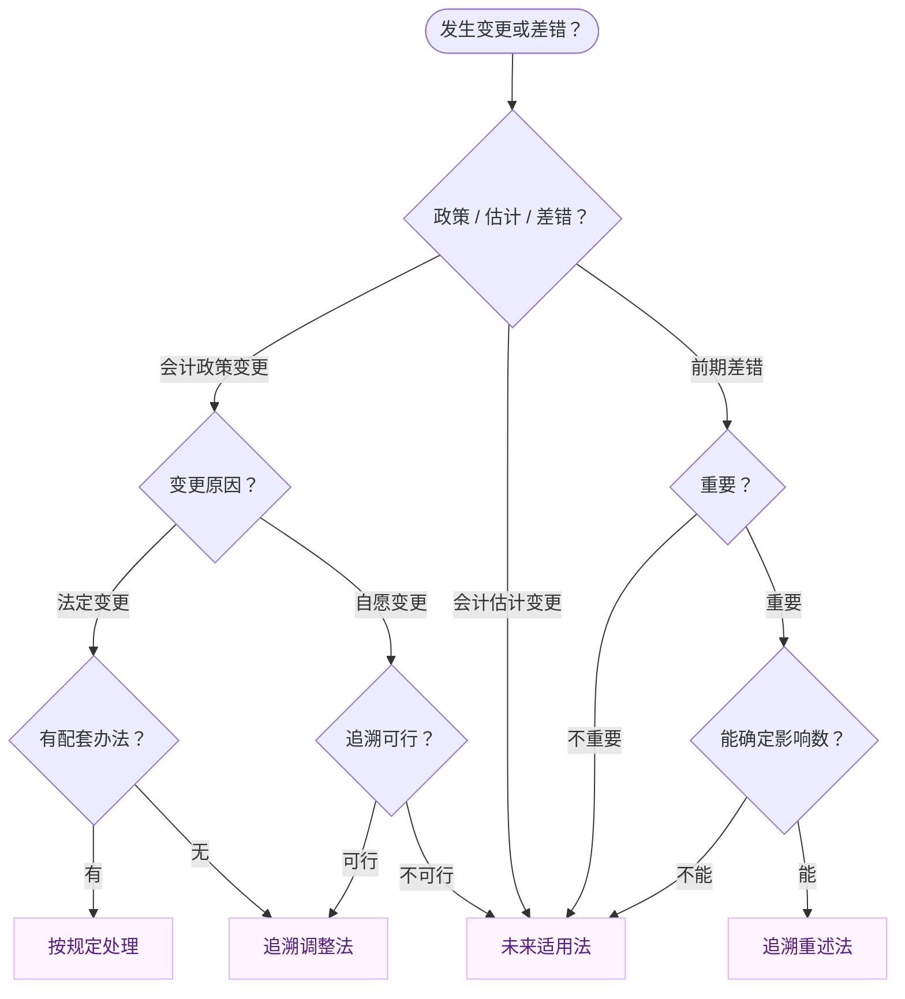
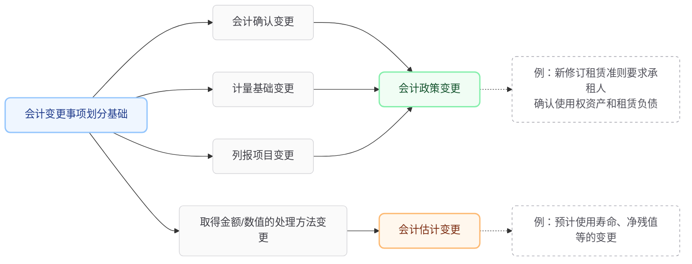
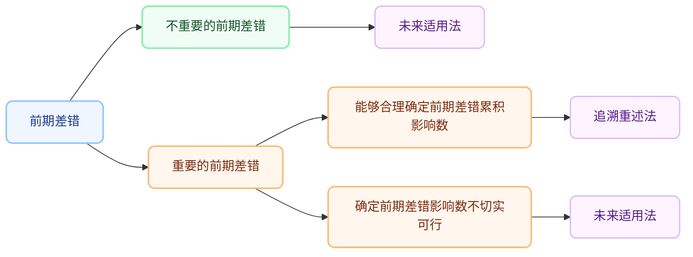

---
type:
  - note
kind: Ref - 资源 / 摘录 / 工具
area: "[[学习]]"
project: "[[CPA会计]]"
tags:
  - 会计章节
created: 2026-02-27
---



```
发生了什么？
├── 会计政策变更
│   ├── 法定变更 → 有配套办法？→ 有：按规定 / 无：追溯调整法
│   └── 自愿变更 → 追溯可行？→ 可行：追溯调整法 / 不可行：未来适用法
├── 会计估计变更 → 直接：未来适用法（无条件）
└── 前期差错 → 重要？
    ├── 不重要 → 未来适用法
    └── 重要 → 能确定影响数？→ 能：追溯重述法 / 不能：未来适用法
```

# 一、会计政策及其变更

## （一）什么是会计政策

会计政策，是指企业在会计确认、计量和报告中所采用的原则、基础和会计处理方法。

- 原则，是指按照企业会计准则规定的、适合企业会计要素确认过程中所采用的具体会计原则。
	【举例】收入的确认原则：企业应当在履行了合同中的履约义务，即在客户取得相关商品控制权时确认收入。

- 基础，是指为了将会计原则应用于交易或事项而采用的基础，主要是计量基础，即计量属性，包括历史成本、重置成本、可变现净值、现值和公允价值等。

- 会计处理方法，是指企业按照法律、行政法规或者国家统一的会计制度等规定采用或者选择的、适合于本企业的具体会计处理方法。
	【举例1】确定发出存货的实际成本时可以在先进先出法、加权平均法或者个别计价法中进行选择。
	【举例2】收入准则规定，满足一定条件的情况下，按某一时间段内履行的履约义务确认收入。

- 除会计要素相关会计政策外，财务报表列报方面所涉及的编制现金流量表的直接法和间接法、合并财务报表合并范围的判断、分部报告中报告分部的确定等，也属于会计政策。
- 企业应当在会计报表附注中披露采用的重要会计政策，不具有重要性的会计政策可以不予披露。判断会计政策是否重要，应当考虑与会计政策相关的项目的性质和金额。
## （二）什么是会计政策变更

1. 会计政策变更，是指企业对相同的交易或事项由原来采用的会计政策改用另一会计政策的行为。
    *   发出存货计价方法的变更（先进先出变加权平均）。
    *   投资性房地产后续计量模式的变更（成本模式转公允价值模式）。
    *   合同履约进度的确定方法变更。

2. 会计政策变更的条件
	满足下列条件之一的，企业可以变更会计政策：
	1. 法律、行政法规或者国家统一的会计制度等要求变更。（法定变更）
	2. 会计政策变更能够提供更可靠、更相关的会计信息。（自愿变更）

3. 不属于会计政策变更的情形
	（1）本期发生的交易或者事项与以前相比具有**本质差别**而采用新的会计政策。
	- 因处置部分股权投资丧失了对子公司的控制导致长期股权投资的后续计量方法由成本法转换为权益法，不属于会计政策变更。
	- 将自用的办公楼改为出租，不属于会计政策变更，而是采用新的会计政策。
	（2）对初次发生的或不重要的交易或者事项采用新的会计政策。
	
> [!example] 例题·多选题
> 下列各项中，属于会计政策变更的有（　）。
>
> A. 投资性房地产后续计量由公允价值模式改为成本模式  
> B. 商品流通企业采购费用的会计处理由计入期间费用改为计入存货成本  
> C. 分期付款购买固定资产入账价值由购买价款改为购买价款的现值  
> D. 因追加投资投资方对被投资单位由重大影响转为控制，长期股权投资的后续计量由权益法改为成本法核算
>
> > [!check]- 答案与解析
> > 
> > **正确答案：BC**
> >
> > **深度解析：**
> >
> > **第一步：明确会计政策变更的核心要件**  
> > 会计政策变更需满足对**相同交易或事项**改用另一会计政策，且通常基于：① 法律或准则要求；② 提供更可靠、更相关的信息。排除因交易实质变化导致的核算方法改变。
> >
> > **第二步：逐项判定**
> > - **选项A：** 投资性房地产由公允价值模式改为成本模式，虽涉及会计政策变动，但准则明确规定**已采用公允价值模式计量的投资性房地产不得转回成本模式**，该变更本身被准则禁止，故不属于规范的会计政策变更范畴。
> > - **选项B：** 商品流通企业采购费用由计入期间费用改为计入存货成本，属于**存货成本计量方法**的变更，符合会计政策变更定义。
> > - **选项C：** 分期付款购买固定资产入账价值由购买价款改为购买价款的**现值**（即 $入账价值 = \sum \frac{未来付款额}{(1+折现率)^n}$），属于**计量基础**（历史成本→现值）的变更，符合会计政策变更定义。
> > - **选项D：** 因追加投资导致重大影响转为控制，属于**本期新发生的交易或事项**与以前具有本质差别（重大影响→控制）而采用新的会计政策，**不属于**会计政策变更，而是正常业务演变。
> >
> > **💡 易错点提示：**  
> > 区分"会计政策变更"与"新事项新处理"：选项D因股权比例变化导致核算方法改变（权益法→成本法），是**投资性质发生变化**所致；而选项B、C是对**相同业务**改变了会计确认与计量基础。

## （三）会计政策变更的会计处理

会计政策变更根据具体情况，分别按照下列规定处理：
1. 法定变更
	- 国家发布相关的会计处理办法，则按照国家发布的相关会计处理规定进行处理。
	- 国家没有发布相关的会计处理办法，则采用**追溯调整法**进行会计处理。
	
2. 自愿变更
	（1）追溯调整切实可行
		会计政策变更能够提供更可靠、更相关的会计信息的情况下，企业应当采用**追溯调整法**进行会计处理，将会计政策变更累积影响数调整列报前期最早**期初留存收益**，其他相关项目的期初余额和列报前期披露的其他比较数据也应当一并调整。
	（2）追溯调整不切实可行
		①确定会计政策变更对列报前期影响数不切实可行的，应当从可追溯调整的最早期间期初开始应用变更后的会计政策；
		②在当期期初确定会计政策变更对以前各期累积影响数不切实可行的，应当采用**未来适用法**处理。
                        
## （四）追溯调整法

1. 追溯调整法的概念
	追溯调整法，是指对某项交易或事项变更会计政策，视同该项交易或事项初次发生时即采用变更后的会计政策，并以此对财务报表相关项目进行调整的方法。

2. 比较财务报表的追溯调整
	- 对于比较财务报表期间的会计政策变更，应调整各期间净损益各项目和财务报表其他相关项目，视同该政策在比较财务报表期间一直采用。
	- 对于比较财务报表可比期间以前的会计政策变更的累积影响数，应调整比较财务报表最早期间的期初留存收益，财务报表其他相关项目的数字也应一并调整。 

> [!example] 例题·计算分析题
> 2×23年1月1日，甲公司以银行存款 **10 560万元** 购入一项房产并对外出租，将该房产作为投资性房地产核算，采用**成本模式**进行后续计量。该房产预计使用寿命为 **40年**，预计净残值为零，采用年限平均法计提折旧。
> 
> 2×25年1月1日，甲公司将投资性房地产的后续计量由成本模式变更为**公允价值模式**。当日，该房产的公允价值为 **12 560万元**。假定变更当月不再计提折旧。甲公司有确凿证据表明其公允价值能够持续可靠取得。
> 
> 假定税法规定：该房产折旧年限为 **20年**，预计净残值为零，采用年限平均法计提的折旧可在税前扣除。
> 
> 甲公司适用的所得税税率为 **25%**，未来期间能够产生足够的应纳税所得额。2×23年初不存在暂时性差异。不考虑其他税费及因素。
> 
> **要求：**
> （1）计算2×23年度应确认的递延所得税金额，并编制会计分录。
> （2）说明2×25年1月1日变更后续计量模式的会计处理原则。
> （3）计算2×25年1月1日变更模式应确认或转回的递延所得税金额。
> （4）计算该变更影响2×25年期初留存收益的金额。
> （5）编制2×25年1月1日变更模式相关的会计分录。
>
> > [!check]- 答案与解析
> > 
> > （1）2×23年度递延所得税处理
> > **第一步：计算账面价值与计税基础**
> > - **账面价值** $= 10,560 - 10,560 \div 40 = 10,296$（万元）
> > - **计税基础** $= 10,560 - 10,560 \div 20 = 10,032$（万元）
> > 
> > **第二步：计算递延所得税**
> > - **应纳税暂时性差异** $= 10,296 - 10,032 = 264$（万元）
> > - **应确认递延所得税负债** $= 264 \times 25\% = 66$（万元）
> > 
> > **会计分录：**
> > 借：所得税费用  $66$
> > 　贷：递延所得税负债  $66$
> > 
> > ---
> >  （2）会计处理原则
> > 投资性房地产后续计量模式由成本模式变更为公允价值模式，属于**会计政策变更**。应当进行**追溯调整**，将变更当日的公允价值与账面价值的差额，扣除所得税影响后，调整**期初留存收益**（盈余公积和未分配利润）。
> > 
> > ---
> >  （3）2×25年1月1日变更时递延所得税金额
> > **第一步：计算变更前后的暂时性差异**
> > - **变更前（2×24年末）账面价值** $= 10,560 - (10,560 \div 40) \times 2 = 10,032$（万元）
> > - **变更前（2×24年末）计税基础** $= 10,560 - (10,560 \div 20) \times 2 = 9,504$（万元）
> > - **变更后（2×25年初）账面价值** $= 12,560$（万元，即公允价值）
> > 
> > **第二步：计算递延所得税变动**
> > - **变更后总差异** $= 12,560 - 9,504 = 3,056$（万元）
> > - **变更后应有递延所得税负债余额** $= 3,056 \times 25\% = 764$（万元）
> > - **变更前已有余额** $= (10,032 - 9,504) \times 25\% = 132$（万元）
> > - **本次应补认递延所得税负债** $= 764 - 132 = 632$（万元）
> > 
> > ---
> >  （4）影响2×25年期初留存收益金额
> > - **税前影响额**（公允价值 - 原账面价值）$= 12,560 - 10,032 = 2,528$（万元）
> > - **税后影响额（即留存收益）** $= 2,528 \times (1 - 25\%) = 1,896$（万元）
> > 
> > ---
> >  （5）2×25年1月1日会计分录
> > 借：投资性房地产——成本  $12,560$
> > 　　投资性房地产累计折旧  $528$ ($264 \times 2$)
> > 　贷：投资性房地产  $10,560$
> > 　　　递延所得税负债  $632$
> > 　　　盈余公积  $189.6$ ($1,896 \times 10\%$)
> > 　　　利润分配——未分配利润  $1,706.4$ ($1,896 \times 90\%$)
> > 
> > **💡 易错点提示：**
> > 1. **模式变更方向**：成本转公允是会计政策变更（追溯调整），但公允转成本是不允许的。
> > 2. **折旧年限差异**：注意会计（40年）与税法（20年）折旧年限不同，在成本模式下也会产生暂时性差异。
> > 3. **追溯调整科目**：政策变更调整的是"盈余公积"和"未分配利润"，不能计入"其他综合收益"或"公允价值变动损益"。

## （五）未来适用法

- 未来适用法，是指将变更后的会计政策应用于变更日及以后发生的交易或者事项，或者在会计估计变更当期和未来期间确认会计估计变更影响数的方法。
- 在未来适用法下，不需要计算会计政策变更产生的累积影响数，也无须重编以前年度的财务报表。
# 二、会计估计及其变更 

## （一）会计估计的概念

会计估计，是指企业对结果不确定性的交易或者事项以最近可利用的信息为基础所作的判断。

下列各项，通常属于会计估计：
- （1）存货可变现净值的确定。
- （2）采用公允价值模式下的投资性房地产公允价值的确定。
	- 投资性房地产采用公允价值模式进行后续计量，属于会计政策。
- （3）固定资产的预计使用寿命与净残值；固定资产的折旧方法、弃置费用的确定。
- （4）使用寿命有限的无形资产的预计使用寿命、残值、摊销方法。
- （5）非货币性资产公允价值的确定。 
- （6）固定资产、无形资产、长期股权投资等非流动资产可收回金额的确定。
- （7）职工薪酬的确定。
- （8）与股份支付相关的公允价值的确定。
- （9）与债务重组相关的公允价值的确定。
- （10）预计负债金额的确定。
- （11）收入金额中交易价格的确定、履约进度的确定（投入法或产出法）等。
- （12）与政府补助相关的公允价值的确定。
- （13）一般借款资本化金额的确定。
- （14）应纳税暂时性差异和可抵扣暂时性差异的确定。
- （15）与非同一控制下企业合并相关的公允价值的确定。
- （16）租赁资产公允价值的确定、租赁付款额现值的确定、承租人折现率的确定、承租人对未确认融资费用的分摊、出租人对未实现融资收益的分配、未担保余值的确定。
- （17）与金融工具相关的公允价值的确定、摊余成本的确定、信用减值损失的确定。
- （18）继续涉入所转移金融资产程度的确定、金融资产所有权上风险和报酬转移程度的确定。
- （19）套期工具和被套期项目公允价值的确定。
- （20）其他按照会计估计规定属于会计估计的情况。

 企业应当在会计报表附注中披露重要的会计估计，不具有重要性的会计估计可以不披露。

## （二）会计估计变更的概念

会计估计变更，是指由于资产和负债的当前状况及预期经济利益和义务发生了变化，从而对资产或负债的账面价值或者资产的定期消耗金额进行调整。

- （1）变更金融工具减值的预期信用损失率；
- （2）变更产品保修费用的计提比例；
- （3）变更固定资产的使用寿命。

如果以前期间的会计估计是错误的，则属于前期差错，按前期差错更正的会计处理方法进行处理。

## （三）会计政策变更与会计估计变更的区分(考试重点)




## （四）会计估计变更的会计处理

企业对会计估计变更应当采用**未来适用法**处理。
（1）会计估计的变更仅影响变更当期的，其影响数应当在变更当期予以确认。
（2）会计估计的变更既影响变更当期又影响未来期间的，其影响数应当在变更当期和未来期间予以确认。
（3）企业通过判断会计政策变更和会计估计变更划分基础仍然难以对某项变更进行区分的，应当将其作为会计估计变更处理。

> [!example] 例题·计算分析题
> 甲公司有一台管理用设备，原值为8 400万元，预计使用寿命为8年，预计净残值为400万元，自2×21年1月1日起采用年限平均法计提折旧。假定税法规定该固定资产计提折旧的方法、预计使用寿命及净残值与会计上述规定相同。
> 2×25年1月，由于新技术的发展等原因，甲公司对原预计使用寿命和净残值作出了重新估计，重新估计的预计使用寿命为6年，预计净残值为200万元。
> 甲公司适用的所得税税率为25%，预期在未来期间不会发生变化。在有关可抵扣暂时性差异转回期间内，甲公司能够产生足够的应纳税所得额用以抵扣可抵扣暂时性差异的所得税影响。假定甲公司每年年末计提当年固定资产折旧。不考虑其他因素。
> 
> > [!check]- 答案与解析
> > 
> > **深度解析：**
> > 
> > **第一步：分析会计估计变更对固定资产折旧的影响**
> > 2×25年初固定资产累计折旧 = $(8 400 - 400) \div 8 \times 4 =$ **$4 000$**（万元）
> > 固定资产**账面价值** = $8 400 - 4 000 =$ **$4 400$**（万元）
> > 会计估计变更后，2×25年**应计提的折旧费用** = $(4 400 - 200) \div (6 - 4) =$ **$2 100$**（万元）
> > 
> > *2×25年12月31日甲公司编制会计分录如下：*
> > 借：管理费用　　　　　　　　  　**2 100**
> > 　贷：累计折旧　　　　　　　   　 **2 100**
> > 
> > **第二步：分析会计估计变更对所得税的影响**
> > ① 若按原会计估计处理：
> > 2×25年末该固定资产的账面价值 = $4 400 - 1 000 =$ **$3 400$**（万元）
> > **计税基础** = $4 400 - 1 000 =$ **$3 400$**（万元），**无暂时性差异**。
> > 
> > ② 会计估计变更后：
> > 2×25年末该固定资产的账面价值 = $4 400 - 2 100 =$ **$2 300$**（万元）
> > **计税基础** = $4 400 - 1 000 =$ **$3 400$**（万元）
> > 产生**可抵扣暂时性差异** **1 100** 万元（$3 400 - 2 300$），应确认**递延所得税资产** **275** 万元（$1 100 \times 25\%$）。
> > 
> > *2×25年12月31日甲公司编制会计分录如下：*
> > 借：递延所得税资产　　　　　　　　**275**
> > 　贷：所得税费用　　　　　　　　　　**275**
> > 
> > **第三步：计算估计变更对净利润的影响**
> > 此估计变更影响2×25年度**净利润**的金额 = $(1 000 - 2 100) + 275 =$ **$-825$**（万元）。
> > 
> > **💡 易错点提示：**
> > **会计估计变更不影响变更期间的当期所得税，但可能会影响变更期间的递延所得税。**（注：税法通常不认可会计估计变更，计税基础仍按原估计计算，从而导致账面价值与计税基础不一致，产生暂时性差异。）

> [!example] 例题·单选题
> 甲公司2×14年12月购入管理部门使用的设备一台，原价为84 000元，预计使用年限为8年，预计净残值为4 000元，采用直线法计提折旧。2×19年1月1日考虑到技术进步因素，将原估计的使用年限改为6年，净残值改为2 000元，折旧方法由直线法改为双倍余额递减法。甲公司适用的所得税税率为25%，采用资产负债表债务法进行所得税核算。假定上述变更得到税务部门的认可。由于上述会计估计变更对2×19年净利润的影响金额为（　）。
> 
> A. －11 000元  
> B. －8 250元  
> C. 8 250元  
> D. －2 750元
>
> > [!check]- 答案与解析
> > 
> > **正确答案：B**
> > **第一步：计算变更前的累计折旧及账面价值**
> > - 原年折旧额 = $\frac{84,000 - 4,000}{8} = 10,000$元
> > - 已计提折旧期间：2×15年至2×18年，共**4年**
> > - 累计折旧 = $10,000 \times 4 = 40,000$元  
> > - 2×19年初账面价值 = $84,000 - 40,000 = 44,000$元
> >
> > **第二步：计算变更后2×19年折旧额（未来适用法）**
> > 会计估计变更采用**未来适用法**，以变更日账面价值为基础重新计算：
> > - 剩余使用年限 = 新预计总年限**6年** - 已使用年限**4年** = **2年**
> > - 双倍余额递减法下，当剩余使用年限为2年时（即处于最后两年），应改为**直线法**：
> > - 2×19年折旧额 = $\frac{44,000 - 2,000}{2} = 21,000$元
> >
> > **第三步：计算对净利润的影响金额**
> > - 折旧增加额 = $21,000 - 10,000 = 11,000$元
> > - 利润总额减少**11,000元**
> > - 所得税费用减少 = $11,000 \times 25\% = 2,750$元  
> > - **净利润减少** = $11,000 - 2,750 = \mathbf{8,250}$元（或表示为 $-11,000 \times (1-25\%) = -8,250$元）
> >
> > **💡 易错点提示：**
> > 1. **未来适用法**：会计估计变更不追溯调整以前年度，以变更日**账面价值44,000元**为基础按新政策计算后续折旧，而非重新计算前4年折旧
> > 2. **双倍余额递减法的转换时点**：当剩余使用年限为2年时，属于折旧年限的"最后两年"，应转为直线法（将扣除净残值后的金额平均摊销），而非按 $44,000 \times \frac{2}{6}$ 计算
> > 3. **所得税影响方向**：折旧增加导致利润总额减少，所得税费用随之减少（抵减效应），因此净利润影响 = 折旧增加额 $\times (1-25\%)$，结果为**负数**（净利润减少）
> > 4. **已使用年限界定**：2×14年12月购入，当月增加的固定资产次月（2×15年1月）起计提折旧，至2×19年1月1日变更时已满**4年**而非5年

# 三、前期差错及其更正

前期差错，是指由于没有运用或错误运用下列两种信息，而对前期财务报表造成省略或错报：
- （1）编报前期财务报表时预期能够取得并加以考虑的可靠信息；
- （2）前期财务报告批准报出时能够取得的可靠信息。



追溯重述法，是指在发现**重要的**前期差错时，视同该项前期差错**从未发生过**，从而对**财务报表相关项目**进行**更正**的方法。
- **追溯调整法** → 政策变了，按新政策"重新算一遍"
- **追溯重述法** → 之前算错了，"改错"，视同从来没错过

比较财务报表的追溯重述
- （1）在编制比较财务报表时，对于比较财务报表期间的重要的前期差错，应调整各该期间的净损益和其他相关项目，视同该差错在产生的当期已经更正；
- （2）对于比较财务报表期间以前的重要的前期差错，应调整比较财务报表最早期间的期初留存收益，财务报表其他相关项目的数字也应一并调整。

> [!note] 理解
> 这段话的核心是：**发现了重要差错，要去"改历史"，但改到哪一年取决于差错发生在哪个时间段。**
> 
> 先说背景：你的财务报表通常会列两年的数据做对比，比如2025年报表里，会同时展示2025年和2024年的数据，这个2024年的数据就叫"比较财务报表期间"。
> 
> **两种情况：**
> 
> **情况①：差错发生在比较期间内（比如2024年）**
> → 直接去改那一年的净利润和相关科目
> → 视同"差错从来没发生过"，那一年的报表直接改干净
> 
> **情况②：差错发生在比较期间之前（比如2023年或更早）**
> → 那年的报表已经没法列出来了（太久了）
> → 只能把累积影响数，全部塞进"比较期间最早那年的期初留存收益"里
> → 相当于用期初余额来消化历史的锅

> [!example] 例题·单选题
> （2019年）甲公司注册地在乙市，在该市有大量的投资性房地产，由于地处偏僻，乙市没有活跃的房地产交易市场，无法取得同类或类似房地产的市场价格。以前年度，甲公司对乙市投资性房地产采用公允价值模式进行后续计量。经董事会批准，甲公司从20×9年1月1日起将投资性房地产的后续计量由公允价值模式改变为成本模式。假定投资性房地产后续计量模式的改变对财务报表的影响重大，甲公司正确的会计处理方法是（　）。
>
> A. 作为会计估计变更采用未来适用法进行会计处理  
> B. 作为会计政策变更采用追溯调整法进行会计处理，并相应调整可比期间信息  
> C. 作为会计政策变更采用未来适用法进行会计处理  
> D. 作为前期差错更正采用追溯重述法进行会计处理，并相应调整可比期间信息
>
> > [!check]- 答案与解析
> > 
> > **正确答案：D**
> > 
> > **第一步：判断变更的合规性**  
> > 根据《企业会计准则第3号——投资性房地产》规定，投资性房地产后续计量**不得**从公允价值模式变更为成本模式。这是会计准则的**禁止性规定**，企业不能基于董事会批准而自主选择此类变更。
> >
> > **第二步：定性处理性质**  
> > 由于甲公司从公允价值模式改为成本模式的行为**违反了会计准则规定**，属于**滥用会计政策**，应将其作为**前期差错**（而非会计政策变更或会计估计变更）进行会计处理。
> >
> > **第三步：确定会计处理方法**  
> > 假定该变更对财务报表的影响**重大**，根据《企业会计准则第28号——会计政策、会计估计变更和差错更正》，对于重大的前期差错，应当采用**追溯重述法**进行更正，并相应调整可比期间信息。
> >
> > **💡 易错点提示：**  
> > 不要看到"计量模式变更"就认为是会计政策变更。投资性房地产从公允价值模式转为成本模式是准则**明令禁止**的，属于会计差错。只有从成本模式转为公允价值模式（满足公允价值能够持续可靠取得条件时）才属于会计政策变更。
