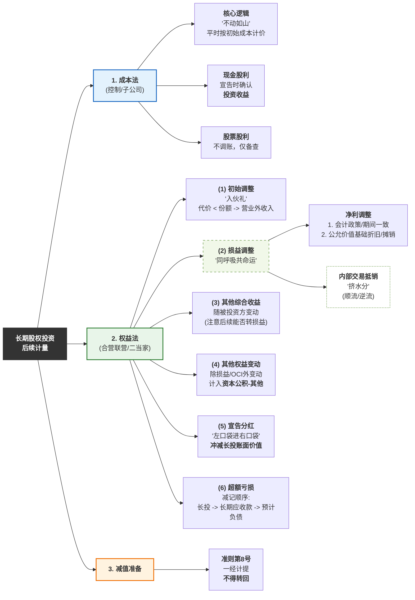
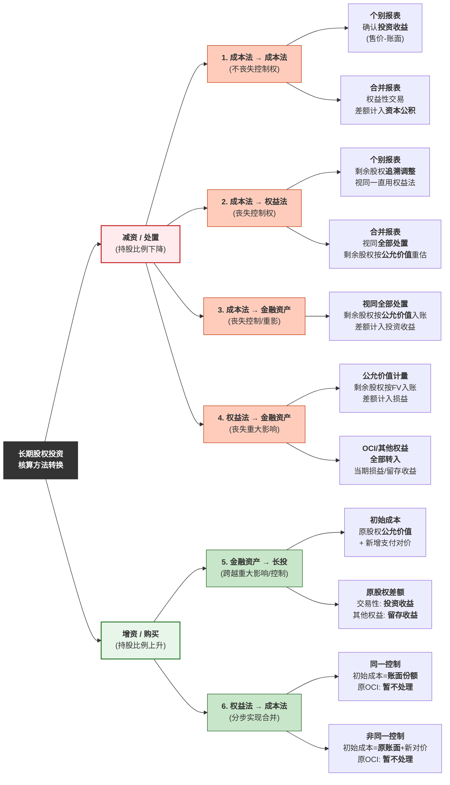

# 企业的股权投资分类
```mermaid
graph LR
    A[企业股权投资] --> B{对被投资单位有<br/>重大影响以上?};

    B -- "是<br/>(控制/重大影响/共同控制)" --> C["长期股权投资"];

    B -- "否" --> D{投资目的是?};

    D -- "短期交易" --> E["交易性金融资产"];
    D -- "长期持有" --> F["其他权益工具投资"];

     --- 主分支：非企业合并 ---
    Root --> NonCombine["<b>1. 非企业合并</b><br/>联营/合营企业<br/>(权益法)"]
    
    NonCombine --> NC_Cash["<b>支付现金</b><br/>实际价款 + 直接税费"]
    NonCombine --> NC_Equity["<b>发行证券</b><br/>证券公允价值"]
    

    %% --- 主分支：企业合并 ---
    Root --> Combine["<b>2. 企业合并</b><br/>子公司<br/>(成本法)"]

    Combine --> SameControl("<b>同一控制</b><br/>集团内整合<br/>账面价值视角")
    Combine --> DiffControl("<b>非同一控制</b><br/>市场化并购<br/>公允价值视角")

    %% 同一控制细节
    SameControl --> SC_Cost["<b>初始成本</b><br/>被合并方在最终控制方<br/>合并报表中的<b>账面价值</b>份额 + 商誉"]
    SameControl --> SC_Diff["<b>差额处理</b><br/>调整资本公积<br/>(不足冲减留存收益)"]
    SameControl --> SC_Fee["<b>中介费</b><br/>计入管理费用"]

    %% 非同一控制细节
    DiffControl --> DC_Cost["<b>初始成本</b><br/>支付对价的<b>公允价值</b>"]
    DiffControl --> DC_Diff["<b>差额处理</b><br/>计入资产处置损益<br/>或投资收益"]
    DiffControl --> DC_Fee["<b>中介费</b><br/>计入管理费用"]

    %% --- 样式美化 ---
    style Root fill:#333,stroke:#333,stroke-width:2px,color:#fff
    style NonCombine fill:#e8f5e9,stroke:#2e7d32,stroke-width:2px
    style Combine fill:#e3f2fd,stroke:#1565c0,stroke-width:2px
    
    style SameControl fill:#fff9c4,stroke:#fbc02d,stroke-width:2px,stroke-dasharray: 5 5
    style DiffControl fill:#ffe0b2,stroke:#ef6c00,stroke-width:2px,stroke-dasharray: 5 5
```
## 1.1 对联营、合营企业的初始计量
### 1.1.1.支付现金取得

- 以支付现金取得的长期股权投资，应当按照**实际支付的购买价款**作为长期股权投资的初始投资成本。
- 初始投资成本包括与取得长期股权投资直接相关的费用、税金及其他必要支出，但所支付的价款中包含的被投资单位已宣告但尚未发放的现金股利或利润应作为应收股利核算，不构成取得长期股权投资的成本。
### 1.1.2 发行权益性证券取得

- 以发行权益性证券方式取得的长期股权投资，其成本为所**发行权益性证券的公允价值**，但不包括被投资单位已宣告但尚未发放的现金股利或利润。
- 为发行权益性证券支付给有关证券承销机构等的手续费、佣金等与权益性证券发行直接相关的发行费用，不构成取得长期股权投资的成本。该部分费用应自权益性证券的**溢价发行收入中扣除**，权益性证券的溢价收入（资本公积）不足冲减的，应依次冲减盈余公积和未分配利润。
> [!example] 例题·单选题
> A公司通过定向增发普通股，自B公司原股东处取得B公司30%的股权，能够对B公司施加重大影响。该项交易中，A公司定向增发股份的数量为 $1\,000$ 万股（每股面值 $1$ 元，公允价值为 $2$ 元），发行股份过程中向证券承销机构支付佣金及手续费共计 $50$ 万元。除发行股份外，A公司还承担了B公司原股东对第三方的债务 $500$ 万元（未来现金流量的现值）。取得投资时，B公司股东会已通过利润分配方案，A公司可取得 $120$ 万元。不考虑其他因素，A公司对B公司长期股权投资的初始投资成本为（　）。
>
> A. $1\,950$ 万元
> B. $2\,050$ 万元
> C. $2\,380$ 万元
> D. $2\,500$ 万元
>
> > [!check]- 答案与解析
> > 
> > **正确答案：C**
> >
> > **深度解析：**
> > **第一步：确定初始投资成本的构成**
> > 非企业合并方式下取得的长期股权投资，以支付对价的**公允价值**作为初始投资成本。
> > 1. 发行权益性证券（股票）的公允价值：$1\,000 \times 2 = 2\,000$ 万元。
> > 2. 承担债务的价值：$500$ 万元。
> >
> > **第二步：处理特殊项目（扣除项与不计入项）**
> > 1. **已宣告但尚未发放的现金股利**：支付对价中包含的 $120$ 万元股利，应单独确认为 **“应收股利”**，不能计入长期股权投资成本。
> > 2. **发行权益性证券的手续费**：支付给承销机构的 $50$ 万元，属于发行股票的交易费用，应冲减 **“资本公积——股本溢价”**，**不计入**长期股权投资的初始成本。
> >
> > **第三步：计算最终金额**
> > $$初始投资成本 = \text{股票公允价值} + \text{承担债务} - \text{包含的股利}$$
> > $$2\,380 = 2\,000 + 500 - 120 \text{（万元）}$$
> >
> > **💡 易错点提示：**
> > 考生常犯错误是将**发行手续费（50万）** 计入成本（误选D）或从成本中扣除。请牢记：发行股票/债券的手续费是冲减权益或计入负债初始确认金额，与资产购置成本无关；同时注意剔除**“价中股”** 。

## 1.2同一控制下控股合并
### 1.2.1支付现金

- 在合并日按照被合并方所有者权益在最终控制方合并财务报表中**账面价值**的份额作为长期股权投资的初始投资成本。
- 长期股权投资的初始投资成本与支付的现金、转让的非现金资产及所承担债务账面价值之间的**差额，应当调整资本公积**（资本溢价或股本溢价）；资本公积（资本溢价或股本溢价）不足冲减的，依次冲减盈余公积和未分配利润。
- 合并方**为企业合并发生**的审计、法律服务、评估咨询等中介费用以及其他相 关管理费用，应当于发生时计入**当期损益（管理费用）**。
```
借：长期股权投资
      贷：银行存款
            资本公积---股本溢价
```

> [!faq]- 为什么同一控制下初始确认的差额计入资本公积？
>  - 重点在于**权益性交易**
> - 因为同一控制下的合并，本质上是**集团内部资源的重新整合**，不是真正的市场交易。所以，**多付或少付的钱，不能算“赚”或“亏”**，只能算**集团内部权益的重新分配**，因此调整**资本公积**（所有者权益科目），避免影响利润表。
### 1.2.2发行权益性证券

- 按合并日被合并方所有者权益在最终控制方合并财务报表中**账面价值**的份额确认长期股权投资。
- 按照发行权益性证券的面值总额作为股本，长期股权投资初始投资成本与所发行权益性证券面值总额之间的**差额，应当调整资本公积**（资本溢价或股本溢价）；资本公积（资本溢价或股本溢价）不足冲减的，依次冲减盈余公积和未分配利润。
> [!faq]- 中介费用与发行费用的区别是什么？
> **中介费用：当期损益（管理费用）**
> **发行费用：冲资本公积**
> 
> 1. 发行费用（Issuance Fees）：为“自己”筹钱付的“装修费”
> 这是什么？
> 想象一下，咱们公司要发行新股票或者发行债券来筹集资金（比如为了扩大规模、做大项目）。
> 在这个过程中，会请证券公司、律师事务所、会计师事务所来帮忙，比如承销费、上市辅导费、审计费、法律费等等。这些直接为了发行证券、筹集资金而发生的费用，就叫做发行费用。
> 为什么冲资本公积？
> 因为这些费用不是公司日常经营产生的“消耗”，而是为了增加公司的资本而发生的“成本”。
> 它们直接减少了公司实际筹集到的资本金额。所以，会计上不把它当成当期的“亏损”（费用），而是直接从“资本公积”或“股本溢价”里冲减。
> 打个比方：你卖房子，本来能卖 100 万，但为了尽快卖出去，找了中介，中介费花了 2 万。你实际到手的是 98 万。这 2 万不是你“花掉”的，而是你“少收”的。发行费用也是类似，是发行证券“少收”的钱。
> 2. 中介费用（Intermediary Fees）：为“特定业务”请的“专业顾问费”
> 这是什么？
> 这通常是指在具体的业务活动中，聘请外部专业机构（比如律师、会计师、咨询公司）提供的服务所支付的费用。
> 在长期股权投资这个场景里，最常见的就是：
> 收购股权时：请投行、律师做尽职调查、评估、谈判的费用。
> 合并报表时：请咨询公司进行合并方案设计的费用。
> 为什么计入当期损益（管理费用）？
> 因为这些费用是为了取得当期的收益或完成当期的业务而发生的。它们是公司经营活动的一部分。
### 1.2.3被合并方为最终控制方以前年度从外部第三方并购取得的情况

视同合并后形成的报告主体自最终控制方开始实施控制时起，一直是一体化存续下来的，应以被合并方的资产、负债（**包括最终控制方收购被合并方而形成的商誉**）在最终控制方财务报表中的账面价值为基础，进行相关会计处理。

长期股权投资的初始投资成本=被合并方在合并日按购买日公允价值持续计算的应纳入最终控制方合并财务报表的可辨认净资产价值×合并方持股比例
						+购买日最终控制方控股合并被合并方而形成的商誉。

> [!example]- 例题
> 甲公司系乙公司的母公司。2×23年1月1日，甲公司以银行存款4800万元从本集团外部购入丁公司80%股权（属于非同一控制下控股合并）并能够控制丁公司。购买日，丁公司可辨认净资产的公允价值为5000万元，账面价值为3500万元。丁公司可辨认净资产的公允价值与账面价值的差额系由一项管理用固定资产所致，该项固定资产在购买日的账面价值为1000万元，公允价值为2500万元，其他各项可辨认资产、负债的账面价值与公允价值相等。该固定资产自购买日尚可使用寿命为10年，采用年限平均法计提折旧，预计净残值为零。
> 
> 2×25年1月1日，乙公司以银行存款5600万元购入甲公司所持丁公司的80%股权，形成同一控制下的控股合并。2×23年1月1日至2×24年12月31日，丁公司累计实现净利润1800万元，无其他所有者权益变动。2×25年1月1日，丁公司可辨认净资产的公允价值为7000万元。不考虑其他因素。
> 
> ①2×25年1月1日，丁公司按照购买日账面价值计算的净资产=3500+1800=5300（万元）。
> ②2×25年1月1日，丁公司按购买日公允价值持续计算的应纳入最终控制方合并财务报表的可辨认净资产价值=5000+[1800-（2500-1000）/10×2]=5000+1500=6500（万元）。③2×25年1月1日（合并日）乙公司购入丁公司80%股权的初始投资成本=6500×80%+甲公司收购丁公司而形成的商誉（4800-5000×80%）=5200+800=6000（万元）。
> ④2×25年1月1日（合并日）乙公司会计处理如下：
> ```
> 借：长期股权投资                6 000
> 贷：银行存款                    5 600
> 资本公积——股本溢价          400
> ```
> 
### 1.2.4多次交易分步取得股权最终形成同一控制下的控股合并（例如：20%+40%=60%）

- 在合并日，合并方应根据合并后应享有被合并方所有者权益在最终控制方合并财务报表中**账面价值**的份额，作为长期股权投资的初始投资成本。
- 初始投资成本与其原长期股权投资账面价值加上合并日为取得新的股份所支付对价的账面价值之和**的差额，调整资本公积**（资本溢价或股本溢价），资本公积（资本溢价或股本溢价）不足以冲减的，依次冲减盈余公积和未分配利润。
- **卖掉旧的20%**，重新买60%。
> [!example]- 例题
> 2×23年1月1日，甲公司支付银行存款3800万元取得乙公司20%的股份，能够对乙公司施加重大影响。同日乙公司净资产账面价值为16000万元（与公允价值相等）。2×23年度，乙公司实现净利润2000万元，甲公司与乙公司未发生内部交易，无其他所有者权益变动。
> （1）2×23年1月1日，甲公司取得乙公司20%股份：
> ```
> 借：长期股权投资——投资成本    3 800
> 贷：银行存款                    3 800
> ```
> （2）2×23年度，乙公司实现净利润2 000万元，无其他所有者权益变动：
> ```
> 借：长期股权投资——损益调整      400
> 贷：投资收益        （2 000×20%）400
> ```
> 2×24年1月1日，甲公司支付银行存款6000万元购入同一集团内另一企业丙公司持有的乙公司40%股权。丙公司原持有乙公司80%的股权。2×24年1月1日，乙公司在最终控制方P公司合并财务报表中净资产的账面价值为18000万元，可辨认净资产的公允价值为19000万元。进一步取得投资后，甲公司对乙公司实施控制。甲公司与乙公司采用的会计政策相同。甲、乙和丙公司一直同受最终控制方P公司的控制。假定上述交易不属于一揽子交易。不考虑其他因素。
> （3）2×24年1月1日，甲公司购买同一集团内另一企业丙公司持有的乙公司40%股权：
> ①合并日甲公司长期股权投资（60%）的初始投资成本=18000×60%=10800（万元）
> ②原20%长期股权投资的账面价值=3800+2000×20%=4200（万元）
> ③甲公司进一步取得乙公司40%股权支付对价的账面价值为6000万元
> ④调整资本公积（股本溢价）的金额（差额）=18000×60%-（4200+6000）=600（万元）。
> 2×24年1月1日，甲公司会计处理如下：
> ```
> 借：长期股权投资（18 000×60%）10 800
> 贷：长期股权投资——投资成本    3 800
>                ——损益调整      400
>     银行存款                    6 000
>     资本公积——股本溢价          600
> ```
## 1.3 非同一控制下控股合并
### 1.3.1 支付资产或承担负债

- 应在购买日按**企业合并成本**（不含应自被投资单位收取的现金股利或利润），借记“长期股权投资”科目，按享有被投资单位已宣告但尚未发放的现金股利或利润，借记“应收股利”科目，按支付合并对价的账面价值，贷记有关资产或负债科目，按其差额，贷记或借记“资产处置损益”或“投资收益”等科目。
- 购买方为企业合并发生的审计、法律服务、评估咨询等中介费用，应借记“管理费用”科目，贷记“银行存款”等科目。
### 1.3.2发行权益性证券
```
借：长期股权投资（发行的权益性证券的公允价值）
　贷：股本
　　　资本公积——股本溢价
借：管理费用（中介费用）
　　资本公积——股本溢价（发行费用）
　贷：银行存款
```
### 1.3.3多次交易分步实现非同一控制下控股合并

通过多次交易分步取得股权，最终形成非同一控制下控股合并的，购买方在个别财务报表中，应以购买日之前所持被购买方的股权投资的**账面价值**（原股权投资为权益法核算的长期股权投资）或**公允价值**（原股权投资为金融资产）与购买日新增投资成本之和，作为该项投资的初始投资成本。

> [!example] 例题·多选题
> 投资方因追加投资等原因能够对非同一控制下的被投资单位实施控制的，假定不构成“一揽子交易”，企业进行的下列各项在个别报表的会计处理中，正确的有（　）。
> 
> A. 由公允价值计量转换为长期股权投资成本法的，应当按照原持有的股权投资公允价值加上新增投资成本之和，作为改按成本法核算的初始投资成本
> B. 由公允价值计量转换为长期股权投资成本法的，购买日之前持有的股权投资按照金融工具确认和计量准则的有关规定进行会计处理的，原累计计入其他综合收益的公允价值变动应当在处置股权时转入当期损益
> C. 由权益法转换为长期股权投资成本法的，应当按照原持有的股权投资账面价值加上新增投资成本之和，作为改按成本法核算的初始投资成本
> D. 由权益法转换为长期股权投资成本法的，购买日之前持有的股权投资因采用权益法核算而确认的其他综合收益，应当在购买日转入当期损益
>
> > [!check]- 答案与解析
> > 
> > **正确答案：AC**
> >
> > **深度解析：**
> > 本题考查的是**非同一控制下企业合并（多次交易分步实现控制）**在个别报表中的会计处理。
> > 
> > **1. 金融资产转换为成本法（$FV \rightarrow$ 成本法）：**
> > - **初始投资成本确定：** 应当按照原持有的股权投资在购买日的**公允价值**加上新增投资成本之和作为初始成本。即：$初始投资成本 = 公允价值_{原} + 投资成本_{新}$（选项 **A** 正确）。
> > - **后续处理：** 原持有的股权投资分类为金融资产的，其公允价值与账面价值之间的差额，以及原计入其他综合收益的累计公允价值变动，应当在**处置该项投资时**转入留存收益（选项 **B** 错误）。
> > 
> > **2. 权益法转换为成本法（权益法 $\rightarrow$ 成本法）：**
> > - **初始投资成本确定：** 应当按照原持有的股权投资**账面价值**加上新增投资成本之和作为初始成本。即：$初始投资成本 = 账面价值_{原} + 投资成本_{新}$（选项 **C** 正确）。
> > - **后续处理：** 购买日之前持有的股权投资因采用权益法核算而确认的其他综合收益、资本公积（其他资本公积），在购买日**暂不处理**，应当在**处置该项投资时**采用与被投资单位直接处置相关资产或负债相同的基础进行会计处理（选项 **D** 错误）。
> >
> > **💡 易错点提示：**
> > 1. **个别报表 vs 合并报表：** 在个别报表中，权益法转成本法是“**账面价值**”结转；而在合并报表中，则是按“**公允价值**”重新计量。
> > 2. **结转时点：** 个别报表中，原权益法下的“其他综合收益”或“资本公积”在购买日（达到控制时）**均不结转**，统一等到未来**处置股权时**再处理。

相关链接：[[A2-会计归纳/其他综合收益详解]]
参考本章第三节：核算方法的转换。
## 1.4 一项交易中同时涉及自最终控制方购买股权形成控制及自其它外部独立第三方购买股权的会计处理

简单来说，这一节讲的是 **“拼盘式”交易** 。当你一次性拿下的股权里，既有“自家人”（最终控制方）给的，又有“外人”（第三方）给的，你的**初始投资成本不能“一刀切”**，而要 **“分两步算，再加总”**。
- **动作一（定性）：** 你从“爸爸”（最终控制方）手里买了股权，拿到了控制权。
    - **性质：** **同一控制下企业合并**。
    - **计价原则：** 认祖归宗，看**账面价值**（在最终控制方合并报表中的份额）。
- **动作二（补充）：** 你顺便把“外人”（第三方）手里的股份也买过来了。
    - **性质：** 视为合并后**购买少数股东权益**。
    - **计价原则：** 亲兄弟明算账，看**实际支付的对价**（公允价值/花多少钱记多少）。
$$
\text{长投初始成本} = \underbrace{(\text{被合并方净资产账面价值} \times \text{自集团内取得的比例})}_{\text{同一控制部分：只看账面}} + \underbrace{\text{支付给第三方的实际价款}}_{\text{购买少数股权：只看花了多少钱}}
$$

> [!example]- 例题
> 为实现产业整合，减少同业竞争，2×24年4月1日，甲公司实施一项企业合并，与其控股股东A公司及独立第三方丙公司分别签订股权购买协议：从A公司购买其持有的乙公司60%股权；从丙公司购买其持有的乙公司20%少数股权。两项股权交易分别谈判，分别确定有关交易条款，不构成一揽子交易。
>  
> 甲公司自A公司取得的乙公司60%股权作价7 200万元，以定向发行本公司普通股为对价，双方约定甲公司普通股价格为4元/股，甲公司向A公司定向发行1 800万股（每股面值1元）。
> 
> 甲公司取得乙公司60%股权后，对乙公司实施控制。甲公司自丙公司取得乙公司20%股权作价2 500万元，以银行存款支付。上述相关股权于签订协议当日办理了工商变更手续。当日，乙公司所有者权益在最终控制方A公司合并财务报表中的账面价值为9 000万元。不考虑其他因素。
>  要求：
>  （1）判断甲公司合并乙公司交易的性质，并说明理由。
> （2）确定甲公司对乙公司长期股权投资的初始投资成本，并编制与确认该项股权投资相关的会计分录。
> 【答案】
>  （1）①甲公司取得乙公司60%股权，能够形成控制，属于同一控制下的企业合并。
> 理由：甲公司与乙公司合并前后均受A公司最终控制，且非暂时性的，属于同一控制下的企业合并。
> ②自丙公司取得的乙公司20%股权，视为形成同一控制下企业合并后购买少数股东股权，不属于企业合并。
>  理由：自丙公司取得的乙公司20%股权，不涉及控制权的转移，不产生报告主体的变化，不属于企业合并。
> （2）甲公司对乙公司长期股权投资的初始投资成本=9000×60%=5 400（万元）；追加投资后，长期股权投资的账面价值=5 400+2 500=7 900（万元）。
>  ```
> 借：长期股权投资　　　　（5 400+2 500）7 900
> 贷：股本 　　　　　　　　　　　1 800
> 	资本公积——股本溢价（5 400-1 800）3 600
> 	银行存款　　　　　　　　 　2 500
> ```
> 这里的资本公积，实际上只反映了“同一控制下”那部分的溢价/折价，因为第三方那部分是“借贷相等”的（资产换资产），不会产生资本公积差额。
# 2.后续计量




---
## 2.1成本法

1. 初始投资或追加投资时，按照初始投资或追加投资时的成本增加长期股权投资的账面价值。
2. 现金股利的处理（持有期间）
	- 除取得投资时实际支付的价款或对价中包含的已宣告但尚未发放的现金股利或利润外，投资企业应当按照享有被投资单位宣告发放的现金股利或利润**确认投资收益**，不管有关利润分配属于对取得投资前还是取得投资后被投资单位实现净利润的分配。
```
借：应收股利
    贷：投资收益
借：银行存款  
 贷：应收股利
```
3. 股票股利的处理
	- 子公司分派股票股利的，投资方不进行账务处理，但应在备查簿中登记，注明所增加的股数，以反映股份的变化情况。
## 2.2权益法

- 投资方对联营企业和合营企业的长期股权投资，应采用权益法核算。
- 风险投资机构、共同基金以及类似主体可以根据长期股权投资准则，将其持有的对联营企业或合营企业投资在初始确认时，确认为**以公允价值计量且其变动计入当期损益**的金融资产，以向财务报表使用者提供比权益法更有用的信息。
### 2.2.1初始投资成本的调整

- 长期股权投资的初始投资成本**小于**取得投资时应享有被投资单位可辨认净资产公允价值份额的，两者之间的差额应计入取得投资当期的==营业外收入==，同时调整增加长期股权投资的账面价值。
```
借：长期股权投资——投资成本（初始投资成本）
　贷：银行存款等
借：长期股权投资——投资成本
　贷：营业外收入
```
### 2.2.2投资损益的确认

投资企业在确认应享有或应分担被投资单位的净利润或净亏损时，应在被投资单位**账面净利润**的基础上，考虑以下因素的影响并进行适当调整：
- 第一，被投资单位采用的会计政策及会计期间与投资企业是否一致
- 第二，取得投资时被投资单位有关资产的公允价值与账面价值是否相等
- 第三，在评估投资企业对被投资单位是否具有重大影响时，应当考虑潜在表决权的影响，但在确定应享有的被投资单位实现的净损益、其他综合收益和其他所有者权益变动的份额时，潜在表决权所对应的权益份额不应予以考虑
- 第四，在确认应享有或应分担的被投资单位净利润（或亏损）额时，法规或章程规定不属于投资企业的净损益应当予以剔除后计算。例如，被投资单位发行了分类为权益的可累积优先股等类似的权益工具，无论被投资单位是否宣告分配优先股股利，投资企业计算应享有被投资单位的净利润时，均应将归属于其他投资企业的累积优先股股利予以扣除。
- 第五，在确认投资收益时，除考虑公允价值的调整外，对于投资企业或纳入投资企业合并财务报表范围的子公司与其联营企业及合营企业之间发生的**未实现内部交易损益应予抵销**。
#### 1.  资产账面价值与公允价值不同的调整

以取得投资时被投资单位固定资产、无形资产的**公允价值为基础**计提的折旧额或摊销额，以及以投资企业取得投资时的**公允价值为基础**计算确定的资产减值准备金额等对被投资单位净利润的影响。
#### 2.  内部交易的调整

- 内部交易（无论顺流逆流）存在未实现损益，所以，个别报表处理是一样的冲销投资收益
- 考虑投资方编制合并报表时，首先明确2个大前提：**合并报表是站在“集团”的角度看问题**，另外联营企业实际上不会被纳入合并范围。
	- **顺流交易**：是你（母公司）卖给联营企业。在集团看来，你虚增了收入和成本。（抵消收入）
	- **逆流交易**：是联营企业卖给你。在集团看来，你虚增了资产价值。（抵消资产）
	- 合并报表是每年都编制的，相当于在当年的各个子公司报表基础上进行调整，所以每一年都要重新调整。

> [!tip] 合并报表抵销口诀
> **个别报表**都是“借投资收益，贷长投”，但在**合并报表**里要“还原真相”：
> 
> 1. **顺流（我卖）**：个别冲了投资收益，合并要把投资收益**加回来**（贷方），去冲**收入成本**。
>     - _效果：收入少记，成本少记。_
> 2. **逆流（它卖）**：个别冲了长投，合并要把长投**加回来**（借方），去冲**存货**。
>     - _效果：资产（存货）少记。_

**（1）逆流交易**

|           | 个别财务报表                                                         | 合并财务报表 (抵销资产)                         |
| :-------- | :------------------------------------------------------------- | :------------------------------------ |
| 出售资产的会计期间 | 确认的投资收益 = (净利润 - 未实现内部交易损益) × 持股比例<br>借：投资收益<br>贷：长期股权投资——损益调整 | 借: 长期股权投资<br>贷: 存货 (未实现内部交易损益 × 持股比例) |
| 以后会计期间    | 确认的投资收益 = (净利润 + 本期已实现内部交易损益) × 持股比例                           | 借: 长期股权投资<br>贷: 存货 (未实现内部交易损益 × 持股比例) |
> [!note]- 举例理解
> **场景**：联营企业（乙）把成本 60 的货，100 卖给你（甲）。你没卖出去，放在仓库里（存货账面 100）。
> 
> - **个别报表已做**：乙赚了 40，你按权益法本来该认 40×20%=8 的收益，但你把它冲了。
>     - `借：投资收益 8`
>     - `贷：长期股权投资 8`
> 
> **合并报表怎么想？**
> 
> 1. **看资产**：你账上的存货是 100，但站在集团角度（包含你对乙的权益），这批货的成本应该是 60。这存货里有 40 的水分，其中 20%（8块钱）是你必须挤掉的。
> 2. **看长投**：你在个别报表里贷记了“长期股权投资 8”，把长投账面价值减小了。但在合并报表看来，长投价值没问题，有问题的是**存货**！
> 3. **还原真相**：把个别报表那个“贷：长期股权投资”给**加回来**（借方），转而去冲减真正的罪魁祸首——**存货**。
> 
> **合并分录（背诵版）：**
> 
> ```text
> 借：长期股权投资    8
>     贷：存货            8
> ```
> 
> **深度解析（为什么借记长投？）：**
> 
> - 个别报表里你做了 `贷：长期股权投资 8`。
> - 合并报表里你做了 `借：长期股权投资 8`。
> - **一贷一借，抵消了！**
> - **最终效果**：你的“长期股权投资”科目没变，变的是你的“存货”减少了 8。这才是逆流交易在合并报表层面的**真实影响**——**挤掉了资产（存货）里的水分**。

> [!example] 例题·计算分析题
> $2 \times 23$ 年 $1$ 月 $2$ 日，甲公司取得乙公司 $20\%$ 有表决权的股份，能够对乙公司施加重大影响。甲公司取得该项投资时，乙公司各项可辨认资产、负债的公允价值与其账面价值相同。
> 
> $2 \times 23$ 年 $10$ 月 $20$ 日，乙公司将其成本为 $600$ 万元的某商品以 $900$ 万元的价格出售给甲公司，甲公司将取得的商品作为**固定资产**核算，预计使用寿命为 $10$ 年，采用年限平均法计提折旧，净残值为 $0$。
> 
> 至 $2 \times 23$ 年 $12$ 月 $31$ 日，甲公司未对外出售该固定资产。乙公司 $2 \times 23$ 年度实现净利润 $1600$ 万元。不考虑其他因素。
>
> > [!check]- 答案与解析
> > 
> > **1. 个别报表中的投资收益确认：**
> > 借：长期股权投资——损益调整 $261$
> > 　贷：投资收益 $261$
> > 
> > **2. 合并报表中的调整分录（逆流交易）：**
> > 借：长期股权投资——损益调整 $59$ （$295 \times 20\%$）
> > 　　固定资产——累计折旧 $1$ （$5 \times 20\%$）
> > 　贷：固定资产——原价 $60$ （$300 \times 20\%$）
> > 
> > **【深度解析】**
> > 
> > **第一步：计算未实现内部交易损益**
> > 乙公司出售给甲公司的内部交易利润为：$900 - 600 = 300$ 万元。
> > 
> > **第二步：计算折旧对损益的影响（已实现部分）**
> > 该固定资产在 $2 \times 23$ 年计提折旧的时间为 $2$ 个月（$11$ 月和 $12$ 月）。
> > 内部交易包含的利润通过折旧转销的金额为：$300 \div 10 \times 2/12 = 5$ 万元。
> > 
> > **第三步：调整后的净利润及投资收益**
> > 调整后的净利润 $= 1600 - (900 - 600) + 5 = 1305$ 万元。
> > 甲公司应确认的投资收益 $= 1305 \times 20\% = 261$ 万元。
> > 
> > **第四步：合并报表层面的特殊处理**
> > 在逆流交易中，由于未实现内部交易损益体现在**乙公司（被投资方）**的资产中，但在合并报表视角下，该损益应抵销的是**甲公司（投资方）**持有的资产价值中属于投资方的份额。
> > - 抵销固定资产原价中包含的未实现利润：$300 \times 20\% = 60$ 万元。
> > - 抵销多计提的折旧：$5 \times 20\% = 1$ 万元。
> > - 差额调整长期股权投资：$60 - 1 = 59$ 万元。
> > 
> > **💡 易错点提示：**
> > 1. **折旧起止时间**：固定资产当月增加当月不提，次月开始计提。本题 $10$ 月增加，应计提 $11$、$12$ 两个月的折旧。
> > 2. **逆流交易抵销对象**：在合并报表中，逆流交易抵销的是“固定资产”或“存货”，而顺流交易抵销的是“营业收入/营业成本”。
> > 3. **计算公式记忆**：调整后净利润 $=$ 账面净利润 $-$ (售价 $-$ 成本) $+$ 当年多提折旧。

**（2）顺流交易**
投资企业个别财务报表的处理：
```
借：投资收益（未实现内部交易损益×持股比例）
贷：长期股权投资——损益调整
```
投资企业合并财务报表的处理：
```
      a.投资企业向联营企业或合营企业投出或出售资产时：
      借：营业收入（内部交易收入×未出售比例×投资企业持股比例）
      贷：营业成本（内部交易成本×未出售比例×投资企业持股比例）
             投资收益（未实现内部交易损益×投资企业持股比例）
      b.后续期间，联营企业或合营企业将内部交易的相关资产向外部独立第三方出售时：
      借：投资收益（前期内部交易损益×本期出售比例×投资企业持股比例）
      　　营业成本（前期内部交易成本×本期出售比例×投资企业持股比例）
      　　贷：营业收入（前期内部交易收入×本期出售比例×投资企业持股比例）
```

> [!note]- 举例理解
> **场景**：你（甲）把成本 60 的货，100 卖给联营企业（乙，持股 20%）。乙没卖出去。
> 
> - **个别报表已做**：你觉得赚了 40，但按权益法，你把这 40 里的 20%（即 8 块钱）给冲掉了。
>     - `借：投资收益 8`
>     - `贷：长期股权投资 8`
> 
> **合并报表怎么想？**
> 
> 1. **看收入/成本**：你账上记了 100 的收入，60 的成本。但在集团看来，这货只是从你的左手倒到了右手（虽然右手是亲戚），这 100 的收入和 60 的成本里，有 20% 是完全没意义的“自嗨”。
> 2. **看投资收益**：你在个别报表里借记了“投资收益 8”，这不对。因为这 8 块钱的本质不是“投资收益减少”，而是“营业收入和成本虚增”。
> 3. **还原真相**：把个别报表那个“借：投资收益”给**抵消掉**（贷方），转而去冲减真正的源头——**营业收入**和**营业成本**。
> 
> **合并分录（背诵版）：**
> 
> ```text
> 借：营业收入    （售价 × 持股比例） = 100 × 20% = 20
>     贷：营业成本    （成本 × 持股比例） = 60 × 20% = 12
>         投资收益    （差额）           = 8
> ```
> 
> **深度解析（为什么贷记投资收益？）：**
> 
> - 个别报表里你做了 `借：投资收益 8`。
> - 合并报表里你做了 `贷：投资收益 8`。
> - **一借一贷，抵消了！**
> - **最终效果**：你的“投资收益”科目没变，变的是你的“营业收入”减少了 20，“营业成本”减少了 12。这才是顺流交易在合并报表层面的**真实影响**——**挤掉了虚增的收入和成本**。

> [!faq]- 为什么逆流交易后续期间会计分录一样，顺流交易则往回冲？
> **首先要搞清楚这里是权益法！合并报表中并不合并联营企业的资产负债！**
> 逆流交易调整影响的是资产负债表
> 	时点值。上期合并报表层面上冲掉100，今年实现了50，所以只需冲掉50就行。
> 顺流交易调整影响的利润表
> 	期间经营成果。上期合并层面未实现100，以及冲掉上期的100.今年实现50，所以今年的经营成果要冲回50

**（3）未实现内部交易损失**
投资企业与其联营企业及合营企业之间发生的无论是顺流交易还是逆流交易产生的未实现内部交易损失，其中属于**所转让的资产发生减值损失**的，有关的未实现内部交易损失在个别财务报表及合并财务报表中均不予抵销。
> [!example] 例题
> 甲公司持有乙公司20%有表决权的股份，能够对乙公司生产经营决策施加重大影响。2×23年8月，甲公司**将其账面价值500万元的商品以400万元的价格**出售给乙公司。有证据表明交易价格400万元与甲公司该商品账面价值500万元之间的差额是由于该资产发生了减值损失。2×23年资产负债表日，该批商品尚未对外部第三方出售。假定甲公司取得该项投资时，乙公司各项可辨认资产、负债的公允价值与其账面价值相同，两者在以前期间未发生过内部交易。乙公司2×23年度实现净利润2 000万元。不考虑其他因素。
> 
> ①甲公司2×23年度个别财务报表的会计处理
>  甲公司在确认应享有乙公司2×23年净损益时，有证据表明交易价格400万元与甲公司该商品账面价值500万元之间的差额是由于该资产发生了减值损失，那么在确认投资损益时不应予以抵销。甲公司应当进行的会计处理为：
>  借：长期股权投资——损益调整　（2 000×20%）400
> 贷：投资收益　　　　　　　　　　　400
>  ②甲公司2×23年度合并财务报表的会计处理
> 甲公司在编制2×23年度合并财务报表时，因向联营企业出售资产产生的未实现内部交易损失，属于**所转让资产发生的减值损失**，有关损失应予确认，**在合并财务报表中不予调整**。

**（4）** **构成业务**

**如果投资与被投资企业之间倒腾的不是“单个资产”，而是一整个“业务”（Business），那就别搞什么“挤水分”了，直接全额确认赚了多少钱！**
这是对前面讲的“顺逆流交易抵销”规则的**颠覆**。

- 核心结论：为什么这次不“挤水分”了？
	*   **之前的逻辑（单个资产）**：你卖给联营企业一台设备、一批存货。准则认为这只是资产在“泛家族”内部的转移，没卖给外人，所以利润是虚的，要抵销（挤水分）。
	*   **现在的逻辑（构成业务）**：你卖给联营企业的是**一个分公司、一条生产线、或者一个完整的项目公司**。
	    *   这不仅仅是资产的转移，而是**经营实体的交换**。
	    *   准则认为：**“业务”的买卖是动真格的战略行为**。当你把一个业务投出去换回股权时，这个业务就已经“卖”掉了，交易实质已经完成。
	    *   **结论**：**全额确认损益**（不用乘持股比例，也不用抵销）。

- 什么是“业务”？（关键判断）
	在会计上，“业务”不是指一堆砖头，而是指 **“投入 + 加工处理过程 + 产出”** 的组合。
	*   **不是业务**：你卖给联营企业 10 辆卡车。（这是卖资产）
	*   **是业务**：你把你旗下的“物流分公司”（包含 10 辆卡车、司机团队、运输线路许可、客户名单）整体打包转让给联营企业。（这是卖业务）

- **逆流交易**的处理
	- 投资企业应按企业合并准则的规定进行会计处理，投资企业应**全额确认**与交易相关的利得或损失。
- **顺流交易**的处理
	- 投出业务：投资企业向联营、合营企业投出业务（包括投资企业以投出业务形式设立联营企业或合营企业），投资企业因此取得长期股权投资但未取得控制权的，应以投出业务的公允价值作为新增长期股权投资的初始投资成本，**投出业务的公允价值**与**投出业务的账面价值**之间的差额，**全额计入当期损益**
	- 出售业务：投资企业向联营、合营企业出售业务，**取得的对价**与**业务的账面价值**之间的差额，**全额计入当期损益**
### 2.2.3 取得现金股利或利润的处理

按照权益法核算的长期股权投资，投资企业自被投资单位取得的现金股利或利润，应**抵减长期股权投资的账面价值**。
```
宣告现金股利：
借：应收股利
　贷：长期股权投资——损益调整
　
被投资单位分派现金股利的会计处理：
借：利润分配——应付现金股利或利润`
　贷：应付股利
```

> [!note] 权益法与成本法关于股利处理的对比
> 权益法的核心思想是：**被投资方就是你的一部分**。
> - **当被投资方赚钱时（净利润增加）：** 你的“钱包”（长期股权投资账面价值）跟着变鼓了。虽然钱还没到手，但根据权责发生制，你**必须立刻确认投资收益**。
>     - _分录：借：长期股权投资——损益调整；贷：投资收益_
> - **当被投资方分红时（宣告发钱）：** 相当于把你“钱包”里已经确认过的那部分钱，拿出来放到了你的“口袋”里（变成了现金或应收股利）。
>     - **本质：** 资产形态的转换（从“股权”变成了“债权/现金”），资产总额没变，所以**不能再次确认收益**，只能减少长期股权投资的账面价值。
> 成本法的核心思想是：**你投你的，我干我的**。
> - **当被投资方赚钱时：** 跟你没关系，你的账面价值不动，也不确认收益。
> - **当被投资方分红时：** 这才是你真正收到回报的时刻，此时才确认**投资收益**。

### 2.2.4其他综合收益的处理
`借：长期股权投资——其他综合收益`
　`贷：其他综合收益`
### 2.2.5被投资单位所有者权益其他变动的处理
`借：长期股权投资——其他权益变动`
　`贷：资本公积——其他资本公积`

 被投资单位除净损益、其他综合收益以及利润分配以外所有者权益的其他变动，主要包括：
	（1）被投资单位接受其他股东的资本性投入；资本公积（股本溢价）
	（2）被投资单位发行可分离交易的可转换公司债券中包含的权益成分；其他权益工具
	（3）以权益结算的股份支付等。资本公积（其他资本公积）
### 2.2.6 超额亏损的确认
```
借：投资收益
　贷：长期股权投资——损益调整
　　　长期应收款
　　　预计负债
```
- 除上述情况仍未确认的应分担被投资单位的损失，应在账外备查登记。
- 被投资单位在以后期间实现净利润或其他综合收益增加净额时，投资方应当按照以前确认或登记有关投资净损失时的**相反顺序**进行会计处理.
### 2.2.7股票股利的处理

被投资单位分派的股票股利，投资企业不作账务处理，但应于除权日注明所增加的股数，以反映股份的变化情况。
### 2.2.8  因被动稀释导致持股比例下降时“内含商誉”的结转

- “内含商誉”是指长期股权投资的初始投资成本大于投资时享有的被投资单位可辨认净资产公允价值份额的差额。
- 投资方因股权比例被动稀释而“间接”处置长期股权投资的情况下，相关“内含商誉”的结转应当**比照投资方直接处置**长期股权投资处理，即应当**按比例结转**初始投资时形成的“内含商誉”，并将相关股权稀释影响计入**资本公积（其他资本公积）**。
- 因股权被动稀释而计入资本公积（其他资本公积）的金额=投资企业因其他股东增资按被动稀释后持股比例应享有的份额（“间接”处置所得）-按“间接”处置比例结转的长期股权投资的账面价值（“间接”处置成本）。
 
> [!example]- 例题
> 2×21年1月1日，乙公司与丙公司签订股权转让协议，以银行存款40 200万元购入丙公司持有的A公司40%股权且对A公司具有重大影响。投资日，A公司可辨认净资产账面价值与公允价值均为90 000万元。2×21年度，A公司实现净利润20 000万元，分类为以公允价值计量且其变动计入其他综合收益的金融资产因公允价值增加计入其他综合收益的金额为2 000万元，无其他所有者权益变动。
> 
>  2×22年1月1日，A公司经股东大会批准进行重大资产重组，接受其他股东（丁公司）增资，A公司向丁公司定向增发A公司普通股股票15 000万股，每股发行价为12元。乙公司在该项重大资产重组后持有A公司的股权比例下降为16%，但仍能向A公司董事会派出董事并对A公司施加重大影响。
> 
>  2×22年1月1日，乙公司在股权被动稀释后，对A公司的长期股权投资进行了减值测试，未发生减值。假定乙公司与A公司适用的会计政策、会计期间相同，双方在当期及以前期间未发生其他内部交易。不考虑其他因素。
> 
> *本例中，因股权被动稀释，导致乙公司持有A公司的股权比例下降为16%，视同“间接”处置了24%（40%-16%）对A公司的长期股权投资。①“间接”处置所得，即乙公司因其他股东增资按被动稀释后的持股比例应享有的份额=（15 000×12）×16%=28 800（万元）② 乙公司股权比例被动稀释前长期股权投资的账面价值=40 200+（20 000+2 000）×40%=49 000（万元）*
> 
>  2×21年1月1日
> 借：长期股权投资——投资成本　40 200
> 　贷：银行存款　　　　　　　　　40 200
> 2×21年12月31日
> 借：长期股权投资——损益调整　 8 000
> 　贷：投资收益　　（20 000×40%）8 000
> 借：长期股权投资——其他综合收益 800
> 　贷：其他综合收益　 （2 000×40%）800
> 所以乙公司因股权被动稀释而计入资本公积（其他资本公积）的金额=28 800-49 000× **（40%−16%**）/40% =-600（万元）。
> 2×22年1月1日乙公司账务处理如下：
> 借：长期股权投资——投资成本　 4 680
> 资本公积——其他资本公积　　 600
> 贷：长期股权投资——损益调整　 4 800
> 　              ——其他综合收益 480
> 注：4 680=（15 000×12）×16%-40 200×24%/40%*1投资成本增加*
> 　　-600=（15 000×12）×16%-49 000×24%/40% *倒挤调整资本公积-其他资本公积*
> 　　4 800=8 000×24%/40%*2前期的投资收益导致的长投损益调整科目调整*
> 　　480=800×24%/40%*3前期的其他综合收益导致的长投损益调整科目调整*

> [!note]
> - 其他资本公积的计算：有**直接计算法和倒挤两种方法**，可以互为验证
> - 本质：持股比例变了，长期股权投资下的二级科目都得重新计量，调整出来的差异用`资本公积-其他资本公积`补平
> - 对于上例，其他股东增资，我的比例下降。一方面我的投资成本是上升了，另一方面其他的如损益调整自然减少了，最后用其他资本公积补平
> - 采用权益法核算的长期股权投资，若因股权被动稀释而使得投资方产生损失，投资方首先应将产生的股权稀释损失作为股权投资发生减值的迹象之一，对该项股权投资进行减值测试。投资方对该项股权投资进行减值测试后，若发生减值，应**先对该项股权投资确认减值损失**并调减长期股权投资账面价值，**再计算股权稀释产生的影响**并进行相应会计处理。
## 2.3 长期股权投资的减值

`借：资产减值损失`
　`贷：长期股权投资减值准备`

长期股权投资的资产减值损失一经确认，在以后会计期间**不得转回**。以前期间计提的长期股权投资减值准备，需要等到长期股权投资**处置时才可转出**。

# 3. 公允价值计量金融资产、权益法和成本法之间的转换




## 3.1 成本法→成本法（处置一部分仍保持控制）

“出售部分股权但未丧失控制权”**（例如：从100%持股卖到80%，仍为子公司）。
> [!note] 处理原则
> 
> | 维度 | 个别财务报表 | 合并财务报表 |
> | :--- | :--- | :--- |
> | **交易性质** | 资产处置 | 权益性交易（与所有者交易） |
> | **是否确认损益** | **是**，计入投资收益 | **否**，差额计入资本公积 |
> | **核算方法** | 仍为成本法 | - |
> | **核心分录** | 借：银行存款<br>贷：长投、投资收益 | 借：投资收益<br>贷：资本公积 |
> - **个别报表**：我看的是 **“我的钱包”**。我卖东西收了钱，就是赚了。
> - **合并报表**：我看的是 **“整个家底”**。我把家里的东西分给亲戚一部分，家底总量没变，只是分的人多了，所以不能算赚，只能算“股份调整”。
> 
### 3.1.1 个别财务报表处理

在母公司自己的账本上，这就相当于卖掉了一部分资产。

**处理原则：**
- 按处置比例结转成本。
- 售价与账面成本的差额，计入**投资收益**。
- **仍采用成本法**核算，不需要进行追溯调整。

**会计分录：**
```text
借：银行存款 （收到的价款）
    贷：长期股权投资 （按处置比例结转的账面价值）
        投资收益 （差额，可能在借方）
```

###  3.1.2 合并财务报表处理

在合并报表层面，这被视为一项**权益性交易**。

**核心逻辑：**
- 你把子公司的股份卖给了少数股东，这就像是从“左口袋”倒腾到“右口袋”，属于**与所有者的资本性交易**。
- 既然是跟股东打交道，**不能确认损益**（不能算赚了或亏了）。
- 个别报表里确认的那个“投资收益”，在合并报表里要**全部抹掉**，转入**资本公积（股本溢价）**。
> [!note]+ 理解
> 如果合并报表允许你确认这笔利润，会发生什么可怕的事情？
> 
> - **场景假设：** 乙公司账上只有一块地，价值1个亿。
> - **操作：** 甲公司（母公司）把乙公司20%的股份，作价5000万卖给少数股东。
> - **后果：**
>     - 个别报表：甲公司确认了巨额投资收益。
>     - 如果合并报表也认可：集团合并利润表瞬间多了几千万利润。
>     - **实质：** 集团的资产（那块地）根本没变，业务也没变，只是股权结构变了。这完全是**“纸面富贵”**。
> 
> 为了防止上市公司通过这种“左手倒右手”的方式操纵利润，会计准则规定：**只要控制权还在你手里，卖给少数股东的溢价，就不能进利润表，只能进资产负债表（资本公积）。**

**会计分录（合并报表调整）：**
```text
借：投资收益 （个别报表中确认的处置损益）
    贷：资本公积——股本溢价 （或借方）
```

> [!example] 举例说明
> 假设甲公司原持有乙公司 **100%** 股权，投资成本为 **1000万元**。
> 现甲公司出售乙公司 **20%** 股权，取得价款 **300万元**。出售后仍控制乙公司（持股80%）。
>  (1) 甲公司个别报表分录：
> ```text
> 借：银行存款 300
>     贷：长期股权投资 200  (1000万 × 20%)
>         投资收益 100      (赚了100万)
> ```
> *此时，甲公司账上确认了100万利润。*
>  (2) 甲公司合并报表调整分录：
> 在编制合并报表时，认为这20%是卖给了少数股东，属于权益性交易，不能确认利润。
> 
> ```text
> 借：投资收益 100  (把个别报表赚的100万抹掉)
>     贷：资本公积——股本溢价 100
> ```
> *最终，合并报表层面体现的是：资本公积增加了100万，利润表没有任何影响。*

## 3.2 成本法→权益法（失去控制！）
### 3.2.1 主动处置
> [!note] 处理原则
> - **个别报表（法律事实视角）：**
>     - 我真的只卖了60%的股权，收回了480万现金。
>     - 剩下的40%股权，我没动，只是会计核算方法从“成本法”变成了“权益法”（追溯调整）。
> - **合并报表（经济实体视角）：**
>     - “子公司”这个实体已经离开了我的集团范围。
>     - 所以，会计上认为我**把这摊生意彻底结项了**（全部处置）。
>     - 那剩下的40%怎么办？视为我**按当天的公允价值（320万）重新买回来**的一笔新投资。
#### （1）个别报表的处理（100% - 60% → 40%）
**处置部分（60%）**
```
借：银行存款
贷：长期股权投资（按处置比例结转的长期股权投资成本）
    投资收益（差额，或借方）
```

```
借：长期股权投资—投资成本
贷：长期股权投资（剩余的长期股权投资成本）
```
**剩余部分（40%）**
**①调整初始投资成本**
在终止确认处置部分的基础上，比较剩余的长期股权投资成本与按照剩余持股比例计算**原投资时**应享有被投资单位可辨认净资产公允价值的份额：
- 前者大于后者的，属于投资作价中体现的商誉部分，不调整长期股权投资的账面价值
- 前者小于后者的，在调整长期股权投资成本的同时，应调整**留存收益**
```
借：长期股权投资—投资成本
贷：盈余公积
    利润分配—未分配利润
```

**②调整投资损益**
对于原取得投资后至处置投资转为权益法核算之间被投资单位实现的净损益中投资企业应享有的份额，应调整长期股权投资的账面价值：
- 对于原取得投资时至**处置投资当期期初**被投资单位实现的净损益（**扣除已发放及已宣告发放的现金股利及利润**）中应享有的份额，调整**留存收益**
- 对于处置投资当期期初至**处置投资之日**被投资单位实现的净损益中享有的份额，调整**当期损益**
```
借：长期股权投资—损益调整
贷：盈余公积
    利润分配—未分配利润
    投资收益
```

**③调整其他综合收益**
对于被投资单位其他综合收益变动中应享有的份额，在调整长期股权投资账面价值的同时，应当计入其他综合收益。
（假定增加）
```
借：长期股权投资—其他综合收益
贷：其他综合收益
```

**④调整其他资本公积**
除净损益、其他综合收益和利润分配以外的其他原因导致被投资单位其他所有者权益变动中应享有的份额，在调整长期股权投资账面价值的同时，应当计入资本公积（其他资本公积）。
（假定增加）
```
借：长期股权投资—其他权益变动
贷：资本公积—其他资本公积
```

#### （2）合并报表的处理
在合并财务报表中，对于剩余股权，按其在丧失控制权日的公允价值重新计量。
**在合并报表层面，丧失控制权 = 视同把子公司100%全卖了，然后再按市价买回剩余的40%。**
```
借：长期股权投资（丧失控制权日的公允价值）
贷：长期股权投资（个别财务报表账面价值）
    投资收益（差额）
```
> [!note]
> 丧失控制权日合并财务报表中应确认的投资收益
> = (丧失控制权日处置股权取得的对价 + 丧失控制权日剩余股权的公允价值)  *相当于权益法下“长期股权投资的账面价值”*
>   -按原持股比例计算应享有原子公司自购买日开始按公允价值持续计算的可辨认净资产的份额
>   -归属于原母公司的商誉
> ± 结转与原有子公司股权投资相关的能重分类进损益的其他综合收益
> ± 结转与原有子公司股权投资相关的其他权益变动

> [!example]- 例题-成本法转权益法-主动处置
> 20×7年1月1日，甲公司支付600万元取得乙公司100%的股权，当日乙公司可辨认净资产的公允价值为500万元，商誉100万元（600-500×100%）。20×7年1月1日至20×8年12月31日，乙公司的净资产增加了75万元，其中按购买日公允价值计算实现的净利润50万元，指定为以公允价值计量且其变动计入其他综合收益的金融资产的公允价值升值25万元。
> 
> 20×9年1月8日，甲公司转让乙公司60%的股权，收取现金480万元存入银行，转让后甲公司对乙公司的持股比例为40%，能够对其施加重大影响。20×9年1月8日，即甲公司丧失对乙公司的控制权日，乙公司剩余40%股权的公允价值为320万元。假定甲、乙公司提取盈余公积的比例均为10%。假定乙公司未分配现金股利，并不考虑其他因素。
> 
> 甲公司个别财务报表的处理
> ①确认部分股权处置收益
> 借：银行存款　　　　　　  　　　　480
> 　贷：长期股权投资　    （600×60%）360
> 　　　投资收益　　      　　　　　　120
> 借：长期股权投资——投资成本　    240
> 　贷：长期股权投资　　　（600×40%）240
> ②对剩余股权改按权益法核算
> 剩余的长期股权投资初始投资成本240万元（600×40%）大于按照剩余持股比例计算原投资时应享有被投资单位可辨认净资产公允价值的份额200万元（500×40%），不调整长期股权投资的账面价值。
> 借：长期股权投资——损益调整　　　 20
> 　　　　　　　　——其他综合收益　 10
> 　贷：盈余公积　　　　 （50×40%×10%）2
> 　　　利润分配——未分配利润 （50×40%×90%）18
> 　　　其他综合收益　    　（25×40%）10
> 
> 经上述调整后，在个别财务报表中，剩余股权的账面价值为270万（600×40%+20+10）
> 甲公司合并财务报表的处理
>       丧失控制权日合并财务报表中应确认的投资收益
>       =（丧失控制权日处置股权取得的对价480+丧失控制权日剩余股权的公允价值320）
>       -按公允价值持续计算的可辨认净资产的份额（500+75）×100%
>       -归属于甲公司的商誉（600-500×100%）
>       +结转与原有子公司股权投资相关的能重分类进损益的其他综合收益 0
>       +结转与原有子公司股权投资相关的其他权益变动 0
>       =125（万元）。
>       题目中还有一个**其他综合收益（OCI）25万**。
> 	      - 如果这是**债权**投资形成的OCI：这25万要转入投资收益，总收益会变成125+25=150万。
> 	      - 但本题是**指定为以公允价值...的权益工具**（非交易性权益工具投资）：这25万**不能**转损益，只能转留存收益。
> 	      - **所以，本题最终确认的投资收益就是 125万。**
>       合并财务报表中调整分录如下：
>       ①对剩余股权按丧失控制权日的公允价值重新计量的调整
>       借：长期股权投资　　　　　　　　 320
>       　贷：长期股权投资   （600×40%+20+10）270
>       　　　投资收益　　　　　　　　　　　50
>       ②对个别财务报表中的部分处置收益的归属期间进行调整
>       借：投资收益　　　　　　　　　　45
>       贷：盈余公积　　　　 （50×60%×10%）3
>       未分配利润　　　（50×60%×90%）27
>       其他综合收益　　　　 （25×60%）15
>       ### 为什么要调整？（核心冲突）
>       - **个别报表（成本法）的视角：**>       - 我持有乙公司这几年，乙公司赚了钱（净利润50万）也增了值（OCI 25万），但我**视而不见**（成本法不调账）。    - 直到20x9年我卖掉60%股权时，我把这几年的积累一股脑全算作了**20x9年的“投资收益”**（售价480 - 成本360 = 120万）。    - **结论：** 120万全是**20x9年**赚的。    - **合并报表（权益法/实体）的视角：**    - 乙公司赚的那50万和25万，明明是**20x7年和20x8年**一点一点攒下来的。    - 所以在合并报表里，这部分收益应该属于**以前年度的“留存收益”**和**“其他综合收益”**，而不能算作20x9年当期的投资收益- 调整的目标： 把个别报表里确认在20x9年的那部分“虚高”的投资收益，“搬家”**回到它原本所属的盈余公积、未分配利润和其他综合收益里去。
>       3️⃣与子公司投资相关的其他综合收益转入留存收益
> 合并财务报表角度视为股权全部处置，所以应将其他综合收益25万元全部予以结转。
>       借：其他综合收益 10+15=25
>              贷：盈余公积 25x0.1=2.5
>                     未分配利润（合并报表项目） 22.5
>       假定本题乙公司取得的金融资产分类为以公允价值计量且其变动计入其他综合收益的金融资产（其他债权投资），其他条件不变，则上述③的调整分录为：
>       借：其他综合收益　　　　　　　　　25
>       　贷：投资收益　　　　　　　　　　　25
>       且合并财务报表中应确认的投资收益=个别财务报表中已确认的投资收益120+①50+②（-45）+③25 =150（万元）。

### 3.2.2 被动稀释

#### 处理原则
1. 按照**新的持股比例**确认本投资方应享有原子公司因增资扩股而**增加净资产的份额**，与应结转持股比例下降部分所对应的长期股权投资原账面价值之间的差额计入**当期损益**。
2. 按照新的持股比例视同自取得投资时即采用权益法核算进行调整。

> [!example]- 例题：成本法转权益法（被动稀释）
> 
> **背景**：
> 2×21年1月1日，甲公司以每股10元的价格取得乙公司12,000万股股票，拥有乙公司60%的表决权股份，对乙公司实施控制。当日，乙公司可辨认净资产公允价值与账面价值均为160,000万元，总股本为20,000万股。
> 
> 2×24年4月1日，乙公司向非关联方丙公司定向增发30,000万股股票，每股增发价格为12元，增资360,000万元。相关增资手续于当日完成，甲公司对乙公司持股比例下降为24%，对乙公司丧失控制权但仍具有重大影响。
> 
> 2×21年1月1日至2×24年4月1日期间，乙公司实现净利润40,000万元，其中：
> - 2×21年1月1日至2×23年12月31日期间，乙公司实现净利润30,000万元
> 
> 除上述外，乙公司无其他影响所有者权益变动的交易或事项。甲公司按净利润的10%提取法定盈余公积，不计提任意盈余公积。不考虑其他因素。
> 
> **①按比例结转部分长期股权投资并确认相关损益**
> ```sql
> 借：长期股权投资——投资成本（30,000×12）×24%　86,400
> 贷：长期股权投资 120,000×（60%-24%）/60%　　　72,000
>     投资收益　　　　　　　　　　　　　　　　　　14,400
> ```
> 
> ```sql
> 借：长期股权投资——投资成本　　　　　　　　48,000
> 贷：长期股权投资（120,000-72,000）　　　　48,000
> ```
> 
> **②对剩余股权视同自取得投资时采用权益法核算进行调整**
> 
> 剩余投资的初始投资成本48,000万元（120,000-72,000）大于按照**新的持股比例**计算原投资时应享有被投资单位可辨认净资产公允价值的份额38,400万元（160,000×24%），不调整长期股权投资的账面价值。
> 
> ```sql
> 借：长期股权投资——损益调整（40,000×24%）　9,600
> 贷：盈余公积　　　（30,000×24%×10%）　　　720
>     利润分配——未分配利润（30,000×24%×90%）6,480
>     投资收益　　　（10,000×24%）　　　　　2,400
> ```

| **因其他投资方对其联营企业增资**<br>**（权益法40%——权益法16%）**                                                    | **因其他投资方对其子公司增资**<br>**（成本法60%——权益法24%）**                                                     |
| --------------------------------------------------------------------------------------------- | --------------------------------------------------------------------------------------------- |
| **股权被动稀释影响的金额**<br><br>=按照新的持股比例（16%）确认因增资而增加的净资产应享有的份额<br>- 持股比例下降部分（24%/40%）所对应的长期股权投资原账面价值 | **股权被动稀释影响的金额**<br><br>=按照新的持股比例（24%）确认因增资而增加的净资产应享有的份额<br>- 持股比例下降部分（36%/60%）所对应的长期股权投资原账面价值 |
| 计入**资本公积（其他资本公积）**                                                                            | 计入**投资收益**                                                                                    |
> [!faq]-
> 
> | 会计科目     | **投资收益** (利润表)                                         | **资本公积** (资产负债表)                                                       |
> | :------- | :----------------------------------------------------- | :--------------------------------------------------------------------- |
> | **本质含义** | **“落袋为安”或“算总账”**                                       | **“水涨船高”或“纸面富贵”**                                                      |
> | **触发场景** | **处置**（真卖了）<br>**视同处置**（丧失控制权、被动稀释）                    | **权益法持有期间**<br>（被投资方有除净利/OCI外的权益变动）                                    |
> | **逻辑解释** | 旧的投资关系结束了（或部分结束），会计上认为你**把这笔生意做完了**，所以要确认赚了多少钱，计入当期利润。 | 你的股权没卖，但被投资方因为别人增资、股份支付等原因变有钱了。你的资产价值跟着涨了，但这钱**没变现**，也不是经营赚的，所以先存在权益里。 |
> 
> 
> ### 2. 深度解析：为什么会有这种差异？
> 
> #### 情况 A：计入“投资收益”
> **典型场景：** 成本法转权益法（丧失控制权）。
> *   **为什么？** 因为会计准则认为，当控制权发生改变（如从控制变成不控制），或者持股比例下降时，**原来的投资关系已经发生了质变**。
> *   **例子（丧失控制权）：**
>     *   你原来持有子公司100%股权，现在卖了60%，剩40%。
>     *   会计上认为：你不是“只卖了60%”，而是**把整个子公司（100%）都卖了**，然后再按今天的市价**买回40%**。
>     *   既然是“全卖了”，那就必须把以前积攒的所有增值（包括以前藏在资本公积里的钱）一次性释放出来，确认为**投资收益**。这是为了真实反映你“结束”这段控制关系时的总回报。
> #### 情况 B：计入“资本公积”
> **典型场景：** 权益法下被动稀释（视同处置）。
> *   **为什么？** 因为你**没卖**股票，持股比例也没变。
> *   **例子：**
>     *   你持有联营企业30%股权。联营企业搞了个员工持股计划（股份支付），导致它的资本公积增加了100万。
>     *   按权益法，你享有30万的份额。但这30万**不是**联营企业做生意赚的（不能进损益），你也**没卖**股票（不能进投资收益）。
>     *   这属于 **“未实现的权益增值”**，所以只能先计入**资本公积——其他资本公积**。等你以后真把这30%股权卖掉时，再把这笔钱转进投资收益。
> ### 3. 实务视角的“猫腻”
> 1.  **利润调节神器**：
>     *   如果一家公司想**瞬间暴增利润**，它会怎么做？它会把子公司卖掉一部分股权，让自己**丧失控制权**。
>     *   一旦丧失控制权，剩余股权按**公允价值**重估，以前积攒的资本公积、其他综合收益全部**转入当期投资收益**。
>     *   **案例**：某地产公司为了财报好看，把子公司持股从51%降到49%，虽然只卖了2%，但报表上可能确认了几个亿的投资收益（因为剩余49%也按市价重估了）。
> 2.  **识别“虚胖”**：
>     *   如果您看到一家公司的利润表里“投资收益”巨大，但现金流一般，一定要去翻附注，看是不是通过 **“处置子公司”**或者**“核算方法转换”**搞出来的纸面富贵。

## 3.3 成本法→公允价值计量的金融资产

*会计处理原则：视为将原60%成本法核算的长期股权投资全部出售，再按公允价值购入5%股权的金融资产。*

```
借：银行存款 （实际收到的处置价款）
    交易性金融资产/其他权益工具投资 （剩余5%股权在丧失控制权日的公允价值）
    贷：长期股权投资 （原60%股权的账面价值）
        投资收益 （差额，也可能在借方）
```
## 3.4 权益法出售
### 3.4.1权益法核算→终止采用权益法核算（卖完）
（1）处置
```
借：银行存款（出售价款）
　贷：长期股权投资（账面价值）
　　　投资收益（差额，或借方
```
（2）其他综合收益的结转
原权益法下核算的相关其他综合收益应当在终止采用权益法核算时采用与被投资单位直接处置相关资产或负债相同的基础进行会计处理，即将原权益法核算时确认的全部其他综合收益转入投资收益或留存收益。
```
①能重分类进损益的部分转入投资收益
借：其他综合收益
贷：投资收益 （或相反会计分录）`
②不能重分类进损益的部分转入留存收益
借：其他综合收益
贷：盈余公积
    利润分配——未分配利润
（或相反会计分录）
```
（3）其他资本公积的结转
因被投资单位除净损益、其他综合收益和利润分配以外的其他所有者权益的变动而确认的资本公积（其他资本公积），应当在终止采用权益法核算时全部转入当期损益（投资收益）。
```
借：资本公积——其他资本公积
　贷：投资收益 （或相反会计分录）
```
### 3.4.2权益法核算→仍采用权益法核算（卖一部分）
（1）处置
借：银行存款（出售价款）
　贷：长期股权投资（账面价值）
　　　投资收益（差额，或借方）
（2）其他综合收益的结转（按比例结转）
（3）其他资本公积的结转（按比例结转）
### 3.4.3权益法→公允价值计量的金融资产

权益法核算➡️公允价值计量

*会计处理原则：视为将原30%权益法核算的长期股权投资全部出售，再按公允价值购入5%股权的金融资产。*

（1）应于失去共同控制或重大影响时，改按金融工具确认和计量准则的规定对剩余股权进行会计处理。即，对剩余股权在改按**公允价值**计量时，公允价值与其原账面价值之间的差额计入**当期损益**。

（2）其他综合收益的结转
原采用权益法核算的相关其他综合收益应当在终止采用权益法核算时，采用与被投资单位直接处置相关资产或负债相同的基础进行会计处理，**全部转入当期损益**或**留存收益**。（看是否能重分类进损益）

（3）其他资本公积的结转
因被投资单位除净损益、其他综合收益和利润分配以外的其他所有者权益变动而确认的其他权益变动，应当在终止采用权益法时**全部转入**当期损益

## 3.5 权益法转换为成本法
### 3.5.1 多次交易分步实现同一控制下控股合并
#### 1. 确定同一控制下企业合并形成的长期股权投资的初始投资成本

企业通过多次交易，分步取得股权最终形成同一控制下控股合并的，在个别财务报表中，应按照合并日**被合并方所有者权益在最终控制方合并财务报表中的账面价值的份额**，确定长期股权投资的初始投资成本。

> [!note] 提示
> 若被合并方为最终控制方以前年度从外部第三方收购而取得，则：
> ```
> 长期股权投资的初始投资成本 = 被合并方在合并日按购买日公允价值持续计算的应纳入最终控制方合并财务报表的可辨认净资产价值 × 合并方持股比例 + 购买日最终控制方控股合并被合并方而形成的商誉
> ```
#### 2. 长期股权投资初始投资成本与合并对价账面价值之间的差额的处理
合并日长期股权投资的初始投资成本，与**达到合并前的长期股权投资账面价值**加上**合并日进一步取得股份新支付对价的账面价值**之和的**差额，调整资本公积**（资本溢价或股本溢价），资本公积（资本溢价或股本溢价）不足冲减的，冲减留存收益。

#### 3. 其他综合收益的会计处理
合并日之前持有的股权投资，因采用权益法核算而确认的其他综合收益，**暂不进行会计处理**，**直至处置**该项投资时采用与被投资单位直接处置相关资产或负债**相同的基础**进行会计处理。

#### 4. 其他所有者权益变动的会计处理
因采用权益法核算而确认的被投资单位净资产中除净损益、其他综合收益和利润分配以外的所有者权益其他变动，**暂不进行会计处理，直至处置**该项投资时转入当期损益。

### 3.5.2 多次交易分步实现非同一控制下控股合并

#### 1. 购买日长期股权投资初始投资成本的确定
通过多次交易分步取得股权最终形成非同一控制下控股合并的，在个别财务报表中，购买日长期股权投资的初始投资成本，为原权益法下长期股权投资的**账面价值**加上购买日为取得新的股份所支付对价的**公允价值**之和。

#### 2. 其他综合收益的会计处理
购买日之前因权益法形成的其他综合收益**暂不作处理**，待到处置该项投资时将与其相关的其他综合收益采用与被购买方直接处置相关资产或负债相同的基础进行会计处理。

#### 3. 其他所有者权益变动的会计处理
购买日之前持有的股权投资采用权益法核算的，因被投资方除净损益、其他综合收益和利润分配以外的其他所有者权益变动而确认的所有者权益（资本公积——其他资本公积），**暂不作处理，待到处置**该项投资时相应转入处置期间的当期损益。

## 3.6公允价值计量的金融资产与长期股权投资的转换

### 3.6.1 公允价值计量➡️权益法核算

1. 长期股权投资初始投资成本的确定
应在转换日，按照**原股权的公允价值加上为取得新增投资而应支付对价的公允价值**，作为改按权益法核算的初始投资成本

2. 原持有股权公允价值与账面价值之间差额的会计处理
      - 若原股权投资为**交易性金融资产**，差额计入**当期损益**。
      - 若原股权投资为**其他权益工具投资**，差额和原来计入其他综合收益的累积公允价值波动应当全部转入**留存收益**。
### 3.6.2 公允价值计量➡️成本法核算（假定形成非同一控制控股合并）

1. 购买日长期股权投资初始投资成本的确定
应按该**金融资产购买日的公允价值**加上**为取得新增投资而应支付对价的公允价值**之和，作为改按成本法核算的长期股权投资初始投资成本。

2. 原持有股权公允价值与账面价值之间差额的会计处理
同上。
> [!note] 其他综合收益的处理
> 
> | 转换类型            | 其他综合收益的处理   |
> | :-------------- | :---------- |
> | 权益法→成本法（同一控制）   | 暂不处理        |
> | 权益法→成本法（非同一控制）  | 暂不处理        |
> | 公允价值→权益法        | 转入留存收益      |
> | 公允价值→成本法（非同一控制） | 转入留存收益      |
> | 权益法→公允价值        | 转入当期损益或留存收益 |

- 长期股权投资和金融工具之间转化时，其他综合收益都要处理。
- 权益法转成本法属于长期股权投资内部调整，其他综合收益暂时不处理，等处置时再处理。
# 4.合营安排
## 4.1 合营安排的概念与分类
> [!note]- 合营安排的通俗解释
> 简单来说，“合营安排”就是 **“搭伙过日子”** ，但这个“搭伙”有两种搭法，且核心在于 **“谁说了算”**。
> ### 1. 核心门槛：什么是“共同控制”？（Joint Control）
> 
> 在CPA考试里，判断是不是合营，就看有没有 **“一票否决权”**。
> 公式：**集体控制 + 一致同意 = 共同控制**
> 
> #### (1) 怎么理解？
> *   **集体控制**：没有任何**一个人**能单独说了算（不是“我是你爹”的控制），必须**几个人凑在一起**才能说了算。
> *   **一致同意**：这个“凑在一起”的小团体里，**每个人都有否决权**。只要有一个人不同意，这事儿就黄了。
> #### (2) 考试最爱考的“坑”：唯一组合原则
> 这是最容易晕的地方。**如果能说了算的组合“不唯一”，那就不是共同控制。**
> > **🌰 举个栗子：**
> > 假设咱们成立一个项目公司，章程规定：**大事需要 60% 以上表决权通过**。
> >
> > *   **场景 A（是合营）：**
> >     *   股东结构：甲 50%，乙 50%。
> >     *   分析：甲一个人（50%）不行，乙一个人（50%）也不行。必须**甲+乙（100%）**点头才能过 60%。
> >     *   结论：甲和乙**共同控制**该项目。（缺了谁都不行）
> >
> > *   **场景 B（不是合营，是联营）：**
> >     *   股东结构：甲 55%，乙 25%，丙 20%。
> >     *   分析：甲（55%）一个人不行。
> >         *   组合1：**甲+乙** = 80%（>60%），可以通过。
> >         *   组合2：**甲+丙** = 75%（>60%），也可以通过。
> >     *   **关键点**：甲想干一件事，乙反对有用吗？没用，甲可以拉着丙干。丙反对有用吗？没用，甲可以拉着乙干。
> >     *   结论：乙和丙都没有“一票否决权”，**不存在一个必须一致同意的唯一组合**。所以，这**不是共同控制**。甲、乙、丙通常只被视为对公司有**重大影响**（联营企业）。
> 
> ---
> 
> ### 2. 怎么分类？（共同经营 vs 合营企业）
> 
> 确定了是“共同控制”后，还要看咱们是怎么搭伙的。这决定了会计上怎么记账。
> 
> #### (1) 合营企业 (Joint Venture) —— “生了个独立的娃”
> *   **形象比喻**：咱们信托公司和地产商成立一个**SPV（项目公司）**开发楼盘。
> *   **特征**：
>     *   成立了**独立的法人实体**（有限责任公司）。
>     *   资产是公司的，债也是公司背。
>     *   咱们只享有**净资产（所有者权益）**的份额。
> *   **会计处理**：**权益法**。
>     *   你只记一行：`长期股权投资`。
>     *   赚了钱，你按比例确认`投资收益`。
> 
> #### (2) 共同经营 (Joint Operation) —— “合租室友”
> *   **形象比喻**：咱们和某科技公司合作搞一个数据中心，**不成立新公司**。
> *   **特征**：
>     *   **未成立独立主体**，或者虽然成立了主体，但约定**穿透**。
>     *   约定：服务器A归我，服务器B归你；电费我付30%，你付70%。
>     *   咱们**直接拥有**资产，**直接承担**负债。
> *   **会计处理**：**比例合并（类似）**。
>     *   **不记**`长期股权投资`。
>     *   你的报表里直接记：`固定资产（你的份额）`、`银行存款（你的份额）`、`应付账款（你的份额）`。
>     *   **收入/费用**也是按比例直接进你的利润表。
> 
> ---
> 
> ### 3. 一张表总结（CPA解题与实务）
> 
> | 维度 | **合营企业 (Joint Venture)** | **共同经营 (Joint Operation)** |
> | :--- | :--- | :--- |
> | **法律形式** | 通常是**有限责任公司**、合伙企业 | 通常**无独立实体**，或仅为法律外壳 |
> | **权利义务** | 股东只对**净资产**享有权利 | 合营方**直接享有资产、承担负债** |
> | **谁背锅？** | 公司背锅（有限责任） | 合营方自己背锅（无限/连带责任） |
> | **会计核算** | **权益法**（长期股权投资） | **确认分摊的资产、负债、收入、费用** |
> | **典型行业** | 地产SPV、一般合资工厂 | 油气开采、飞机制造联盟、大型基建 |
> 
> ### 💡 老师的实务点拨
> 1.  **绝大多数情况**遇到的都是**合营企业**（Joint Venture）。比如我们做“真股”投资，和开发商成立项目公司，各持股50%，共同操盘，这就是典型的合营企业，用**权益法**核算。
> 2.  **共同经营**非常少见。除非是那种联合体投标（Consortium），大家约定好谁干哪部分活，谁拿哪部分钱，不通过一个独立的公司壳子来走账，才会涉及到共同经营的核算。

**1.** **合营安排具有下列特征**：
（1）各参与方均受到该安排的约束，即**合营安排通过相关约定对各参与方予以约束**。
（2）**两个或两个以上**的参与方对该安排实施**共同控制**。
任何一个参与方都不能够单独控制该安排，对该安排具有共同控制的任何一个参与方均能够阻止其他参与方或参与方组合单独控制该安排。

**2.** **共同控制**
在判断是否具有共同控制时，首先判断是否由所有参与方或参与方组合**集体控制**该安排，其次再判断该安排相关活动的决策是否必须经过这些参与方**一致同意**。
**集体控制+一致同意=共同控制**
- 集体控制该安排的组合指的是那些**既能联合起来**控制该安排，又使得**参与方数量最少**的一个或几个参与方组合。
- 一致同意，**并不要求其中一方必须具备主动提出议案的权力**，只要具备对合营安排相关活动的所有重大决策予以否决的权力即可；**也不需要该安排的每个参与方都一致同意**， 只要那些能够**集体控制该安排的参与方**意见一致，就可以达成一致同意。
- **如果存在两个或两个以上的参与方组合能够集体控制某项安排的，不构成共同控制**。即，==**共同控制合营安排的参与方组合是唯一的==。**
- **仅享有保护性权利的参与方不享有共同控制**。

**3.** **合营安排的分类**
合营安排分为共同经营和合营企业。

**共同经营**，是指合营方**享有该安排相关资产且承担该安排相关负债**的合营安排。
**合营企业**，是指合营方**仅对该安排的净资产享有权利**的合营安排。

> [!example] 例题·单选题（2020年真题）
> 20×9年10月12日，甲公司与乙公司、丙公司共同出资设立丁公司。根据合资合同和丁公司章程的约定，甲公司、乙公司、丙公司分别持有丁公司 $55\%$、$25\%$、$20\%$ 的表决权资本；丁公司设股东会，相关活动的决策需要 $60\%$ 以上表决权通过才可作出，丁公司不设董事会，仅设一名执行董事，同时兼任总经理，由职业经理人担任，其职责是执行股东会决议，主持经营管理工作。不考虑其他因素，对甲公司而言，丁公司是（    ）。
> 
> A. 子公司
> B. 联营企业
> C. 合营企业
> D. 共同经营
>
> > [!check]- 答案与解析
> > 
> > **正确答案：B**
> >
> > **深度解析：**
> > **1. 控制权判断（排除子公司）：**
> > 丁公司相关活动的决策需要 $60\%$ 以上表决权通过。甲公司持股比例为 $55\%$，未达到 $60\%$ 的决策门槛，因此甲公司**无法单方面控制**丁公司，丁公司不属于甲公司的子公司。
> >
> > **2. 共同控制判断（排除合营/共同经营）：**
> > 判定“共同控制”的前提是**集体控制**且需**一致同意**。
> > - 能够达到 $60\%$ 表决权的组合包括：“甲 + 乙”（$55\% + 25\% = 80\%$）或“甲 + 丙”（$55\% + 20\% = 75\%$）。
> > - 由于存在**多种组合**均可实现决策，且相关约定并未明确指出哪些参与方必须同意，即不满足“**唯一性**”和“**一致同意**”的原则，因此不构成共同控制。
> >
> > **3. 重大影响判断（确定联营企业）：**
> > 甲公司持有丁公司 $55\%$ 的表决权，虽然不能控制，但其持股比例远高于 $20\%$，且能够通过股东会参与丁公司的经营决策，对丁公司具有**重大影响**。根据会计准则，具有重大影响的投资应作为**联营企业**核算。
> >
> > **💡 易错点提示：**
> > 很多考生会误以为持股 $55\%$ 就是控股。在CPA考试中，一定要看清**章程约定的表决权比例**。如果决策门槛（如 $60\%$）高于持股比例（如 $55\%$），则不构成控制。同时，只要存在**两组及以上**的组合能通过决议，且未约定“必须某人同意”，就不属于共同控制。
## 4.2 合营安排的会计处理
### 4.2.1 合营方的会计处理

合营方是享有“共同控制”的参与方。其会计处理取决于合营安排的类型（共同经营 vs 合营企业）。
 
 1. 共同经营（Joint Operation）—— “穿透核算”
在共同经营中，合营方直接对资产、负债享有权利和承担义务，因此**不确认“长期股权投资”**，而是直接确认其在共同经营中的份额。

**（1）一般会计处理原则**
合营方应当确认其与共同经营利益份额相关的下列项目，并按照相关企业会计准则的规定进行会计处理：
1.  确认单独所持有的资产，以及按其份额确认共同持有的资产；
2.  确认单独所承担的负债，以及按其份额确认共同承担的负债；
3.  确认出售其享有的共同经营产出份额所产生的收入；
4.  按其份额确认共同经营因出售产出所产生的收入；
5.  确认单独所发生的费用，以及按其份额确认共同经营发生的费用。

**（2）特殊交易的处理（顺流与逆流）**
*   **投出/出售资产（顺流交易）**：在资产出售给第三方之前，合营方仅确认**归属于其他参与方**的利得或损失。（即：不能赚自己的钱）。
    *   *例外*：如果交易表明资产发生了减值，合营方应当**全额确认**该损失。
*   **购入资产（逆流交易）**：在将资产出售给第三方之前，合营方不确认**自己所占份额**的利得或损失。
    *   *例外*：如果交易表明资产发生了减值，合营方应当按其承担的份额确认该损失。

2. 合营企业（Joint Venture）—— “权益法”
合营方应当按照《企业会计准则第2号——长期股权投资》的规定，对合营企业的投资采用**权益法**核算。
*   **核心逻辑**：合营企业是一个独立的法人实体（黑匣子），合营方只享有净资产的份额。
*   **处理方式**：同权益法 
### 4.2.2 非合营方的会计处理

“非合营方”是指参与了合营安排，但**不享有共同控制**的参与方（即没有一票否决权的小股东）。其会计处理取决于它对安排的权利义务及影响力。

 1. 对共同经营的非合营方
*   **情形 A：享有资产、承担负债**
    *   如果非合营方享有该安排相关资产且承担该安排相关负债（比如虽然没有否决权，但合同约定了按比例分摊资产负债），则**比照合营方**进行会计处理（即“穿透核算”）。
*   **情形 B：不享有资产、承担负债**
    *   应当按照《企业会计准则第22号——金融工具确认和计量》等相关准则进行会计处理（通常作为**金融资产**核算）。

2. 对合营企业的非合营方
这实际上就是判断“影响力”的问题：

| 影响力程度 | 身份界定 | 会计核算科目 | 适用准则 |
| :--- | :--- | :--- | :--- |
| **重大影响** | 联营企业 | **长期股权投资（权益法）** | CAS 2 长投 |
| **无重大影响** | 金融资产 | **交易性金融资产 / 其他权益工具投资** | CAS 22 金融工具 |
