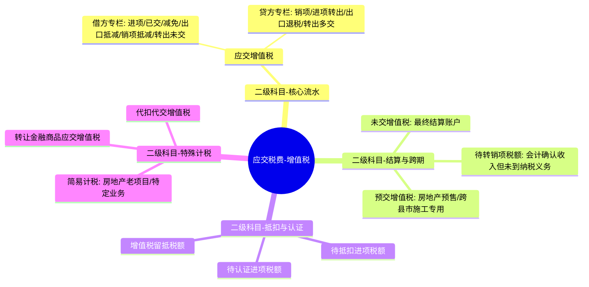
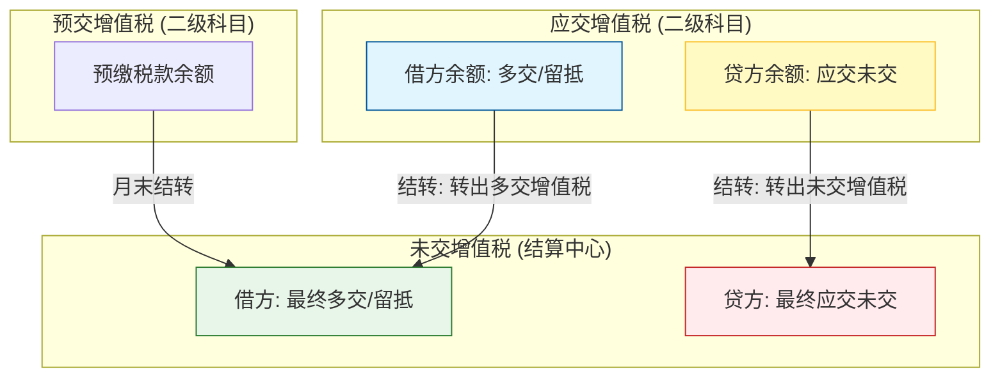
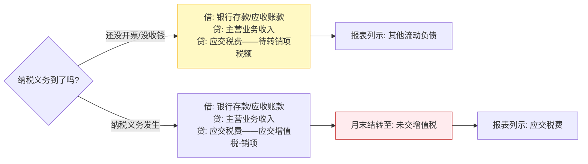
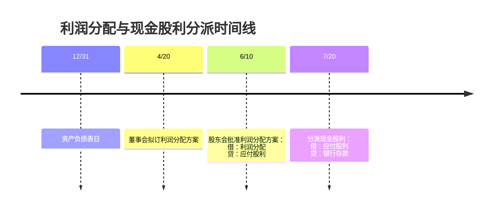

> [!note]
> - 增值税、消费税、土地增值税、印花税等会计处理；
>  - 企业发行公司债券及可转换公司债券的会计处理等。
# 1.流动负债

## 1.1  短期借款

短期借款，是指企业向银行或其他金融机构等借入的期限在1年以下（含1年）的各种借款。

1. 企业借入短期借款时，借记“银行存款”科目，贷记“短期借款”科目。
```
	借：银行存款
		贷：短期借款
```
2. 资产负债表日，应按计算确定的短期借款利息费用，借记“财务费用”等科目，贷记“应付利息”等科目。实际支付利息时，借记“应付利息”科目，贷记“银行存款”等科目。
```
	借：财务费用
		贷：应付利息
	借：应付利息
		贷：银行存款
```
3. 短期借款到期偿还本金时，企业应借记“短期借款”科目，贷记“银行存款”科目。
```
借：短期借款
	贷：银行存款
```
## 1.2 应付票据

应付票据是由出票人出票，付款人在指定日期无条件支付特定的金额给收款人或者持票人的票据。
1. 企业因购买材料、商品和接受服务等而开出、承兑的商业汇票，应当按其票面金额作为应付票据的入账金额，借记“原材料”“应交税费——应交增值税（进项税额）”等科目，贷记“应付票据”科目。
```
借：原材料/库存商品
应交税费——应交增值税（进项税额）
	贷：应付票据
```
2. 企业开具的商业汇票到期支付票据款时，根据开户银行的付款通知，借记“应付票据”科目，贷记“银行存款”科目。
```
借：应付票据
	贷：银行存款
```
3. 开出并承兑的商业承兑汇票如果不能如期支付的，应在票据到期时，将“应付票据”账面价值转入“应付账款”科目，待协商后再进行处理。
```
借：应付票据
	贷：应付账款
```
如果重新签发新的票据以清偿原应付票据的，再由“应付账款”科目转入“应付票据”科目。

4. 银行承兑汇票如果票据到期，企业无力支付到期票款时，承兑银行除凭票向持票人无条件付款外，对出票人尚未支付的汇票金额转作逾期贷款处理。
```
借：应付票据
贷：短期借款
```
## 1.3 应付账款

应付账款指因购买材料、商品或接受服务等而发生的债务。
应付账款一般按应付金额入账，而不按到期应付金额的现值入账。

1. 购入材料、商品等验收入库，但货款尚未支付，根据有关凭证，借记“原材料”“库存商品”等科目，按照可抵扣的增值税进项税额，借记“应交税费——应交增值税（进项税额）”科目，按应付的款项，贷记“应付账款”科目。
```
借：原材料/库存商品
	应交税费——应交增值税（进项税额）
	贷：应付账款
```
2. 企业偿还应付账款或开出商业汇票抵付应付账款时，借记“应付账款”科目，贷记“银行存款”“应付票据”等科目
```
借：应付账款
贷：银行存款/应付票据
```
## 1.4 应交税费

- 相关链接：[[04-note/资产初始确认时的相关税费处理]]
### 1.4.1 增值税
 1. 增值税概述
	- 增值税是以商品（含应税劳务、应税行为）在流转过程中实现的增值额作为计税依据而征收的一种流转税。
2. 增值税纳税人的分类
	 ①一般纳税人（年应税销售额＞500万元）：一般纳税人，是指年应税销售额超过财政部、国家税务总局规定标准的增值税纳税人。年应税销售额不能达到规定标准但会计核算健全的，也可登记成为增值税一般纳税人。
	②小规模纳税人（年应税销售额≤500万元）：小规模纳税人，是指年应税销售额未超过规定标准，并且会计核算不健全，不能够提供准确税务资料的增值税纳税人。
3. 增值税的计税方法
	 ①一般计税方法
	- 增值税的一般计税方法，是先按当期销售额和适用的税率计算出销项税额，然后以该销项税额对当期购进项目支付的税款（即进项税额）进行抵扣，从而间接算出当期增值额部分的应纳税额。
	②简易计税方法
	- 纳税人发生应税销售行为适用简易计税方法的，应该按照销售额和征收率计算应纳增值税税额，并且不得抵扣进项税额。
> [!note]
> （1）增值税一般纳税人计算增值税大多采用一般计税方法，但一般纳税人发生财政部和国家税务总局规定的特定应税销售行为，也可以选择简易计税方式计税，但是不得抵扣进项税额。增值税一般纳税人发生的应税行为适用简易计税方法的，销售商品时应交纳的增值税额在“简易计税”明细科目核算。
> (2) 增值税小规模纳税人一律采用简易计税方法。

4. **增值税一般纳税人的会计科目及专栏设置**（重点）

增值税一般纳税人应当在“应交税费”科目下设置“应交增值税”“未交增值税”“预交增值税”“待抵扣进项税额”“待认证进项税额”“待转销项税额”“增值税留抵税额”“简易计税”“转让金融商品应交增值税”“代扣代交增值税”等明细科目。

“应交税费——应交增值税”明细科目下设置“进项税额”“销项税额抵减”“已交税金”“转出未交增值税”“减免税款”“出口抵减内销产品应纳税额”“销项税额”“出口退税”“进项税额转出”“转出多交增值税”等专栏。

| **借方（5个+1个结转）**     | **贷方（3个+1个结转）**  |
| :------------------ | :--------------- |
| **1. 进项税额**         | **1. 销项税额**      |
| **2. 已交税金**         | **2. 进项税额转出**    |
| **3. 减免税款**         | **3. 出口退税**      |
| **4. 出口抵减内销产品应纳税额** |                  |
| **5. 销项税额抵减**       |                  |
| **(结转) 转出未交增值税**    | **(结转) 转出多交增值税** |

- 增值税科目的“1+N”体系
	- **核心“大本营”**：二级科目`应交税费——应交增值税`。它下面挂了**10个专栏**，负责日常流水。
	- **辅助“蓄水池”**：其他二级科目（如`未交增值税`、`预交增值税`、`待抵扣进项税额`等），负责解决**跨期**和**结算**问题。
- 考试中最爱考的是这几个二级科目之间的跳转：
	- **未交增值税**：这是“结算账户”。月末要把`应交增值税`里的差额转进来。
	    - 如果是**应交未交**：借：应交税费——应交增值税（转出未交增值税），贷：应交税费——未交增值税。
	    - “未交增值税”明细科目，核算一般纳税人月度终了从“应交增值税”或“预交增值税”明细科目转入当月应交未交、多交或预交的增值税税额，以及当月交纳以前期间未交的增值税税额。
	- **预交增值税**：专门针对跨县市施工、不动产租赁、**房地产开发预售**。
	- **待转销项税额**：会计上确认了收入，但增值税纳税义务还没到（比如还没开票）。




增值税月末结转逻辑（流程步骤类）
月末，我们要把“应交增值税”和“预交增值税”里的水，统一汇集到“未交增值税”这个蓄水池里。




为了防止在做分录时“左右不分”，可以从**资产/负债属性**来理解：

| 维度 | 借方 (资产属性/抵减) | 贷方 (负债属性/增加) | 逻辑记忆 |
| :--- | :--- | :--- | :--- |
| **日常专栏** | 进项税额、已交税金、减免税款、出口抵减、销项抵减 | 销项税额、进项税额转出、出口退税 | 借方代表“钱往外掏”或“权利增加”；贷方代表“欠国家的钱”或“权利减少”。 |
| **月末结转** | **转出未交增值税** (结转贷方差) | **转出多交增值税** (结转借方差) | 结转时方向相反：贷方有差额（欠钱），就从借方转出。 |

（1）月份终了，企业计算出当月应交未交的增值税，借记“应交税费——应交增值税（转出未交增值税）”科目，贷记“应交税费——未交增值税”科目。
```
借：应交税费——应交增值税（转出未交增值税）
贷：应交税费——未交增值税
下期交纳时
借：应交税费——未交增值税
贷：银行存款
```

(2) 当月多交的增值税, 借记 “应交税费——未交增值税” 科目, 贷记 “应交税费——应交增值税（转出多交增值税）” 科目
```
 借：应交税费——未交增值税
贷：应交税费——应交增值税（转出多交增值税）

```

交纳增值税的会计处理
<table border=1 style='margin: auto; word-wrap: break-word;'><tr><td style='text-align: center; word-wrap: break-word;'>(1) 当月交纳当月的增值税</td><td style='text-align: center; word-wrap: break-word;'>企业当月交纳当月的增值税，通过“应交税费——应交增值税（已交税金）”科目核算，借记“应交税费——应交增值税（已交税金）”科目（小规模纳税人应借记“应交税费——应交增值税”科目），贷记“银行存款”科目。</td></tr><tr><td style='text-align: center; word-wrap: break-word;'>(2) 当月交纳以前各期末交的增值税</td><td style='text-align: center; word-wrap: break-word;'>企业当月交纳以前各期末交的增值税，通过“应交税费——未交增值税”科目，借记“应交税费——未交增值税”科目，贷记“银行存款”科目。</td></tr><tr><td style='text-align: center; word-wrap: break-word;'>(3) 预缴增值税</td><td style='text-align: center; word-wrap: break-word;'>①企业预缴增值税，借记“应交税费——预交增值税”科目，贷记“银行存款”科目。（先预缴）【板书】借：应交税费——预交增值税    贷：银行存款②月末，企业应将“预交增值税”明细科目余额转入“未交增值税”明细科目，借记“应交税费——未交增值税”科目，贷记“应交税费——预交增值税”科目。（后结转）【板书】借：应交税费——未交增值税    贷：应交税费——预交增值税银行存款应交税费——预交增值税应交税费——未交增值税</td></tr></table>

> [!example] 例题·多选题
> 下列各项关于增值税会计处理的表述中，正确的有（）。
>
> A. 小规模纳税人将自产的产品分配给股东，视同销售货物，计算交纳的增值税计入销售成本
> B. 一般纳税人购进货物用于免征增值税项目，其进项税额计入相关成本费用或资产科目
> C. 一般纳税人月终计算出当月应交未交的增值税，在“应交税费——未交增值税”科目核算
> D. 一般纳税人核算使用简易计税方法计算交纳的增值税，在“应交税费——简易计税”明细科目核算
>
> > [!check]- 答案与解析
> > 
> > **正确答案：BCD**
> >
> > **深度解析：**
> > **选项A分析：**
> > 小规模纳税人将自产产品分配给股东，属于视同销售行为，需要计算缴纳增值税。然而，计算出的增值税**不计入销售成本**，而是计入**“利润分配”**科目。因此，选项A错误。
> >
> > **选项B分析：**
> > 一般纳税人购进货物用于免征增值税项目时，其相关的**进项税额**是**不能抵扣**的，应按照税法规定，将其计入**相关成本费用或资产科目**。
> >
> > **选项C分析：**
> > 一般纳税人在月末计算出当月应交未交的增值税时，应通过“**应交税费——未交增值税**”科目进行核算。
> >
> > **会计分录示例（月终计算）：**
> > 借：应交税费——应交增值税（转出未交增值税）
> > 贷：应交税费——未交增值税
> >
> > **会计分录示例（下期交纳）：**
> > 借：应交税费——未交增值税
> > 贷：银行存款
> >
> > **选项D分析：**
> > 对于一般纳税人采用简易计税方法计算缴纳的增值税，应在“**应交税费——简易计税**”明细科目中进行核算。
> >
> > **💡 易错点提示：**
> > 注意区分不同纳税人类别（小规模纳税人与一般纳税人）以及不同税收处理方法（如一般计税与简易计税）下，增值税会计处理的差异，特别是进项税额的转入科目和视同销售行为的税费归集科目。


 5. 增值税视同销售的处理
待税法更新
 6. 减免增值税的账务处理
- 相关链接：[[A1-会计笔记/18-政府补助]]
（1）对于当期直接减免的增值税，借记“应交税费——应交增值税（减免税款）”科目，贷记“其他收益”科目。
借：应交税费——应交增值税（减免税款）
贷：其他收益

(2) 当期按规定即征即退的增值税，也计入“其他收益”科目。
借：银行存款/其他应收款
贷：其他收益

6. 与增值税相关的“应交税费”科目下的有关明细科目期末借、贷方余额在资产负债表中的列示

<table border=1 style='margin: auto; word-wrap: break-word;'><tr><td style='text-align: center; word-wrap: break-word;'>期末余额</td><td style='text-align: center; word-wrap: break-word;'>项目列示</td></tr><tr><td style='text-align: center; word-wrap: break-word;'>①“应交税费”科目下的“应交增值税”“未交增值税”“待抵扣进项税额”“待认证进项税额”“增值税留抵税额”等明细科目期末借方余额</td><td style='text-align: center; word-wrap: break-word;'>“其他流动资产”或“其他非流动资产”</td></tr><tr><td style='text-align: center; word-wrap: break-word;'>②“应交税费——待转销项税额”等科目期末贷方余额</td><td style='text-align: center; word-wrap: break-word;'>“其他流动负债”或“其他非流动负债”</td></tr></table>

<table border=1 style='margin: auto; word-wrap: break-word;'><tr><td style='text-align: center; word-wrap: break-word;'>期末余额</td><td style='text-align: center; word-wrap: break-word;'>项目列示</td></tr><tr><td style='text-align: center; word-wrap: break-word;'>③“应交税费”科目下的“未交增值税” “简易计税”“转让金融商品应交增值税” “代扣代交增值税”等科目期末贷方余额</td><td style='text-align: center; word-wrap: break-word;'>应交税费</td></tr></table>

| 维度       | 应交税费——未交增值税                       | 应交税费——待转销项税额                                         |
| :------- | :-------------------------------- | :--------------------------------------------------- |
| **本质属性** | **已确定的法定债务**                      | **待转化的会计过渡**                                         |
| **纳税义务** | **已发生**。根据税法，你现在就欠国家这笔钱，下月申报期必须交。 | **未发生**。会计上确认了收入，但税法规定的纳税义务时间（如开票或收款）还没到。            |
| **报表列示** | **应交税费**                          | **其他流动负债**（或非流动）                                     |
| **逻辑解释** | 属于标准的“税金”负债，符合《应交税费》科目的定义。        | 此时它还不算真正的“税”，而是一项因会计与税法差异产生的“待转项”，为了不混淆正式税金，故放入“其他”。 |



### 1.4.2 消费税

1. 产品销售的会计处理
<table border=1 style='margin: auto; word-wrap: break-word;'><tr><td style='text-align: center; word-wrap: break-word;'>(1) 企业将生产的应税消费品直接对外销售</td><td style='text-align: center; word-wrap: break-word;'>企业将生产的应税消费品直接对外销售的，企业按规定计算出应交的消费税，借记“税金及附加”科目，贷记“应交税费——应交消费税”科目。</td></tr><tr><td style='text-align: center; word-wrap: break-word;'>(2) 企业将应税消费品用于在建工程、非生产机构等其他方面</td><td style='text-align: center; word-wrap: break-word;'>企业将应税消费品用于在建工程、非生产机构等其他方面，按规定应交纳的消费税，应计入有关的成本。借：在建工程等    贷：库存商品        应交税费——应交消费税</td></tr></table>

2. 委托加工应税消费品的会计处理

按照税法规定，企业委托加工的应税消费品，由受托方在向委托方交货时代收代缴税款（除受托加工或翻新改制金银首饰按规定由受托方交纳消费税外）。
(1) 受托方的会计处理
受托方按应收税款金额，借记“银行存款”等科目，贷记“应交税费——应交消费税”科目。
(2) 委托方的会计处理
<table border=1 style='margin: auto; word-wrap: break-word;'><tr><td style='text-align: center; word-wrap: break-word;'>①委托方收回后用于连续生产</td><td style='text-align: center; word-wrap: break-word;'>委托加工的应税消费品收回后用于连续生产应税消费品，按规定准予抵扣的，委托方应按代收代缴的消费税款，借记“应交税费——应交消费税”科目，贷记“银行存款”等科目，待用委托加工的应税消费品生产出应纳消费税的产品销售时，再交纳消费税。</td></tr><tr><td style='text-align: center; word-wrap: break-word;'>②委托方收回后直接用于出售</td><td style='text-align: center; word-wrap: break-word;'>委托加工应税消费品收回后，直接用于出售的（不高于受托方的计税价格），委托方应将代收代缴的消费税计入委托加工的应税消费品成本，借记“委托加工物资”等科目，贷记“银行存款”等科目，待委托加工应税消费品销售时，不需要再交纳消费税。</td></tr></table>

 3. 进出口应税消费品的会计处理

<table border=1 style='margin: auto; word-wrap: break-word;'><tr><td style='text-align: center; word-wrap: break-word;'>(1) 进口应税消费品</td><td style='text-align: center; word-wrap: break-word;'>需要交纳消费税的进口消费品，其交纳的消费税应计入该进口消费品的成本，借记“固定资产”“库存商品”等科目，贷记“银行存款”等科目。</td></tr><tr><td style='text-align: center; word-wrap: break-word;'>(2) 出口</td><td style='text-align: center; word-wrap: break-word;'>免征消费税的出口应税消费品分别不同情况进行账务处理：
①属于生产企业直接出口应税消费品或通过外贸企业出口应税消费品，按规定直接予以免税的，可以不计算应交消费税；
②属于委托外贸企业代理出口应税消费品的生产企业，应在计算消费税时，按应交消费税税额，借记“应收账款”科目，贷记“应交税费——应交消费税”科目。应税消费品出口收到外贸企业退回的税金时，借记“银行存款”科目，贷记“应收账款”科目。</td></tr></table>

> [!example] 例题·单选题
> 甲公司以应税消费品对A公司投资，取得A公司20%股权，取得后对A公司能产生重大影响。该产品成本为30万元，双方合同约定的合同价（等于计税价格，且假设是公允的）为50万元，甲公司和A公司均为增值税一般纳税人，增值税税率为13%，消费税税率为10%。不考虑其他因素，甲公司取得股权投资的初始投资成本为（　）。
>
> A. 61.5万元
> B. 56.5万元
> C. 36.5万元
> D. 41.5万元
>
> > [!check]- 答案与解析
> > 
> > **正确答案：B**
> >
> > **深度解析：**
> > **第一步：明确计价原则**
> > 投出非现金资产（如库存商品）取得长期股权投资，应当**视同销售**处理。初始投资成本等于投出资产的**公允价值**（不含税价）加上**增值税销项税额**。
> >
> > **第二步：计算各项数值**
> > 1.  **公允价值**：题目给出合同价（公允）为 $50$ 万元。
> > 2.  **增值税销项税额**：$50 \times 13\% = 6.5$ 万元。
> > 3.  **初始投资成本**：$50 + 6.5 = 56.5$ 万元。
> >
> > **会计分录（辅助理解）：**
> > ```text
> > 借：长期股权投资              56.5
> >     贷：主营业务收入              50
> >     贷：应交税费—应交增值税（销项） 6.5
> > ```
> >
> > **💡 易错点提示：**
> > 4. **消费税处理**：消费税属于价内税，计入“税金及附加”，影响当期损益，但**不增加**长期股权投资的初始成本（不要加上 $50 \times 10\% = 5$ 万元）。
> > 5. **计价基础**：必须使用**公允价值**（50万元）而非账面成本（30万元）进行计算。
### 1.4.3 其他应交税费
1. 资源税
企业按规定计算出销售应税产品应交纳的资源税，借记“**税金及附加**”科目，贷记“应交税费——应交资源税”科目。

2. 土地增值税
 （1）企业的日常活动是销售房地产（存货或投资性房地产），确认销售存货或投资性房地产的收入，则应由当期收入负担的土地增值税，借记“**税金及附加**”科目，贷记“应交税费——应交土地增值税”科目。（2025年修改内容）
 （2）企业转让自用房地产，原房屋建筑物在“固定资产”科目核算，原土地使用权在“无形资产”科目核算，应缴纳的土地增值税，借记“**资产处置损益**”科目，贷记“应交税费——应交土地增值税”科目。
 （3）房地产企业
 ①预交土地增值税时，借记“应交税费——应交土地增值税”科目，贷记“银行存款”等科目。
 ②房地产销售收入实现时，再按上述销售业务的会计处理方法进行处理。
 借：税金及附加    
 贷：应交税费——应交土地增值税
 ③进行土地增值税清算时：
 a.收到退回多交的土地增值税，借记“银行存款”等科目，贷记“应交税费——应交土地增值税”科目；
借: 银行存款    
贷: 应交税费——应交土地增值税
b. 补交的土地增值税作相反的会计分录。

3. 房产税、城镇土地使用税、车船税和印花税
(1) 房产税、城镇土地使用税、车船税
①企业按规定计算应交的房产税、城镇土地使用税、车船税时
借: 税金及附加    
贷: 应交税费——应交房产税——应交城镇土地使用税——应交车船税
② 上交时
借: 应交税费——应交房产税——应交城镇土地使用税——应交车船税    
贷: 银行存款

(2) 印花税 (2025年修改内容)
①（申报缴纳）印花税票粘贴在应税凭证上的，发生印花税纳税义务时，借记“税金及附加”科目，贷记“应交税费”科目。申报缴纳税款时，借记“应交税费”科目，贷记“银行存款”科目。
② （购买印花税票）采用粘贴印花税票方式缴纳的，借记“税金及附加”科目，贷记“银行存款”科目。
期末，如果购买的印花税票仍有余额，可以列报于资产负债表的“其他流动资产”等项目。

4. 城市维护建设税
企业按规定计算出的城市维护建设税，借记“**税金及附加**”等科目，贷记“应交税费——应交城市维护建设税”科目；
实际上交时，借记“应交税费——应交城市维护建设税”科目，贷记“银行存款”科目

5. 所得税企业按照一定方法计算计入损益的所得税，借记“**所得税费用**”等科目，贷记“应交税费——应交所得税”科目。

6. 耕地占用税企业按规定计算交纳耕地占用税时,借: 在建工程    贷: 银行存款
**【提示】企业交纳的耕地占用税, 不需要通过“应交税费”科目核算。**

> [!note] 记入“税金及附加”科目的税费
> (1) 消费税（企业销售应交纳消费税的产品）
> (2) 资源税（企业销售应交纳资源税的产品）
> (3) 土地增值税（企业的日常活动是销售房地产）
> (4) 房产税、土地使用税、车船税、印花税
> (5) 城市维护建设税、教育费附加

> [!example] 例题·多选题
> 企业缴纳的下列税款，不通过“应交税费”科目核算的有（　）。
>
> A. 车辆购置税
> B. 耕地占用税
> C. 采用粘贴印花税票方式缴纳的印花税
> D. 契税
>
> > [!check]- 答案与解析
> > 
> > **正确答案：A、B、C、D**
> >
> > **深度解析：**
> > **1. 直接计入资产成本的税金（选项 A、B、D）：**
> > 企业缴纳的**车辆购置税**、**耕地占用税**和**契税**，均是为了取得特定资产而发生的，在缴纳时直接计入相关资产（如固定资产、无形资产）的成本，不通过“应交税费”科目核算。
> > *   会计处理逻辑：
> >     $$ \text{借：固定资产 / 无形资产 / 在建工程} $$
> >     $$ \quad \text{贷：银行存款} $$
> >
> > **2. 直接计入当期损益的税金（选项 C）：**
> > 采用**粘贴印花税票**方式缴纳的印花税，在购买税票时直接计入“税金及附加”，不通过“应交税费”科目核算。
> > *   会计处理逻辑：
> >     $$ \text{借：税金及附加} $$
> >     $$ \quad \text{贷：银行存款} $$
> >
> > **💡 易错点提示：**
> > 务必区分“**不通过应交税费核算**”的特例与常规税金。
> > *   **特例（直接支付）**：印花税、耕地占用税、契税、车辆购置税。
> > *   **常规（先提后缴）**：房产税、土地使用税、车船税、城建税等，这些**必须**通过“应交税费”核算。
## 1.5、 应付股利

- 应付股利，是指企业经股东大会或类似机构审议批准分配的现金股利或利润。
- 企业股东大会或类似机构审议批准的利润分配方案、宣告分派的现金股利或利润，在实际支付前，形成企业的负债。

<table border=1 style='margin: auto; word-wrap: break-word;'><tr><td style='text-align: center; word-wrap: break-word;'>(1) 企业董事会或类似机构通过的利润分配方案</td><td style='text-align: center; word-wrap: break-word;'>企业董事会或类似机构通过的利润分配方案中拟分配的现金股利或利润，不应确认负债，但应在附注中披露。
(董事会职权之一：制订公司的利润分配方案)</td></tr><tr><td style='text-align: center; word-wrap: break-word;'>(2) 企业经股东大会或类似机构审议批准的利润分配方案</td><td style='text-align: center; word-wrap: break-word;'>企业经股东大会或类似机构审议批准的利润分配方案，按应支付的现金股利或利润，借记“利润分配”科目，贷记“应付股利”科目；实际支付现金股利或利润时，借记“应付股利”科目，贷记“银行存款”等科目。
(股东大会职权之一：审议批准公司的利润分配方案)</td></tr></table>

## 1.6 其他应付款

其他应付款，是指企业除应付票据、应付账款、预收账款、应付职工薪酬、应付利息、应付股利、应交税费、长期应付款等以外的其他各项应付、暂收的款项。
> [!note]
> 资产负债表 “其他应付款” 项目，应根据 “其他应付款” “应付利息” “应付股利” 科目的期末余额合计数填列。

# 2. 非流动负债

## 2.1 长期借款

长期借款，是指企业从银行或其他金融机构借入的期限在一年以上（不含一年）的借款。

<table border=1 style='margin: auto; word-wrap: break-word;'><tr><td style='text-align: center; word-wrap: break-word;'>(一)借入各种长期借款时</td><td style='text-align: center; word-wrap: break-word;'>借: 银行存款(实际收到的款项)    
	长期借款——利息调整(差额)    
贷: 长期借款——本金</td></tr><tr><td rowspan="2">(二)资产负债表日</td><td style='text-align: center; word-wrap: break-word;'>借: 在建工程  
财务费用等    （长期借款摊余成本*实际利率）
贷: 长期借款——应计利息(借款本金×合同利率) 
——利息调整(差额)</td></tr><tr><td style='text-align: center; word-wrap: break-word;'>【提示】对于已过付息期但尚未支付的利息, 应借记“长期借款——应计利息”科目, 贷记“应付利息”科目。</td></tr><tr><td style='text-align: center; word-wrap: break-word;'>(三)到期支付借款本息时</td><td style='text-align: center; word-wrap: break-word;'>1.归还本金
借: 长期借款——本金 
——应计利息  
贷: 银行存款
2.结转利息调整余额借: 在建工程/财务费用等   
贷: 长期借款——利息调整(余额)(或相反会计分录)</td></tr></table>

> [!example] 例题·多选题
> 长期借款所发生的利息支出，可能记入的科目有（　）。
>
> - A. 营业外支出
> - B. 管理费用
> - C. 财务费用
> - D. 在建工程
>
> > [!check]- 答案与解析
> > 
> > **正确答案：B、C、D**
> >
> > **深度解析：**
> > 长期借款利息的处理需根据**借款用途**、**所处期间**及**是否符合资本化条件**进行判断：
> >
> > 1. **符合资本化条件**：
> >    在固定资产购建期间，如果借款利息符合资本化条件，应计入**在建工程**成本。（对应选项 **D**）
> >
> > 2. **不符合资本化条件（费用化）**：
> >    - **筹建期间**：企业在筹建期间发生的长期借款利息（不符合资本化条件的），应计入**管理费用**。（对应选项 **B**）
> >    - **生产经营期间**：企业在正常生产经营期间发生的长期借款利息（不符合资本化条件的），应计入**财务费用**。（对应选项 **C**）
> >
> > **💡 易错点提示：**
> > 1. **营业外支出**（选项 A）主要核算非日常活动的损失（如公益性捐赠支出、非常损失等），正常的借款利息不计入该科目。
> > 2. 重点区分**筹建期间**（计入管理费用）与**经营期间**（计入财务费用）的差异。

> [!example] 例题·多选题
> 下列各项中，工业企业应将其计入财务费用的有（　）。
> A. 长期借款手续费
> B. 银行承兑汇票手续费
> C. 给予购货方的商业折扣
> D. 计提的带息应付票据利息
>
> > [!check]- 答案与解析
> > 
> > **正确答案：BD**
> >
> > **深度解析：**
> >
> > **选项A：** 长期借款手续费，金额较小的可直接计入**财务费用**，但金额较大的应计入**长期借款的初始入账金额**（作为交易费用处理），在借款存续期间按**实际利率法**摊销。题目未明确金额大小，但按照准则一般处理原则，长期借款手续费通常作为借款辅助费用处理，**不直接计入财务费用**，故A不选。
> >
> > **选项B：** 银行承兑汇票手续费属于企业为进行银行承兑而支付的**金融服务费用**，应计入**财务费用**。✅
> >
> > **选项C：** 商业折扣是企业在销售时直接从标价中**扣减**的金额，销售收入按扣除商业折扣后的净额确认，商业折扣**不单独进行账务处理**，不计入财务费用。（注意区分：**现金折扣**才计入财务费用）。❌
> >
> > **选项D：** 带息应付票据按期计提的利息，属于企业因**债务融资**产生的利息支出，应计入**财务费用**。✅
> >
> > **💡 易错点提示：**
> > ① 注意区分**商业折扣**与**现金折扣**：商业折扣直接扣减收入，不做单独处理；**现金折扣**才计入财务费用。
> > ② 长期借款手续费的处理需区分金额大小，考试中此选项常作为**干扰项**出现。
## 2.2 公司债券
### 2.2.1 一般公司债券

1. **公司债券的发行**

-  公司债券的发行价格
<table border=1 style='margin: auto; word-wrap: break-word;'><tr><td style='text-align: center; word-wrap: break-word;'>利率关系</td><td style='text-align: center; word-wrap: break-word;'>发行方式</td></tr><tr><td style='text-align: center; word-wrap: break-word;'>债券的票面利率＞实际利率时</td><td style='text-align: center; word-wrap: break-word;'>溢价发行</td></tr><tr><td style='text-align: center; word-wrap: break-word;'>债券的票面利率=实际利率时</td><td style='text-align: center; word-wrap: break-word;'>面值发行</td></tr><tr><td style='text-align: center; word-wrap: break-word;'>债券的票面利率＜实际利率时</td><td style='text-align: center; word-wrap: break-word;'>折价发行</td></tr></table>

-  企业发行债券的会计处理
```
借：银行存款 （实际收到的款项）
贷：应付债券——面值
	——利息调整（差额，贷方或借方）
```

 2. **利息调整的摊销**

- 实际利率与实际利率法的定义
	- 利息调整应在债券存续期间内采用实际利率法进行摊销。
	- 实际利率，是指将应付债券在债券存续期间的未来现金流量，折现为该债券当前账面价值所使用的利率。
	- 实际利率法，是指按照应付债券的实际利率计算其摊余成本及各期利息费用的方法。

3. **债券的偿还**
```
借：应付债券——面值
	——应计利息
	应付利息
贷：银行存款
```
存在利息调整余额的，借记或贷记“应付债券——利息调整”，贷记或借记“在建工程”“财务费用”等科目

```
借：在建工程/财务费用等
贷：应付债券——利息调整（余额）
(或相反会计分录)
```


> [!example] 例题·单选题
> $2 \times 24$ 年 $1$ 月 $1$ 日，甲公司发行 $2$ 年期一次还本、分期付息的公司债券 $30\ 000$ 万元，债券利息于每年 $12$ 月 $31$ 日支付，票面年利率为 $5\%$。甲公司溢价发行该批公司债券，实际募集资金 $30\ 800$ 万元，另外支付发行费用 $1\ 500$ 万元。该批公司债券的实际年利率 $6.28\%$。甲公司无符合借款费用资本化条件的资产。不考虑相关税费及其他因素，甲公司 $2 \times 24$ 应计入损益的利息费用金额是（ ）。
> 
> A. $1\ 884$ 万元  
> B. $1\ 934.24$ 万元  
> C. $1\ 840.04$ 万元  
> D. $1\ 500$ 万元
>
> > [!check]- 答案与解析
> > 
> > **正确答案：C**
> >
> > **深度解析：**
> > **第一步：确定应付债券的初始入账价值**
> > 企业发行债券支付的交易费用（如发行费用）应当计入负债的**初始确认金额**。
> > 初始入账价值（摊余成本） $= 实际募集资金 - 发行费用$
> > 即：$30\ 800 - 1\ 500 = 29\ 300$（万元）。
> >
> > **第二步：计算 $2 \times 24$ 年应确认的利息费用**
> > 根据**实际利率法**，计入损益（财务费用）的利息费用等于期初摊余成本乘以实际利率。
> > 利息费用 $= 29\ 300 \times 6.28\% = 1\ 840.04$（万元）。
> >
> > **第三步：会计分录处理（参考）**
> > 1. $2 \times 24$ 年 $1$ 月 $1$ 日发行时：
> > 借：银行存款 $29\ 300$
> > 　　应付债券——利息调整 $700$
> > 　贷：应付债券——面值 $30\ 000$
> >
> > 2. $2 \times 24$ 年 $12$ 月 $31$ 日计提利息时：
> > 借：财务费用 $1\ 840.04$
> > 　贷：应付利息 $30\ 000 \times 5\% = 1\ 500$
> > 　　　应付债券——利息调整 $340.04$
> >
> > **💡 易错点提示：**
> > 1. **初始成本扣除**：很多同学容易忽略**发行费用**需要从募集资金中扣除，直接用 $30\ 800$ 作为计算基数。
> > 2. **利息费用 vs 应付利息**：计入损益的是“利息费用”（期初摊余成本 $\times$ 实际利率），而现金流出或计入负债的是“应付利息”（面值 $\times$ 票面利率），两者差额计入“利息调整”摊销。

### 2.2.2 可转换公司债券

1. 企业发行的可转换公司债券，应当在初始确认时将其包含的负债成分和权益成分进行分拆，将负债成分确认为应付债券，将权益成分确认为其他权益工具。
2. 在进行分拆时，应当先对负债成分的未来现金流量进行折现确定负债成分的初始确认金额，再按发行价格总额扣除负债成分初始确认金额后的金额确定权益成分的初始确认金额。
3. 具体会计处理

企业发行的可转换公司债券，应按实际收到的金额，借记“银行存款”等科目，按该项可转换公司债券包含的负债成分面值，贷记“应付债券——面值”科目，按权益成分的公允价值，贷记“其他权益工具”科目，按其差额，借记或贷记“应付债券——利息调整”科目。

```
(假定面值发行)
借：银行存款
	应付债券——利息调整
贷：应付债券——面值
	其他权益工具
```


> [!example] 例题·计算分析题
> 甲公司经批准于 $2\times20$ 年 $12$ 月 $31$ 日按面值发行 $5$ 年期一次还本、按年付息的可转换公司债券 $200,000,000$ 元，款项已收存银行，债券票面年利率为 $6\%$，假定于次年起每年 $12$ 月 $31$ 日支付当年利息。债券发行 $1$ 年后可转换为普通股股票，初始转股价为每股 $10$ 元，股票面值为每股 $1$ 元。假定该债券利息不符合资本化条件，不考虑其他因素。
> 
> 假定 $2\times22$ 年 $1$ 月 $1$ 日债券持有人将持有的可转换公司债券全部转换为普通股股票，甲公司发行可转换公司债券时二级市场上与之类似的没有附带转换权的债券市场利率为 $9\%$。
> 
> **已知：**
> 年金现值系数 $(P/A, 9\%, 5) = 3.8897$
> 复利现值系数 $(P/F, 9\%, 5) = 0.6499$
>
> > [!check]- 答案与解析
> > **第一步：拆分负债成分与权益成分**
> > 1. **负债成分**的公允价值：
> >    $200,000,000 \times 6\% \times 3.8897 + 200,000,000 \times 0.6499 = \mathbf{176,656,400}$（元）
> > 2. **权益成分**的公允价值：
> >    $200,000,000 - 176,656,400 = \mathbf{23,343,600}$（元）
> >
> > **第二步：$2\times20$ 年 $12$ 月 $31$ 日发行时的账务处理**
> > 借：银行存款 $\mathbf{200,000,000}$
> > 　　应付债券——利息调整 $\mathbf{23,343,600}$
> > 　贷：应付债券——面值 $\mathbf{200,000,000}$
> > 　　　其他权益工具 $\mathbf{23,343,600}$
> >
> > **第三步：$2\times21$ 年 $12$ 月 $31$ 日确认利息费用**
> > 1. 计提利息费用：
> >    借：财务费用 ($176,656,400 \times 9\%$) $\mathbf{15,899,076}$
> > 　　贷：应付利息 ($200,000,000 \times 6\%$) $\mathbf{12,000,000}$
> > 　　　　应付债券——利息调整 $\mathbf{3,899,076}$
> > 2. 支付利息：
> >    借：应付利息 $\mathbf{12,000,000}$
> > 　　贷：银行存款 $\mathbf{12,000,000}$
> >
> > **第四步：$2\times22$ 年 $1$ 月 $1$ 日行使转换权**
> > 1. 计算转换的股份数：
> >    $200,000,000 \div 10 = \mathbf{20,000,000}$（股）
> > 2. 结转负债成分账面价值及权益成分：
> >    借：应付债券——面值 $\mathbf{200,000,000}$
> >    　　其他权益工具 $\mathbf{23,343,600}$
> >    　贷：应付债券——利息调整 ($23,343,600 - 3,899,076$) $\mathbf{19,444,524}$
> >    　　　股本 $\mathbf{20,000,000}$
> >    　　　资本公积——股本溢价 $\mathbf{183,899,076}$
> >
> > **💡 易错点提示：**
> > 1. **初始计量**：可转债发行时需先计算负债成分公允价值（按市场利率折现），总价款扣除负债成分后的差额计入“其他权益工具”。
> > 2. **利息调整**：后续计量采用**实际利率法**，每期财务费用 = 期初负债账面价值 $\times$ 实际利率（$9\%$）。
> > 3. **转股处理**：转股时不仅要结转负债成分的**账面价值**，还要结转原计入**其他权益工具**的金额，差额倒挤入“资本公积——股本溢价”。
## 2.3 长期应付款

长期应付款，是指企业除长期借款和应付债券以外的其他各种长期应付款项，如以分期付款方式购入固定资产发生的应付款项等。

> [!example] 例题·多选题
> 下列各项中，应通过长期应付款核算的有（　）。
>
> - A. 超过正常信用条件实际上具有融资性质的超期支付的应付款
> - B. 按合同利率计提的长期借款利息
> - C. 应付职工长期带薪缺勤
> - D. 购买固定资产，延期应付的价款总额（期限大于1年）
>
> > [!check]- 答案与解析
> > 
> > **正确答案：A、D**
> >
> > **深度解析：**
> > **1. 辨析“长期应付款”核算范围（选项A、D）：**
> > *   **核心逻辑**：企业购买资产（如固定资产、存货），如果延期支付价款超过正常信用条件（通常**期限 $> 1$ 年**），实质上具有**融资性质**。
> > *   **会计处理**：
> >     *   应按购买价款的**现值**，借记“固定资产”或“在建工程”等科目；
> >     *   按应支付的**价款总额**，贷记 **“长期应付款”** 科目；
> >     *   按其差额，借记“未确认融资费用”科目。
> > *   **结论**：选项 A 是对融资性质应付款的定性描述，选项 D 是具体的业务场景，均通过“长期应付款”核算。
> >
> > **2. 辨析其他负债科目（选项B、C）：**
> > *   **选项 B**：属于长期借款的利息处理。
> >     *   若分期付息，计入 **“应付利息”**；
> >     *   若到期一次还本付息，计入 **“长期借款——应计利息”**。
> > *   **选项 C**：属于职工薪酬范畴。
> >     *   应通过 **“应付职工薪酬——其他长期职工福利”** 核算。
> >
> > **💡 易错点提示：**
> > 注意区分 **“长期应付款”** 与 **“租赁负债”**。在执行新租赁准则后，融资租入固定资产产生的负债通常通过“租赁负债”核算，而“长期应付款”主要保留用于核算**分期付款购入固定资产**等业务。