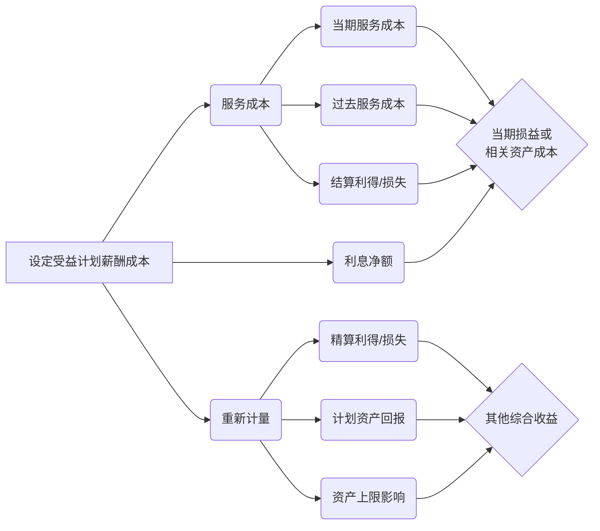

> [!note]
> 带薪缺勤问题：累计vs非累计
> 非货币性福利会计处理
> 提存计划与受益计划（损益vs其他综合收益）
# 1. 职工和职工薪酬的范围及分类
## 1.1 职工的概念

职工，是指与企业订立劳动合同的所有人员，含全职、兼职和临时职工，也包括虽未与企业订立劳动合同但由企业正式任命的人员。具体而言包括以下人员：

（一）与企业**订立劳动合同的**所有人员，含**全职、兼职和临时职工**。
（二）**未与企业订立劳动合同**但由企业正式任命的人员， 如企业按照有关规定聘请的**独立董事、外部监事**等。
（三）在企业的计划和控制下，虽未与企业订立劳动合同或未由其正式任命，但向企业所提供服务与职工所提供服务类似的人员，也属于职工的范畴，包括通过**企业与劳务中介公司签订用工合同而向企业提供服务的人员**。
## 1.2 职工薪酬的概念及分类

| 分类              | 内容                                                                                                                                                                                                                                                                                                                                                |
| --------------- | ------------------------------------------------------------------------------------------------------------------------------------------------------------------------------------------------------------------------------------------------------------------------------------------------------------------------------------------------- |
| **（一）短期薪酬**     | 短期薪酬，是指企业在职工提供相关服务的年度报告期间结束后12个月内需要全部予以支付的职工薪酬，**因解除与职工的劳动关系给予的补偿**除外。**（辞退福利）**<br><br>短期薪酬主要包括：<br><br>1.职工工资、奖金、津贴和补贴。<br>2.职工福利费。职工福利费，是指企业为向职工提供的生活困难补助、丧葬补助费、抚恤费、职工异地安家费、防暑降温费等福利支出。<br>3.医疗保险费、工伤保险费和生育保险费等社会保险费。<br>**【提示】** 失业保险费和养老保险费，属于离职后福利。<br>4.住房公积金。<br>5.工会经费和职工教育经费。<br>6.短期带薪缺勤。<br>7.短期利润分享计划。<br>8.**非货币性福利**。<br>9.其他短期薪酬。 |
| **（二）离职后福利**    | 离职后福利，是指企业为获得职工提供的服务而在**职工退休**或**与企业解除劳动关系后**，提供的各种形式的报酬和福利，属于短期薪酬和辞退福利的除外。                                                                                                                                                                                                                                                                       |
| **（三）辞退福利**     | 辞退福利，是指企业在职工**劳动合同到期之前**解除与职工的劳动合同关系，或者为鼓励职工自愿接受裁减而给予职工的补偿 。                                                                                                                                                                                                                                                                                      |
| **（四）其他长期职工福利** | 其他长期职工福利，是指除短期薪酬、离职后福利、辞退福利之外所有的职工薪酬，包括长期带薪缺勤、长期残疾福利、长期利润分享计划等。                                                                                                                                                                                                                                                                                   |

> [!example] 例题·单选题
> 下列关于职工薪酬的说法，正确的是（　）。
> 
> - A. 养老保险属于短期薪酬
> - B. 短期带薪缺勤包括婚假、病假以及事假
> - C. 医疗保险属于离职后福利
> - D. 企业在职工劳动合同到期之前强制与职工结束劳动关系的补偿属于辞退福利
> 
> > [!check]- 答案与解析
> > 
> > **正确答案：D**
> > 
> > **深度解析：**
> > *   **选项 A 错误**：养老保险和失业保险属于**离职后福利**（通常为设定提存计划），而非短期薪酬。
> > *   **选项 B 错误**：短期带薪缺勤包括年休假、病假、婚假、产假、丧假、探亲假等。**事假**通常属于无薪缺勤，不属于带薪缺勤的范畴。
> > *   **选项 C 错误**：医疗保险、工伤保险和生育保险属于**短期薪酬**中的社会保险费。
> > *   **选项 D 正确**：辞退福利是指企业在职工劳动合同到期之前解除与职工的劳动关系，或者为鼓励职工自愿接受裁减而给予职工的补偿。
> > 
> > **💡 易错点提示：**
> > 务必准确区分“五险”在会计核算上的归属：
> > 1.  **短期薪酬**：医疗保险、工伤保险、生育保险。住房公积金
> > 2.  **离职后福利**：养老保险、失业保险。
# 2. 短期薪酬的确认与计量

## 2.1 货币性短期薪酬

|                                                  |                                                                                                                                                 |
| ------------------------------------------------ | ----------------------------------------------------------------------------------------------------------------------------------------------- |
| **（一）工资**                                        | 企业应当根据职工提供服务情况和工资标准计算应计入职工薪酬的金额，按照**受益对象**计入**当期损益**或**相关资产成本**。                                                                                |
| **（二）职工福利费**                                     | 企业发生的职工福利费，应当**在实际发生时**根据**实际发生额**计入**当期损益**或**相关资产成本**。                                                                                        |
| **（三）医疗保险费、工伤保险费、生育保险费等社会保险费和住房公积金；工会经费和职工教育经费** | 企业为职工缴纳的医疗保险费、工伤保险费、生育保险费等社会保险费和住房公积金，以及按规定提取的工会经费和职工教育经费，应当在职工为其提供服务的会计期间，根据规定的计提基础和计提比例计算确定相应的职工薪酬金额，并确认相关负债，按照**受益对象**计入**当期损益**或**相关资产成本**。 |
	
## 2.2 带薪缺勤
- 短期带薪缺勤，是指职工虽然缺勤但企业仍向其支付报酬的安排，包括年休假、病假、短期伤残、婚假、产假、丧假、探亲假等。
- 带薪缺勤根据其性质及其职工享有的权利，分为累积带薪缺勤和非累积带薪缺勤。

1. **累积带薪缺勤**
	- 累积带薪缺勤，是指带薪权利可以结转下期的带薪缺勤，本期尚未用完的带薪缺勤权利可以在未来期间使用。（如年休假等）
	- 企业应在职工**提供了服务从而增加了其未来享有的带薪缺勤权利**时 **（确认时点）**，确认与累积带薪缺勤相关的职工薪酬，并以**累积未行使权利而增加的预期支付金额**计量 **（确认金额）**。即，企业应当根据资产负债表日**因累积未使用权利而导致的预期支付的追加金额**，作为累积带薪缺勤费用进行预计
```
借：管理费用等　
　贷：应付职工薪酬——累积带薪缺勤
```

2. **非累积带薪缺勤**
	- 非累积带薪缺勤，是指带薪权利不能结转下期的带薪缺勤，本期尚未用完的带薪缺勤权利将予以取消，并且职工离开企业时也无权获得现金支付。（如婚假、产假等）
	- 企业应当**在职工实际发生缺勤的会计期间**确认与非累积带薪缺勤相关的职工薪酬，即**视同职工出勤确认的**相关资产成本或当期费用。**（确认时点）**

> [!example] 例题·单选题
> 甲公司实行累积带薪休假制度，当年未享受的休假只可结转至下一年度。2×24年末，甲公司因当年度管理人员未享受休假而预计了将于2×25年支付的职工薪酬20万元。2×25年末，该累积带薪休假尚有40%未使用，不考虑其他因素。下列各项中，关于甲公司因其管理人员2×25年未享受累积带薪休假而原多预计的8万元负债（应付职工薪酬）于2×25年的会计处理，正确的是（    ）。
>
> A. 不作账务处理  
> B. 从应付职工薪酬转出计入资本公积  
> C. 冲减当期的管理费用  
> D. 作为会计差错追溯重述上年财务报表相关项目的金额
>
> > [!check]- 答案与解析
> > 
> > **正确答案：C**
> >
> > 职工本年度如果**未享受**上年度未使用的带薪年休假，说明上年度预计的费用**多计提了**，应当**冲回上年度已确认的费用**。由于这不属于会计差错（而是正常的估计变更），应在**当期**（2×25年）调整，即：
> > 
> > **会计分录：**
> > ```
> > 借：应付职工薪酬  8
> >     贷：管理费用  8
> > ```
## 2.3 短期利润分享计划
- 短期利润分享计划，是指因职工提供服务而与职工达成的基于利润或其他经营成果提供薪酬的协议。
- 利润分享计划同时满足下列条件的，企业应当确认相关的应付职工薪酬，并计入**当期损益**或者**相关资产成本**：
	1. 企业因**过去事项**导致现在具有支付职工薪酬的**法定义务或推定义务**；
	2. 因利润分享计划所产生的应付职工薪酬**义务能够可靠估计**。

- 属于以下**三种情形之一**的，视为应付职工薪酬义务金额能够可靠估计：
	（1）在财务报告批准报出之前企业**已确定**应支付的薪酬金额；
	（2）该利润分享计划的**正式条款中包括**确定薪酬金额的方式；
	（3）过去的惯例为企业确定推定义务金额**提供了明显证据**。

- 绩效奖金，企业根据经济效益增长的实际情况提取的奖金，属于奖金计划，应当比照短期利润分享计划进行处理。
> [!example] 例题·多选题
> 下列关于短期利润分享计划的会计处理，正确的有（　）。
> 
> - A. 应全部计入管理费用
> - B. 应按照辞退福利处理
> - C. 在计量利润分享计划产生的应付职工薪酬时，应反映职工因离职没有得到利润分享计划支付的可能性
> - D. 企业根据经济效益增长的实际情况提取并将在一年内完成支付的奖金，属于奖金计划，应当比照利润分享计划进行处理
> 
> > [!check]- 答案与解析
> > 
> > **正确答案：C、D**
> > 
> > **深度解析：**
> > **1. 费用归属原则（选项A错误）：**
> > 利润分享计划属于职工薪酬，应遵循 **“谁受益、谁承担”** 的原则计入相关成本或费用。例如，生产工人的分享计划计入生产成本，管理人员的计入管理费用，而非全部计入管理费用。
> > 
> > **2. 薪酬类别界定（选项B错误）：**
> > 短期利润分享计划属于 **短期薪酬**，不属于辞退福利。
> > 
> > **3. 最佳估计数计量（选项C正确）：**
> > 企业在计量利润分享计划产生的应付职工薪酬时，应当反映职工因离职而没有得到利润分享计划支付的可能性（即需考虑 **离职率** 对金额的影响）。
> > 
> > **4. 奖金计划处理（选项D正确）：**
> > 奖金计划属于短期薪酬，其性质与利润分享计划相似，应当比照利润分享计划进行处理。
> > 
> > **💡 易错点提示：**
> > 利润分享计划虽然与“利润”挂钩，但本质是企业为了获取职工服务而支付的对价，属于 **费用（或成本）**，**严禁** 作为利润分配处理（即不能直接冲减留存收益）。

## 2.4 非货币性福利

非货币性福利，是指企业将自产产品或外购商品发放给职工，或者**将自有资产或租赁资产供职工无偿使用**等形式的福利。企业向职工提供非货币性福利的，应当按照**公允价值**计量。公允价值无法可靠取得的，可以按照**成本**计量。

1. 以自产产品发放给职工作为福利
	- （1）企业以其生产的产品作为非货币性福利提供给职工的，应当按照该产品的**公允价值和相关税费**，计量应**计入成本费用**的职工薪酬金额。
	- （2）相关收入的确认、销售成本的结转和相关税费的处理，与正常商品销售相同。
```
借：生产成本/管理费用（公允价值和相关税费）  
　贷：应付职工薪酬——非货币性福利

借：应付职工薪酬——非货币性福利
　贷：主营业务收入
　　　应交税费——应交增值税（销项税额）
借：主营业务成本
　贷：库存商品
```

2. 以外购商品发放给职工作为福利
	- 以外购商品作为非货币性福利提供给职工的，应当按照该商品的**公允价值和相关税费**计入**成本费用**。
```
借：生产成本/管理费用（公允价值和相关税费）  
　贷：应付职工薪酬——非货币性福利
```

3. 向职工提供企业支付了补贴的商品或服务

- 企业有时以低于企业取得资产或服务成本的价格向职工提供资产或服务，比如以低于成本的价格向职工出售住房、以低于企业支付的价格向职工提供医疗保健服务。
- 以提供包含补贴的住房为例，企业在出售住房等资产时，应当将此类资产的**公允价值**与其**内部售价**之间的差额（即相当于企业补贴的金额）分别情况处理：

- 合同或协议规定了服务年限
	如果出售住房的合同或协议中规定了职工在购得住房后至少应当提供服务的年限，且如果职工提前离开则应退回部分差价，企业应当将该项差额作为**长期待摊费用**处理，并在合同或协议规定的**服务年限**内**平均摊销**，根据受益对象分别计入**相关资产成本或当期损益**。
- 合同或协议未规定服务年限
	如果出售住房的合同或协议中未规定职工在购得住房后必须服务的年限，企业应当将该项差额**直接计入**出售住房当期**相关资产成本或当期损益**。
# 3. 离职后福利的确认与计量

- 离职后福利，是指企业为获得职工提供的服务而在**职工退休**或**与企业解除劳动关系**后，提供的各种形式的报酬和福利，短期薪酬和辞退福利除外。离职后福利包括退休福利（如**养老金**和**一次性的退休支付**）及其他离职后福利（如**离职后人寿保险**和**离职后医疗保障**）。
- 职工的离职后福利，企业应当在职工**提供服务的会计期间**进行确认和计量。
- 离职后福利按企业承担的风险和义务特征可以分为设定提存计划和设定受益计划
> [!note]
> **设定提存计划**："交钱走人，未来亏了不关我事"  ， 企业承诺：每月给你交500元进养老账户
> **设定受益计划**："承诺退休金额，亏了我兜底"， 企业承诺：你退休后每月领5000元，保证30年
## 3.1 设定提存计划

1. 设定提存计划的含义
	设定提存计划，是指向独立的基金缴存固定费用后，企业不再承担进一步支付义务的离职后福利计划。

2. 设定提存计划的会计处理
	- 企业应在资产负债表日确认为换取职工在会计期间内为企业提供的服务而应付给设定提存计划的提存金，确认职工薪酬负债，并作为一项费用计入当期损益或相关资产成本。

```
借：生产成本
    管理费用等
　贷：应付职工薪酬——设定提存计划
```

- 根据设定提存计划，企业**预期不会**在职工提供相关服务的**年度报告期结束后12个月内**支付全部应缴存金额的（跨期支付），应当参照资产负债表日与设定提存计划**义务期限**和币种相匹配的**国债**或**活跃市场上的高质量公司债券**的市场收益率确定的**折现率**，将全部应缴存金额以**折现后的金额**计量应付职工薪酬。（**2025年新增内容**）
## 3.2 设定受益计划

| **区别**   | **设定提存计划**                                                                     | **设定受益计划**                                               |
| -------- | ------------------------------------------------------------------------------ | -------------------------------------------------------- |
| 企业义务不同   | 企业的法定义务是以企业同意向基金的**缴存额为限**，职工所取得的离职后福利金额取决于向离职后福利计划或保险公司支付的提存金金额，以及提存金所产生的投资回报 | 企业的义务是**为现在及以前的职工提供约定的福利**，如果精算或者投资的实际结果比预期差，则企业的义务可能会增加 |
| 风险承担主体不同 | 精算风险（即福利将少于预期的风险）和投资风险（即投资的资产将不足以支付预期的福利的风险）实质上要**由职工来承担**，企业不承担与基金资产有关的风险     | 计划相关的精算风险和投资风险实质上**由企业来承担**                              |


==设定受益计划的薪酬成本：==


---

| 会计科目 | 计入内容 | 核心特征 |
| - | - | - |
| **当期损益/资产成本** | 服务成本 + 利息净额 | **可预测、与当期经营相关** |
| **其他综合收益(OCI)** | 重新计量 | **不可控波动、与估计变化相关** |
#### 1. 服务成本

| 子项 | 业务逻辑 | 举例 |
| - | - | - |
| **当期服务成本** | 员工今年干活，企业承诺未来养老金增加 | 员工工作1年，退休金义务增加10万 |
| **过去服务成本** | 企业**追溯调整**福利政策 | 将退休金标准从60%提高到80% |
| **结算利得/损失** | 企业**主动终止**或变更计划 | 提前买断员工养老金义务 |
**关键点**：这些都是企业**可控的经营决策**，应该体现在利润表中，让投资者看到"养人的真实成本"。
#### 2. 利息净额
**计算公式**：
```
利息净额 = 设定受益义务的利息费用 - 计划资产的预期回报
```

**为什么进损益？**  
因为这是**货币时间价值的正常消耗**，类似于借款利息：

**举例**：
- 企业欠员工的养老金义务是1000万（折现值）
- 计划资产（专户存款）有800万
- 折现率3%
- 利息净额 = 1000万×3% - 800万×3% = 6万
**本质**：这6万是"负债成本"，就像贷款要付息一样，应该进损益表。
#### 3. 重新计量
**包括**：
- 精算利得/损失
- 计划资产回报（扣除已计入利息净额的部分）
- 资产上限影响的变动

**为什么进OCI？**  
因为这些是**企业无法控制的估计变化**，如果进损益会导致利润剧烈波动：
- 相关链接：[[A1-会计笔记/专栏5：其他综合收益详解]]

| 子项 | 波动来源 | 举例 |
| - | - | - |
| **精算利得/损失** | 假设变化（死亡率、工资增长率、折现率） | 折现率从3%降到2.5%，义务增加50万 |
| **计划资产回报** | 投资收益波动（股市涨跌） | 计划资产炒股亏了30万 |
| **资产上限影响** | 资产上限（可退款权）调整 | 计划资产盈余不能全额退还 |

**关键点**：这些波动**不反映企业经营能力**，如果计入利润表会误导投资者（比如今年股市暴跌，养老金亏损100万，但这不代表企业经营变差）。

# 4. 辞退福利的确认与计量
## 4.1 辞退福利的含义
- 辞退福利，是指企业在职工劳动合同到期之前解除与职工的劳动关系，或者为鼓励职工自愿接受裁减而给予职工的补偿。
- 辞退福利还包括当**公司控制权发生变动**时，对辞退的管理层人员进行补偿的情况。
## 4.2 辞退福利的确认和计量
### 4.2.1 辞退福利的确认时点

企业向职工提供辞退福利的，应当在以下两者**孰早日**确认辞退福利产生的职工薪酬负债，并计入当期损益（**管理费用**）：
	（1）企业不能单方面撤回解除劳动关系计划或裁减建议所提供的辞退福利时。**（承担义务的时点）**
	（2）企业确认涉及支付辞退福利的重组相关的成本或费用时。**（确认费用的时点）**
> [!note]
> 同时存在下列情况时，表明企业承担了重组义务：
> ①**有详细、正式的重组计划**，包括重组涉及的业务、主要地点、需要补偿的员工人数及其岗位性质、预计重组支出、计划实施时间等；
> ②**该重组计划已对外公告**。
辞退福利的计量
### 4.2.2 辞退福利的会计处理

- 由于被辞退的职工不再为企业带来未来经济利益，因此，对于所有辞退福利，均应当于辞退计划满足负债确认条件的当期一次计入费用，**不计入资产成本**。
```
借：管理费用
　贷：应付职工薪酬——辞退福利
```

- 确认辞退福利时应注意的问题
	（1）对于分期或分阶段实施的解除劳动关系计划或自愿裁减建议，企业应当将整个计划看作是**由各单项**解除劳动关系计划或自愿裁减建议**组成**，**在每期或每阶段计划符合预计负债确认条件时**，将该期或该阶段计划中由提供辞退福利产生的预计负债予以确认，计入该部分计划满足**预计负债**确认条件的当期管理费用，**不能等全部计划都符合**确认条件时再予以确认。**（A计划+B计划）**
	（2）对于企业实施的**职工内部退休计划**，由于这部分职工不再为企业带来经济利益，企业应当**比照辞退福利处理**。	具体来说，在内退计划符合职工薪酬准则规定的确认条件时，按照内退计划规定，将自职工**停止提供服务日**至**正常退休日期间**、企业拟支付的内退人员工资和缴纳的社会保险费等，确认为应付职工薪酬，**一次计入**当期管理费用，**不能**在职工内退后各期**分期确认**因支付内退职工工资和为其缴纳社会保险费而产生的义务。

- 辞退福利的计量因辞退计划中职工有无选择权而有所不同：
	（1）对于职工没有选择权的辞退计划，应当根据计划条款规定拟解除劳动关系的职工数量、每一职位的辞退补偿等计提**应付职工薪酬**（辞退福利）。
	（2）对于自愿接受裁减的建议，因接受裁减的职工数量不确定，企业应当根据或有事项准则的规定，**预计**将会接受裁减建议的职工数量，根据预计的职工数量和每一职位的辞退补偿等计提**应付职工薪酬**（辞退福利）。
	（3）辞退福利预期在其确认的年度报告期间期末后**12个月内完全支付的**，应当适用短期薪酬的相关规定。
	（4）对于预期在辞退福利预期确认的年度报告期间结束**后12个月内不能完全支付的**，应当适用职工薪酬准则关于其他长期职工福利的有关规定。即实质性辞退工作在一年内实施完毕但补偿款项超过一年支付的辞退计划，企业应当选择恰当的折现率，以**折现后的金额（现值）** 计量应计入当期损益的辞退福利金额。
 
> [!example] 例题·单选题
> 20×9年甲公司因操作技术和操作系统升级，需要裁减一部分员工。员工是否接受裁减是可以选择的。甲公司调查发现，发生补偿金额500万元的可能性为60%，发生300万元补偿金额的可能性为30%，发生200万元补偿金额的可能性为10%。为职工转岗发生的培训费可能需要支付200万元。假定不考虑其他因素，进行上述辞退计划，应确认的应付职工薪酬是（　）。
>
> A. 500万元
> B. 380万元
> C. 700万元
> D. 580万元
>
> > [!check]- 答案与解析
> > 
> > **正确答案：A**
> >
> > **深度解析：**
> > **第一步：界定辞退福利的计量原则。**
> > 根据《企业会计准则第13号——或有事项》的规定，当或有事项涉及单个项目时，最佳估计数按照**最可能发生金额**确定。
> >
> > **第二步：确定最佳估计数。**
> > 在本题中，发生补偿金额 $500$ 万元的可能性为 $60\%$，超过了 $50\%$，属于最可能发生的情况。因此，应确认的辞退福利金额为 **$500$ 万元**。
> >
> > **第三步：剔除无关成本。**
> > 为职工转岗发生的培训费 $200$ 万元，不属于辞退福利，而是为了让员工适应新岗位发生的支出，应在实际发生时计入当期损益，**不计入**本次辞退计划的应付职工薪酬。
> >
> > **💡 易错点提示：**
> > 1. **切勿计算期望值**：不要使用加权平均法（$500\times60\% + 300\times30\% + \dots$），这是涉及“多个项目”时的做法，本题视为“单个计划”，应取众数（最可能金额）。
> > 2. **混淆培训费**：转岗培训费属于未来经营成本，不是辞退补偿。
# 5. 其他长期职工福利的确认与计量

## 5.1 其他长期职工福利的含义及内容

- 其他长期职工福利，是指除短期薪酬、离职后福利和辞退福利以外的其他所有职工福利。
- 其他长期职工福利包括以下各项（假设预计在职工提供相关服务的年度报告期末以后12个月内不会全部结算）：长期带薪缺勤、其他长期服务福利、长期残疾福利、长期利润分享计划、长期奖金计划以及递延酬劳等。
## 5.2 其他长期职工福利的会计处理

（一）设定提存计划
企业向职工提供的其他长期职工福利，符合设定提存计划条件的，应当按照设定提存计划的有关规定进行会计处理。

（二）设定受益计划
符合设定受益计划条件的，企业应当按照设定受益计划的有关规定，确认和计量其他长期职工福利净负债或净资产。
在报告期末，企业应当将其他长期职工福利产生的职工薪酬成本确认为下列组成部分：
1.服务成本；
2.其他长期职工福利净负债或净资产的利息净额；
3.**重新计量**其他长期职工福利净负债或净资产所产生的变动。

为了简化相关会计处理，上述项目的**总净额**应计入**当期损益或相关资产成本**。