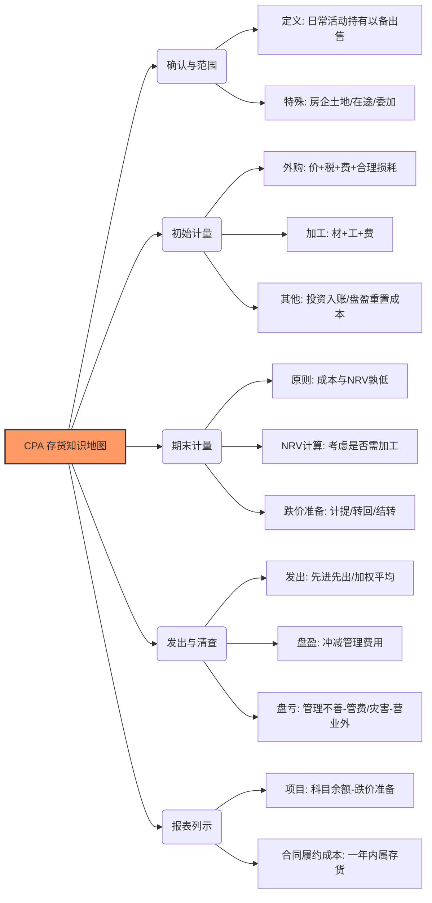

---
{"publish":true,"created":"2025-11-27T19:25:48.000+08:00","modified":"2026-01-02T11:01:09.990+08:00","tags":["note","CPA/会计"],"cssclasses":""}
---





## 一、存货的概念

**存货的定义**：企业在日常活动中持有以备出售的产成品或商品、处在生产过程中的在产品、在生产过程或提供劳务过程中耗用的材料和物料等。

**理解1：存货是企业经营主业的商品**
- 为建造固定资产等各项工程而储备的各种材料，虽然同属于材料，但由于用于建造固定资产等各项工程不符合存货的定义，因此不能作为企业的存货，应在"工程物资"科目核算。
- 如果企业是房地产企业，其主业是建楼销售，那么预计作为商品销售的楼盘及土地和工程材料都属于存货。一般以"开发产品（开发成本）"二级科目列示。
- **注意**：房地产开发企业取得的土地使用权用于建造对外出售的房屋建筑物，相关的土地使用权及地上建筑物，均属于房地产开发企业存货的范畴。

- 相关链接：[[会计归纳/土地使用权的入账]]

**理解2.：所有权未转移的存货**
1. **发出商品（委托代销商品）**：指企业未满足收入确认条件但已发出的商品，如采用支付手续费方式委托其他单位代销的商品。发出商品符合存货的定义，作为企业的存货进行核算。
2. **委托加工物资**：指企业委托外单位加工的各种材料、商品等物资。委托加工物资符合存货的定义，应作为委托企业的存货进行核算。
3. **在途物资**：指企业采用实际成本进行材料、商品等物资的日常核算，货款已付但尚未验收入库的各种物资。在途物资符合存货的定义，应作为企业的存货进行核算。

> [!example]- 例题
> 下列属于企业存货的有（　）。
> - A.房地产企业持有以备增值转让的土地
> - B.受托加工的材料
> - C.受托代销的商品
> - D.明知对方发生严重财务困难，仍发出商品
> 
> **【答案】** AD
> 选项A，房地产企业持有以备增值转让的土地作为存货核算，非房地产企业持有以备增值转让的土地作为投资性房地产核算；

## 二、存货的初始计量
### 1. 外购存货的成本

外购存货的成本即存货的采购成本，指企业物资从采购到入库前所发生的相关支出，包括购买价款、相关税费、运输费、装卸费、保险费以及其他可归属于存货采购成本的费用。

**理解1：关于相关税费**
- 是指企业购买、自制或委托加工存货发生的进口关税、消费税、资源税和不能从销项税额中抵扣的增值税进项税额等应计入存货采购成本的税费。
- **反向记忆**：能从销项税额中抵扣的增值税进项税额不计入存货成本。
- **具体税费包括**：
  1. 企业进口存货交纳的进口关税
  2. 企业进口应交消费税的存货交纳的消费税
  3. **委托加工应税消费品**收回后以不高于受托方的计税价格直接用于销售的，委托方应将受托方代收代缴的消费税计入委托加工物资的成本。收回后用于继续加工应税消费品，或者收回后直接对外出售但售价将高于受托方的计税价格的，加工环节的消费税不计入成本。
  4. 自产自用应税矿产品应交纳的资源税（记入"生产成本""制造费用"等科目）
  5. 小规模纳税人购入货物支付的增值税税额，应计入购入存货成本

> [!example]- 例题
> 甲公司委托乙公司为其生产一批半成品，甲公司提供原材料价值800万元，同时向乙公司支付加工费300万元，支付乙公司代扣代缴消费税金额15万元。甲公司运回该半成品发生运杂费20万元。甲公司收回继续生产A产品（为非金银首饰等的应税消费品）。至2×17年年末该半成品已全部领用，同时共发生加工成本120万元，至完工尚需支出50万元。不考虑其他因素，甲公司取得该半成品时的入账成本为（　）。
> 甲公司收回该半成品用于继续生产应税消费品，其应交消费税可以抵扣，不计入加工物资成本。因此取得半成品时的入账成本＝800＋300＋20＝1 120（万元），本题计算的是取得该半成品的入账价值，因此不考虑半成品加工成产品所发生的成本。

**理解2：存货采购过程中发生物资毁损、短缺的会计处理**
- **合理的途中损耗**：应当作为存货的其他可归属于存货采购成本的费用计入采购成本。
- **物资短缺或赔款**：从供货单位、外部运输机构等收回的物资短缺或相应赔款，应冲减所购物资的采购成本。
- **意外损失或原因不明的损耗**：因遭受意外灾害发生的损失和尚待查明原因的途中损耗，暂作为"待处理财产损溢"进行核算。查明原因并按管理权限报经批准后，根据具体情况分别处理：
  1. 如属于自然灾害导致的损失，计入营业外支出
  2. 如属于应由相关人员赔偿的损失，计入其他应收款
  3. 属于管理原因致的损失，计入管理费用
### 2. 加工取得存货的成本
  直接材料+直接人工+间接费用
  
**理解：关注制造费用**
- 与存货的生产和加工相关的固定资产季节性和修理期间的停工损失以及发生的不符合固定资产资本化后续支出条件的日常修理费用等。
- 企业在停工停产期间计提的符合存货成本确认条件的固定资产折旧和无形资产摊销等，应当计入相应存货成本。
### 3. 其他方式取得存货的成本

#### 投资者投入存货的成本
投资者投入存货的成本应当按照投资合同或协议约定的价值确定，但合同或协议约定价值不公允的除外。在投资合同或协议约定价值不公允的情况下，按照该项存货的公允价值作为其入账价值，存货的公允价值与投资合同或协议约定的价值之间的差额计入**资本公积**。
#### 盘盈存货的成本
盘盈的存货应按其重置成本作为入账价值，并通过"待处理财产损溢"科目进行会计处理。按管理权限报经批准后，根据具体情况分别处理。

## 三、期末存货的计量
### 1. 存货期末计量及存货跌价准备计提原则

- **计提原则**：资产负债表日，存货按照**成本与可变现净值孰低**计量。
- **可变现净值的确定**：
    - **直接用于出售的存货**（如库存商品）：可变现净值 = 估计售价 - 估计销售费用及相关税费。
    - **需要加工的材料存货**：
        - 若终端产品未减值：材料按成本计量，不计提准备。
        - 若终端产品已减值：材料可变现净值 = 终端产品估计售价 - 至完工时估计将要发生的成本 - 估计销售费用及相关税费。

> [!example]- 例题
> 甲公司是一家服装生产销售公司。2×18年12月31日，其存在一批专门用于生产M款式服装的布料，该布料的成本为500万元，未计提存货跌价准备。该布料年末市场销售价格为480万元。由于该服装的仿制品大量出现，使其销量和销售价格下降。该服装的销售价格为800万元，预计销售发生的相关税费总计为50万元。该布料生产为M服装尚需发生成本360万元。假定不考虑其他因素，计算该批布料的可变现净值为（　）。
> 该布料是用于生产M服装的，应该以终端产品M服装的销售价格为基础确定其可变现净值的金额。首先判断M服装是否发生了减值。  
M服装的成本＝500＋360＝860（万元），M服装可变现净值＝800－50＝750（万元），成本大于可变现净值，因此M服装发生了减值，其布料也相应发生了减值。  
布料的可变现净值＝800－50－360＝390（万元）

### 2. 可变现净值的计算

**公式**：可变现净值 = 估计售价 － 至完工时估计将要发生的成本 － 估计销售税费

 **存货估计售价的确定**
1. 合同价格
2. 市场销售价格
3. 资产负债表日同一项存货中一部分有合同价格约定、其他部分不存在合同价格的，应当分别确定其可变现净值，并与其相应的成本进行比较，分别确定存货跌价准备的计提或转回的金额，由此计提的存货跌价准备不得相互抵销。
4. 资产负债表日至财务报告批准报出日之间存货售价发生波动的，如有确凿证据表明其对资产负债表日存货已经存在的情况提供了新的或进一步的证据，则在确定存货可变现净值时应当予以考虑。
### 3. 存货跌价准备的计提

```
借：资产减值损失 —— 计提的存货跌价准备
    贷：存货跌价准备
```
- **科目属性**：“资产减值损失”属于损益类科目，影响当期营业利润；“存货跌价准备”是存货的抵减科目，列示在资产负债表的“存货”项目中。
### 4. 存货跌价准备的转回

```
借：存货跌价准备
    贷：资产减值损失 —— 计提的存货跌价准备
```
- **转回条件**：存货在符合条件的情况下可以转回计提的存货跌价准备。存货跌价准备转回的条件是以前减记存货价值的影响因素已经消失，而不是在当期造成存货可变现净值高于成本的其他影响因素。
- **转回金额**：当符合存货跌价准备转回的条件时，应在原已计提的存货跌价准备的金额内转回。转回的存货跌价准备与计提该准备的存货项目或类别应当存在直接对应关系，但转回的金额以将存货跌价准备余额冲减至零为限。
- 相关链接：[[哪些资产减值能够转回？]]

## 四、发出存货的计量

1. 先进先出法
2. 移动加权平均法
3. 月末一次加权平均法
4. 个别计价法

- 企业计提了存货跌价准备，如果其中有部分存货已经销售，则企业在结转销售成本时，应同时结转对其已计提的存货跌价准备。
- 会计分录示例：
   ```
   借：存货跌价准备
   贷：主营业务成本 /其他业务成本
   ```

```
合并
借：主营业务成本 / 其他业务成本
    存货跌价准备
    贷：库存商品 / 原材料等
```
## 五、存货的清查盘点

### 1. 存货盘盈的会计处理
| 盘盈原因                             | 会计处理                          |
| -------------------------------- | ----------------------------- |
| （1）属于自然溢余（如某些作为存货的化学品）           | 调整库存存货数量以及存货的单位成本             |
| （2）属于重大会计差错                      | 按照会计政策、会计估计变更和差错更正准则的规定进行会计处理 |
| （3）属于其他原因导致的盘盈（如属于日常收发计量且不重大的差错） | 按重置成本冲减当期管理费用或计入营业外收入         |
### 2. 存货盘亏的会计处理

| 盘亏原因                            | 会计处理                                                                                                                                                                                                                                                                                            |
| ------------------------------- | ----------------------------------------------------------------------------------------------------------------------------------------------------------------------------------------------------------------------------------------------------------------------------------------------- |
| （1）属于计量收发差错等原因造成的存货短缺           | ①因计量收发差错等原因造成存货短缺时，<br>借：待处理财产损溢<br>贷：原材料/库存商品<br><br>②按管理权限报经批准后，<br>借：管理费用（净损失）<br>其他应收款<br>银行存款/原材料（残料价值）<br>贷：待处理财产损溢                                                                                                                                                                       |
| （2）属于管理不善的原因造成存货被盗、丢失、霉烂变质产生的损失 | ①因管理不善的原因造成存货短缺时，<br>借：待处理财产损溢<br>贷：原材料/库存商品<br>应交税费—应交增值税（进项税额转出）<br><br>②按管理权限报经批准后，<br>借：管理费用（净损失）<br>其他应收款<br>银行存款/原材料（残料价值）<br>贷：待处理财产损溢<br><br>【提示】因管理不善的原因造成存货被盗、丢失、霉烂变质产生的损失，属于税法规定的“非正常损失”，相关的进项税额不得从销项税额中抵扣。《增值税暂行条例》规定：非正常损失，是指因管理不善造成货物被盗、丢失、霉烂变质，以及因违反法律法规造成货物或者不动产被依法没收、销毁、拆除的情形。 |
| （3）属于自然灾害等非常原因造成的存货毁损           | ①因自然灾害等非常原因造成存货毁损时，<br>借：待处理财产损溢<br>贷：原材料/库存商品<br><br>②按管理权限报经批准后，<br>借：营业外支出（净损失）<br>其他应收款<br>银行存款/原材料（残料价值）<br>贷：待处理财产损溢                                                                                                                                                                      |
| （4）属于重大会计差错                     | 按照会计政策、会计估计变更和差错更正准则的规定进行会计处理                                                                                                                                                                                                                                                                   |
> [!example]- 例题
> 甲公司2×20年发生的有关交易或事项如下：  
> （1）因管理不善造成存货短缺10万元，原进项税额1.3万元，扣除过失人的赔偿后，确认盘亏净损失为6万元；  
> （2）属于日常收发计量且不重大的差错导致存货盘盈14万元；  
> （3）生产车间计算出来的水电费的金额为12万元（相关存货尚未对外出售），管理部门计算出来的水电费的金额为13万元；  
> （4）由于自然灾害的原因造成存货发生盘亏损失的金额为20万元，原进项税为2.6万元。  
> 甲公司的上述交易或事项影响2×20年营业利润的金额为（　）。
> 
> （1）因管理不善造成的存货短缺，扣除过失人的赔偿后的净损失是计入到“管理费用”中的。  
借：管理费用 6  
　　贷：待处理财产损溢 6  
（2）属于日常收发计量且不重大的差错导致存货盘盈：  
借：待处理财产损溢 14  
　　贷：管理费用14  
（3）对于生产车间的水电费是计入到制造费用中的，管理部门的水电费是计入到管理费用中的。最后结转入存货账面价值中，且并未销售，因此还未结转成本，是不影响营业利润的。  
（4）因为自然灾害造成的损失是计入到“营业外支出”中的，不影响营业利润。  
所以影响营业利润的金额＝－6（1）＋14（2）－13（3）＝－5（万元）。

## 六、存货的列示与披露

在资产负债表中，对于“存货”项目，企业应当根据“材料采购”“在途物资”“原材料”“库存商品”“发出商品”“委托加工物资”“周转材料”“生产成本”“合同履约成本（初始确认时摊销期限不超过一年或一个正常营业周期)”等科目的期末余额合计，减去“存货跌价准备”“合同履约成本减值准备”“商品进销差价”等科目期末余额后的金额填列；对材料采用计划成本核算的企业，还应按加或减“材料成本差异”科目期未余额后的金额填列。

> [!example]- 2022年单选题
> 甲公司采购的原材料加工成产成品后对外销售。2×20年甲公司发生的有关交易或事项如下：  
> （1）采购原材料支付购买价款100万元，入库前发生运输费用2万元。  
> （2）加工成本20万元，其中非正常消耗物料1万元。  
> （3）产成品运至客户处发生运输费用3万元。截至2×20年12月31日，产成品的控制权尚未转移给客户。  
> 不考虑其他因素，2×20年12月31日，甲公司资产负债表中存货列示的金额是（）。  
> A. 124万元  
> B. 120万元  
> C. 121万元  
> D. 122万元  
> **【答案】A**  
> **【解析】**  
> 2×20年12月31日，甲公司资产负债表中存货列示的金额=100（原材料价款）+2（入库前运输费）+（20-1）（加工成本-非正常消耗）+3（产成品运输费）=124（万元），选项A正确。  

> [!faq]- 什么是合同履约成本？
> 简单来说，"合同履约成本"是企业为了履行某份合同（做完这单生意）而发生的成本。在会计准则（特别是新的收入准则）下，它不仅仅是简单的"支出"，而是一个特定的概念：如果这些支出符合一定条件，它们会被确认为一项资产，而不是当期直接计入费用的"亏损"。
> 
> #### 1. 核心定义：这笔钱花在哪里了？
> 
> 当一家公司接了一个订单或项目，为了把产品做出来或者把服务提供给客户，必须先垫付一些成本。如果这笔支出同时满足以下三个条件，它就是"合同履约成本"：
> - **直接相关**：这笔钱是专门为了这个特定的合同（或预期的合同）花的。
> - **资源增值**：这笔支出增加了企业未来用来履行义务的资源（比如备好了料、搭好了平台）。
> - **可收回**：企业预期通过收客户的钱，能把这笔成本赚回来。
> 
> #### 2. 哪些算，哪些不算？（关键区分）
> 
> | 分类 | 具体例子 (通常计入履约成本) | 具体例子 (通常不计入，直接算作当期费用) |
> |------|---------------------------|----------------------------------------|
> | **人工** | 为了这个项目专门工作的员工工资、奖金。 | 总部的管理人员、行政人员工资（属于管理费用）。 |
> | **物料** | 专门为这个项目采购的原材料、零件。 | 仓库里通用的、非特定项目的库存损耗。 |
> | **分包** | 支付给第三方分包商的费用。 | - |
> | **其他** | 明确由客户承担的差旅费、专用设备折旧费。 | 竞标时的差旅费（没签合同前）、非正常的浪费（如原材料报废）。 |
> | **过去 vs 未来** | - | 与过去已经完成的服务相关的支出（不能算作未来的资产）。 |
> 
> **注意区分**：
> - **合同取得成本**：为了拿到合同花的钱（比如销售佣金）。如果预计可收回，这通常也是一种资产，但叫"合同取得成本"。
> - **合同履约成本**：为了执行合同花的钱。
> 
> #### 3. 会计处理原因
> 
> 你可能会问："为什么不直接把钱算作当月的支出，非要搞个'履约成本'？" 这遵循了会计上的**配比原则 (Matching Principle)**：
> 
> - **如果不这样做**：假设你接了一个为期 3 年的工程。第一年你一直在花钱买材料、发工资（成本巨高），但还没给客户交付（收入为 0）。那样你第一年的财报会显示巨额亏损，这不能真实反映业务情况。
> - **这样做的好处**：你把这些成本先"存"在资产负债表的"合同履约成本"里（作为一项资产）。等到第二年、第三年你确认收入的时候，再把这部分资产慢慢摊销转化为成本。这样，收入和成本就在时间上对应起来了。
> 
> #### 4. 会计列示
> 
> - **如果预计摊销期在一年（或一个正常营业周期）以内**：期末余额会填列在"存货"这一行里。
>   - **原因**：本质上它和库存商品一样，都是企业为了卖钱而持有的"资产"，很快就会变成成本，所以归在存货里看最直观。
> - **如果预计摊销期在一年以上**：它就不能放存货了，要填列在"其他非流动资产"这一行里。
> 
